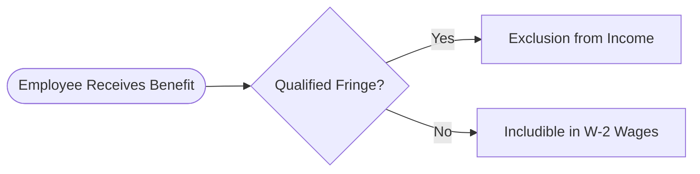

## 3.1 Advanced Inclusions & Exclusions (Fringe Benefits, Compensation Structures)

Building upon the fundamentals of income recognition, this section delves deeply into advanced inclusions and exclusions in gross income, with a particular focus on fringe benefits and compensation structures. We highlight less-common items, underscore critical timing issues for incentive stock options (ISOs) vs. nonqualified stock options (NSOs), and discuss noteworthy exceptions such as the foreign earned income exclusion. 

These advanced considerations are crucial for CPA candidates tackling the Uniform CPA Examination’s Tax Compliance and Planning (TCP) section—particularly for those areas that tend to feature intricate rules, exceptions, and nuanced interactions between employer-provided benefits and employee taxation.

--------------------------------------------------------------------------------
## Understanding Fringe Benefits: A Comprehensive Overview

Fringe benefits are noncash compensations or services that employers provide to employees. Although many of these benefits can be excluded from an employee’s gross income if they meet certain criteria, missteps in classification or documentation can result in unintended tax consequences. The Internal Revenue Code (IRC), particularly Section 132, governs many types of fringe benefits, while other provisions (e.g., IRC §119 for meals and lodging) also come into play. 

### Common Categories of Fringe Benefits

1. No-Additional-Cost Services:  
   When an employer offers services to employees without significantly increasing the employer’s costs—often in industries such as airlines (employee standby tickets) or hotels (vacant hotel rooms)—these benefits typically are excluded from income if the employer does not lose revenue and the services are of the same line of business in which the employee works.

2. Qualified Employee Discounts:  
   Employees may purchase goods or services from their employer at a discount without being taxed, provided the price reduction does not exceed certain thresholds. For goods, the discount cannot exceed the gross profit percentage; for services, the discount must not exceed 20% of the normal selling price.

3. Working Condition Fringe:  
   Benefits that, had the employee paid for them personally, would have been deductible as a business expense (e.g., certain professional subscriptions, job-related education) are generally excluded from income.

4. De Minimis Fringe:  
   Minimal-value items (coffee in the breakroom or occasional personal use of office equipment, for example) can be excluded due to the administrative impracticality of accounting for them.

5. Qualified Transportation Fringe:  
   This includes transit passes, qualified parking, and vanpooling. The monthly allowable excludable amounts frequently change with inflation adjustments. Once the amounts exceed statutory thresholds, or do not meet the qualification requirements, the excess must be included in the employee’s taxable wages.

6. Employer-Provided Meals & Lodging:  
   Under IRC §119, the value of meals furnished on the employer’s business premises for the employer’s convenience can be excluded from income. Similarly, lodging provided as a condition of employment—where the employee must accept the lodging to properly perform their duties—can also be excluded.

7. Group-Term Life Insurance:  
   Employers often provide group-term life insurance up to a set coverage limit (generally $50,000). The cost of coverage above that amount is taxable to the employee and typically reported on the Form W-2.

8. Educational Assistance:  
   Qualified educational assistance programs, covering ample education costs (tuition, fees, books, supplies), up to a statutory cap per year, can be excluded from income. This category does not cover meals, lodging, or certain tools required for courses.

9. Cafeteria Plans (IRC §125) and Flexible Spending Accounts (FSAs):  
   Employees can choose from a menu of benefits (e.g., health insurance, dependent care assistance, adoption assistance, etc.). Deductions for such benefits often occur pre-tax, lowering the employee’s taxable wage base when structured correctly.

### Noncash Fringe Benefits and Valuation

While some fringe benefits are straightforward in their inclusion or exclusion determinations, many are more nuanced. Noncash or in-kind benefits, such as company-provided stock or personal use of a corporate vehicle, often require specific valuation processes:

• Personal Use of Company Car: The value must be determined based on either the lease valuation rule, the cents-per-mile rule, or the commuting valuation rule, depending on the car’s usage and the circumstances of employment.  
• Stock-Based Fringe: If the employer provides restricted stock or other equity interests at a discount, the difference between fair market value (FMV) and the employee’s purchase price is potentially includible in income upon vesting or transfer, depending on the underlying stock plan and IRC §83(b) elections.

Below is a simplified diagram illustrating how fringe benefits are typically assessed for tax inclusion:

--------------------------------------------------------------------------------
## Stock Options: ISO vs. NSO

Stock options are a popular form of compensation, particularly in start-ups and high-growth companies. They give employees the right to buy shares of their employer’s stock at a specific price (the strike price) for a set period. The tax treatment, however, varies significantly depending on whether the option qualifies as an Incentive Stock Option (ISO) under IRC §422 or is a Nonqualified Stock Option (NSO).

### Incentive Stock Options (ISOs)

• Grant Requirements: To be treated as ISOs, options must meet strict statutory rules, including the requirement that the strike price be at least equal to the FMV of the stock on the grant date.  
• No Immediate Inclusion at Grant: Under standard ISO rules, the employee generally does not recognize ordinary income upon the grant or upon the exercise of the option (unless they engage in a disqualifying disposition).  
• AMT Implications: Although no regular tax liability arises at exercise, the difference between the FMV of the shares at exercise and the exercise price is considered a potential preference item for Alternative Minimum Tax (AMT). Employees may incur AMT if their overall AMT liability is higher than regular tax for that year.  
• Disposition Requirements: If the employee holds the stock for at least two years from the grant date and one year from the exercise date, the entire gain upon sale is taxed as long-term capital gain. However, any early sale or failure to meet these holding periods triggers a “disqualifying disposition,” causing the spread to be taxed in part as ordinary income.

### Nonqualified Stock Options (NSOs or NQSOs)

• Inclusion at Exercise: In contrast to ISOs, NSOs do not have preferential tax rules. The difference between the FMV of the stock on the exercise date and the strike price is typically treated as ordinary compensation and reported on the employee’s Form W-2.  
• Employer Benefits: Employers generally receive a deduction equal to the amount of ordinary income recognized by the employee at exercise.  
• No AMT Preference: Because NSOs are included in regular income upon exercise, there is no separate AMT preference item as there is with ISOs.  
• Subsequent Gains: Any subsequent appreciation (or loss) after exercise is typically treated as capital gain (or loss) when the employee sells the stock.

### Example of ISO vs. NSO Timing

1. ISO Scenario:  
   • Grant Price = $20/share; FMV at Grant = $20/share; 500 shares granted.  
   • Exercise in Year 2 when FMV = $30/share.  
   • No ordinary income recognized at exercise (subject to potential AMT if the employee’s total preferences exceed AMT thresholds).  
   • The employee holds the shares for 1+ year post-exercise and 2+ years from grant. If they later sell at $40/share, the $20 gain per share ($40 - $20) is treated as long-term capital gain.

2. NSO Scenario:  
   • Same facts, except the options are nonqualified.  
   • At exercise in Year 2 (FMV = $30), the $10 spread ($30 - $20) is taxed as ordinary compensation income, reported on the Form W-2, and subject to withholding.  
   • If the employee later sells at $40/share, the subsequent $10 gain ($40 - $30) is taxed as capital gain (most likely long-term if held for a year or more after exercise).

--------------------------------------------------------------------------------
## Foreign Earned Income Exclusion

In certain circumstances, individuals living abroad for extended periods can exclude a portion of their foreign earned income under IRC §911, commonly referred to as the Foreign Earned Income Exclusion (FEIE). This provision prevents double taxation on income earned in foreign countries and encourages U.S. companies to remain competitive internationally.

### Eligibility Requirements

1. Tax Home: The taxpayer’s regular or principal place of business, employment, or post of duty must be in a foreign country.  
2. Bona Fide Residence Test: The individual is a bona fide resident of a foreign country for an uninterrupted period that includes a full tax year.  
3. Physical Presence Test: The taxpayer must be physically present in a foreign country or countries for at least 330 full days during any 12-month period.

### Amount Excludable

Each year, IRC §911 adjusts the excludable amount for inflation. Taxpayers may also exclude or deduct housing expenses that exceed a base amount, subject to certain statutory limits. However, claiming this exclusion can reduce the taxpayer’s eligibility for certain credits or reduce the allowable contributions to an individual retirement account (IRA), so planning is critical.

### Example of Foreign Earned Income Exclusion Calculation

Suppose a U.S. taxpayer moves to Japan with a U.S.-based employer, earning $120,000 in salary. They qualify under the Physical Presence Test for the entire tax year. Assume the maximum FEIE for the year is $108,700 (hypothetical figure).

• Excludable amount: up to $108,700 from the $120,000.  
• Remaining $11,300 is subject to U.S. taxation.  
• If the taxpayer’s housing costs are considerable, a portion may also be excludable if they exceed the base housing amount.  

--------------------------------------------------------------------------------
## Practical Illustrations and Case Studies

### Case Study 1: Noncash Fringe Benefit with Vehicular Use

• Scenario: Jade is a marketing professional. Her employer provides her with a company vehicle primarily for business use. Occasionally, Jade uses the car to run personal errands.  
• Tax Implications: Jade must maintain a log of business vs. personal miles. The personal portion is a taxable fringe benefit. Depending on the arrangement, the employer might use (1) the standard mileage rate approach, (2) the annual lease valuation method, or (3) a simplified commuting method if the personal use is limited to commuting.  
• Advice: Jade should carefully maintain records to avoid overstating personal miles, while the employer verifies that the methods used for reporting comply with IRS guidelines.

### Case Study 2: Hybrid Compensation with Stock Options

• Scenario: ABC Tech issues both ISOs and NSOs to key employees, hoping to attract top-level computer engineers. John receives 1,000 ISOs and 500 NSOs as part of his total compensation.  
• Tax Implications:  
  1. If John exercises the ISOs and holds the stock for the required period, no ordinary income arises until disposition. However, the spread at exercise affects his AMT calculation.  
  2. When John exercises the NSOs, any spread must be recognized as ordinary income immediately and is subject to payroll tax withholding.  
• Advice: John should coordinate carefully with his tax advisor to minimize or plan around potential AMT cost from the ISO exercise, consider the timing of sales, and manage cash flow to cover potential tax liabilities from NSO exercises.

### Case Study 3: Foreign Assignment & FEIE Pitfalls

• Scenario: Sarah, a U.S. citizen, moves to France for 10 months to manage her employer’s new European office. She returns to the U.S. for three weeks at a time, multiple times per year.  
• Tax Implications: Because Sarah may not meet the Physical Presence Test (330 full days in a foreign country within a 12-month period) and does not meet the Bona Fide Residence Test (less than a full tax year abroad), she might only partially qualify for the foreign earned income exclusion—or not at all.  
• Advice: Sarah should maintain meticulous travel records. She might be able to adjust her travel days or adopt a different 12-month window to optimize qualification for the FEIE. Alternatively, partial year calculations can apply if she has enough consecutive days abroad that fit a 12-month window.

--------------------------------------------------------------------------------
## Best Practices and Common Pitfalls

• Documentation: Whether dealing with fringe benefits, stock compensation, or foreign assignments, a lack of supporting documentation is the easiest way to trigger IRS scrutiny. Maintain detailed logs, receipts, and records of business usage.  
• Timely Elections: Missing an IRC §83(b) election (for restricted stock) or failing to file timely notices for foreign earned income can lead to unnecessary taxation and complexities.  
• AMT Awareness: For employees with ISOs, always consider the AMT implications when exercising a large batch of options. Caught by surprise, some employees face unexpected tax bills while their cash flow remains tied up in company stock.  
• Overlooked Fringe Benefits: Even small, de minimis items can add up when scaling across large groups of employees. For instance, forgetting to recognize employees’ personal use of employer-provided property can result in inaccurate W-2 reporting.

--------------------------------------------------------------------------------
## Strategies for CPAs and Exam-Takers

• Cross-Referencing IRC & Regulations: As with all tax topics, accurate interpretation of the IRC, Treasury Regulations, IRS guidance, and relevant court cases is pivotal. Chapters 2.1 (Overview of the IRC) and 2.2 (Navigating Administrative Guidance) in this text can serve as references.  
• Systematic Computations: Practice systematically computing includible amounts for stock option spreads or personal use of employer-provided property. CPA exam simulations often require swift yet accurate calculations.  
• Planning & Analysis: For real clients, planning around the timing of stock option exercises, especially with ISOs, can reduce or eliminate AMT woes. Similarly, for employees on foreign assignments, shaping travel dates to maximize or preserve eligibility for the FEIE is vital.  
• Seek Clarifications: As tax laws change, remain vigilant about legislative updates—particularly those involving fringe benefit caps, housing exclusion thresholds for FEIE, or changes to the AMT. Chapter 20 (Recent Legislative Developments & Sunset Provisions) covers how to handle such evolving provisions.

--------------------------------------------------------------------------------
## References for Further Exploration

• IRS Publication 15-B: Employer’s Tax Guide to Fringe Benefits  
• IRS Publication 525: Taxable and Nontaxable Income  
• IRC §132: Certain Fringe Benefits (no-additional-cost services, qualified employee discounts, etc.)  
• IRC §§421–424: Statutory rules governing ISOs  
• IRC §911 & IRS Publication 54: Foreign Earned Income Exclusion  
• AICPA Tax Section and Journal of Accountancy articles on stock compensation  
• Online course: [TCP CPA Hardest Mock Exams: In-Depth & Clear Explanations](https://www.udemy.com/course/tcp-cpa-mock-exams/?referralCode=675149871D0E79B1699C) for robust question banks and deeper insights.

--------------------------------------------------------------------------------
## SEO-Optimized Quiz: Test Your Knowledge of Advanced Fringe Benefits & Compensation Structures



### Which of the following fringe benefits is most likely excludable from an employee’s income under IRC §132?
- [ ] A free vacation trip to the Caribbean offered to all employees unconditionally.  
- [x] The use of company-provided workplace gym facilities for employees only.  
- [ ] Executive lodging near vacation resorts for personal enjoyment.  
- [ ] 40% discount on services when the normal discount for customers is 10%.  

> **Explanation:** Qualified athletic facilities located on an employer’s premises, available exclusively to employees, typically qualify as excluded working condition or de minimis benefits. A free vacation trip is generally taxable, and excessive discounts exceeding typical limitations are also taxable.

### Which best describes the main difference between an ISO and an NSO regarding federal tax treatment for employees?
- [x] ISOs may be subject to AMT at exercise while NSOs cause immediate ordinary income upon exercise.  
- [ ] NSOs allow all gains to be deferred until the final sale of stock.  
- [ ] ISOs do not require any holding period to qualify for preferential treatment.  
- [ ] Exercise of an ISO always results in capital gain treatment.  

> **Explanation:** ISOs are typically not subject to ordinary income tax at exercise, but the spread may count toward AMT preference items. NSOs generate ordinary income for the spread upon exercise.

### A U.S. taxpayer who works abroad for 340 days in a 12-month period may qualify for the Foreign Earned Income Exclusion under:
- [ ] Bona Fide Residence Test only.  
- [ ] No test, as the taxpayer has partial presence.  
- [x] Physical Presence Test.  
- [ ] Substantial Presence Test.  

> **Explanation:** For the FEIE, a taxpayer can qualify by being physically present in a foreign country for at least 330 full days in a consecutive 12-month period. Here, 340 days meets the threshold.

### Under group-term life insurance rules, the first $50,000 of coverage:
- [x] Is generally excluded from the taxable income of the employee.  
- [ ] Must be reported as taxable compensation to the employee.  
- [ ] Is subject to AMT if combined with other benefits.  
- [ ] Is a de minimis fringe benefit capped at $2,500 annually.  

> **Explanation:** IRC guidelines exclude the cost of the first $50,000 of group-term life coverage from the employee’s income. Amounts in excess become taxable.

### When determining the taxable portion of personal use of a company-provided car, what recordkeeping method is standard best practice for compliance?
- [x] Maintaining a mileage log or diary that separates personal from business use.  
- [ ] Relying solely on the total annual miles and guessing personal usage.  
- [x] Using an employer’s automated telematic system, if available, for precise tracking.  
- [ ] Charging employees the total cost of fuel as a lump sum.  

> **Explanation:** Accurate recordkeeping, typically via a mileage log or an automated system, is essential to distinguish between personal and business usage. Without a detailed log, the entire benefit can be reclassified as taxable income.

### Which of the following is a disadvantage of claiming the Foreign Earned Income Exclusion (FEIE)?
- [x] It can reduce the taxpayer’s ability to claim certain credits or deductions.  
- [ ] It automatically lowers Social Security taxes.  
- [ ] It exempts the taxpayer from state tax obligations.  
- [ ] It has no effect on the taxpayer’s overall tax liability.  

> **Explanation:** Although the FEIE can reduce taxable income, it may also reduce eligibility for certain credits (like the Child Tax Credit) or constraints on IRA contributions, potentially affecting overall tax outcomes.

### After exercising ISOs, an employee sells the shares 13 months later but soon discovers it was a “disqualifying disposition.” What is the likely reason?
- [x] The employee did not meet both holding-period requirements for ISOs.  
- [ ] The strike price was less than the FMV on the grant date, so it wasn’t a valid ISO.  
- [x] The employee was not subject to AMT.  
- [ ] The shares were transferred to a family trust.  

> **Explanation:** ISOs require a minimum of 1 year from exercise and 2 years from grant before sale. Selling within these periods causes a disqualifying disposition, triggering ordinary income on part of the gain.

### When an NSO is exercised, the difference between the exercise price and the FMV of the stock on the exercise date is:
- [x] Taxable as ordinary compensation income.  
- [ ] Excluded as a fringe benefit.  
- [ ] Subject to capital gains rates at the time of exercise.  
- [ ] Not recognized until the stock is sold.  

> **Explanation:** NSOs are taxed at exercise, with the spread (FMV – strike price) treated as ordinary compensation subject to withholding and payroll taxes.

### Meals for employees provided at the employer’s place of business can be excluded from income if:
- [x] The meals are provided for the convenience of the employer.  
- [ ] Employees pay half of the meal’s cost.  
- [ ] They are provided without any justification.  
- [ ] The meals are always considered de minimis.  

> **Explanation:** Under IRC §119, meals provided on the employer’s premises for a valid business reason (e.g., requiring an employee to be available for emergency service) can be excluded from income.

### A no-additional-cost service fringe benefit typically requires:
- [x] The service be available for sale to nonemployee customers in the same line of business.  
- [ ] The service be offered only to management-level employees.  
- [ ] The service be offered to customers at the same price as employees.  
- [ ] The employee to pay a nominal fee.  

> **Explanation:** A no-additional-cost service is one the employer already offers to customers in the normal line of business, and it must not cause substantial additional cost to the employer when extended to employees.



--------------------------------------------------------------------------------
## For Additional Practice and Deeper Preparation

**[TCP CPA Hardest Mock Exams: In-Depth & Clear Explanations](https://www.udemy.com/course/tcp-cpa-mock-exams/?referralCode=675149871D0E79B1699C)**  

**Tax Compliance & Planning (TCP) CPA Mocks:** 6 Full (1,500 Qs), Harder Than Real! In-Depth & Clear. Crush With Confidence!

- Tackle full-length mock exams designed to mirror real TCP questions.  
- Refine your exam-day strategies with detailed, step-by-step solutions for every scenario.  
- Explore in-depth rationales that reinforce higher-level concepts, giving you an edge on test day.  
- Boost confidence and minimize anxiety by mastering every corner of the TCP blueprint.  
- Perfect for those seeking exceptionally hard mocks and real-world readiness.

_Disclaimer: This course is not endorsed by or affiliated with the AICPA, NASBA, or any official CPA Examination authority. All content is for educational and preparatory purposes only._
