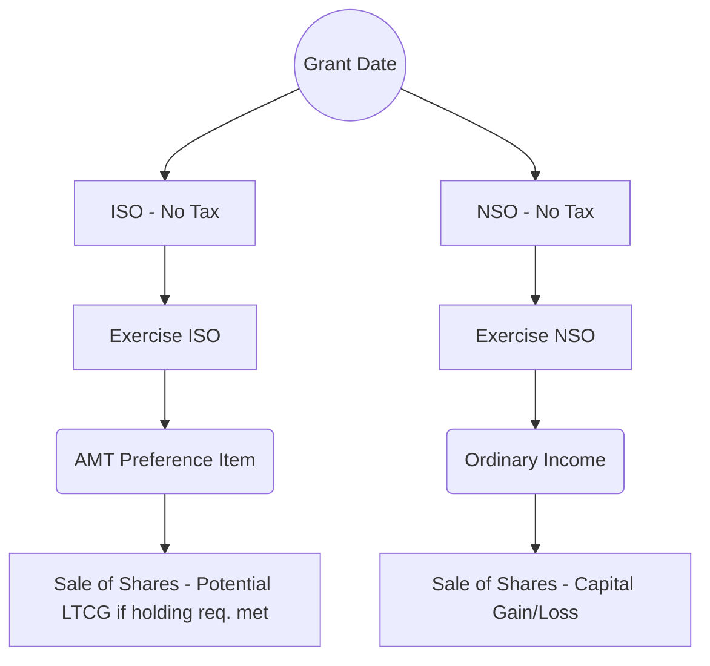

## 3.3 Stock Options & Equity Compensation Nuances (ISO, NSO)

Equity-based compensation has become a central component of many companies’ compensation strategies, offering employees and service providers the opportunity to share in corporate growth while potentially receiving certain tax benefits. Stock options are among the most prevalent forms of equity compensation, with Incentive Stock Options (ISOs) and Nonqualified Stock Options (NSOs) frequently utilized in both public and private companies. Successful navigation of the differing tax rules for each type of option requires in-depth knowledge of timing, substantiation, holding-period requirements, and possible complications such as the Alternative Minimum Tax (AMT).

This section provides a detailed analysis of ISOs and NSOs, emphasizing tax treatment at grant, vesting, and exercise. Special attention is given to pitfalls like ISO disqualifying dispositions and AMT triggers, which can significantly impact an individual’s overall tax liability.

### Understanding Key Terminology

Before exploring the nuances of ISO and NSO taxation, it helps to clarify a few essential terms:

• Grant Date: The date on which an individual (employee or service provider) is awarded the right to purchase shares at a specified price (the exercise price).  
• Vesting: The process by which an individual gains the legal right to exercise an option after meeting certain time or performance-based conditions.  
• Exercise Price (Strike Price): The price at which an individual may purchase shares upon exercising the option. This is usually established at or near the fair market value (FMV) on the grant date, particularly for ISOs.  
• Exercise: The act of purchasing the shares at the exercise price, thereby converting the stock option into actual stock.  
• Sale (Disposition): The eventual transfer of the stock to a third party, which can trigger capital gain or loss recognition depending on the stock’s holding period and the type of option.

Below is a high-level flowchart showing the typical stages in the life of a stock option—grant, vesting, exercise, and sale:

### Incentive Stock Options (ISOs)

ISOs are a special category of stock options that, if structured and executed properly, can offer employees favorable tax treatment. ISOs are governed by specific criteria under the Internal Revenue Code (IRC §422). Failure to adhere to these requirements can result in the option being treated as a Nonqualified Stock Option, losing the favorable tax benefits.

#### Requirements for ISOs

• They must be granted under a formal written plan approved by shareholders.  
• They must have a strike price that is at least equal to the FMV of the underlying shares on the grant date.  
• The option can only be awarded to employees (not consultants or independent contractors).  
• The option must not be exercisable for more than 10 years from the grant date (5 years if granted to certain large shareholders).  
• There are individual annual limits on the aggregate FMV of stock (determined on the grant date) that can vest under ISOs in any calendar year (generally $100,000).

Meet these criteria, and the option retains its ISO status. For an ISO, no ordinary income is recognized at grant or at vesting. The crucial tax events center on exercise and subsequent sale of the shares.

#### Tax Treatment at Grant

No regular tax implications arise from either the grant or vesting of an ISO, provided the exercise price is set at or above FMV on the grant date. Employees merely hold the potential right to buy shares in the future at a locked-in exercise price.

#### Tax Treatment at Exercise

When an ISO is exercised, under regular income tax rules there is no immediate recognition of ordinary income. However, the “bargain element” (the difference between the stock’s FMV at exercise and the exercise price) may be considered an AMT preference item. This means that, although it is not subject to regular income tax at exercise, it could create or increase AMT liability, depending on the taxpayer’s overall circumstances. (For a detailed look at AMT calculations and adjustments, see Chapter 4.3 on AMT Mechanics & Planning.)

For example, say an ISO’s exercise price is $10, and the FMV at exercise is $25. The individual exercises 1,000 shares. Under regular income tax rules, no income is recognized yet. However, for AMT purposes, a preference item of $15,000 (1,000 shares × ($25 – $10)) is recognized, potentially triggering an AMT liability.

#### Holding Period and Potential for Capital Gain Treatment

If the individual meets both statutory holding periods for ISO shares, any gain on the eventual sale is treated as a long-term capital gain rather than ordinary compensation income. The two statutory holding periods are:

• The shares must be held for more than two years from the grant date.  
• The shares must be held for more than one year after exercise.

If these rules are satisfied, upon sale the difference between the sale price and the exercise price is taxed at preferential long-term capital gains rates. If the holding periods are not satisfied—called a “disqualifying disposition”—the bargain element on the date of exercise becomes subject to ordinary income tax, and any additional gain may be subject to capital gains tax (short or long term depending on the post-exercise holding period).

#### Disqualifying Dispositions

A disqualifying disposition may occur if the shares are sold or exchanged before satisfying the above holding periods. This can trigger immediate ordinary income recognition on the spread existing at the time of exercise. For ISOs that are sold without satisfying holding periods, the timing of the sale determines whether it becomes fully ordinary income or a combination of ordinary income and short- or long-term capital gain.

### Nonqualified Stock Options (NSOs)

NSOs are far more flexible than ISOs in terms of who can receive them (employees, board members, consultants) and how they can be structured. However, they do not benefit from the special ISO tax rules. Instead, the bargain element upon exercise is subject to ordinary income taxes and payroll taxes (FICA and FUTA, if applicable) for employees.

#### Tax Treatment at Grant and Vesting

As with ISOs, there is generally no tax when NSOs are granted or at vesting, provided the option is granted at or above the current FMV. If an NSO were granted with a strike price significantly below FMV, the option could be treated as having immediate taxable income, but this is relatively rare or subject to special valuation issues.

#### Tax Treatment at Exercise

Upon exercise, the difference between the FMV and the exercise price is recognized as ordinary income and is subject to federal, state, and local income taxes, plus relevant payroll taxes. The employer typically withholds taxes at exercise. The taxpayer’s basis in the shares after exercise becomes the sum of the exercise price paid plus any ordinary income recognized. Any subsequent gain (or loss) upon the sale of the shares is treated as a capital gain (or loss).

#### Comparison of ISO vs. NSO Taxation

To visualize some key differences, let’s look at a simplified flow diagram:

- Under ISO rules, no ordinary income is recognized at exercise, but the spread may be subject to AMT.  
- Under NSO rules, the spread at exercise is subject to ordinary income tax and payroll tax.  
- Both result in capital gain or loss upon the ultimate sale of shares (with the basis for ISO shares being the exercise price and the basis for NSO shares being the exercise price + the recognized ordinary income).

### Alternative Minimum Tax (AMT) Pitfalls for ISOs

The AMT can be a significant pitfall for employees who exercise ISOs and hold the shares. Because no ordinary income is recognized under regular tax rules at exercise, the taxpayer may neglect to factor in how the bargain element can create (or increase) AMT liability. This situation can be particularly severe if the individual exercises a large number of shares with a substantial spread.

If the share price subsequently declines, the taxpayer may be faced with a substantial AMT bill on a gain they have not actually realized if they continue to hold the shares. To mitigate this risk, many individuals consider a “same-day sale” or “cashless exercise” for at least a portion of their ISO shares if the potential AMT liability is projected to be very high and they are not confident in the stock’s short-term or medium-term performance.

Common AMT pitfalls include:
• Exercising a large block of ISOs all at once with a significant bargain element.  
• Failing to project potential AMT.  
• Leaving insufficient funds to pay the AMT.  
• Overlooking the possibility that subsequent share price decline provides no refunds for AMT in the year of the price drop. (In some cases, the taxpayer may claim an AMT credit in future years if they eventually owe only regular tax.)

For in-depth coverage of AMT preference items, credits, and carryforwards, see Chapter 4.3.

### Planning Considerations

• Spread Out Exercises: Rather than exercising a large portion of your ISO shares in a single year, consider spreading them across multiple tax years to minimize AMT exposure.  
• Mid-Year Forecasting: Regularly review your projected total income, deductions, and potential AMT trigger points.  
• Timing Sales: If you plan to hold shares for the preferential ISO holding period, monitor both the share price and your personal tax situation as you approach the required holding thresholds. In some cases, a disqualifying disposition at a lower ordinary rate or earlier sale might be more beneficial than a large unrealized gain with AMT implications.  
• Cashless Exercise: If you do not have available cash or are concerned about stock price volatility, consider a “cashless exercise” (simultaneous exercise and sale) to generate immediate proceeds to pay the necessary taxes and fees.  
• Documenting FMV: Carefully document the FMV of the shares at each critical point (grant, exercise, and sale). Proper valuations are essential within private companies, as future audits may question the accuracy of these valuations.

### Real-World Example

Imagine Alex, a software engineer at a startup, who received 10,000 ISOs at a strike price of $5 per share. After meeting the vesting requirements, Alex considers exercising all shares when the FMV is $25 per share. The bargain element is $20 per share, for a total of $200,000 ($25 – $5 × 10,000). If Alex does not do a same-day sale, no ordinary income tax is due immediately, but Alex may need to report this $200,000 spread as AMT income, depending on other factors in his tax return.

If the startup’s stock experiences a price dip to $8 per share shortly after Alex’s exercise, Alex has effectively locked in a significant AMT preference item. Even if the final tax computed under the AMT system is substantial, Alex now holds shares that are worth less than the AMT basis. This can result in a difficult cash-flow situation. In subsequent years, Alex may be able to recover some of the AMT as a credit against regular tax if the startup’s stock price rebounds or if Alex’s alternative minimum taxable income is lower than his regular taxable income, but this is never guaranteed.

### Common Pitfalls

• Not Reviewing AMT Calculations: Many employees incorrectly assume that no tax at exercise means no potential immediate tax consequences.  
• Failing ISO Holding Period: Selling too early can convert some or all of the gain into ordinary income, which can be particularly disadvantageous if the bargain element is substantial.  
• Overlooking Payroll Tax Treatment for NSOs: Employers will generally withhold federal and state income tax, plus Social Security and Medicare on the spread for NSOs, which can significantly reduce the net proceeds from exercise and sale.  
• Post-Exercise Price Drops: Holding onto the stock to meet ISO holding periods or for potential growth can be beneficial, but a price decline can leave taxpayers with little or no equity while still incurring AMT obligations.  
• Poor Record Keeping: In the event of an audit, incomplete documentation of FMV at exercise or mismatched cost bases can lead to disputes, additional taxes, and potential penalties.

### Best Practices

• Engage in year-round planning with a tax professional, particularly if you anticipate large exercises or are a key employee in a rapidly growing startup.  
• Plan partial exercises to avoid a single large AMT item in one tax year.  
• Keep thorough records of all relevant dates, share prices, option agreements, and holding periods.  
• Consult Chapter 4.4 regarding underpayment penalties and estimated tax safe harbors if you anticipate a high tax liability from your exercises.

### Practical Tables and Diagrams

Sometimes capturing side-by-side differences helps reinforce key concepts. The table below compares the typical tax triggers for ISOs and NSOs:

| Event          | ISO Tax Treatment                      | NSO Tax Treatment                                               |
|----------------|----------------------------------------|-----------------------------------------------------------------|
| Grant          | No income at grant.                    | No income at grant unless the strike price is below FMV.        |
| Vesting        | No income upon vesting.                | No income upon vesting.                                         |
| Exercise       | No regular tax; possible AMT trigger.  | Ordinary income on the spread, subject to income & payroll tax. |
| Sale           | Capital gain if holding requirements met; else partly/fully ordinary. | Capital gain on appreciation above exercise date FMV.           |

Use this table as a baseline reference for exam preparation, ensuring you can apply the rules to alternative scenarios, such as early-exercise stock options, disqualifying dispositions, or mid-year partial exercises.

### Additional Resources

• IRS Publication 525 (Taxable and Nontaxable Income)  
• IRS Form 6251 and Instructions (AMT Computations)  
• Chapter 4.3 (AMT Mechanics & Planning) for further detail on preference items  
• Chapter 21 (Practice & Procedure) for information on documentation, statute of limitations, and penalty mitigation  

Always verify current regulations and annual updates to the IRC, since tax thresholds, AMT exemption amounts, and other provisions are subject to legislative changes.

## Quiz: Stock Options, ISOs & NSOs Explained



### Which of the following is a key requirement that distinguishes ISOs from NSOs?
- [ ] They must be granted below fair market value.
- [x] They are only issued to employees and have a statutory holding requirement.
- [ ] They are subject to immediate payroll tax upon vesting.
- [ ] They may be freely transferred to non-employees if the plan allows.

> **Explanation:** ISOs must be granted to employees under a shareholder-approved plan and come with specific holding periods to qualify for favorable tax treatment. NSOs, on the other hand, can be issued to a broader range of individuals.

### What is the main difference in tax treatment between NSOs and ISOs at the time of exercise?
- [x] NSOs trigger ordinary income tax on the bargain element, whereas ISOs do not under regular tax rules.
- [ ] ISOs always trigger ordinary income at exercise, while NSOs do not.
- [ ] Both trigger immediate capital gains.
- [ ] Both are free from any tax consequences upon exercise.

> **Explanation:** NSOs require the recognition of ordinary income on the spread at exercise. ISOs generally do not trigger ordinary income tax at exercise (though AMT may apply).

### What is a common pitfall associated with ISO exercises in a rising market?
- [ ] Overstating ordinary income on the date of exercise.
- [x] Incurring a large alternative minimum tax liability based on the spread.
- [ ] Having to pay Social Security and Medicare taxes at exercise.
- [ ] None of the above.

> **Explanation:** A significant AMT burden may result from the bargain element when exercising ISOs in a rising market, even though no regular income tax is due immediately.

### Which statement accurately reflects disqualifying dispositions for ISOs?
- [ ] Holding the stock for more than a year always guarantees the preferential ISO treatment for capital gains.
- [x] Selling or exchanging ISO shares before meeting both the two-year and one-year holding periods can result in ordinary income for part or all of the gain.
- [ ] Disqualifying dispositions only apply to NSOs.
- [ ] Disqualifying dispositions always eliminate all profit recognized on the stock.

> **Explanation:** Failing the two statutory holding periods results in some or all of the gain becoming subject to ordinary rates instead of long-term capital gains rates.

### In the case of NSOs, what constitutes the cost basis after exercise?
- [x] The sum of the exercise price and the ordinary income recognized at exercise.
- [ ] The strike price only.
- [x] The strike price and any payroll taxes paid.
- [ ] Fair market value at the date of grant.

> **Explanation:** After exercising NSOs, your new basis in the shares is the total of the exercise price plus the ordinary income recognized on the spread. Payroll taxes do not directly increase basis, but the ordinary income portion is included in basis, and that ordinary income is subject to payroll taxes.

### Which of the following is a common technique to mitigate AMT exposure for ISOs?
- [ ] Exercising all options in a single large transaction.
- [x] Exercising ISOs incrementally over multiple tax years.
- [ ] Exercising only at the grant date.
- [ ] Selling all ISO shares within three months of vesting.

> **Explanation:** Spreading out ISO exercises across multiple years can help reduce or avoid crossing thresholds that trigger the AMT.

### In a disqualifying disposition of an ISO, how is the gain typically taxed?
- [x] As ordinary income on the spread at exercise plus potentially capital gain on subsequent appreciation.
- [ ] Entirely as capital gain with no holding requirement.
- [x] As a tax-free recovery of basis.
- [ ] Exclusively as long-term capital gain if the sale occurs more than one year from grant.

> **Explanation:** The portion of gain up to the original FMV at exercise becomes ordinary income. Any remaining gain might be treated as capital gain depending on the length of time from exercise to sale.

### For an NSO, what taxes are typically due when an employee exercises the option?
- [ ] Only federal income tax.
- [ ] Only capital gains tax.
- [x] Ordinary income tax plus relevant payroll taxes, such as Social Security and Medicare.
- [ ] No taxes are due at exercise unless there is an AMT issue.

> **Explanation:** NSOs trigger ordinary income and payroll taxes at exercise for employees. Companies typically withhold income tax and Social Security/Medicare contributions.

### How does the holding period requirement for ISOs compare to that of most long-term capital assets?
- [x] ISO rules require both more than one year after exercise and at least two years from the grant date.
- [ ] They must be held for more than three years from the grant date for favorable rates.
- [ ] They only require a three-month holding period post-exercise.
- [ ] There is no difference; both require one year from purchase.

> **Explanation:** ISO tax preference requires meeting two distinct holding requirements: at least one year from exercise and two years from grant before selling.

### When does the bargain element from an ISO exercise become part of the taxpayer's AMT income?
- [x] At the tax year of exercise, if the individual retains the shares.
- [ ] Only once the shares are sold, regardless of date.
- [ ] Never, because ISOs are not subject to AMT.
- [ ] When the stock is transferred to a qualified trust.

> **Explanation:** For AMT purposes, the spread between FMV and the exercise price is included in alternative minimum taxable income in the year of exercise if the individual does not sell the shares the same day.



---

## For Additional Practice and Deeper Preparation

[TCP CPA Hardest Mock Exams: In-Depth & Clear Explanations](https://www.udemy.com/course/tcp-cpa-mock-exams/?referralCode=675149871D0E79B1699C)

Tax Compliance & Planning (TCP) CPA Mocks: 6 Full (1,500 Qs), Harder Than Real! In-Depth & Clear. Crush With Confidence!

• Tackle full-length mock exams designed to mirror real TCP questions.  
• Refine your exam-day strategies with detailed, step-by-step solutions for every scenario.  
• Explore in-depth rationales that reinforce higher-level concepts, giving you an edge on test day.  
• Boost confidence and minimize anxiety by mastering every corner of the TCP blueprint.  
• Perfect for those seeking exceptionally hard mocks and real-world readiness.

_Disclaimer: This course is not endorsed by or affiliated with the AICPA, NASBA, or any official CPA Examination authority. All content is for educational and preparatory purposes only._
