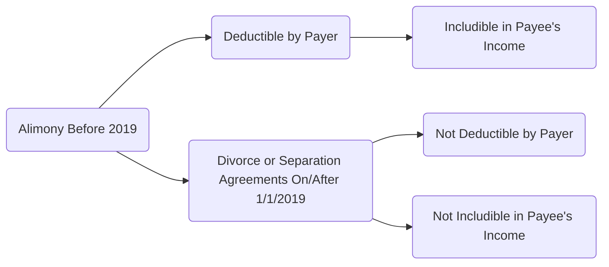
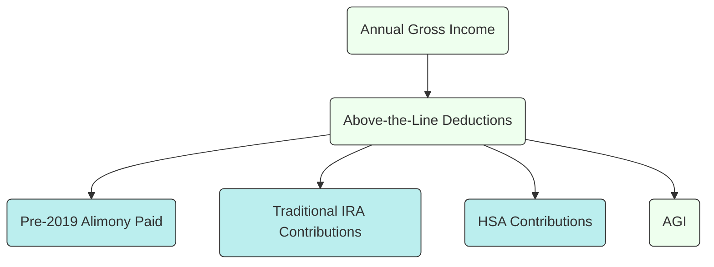

## 3.4 Alimony Post-TCJA & Other Special Adjustments

The Tax Cuts and Jobs Act (TCJA), enacted in late 2017, changed the taxation of alimony payments for divorce or separation agreements executed (or modified, under certain conditions) after December 31, 2018. Prior to the TCJA, alimony or separate maintenance payments were generally deductible for the payer and included in the recipient’s gross income. In contrast, agreements subject to the post-TCJA rules treat alimony as neither deductible by the payer nor taxable to the recipient. This shift has broad implications for how individuals calculate their adjusted gross income (AGI), as well as for negotiations in marital dissolution agreements.

In this section, we analyze how the TCJA changed the deductibility and inclusion of alimony, the critical role of settlement timing, and other special adjustments that can affect a taxpayer’s AGI. We also highlight illustrative computations and practical applications relevant for the CPA Candidate preparing for the Tax Compliance and Planning (TCP) Exam.

---

### Overview of Alimony and Its Pre-TCJA Tax Treatment

Historically, alimony paid under a divorce or separation instrument met several criteria set forth in the Internal Revenue Code (IRC §71 pre-2019 rules):

• The payment had to be in cash.  
• The payment was made under a divorce or separation decree, a separate maintenance decree, or a written separation agreement.  
• The decree or agreement did not designate such payments as “non-alimony.”  
• The spouses were not members of the same household at the time payments were made (in most cases).  
• The payer’s obligation to make payments ceased upon the death of the payee.  

Under these pre-TCJA rules:  
• The paying spouse claimed an “above-the-line” deduction for alimony paid, reducing adjusted gross income.  
• The receiving spouse included the payments in taxable income, reporting them on the appropriate line of the tax return.  

For many couples and tax planners, these rules supported a potentially tax-advantageous arrangement: typically, the payer was in a higher tax bracket, benefiting from the deduction, while the payee’s inclusion was at a comparatively lower tax rate.

---

### Post-TCJA Rules and Key Changes

The Tax Cuts and Jobs Act introduced a new reality for divorce or separation agreements executed after December 31, 2018:

• Payer of alimony can no longer deduct the payments.  
• Recipient of alimony no longer includes the payment in taxable income.  

Essentially, alimony under post-TCJA arrangements is treated similarly to child support—both parties lose the prior “tax planning” benefit that once existed.

#### Timing and Grandfathering

The TCJA’s changes to alimony only apply to divorce or separation agreements executed on or after January 1, 2019. If the original agreement was executed before that date, the pre-TCJA rules generally continue to apply unless the agreement is significantly modified after December 31, 2018, and the modification specifically states that the new tax treatment will apply. This can present a unique challenge for practitioners, as they must carefully review any modifications to older divorce agreements to determine which tax rules apply.

Below is a visual summary of how changes in timing affect alimony taxation:

---

### Implications for Adjusted Gross Income and Tax Planning

#### Payer’s Perspective

• Pre-2019 Agreements (Old Rules): Alimony lowers the payer’s AGI, creating potential secondary benefits or clawbacks—for instance, it could improve their eligibility for certain deductions and credits.  
• Post-2019 Agreements (New Rules): Alimony no longer provides an above-the-line deduction, so the payer’s AGI remains higher. This can phase them out of various credits (e.g., the Child Tax Credit or Education Credits) and reduce the benefit of other itemized deductions.

#### Recipient’s Perspective

• Pre-2019 Agreements (Old Rules): Alimony must be included in income, increasing the recipient’s taxable income and potentially affecting other benefits or deductions based on AGI thresholds.  
• Post-2019 Agreements (New Rules): The recipient no longer includes alimony in taxable income, freeing up space for other credits and possibly lowering their overall tax bill.

---

### Sample Calculations

#### Example 1: Pre-TCJA Alimony

• Bob and Carol finalize their divorce in 2018. The court orders Bob to pay Carol $24,000 per year in alimony.  
• Bob deducts $24,000 from his annual gross income of $150,000, reducing his AGI to $126,000 (assuming no other adjustments).  
• Carol receives $24,000 which she must include in her gross income of $30,000 salary, resulting in $54,000 total taxable income before deductions.

In this scenario, the deduction is beneficial to Bob—particularly because his marginal tax rate is higher—and Carol includes the alimony in her income at a lower marginal rate.

#### Example 2: Post-TCJA Alimony

• Dave and Elena finalize their divorce in 2021. The court orders Dave to pay Elena $24,000 per year in alimony.  
• Under post-2019 rules, Dave cannot deduct the $24,000. His AGI remains at his gross income level, say $150,000, subject to any other adjustments.  
• Elena receives the $24,000 but does not include it in her own taxable income.

Here, Dave loses the prior tax deduction advantage, while Elena no longer faces the burden of income tax on the amount received.

---

### Considerations for Divorce Settlement Timing

Because of the mechanism that “grandfathered in” pre-2019 agreements, careful attention to the timing of the divorce decree is critical. CPA candidates and practicing professionals should remember:

1. **Finalization Date vs. Negotiation**: A divorce might be negotiated prior to 2019 but not finalized until 2019 or later, meaning the post-TCJA rules would apply.  
2. **Modification Trap**: If an older agreement is “materially modified” after December 31, 2018, both parties must watch for language specifically opting into the new rules. If the modification explicitly states that the TCJA’s alimony rules apply, the arrangement effectively converts to post-TCJA treatment.  
3. **Recapture**: The recapture rule (a pre-existing rule) addresses “front-loading” of alimony in the first three years. For divorces and separations pre-2019, the “excess” alimony can be recaptured and taxed back to the payer. Under post-2019 rules, recapture does not apply in the same way because alimony is neither includible nor deductible.  

---

### Other Special Adjustments Above the Line

While alimony is often the most prominent adjustment in a divorce scenario, several other “above-the-line” adjustments to AGI remain relevant and might be tested on the CPA exam in the context of personal financial planning:

• **Health Savings Account (HSA) Contributions**  
• **Self-Employed Health Insurance Deduction**  
• **Deduction for Contributions to IRAs**  
• **Student Loan Interest Deduction**  
• **Educator and Performing Artist Expenses (if eligible)**  
• **Qualified Tuition and Fees Deduction (if applicable, depending on legislative renewals)**  

For example, if a taxpayer who pays significant alimony under a pre-2019 agreement can reduce AGI through the alimony deduction, it might also increase their ability to contribute or deduct HSA contributions or IRAs. Conversely, under the new rules, a higher AGI might limit or reduce certain deductions and credits.

---

### Best Practices and Common Pitfalls

1. **Confirm Agreement Execution Date**: Always verify the date of signing or the court’s final decree. Small timing misinterpretations can lead to erroneous tax return filings.  
2. **Material Modifications**: Skilled negotiation and drafting are paramount to ensure that when modifications occur, the updated agreement states whether the post-TCJA rules apply, if that is the desired outcome.  
3. **Estimate Impact on Future Filings**: For post-TCJA divorces, the payer might owe more in taxes without the deduction, and the payee might see a lower tax liability (or even no liability if their other income is modest).  
4. **Front-Loading**: Under the old rules, front-loading alimony can invoke recapture. Though recapture is less commonly tested under post-2019 rules, it remains a relevant concept for older agreements still in effect.  
5. **Watch for Unintended Consequences**: A payer might inadvertently push themselves into a higher tax bracket, losing out on other benefits like the American Opportunity Tax Credit (AOTC) or Lifetime Learning Credit. Conversely, the recipient of post-2019 alimony might now qualify for additional credits and subsidies (e.g., health insurance marketplace subsidies).  
6. **Interaction with State Laws**: Some states follow federal guidelines closely, while others may have varying definitions or have not conformed to certain TCJA changes. Always verify that state-level tax treatment matches federal rules.  

---

### Case Study

Suppose Isaac and Janet are divorcing in 2018. Isaac (a high-income earner) wants the agreement finalized by December 31, 2018, so he can deduct alimony. Janet (a lower-income earner) is reluctant because she will have to report alimony as income. If Janet delays the final settlement until 2019, the result under post-TCJA rules would be:

• Isaac pays the same amount but gets no deduction.  
• Janet receives the same amount but pays zero tax.  

Which scenario is better depends on negotiation. Sometimes the parties can “gross up” or “gross down” the payment to account for lost tax benefits. For example, if Isaac insists on finalizing the divorce in 2019 (giving Janet a tax advantage), he might negotiate a lower alimony payment to consider the lost tax deduction. As with many tax matters, the resolution often comes down to each party’s marginal rates, their total income, and broader financial strategies.

---

### Diagrams and Visual Aids

Alimony’s effect on AGI can be pictured as part of the overall “above-the-line” adjustments:

Under old rules, the alimony deduction reduced AGI in a flow similar to other adjustments. Under the new rules, for post-2019 divorces, there is no alimony deduction box.

---

### References and Further Exploration

• IRS Publication 504: Divorced or Separated Individuals  
• IRC §71 (pre-2019 references) and IRC §215 for deductibility rules prior to the TCJA  
• IRS Instructions to Form 1040: Lines for alimony paid and received (noted in older versions; references changed post-2019)  
• AICPA: State tax conformity discussions for alimony  
• Various Court Cases (pre-2019) clarifying what constitutes alimony

---

### Conclusion

Alimony’s transformation under the TCJA represents one of the most dramatic shifts in recent tax legislation for individual filers. The rules hinge on the timing of the final divorce decree or any subsequent modifications. This can create critical compliance and planning considerations, from recapture rules in older agreements to the zero-deduction environment for newer ones. CPA candidates preparing for the Tax Compliance and Planning (TCP) Exam should ensure they grasp not only the mechanical differences between pre- and post-TCJA scenarios but also the practical planning strategies and pitfalls that underpin real-world divorce negotiations.

Staying vigilant about cutoff dates, agreement drafts, and the interplay with other above-the-line deductions will help you excel on exam day—and provide valuable guidance to clients once licensed.

---

## Alimony Post-TCJA and Special Adjustments Knowledge Check



### Which of the following best describes alimony treatment under the Tax Cuts and Jobs Act for divorce agreements executed after December 31, 2018?

- [ ] Alimony is deductible by the payer and included in the recipient’s income.
- [x] Alimony is neither deductible by the payer nor taxable to the recipient.
- [ ] Alimony is not deductible by the payer but fully taxable at 50% to the recipient.
- [ ] Alimony is only deductible if the recipient chooses to exclude it from income.

> **Explanation:** For divorce or separation agreements executed (or modified, if certain conditions are met) after December 31, 2018, the TCJA provides that alimony is neither deductible by the payer nor includible in the recipient’s income.

### Under pre-TCJA rules, what was the general tax treatment of alimony?

- [x] Deductible by the payer and includible by the recipient.
- [ ] Not deductible by the payer and not taxable to the recipient.
- [ ] Deductible only if modified post-2018.
- [ ] Not deductible if both spouses agree in writing to treat it as child support.

> **Explanation:** Before the TCJA changes took effect, alimony was an “above-the-line” deduction for the payer, and it was includible in taxable income for the recipient.

### If a pre-2019 divorce agreement is materially modified in 2021 and both parties opt in to the new rules, how is alimony treated?

- [x] It is no longer deductible by the payer nor includible by the recipient.
- [ ] It retains its pre-2019 deductibility and inclusion status.
- [ ] Only 50% of it is included in the recipient’s income.
- [ ] It partially retains deductibility for three years.

> **Explanation:** A post-2018 material modification that explicitly elects the new rules brings the agreement under the TCJA framework, eliminating the deduction for the payer while exempting the recipient from tax.

### Which concept applies primarily to pre-TCJA alimony to prevent front-loading payments?

- [x] Recapture rules in the first three years.
- [ ] Nonrefundable credit offsets.
- [ ] The above-the-line sub-limit cap.
- [ ] Alternative Minimum Tax calculations.

> **Explanation:** The recapture rule targets situations where alimony payments are disproportionately high in the first few years, ensuring they are not disguised property settlements. Under post-2019 rules, alimony is neither deductible nor includible, making recapture largely moot for new agreements.

### When might alimony payments continue to be deductible for the payer post-2019?

- [x] If the divorce decree was executed prior to January 1, 2019 and not materially modified.
- [ ] Under any new divorce agreement finalized within 12 months of the original.
- [x] If the parties had a written separation agreement signed before January 1, 2019 that was lost but re-executed in 2019.
- [ ] If state law provides a separate deduction on the state tax return.

> **Explanation:** Grandfathering rules apply to pre-2019 divorce agreements, preserving the old law treatment unless there is a material modification that specifically adopts the new law. The second answer choice (regarding the separation agreement lost but re-executed) can be complex, but generally, original execution date proofs can uphold pre-2019 law.

### Post-TCJA, how does the payer’s adjusted gross income (AGI) compare with pre-TCJA if the same alimony payment is made?

- [x] AGI is higher for the payer under post-TCJA rules.
- [ ] AGI is lower for the payer under post-TCJA rules.
- [ ] AGI is unchanged because the payer can still deduct half.
- [ ] AGI is higher only if the payer itemizes deductions.

> **Explanation:** Because alimony is no longer deductible, the payer’s AGI remains higher compared to the pre-TCJA situation where alimony was an above-the-line deduction.

### Which is a likely effect of losing the alimony deduction under post-TCJA for the payer?

- [x] Potential loss of eligibility for certain credits or deductions tied to AGI.
- [ ] Lower effective marginal tax rate.
- [x] Enhanced child support deduction.
- [ ] Guarantee of a higher tax refund.

> **Explanation:** Because the payer’s AGI remains higher, they may exceed thresholds for certain credits or deductions like the American Opportunity Tax Credit (AOTC) or phaseouts related to IRA contributions.

### Under what condition does the original pre-2019 alimony treatment remain in effect even after a modification?

- [x] If the modification does not explicitly adopt post-TCJA treatment.
- [ ] If both spouses separately file Form 8332.
- [ ] If the payer continues to reside in the marital home.
- [ ] If the IRS does not issue a new Internal Revenue Bulletin for that agreement.

> **Explanation:** A modification does not automatically convert an old agreement to post-2019 rules. It must explicitly state that the parties intend the new treatment to apply. If no such statement is made, the original pre-2019 rules remain in place.

### Which of the following is considered an “above-the-line” deduction relevant to AGI computations?

- [x] Self-Employed Health Insurance Deduction
- [ ] Charitable Contributions
- [ ] Mortgage Interest
- [ ] Medical Expenses

> **Explanation:** Self-employed health insurance deductions (along with certain items like HSA contributions and, historically, alimony for pre-2019 divorces) reduce gross income to arrive at AGI. Charitable contributions, mortgage interest, and medical expenses are generally itemized deductions below the line.

### For divorces and separations finalized after December 31, 2018, the paying spouse gets no deduction, and the receiving spouse:

- [x] Excludes the alimony from taxable income.
- [ ] Must pay tax on one-half of the alimony received.
- [ ] Pays tax on alimony only if the parties live apart.
- [ ] Can claim an equivalent above-the-line credit.

> **Explanation:** Under the post-TCJA scheme, alimony is neither deductible for the payer nor included in the recipient’s taxable income.



---

## For Additional Practice and Deeper Preparation

**[TCP CPA Hardest Mock Exams: In-Depth & Clear Explanations](https://www.udemy.com/course/tcp-cpa-mock-exams/?referralCode=675149871D0E79B1699C)**  

**Tax Compliance & Planning (TCP) CPA Mocks:** 6 Full (1,500 Qs), Harder Than Real! In-Depth & Clear. Crush With Confidence!  

- Tackle full-length mock exams designed to mirror real TCP questions.  
- Refine your exam-day strategies with detailed, step-by-step solutions for every scenario.  
- Explore in-depth rationales that reinforce higher-level concepts, giving you an edge on test day.  
- Boost confidence and minimize anxiety by mastering every corner of the TCP blueprint.  
- Perfect for those seeking exceptionally hard mocks and real-world readiness.  

_Disclaimer: This course is not endorsed by or affiliated with the AICPA, NASBA, or any official CPA Examination authority. All content is for educational and preparatory purposes only._
