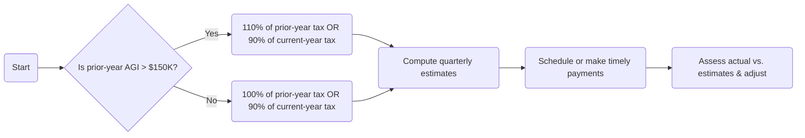

## 4.4 Estimated Tax Payments, Safe Harbor Rules & Underpayment Penalties

Estimated tax payments are an integral part of the U.S. tax system, ensuring that taxpayers who do not have sufficient withholding throughout the year can fulfill their tax obligations. In many cases, the obligation to make estimated tax payments arises for self-employed individuals, those with significant investment or passive income, and high-income earners with income sources not subject to withholding. This section will explore the rationale behind estimated tax payments, the safe harbor thresholds, the intricacies of special rules for high-income taxpayers, and how to plan strategically to avoid or reduce underpayment penalties.

Because estimated tax payments often tie closely to individual tax liability calculations, you should review the discussions in Section 4.1 through 4.3 for additional context on computing taxable income and relevant deductions. Additionally, for topics on passive income and losses that might influence estimated tax calculations, see Chapter 5, “Passive Activity & At-Risk Rules.” Understanding these foundational concepts prepares you to navigate the complexities of estimated taxes effectively.

-------------------------------------------------------------------------------

### Importance of Estimated Tax Payments

Many taxpayers have a portion of their tax obligations automatically withheld from wages or other income. However, if there is a shortfall—commonly arising from business profits, investment income, or other non-wage earnings—these taxpayers must make quarterly estimated tax payments to avoid interest and penalties. The IRS generally requires estimated payments if a taxpayer expects to owe at least $1,000 in tax after withholdings and refundable credits.

Here are a few situations where estimated tax payments are typically relevant:
• Self-employed individuals whose net earnings are not subject to withholding.  
• Shareholders in S corporations or partners in partnerships who receive pass-through income.  
• Retirees who rely on investment income that often lacks sufficient withholding (interest, dividends, capital gains).  
• Individuals with side businesses or gig-economy activities generating non-wage income.

In general, taxpayers must make four equal quarterly estimated tax payments—or adjust their payments among the quarters—to reach a certain “safe harbor” by the end of the year. If these thresholds are not met, the IRS may impose an underpayment penalty.

-------------------------------------------------------------------------------

### Safe Harbor Thresholds and General Rules

The phrase “safe harbor” refers to rules that protect taxpayers from underpayment penalties as long as they have paid a certain minimum amount throughout the year. The idea is that taxpayers can base their quarterly estimates on either the prior year’s tax liability or the current year’s expected liability.

The standard safe harbor thresholds are:
• Paying at least 90% of the current year’s total tax liability, or  
• Paying 100% of the prior year’s total tax liability (whichever is less).  

In general, many taxpayers prefer to use their prior year’s liability to compute safe harbor payments if their income is relatively stable. This approach simplifies calculations because it uses a known figure (the previous year’s total tax) instead of estimates of variable current-year income. However, high-income taxpayers should be mindful of additional rules and thresholds.

#### High-Income Safe Harbor (110% Rule)
Under the Internal Revenue Code, there is a special safe harbor rule for individuals whose adjusted gross income (AGI) in the prior year exceeded $150,000 ($75,000 for married taxpayers filing separately). These taxpayers must pay at least:
• 90% of the current year’s tax liability, or  
• 110% of the prior year’s tax liability,  

whichever is lower, to meet the safe harbor standard.

-------------------------------------------------------------------------------

### Calculation Mechanics and Payment Schedule

The federal income tax system is a “pay-as-you-go” system, and the schedule for individual estimated payments is typically:

1. First payment by April 15 (covering the period from January 1 to March 31).  
2. Second payment by June 15 (covering April 1 to May 31).  
3. Third payment by September 15 (covering June 1 to August 31).  
4. Fourth payment by January 15 of the following tax year (covering September 1 to December 31).

If any of these due dates fall on a weekend or legal holiday, the payment deadline is shifted to the next business day. In addition, taxpayers with seasonal or uneven income flows may consider the Annualized Income Installment Method to better match payments to the actual timing of income—a method outlined in Form 2210, “Underpayment of Estimated Tax by Individuals, Estates, and Trusts.”

#### Overpayments and Credit Forward
Overpayments from the prior year’s return can often be applied to the current year’s estimated tax liability. If you received a refund in the previous year and anticipate a similar or larger tax obligation in the current year, electing to apply part or all of that refund toward the next year’s estimated taxes can reduce the administrative burden and help fulfill safe harbor requirements.

-------------------------------------------------------------------------------

### Special Rules for High-Income Taxpayers

As noted, high-income taxpayers (AGI over $150,000 in the prior year or $75,000 if married filing separately) must pay 110% of the prior year’s liability or 90% of the current year’s liability. This escalation from the 100% threshold acknowledges that high-income earners often have more volatility in their income sources.

Additionally, these taxpayers must be vigilant in monitoring changing circumstances—especially if they anticipate significantly higher earnings in the current year. While a prior-year safe harbor can still protect them from penalties, paying only 110% of last year’s tax liability might lead to a large balance due in April if current-year income soared. Although that balance due might not trigger penalties if the safe harbor has been met, it could impact cash flow considerations and future estimated payments.

-------------------------------------------------------------------------------

### Underpayment Penality: An Overview

The underpayment penalty functions similarly to interest charged on a shortfall in required payments. This penalty is computed on Form 2210 for individuals under circumstances where the taxpayer did not withhold enough or did not remit sufficient estimated tax before the deadlines. The IRS calculates underpayment penalties based on:

• The amount of underpayment for each quarter.  
• The period during which the underpayment existed.  
• An interest rate tied to the federal short-term rate plus a few percentage points, adjusted quarterly.

Importantly, the penalty is cumulative throughout the year. If you fall short in the first quarter but catch up later in the year, you still pay a penalty for the first quarter’s deficiency. However, you can use the Annualized Income Installment Method if your income is heavily weighted toward the latter part of the year. This method helps reduce the penalty by matching your actual earnings/spikes in income to the quarter in which they occurred.

-------------------------------------------------------------------------------

### Exceptions and Waivers

The IRS may waive or reduce underpayment penalties for several reasons, including:

• Casualty, disaster, or other unusual circumstances that prevented timely or sufficient payments.  
• Retirement after reaching age 62 in the past two years, which may lead to a reduction in penalties due to a temporary drop in income or significant life changes.  
• New tax law changes leading to confusion about estimated taxes.  
• Simplified or first-year filer considerations.

These waiver provisions typically require detailed explanations, documentation, or a reasonable-cause statement attached to the return.

-------------------------------------------------------------------------------

### Common Pitfalls and Best Practices

Taxpayers often make errors in calculating or remitting estimated tax payments. Below are several pitfalls to avoid and corresponding best practices:

• Failing to adjust quarterly payments when income fluctuates significantly.  
  – Best Practice: Consider the Annualized Income Installment Method if you have seasonal or inconsistent earnings.  
• Neglecting to monitor prior year AGI thresholds, especially if crossing $150,000 in the previous year.  
  – Best Practice: Retain copies of prior-year tax returns and confirm you are meeting the 110% threshold if required.  
• Relying solely on withholding without checking mid-year if it matches your projected total liability.  
  – Best Practice: Remember that wage withholding can be changed in Form W-4 at any time. Adjust if you anticipate underpayment.  
• Forgetting to apply prior year overpayments as a credit to the following year’s estimate.  
  – Best Practice: If expecting a refund, consider using it to offset your first quarter estimate, helping meet safe harbor requirements.

-------------------------------------------------------------------------------

### Planning Examples Using Prior-Year vs. Current-Year Estimates

The choice between basing your safe harbor on the prior year’s tax or on the current year’s projected tax can have significant consequences. Below are two illustrative examples:

#### Example 1: Consistent Income
Tyler, single with no dependents, earned $100,000 of adjusted gross income (AGI) in 2024 and paid a total tax of $15,000. He anticipates a similar income for 2025. Tyler can base his 2025 estimates on either:
• Prior-year liability: Pay 100% of $15,000 = $15,000 over four quarterly installments (about $3,750 each).  
• Current-year liability: If he expects exactly the same income, this amount is probably also $15,000.  

In this scenario, using either method yields a similar result. If Tyler’s actual income does not deviate significantly, he will avoid any underpayment penalty as long as his quarterly payments are timely.

#### Example 2: Growing Income / High AGI Scenario
Andrea and Mark, filing jointly, had combined AGI of $180,000 in 2024 and paid $30,000 in federal income tax. They expect their income to increase to $250,000 in 2025. Because their prior-year AGI exceeded $150,000, the safe harbor rule requires them to pay at least 110% of their 2024 tax—or 90% of 2025’s projected tax.

They can:
• Pay 110% of $30,000 = $33,000 for 2025, split into four quarterly installments of $8,250 each.  
• Estimate their 2025 tax liability. Assuming it is $42,000, they could pay 90% of that ($37,800) across four installments.  

If they feel confident in their projections and want to avoid a large April balance, paying based on the current year’s higher liability (i.e., $42,000 x 90%) might best match their reality, though it can be more complex to calculate. If they are uncertain about their income growth, they could use the prior-year safe harbor but still plan for additional year-end payments to avoid a large tax bill in April.

-------------------------------------------------------------------------------

### Visualizing the Safe Harbor Decision Process

Below is a Mermaid.js flowchart illustrating the steps to determine which safe harbor rule to apply:

Explanation of the chart:  
1. Identify whether your prior-year AGI exceeded $150,000 (or $75,000 if married filing separately).  
2. If yes, use the higher threshold of 110% (or 90% of current-year). If no, use 100% of prior-year (or 90% of current-year).  
3. Calculate quarterly payments.  
4. Monitor actual income throughout the year and adjust as needed.

-------------------------------------------------------------------------------

### Underpayment Penalty Computation Example

Suppose Kevin is a self-employed consultant who expects to owe $20,000 in tax for the current year. He decides to pay $3,000 in the first quarter, $3,000 in the second quarter, $3,000 in the third quarter, and $3,000 in the fourth quarter, totaling $12,000 in estimated payments. By January 15 of the following year, he realizes he has underpaid significantly. Even if Kevin promptly pays the remaining $8,000, the IRS will assess an underpayment penalty for each quarter in which he had a shortfall.

If Kevin’s prior-year total tax was $18,000, he could have avoided a penalty by ensuring each quarter’s payment satisfied the 100% prior-year safe harbor ($18,000 / 4 = $4,500 per quarter) or by paying at least 90% of his current year’s liability ($20,000 x 90% = $18,000, or $4,500 per quarter). By paying only $3,000 in each quarter, Kevin fell below both thresholds.

-------------------------------------------------------------------------------

### Strategies to Minimize Underpayment Penalties

1. **Withholding Adjustments**  
   Salaried or wage-earning taxpayers can increase the withholding on their W-2 income to cover both their wage-based liability and other estimated tax shortfalls. This helps because withholding is considered to be paid “ratably” throughout the year, making it useful to catch up on earlier underpayments.

2. **Frequent Projections**  
   Make updated projections each quarter—taking into account new business, bonus payments, or capital gains. Timely adjustments to estimated tax payments can significantly reduce or eliminate penalties.

3. **Annualized Income Installment Method**  
   If you earn most of your income in the second half of the year, you can use Form 2210’s annualized method to show that your payments matched the timing of your income, potentially reducing the penalty for earlier quarters.

4. **Credit Carryforwards**  
   If you anticipate a refund for the current year but have uneven income in the upcoming year, applying the credit forward can mitigate penalty risk in the first quarter of the following year.

5. **Consulting Licensed Tax Professionals**  
   High-income and small business owners often benefit from regular check-ins with a licensed CPA or tax attorney to reassess taxable income, potential tax law changes, and the interplay between personal and business finances.

-------------------------------------------------------------------------------

### Conclusion and Connections to Other Sections

Mastering estimated tax payment requirements and safe harbor rules is essential to avoid unnecessary penalties and interest charges. The interplay of these requirements with deductions, credits, and other tax planning opportunities covered in earlier sections of Chapter 4 helps ensure you meet your tax obligations while preserving as much cash flow as possible.

For a deeper dive into how business or investment structures can influence your estimated tax calculations, see Chapter 5 (Passive Activity & At-Risk Rules) and Chapter 11 (Partnerships & LLCs). Additionally, to better understand how real-world events such as dispositions of property (Chapter 18) or gift and estate planning strategies (Chapters 6 and 27) can affect your taxable income and estimated tax obligations, consult the relevant chapters accordingly.

-------------------------------------------------------------------------------

### References for Further Exploration

• IRS Publication 505, “Tax Withholding and Estimated Tax”  
• Form 1040-ES, “Estimated Tax for Individuals”  
• Form 2210, “Underpayment of Estimated Tax by Individuals, Estates, and Trusts”  
• Internal Revenue Code (IRC) §§ 6654 and 6662 on penalties and interest  
• “AICPA Statements on Standards for Tax Services” (SSTS)  

-------------------------------------------------------------------------------

## Mastering Estimated Tax Payments and Safe Harbor Thresholds: Quiz



### Which of the following best describes the standard safe harbor requirement for individuals who do not exceed the high-income threshold?

- [x] 90% of current-year tax liability or 100% of prior-year tax liability
- [ ] 90% of prior-year tax liability  
- [ ] 100% of current-year tax liability only  
- [ ] 100% of current-profit distributions  

> **Explanation:** Typical safe harbor rules require individuals to pay 90% of their current-year tax liability or 100% of their prior-year liability (whichever is lower) to avoid underpayment penalties if the prior-year AGI is $150,000 or less ($75,000 if married filing separately).

### What is the special safe harbor threshold for high-income taxpayers (those with AGI over $150,000 in the prior year)?

- [x] 110% of the prior-year tax or 90% of the current-year tax
- [ ] 100% of the prior-year tax or 80% of the current-year tax
- [ ] 120% of the prior-year tax
- [ ] No difference from non-high-income taxpayers

> **Explanation:** High-income taxpayers, defined as having AGI above $150,000 in the prior year ($75,000 married filing separately), face a higher safe harbor threshold of 110% of prior-year tax or 90% of current-year tax.

### Which of the following methods helps taxpayers whose income is heavily weighted toward the latter part of the year?

- [x] Annualized Income Installment Method
- [ ] Standard quarterly installments
- [ ] Lump-sum payment method
- [ ] Fiscal-year taxpayer adjustment method

> **Explanation:** The Annualized Income Installment Method allows taxpayers to match payments to the periods in which their income was actually earned, potentially reducing penalties if income was disproportionately received in later quarters.

### For a taxpayer who had AGI of $120,000 in 2024, paid total tax of $20,000, and expects $20,000 in total tax again for 2025, what is the minimum they should pay in estimates to avoid underpayment penalties?

- [x] $20,000 during the year (in four quarterly installments), or 90% of the new total
- [ ] $15,000 as a single lump sum
- [ ] $22,000 to be safe
- [ ] $16,000, as a safe harbor for single filers

> **Explanation:** Since the taxpayer does not exceed the high-income threshold, the safe harbor is 100% of prior-year tax ($20,000) or 90% of current-year tax, whichever is lower. In this scenario, both amounts are $20,000, so paying $20,000 in timely installments will avoid penalties.

### Which of the following often arises as a key reason for safe harbor shortfall among high-income taxpayers?

- [x] Fluctuating business or investment income not covered by withholding  
- [ ] Lack of available W-4 forms  
- [x] Forgetting the 110% threshold if prior-year AGI exceeded $150,000  
- [ ] Paying via a single-year-end payment  

> **Explanation:** High-income taxpayers frequently have large changes in business or investment income that are not automatically withheld, making it crucial to pay 110% of the prior-year tax if AGI exceeded $150,000 in the previous year.  

### Which of the following statements about underpayment penalties is correct?

- [x] They function like interest on the unpaid amounts, calculated each quarter
- [ ] They are waived if the underpayment is less than $10,000  
- [ ] They do not apply to self-employed taxpayers
- [ ] They only apply at the end of the year

> **Explanation:** Underpayment penalties work like interest charges, accrued on the shortfall for each quarter.

### Taxpayers who had a refund in the prior year can do what to help meet safe harbor requirements in the subsequent year?

- [x] Apply all or part of their refund as a credit toward next year’s taxes  
- [ ] Treat the entire refund as a deductible charitable contribution  
- [x] Immediately increase withholding on wages alone  
- [ ] Transfer the refund to a Health Savings Account  

> **Explanation:** Carrying the prior-year refund forward as a credit helps cover estimated taxes for the first quarter of the following year, making it easier to meet safe harbor thresholds.

### What happens if a taxpayer meets the safe harbor by paying 110% of the prior-year tax but ends up with substantially higher taxable income for the current year?

- [x] They may not incur underpayment penalties, but face a larger balance due on April 15
- [ ] They automatically trigger IRS audits 
- [ ] They must recalculate and pay additional quarterly taxes  
- [ ] They receive a penalty adjustment

> **Explanation:** Even if the taxpayer’s actual tax liability is much higher, meeting the safe harbor rules (110% of prior-year tax if high income) shields them from underpayment penalties. However, they will still owe the difference between estimates and actual liability when filing.

### In which of the following circumstances is the IRS most likely to waive the underpayment penalty?

- [x] When the taxpayers can demonstrate hardship due to a natural disaster  
- [ ] When the taxpayer fails to file the tax return altogether
- [ ] When the taxpayer made no attempts to pay  
- [ ] When the bulk of income was from wages  

> **Explanation:** The IRS does sometimes waive penalties if there are reasonable explanations such as casualty, disaster, or certain unexpected disruptions.

### Under the safe harbor provisions, a taxpayer generally must pay at least 90% of the current year’s tax or 100% (110% if high-income) of the prior year’s tax. True or False?

- [x] True
- [ ] False

> **Explanation:** This is a statement of the foundational safe harbor principle. The 110% figure applies for taxpayers whose AGI exceeded $150,000 ($75,000 if married filing separately) in the prior year.



-------------------------------------------------------------------------------

## For Additional Practice and Deeper Preparation

[**TCP CPA Hardest Mock Exams: In-Depth & Clear Explanations**](https://www.udemy.com/course/tcp-cpa-mock-exams/?referralCode=675149871D0E79B1699C)  

**Tax Compliance & Planning (TCP) CPA Mocks:** 6 Full (1,500 Qs), Harder Than Real! In-Depth & Clear. Crush With Confidence!  
• Tackle full-length mock exams designed to mirror real TCP questions.  
• Refine your exam-day strategies with detailed, step-by-step solutions for every scenario.  
• Explore in-depth rationales that reinforce higher-level concepts, giving you an edge on test day.  
• Boost confidence and minimize anxiety by mastering every corner of the TCP blueprint.  
• Perfect for those seeking exceptionally hard mocks and real-world readiness.  

_Disclaimer: This course is not endorsed by or affiliated with the AICPA, NASBA, or any official CPA Examination authority. All content is for educational and preparatory purposes only._
