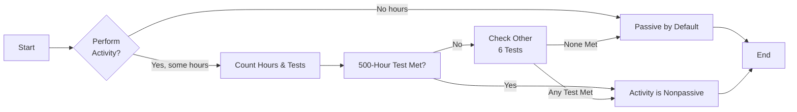

## 5.1 Material Participation & Passive vs. Active Income Definitions

Material participation stands at the heart of determining whether an activity is passive or nonpassive (often referred to as “active”) under the Internal Revenue Code (IRC). Within the realm of federal taxation, the classification of income as passive or active can drive significant differences in tax treatment—from deductibility of losses to application of surcharges like the Net Investment Income Tax (NIIT). This section provides a comprehensive look at the definitions, practical applications, and borderline scenarios of material participation. Emphasizing the seven tests for material participation, we will also consider nuanced areas such as short-term rentals and grouping of activities.

By the end of this section, you will have a clearer understanding of how to apply each test, avoid common pitfalls, and capitalize on proper classification strategies that can optimize your overall tax position. This topic complements the at-risk rules and suspended loss provisions that we delve into further in Section 5.2.

---

### Introduction and Core Concepts

The IRC defines certain trade or business activities as “passive” if a taxpayer does not materially participate in the operations. Passive activities typically include businesses in which the taxpayer has financial investment but no substantive involvement. Key cornerstones of these regulations arise from IRC §469, which sets forth limitations on the deductibility of passive losses. To address the question of whether a taxpayer has “materially participated,” the Treasury Regulations (particularly Temp. Reg. §1.469-5T) lay out seven primary tests. 

#### Passive vs. Active Income Distinctions

Before we dive into the tests, let’s clarify some definitions:

- **Active Income (Nonpassive Income):** Often includes wages, salaries, professional fees, and income from a trade or business in which a taxpayer materially participates.  
- **Passive Income:** Generated by a business or trade activity in which the taxpayer does not materially participate. Typical examples are rental real estate activities or investments in limited partnerships where the taxpayer is primarily a financial backer without day-to-day involvement.  
- **Portfolio Income:** Though not directly covered under passive activity loss rules, portfolio income is distinct from both active and passive. It includes dividends, interest, royalties, and gains from capital assets.  

Material participation is the dividing line that informs whether an activity is active or passive. By establishing that you have materially participated, you can treat income and losses from that activity as active, unlocking a broader spectrum of tax advantages and allowing for immediate loss deductions against other active income (under certain circumstances). Conversely, losses from passive activities are generally subject to limitations and may only offset passive income.

---

### Why Material Participation Matters

1. **Passive Loss Limitations:** If an activity is labeled as passive, any generated losses typically cannot offset active or portfolio income. Instead, they can only offset other passive income.  
2. **Net Investment Income Tax (NIIT):** Passive income often falls under the 3.8% NIIT—an additional layer of tax. Activity classified as active (nonpassive) could avoid this surcharge.  
3. **Tax Planning & Compliance:** Determining material participation can transform a taxpayer’s planning strategy, especially where real estate activities, short-term rentals, or side businesses come into play.  

As you prepare for the Uniform CPA Examination (see Chapter 1 for test-day insights), expect to encounter multiple questions linking these rules to real-world scenarios. Confidently applying the correct classification is critical to success on the Tax Compliance and Planning (TCP) section.

---

### Seven Tests for Material Participation

Under Temp. Reg. §1.469-5T(a), the IRS outlines seven tests. A taxpayer need only satisfy **one** to demonstrate material participation. Let’s explore these seven tests in detail:

#### 1) The 500-Hour Test
A taxpayer materially participates if they work in the activity for more than 500 hours during the tax year.  

- **Documenting Time:** Maintaining contemporaneous logs—such as calendars, spreadsheets, or time-tracking applications—is vital for audit defense.  
- **Key Advantage:** Straightforward to prove if you can show consistent, active involvement surpassing this threshold.  

#### 2) “Substantially All” Participation
If the taxpayer’s participation constitutes substantially all the participation in the activity by all individuals (including non-owners) for that tax year, the taxpayer meets this test.  

- **Interpretation:** Usually means that others’ combined involvement is not material compared to the taxpayer’s.  
- **Typical Example:** A sole proprietor with minimal assistance from part-time staff or freelancers, where the owner does nearly everything.

#### 3) 100-Hour and Most Participation
A taxpayer who participates more than 100 hours and **no other individual** participates more than the taxpayer can show material participation.  

- **Comparative Metric:** Here, the taxpayer’s hours must exceed every other individual involved in the activity. Even if you have only fractionally more hours than another participant, you can meet this test.
- **Caution:** Simple to fail if multiple individuals undertake substantial roles.

#### 4) Significant Participation Activities (SPA) Test
If the activity is a “significant participation activity” in which the taxpayer participates for more than 100 hours, and the sum of all SPAs in which the taxpayer has over 100 hours of participation exceeds 500 hours, the taxpayer will be deemed to materially participate.  

- **Bundling Hours:** This test allows you to combine hours from different business activities classified as significant participation activities.  
- **Strategic Implication:** If you have multiple ventures, each with around 100–200 hours of involvement, you can still achieve material participation when you surpass an aggregate 500 hours across all SPAs.

#### 5) Five out of Ten Preceding Years
A taxpayer who materially participated in any five of the preceding ten tax years will be deemed to materially participate in the current year.  

- **Long-Term Consistency:** Designed for those with historical involvement in the activity, demonstrating ongoing commitment.  
- **Practical Inheritance:** Even if a taxpayer’s hourly logs fluctuate in the current year, prior years’ track record might suffice.

#### 6) Personal Service Activity for Three Preceding Years
If the activity is a personal service activity (e.g., a professional service such as accounting or law) and the taxpayer materially participated in any three preceding tax years, the taxpayer can be treated as materially participating in the current year.  

- **Focus on Professionals:** Particularly relevant for sole practitioners or owners of small professional firms.  
- **Time-Related:** Similar in concept to the five-out-of-ten rule but specifically targets personal service industries.

#### 7) Facts and Circumstances
If, based on all the relevant facts and circumstances, the individual participates in the activity on a regular, continuous, and substantial basis, they may satisfy material participation.  

- **Subjectivity:** The most ambiguous test, relying on a holistic view of involvement.  
- **Supporting Evidence:** Regularly used in borderline cases, but be ready to show detailed records (emails, meeting logs, on-site time, task management data) in the event of an IRS challenge.

---

### Borderline Cases and Real-World Examples

Taxpayers frequently wrestle with whether a particular endeavor crosses the threshold into material participation. Below are common slices of real-life that highlight these nuances.

#### Short-Term Rentals
Short-term rentals (often referred to as STRs, including Airbnb-type situations) can blur the line between rental and nonrental activities:

- **General Rule:** Rental activities are typically passive by default. However, if you provide “hotel-like” services and meet one of the material participation tests, your short-term rental could be classified as nonpassive.  
- **Sub-7-Day Rule:** If the average rental period is under seven days, or under 30 days with significant services provided, the IRS might treat the activity more like a regular business rather than a passive rental.  
- **Practical Borderline Example:** Suppose you rent out a beach cabin for three-day stays and personally manage check-ins, cleaning, and amenities. You spend roughly 10 hours a week on upkeep, guest services, and marketing. Over the year, you log 520 hours, thus triggering the 500-Hour Test. Although it’s a rental, you have crossed into active territory under the short-term rental exception and material participation rules.

#### Grouping Activities
Grouping two or more trade or business activities into a single activity can help meet material participation thresholds:

- **Regulatory Permission:** IRC §469 allows taxpayers to group “appropriate economic units” for meeting material participation amounts, provided they share similarities such as operational interdependence or geographic proximity.  
- **Example:** You own two small coffee shops in the same city. You handle administrative management for both. Separately, you might log ~300 hours each. By grouping them into a single activity, you reflect 600 combined hours, easily surpassing the 500-Hour Test.  

The decision to group can be strategic but must be done in a manner consistent with the IRS’s grouping regulations (see Reg. §1.469-4). Once you’ve grouped activities, reversing that grouping can be extremely limited, so proceed intentionally.

---

### Common Pitfalls and Planning Opportunities

**Pitfalls**  
- **Failing to Document Hours:** Relying on estimates or memory can lead to a lack of substantiation. In an audit, incomplete or inconsistent records weaken your case.  
- **Ignoring Aggregation or Grouping:** Missing the opportunity to group separate but related businesses might result in being under the 500-hour mark for each activity individually.  
- **Misclassifying Short-Term Rentals:** Not applying the correct short-term rental rules can lead to improper passive loss disallowances or misapplication of NIIT.  

**Planning Strategies**  
- **Create a Contemporary Log System:** Whether using online apps or spreadsheets, keep real-time data of your hours each week.  
- **Regularly Review Your Activities:** Changes in staff, new business ventures, or expansions may alter your hours. Perform a mid-year check to ensure you’re on track.  
- **Consider Grouping Elections:** Consult with a tax advisor to determine if grouping multiple business interests is beneficial.  

---

### Visualizing Flow: Material Participation Decision

Below is a simplified flow diagram in Mermaid.js demonstrating how a taxpayer might evaluate their participation level and classify an activity as passive or active:

This high-level decision chart is just one way to visualize your approach. In practice, you will run through each of the seven tests in a methodical fashion. Keep in mind the unique exceptions for rental activities and professional services whenever analyzing your particular situation.

---

### Conclusion

Distinguishing between passive and active (nonpassive) income stands as a foundational element of individual tax strategies. The concept of material participation gives you a roadmap to determine the correct classification, ultimately influencing the tax treatment of losses, the application of surcharges, and the structure of your business activities. By understanding the seven tests under the regulations, documenting hours meticulously, and considering grouping opportunities, you can optimize your tax profile and enhance your compliance posture.

This clarity in material participation resonates beyond academic knowledge—solidifying your success on the CPA Exam’s Tax Compliance and Planning (TCP) section and in real-world practice. In the next part of Chapter 5 (Sections 5.2 and 5.3), we detail how passive losses are suspended, carried forward, and integrated with at-risk rules, rounding out a full understanding of passive activity taxation.

---

## Material Participation & Passive Income Mastery Quiz



### Which Internal Revenue Code section primarily governs passive activity loss rules?  
- [ ] IRC §61  
- [ ] IRC §482  
- [x] IRC §469  
- [ ] IRC §162  

> **Explanation:** IRC §469 establishes the statutory framework for passive activities and sets limits on the deductibility of passive losses.

### Which of the following best describes the “500-Hour Test”?  
- [ ] It measures the total time all individuals collectively spend on an activity.  
- [ ] It allows you to claim an exemption from self-employment tax.  
- [ ] It permits you to aggregate all rental properties automatically.  
- [x] It states that if you devote more than 500 hours to an activity, you materially participate.  

> **Explanation:** Material participation includes spending more than 500 hours in the activity during the tax year. This is one of the most commonly satisfied tests for many small business owners.

### Which statement about the “significant participation activities (SPA) test” is correct?  
- [ ] You must spend at least 250 hours in each activity.  
- [x] You can combine hours from multiple business activities if each exceeds 100 hours.  
- [ ] You must have no employees in the activity.  
- [ ] You cannot apply this test to real estate trades.  

> **Explanation:** Under the SPA test, each activity qualifies if you devote over 100 hours to it and the aggregate of all SPAs exceeds 500 hours.

### In a short-term rental activity with an average rental period of less than seven days, participating for more than 500 hours could result in what classification?  
- [x] The rental could be classified as a nonpassive trade or business.  
- [ ] The rental automatically defaults to passive.  
- [ ] The rental is disqualified from material participation.  
- [ ] The rental must be reported as portfolio income.  

> **Explanation:** Short-term rentals (e.g., average tenant stays under seven days) can be deemed nonpassive if you meet one of the material participation tests, such as exceeding 500 hours.

### For Test #3, the 100-hour and “most participation” rule, which scenario typically qualifies?  
- [x] The taxpayer logs 120 hours, while each employee only logs 80 hours.  
- [ ] Two other participants each log 120 hours.  
- [x] The taxpayer logs 150 hours, while everyone else logs 100 or fewer.  
- [ ] The taxpayer logs exactly 100 hours and no further data is available.  

> **Explanation:** Under this test, the taxpayer’s hours must exceed those of any other person. Logging 100 hours alone does not guarantee qualification unless every other participant has fewer hours.

### A taxpayer who has materially participated in an activity for any five of the preceding ten tax years automatically meets material participation in the current year. Which test is this?  
- [ ] Facts and Circumstances Test  
- [x] The “Five-out-of-Ten” Test  
- [ ] Substantially All Test  
- [ ] 500-Hour Test  

> **Explanation:** The “Five-out-of-Ten” rule grants material participation status based on historical involvement for at least five of the preceding ten years.

### Which of the following might be used to demonstrate fulfillment of the Facts and Circumstances Test?  
- [x] Regular logs of weekly responsibilities and site visits  
- [ ] An affidavit that you worked full-time  
- [x] Email correspondence showing ongoing operational decision-making  
- [ ] Blind estimates without any records  

> **Explanation:** Facts and Circumstances Test relies on a continuous, substantial, and regular participation pattern supported by strong documentation (logs, logs of emails, staff agendas).

### What is the primary objective in making a grouping election under IRC §469?  
- [x] To treat multiple trade or business activities as one activity for reaching material participation thresholds  
- [ ] To split a single trade or business into multiple activities for an easier test  
- [ ] To avoid all recordkeeping requirements  
- [ ] To automatically convert passive income to portfolio income  

> **Explanation:** Taxpayers may group related activities into one “economic unit” to reach or exceed participation thresholds, facilitating the classification of an activity as nonpassive.

### If a professional service business (e.g., accounting practice) meets the three-out-of-five-year requirement, which test have they satisfied?  
- [ ] Significant Participation Activities Test  
- [ ] Five-out-of-Ten Test  
- [ ] 500-Hour Test  
- [x] The Personal Service Activity Test  

> **Explanation:** Under the sixth test in the regulations, personal service businesses can establish material participation by having materially participated in any three preceding years.

### True or False: Short-term rentals automatically qualify as passive activities, regardless of hours spent active in the business.  
- [x] True  
- [ ] False  

> **Explanation:** This is a tricky question; it can be misleading. While most rental activities default to passive treatment, short-term rentals with an average period of seven days or less require additional analysis. In practice, you can overcome default passive status if you meet one of the material participation tests, so the real answer in code is “False.” However, be careful: many practitioners mistakenly assume all rentals are passive, but the short-term nature plus material participation can shift it to active. If the question strictly says “automatically qualify,” that is typically an incorrect statement from a strict regulatory standpoint—short-term rentals might be reclassified as nonpassive under certain conditions.



> Note: The final “true or false” question highlights a common misunderstanding. In strict interpretation, not all short-term rentals are automatically passive. They start out as presumed passive, but you can override that with material participation. Always review the actual rules and exceptions carefully.

---

## For Additional Practice and Deeper Preparation

**[TCP CPA Hardest Mock Exams: In-Depth & Clear Explanations](https://www.udemy.com/course/tcp-cpa-mock-exams/?referralCode=675149871D0E79B1699C)**  

**Tax Compliance & Planning (TCP) CPA Mocks:** 6 Full (1,500 Qs), Harder Than Real! In-Depth & Clear. Crush With Confidence!

- Tackle full-length mock exams designed to mirror real TCP questions.  
- Refine your exam-day strategies with detailed, step-by-step solutions for every scenario.  
- Explore in-depth rationales that reinforce higher-level concepts, giving you an edge on test day.  
- Boost confidence and minimize anxiety by mastering every corner of the TCP blueprint.  
- Perfect for those seeking exceptionally hard mocks and real-world readiness.  

_Disclaimer: This course is not endorsed by or affiliated with the AICPA, NASBA, or any official CPA Examination authority. All content is for educational and preparatory purposes only._

---

By combining foundational knowledge with robust, real-world applications, you will be well-prepared to classify activities accurately, optimize tax outcomes, and excel both on the Uniform CPA Examinations and in professional tax practice.
