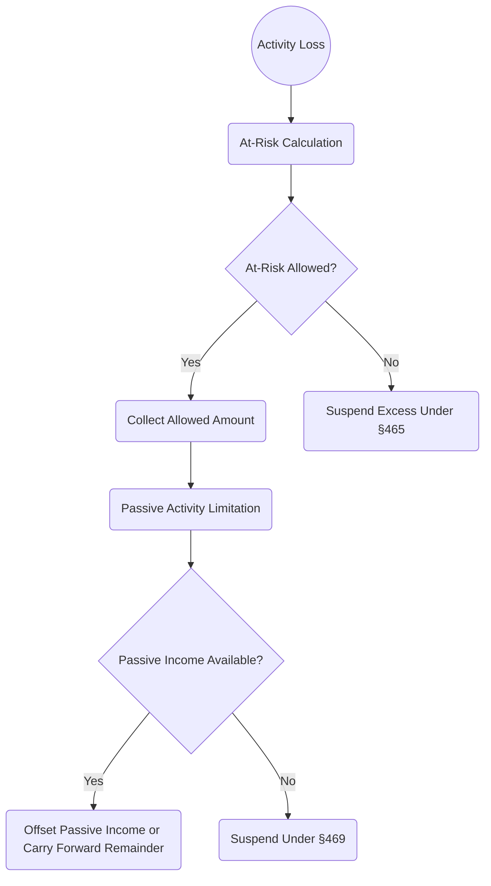

## 5.3 Interplay Between Passive Losses & At-Risk Limitations

Understanding how the at-risk rules under Internal Revenue Code (IRC) §465 interact with the passive activity loss (PAL) limitations of IRC §469 is essential for effective tax compliance and planning. These rules work together to determine how much of a taxpayer’s loss from passive investments—like interests in certain rental activities, limited partnerships, or S corporations—can be deducted in a particular tax year. Given the complexity of these rules, having a structured approach is critical to avoiding costly errors and maximizing allowable deductions. This section delves into the mechanics of the at-risk limitations, the passive activity limitations, and how they intersect on Form 8582.

This chapter builds on prior discussions in Sections 5.1 and 5.2, which lay the groundwork for distinguishing passive vs. active income and applying material participation criteria. Here, we focus specifically on the sequential application of the at-risk and passive limitations, common pitfalls, and practical strategies for navigating multiple K-1s from various flow-through entities.

--------------------------------------------------------------------------------
  
### Overview of At-Risk Rules vs. Passive Loss Limitations

1. **At-Risk Rules (IRC §465)**  
   The at-risk rules limit a taxpayer’s ability to deduct losses to the amount of economic risk they genuinely bear. Essentially, one cannot deduct losses beyond what they stand to lose financially if the investment completely fails. Key factors that increase or decrease an individual’s at-risk amount include:  
   • Actual capital contributions to the activity.  
   • Third-party loans for which the taxpayer is personally liable.  
   • Allocations of recourse vs. nonrecourse debt in partnership settings.  
   • Withdrawals, distributions, or reductions in personal guarantees.

2. **Passive Activity Loss (PAL) Rules (IRC §469)**  
   The PAL rules restrict the deduction of losses from passive activities to the amount of passive income earned from all passive activities combined, unless an exception applies (e.g., real estate professional status). If the net passive loss from a taxpayer's aggregated passive activities exceeds passive income for the year, the excess loss is suspended and carried forward. The taxpayer can release suspended losses when enough passive income is generated or upon a full disposition of the activity in a taxable transaction to an unrelated party.

3. **Sequential Application**  
   Treas. Reg. §1.469-2 and §1.465-1 generally indicate the at-risk limitations apply first. Therefore, before the passive loss rules can limit an activity’s losses, the at-risk limitations determine how much of those losses are even “allowed” to be considered. Losses exceeding the at-risk amount are suspended under §465, unrelated to the question of passive versus active. Only once you confirm that you can use the losses under the at-risk rules do you move on to apply the passive limitations under §469.

--------------------------------------------------------------------------------

### Why Ordering Matters

Because the at-risk constraints apply first, you cannot simply lump all passive losses into one pool and offset them against passive income. The portion of the loss not allowed under the at-risk rules cannot be used to reduce taxable income—even if there is sufficient passive income from other activities. Ordering is crucial for:

• **Accurate Deductions:** It prevents overstating losses in the current year.  
• **Suspended Loss Tracking:** Properly determining which losses are suspended under §465 and which ones move on to be considered under §469 is vital.  
• **Compliance with Form 8582:** Errors in the ordering can cause significant discrepancies on Form 8582 (Passive Activity Loss Limitations), leading to incorrect passive loss carryovers.

--------------------------------------------------------------------------------

### Step-by-Step Guide: From At-Risk to Passive

The following diagram illustrates the step-by-step approach for determining how much of a passive activity loss is ultimately deductible. Pay close attention to how a loss flows through these limitation “layers”:

1. **At-Risk Calculation:** Determine your at-risk basis for each activity. This is where you consider recourse debt, capital contributions, and other relevant items.  
2. **Compare Loss to At-Risk Amount:** If the activity’s loss exceeds the at-risk basis, the excess is suspended under the at-risk rules.  
3. **Passive Activity Limitation:** For the portion of the loss that passes the at-risk test, check whether you have enough passive income from all passive activities to offset it. If insufficient, a portion of the loss is suspended under §469.  
4. **Final Deduction & Carryforwards:** Deduct the allowed losses, carry forward suspended at-risk losses separately, and also carry forward passive losses under §469 until they can be utilized or freed.

--------------------------------------------------------------------------------

### Interpreting the Net Effect on Form 8582

**Form 8582 (Passive Activity Loss Limitations)** tracks activities that produce passive income and passive losses. While Form 6198 (At-Risk Limitations) handles the at-risk rules, eventually, the final net allowable passive loss is showcased on Form 8582. Here’s how they interplay:

1. **Form 6198 Before Form 8582:** For each activity that has a loss, you’ll first complete Form 6198 to determine how much of the loss is limited by at-risk rules.  
2. **Enter Allowed Amounts on Form 8582:** Only the amount from Form 6198 that is considered at-risk is carried into Form 8582’s worksheets as part of the total passive losses for the year.  
3. **Netting Against Passive Income:** Form 8582 aggregates all passive income and passive losses (allowed by at-risk rules) to determine if losses exceed income.  
4. **Suspended Losses:** If total allowed passive losses exceed passive income, the difference is suspended under §469 and carried to future years. The suspended amounts remain on Form 8582’s worksheets year to year.

--------------------------------------------------------------------------------

### Example 1: Single Activity Scenario

Consider a taxpayer, Jane, who invests $200,000 in a limited partnership. Her K-1 shows a $30,000 passive loss allocation. Jane’s at-risk basis is $25,000 because part of her investment is funded through nonrecourse debt for which she is not personally responsible.

• **At-Risk Limit (Form 6198):** The partnership loss that can be applied to Jane’s return is limited to $25,000. The remaining $5,000 is suspended under the at-risk rules and carried forward.  
• **Passive Activity Limit (Form 8582):** Jane has $25,000 in passive losses that can potentially offset passive income. Suppose she has $10,000 of passive income from another rental property. She can deduct $10,000 of the $25,000 against that passive income. The $15,000 difference becomes suspended under the passive activity rules (§469).  
• **Net Effect on 8582:**  
  - Allowed Passive Loss: $10,000  
  - Suspended Under Section 469: $15,000  
  - Suspended Under Section 465 (At-Risk): $5,000

--------------------------------------------------------------------------------

### Example 2: Multiple K-1s and Offsetting Losses

Now consider a more complex scenario where Daniel has multiple passive investments:

• K-1 from Partnership A (real estate LP): $20,000 passive loss  
• K-1 from Partnership B (equipment leasing LP): $10,000 passive loss  
• K-1 from Partnership C (rental operation): $5,000 passive income

Daniel’s initial computations show:

1. **Partnership A**  
   - Loss of $20,000  
   - At-risk basis: $15,000 (due to partial nonrecourse financing)  
   - Allowed under at-risk: $15,000  
   - Suspended under at-risk: $5,000  

2. **Partnership B**  
   - Loss of $10,000  
   - At-risk basis: $10,000 (fully recourse or personally guaranteed financing)  
   - Allowed under at-risk: $10,000  
   - Suspended under at-risk: $0  

3. **Partnership C**  
   - Income of $5,000  
   - At-risk basis is not a factor here for limiting income recognition.  

#### Combining Allowed Losses on Form 8582

• **At-Risk Outcome**:  
   - From Partnership A: $15,000 loss passes to the passive calculations; $5,000 is suspended.  
   - From Partnership B: $10,000 loss passes to the passive calculations.  
   - Partnership C: $5,000 of passive income.

• **Form 8582 Calculations**:  
   - Combined passive losses allowed by at-risk rules = $15,000 + $10,000 = $25,000  
   - Combined passive income = $5,000  
   - Net passive loss = $25,000 loss – $5,000 income = $20,000  
   - Because passive losses exceed passive income, $20,000 is suspended under §469, carrying forward.  

Hence, after the at-risk and passive layers, Daniel will have:  
- Allowed Passive Loss = $5,000 (the portion offset by $5,000 of passive income)  
- Suspended Passive Loss under §469 = $20,000  
- Suspended Loss under §465 = $5,000 from Partnership A  

This example illustrates the interplay of these two buckets of limitations with multiple investments, each generating a separate K-1.

--------------------------------------------------------------------------------

### Common Pitfalls & Best Practices

1. **Pitfall:** Failing to Apply At-Risk Rules First  
   Many practitioners skip directly to passive loss aggregation, resulting in an over-deduction. Always compute at-risk basis on Form 6198 prior to netting any passive activity loss on Form 8582.

2. **Pitfall:** Mixing Nonrecourse Debt Without Careful Documentation  
   If a partnership interest is financed through nonrecourse debt, your at-risk basis may be significantly lower than your total cash contributions. Confirm recourse vs. nonrecourse details in loan documents and the K-1 footnotes.

3. **Pitfall:** Aggregating Activities Improperly  
   Generally, real estate rentals are considered separate passive activities unless an election to group them is made. The grouping election can be beneficial or detrimental, depending on the taxpayer’s specific situation. See Chapter 5.1 for an in-depth discussion of grouping rules.

4. **Best Practice:** Maintain Detailed Records of Suspended Losses  
   Keep an updated schedule showing at-risk limitations, passive losses carried forward, and each step’s base year. This is crucial during dispositions or if you convert the property to active use.

5. **Best Practice:** Coordinate with Basis Calculations  
   Remember that “at-risk basis” is not always identical to “tax basis.” You must track basis for many different tax attributes (e.g., capital accounts in partnerships, S corporation stock basis, at-risk under §465). Each serves a different limiting rule.

6. **Best Practice:** Keep Form 6198 and Form 8582 Consistent  
   The numbers allowed on Form 6198 flow directly into Form 8582’s worksheets. Double-check that final lines match so that you do not apply more or less loss than you are entitled to.

--------------------------------------------------------------------------------

### Practical Strategies & Exam Tips

• **Understand the Hierarchy**: At-risk limitations always precede passive loss limitations. Expect test scenarios requiring you to calculate at-risk amounts first, then only the permitted portion proceeds to the passive calculation.  
• **Focus on Material Participation**: If you materially participate (see Section 5.1), the loss is no longer subject to passive limitation. However, it is still subject to at-risk rules.  
• **Look Out for Fully Deductible Rental Real Estate Losses**: Up to $25,000 of rental real estate losses can be deductible if your modified AGI is below certain thresholds and you actively participate in the rental. But that special allowance also is subject to at-risk rules first.  
• **Watch for Complete Dispositions**: If you dispose of your entire interest in a passive activity, suspended passive losses may be freed, but at-risk limitations still apply to determine final usage.  
• **Multiple K-1 Tracking**: On the exam, you may be presented with multiple K-1s. Practice combining them carefully, applying at-risk first for each activity, then netting the totals on Form 8582.  

--------------------------------------------------------------------------------

### Case Study: Multiple Activities with Different Debt Structures

Janice owns interests in three LLCs: Redwood Properties, Pine Tree Rentals, and Oak Equipment Leasing. The K-1 forms each present different levels of recourse and nonrecourse financing, thus shifting her at-risk calculations significantly.

• **Redwood Properties (LLC)**  
  - Passive Loss: $40,000  
  - Recourse Debt Guarantee: $20,000  
  - Cash Contributions: $10,000  
  - Nonrecourse Debt: $50,000  
  - At-Risk Basis: $30,000 ($10,000 cash + $20,000 guaranteed recourse)  

• **Pine Tree Rentals (LLC)**  
  - Passive Income: $15,000  
  - No additional at-risk considerations needed because it produces income.  

• **Oak Equipment Leasing (LLC)**  
  - Passive Loss: $60,000  
  - Cash Contributions: $40,000  
  - No recourse loans; entire debt is nonrecourse and not guaranteed.  
  - At-Risk Basis: $40,000  

#### Step 1: At-Risk Limits (Form 6198)

1. Redwood Properties:  
   - Loss = $40,000  
   - At-Risk Basis = $30,000  
   - Allowed = $30,000. Suspended = $10,000.  

2. Oak Equipment Leasing:  
   - Loss = $60,000  
   - At-Risk Basis = $40,000  
   - Allowed = $40,000. Suspended = $20,000.  

Pine Tree Rentals does not have an at-risk limitation since it has net income.  

#### Step 2: Passive Activity Limits (Form 8582)

- Total allowed passive loss from Redwood = $30,000  
- Total allowed passive loss from Oak = $40,000  
- Combined Passive Loss (at-risk allowed) = $70,000  
- Passive Income from Pine Tree = $15,000  
- Net Passive Loss = $70,000 - $15,000 = $55,000  

Since the net passive loss is $55,000, it is suspended under §469 and carried forward. Additionally, Redwood has $10,000 suspended under at-risk, and Oak has $20,000 at-risk suspended. Those amounts do not even reach the passive loss analysis in the current year.

--------------------------------------------------------------------------------

### Table: Summary of At-Risk vs. Passive

| Activity                | Passive Income/(Loss) | At-Risk Basis | Loss Allowed by At-Risk | Suspended §465 | Allowed to Form 8582 | Passive Income Offset | Suspended §469  |
|-------------------------|------------------------|---------------|-------------------------|----------------|----------------------|-----------------------|------------------|
| Redwood Properties      | $(40,000)$            | $30,000       | $30,000                 | $10,000        | $30,000             | $(15,000) of net offset distributed across Redwood & Oak | $55,000 total from Redwood + Oak combined after offset |
| Pine Tree Rentals       | $15,000               | N/A           | N/A                     | N/A            | $15,000 income       | N/A                   | N/A              |
| Oak Equipment Leasing   | $(60,000)$            | $40,000       | $40,000                 | $20,000        | $40,000             | See note above        | See note above   |

--------------------------------------------------------------------------------

### References for Further Exploration

• IRC §§465, 469, and their accompanying regulations.  
• IRS Publication 925, Passive Activity and At-Risk Rules.  
• Form 6198 (At-Risk Limitations) Instructions.  
• Form 8582 (Passive Activity Loss Limitations) Instructions.  
• AICPA’s Tax Section library for practical guidelines and interpretative guidance.

--------------------------------------------------------------------------------

## Quiz on Passive Losses & At-Risk Rules



### Which rule applies first when determining deductible losses?

- [x] At-Risk Rules (§465) apply before Passive Activity Loss Limits (§469).
- [ ] Passive Activity Loss Limits (§469) apply before At-Risk Rules (§465).
- [ ] Both rules apply simultaneously.
- [ ] They are applied in any order preferred by the taxpayer.

> **Explanation:** By law and regulation, the at-risk limitations must be applied to each loss first. Only the losses allowed under at-risk may be considered under the passive activity rules.

### What happens if a passive loss exceeds a taxpayer’s at-risk basis?

- [x] The amount exceeding at-risk basis is suspended under §465.
- [ ] The entire loss is fully deductible against passive income.
- [ ] The taxpayer must reduce their current year’s AGI.
- [ ] The loss can be carried back for two years.

> **Explanation:** The excess over the at-risk basis is suspended under §465 and carried forward until the taxpayer has sufficient at-risk basis, regardless of how much passive income may be available.

### Which form is used to determine how much loss is allowable under at-risk rules?

- [x] Form 6198.
- [ ] Form 8582.
- [ ] Form 4797.
- [ ] Schedule D.

> **Explanation:** Form 6198 is specifically designed for calculating and reporting the at-risk limitation.

### How is the final net passive loss determined on Form 8582?

- [x] By netting allowed passive losses (after at-risk limits) against total passive income.
- [ ] By combining all losses and ignoring the at-risk basis entirely.
- [ ] By applying the accumulated E&P calculations.
- [ ] By excluding K-1 data from the calculation.

> **Explanation:** Form 8582 only considers the portion of passive losses that passes the at-risk limitation. It then compares those losses against total passive income for the final allowable deduction.

### Why is at-risk basis often different from a taxpayer’s overall tax basis?

- [x] Because at-risk basis excludes certain types of nonrecourse debt.
- [ ] Because at-risk basis includes all recourse and nonrecourse debt equally.
- [x] Because personal guarantees of debt can increase at-risk basis beyond the partner’s equity investment.
- [ ] Because at-risk basis and tax basis are always the same.

> **Explanation:** At-risk basis under §465 does not match the overall tax basis because it excludes nonqualified nonrecourse financing and can be increased by personal guarantees and recourse debt obligations.

### If you have insufficient passive income in the current year to absorb all allowed passive losses, where do the unused losses go?

- [x] They are suspended under §469 and carried forward to later years.
- [ ] They reduce active wages and salaries.
- [ ] They are lost permanently.
- [ ] They can be converted to an NOL to offset all other income.

> **Explanation:** Passive activity losses exceeding passive income are suspended and carried forward to offset future passive income or are unlocked upon a complete disposition.

### In a year you have both at-risk suspended losses and a substantial gain from the same activity, how are losses handled?

- [x] At-risk suspended losses from prior years may now become usable, subject to the at-risk basis rules.
- [ ] They remain indefinitely suspended regardless of gains.
- [x] They might also be offset by the current year passive loss limit if it is the same passive activity.
- [ ] They convert into capital losses.

> **Explanation:** When an activity generates income, previously suspended losses can become allowed to the extent the taxpayer’s at-risk basis increases. Any newly allowed portion is then also subject to passive loss limitations if the activity is still considered passive.

### Which of the following best describes a real-life advantage of structuring recourse debt in a partnership?

- [x] It can increase a partner’s at-risk basis.
- [ ] It is never advantageous for the taxpayer.
- [ ] It eliminates passive activity classification entirely.
- [ ] It eliminates the need for Form 6198.

> **Explanation:** Recourse debt often increases the partner’s at-risk basis, allowing more of the partnership’s losses to be deducted in the current year, assuming no other limitations apply.

### What is typically required for the release of suspended passive losses under §469?

- [x] A complete disposition of the activity in a taxable transaction to an unrelated party.
- [ ] Partial disposition of 10% of the activity’s units.
- [ ] Filing for an automatic accounting method change.
- [ ] Guaranteed payments from the partnership.

> **Explanation:** A complete disposition of the interest to an unrelated party generally frees previously suspended losses under §469. Partial dispositions do not typically trigger their release.

### Under what condition might a taxpayer deduct all passive losses from an activity in the current year?

- [x] True
- [ ] False

> **Explanation:** One scenario is when the taxpayer disposes of their entire interest in that passive activity in a fully taxable transaction, making current and suspended losses fully deductible, subject to at-risk rules.



--------------------------------------------------------------------------------

## For Additional Practice and Deeper Preparation

**[TCP CPA Hardest Mock Exams: In-Depth & Clear Explanations](https://www.udemy.com/course/tcp-cpa-mock-exams/?referralCode=675149871D0E79B1699C)**  

**Tax Compliance & Planning (TCP) CPA Mocks:** 6 Full (1,500 Qs), Harder Than Real! In-Depth & Clear. Crush With Confidence!

- Tackle full-length mock exams designed to mirror real TCP questions.  
- Refine your exam-day strategies with detailed, step-by-step solutions for every scenario.  
- Explore in-depth rationales that reinforce higher-level concepts, giving you an edge on test day.  
- Boost confidence and minimize anxiety by mastering every corner of the TCP blueprint.  
- Perfect for those seeking exceptionally hard mocks and real-world readiness.  

_Disclaimer: This course is not endorsed by or affiliated with the AICPA, NASBA, or any official CPA Examination authority. All content is for educational and preparatory purposes only._
