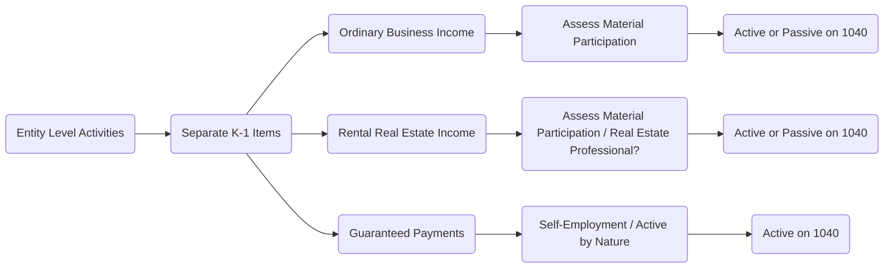

## 5.4 Layering in Partnerships & S Corporations (K-1 Allocations)

This section explores how a partner’s or shareholder’s distributive share of income is categorized as active or passive. Specifically, we focus on the “layering” concept: income (or loss) flows from the entity’s activities through Schedules K-1 of Partnerships (Form 1065) and S Corporations (Form 1120S), eventually making its way onto the individual owner’s tax return. Understanding whether the income is passive or active under the material participation tests is crucial for applying the Passive Activity Loss (PAL) rules and the At-Risk rules (detailed in earlier sections of this chapter).

The classification process is not only about placing numbers in the right box on the K-1. It also involves determining whether a partner or shareholder materially participates, how guaranteed payments are treated, and how each item of income or loss is reflected separately to comply with the Internal Revenue Code (IRC) and related Treasury Regulations. This article will dissect how K-1 boxes reflect passive or active status and demonstrate the steps for verifying material participation in partnerships and S corporations.

--------------------------------------------------------------------------------
  
### Overview of Schedule K-1 Allocations

Schedule K-1 is the mechanism by which Partnerships and S Corporations report each owner’s share of income, deductions, credits, and other tax items. Each owner typically receives a K-1, which is then used to report these items on their individual tax return (Form 1040).

Below is a high-level summary of the relevant boxes on the Partnership K-1 (Form 1065) and S Corporation K-1 (Form 1120S). Though the layout and box numbers differ slightly, the same underlying principle applies to both entity types.

• Ordinary Business Income (Partnership K-1, Box 1; S Corp K-1, Box 1)  
• Rental Real Estate Income/Loss (Partnership K-1, Box 2; S Corp K-1, Box 2)  
• Other Rental Income/Loss (Partnership K-1, Box 3; S Corp K-1, Box 3)  
• Interest, Dividends, Royalties (Partnership K-1, Boxes 5–8; S Corp K-1, Boxes 4–7)  
• Guaranteed Payments (Partnership K-1, Box 4) — Not relevant for S corporations  
• Section 179 Deduction (Partnership K-1, Box 12; S Corp K-1, Box 11)  
• Self-Employment Income or Loss (Partnership K-1, Box 14, Code A; S Corp K-1, Box 14, Code A if the shareholder is also an employee, etc.)  

The fundamental question is this: which of the above items are considered active (non-passive) and which are considered passive for applying the PAL rules? Let’s start by examining the concept of “layering” each type of activity.

--------------------------------------------------------------------------------

### Defining “Layering” in the Context of Passive vs. Active Income

When we refer to “layering,” we mean that a single owner might receive a variety of types of income from a single Partnership or S Corporation. For example:

• An S corporation might pay its majority shareholder a salary (reported on a W-2) but also pass through additional ordinary business income (via Box 1 on Schedule K-1).  
• A Partnership might distribute guaranteed payments for services (Box 4 on a Partnership K-1) plus show net rental income (Box 2).  

Each of these components can carry a distinct classification for passive vs. active considerations. The reason is that the nature of each separated item under IRC regulations has its own classification rules. Additionally, the individual partner’s or shareholder’s level of participation in each activity can change the classification of that item.

--------------------------------------------------------------------------------

### Distinguishing Passive and Active for Partnerships

From the vantage point of Partnerships, the key question for “active vs. passive” is whether the partner:

1. Materially participates in the partnership’s trade or business activities, OR  
2. Is considered merely an investor who does not participate substantially.

If the partner meets one of the seven material participation tests (outlined in Section 5.1 of this chapter), the income (or loss) from the partnership’s underlying business will generally be non-passive (active). Conversely, if the partner does not meet any material participation test, then the business income or loss is treated as passive.

Below is a concise way to see how each K-1 item interacts with the concept of passive vs. active:

• Ordinary Business Income (Box 1): If the partner materially participates in the business, the income is active. If not, it may be classified as passive.  
• Rental Real Estate Income (Box 2): Typically considered passive unless the partner is a real estate professional who materially participates (see Chapter 5.1 for the real estate professional rules).  
• Guaranteed Payments (Box 4): These are treated as compensation for services rendered and thus are self-employment income. Typically, they are non-passive, since they represent pay for active services.  
• Portfolio Income (Boxes 5–8): Generally, interest, dividends, or royalty income is considered portfolio income, which does not get offset by passive losses.  

--------------------------------------------------------------------------------

### Distinguishing Passive and Active for S Corporations

For S corporations, the same fundamental question arises concerning material participation. However, the classification of self-employment taxes and wages might differ:

• Shareholder employees of an S corporation are placed on payroll and receive W-2 wages. These wages are unquestionably active income.  
• Ordinary Business Income (Box 1 on the S Corporation K-1) may be considered passive or active depending on whether the shareholder materially participates in the trade or business.  
• Rental Real Estate Income (Box 2) is typically passive unless the shareholder is a real estate professional who materially participates.  
• Other items (interest, dividends, capital gains) also appear in separate boxes and are generally classified as portfolio income for passive activity limitation purposes.

Because S corporation owners who work in the business are required to pay themselves “reasonable compensation,” this portion is typically not part of the K-1, but is rather W-2 wages. Meanwhile, leftover net income or loss flows to the owner’s K-1, where the individual must decide if they materially participate in that S corporation’s activities.

--------------------------------------------------------------------------------

### Verifying Material Participation

Material participation is the key criterion that helps determine whether an owner’s share of K-1 income or loss is active or passive. Per Treasury Regulations §1.469-5T, there are seven tests for material participation, including (but not limited to):

• The individual participates more than 500 hours in the activity during the year.  
• The individual’s participation is substantially all of the participation in the activity of all individuals.  
• The individual participates more than 100 hours in the activity, and no one else participates more.  
• The activity is a “significant participation activity” and the sum of all such activities exceeds 500 hours.  
• The individual materially participated in the activity for 5 out of the last 10 taxable years.  

For Partnerships and S Corporations, you must:

1. Identify each activity within the entity (e.g., a partnership might be engaged in multiple rental properties plus a separate trade or business).  
2. Assess the participation hours or facts and circumstances for each activity.  
3. Tally time spent, the nature of tasks performed, and the relative involvement of other owners or employees.  
4. Compare results to the standard for material participation.  

If you pass at least one test, the activity is treated as non-passive (active). If not, the activity is deemed passive and subject to the PAL rules.

--------------------------------------------------------------------------------

### Step-by-Step Process for Classifying K-1 Items

Below is a structured approach to “layering” your K-1 allocations as passive or active:

1. Review Each K-1 Activity Separately  
   - Break down your K-1 into its distinct categories: trade or business income, rental real estate, portfolio income, guaranteed payments, etc.  
   - Each should be treated as a separate “bucket” for classification.  

2. Identify the Nature of the Income  
   - For partnership K-1s, guaranteed payments are generally compensation for services, so they are active by default.  
   - Rental real estate income is typically passive unless a real estate professional exception applies.  
   - Ordinary business income can be active or passive depending on material participation.  

3. Examine Your Hours and Level of Involvement  
   - Compare your hours contributed to the activity against the seven tests for material participation.  
   - Look for “grouping” elections allowed in certain cases (e.g., grouping multiple rental activities).  

4. Confirm with Entity Documents & Agreements  
   - The entity’s partnership agreement or operating agreement often outlines roles and responsibilities.  
   - Check for special allocations, guaranteed payment structures, or other terms that may affect your classification.  

5. Determine Final Classification & Report on Individual Return  
   - If active (non-passive), losses can offset your other active income.  
   - If passive, losses are subject to passive activity limitations and can only offset passive income.  
   - Some K-1 items remain portfolio income and have separate tax treatment rules.

--------------------------------------------------------------------------------

### Illustrative Example: Partner in a Tech Consulting Partnership

Imagine you’re a partner in a technology consulting partnership. You receive the following amounts on your K-1 this year:

• Ordinary Business Income (Box 1): $120,000  
• Guaranteed Payment (Box 4): $60,000  
• Rental Real Estate Income (Box 2): $10,000  

Now assume:

• You’re deeply involved in the consulting side, contributing over 1,000 hours per year.  
• Your guaranteed payment is recognized as compensation for your services.  
• The rental real estate is completely managed by another partner. You spend only ~10 hours a year on rental decisions.  

Classification:

• Guaranteed Payment of $60,000 → active by nature (self-employment income).  
• Ordinary Business Income of $120,000 → Because you worked 1,000 hours, you meet the 500-hour test. This portion is also non-passive (active).  
• Rental Real Estate Income of $10,000 → You do not materially participate. This portion is considered passive.  

Hence, on your personal return, the $10,000 from the rental real estate is subject to passive loss limitations. The $60,000 from guaranteed payments and the $120,000 from Box 1 are non-passive and may be used against other active forms of income or deductions where allowed.

--------------------------------------------------------------------------------

### Illustrative Example: S Corporation with Minor Shareholder

Consider an S corporation that runs a specialized manufacturing business. You own 30% of the shares. The year’s K-1 shows:

• Ordinary Business Income (Box 1): $90,000  
• Rental Income (Box 2): $5,000 earned from subleasing a small portion of the factory premises  

You, however, barely participate—only about 50 hours per year, mostly attending board meetings or strategic planning sessions. Other employees and the majority shareholder run day-to-day operations.

Classification:

• Ordinary Business Income of $90,000 → You do not meet any of the material participation tests (50 hours is too little). This portion is passive for you, subject to the PAL rules.  
• Rental Income of $5,000 → This is also passive unless you are a real estate professional (which you are not). Hence, it’s passive.  

As a result, your entire $95,000 pass-through from the S corporation is potentially subject to passive activity limitations. You can only use these amounts to offset other passive income you may have or carry them forward to future years if losses exceed passive income.

--------------------------------------------------------------------------------

### Diagrams: Income Flows & Layering

Below is a simple Merlin/mermaid diagram showing how a partnership’s income flows to partners as either passive or active:

Each “branch” leading from the entity level to the final 1040 classification depends on that specific set of facts relating to material participation (or statutory definitions, in the case of guaranteed payments).

--------------------------------------------------------------------------------

### Common Pitfalls in K-1 Layering and Classification

• Failing to Maintain Time Logs: If you claim active participation, the IRS may request documentation. Keep a detailed record of hours and tasks performed.  
• Misclassifying Rental Income: Rental real estate is generally passive by default unless you meet strict real estate professional criteria.  
• Overlooking Recharacterization Rules: Some passive rental income from short-term rentals may be recharacterized as active income if the average customer use is seven days or less and you’re materially involved in providing services.  
• Aggregating Multiple Activities Improperly: While grouping multiple rental properties can help meet the 500-hour requirement, the grouping rules must be followed carefully.  
• Treating Guaranteed Payments as Passive: Guaranteed payments are not passive. They are typically reported as self-employment income.  

--------------------------------------------------------------------------------

### Best Practices for Verifying Material Participation

• Keep Detailed Contemporaneous Logs: Record dates, hours, and the nature of work performed.  
• Use Qualitative and Quantitative Evidence: In addition to hours, gather evidence of meetings attended, strategic decisions made, or critical tasks performed that show you took a significant role.  
• Consider Grouping Elections: Under certain circumstances, you may elect to treat multiple trade or business activities or rental activities as a single activity if they form an “appropriate economic unit.”  
• Update Your Documentation Annually: If your involvement changes year to year, so could your classification.  

--------------------------------------------------------------------------------

### Connecting K-1 Layering to the At-Risk Rules

The At-Risk rules (often associated with §465 of the IRC) limit your deductible losses to the amount you have “at risk” in an activity. Even if you are properly classifying an activity as active rather than passive, you cannot deduct losses in excess of the money or property you have invested or guaranteed in the activity. When analyzing K-1 items:

• Check your outside basis (Partnership) or stock/debt basis (S Corporation) to determine your at-risk amount.  
• Distinguish between recourse and nonrecourse loans in Partnerships.  
• In S Corporations, basis may be increased by direct loans from the shareholder, but not by third-party loans to the corporation unless the shareholder is personally liable.

--------------------------------------------------------------------------------

### Advanced Considerations: Multiple Entities & Tiers

In some cases, you might have layering that involves multiple tiers of ownership:

• A holding company (structured as a partnership) invests in multiple lower-tier partnerships.  
• An S corporation invests in a joint venture LLC taxed as a partnership.  

Each pass-through item flows up from the lower-tier entity to the upper-tier entity, and then to the ultimate owners. Material participation tests must be applied at the level of the ultimate owner, but you also need to confirm you have the necessary information from each level. This can be quite complex and often requires significant recordkeeping and consistent interpretation of the rules at each step.

--------------------------------------------------------------------------------

### Real-World Strategies

• Coordinate with the Entity: Talk to the tax matters partner (for partnerships) or officer in charge of tax matters (for S corporations) to understand how activities were aggregated or separated at the entity level.  
• Annual Planning Meetings: If you intend to classify yourself as materially participating, ensure you’re meeting the hours test each year. If you’re borderline, consider devoting more time to specific tasks before year-end.  
• Proactive Documentation: Make sure your partnership operating agreement or your S corporation shareholder agreement clearly outlines your responsibilities, reinforcing your material participation claim when applicable.  

--------------------------------------------------------------------------------

### Practical Example with Multiple Activities

Suppose you have two distinct businesses inside your S corporation:  
1) A consulting arm  
2) A small equipment rental division  

If you spend 600 hours annually on the consulting side but only 20 hours on the equipment rental side, you may qualify as actively participating for the consulting arm. For the equipment rental division, however, you likely fail the material participation tests unless the corporation has grouped both activities together in a permissible way, or unless your total hours exceed the threshold for each. Proper layering means you might treat the consulting arm’s income as active, while the rental side is passive.

--------------------------------------------------------------------------------

### Looking Ahead

In subsequent sections (for instance, see Chapter 6 on Gift Taxation & Strategy and Chapter 11 on Partnerships & LLCs), you will find more detailed explorations of how distributions, estate planning strategies, and advanced partnership structures interface with the classification of passive vs. active income. Mastery of layering principles is essential to ensuring accurate compliance, avoiding IRS scrutiny, and optimizing tax outcomes.

--------------------------------------------------------------------------------

### References for Further Exploration

• Internal Revenue Code (IRC) §469 — Passive Activity Loss rules  
• Treasury Regulations §1.469-5T — Material Participation tests  
• IRS Publication 925 — Passive Activity and At-Risk Rules (detailed guidance and examples)  
• AICPA Tax Section membership resources  
• Online Courses:  
  – [IRS Understanding Pass-Through Entities](https://www.irsvideos.gov/Business/UnderstandingEntities/PassThroughEntities)  
  – [AICPA Tax School: Partnerships & S Corporations](https://www.aicpa.org/)  

--------------------------------------------------------------------------------

## SEO-Optimized Quiz: K-1 Allocations in Partnerships & S Corporations



### How does the concept of "layering" apply to K-1 allocations in Partnerships and S Corporations?

- [x] It refers to classifying each item of income (or loss) from the K-1 as either passive, active, or portfolio, based on material participation.
- [ ] It pertains solely to guaranteed payment classifications.
- [ ] It deals exclusively with capital gains distributions.
- [ ] It abbreviates the process of grouping multiple passive activities into one.

> **Explanation:** Layering involves separating and classifying each type of income or loss from the K-1 to determine whether it is active, passive, or portfolio.  

### Which of the following K-1 items in a Partnership is generally considered non-passive by default?

- [x] Guaranteed payments (Partnership K-1, Box 4)
- [ ] Ordinary business income (Partnership K-1, Box 1)
- [ ] Rental real estate income (Partnership K-1, Box 2)
- [ ] Passive portfolio income (Partnership K-1, Box 5-8)

> **Explanation:** Guaranteed payments are typically viewed as compensation for services; therefore, they are active by nature.  

### In determining material participation, which of the following is one of the seven tests under Treasury Regulations §1.469-5T?

- [x] The individual participates in the activity for more than 500 hours during the tax year.
- [ ] The individual invests more than $100,000 over the past 3 years.
- [ ] The individual has at least a 10% ownership stake in the entity.
- [ ] The activity must produce more than $50,000 in annual gross receipts.

> **Explanation:** Material participation often hinges on hours spent: the 500-hour threshold test is perhaps the most widely recognized among the seven.  

### If an S corporation shareholder works 700 hours per year in the entity's business, how would that owner’s share of ordinary income generally be classified?

- [x] Active, because the owner materially participates under the 500-hour test.
- [ ] Passive, because all S corporation income is automatically passive.
- [ ] Portfolio, because it usually comes from investment income.
- [ ] Wage income, because the IRS reclassifies all pass-through income as wages.

> **Explanation:** Working more than 500 hours satisfies one of the tests for material participation, resulting in active (non-passive) income classification.  

### When is rental real estate income treated as non-passive for Partnership or S Corporation owners?

- [x] When the owner is a real estate professional who meets the material participation standards and additional real estate professional rules.
- [ ] When the owner holds more than 2% equity in the entity.
- [ ] When the entity has at least 10 full-time employees.
- [ ] Automatically, if the property is located out-of-state.

> **Explanation:** Rental real estate income is usually passive unless the owner is a real estate professional who materially participates, meeting the stricter real estate professional provisions.  

### What is the primary purpose of the At-Risk rules in classifying and limiting losses from pass-through entities?

- [x] To ensure that losses claimed are limited to the owner’s economic investment and personal financial risk.
- [ ] To eliminate all passive losses in any given year.
- [ ] To prevent guaranteed payments from being deducted.
- [ ] To cap all business deductions at $25,000.

> **Explanation:** The At-Risk rules (§465) limit loss deductions to the amount the taxpayer has “at risk,” preventing large deductions in excess of one’s economic investment.  

### A partner in a law firm receives $50,000 of net business income (Box 1) and $40,000 in guaranteed payments (Box 4). The partner also logs 1,000 hours of billable time during the year. How would you classify these amounts?

- [x] Both are non-passive, as the guaranteed payment is for active services, and material participation deems the net business income as active.
- [ ] Both are passive by default because the partner does not control the entire firm.
- [x] The net business income is active, but the guaranteed payment is passive.
- [ ] Both are portfolio income.

> **Explanation:** Guaranteed payments are active compensation; the net business income is also active because the partner meets the hour-based material participation test.  

### An S corporation has both a consulting business and an equipment rental business. The shareholder works 600 hours in consulting but only 20 hours in the equipment rental. How can this shareholder classify the income from each activity?

- [x] Consulting can be active, and equipment rental is likely passive unless there is valid grouping or real estate professional status.
- [ ] Both must be passive, as the S corporation is a pass-through entity.
- [ ] Both must be active, because the shareholder participates in at least one of the entity’s activities.
- [ ] The income is automatically passive if the shareholder has less than a 50% ownership stake.

> **Explanation:** Material participation is determined “per activity” unless an appropriate grouping election is made. One can materially participate in one segment but not the other.  

### What is the primary difference between guaranteed payments in Partnerships and wages for S corporation shareholder-employees?

- [x] Guaranteed payments are reported on Form 1065 K-1, while wages are reported on Form W-2.
- [ ] There is no difference; both are automatically passive.
- [ ] Both reduce the entity’s ordinary income but only wages are considered self-employment income.
- [ ] Guaranteed payments are never permitted above $100,000 a year.

> **Explanation:** Guaranteed payments flow through on the partner’s K-1 and are akin to compensation for services; meanwhile, an S corporation shareholder-employee’s pay is reported as W-2 wages.  

### In a situation where a partner fails all seven material participation tests for a single activity, how is the partner’s share of income or loss generally classified?

- [x] Passive  
- [ ] Active  
- [ ] Portfolio  
- [ ] Self-employment income

> **Explanation:** Failing all seven tests results in the activity being classified as passive, subject to the Passive Activity Loss (PAL) rules.  



--------------------------------------------------------------------------------

## For Additional Practice and Deeper Preparation

**[TCP CPA Hardest Mock Exams: In-Depth & Clear Explanations](https://www.udemy.com/course/tcp-cpa-mock-exams/?referralCode=675149871D0E79B1699C)**  

**Tax Compliance & Planning (TCP) CPA Mocks:** 6 Full (1,500 Qs), Harder Than Real! In-Depth & Clear. Crush With Confidence!  

- Tackle full-length mock exams designed to mirror real TCP questions.  
- Refine your exam-day strategies with detailed, step-by-step solutions for every scenario.  
- Explore in-depth rationales that reinforce higher-level concepts, giving you an edge on test day.  
- Boost confidence and minimize anxiety by mastering every corner of the TCP blueprint.  
- Perfect for those seeking exceptionally hard mocks and real-world readiness.  

_Disclaimer: This course is not endorsed by or affiliated with the AICPA, NASBA, or any official CPA Examination authority. All content is for educational and preparatory purposes only._
