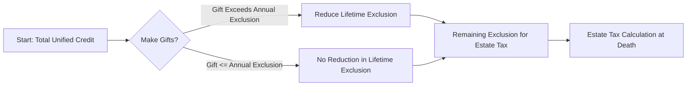

## 6.1 Unified Transfer Tax System & Unified Credit Limits

The unified transfer tax system under U.S. tax law coordinates the gift tax and the estate tax under a shared lifetime exclusion. Through this integration, the federal government ensures that lifetime transfers (gifts) and wealth transfers at death (estates) are taxed in a consistent manner. The concept of a “lifetime unified credit” allows taxpayers to make certain amounts of gifts during life without immediately incurring gift tax, while also reserving a portion of their unified credit for potential usage against estate taxes at death.

This section expands on how gift and estate taxes integrate under one umbrella, the fundamental thresholds for both annual and lifetime exclusions, and the practical implications for exam candidates and practicing professionals. Expect to see exam questions testing nuanced aspects of these calculations and how various planning strategies optimize a taxpayer’s unified credit usage.

---

### Overview of the Unified Transfer Tax System

The U.S. federal transfer tax system covers:

• Gift Tax – Imposed on the donor for taxable gifts made during the donor’s lifetime.  
• Estate Tax – Imposed on the decedent’s estate for the transfer of assets at death.  
• Generation-Skipping Transfer (GST) Tax – A companion set of rules (beyond the main scope here) designed to impose tax on certain transfers to individuals two or more generations below the donor.  

Congress merged these taxes—gift tax and estate tax—into a single structure decades ago for simplicity, consistency, and fairness. At the core of this system are two concepts:

1. An **annual gift tax exclusion** that applies to each donee (recipient) on an annual basis.
2. A **lifetime exclusion** (also called the unified credit amount) that covers gifts exceeding annual exclusions plus the estate transfer at death.

##### Rationale Behind the Unified System
Prior to the establishment of a unified system, taxpayers could potentially avoid estate tax by making large gifts during their lifetime. By unifying the exemptions and tax rates, the government ensures that the total transfer of wealth—whether during life or at death—faces a single cumulative approach.

---

### Annual Gift Tax Exclusion

Under current law, individuals may gift up to a set annual exclusion amount to any number of recipients without reducing their lifetime exclusion and without filing a gift tax return (Form 709), provided the gifts are “present interest” gifts. For CPA exam planning, it is essential to remember:

• The normal “present interest” annual exclusion has historically increased for inflation in increments of $1,000.  
• In many recent years, this annual exclusion has been around $15,000, then $16,000, and more recently $17,000 (for 2023). Exam questions often test your knowledge of the current threshold or how to apply prior-year thresholds retroactively for times not statute-barred.  
• Gifts above the annual exclusion in any given year require the filing of a federal gift tax return (Form 709). They do not necessarily trigger immediate gift tax, but reduce the remaining lifetime exclusion.  

#### Example: Utilizing the Annual Exclusion

Imagine a taxpayer (“Donor A”) who wishes to gift cash to their three children. If the annual exclusion is $17,000, Donor A can gift $17,000 to each child—totaling $51,000—annually without filing a gift tax return or tapping into any portion of the lifetime exclusion. If Donor A gifts $20,000 to one child, however, $3,000 ($20,000 − $17,000) will need to be reported on Form 709 and will reduce Donor A’s lifetime exclusion by $3,000, unless Donor A elects other strategies, such as gift-splitting with a spouse.

---

### Lifetime Exclusion: The Unified Credit

The lifetime exclusion (often referred to as the unified credit or the estate and gift tax exemption) is a cumulative cap on the amount of gifts and/or estate value a taxpayer can transfer tax-free during life or at death. Taxable gifts made during life reduce the remaining credit available for the estate. Conversely, if a taxpayer never makes substantial taxable gifts and only uses the credit at death, the entire amount is available to offset estate taxes.

• This unified credit is adjusted for inflation.  
• In recent years, it has been at historically high levels. For instance, for 2023, it stands at around $12.92 million per individual (inflation-adjusted from $11.70 million in 2021).  
• Unless Congress acts otherwise, certain provisions of the Tax Cuts and Jobs Act (TCJA) are set to “sunset” at the start of 2026, potentially reducing the unified credit by roughly half.  

#### Portability
An important facet of the estate tax regime is “portability,” which allows a surviving spouse to claim the unused portion of their deceased spouse’s estate tax exemption, effectively stacking exemptions for a married couple. To claim portability, a timely filed estate tax return (Form 706) is required upon the first spouse’s death, even if the estate is below the filing threshold. For CPA exam questions, always remember:

1. Portability must be affirmatively elected by filing a Form 706.  
2. Portability only applies to estate and gift tax exemptions, not the GST tax exemption.  
3. Once elected, the surviving spouse effectively increases their exemption by the unused exemption of the deceased spouse.

---

### Integration of Gift and Estate Tax Credits

The gift tax and the estate tax share the same unified credit. As taxable gifts lower the total credit available, an individual who makes large lifetime gifts may have less credit remaining to shelter assets in their estate from estate tax. Conversely, making small or no taxable gifts leaves more credit available at death.

The tax rates for both gift and estate taxes are typically the same—historically often maxing out around 40%. This structure ensures that it does not matter when the transfer occurs (during life or at death); the top marginal rate is identical.

#### Practical Mechanics

1. **Gift Tax Return Filing:** When a taxpayer exceeds the annual gift exclusion in a calendar year for a given donee, the excess reduces the lifetime exclusion.  
2. **Cumulative Gauging of Transfers:** All prior taxable gifts must be tallied in subsequent years to determine the remaining available exclusion.  
3. **Estate Tax Calculation:** At death, the executor calculates the gross estate, deducts allowable expenses, subtracts any remaining lifetime exclusion, and determines whether estate tax is due.  

---

### Understanding the Unified Credit Through a Visual Diagram

Below is a simple diagram to help illustrate how the lifetime exclusion carries over between gift and estate tax calculations. This is a conceptual overview using Mermaid syntax.

From this diagram, you can see that if gifts remain at or below the annual exclusion each year, the taxpayer does not reduce the lifetime exclusion. If the donor makes large gifts above the exclusion, the lifetime exclusion shrinks correspondingly, leaving less to shelter the estate from estate taxes.

---

### Key Considerations for Exam Candidates

• **Carryforward of Gift Usage:** On the CPA exam, be prepared to track the total amount of taxable gifts in hypothetical scenarios. The exam will test your ability to calculate how much of the unified credit remains for the estate.  
• **Annual Exclusion Application:** The exam often includes nuances, such as multiple donees, gift-splitting between spouses, or gifts of future interests that do not qualify for the annual exclusion.  
• **Complex Valuation Issues:** Gift and estate tax calculations frequently hinge on how assets are valued (refer to Section 6.2 on valuation discounts). Over- or understating value can lead to overpayment or underpayment of tax.  
• **Legislative Uncertainty:** Be aware that the lifetime exclusion could revert to lower levels, especially in 2026, unless Congress intervenes. The exam may present scenarios referencing future legislative changes or employing hypothetical rates.

---

### Strategic Uses of the Unified Credit

The high lifetime exemption presents various planning opportunities:

- **Lifetime Gifting Strategies**: Individuals can transfer assets during their lifetime to move future appreciation out of their estates, reducing estate tax exposure.  
- **Estate Freezing Techniques**: Techniques like Grantor Retained Annuity Trusts (GRATs) and Family Limited Partnerships (FLPs) help reduce estate sizes, but typically also interact with gift tax rules.  
- **Intergenerational Planning**: Large gifts can help children or grandchildren purchase homes, pay for college, or start businesses without incurring immediate gift tax, provided the gift stays within the lifetime exclusion.  

However, making significant gifts during life also means there is less unified credit available at death, which may expose future estate assets to more estate tax if the gifts do not outperform the potential appreciation that might have occurred within the estate. This is where professional judgement and scenario-based projections become critical. 

---

### Real-World Example

Consider a high-net-worth individual, Jane, with a net worth of $20 million. Jane has never made a gift exceeding the annual exclusion. Her executor (after her passing) calculates her gross estate at $20 million:

1. **Yearly Gifts Within Annual Exclusion**: Over Jane’s lifetime, all her gifts were within the yearly cap. Hence, she has the full lifetime exclusion available.  
2. **Estate Tax Calculation**: In the year of her death, assume the exclusion is $12.92 million. Subtract $12.92 million from $20 million. The resulting $7.08 million is subject to estate tax at the top marginal rate (potentially around 40%).  
3. **Portability**: If Jane was married and her husband died earlier without using any of his exclusion, the portability election could effectively add his unused portion to Jane’s. This might fully or partially shelter the $7.08 million from estate tax.  

Compare this scenario to another taxpayer, Mark, who used $3 million of his unified credit 10 years prior when making a large gift to his children. If Mark also has a $20 million estate at death, only $9.92 million of his credit remains, leaving around $10.08 million potentially exposed to estate tax, absent other deductions or portability adjustments.

---

### Common Pitfalls and Mistakes

• **Failure to File a Timely Return**: Taxpayers sometimes overlook Form 709 for gifts above the annual exclusion, risking interest and penalties and losing the ability to fully document their gift history.  
• **Misclassification of Gifts**: Confusing present interest gifts with future interest gifts can lead to incorrect usage of the annual exclusion.  
• **Ignoring Portability Requirements**: Not filing Form 706 upon the death of a spouse can lead to a permanent loss of the unused exemption, potentially doubling future tax exposure.  
• **Underestimating Valuation Complexity**: Artwork, closely held businesses, and real estate can be difficult to value, introducing risk of disputes with the IRS.  
• **Overlooking State-Level Estate or Inheritance Taxes**: Several states impose separate estate and/or inheritance taxes, each with lower exemptions than federal guidelines.  

---

### Best Practices for Exam Preparation

• **Master the Basics**: Know the current annual gift tax exclusion and the approximate unified credit for the year in which you are taking the exam.  
• **Practice Multi-Year Computations**: Work through example problems that test how multiple gifts across multiple years add up.  
• **Understand Return Filing Obligations**: Expect scenario-based questions on how, when, and why to file Forms 709 and 706 (though the mechanical details of Form 706 fall under estate administration, referencing Chapter 6.4).  
• **Watch for Legislative Updates**: Keep track of the possibility that the exemption can change drastically in 2026. The latest exam updates (effective from 2025) reflect new inflation adjustments but also remain mindful of potential law changes.  

---

### Diagrams Summarizing Key Thresholds for Gifts and Estates

In practice, threshold amounts and top marginal rates can be summarized in a table for quick reference. While the actual amounts may change slightly yearly, the table below demonstrates how you might keep track:

| Category                      | 2023 Amount                     | Notable Points                                    |
|------------------------------ |-------------------------------- |---------------------------------------------------|
| Annual Gift Tax Exclusion     | $17,000 per donee               | Increased periodically for inflation              |
| Lifetime Estate & Gift Exclusion | ~$12.92 million                | Both gift & estate share this unified credit      |
| Top Tax Rate                  | 40%                             | Applies to amounts above the exclusion threshold |
| Portability                   | Election required on Form 706   | Surviving spouse claims the unused portion        |

Be sure to adjust these figures if the IRS issues new guidance or if the CPA exam references prior-year or hypothetical future-year numbers.

---

### Conclusion

The unified transfer tax system serves a vital role in tying together lifetime gifting and bequests at death under a single umbrella. By understanding and applying the annual gift tax exclusion and the lifetime unified credit, taxpayers can strategically minimize their overall tax liability. For exam candidates, mastering these concepts—including annual exclusion rules, the structure of the unified credit, and portability—will be essential for successfully navigating gift and estate tax questions, which often appear in both computational and theoretical forms.

Tax planning around the unified transfer tax system demands a thorough understanding of timing, valuation, return-filing requirements, and continuous legislative updates. Solidifying competence in these areas will benefit soon-to-be CPAs, allowing them to confidently guide clients and excel on the exam.

---

## Test Your Knowledge: Unified Transfer Tax, Credits, and Exclusions



### What is the primary purpose of the unified transfer tax system?

- [x] To combine gift and estate taxes under a single lifetime exclusion.
- [ ] To provide a mechanism for states to collect additional gift taxes.
- [ ] To eliminate filing requirements for small estates.
- [ ] To impose a uniform state inheritance tax across all jurisdictions.

> **Explanation:** The unified transfer tax system merges gift tax and estate tax so individuals have one lifetime exclusion (the unified credit) governing both lifetime transfers and transfers at death.

### Which statement about the annual gift tax exclusion is correct?

- [x] Gifts within the annual exclusion do not count toward the donor’s lifetime exclusion amount.
- [ ] All gifts require a gift tax return regardless of amount.
- [ ] The annual exclusion has no inflation adjustments.
- [ ] Annual exclusions and lifetime exclusions are completely unrelated.

> **Explanation:** Gifts under the annual exclusion do not reduce the donor’s lifetime unified credit. Gifts above the exclusion do reduce the credit and require filing Form 709.

### When a taxpayer makes a gift above the annual exclusion, how does it affect the taxpayer’s overall unified transfer tax calculation?

- [x] It decreases the remaining lifetime exclusion for estate tax.
- [ ] It allows for additional annual exclusion amounts for other donees.
- [ ] It does not require any documentation.
- [ ] It fully eliminates any future estate tax obligations.

> **Explanation:** Gifts that exceed the annual exclusion are subtracted from the donor’s lifetime exclusion, reducing what remains available to shelter the estate from taxation at death.

### Which of the following best describes portability in the estate tax context?

- [x] The ability of a surviving spouse to utilize the unused estate tax exemption of the deceased spouse.
- [ ] The capacity to transfer the annual gift exclusion from one spouse to another.
- [ ] The automatic deferral of estate taxes until both spouses have passed away.
- [ ] The indefinite carryforward of unused annual exclusions.

> **Explanation:** Portability allows a surviving spouse to claim any remaining unified credit of a deceased spouse, provided the estate files a timely Form 706 to elect portability.

### If a taxpayer uses $4 million of their lifetime exclusion on gifts, how much will remain if the current unified credit is $12.92 million?

- [x] $8.92 million
- [ ] $4 million
- [x] $8 million
- [ ] $16.92 million

> **Explanation:** The taxpayer has used $4 million of the $12.92 million lifetime exclusion, leaving $8.92 million. If there’s a second correct check, it might be to illustrate a scenario; for instance, if the exam hypothetically changed the baseline to $12 million. However, in typical calculations, $12.92 million – $4 million = $8.92 million remains.

### Which gift qualifies for the annual gift tax exclusion without reducing the lifetime exclusion?

- [x] A $17,000 cash gift to a friend in a calendar year.
- [ ] A $100,000 future-interest gift in a trust.
- [ ] A $50,000 gift to a parent for medical bills without direct payment to the hospital.
- [ ] A $200,000 real estate gift to a child.

> **Explanation:** Gifting $17,000 in a single year remains within the annual exclusion, thus not reducing the lifetime exclusion. Larger gifts or future-interest gifts typically trigger different rules.

### An individual has never used any of their lifetime exclusion and has made no taxable gifts. At death, their gross estate is $15 million. Assuming a $12.92 million exclusion and no other deductions, which portion is subject to estate tax?

- [x] $2.08 million
- [ ] $15 million
- [x] $12.92 million
- [ ] $0

> **Explanation:** Subtract the $12.92 million from the gross estate of $15 million. The remaining $2.08 million is subject to estate tax. If an exam question had different numbers, the methodology remains consistent.

### What is a primary risk of not filing an estate tax return when a spouse dies with an unused exclusion?

- [x] Losing the ability to use the deceased spouse’s remaining estate tax exemption.
- [ ] A higher annual gift tax exclusion.
- [ ] Ability to bypass probate with fewer restrictions.
- [ ] Receiving a penalty from state authorities only.

> **Explanation:** The primary risk is losing portability. Failing to file Form 706 means the unused portion of the deceased spouse’s exemption is forfeited.

### What happens to the unified credit if large portions of it are used up by lifetime gifts?

- [x] The amount left to shield estate transfers is reduced.
- [ ] The estate tax is automatically eliminated.
- [ ] The annual exclusion is increased retroactively.
- [ ] Nothing happens; lifetime and estate exemptions are not connected.

> **Explanation:** Large lifetime gifts reduce the available unified credit, meaning more of the estate may be subject to federal estate tax at death.

### The top federal estate tax rate in recent years has generally been which of the following?

- [x] True
- [ ] False

> **Explanation:** The current top federal estate tax rate is typically 40%. While it has changed over time, 40% has been standard under recent legislation.



---

## For Additional Practice and Deeper Preparation

**[TCP CPA Hardest Mock Exams: In-Depth & Clear Explanations](https://www.udemy.com/course/tcp-cpa-mock-exams/?referralCode=675149871D0E79B1699C)**  

**Tax Compliance & Planning (TCP) CPA Mocks:** 6 Full (1,500 Qs), Harder Than Real! In-Depth & Clear. Crush With Confidence! 

- Tackle full-length mock exams designed to mirror real TCP questions.  
- Refine your exam-day strategies with detailed, step-by-step solutions for every scenario.  
- Explore in-depth rationales that reinforce higher-level concepts, giving you an edge on test day.  
- Boost confidence and minimize anxiety by mastering every corner of the TCP blueprint.  
- Perfect for those seeking exceptionally hard mocks and real-world readiness.  

_Disclaimer: This course is not endorsed by or affiliated with the AICPA, NASBA, or any official CPA Examination authority. All content is for educational and preparatory purposes only._
