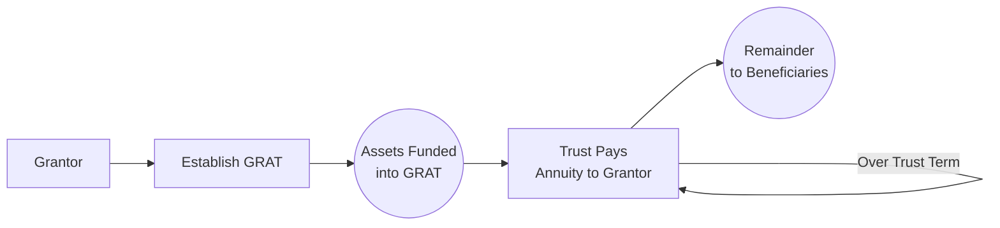
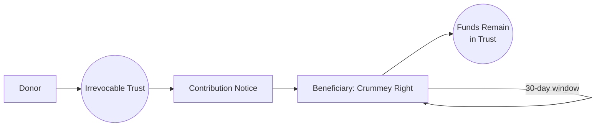

## 6.3 Lifetime Gifting Strategies: Grantor Retained Annuity Trusts (GRATs), Crummey Powers)

Effective lifetime gifting strategies require a delicate balance of maximizing tax efficiency while ensuring compliance with federal gift tax regulations, state-level considerations, and potential estate tax implications. Among the most widely used techniques are Grantor Retained Annuity Trusts (GRATs) and Crummey Powers. Both strategies are designed to leverage the annual gift tax exclusion, the lifetime unified credit, and various valuation rules to shift wealth to beneficiaries—often family members—under favorable tax structures.

This section explores the mechanics of GRATs and Crummey Powers in detail, showing how each strategy can be employed to accomplish successful wealth transfer. Practical cases, common pitfalls, and best practices are provided to help ensure your understanding aligns with real-world CPA exam and practice scenarios.

--------------------------------------------------------------------------------

### Overview of Lifetime Gifting Incentives

Before diving deeply into GRATs and Crummey Powers, it is useful to recall from §6.1 and other sections within this chapter that U.S. gift taxation carries an annual exclusion (indexed for inflation) and a lifetime exemption amount that integrates with the estate tax. If a donor can structure gifts to reduce or eliminate gift tax, the overall objective—minimizing estate tax while smoothly transferring wealth—can become more attainable. Beyond these standard exclusions and exemption amounts, advanced strategies like GRATs and Crummey Powers enable donors to harness time, valuation discounts, and trust structures to optimize transfers.

--------------------------------------------------------------------------------

### Grantor Retained Annuity Trusts (GRATs)

Grantor Retained Annuity Trusts are irrevocable trusts specifically designed to transfer asset appreciation from a grantor to beneficiaries, often children, while minimizing or eliminating gift tax consequences. A GRAT generally involves the following sequence:

1. The grantor transfers assets expected to appreciate (e.g., LLC interests, marketable securities, or closely held family business stock) into a trust.  
2. The grantor retains an annuity payment from the trust over a fixed term.  
3. At the end of the term, any residual appreciation (minus the annuity distributions) passes to the trust beneficiaries, usually with minimal taxable gift implications.

From a tax calculation perspective, the value of the grantor’s retained annuity interest reduces the value of the gift upon funding the trust. The Internal Revenue Service (IRS) sets a “hurdle” rate (referred to as the Section 7520 rate), determining what portion of the appreciation the grantor effectively “keeps” in the form of retained annuity payments. Typically, if the assets in the GRAT outperform this statutory rate, the excess appreciation shifts to beneficiaries free (or partially free) of additional gift tax.

#### Key Elements of a GRAT

• Term of the GRAT: The trust lasts for a specific number of years. A shorter term has the advantage of limiting mortality risk, whereas a longer term allows more time for assets to appreciate.  
• Annuity Payments: The grantor receives a predetermined annuity amount each year (often structured to “zero out” the gift by making the present value of the annuity equal or nearly equal to the value of assets transferred).  
• Remainder Beneficiaries: After the term, any leftover assets (principal plus appreciation minus annuity payments) in the trust belong to the beneficiaries.  
• Taxation of Trust Income: Generally, the grantor is treated as the owner of the trust for income tax purposes under the grantor trust rules. The grantor pays income taxes on trust income, effectively gifting additional value (tax payments) to the trust without incurring further gift tax.  

#### Mechanics of a GRAT: Structure and Flow

Below is a simplified diagram showing the flow of assets and annuity payments in a basic GRAT arrangement.

1. The Grantor establishes and funds the GRAT with assets.  
2. Over the predetermined term, the trust pays the grantor annuity payments.  
3. When the trust expires, any residual value above what was required to pay the annuity passes to the beneficiaries.

#### Common GRAT Strategies

1. **Front-Loaded vs. Back-Loaded Annuity**: The trust can be structured so that annuity payments increase over time (often called a “rolling GRAT”), potentially minimizing the value of early distributions and maximizing growth within the trust.  
2. **Zeroed-Out GRAT**: The grantor designs the annuity payment so that the present value calculation of the retained annuity nearly equals the fair market value (FMV) of the assets placed in trust. This technique reduces or eliminates the taxable gift portion, converting the expected asset growth in excess of the 7520 rate into a tax-free transfer.  
3. **Remainder Gifting to Dynasty Trusts**: When the GRAT terminates, the remainder can be rolled into further trusts such as dynasty trusts for multigenerational tax planning (discussed in Chapter 7: Personal Financial Planning).

#### Typical Use Cases

• **Passing High-Growth Assets**: If you expect significant appreciation in your family business, real estate, or start-up shares, placing them in a GRAT can transfer that future appreciation out of your estate.  
• **Minimizing Gift Tax**: A carefully structured “zeroed-out” GRAT has minimal gift tax consequences.  
• **Estate Freeze**: Using GRATs “freezes” the value going into your estate because any appreciation over the set interest rate accrues to the beneficiaries, leaving your taxable estate with less potential growth.

#### Potential Pitfalls and Considerations

• **Mortality Risk**: If the grantor dies during the trust term, a portion (or all) of the trust’s value may revert back into the grantor’s estate. Hence, shorter-term GRATs are often used to mitigate this risk, though it may reduce total long-term appreciation.  
• **Valuation Challenges**: Assets like closely held family business shares often require robust appraisals to ensure the IRS does not assert a higher value than used in the transaction, potentially triggering higher gift tax.  
• **Legislative Uncertainty**: Periodically, proposals arise in Congress to eliminate or limit zeroed-out GRATs. Students should check the latest legislative environment (see Chapter 20: Recent Legislative Developments & Sunset Provisions).  
• **Complex Setup Costs**: Legal and accounting fees can be substantial, particularly for families with complex or high-value assets.  
• **IRS Scrutiny**: The IRS may closely examine transfers involving short-term or “rolling GRATs,” especially if the structure appears to push legal boundaries.

--------------------------------------------------------------------------------

### Crummey Powers

While GRATs primarily address the transfer of future appreciation with minimal gift tax, Crummey Powers focus on ensuring contributions to an irrevocable trust qualify for the annual gift tax exclusion. Typically, annual exclusion gifts must be of a “present interest.” Without special provisions, contributions to a trust are often considered a “future interest” and would not qualify for the exclusion. The Crummey Power—a beneficiary’s limited right of withdrawal—converts an otherwise future interest into a present interest, thereby preserving the trust donor’s ability to leverage the annual exclusion.

#### What are Crummey Powers?

Crummey Powers (named after the 1968 case Crummey v. Commissioner) grant trust beneficiaries a temporary legal right to withdraw contributions a donor makes to the trust within a specified period. Although in many scenarios beneficiaries do not exercise this right (since doing so undermines the purpose of the trust), the mere existence of the right confers “present interest” status, allowing the donor to use the annual gift tax exclusion for each beneficiary.

For instance, if you have four children and you set up a trust giving each the right to withdraw $17,000 (assuming that $17,000 is the annual exclusion amount for the relevant year) within 30 days of your gift, you can potentially exclude as much as $68,000 from taxable gifts each year (4 × $17,000), provided the beneficiaries formally receive notice and have that right. In practice, these powers often are not exercised, and the funds remain in the trust.

#### Mechanics of Crummey Powers

1. **Trust Contribution**: The donor contributes cash or property to the trust.  
2. **Notice to Beneficiaries**: The trustee or an authorized representative sends a written notice to each beneficiary with Crummey withdrawal rights, informing them of the newly contributed amount and the time limit to withdraw their share.  
3. **Withdrawal Window**: Beneficiaries have a short window—commonly 30 days, but it may vary—during which they can exercise the withdrawal right.  
4. **Lapse of Withdrawal Right**: If the beneficiary does not withdraw funds within that window, the amount stays in the trust indefinitely.

A simplified flow of how contributions and withdrawal rights function is illustrated below:

#### Key Benefits of Crummey Powers

• **Maximizes Annual Exclusion**: You can potentially multiply annual exclusions by the number of beneficiaries with withdrawal rights.  
• **Preserves Trust Structure**: After the withdrawal period, the trust assets remain protected and invested for the beneficiaries under the trust’s terms.  
• **Leveraging Generation-Skipping Transfer Rules**: If structured properly, the trust can allocate GST exemption to push wealth down multiple generations (see Chapter 27: Advanced Estate & Gift Integration).  
• **Enhances Gifting to Minors**: Instead of using custodial accounts like UTMA/UGMA, Crummey trusts offer more robust estate-planning benefits.

#### Common Pitfalls in Crummey Powers

• **Lack of Proper Notice**: Failing to provide actual and timely written notices to beneficiaries can cause the IRS to disallow the annual exclusion, effectively treating trust contributions as future interests. Proper documentation is essential.  
• **Limits on Lapse**: If a beneficiary’s Crummey withdrawal right lapses each year by more than the allowed “5 & 5” safe harbor (greater of $5,000 or 5% of the trust principal), it can trigger additional gift tax or estate tax consequences for the beneficiary.  
• **Possibility of Exercise**: While many practitioners assume beneficiaries will not exercise withdrawal rights, the theoretical possibility remains. This can create family tension or technical complexities if a beneficiary does want to withdraw.  
• **Trust Complexity**: Drafting a trust with Crummey Powers must be carefully handled by an attorney knowledgeable in tax law and trust administration.

--------------------------------------------------------------------------------

### Combining GRATs and Crummey Powers in Estate Planning

GRATs excel in extracting future appreciation from a donor’s estate, while Crummey Powers allow donors to “use up” annual exclusions effectively. In some scenarios, families combine these strategies:

• **Family Business Ownership**: A donor might transfer a closely held business or LLC interests into a GRAT, capturing growth out of the estate while also making smaller, annual contributions to a separate trust for the same or other beneficiaries, each year utilizing Crummey Powers.  
• **Dynasty Planning**: A series of interlocking trusts—some Crummey, some grantor trusts with annuity features—can multiply the annual exclusions and facilitate long-term multi-generational planning.

--------------------------------------------------------------------------------

### Practical Examples

#### Example 1: Zeroed-Out GRAT for Family Business Shares

Assume a parent (Grantor) holds an S Corporation with an estimated FMV of $2 million. The parent anticipates a significant increase in the company’s value due to expansion plans. To minimize eventual estate tax, the parent places $2 million worth of stock into a two-year zeroed-out GRAT.

• **GRAT Funding**: The trust calculates an annuity so that its present value offsets the $2 million initial contribution (using the 7520 rate in effect). The gift portion is nominal—let’s say $10,000.  
• **Annuity Payments**: The trust pays the parent a defined amount in year 1 and year 2.  
• **Remainder Interest**: If, over the two-year period, the business appreciates to $2.5 million, the excess $500,000 effectively passes to the beneficiaries with only $10,000 counted as a taxable gift.

This approach exemplifies how a family can freeze the value of a thriving company’s shares at $2 million while shifting the appreciation above that amount out of the estate.

#### Example 2: Crummey Powers for Multiple Beneficiaries

A grandparent wants to contribute yearly to an irrevocable trust for seven grandchildren. Each year, the grandparent writes a check for $17,000 × 7 = $119,000 to the trust. By incorporating Crummey Powers into the trust instrument:

• Each grandchild has a 30-day window to withdraw up to $17,000.  
• A notice is mailed out to all grandchildren.  
• None choose to withdraw, so the total $119,000 remains in the trust.  
• The gift qualifies for the annual exclusion of $17,000 per beneficiary, avoiding a reportable gift on Form 709 beyond the standard annual calculation.

Over time, these annual additions can grow into a substantial asset base for the grandchildren, and with proper GST exemption allocations, the trust may endure for multiple generations.

--------------------------------------------------------------------------------

### Best Practices

1. **Obtain Reliable Valuations**: Especially critical in a GRAT scenario where high-growth assets such as a family business or real estate are involved.  
2. **Document Crummey Notices Meticulously**: Keep proof of mailing or electronic delivery, as well as beneficiary acknowledgments.  
3. **Consider Rolling or Short-Term GRATs**: By using multiple short-term GRATs, you can mitigate mortality risk while capturing incremental growth.  
4. **Monitor Legislation**: Keep apprised of potential changes that might limit the effectiveness of GRATs or restrict Crummey Power usage.  
5. **Coordinate with Other Estate-Planning Tools**: Align your gifting strategies with overall estate and philanthropic objectives, as well as with any philanthropic or multigenerational considerations in Chapter 7 (Personal Financial Planning) and Chapter 27 (Advanced Estate & Gift Integration).  
6. **Revisit the Trust Terms Regularly**: Trust instruments set up years ago may need updates to reflect changes in gift/estate tax limits, GST exemptions, or family circumstances (e.g., births, deaths, divorces).

--------------------------------------------------------------------------------

### Common Challenges

• **Surprise Tax Liabilities**: While structured to minimize taxes, improper execution can lead to unexpected gift or estate tax assessments.  
• **Administrative Complexity**: Ongoing trust administration, preparing annual notices, filing returns, and paying trustee fees can become cumbersome for smaller estates.  
• **Family Dynamics**: Beneficiaries may be uneasy about their withdrawal rights (Crummey Powers) or question the fairness of a trust structure. Transparent communication often helps mitigate potential conflicts.  
• **Allocation of GST Exemption**: Failing to allocate the generation-skipping transfer (GST) exemption properly can subject future distributions or trust terminations to significant GST tax.  

--------------------------------------------------------------------------------

### References & Further Exploration

• IRS Publication 559, “Survivors, Executors, and Administrators”  
• IRS Instructions for Form 709, “United States Gift (and Generation-Skipping Transfer) Tax Return”  
• Code Sections: IRC §2702 (Special Valuation Rules), §2036 (Retained Life Estates), §7520 (Valuation Tables), and relevant Treasury Regulations  
• Court Cases: Crummey v. Commissioner, 397 F.2d 82 (9th Cir. 1968)  

For more in-depth reading:  
• “Estate Planning and Taxation” by David L. Rice.  
• “BNA Tax Management Portfolio: Grantor Retained Annuity Trusts,” for advanced strategy outlines.  
• Advanced estate planning courses focusing on generational wealth transfers and trust drafting on platforms such as Coursera or the AICPA.

--------------------------------------------------------------------------------

## Lifetime Gifting Strategies Quiz: GRATs & Crummey Powers Mastery



### Which of the following best describes the primary advantage of a Grantor Retained Annuity Trust (GRAT)?

- [ ] It allows donors to write off all of the trust’s expenses.
- [ ] It lets the trust beneficiaries avoid filing income tax returns.
- [x] It shifts post-transfer appreciation to beneficiaries with minimal gift tax.
- [ ] It guarantees tax-free annuity payments back to the grantor for life.

> **Explanation:** A GRAT is designed mainly to capture appreciation above the hurdle (Section 7520) rate, passing it to beneficiaries at a minimal gift tax cost.  

### Which of the following is a primary purpose of Crummey Powers in a trust arrangement?

- [ ] They allow beneficiaries to convert capital gains into ordinary losses.
- [x] They allow trust contributions to be treated as present interest gifts.
- [ ] They serve as a mechanism to avoid the generation-skipping transfer tax.
- [ ] They transform a simple trust into a complex trust for tax purposes.

> **Explanation:** Crummey Powers grant trust beneficiaries a limited right to withdrawal, which converts what would be a “future interest” into a “present interest,” qualifying for the annual gift tax exclusion.  

### When using a zeroed-out GRAT, which of the following best explains the gift tax implication to the grantor at the time of funding?

- [ ] It results in a large taxable gift at funding.
- [x] It typically results in a nominal or near-zero taxable gift.
- [ ] It defers all tax consequences until the grantor’s death.
- [ ] It eliminates the need for filing any gift tax return if the initial transfer is under $1 million.

> **Explanation:** A zeroed-out GRAT uses an annuity payment structure such that the present value of the retained annuity approximates the asset’s FMV, leaving a minimal (or zero) remainder interest gift.  

### What is the main risk if a grantor dies before the GRAT term ends?

- [x] The GRAT’s value (in full or in part) may be pulled back into the grantor’s estate.
- [ ] The GRAT becomes invalid, and all assets revert automatically to the IRS.
- [ ] The gift tax credit is completely lost for the transferred assets.
- [ ] The beneficiaries forfeit their rights to the remainder.

> **Explanation:** If the grantor dies during the trust term, assets (or a portion thereof) can revert to the grantor’s estate under IRC §2036, defeating the intended estate tax reduction strategy.  

### Which statement about Crummey Powers is correct?

- [x] They provide a beneficiary with a temporary right to withdraw contributions.
- [ ] They require a beneficiary to demonstrate financial need to access trust assets.
- [x] They are used to qualify a gift for the annual exclusion.
- [ ] They automatically terminate after two years.

> **Explanation:** Crummey Powers give beneficiaries a limited withdrawal right that qualifies the transfer as a present interest for annual exclusion purposes.  

### A “5 & 5” power could become relevant in which scenario?

- [x] Limiting the amount of withdrawal right that lapses each year for beneficiary estate inclusion.
- [ ] Defining the interest rate for a zeroed-out GRAT.
- [ ] Setting the annual exclusion across five consecutive years for gift tax purposes.
- [ ] Determining the number of times a minor child can access trust funds.

> **Explanation:** The “5 & 5” limit—being the greater of $5,000 or 5% of trust corpus—prevents the beneficiary from inadvertently making a taxable gift if their unused withdrawal right exceeds this threshold.  

### Which of the following is an important consideration when combining GRATs and Crummey Powers in a family business transfer scenario?

- [ ] State laws ban their combined use for closely held businesses.
- [x] Proper valuations and notice procedures must be followed to ensure both strategies remain valid.
- [ ] The trust must be revocable under IRS guidelines.
- [ ] The IRS automatically applies a step-up in basis to trust assets upon contribution.

> **Explanation:** Accurately valuing closely held interests and correctly implementing Crummey notices are key to ensuring both techniques withstand IRS scrutiny and state-level legal requirements.  

### How does the grantor’s payment of the income taxes on trust income (for a grantor trust) create an additional, indirect gift to trust beneficiaries?

- [x] By relieving the trust of its own tax liability, effectively increasing the trust’s assets.
- [ ] By reducing the grantor’s lifetime exemption.
- [ ] By converting ordinary income into tax-exempt income.
- [ ] By guaranteeing a basis step-up upon termination.

> **Explanation:** When the grantor pays a trust’s income taxes, it is not treated as a gift to the trust for tax purposes, but it increases the trust’s net growth, benefiting the beneficiaries.  

### Which of the following strategies can mitigate mortality risk in a GRAT structure?

- [x] Using shorter term or “rolling” GRATs rather than one long trust term.
- [ ] Funding the trust solely with intangible assets.
- [ ] Relying on a deep discount in the original business valuation.
- [ ] Having multiple grantors serve as co-trustees.

> **Explanation:** Rolling or short-term GRATs reduce the time window during which the grantor’s death can disrupt the arrangement and pull the assets back into the estate.  

### Crummey Powers can cause complications if beneficiaries exercise their withdrawal rights?

- [x] True
- [ ] False

> **Explanation:** In theory, if beneficiaries exercise their right to withdraw, the trust assets might be depleted. This complicates the donor’s estate planning objectives, although in practice, beneficiaries typically do not exercise the option.



--------------------------------------------------------------------------------

## For Additional Practice and Deeper Preparation

**[TCP CPA Hardest Mock Exams: In-Depth & Clear Explanations](https://www.udemy.com/course/tcp-cpa-mock-exams/?referralCode=675149871D0E79B1699C)**  

**Tax Compliance & Planning (TCP) CPA Mocks:** 6 Full (1,500 Qs), Harder Than Real! In-Depth & Clear. Crush With Confidence!  

- Tackle full-length mock exams designed to mirror real TCP questions.  
- Refine your exam-day strategies with detailed, step-by-step solutions for every scenario.  
- Explore in-depth rationales that reinforce higher-level concepts, giving you an edge on test day.  
- Boost confidence and minimize anxiety by mastering every corner of the TCP blueprint.  
- Perfect for those seeking exceptionally hard mocks and real-world readiness.  

_Disclaimer: This course is not endorsed by or affiliated with the AICPA, NASBA, or any official CPA Examination authority. All content is for educational and preparatory purposes only._
