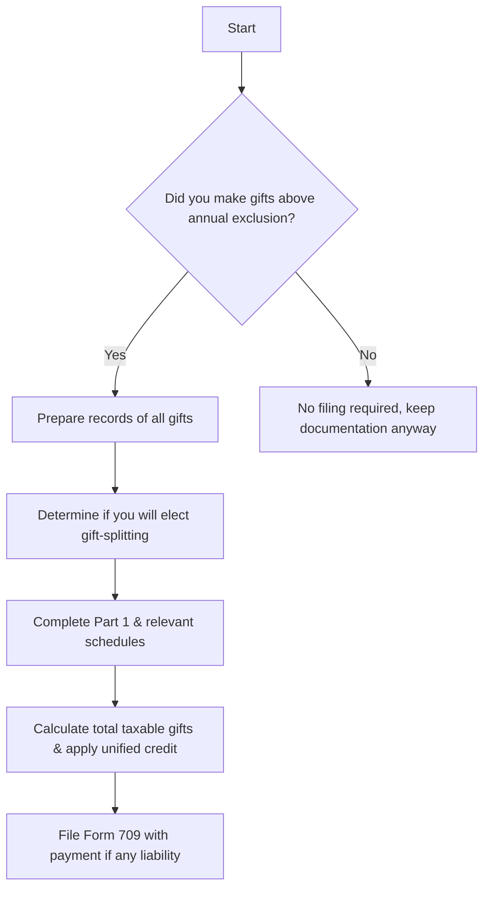

## 6.4 Compliance: Completing Form 709 & Record-Keeping

Form 709, the U.S. Gift (and Generation-Skipping Transfer) Tax Return, is a critical document for individuals who wish to remain compliant with the federal gift tax system. Whether making cash gifts, transferring property interests, or navigating complex gifting strategies, proper completion of Form 709 ensures alignment with the annual gift tax exclusion, unified credit, and potential generation-skipping transfer tax (GSTT) obligations.

Thorough and accurate record-keeping is indispensable—both for satisfying current IRS requirements and for establishing a correct basis for future estate tax calculations. This chapter provides comprehensive line-by-line instructions for completing Form 709, addresses common mistakes, and illustrates best practices for record retention to support future estate planning endeavors.

This topic also connects closely with other gift-related discussions in Chapter 6.1 (Unified Transfer Tax System & Unified Credit Limits) and advanced estate planning strategies introduced in Chapter 7 (Personal Financial Planning).

────────────────────────────────────────────────────────

## Overview of Gift Tax Filings

The gift tax system in the United States complements the estate tax system, ensuring that large transfers of wealth made during a donor’s lifetime are taxed similarly to those made at death. Gifts are subject to both an annual exclusion (adjusted annually for inflation) and the lifetime exemption, which is unified with the estate tax exemption level. When a donor’s total gifts exceed annual exclusion amounts—and/or involve more intricate transfers—Form 709 must be filed to track and report those gifts.

Form 709 is usually due by April 15 of the year following the gift. An extension for filing personal income tax returns (e.g., via Form 4868) automatically extends the due date for Form 709.

────────────────────────────────────────────────────────

## When to File Form 709

You must file Form 709 if:

• You gave gifts to any one individual that exceed the annual exclusion amount.  
• You made gifts of future interests (i.e., gifts that the donee cannot fully use, possess, or enjoy immediately).  
• You “split gifts” with a spouse, effectively doubling the annual exclusion.  
• You made a generation-skipping transfer, subjecting it to GSTT considerations.  

If no gift tax is ultimately owed because of the lifetime exemption or because the gifts were below annual exclusion thresholds, you may still be required to file Form 709 solely for record-keeping and compliance if any single gift exceeded the annual exclusion.

────────────────────────────────────────────────────────

## Structure of Form 709

Form 709 consists of the main return and several schedules. Here is a high-level breakdown:

• Part 1: General information about the donor (name, address, SSN) and spouse, if electing to split gifts.  
• Part 2: Tax Computation, including the calculation of total gifts, deductions, and the use of any unified credit if necessary.  
• Schedules A and A–M: Detailed listing of each gift, including description, date, value, exclusions, and GST allocations (Schedule A–M is used specifically for GST-related computations).  
• Schedule B: Donor’s previous gift history, including prior year gifts and how they integrate with the current year’s gift amounts.  
• Schedule C: Deceased Spousal Unused Exclusion (DSUE) if applicable.  
• Worksheets: Additional worksheets for computing GST tax and allocation of any GST exemption.

The complexity of your gift scenario determines which sections and schedules apply.

────────────────────────────────────────────────────────

## Line-by-Line Guidance

Below is an illustrative walk-through of key lines and schedules in Form 709. Please note that we have abbreviated some lines for brevity, focusing on common areas of confusion. Always consult the official IRS Form 709 Instructions for the most up-to-date guidance.

### Part 1: General Information
• Line 1: Donor’s Information  
  – Provide name, address, SSN, and year as requested.  
• Line 2: Citizenship  
  – Indicate whether you are a U.S. citizen or resident alien.

### Part 1 (continued): Split Gift Election
• You and your spouse may elect to “split gifts,” essentially attributing half of each gift made by either spouse to the other spouse. This is beneficial if you have gifts exceeding the annual exclusion from one spouse’s assets.  

In the lines following, you will provide details on whether you intend to split gifts for the calendar year. Both spouses must sign Form 709 when splitting gifts.

### Part 2: Tax Computation
• Line 1: Total Taxable Gifts for Prior Periods  
  – Use Schedule B to list and total your cumulative prior gifts.  
• Line 2: Total Current Year Taxable Gifts  
  – This figure comes from Schedule A, the net of all reportable gifts after exclusions and deductions.  
• Line 6: Allowable Credits (e.g., Unified Credit)  
  – Remember that using the gift tax unified credit during life directly reduces the remaining amount available for estate tax exemption at death.  

### Schedule A: Computation of Taxable Gifts
Schedule A is where you list each gift, its value, and the type (e.g., cash, property, real estate). A separate line entry is usually needed for each gift if the gifts differ in type, date, or donee.

• Column A: Item number (tracking for reference)  
• Column B: Description of gift and donee  
  – Provide sufficient detail, especially for complex gifts (e.g., real property location, identifying stock symbols, or entity interest percentage).  
• Column C: Date of gift  
• Column D: Value at date of gift  
  – If property other than cash is gifted, consider a qualified appraisal.  
• Column E: Annual exclusion  
  – If the gift qualifies for an annual exclusion, enter the allowed portion here.  
• Column F: Net transfer after exclusion  
• Column G: Code for type of gift (e.g., direct, split, or community property)

### Schedule B: Previous Gift History Adjustment
Schedule B is used to report all prior years’ taxable gifts and unify them with the current year’s. If you have never made a reportable gift before, many lines will be zero.

• Line 1: Enter total of all gifts that were subject to gift tax in prior periods.  
• Subtotals: Cumulative gift totals are carried into Part 2 for final tax computation.

### Schedule C and GST Schedules
You would only complete these if relevant to your situation, such as applying DSUE from a predeceased spouse or allocating GST exemption to a grandchild or lower-generation individual.

────────────────────────────────────────────────────────

## Practical Example

Consider Sarah, a single taxpayer who gifted the following during the year:  
• $40,000 cash to her niece (21 years old).  
• Marketable securities worth $20,000 to her nephew (17 years old).  
• Split gifts are not relevant since Sarah is single.

Annual exclusion for the year is $17,000. Sarah must file Form 709 because her gift to her niece exceeded the annual exclusion by $23,000.

On Schedule A, Sarah would:
• List the $40,000 gift to her niece:  
  – Value at date of gift: $40,000  
  – Annual exclusion used: $17,000  
  – Taxable portion: $23,000  

• List the $20,000 gift to her nephew:  
  – Value at date of gift: $20,000  
  – Annual exclusion used: $17,000  
  – Taxable portion: $3,000  

Sarah’s total current year taxable gifts (Line 2 of Part 2) amount to $26,000 ($23,000 + $3,000). If she has not used any of her lifetime exemption in prior years, no gift tax is owed. However, Form 709 remains necessary to properly report and reduce her remaining unified credit.

────────────────────────────────────────────────────────

## Mermaid Diagram: High-Level Workflow for Completing Form 709

Below is a mermaid.js diagram illustrating the general process for determining if Form 709 is required and how to file it properly.

Explanation of the workflow:
• Start by assessing whether any single gift exceeds the annual exclusion.  
• If yes, compile records and consider whether to split gifts.  
• Complete the relevant sections of Form 709.  
• Calculate tax (if any) and file timely.  
• If no, you typically need not file, but always retain documentation for future reference.

────────────────────────────────────────────────────────

## Importance of Thorough Documentation

Record-keeping is more than just collecting receipts. Detailed or summarized duplicative documentation helps verify fair market values, annual exclusion allocations, and keeps a transparent history for future estate calculations. Key documents to retain include:

• Appraisals for real estate or other hard-to-value assets.  
• Bank statements or wire transfer confirmations for cash gifts.  
• Brokerage statements for securities values at the date of transfer.  
• Partnership/LLC operating agreements if you transferred business interests.  
• Signed and dated gift letters if required.  
• Copies of prior filed Forms 709.  

Such documentation can expedite audits, reduce the potential for penalties, and ensure that your estate executor has a clear understanding of prior gift usage.

────────────────────────────────────────────────────────

## Common Pitfalls & Best Practices

• Failure to include gifts of future interests: Future interests do not qualify for the annual exclusion. You must report them even if their current value is minimal.  
• Overlooking gift-splitting limitations: Spouses must be married at the time of the gift and remain married at year-end to qualify. Legal separation or divorce can complicate gift-splitting.  
• Not properly valuing non-cash assets: Failing to obtain an appraisal for real estate or closely held business interests can lead to inaccurate reporting and disputes with the IRS.  
• Missing deadlines: Late filing can result in interest and penalties, especially if gift tax is due.  
• Ignoring the GST angle: Transferring assets to grandchildren might create additional GST tax considerations that require separate calculations.  
• Incomplete prior year tracking: Misreporting cumulative gifts leads to underreporting or overreporting unified credit usage.

Best practices to avoid these pitfalls include:
• Maintain a separate file for all gift-related documents, including appraisals.  
• Consult a qualified appraiser or valuation specialist for non-cash gifts.  
• Double-check that all relevant boxes and lines are filled, even if zero.  
• Use the official IRS instructions as a step-by-step guide.  
• Consult a tax advisor for high-value or complex gifting scenarios.

────────────────────────────────────────────────────────

## Additional Tables and Checklists

Below is a sample table to help track gifts:

| Donee             | Date of Gift | Gift Type          | Gift Value | Annual Exclusion Applied | Taxable Amount |
|-------------------|-------------:|--------------------|-----------:|-------------------------:|---------------:|
| Niece (Age 21)    | 05/01/20XX   | Cash               | $40,000    | $17,000                 | $23,000        |
| Nephew (Age 17)   | 07/01/20XX   | Marketable Sec.    | $20,000    | $17,000                 | $3,000         |
| Parent (Age 60)   | 08/15/20XX   | Real Estate Interest (10%) | $50,000 (Appraised) | $17,000       | $33,000        |

Use a checklist to organize your documentation:
• ( ) Confirm gift values with supporting evidence.  
• ( ) Obtain signed spousal consent for gift-splitting.  
• ( ) Complete relevant schedules and attach copies of appraisals, if applicable.  
• ( ) Evaluate GST allocations, if any.  
• ( ) Retain copies of Form 709 filed in prior years.

────────────────────────────────────────────────────────

## Future Estate Calculations and Form 709

Form 709 is not just a stand-alone requirement for each year’s gifting; it also forms the foundation of your cumulative lifetime giving record and the calculation of your estate tax exemption at death. Any amounts used against your unified credit for lifetime gifts reduce the remaining credit available to offset estate tax. Meticulous record-keeping, therefore, ensures a seamless transition if your estate later becomes taxable or if significant changes in estate or gift tax law occur.

Key tips for future estate planning:
• Keep a running total of lifetime gifts.  
• Update your estate plan documents to reflect major gift transactions.  
• Regularly consult with estate planning professionals to ensure that your gifting strategies align with changing laws.

────────────────────────────────────────────────────────

## References for Further Exploration

• IRS Instructions for Form 709 (latest revision)  
• IRS Publication 559 (Survivors, Executors, and Administrators)  
• IRS Publication 561 (Determining the Value of Donated Property)  
• Chapter 6.2 of this book for in-depth valuation techniques and discounts  
• Chapter 27 (Advanced Estate & Gift Integration) for more complex gifting strategies  
• Estate Planning Texts:  
  – “Estate & Gift Tax Handbook” by CCH  
  – “The Tools & Techniques of Estate Planning” by Leimberg et al.  

────────────────────────────────────────────────────────

## Mastering Form 709: Gift Tax Filings & Documentation Quiz



### Which of the following gifts generally requires filing Form 709?
- [ ] A $10,000 cash gift to a single recipient during the year.
- [ ] A $17,000 cash gift to a single recipient during the year.
- [ ] A $15,000 gift to each of three donees.
- [x] A $20,000 cash gift to a single recipient during the year.

> **Explanation:** Any gift exceeding the annual exclusion amount ($17,000 in the example) triggers Form 709 filing requirements.

### Which of the following is a disadvantage of failing to properly document a gift’s fair market value?
- [x] Potential underreporting, penalties, or disputes in future IRS examinations.
- [ ] Inability to split gifts with a spouse.
- [ ] The gift cannot be made legally.
- [ ] Automatic disqualification from the annual exclusion.

> **Explanation:** Insufficient documentation of fair market value opens the door to disputes with the IRS and penalties for underreporting.

### Which section of Form 709 lists cumulative gifts from prior periods?
- [x] Schedule B
- [ ] Schedule A
- [ ] Schedule C
- [ ] Part 2, Line 5

> **Explanation:** Schedule B captures prior year gifts and helps calculate the total lifetime gift amount used.

### What is the primary reason for obtaining professional appraisals for non-cash gifts?
- [ ] To reduce the number of recipients of a gift.
- [x] To establish a credible fair market value and support accurate reporting.
- [ ] To eliminate the need for a CPA signature.
- [ ] To avoid paying filing fees.

> **Explanation:** A professional appraisal provides defensible valuations for non-cash gifts, ensuring accurate reporting on Form 709.

### If a taxpayer and spouse wish to “split gifts,” both spouses must:
- [x] Be married to each other when the gift is made and remain married at year end.
- [ ] Be separated when the gift is made.
- [x] Each sign the consent statement on Form 709.
- [ ] Have different permanent addresses.

> **Explanation:** For gift-splitting, spouses must meet marriage requirements, and both spouses must sign Form 709.

### When a taxpayer exceeds the annual gift tax exclusion, what happens to the excess value of the gift?
- [x] It is subtracted from the donor's remaining lifetime exemption.
- [ ] It is immediately subject to a flat 25% tax.
- [ ] It cannot be gifted legally.
- [ ] It becomes void if not accepted by the donee.

> **Explanation:** Excess amounts reduce the donor’s lifetime exemption, which in turn reduces the remaining estate tax exemption.

### Which of the following is a common pitfall in filing Form 709?
- [x] Excluding gifts of future interests from reporting because “no present benefit was received.”
- [ ] Filing the form electronically.
- [x] Not using qualified appraisers for expensive property gifts.
- [ ] Filing the form on time.

> **Explanation:** Many individuals overlook gifts of future interests because they can’t be used immediately by the donee, yet they must be included. Similarly, not obtaining qualified appraisals is a frequent error.

### Why is it beneficial to keep copies of previous Form 709 filings?
- [x] They establish a donor’s cumulative lifetime gift history.
- [ ] They are required to receive any cost-of-living adjustments.
- [ ] They provide a discount to filing fees.
- [ ] They reduce the number of lines needed on the current form.

> **Explanation:** Prior Form 709s detail the donor’s lifetime gifts, ensuring accurate computations of current and future tax liabilities.

### Which scenario requires GST allocation considerations on Form 709?
- [x] A gift to a grandchild from a grandparent.
- [ ] Any gift to a U.S. citizen spouse.
- [ ] A gift transferring a remainder interest to a trust for a sibling.
- [ ] A gift of $15,000 to an unrelated friend.

> **Explanation:** Gifts skipping one or more generations, such as a direct gift to a grandchild, may trigger generation-skipping transfer tax liabilities.

### True or False: Filing an extension for your individual tax return (Form 4868) also extends the due date of Form 709.
- [x] True
- [ ] False

> **Explanation:** An automatic extension for an individual income tax return via Form 4868 also extends the filing date for Form 709.



────────────────────────────────────────────────────────

## For Additional Practice and Deeper Preparation

**[TCP CPA Hardest Mock Exams: In-Depth & Clear Explanations](https://www.udemy.com/course/tcp-cpa-mock-exams/?referralCode=675149871D0E79B1699C)**  

**Tax Compliance & Planning (TCP) CPA Mocks:** 6 Full (1,500 Qs), Harder Than Real! In-Depth & Clear. Crush With Confidence! 

- Tackle full-length mock exams designed to mirror real TCP questions.  
- Refine your exam-day strategies with detailed, step-by-step solutions for every scenario.  
- Explore in-depth rationales that reinforce higher-level concepts, giving you an edge on test day.  
- Boost confidence and minimize anxiety by mastering every corner of the TCP blueprint.  
- Perfect for those seeking exceptionally hard mocks and real-world readiness.  

_Disclaimer: This course is not endorsed by or affiliated with the AICPA, NASBA, or any official CPA Examination authority. All content is for educational and preparatory purposes only._
