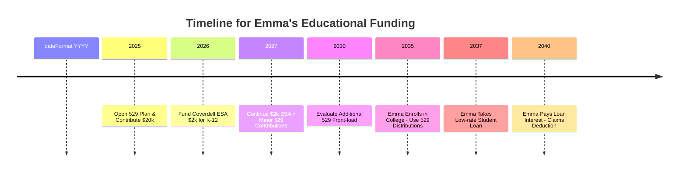

## 7.2 Educational Funding (529 Plans, Coverdell ESAs, Student Loan Interest)

Educational costs often present a formidable financial challenge for individuals and families. From elementary years to higher education, the tax code offers various opportunities to plan, save, and potentially reduce tax liabilities. Understanding vehicles such as 529 Plans, Coverdell Education Savings Accounts (ESAs), and the Student Loan Interest Deduction can be pivotal in creating efficient financial strategies. This section contrasts tax-free growth against deductibility of contributions, highlights the implications on gift tax and estate planning, and underscores key exam points for CPA candidates. We also discuss practical techniques, including front-loading contributions to 529 Plans, which can offer distinct advantages under certain circumstances.

This section builds on concepts introduced in Chapters 3, 4, and 6. In particular, references to the gift tax system (Chapter 6) may help students see how educational funding can integrate into broader estate and wealth transition strategies. 

--------------------------------------------------------------------------------
  
## Overview of Educational Funding Vehicles

Before delving into specifics, it is helpful to see how these vehicles fit within an overall financial plan. Both 529 Plans and Coverdell ESAs offer significant tax advantages compared to traditional savings accounts when the funds are used for qualified education expenses. Meanwhile, the deduction for student loan interest helps taxpayers avoid some of the tax burden on the interest they pay, making the cost of borrowing more manageable.

Below is a simplified conceptual diagram, illustrated in Mermaid, showing how funds typically flow into and out of these accounts:

```mermaid
flowchart LR
    A[Account Owner / Contributor] --> B((529 Plan<br>or ESA))
    B -->|Qualified Education<br>Expense Payment| C[School/University]
    D[Loan Servicer] --> E((Student Loan))
    E -->|Tuition Payment| C[School/University]
    F[Tax Deduction<br>(Interest Paid)] --> D
```

In this diagram:  
• 529 Plans and Coverdell ESAs serve as savings vehicles.  
• Funds flow from contributors (often parents or grandparents) into these accounts.  
• The accounts then cover qualified education expenses.  
• Student Loans are direct arrangements between borrowers and loan servicers; the interest each year often qualifies for a partial deduction if income limits are met.

--------------------------------------------------------------------------------

## 1. 529 Plans

### 1.1 Key Characteristics

A 529 Plan—also known as a Qualified Tuition Program (QTP)—is arguably the most popular educational savings vehicle in the United States. Its distinguishing characteristics include:

• Tax-deferred growth on investments.  
• Tax-free withdrawals for qualified education expenses.  
• High lifetime contribution limits, often varying widely by state.  
• Account owner retains control, including the ability to change beneficiaries.  
• No age limits for beneficiaries in most states (funds can be transferred to younger siblings or future grandchildren if properly managed).

Throughout your CPA exam studies (and especially on the Tax Compliance and Planning portion), keep in mind that although 529 Plans are authorized under federal law (Section 529 of the Internal Revenue Code), they are sponsored by states. Each state’s plan can have unique investment options and administrative details, so the rules on contributions and allowable investments can differ.

### 1.2 Tax Implications: Federal vs. State Perspectives

Contributions to 529 Plans are not deductible on the federal return. Thus, a taxpayer who contributes $5,000 to a 529 Plan will not reduce his or her Adjusted Gross Income (AGI) at the federal level. However, a significant incentive often lies in the state-level treatments. Many states offer:

• State income tax deductions or credits for contributions made to their own 529 Plan (or in some instances, any state’s 529 Plan).  
• Maximum contribution thresholds that can be spread across multiple years.  

Additionally, the investment growth inside a 529 Plan is tax-deferred, and when distributed for qualified education expenses, the earnings portion is federal (and often state) tax-free. For certified public accountants advising clients, the distinction between federal non-deductibility and state-level incentives is important when providing guidance on whether to contribute to a 529 Plan or consider other education savings routes.

### 1.3 Funding and Contribution Limits

States typically set lifetime contribution limits that range from roughly $235,000 up to $550,000 or more per beneficiary. Furthermore, anyone (parent, grandparent, friend) can contribute to a 529, making it an attractive vehicle for extended family members who wish to assist with educational expenses.

From a gift tax perspective, annual contributions to a 529 Plan are treated as gifts to the beneficiary. However, a unique rule allows for “front-loading” up to five years’ worth of gift tax annual exclusions. For example, if the annual gift tax exclusion is $17,000, an individual can contribute up to $85,000 to a single beneficiary’s 529 Plan in one year (i.e., $17,000 × 5 years) without incurring gift tax, provided no other gifts are made to that beneficiary during that five-year window. A married couple could double this amount (up to $170,000) if splitting gifts. This strategy is frequently tested on the CPA Exam in scenarios that overlap with gift and estate planning rules (also see Chapter 6 for deeper discussions on gift taxation).

### 1.4 Qualified Education Expenses

Originally, 529 Plans were intended for higher education expenses. Over time, legislative changes—especially those introduced through the Tax Cuts and Jobs Act (TCJA)—expanded the definition of qualified distributions to include certain K–12 expenses (up to $10,000 per year, per beneficiary, for tuition). It is critical to note that not all states conformed to these expansions for their state tax preferences, so the CPA candidate should test knowledge of relevant state rules and the potential for partial recapture of deductions if nonconforming.

Qualified expenses generally include:

• Tuition and mandatory fees at colleges, universities, or vocational schools.  
• Room and board costs (subject to certain limits).  
• Books, supplies, and equipment required for enrollment.  
• Computers and internet access if needed for enrollment or attendance (varies by plan).  
• K–12 tuition (up to $10,000 per year per beneficiary, federally).  

### 1.5 State Tax Benefits and Pitfalls

Because a 529 Plan is state-sponsored, the biggest immediate tax benefit is often the state-level deduction or credit. Refer back to your SALT (State and Local Tax) knowledge from Chapter 23 for more detail on how different jurisdictions handle 529 contributions. A common pitfall arises if a taxpayer moves from one state to another and originally claimed a state deduction for the 529 Plan contribution in the home state. Later rollovers or distributions for nonqualifying expenses may trigger recapture of prior deductions.

### 1.6 Strategic Front-Loading of 529 Contributions

You may encounter exam questions on front-loading, particularly in the context of gift tax annual exclusion rules (detailed in Chapter 6). By contributing a lump sum of up to five years of annual exclusions, the donor can potentially achieve maximum future tax-free growth while locking in a comprehensive funding strategy for the beneficiary. This method can be powerful in estate planning since contributions are removed from the donor’s estate (subject to certain conditions).  

However, a front-loaded contribution has potential risks:

• The beneficiary might not attend college or might choose a less expensive route, leaving excess funds.  
• Legislative changes to 529 usage might shift or add complexity down the road.  

As the Tax Compliance & Planning exam often focuses on multi-year planning, examine how the interplay between timing, beneficiary choice, and beneficiary changes can alter overall tax outcomes.

--------------------------------------------------------------------------------

## 2. Coverdell Education Savings Accounts (ESAs)

### 2.1 Key Aspects

A Coverdell ESA, in contrast to a 529 Plan, has more restrictive annual contribution limits but also allows potentially broader usage of funds for elementary and secondary education. Coverdell ESAs are established through a custodian or trustee, and:

• Contributions are capped at $2,000 per beneficiary, per year.  
• Phaseout rules apply to the contributor’s Modified Adjusted Gross Income (MAGI).  
• Earnings grow tax-free if used for qualified education expenses.  
• Funds must be used before the beneficiary reaches age 30 (with some exceptions for special needs beneficiaries).  

While the annual contribution limit is much lower than most 529 Plans, the breadth of qualified expenses is more explicit and flexible, covering a wide array of costs (e.g., books, uniforms, tutoring, and educational therapy). A family that surpasses the MAGI limit or desires to contribute more than $2,000 annually might prefer a 529 Plan. Nonetheless, for certain specialized education needs (like private religious elementary or specialized tutoring), a Coverdell ESA can be extremely beneficial.

### 2.2 Comparison With 529 Plans

Below is a table comparing high-level distinctions between Coverdell ESAs and 529 Plans:

| Feature                            | 529 Plan                                   | Coverdell ESA                     |
|------------------------------------|--------------------------------------------|-----------------------------------|
| Annual Contribution Limit          | Varies by state; no specific fed annual cap, but subject to gift tax rules | $2,000 per beneficiary per year   |
| Federal Tax Deduction of Contributions | None (Possible state tax deductions)          | None                               |
| Age Limit for Beneficiary          | None in most states (except for K–12 usage limit of $10,000/yr) | Must use funds by age 30 (except special needs) |
| MAGI Phaseouts for Contributions   | None                                       | Yes (contribution limited/eliminated for high earners) |
| Qualified Expenses                 | College / vocational, plus limited K–12 (up to $10,000) | Broader K–12, secondary, and higher ed. expenses         |
| Penalties for Nonqualified Distributions | Earnings portion taxed + 10% penalty         | Earnings portion taxed + 10% penalty |

### 2.3 Funding, Timing, and Plan Administration

Unlike 529 Plans, which may have multiple investment options (some states offering a range of portfolios or FDIC-insured savings vehicles), Coverdell ESAs are typically opened with brokerages or banks. The maximum annual contribution is $2,000 per year, per child, with contributions allowed until the child is 18 (unless special needs). Excess contributions (above $2,000) can lead to penalty taxes.

### 2.4 Tax-Free Growth vs. Deductibility

As with 529 Plans, the fundamental advantage is tax-free growth if distributions are used for qualified education expenses. This stands in contrast to receiving any sort of upfront deduction—there is none at the federal level for Coverdell contributions. Consequently, from a pure deposit perspective, these contributions behave similarly to a Roth IRA’s “after-tax” deposit structure: no immediate deduction, but future growth can be shielded from tax if qualification rules are satisfied.

--------------------------------------------------------------------------------

## 3. Student Loan Interest

### 3.1 Overview of Student Loan Interest Deduction

The Student Loan Interest Deduction allows eligible taxpayers to deduct part of the interest paid on qualified educational loans, up to a statutory maximum of $2,500 per year. This deduction directly reduces a taxpayer’s adjusted gross income (AGI), making it an above-the-line deduction. This means an individual can claim it even if they do not itemize deductions on Schedule A.

### 3.2 Qualification Criteria

To claim the Student Loan Interest Deduction:

1. The taxpayer must be legally obligated to pay the loan (i.e., the loan is in the taxpayer’s name).  
2. The loan proceeds must have been used solely for qualified educational expenses for the taxpayer, spouse, or dependent.  
3. The taxpayer’s filing status cannot be “Married Filing Separately.”  
4. The taxpayer and the student (if different from the taxpayer) must not be claimed as dependents on someone else’s return.  

### 3.3 Phaseouts and MAGI Thresholds

One critical exam point often revolves around phaseouts. The amount of student loan interest that can be deducted is gradually reduced as the taxpayer’s MAGI rises above certain thresholds. While these thresholds are subject to annual adjustment, the CPA candidate should comfortably recall that the maximum deduction is eliminated once the taxpayer’s income surpasses the top limit of the phaseout. Awareness of these thresholds (and changes over time) is key for planning. If an individual’s MAGI is nearing or exceeding the limit, advanced timing strategies or larger principal payments might yield better tax results in the short run.

### 3.4 Impact on Education Funding Decisions

Sometimes families debate whether to fund tuition through 529 Plans or to rely on student loans (hoping to deduct a portion of the interest). From a purely tax perspective, the 529 Plan is often more beneficial if it is adequately funded because the growth and withdrawals are not taxed at all if used for qualified expenses. The student loan interest deduction can potentially offset some, but not most, of the actual borrowing costs, especially if interest rates are high or if the taxpayer’s income disqualifies them from the deduction. Additionally, there is a $2,500 statutory maximum, so the net tax savings often pale compared to the potential benefits of a fully funded 529 Plan.

--------------------------------------------------------------------------------

## 4. Comparing Tax-Free Growth vs. Contributions’ Deductibility

A frequent area of confusion for CPA exam candidates is the distinction between tax-free growth and contributions’ deductibility. Many educational saving vehicles, like 529s and Coverdell ESAs, forgo an upfront federal tax deduction on contributions; instead, they grow tax-free if used properly for education expenses. This “back-end” tax benefit can be very valuable, particularly over long time horizons. 

By contrast, a “deduction-based” strategy would be more akin to traditional deductible IRA contributions (though not specifically for education), or the Student Loan Interest Deduction (limited to $2,500 annually). For a quick example:

• A $10,000 contribution to a 529 Plan is not deductible, but if it grows to $20,000 over time and is fully used for qualifying tuition, that $10,000 in earnings is never taxed.  
• A $10,000 contribution to a deductible IRA might reduce current AGI if within allowable limits, but future growth and distributions are taxable (unless used for specialized IRA-based education exemptions, which come with their own complexities).  

**Key exam insight**: The question “Which is better: a deduction at the outset or tax-free growth at the end?” usually depends on the taxpayer’s marginal tax bracket, the timeframe for growth to occur, and the projected magnitude of earnings.

--------------------------------------------------------------------------------

## 5. Deeper Strategies and Real-World Considerations

### 5.1 Front-Loading 529 Contributions

We introduced the concept of front-loading earlier. Take the example of a married couple with substantial assets who wish to fund the education of their newborn grandchild. They can utilize their combined gift tax exemptions for five years, contributing $170,000 at once without gift taxes. This lumpsum deposit could, over time, compound significantly. By the time the child is college-bound, the growth could be substantial and all tax-free if distributed for qualified education expenses.

**Potential Pitfalls**:

• If the student does not pursue higher education, the account might later need to be re-designated. Nonqualified withdrawals or distributions to other beneficiaries carry possible tax and penalties on the earnings portion.  
• The five-year election must be appropriately reported on Form 709 (Gift Tax Return).  

### 5.2 Leaving Room for Coverdell ESAs

Families might adopt a dual strategy: partial 529 funding plus a Coverdell ESA. The ESA can be used for current-year K–12 expenses that a 529 might not fully cover or that the family wants to keep separate for simpler tracking. For instance, a child with special tutoring needs might see those costs covered from a Coverdell ESA, while a 529 remains primarily for future college or university expenses.

### 5.3 Maximizing the Student Loan Interest Deduction

While the maximum deduction is $2,500, some savvy tactics include:

• Coordinating the timing of payments to fall within a single tax year to maximize the deductible interest.  
• Ensuring the taxpayer’s MAGI is within the allowable range. If nearing the limit, Roth IRA conversions or large capital gains might push the taxpayer over the threshold and reduce or eliminate the deduction.  

### 5.4 Integrating Gift and Estate Planning Considerations

From an estate planning perspective, large 529 contributions can remove assets from the donor’s taxable estate (provided the donor outlives the five-year front-load period and adheres to other relevant rules). This synergy can be particularly powerful: combining the gift tax exclusion with long-term tax-free growth for the benefit of a future generation. Chapter 6 provides expanded discussion on unified credit and related estate/gift interactions.

--------------------------------------------------------------------------------

## 6. Practical Examples and Case Studies

In practice, CPAs often encounter situations where families blend these strategies. Let’s look at a hypothetical scenario:

**Case Study Example**  
Mike and Linda, married taxpayers filing jointly, have a newborn daughter, Emma. They want to fund Emma’s private K–12 and future college tuition. They also anticipate high incomes in their future, which might phase them out of the Coverdell ESA. This leads them to:

1) Contribute $20,000 to their state’s 529 Plan in Emma’s name. They receive a modest state-level tax deduction for part of that contribution.  
2) For the next few years, they also fund a Coverdell ESA with the maximum $2,000 annually while their MAGI remains below the threshold. They use these Coverdell distributions in real time for Emma’s private K–12 expenses.  
3) They plan to front-load additional 529 contributions once they are certain Emma will attend a four-year college.  

During high school, Emma obtains a student loan for a portion of advanced tutoring and extra classes. Linda co-signs the loan, but Emma is the primary borrower. Because Emma is not claimed as a dependent on Linda’s return once Emma is older and has a part-time job, Emma can potentially claim the Student Loan Interest Deduction herself on future returns, subject to her own MAGI thresholds.

---

## 7. Diagrams and Visual Summaries

Below is a second Mermaid diagram highlighting a timeline approach and interplay between these educational funding vehicles:



This timeline helps visualize how parents might layer different approaches over a child’s pre-college years and post-college loan repayment period.

--------------------------------------------------------------------------------

## 8. Best Practices, Common Pitfalls, and Examination Tips

• Always verify MAGI thresholds for Coverdell ESA contributions and student loan interest deduction eligibility.  
• Keep an eye on state-level regulations for 529 Plan benefits and recapture provisions.  
• Understand the gift tax implications of front-loading 529 Plan contributions—report them properly on Form 709.  
• Monitor legislative developments, as permissible uses of 529 Plan funds have expanded over the years.  
• Compare the short-term benefits of any potential interest deduction with the long-term power of tax-free growth.  

When encountering multiple-choice questions on the CPA exam, watch for tricky details about nonqualified 529 withdrawals (which might trigger penalties) or the complexities of changing beneficiaries. Also, be mindful of the federal vs. state dichotomy: 529 Plans are not federal tax-deductible, but a state deduction may be offered in the exam scenario.

--------------------------------------------------------------------------------

## 9. Summary and References for Further Study

Navigating 529 Plans, Coverdell ESAs, and the Student Loan Interest Deduction is crucial for individuals and families seeking to optimize their education-funding strategies. From leveraging tax-free growth to timing interest payments for maximum deductions, a range of tools exists to lower the net cost of education. 

• Chapter 6: Consult for gift and estate tax interaction when front-loading 529 contributions.  
• Chapter 23: Explore advanced State and Local Tax (SALT) implications for 529 Plans.  
• Visit the IRS website (irs.gov) for annual updates to deduction limits and phaseout thresholds.  
• Look to your state government’s website for 529 Plan details, contribution limits, and any possible recapture rules.

--------------------------------------------------------------------------------

## Quiz on Educational Funding (529 Plans, Coverdell ESAs, Student Loan Interest)



### Which of the following statements correctly describes the federal tax treatment of contributions to a 529 Plan?

- [ ] Contributions are federally deductible up to $2,500 per year.  
- [x] Contributions are not federally deductible, but earnings can grow tax-free.  
- [ ] Contributions are deductible if the beneficiary is under age 18.  
- [ ] Contributions are only deductible for married couples filing jointly.  

> **Explanation:** At the federal level, 529 Plan contributions do not receive a deduction. However, the growth is tax-free for qualified education expenses.

### Which of the following is a key advantage of the Student Loan Interest Deduction?

- [x] It reduces Adjusted Gross Income (AGI), allowing taxpayers to benefit even if they do not itemize.  
- [ ] It provides a dollar-for-dollar tax credit, lowering the tax bill directly.  
- [ ] It is unlimited if the taxpayer’s loans are private rather than federal.  
- [ ] It always offsets the total interest paid on educational loans.  

> **Explanation:** The Student Loan Interest Deduction is an above-the-line deduction, meaning it lowers AGI and is available whether the taxpayer itemizes or takes the standard deduction, up to the annual limit of $2,500.

### When a donor front-loads a 529 contribution under the gift tax rules:

- [ ] They can only spread contributions over two years without gift tax.  
- [x] They can elect to treat the contribution as made ratably over five years.  
- [ ] They cannot make any additional 529 contributions during that beneficiary’s lifetime.  
- [ ] The entire contribution is immediately subject to estate tax.  

> **Explanation:** Front-loading allows a donor to contribute up to five times the annual gift tax exclusion at once and treat it as made over five years, so long as all rules are followed and reported on Form 709.

### Which of the following is a requirement for deducting Student Loan Interest?

- [ ] The taxpayer must be filing “Married Filing Separately.”  
- [x] The loan proceeds must have been used solely for qualified education expenses.  
- [ ] The interest was paid on a business loan that was converted into a student loan.  
- [ ] The taxpayer must claim the student as a dependent every year.  

> **Explanation:** One of the key requirements for this deduction is that the loan must have been used strictly for qualified education expenses. Additionally, the taxpayer generally must not file as Married Filing Separately to be eligible.

### Which of the following statements about Coverdell ESAs is TRUE?

- [x] There is an annual contribution limit of $2,000 per beneficiary.  
- [ ] There are no MAGI phaseouts for contributions.  
- [x] They can only fund higher education expenses, not K-12.  
- [ ] They always allow front-loading contributions using the gift tax exclusion.  

> **Explanation:** Coverdell ESAs have a $2,000 annual contribution cap and are subject to MAGI phaseouts. One major benefit is that Coverdell ESAs can cover K-12 expenses in addition to higher education.

### A taxpayer contributes to both a 529 Plan and a Coverdell ESA for the same beneficiary in the same year. Which of the following best describes the tax result?

- [x] This is allowed, but each account has its own set of rules for contributions and qualified withdrawals.  
- [ ] Contributions to both plans in one year completely eliminate any Student Loan Interest Deduction.  
- [ ] Only one plan will be allowed to grow tax-free, while the other account’s earnings are taxable.  
- [ ] Contributions to both accounts can be deducted on the taxpayer’s federal return.  

> **Explanation:** A taxpayer can contribute to both plans concurrently. However, the accounts retain independent requirements and distinct contribution limits. There is no direct offset or prohibition unless the taxpayer violates specific plan or federal guidelines.

### Which of the following commonly triggers a penalty on a 529 Plan distribution?

- [x] Using the distributed funds for nonqualified expenses.  
- [ ] Changing the beneficiary to a younger sibling.  
- [x] Rolling over the plan to a different state 529 Plan.  
- [ ] Investing in stock funds with higher risk profiles.  

> **Explanation:** Nonqualified withdrawals typically incur a 10% penalty on the earnings portion (plus the earnings become federally taxable). Rolling over from one state 529 Plan to another generally does not trigger a penalty if done within approved time limits.

### At the federal level, where is the Student Loan Interest Deduction taken on a taxpayer’s return?

- [x] As an adjustment to income on Schedule 1 of Form 1040 (above-the-line).  
- [ ] As an itemized deduction on Schedule A.  
- [ ] As a tax credit on Form 8863.  
- [ ] As a nonrefundable credit on Schedule 3.  

> **Explanation:** The Student Loan Interest Deduction is an adjustment to income, also known as an above-the-line deduction, typically detailed on Schedule 1 of Form 1040.

### Which of the following statements is accurate regarding the K–12 provision for 529 Plans?

- [x] Up to $10,000 per beneficiary per year can be used federally for tuition at elementary or secondary schools.  
- [ ] There is no limit, as 529s can be used for any K–12 expense in any amount.  
- [ ] K–12 distributions are subject to an automatic 10% penalty.  
- [ ] All states follow the federal provisions on K–12 usage without exception.  

> **Explanation:** After recent legislative changes, 529 funds can be used for K–12 tuition up to $10,000 per year, per beneficiary, for federal tax purposes. However, not all states fully conform, so state-level tax recapture or other restrictions could apply.

### A taxpayer has a $15,000 student loan and pays $2,000 in interest for the year. They meet all requirements for the Student Loan Interest Deduction. Is the entire $2,000 interest deduction guaranteed?

- [x] True
- [ ] False

> **Explanation:** Up to $2,500 is allowed for the Student Loan Interest Deduction, assuming all eligibility criteria (including MAGI phaseouts) are met. Therefore, the entire $2,000 interest portion would generally be deductible.



--------------------------------------------------------------------------------

## For Additional Practice and Deeper Preparation

**[TCP CPA Hardest Mock Exams: In-Depth & Clear Explanations](https://www.udemy.com/course/tcp-cpa-mock-exams/?referralCode=675149871D0E79B1699C)**  

**Tax Compliance & Planning (TCP) CPA Mocks:** 6 Full (1,500 Qs), Harder Than Real! In-Depth & Clear. Crush With Confidence! 

- Tackle full-length mock exams designed to mirror real TCP questions.  
- Refine your exam-day strategies with detailed, step-by-step solutions for every scenario.  
- Explore in-depth rationales that reinforce higher-level concepts, giving you an edge on test day.  
- Boost confidence and minimize anxiety by mastering every corner of the TCP blueprint.  
- Perfect for those seeking exceptionally hard mocks and real-world readiness.  

_Disclaimer: This course is not endorsed by or affiliated with the AICPA, NASBA, or any official CPA Examination authority. All content is for educational and preparatory purposes only._
