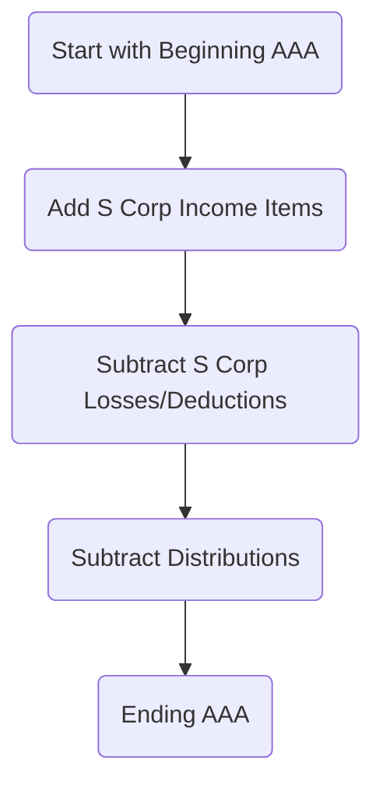
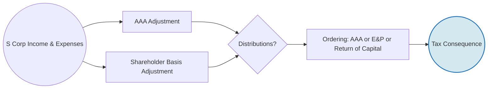

## 10.2 Shareholder Basis, AAA, Debt Basis & Distributions

S Corporations are a popular choice for closely held businesses in the United States due to pass-through taxation and limited liability for shareholders. However, the rules governing shareholder basis, the Accumulated Adjustments Account (AAA), and debt basis are often misunderstood or overlooked. In this section, we will explore how to calculate shareholder basis, maintain the AAA, evaluate debt basis, and account for distributions correctly. Understanding these concepts ensures accurate tax reporting and helps avoid IRS pitfalls regarding S Corporation compliance.

This discussion will include:
• A step-by-step approach to calculating annual changes in shareholder basis.  
• Thorough coverage of the AAA and its significance.  
• In-depth treatment of how debt basis is created and lost.  
• Detailed examples illustrating how to account for S Corporation distributions using AAA and E&P ordering rules.  

By mastering these principles, you can confidently navigate S Corporation taxation topics on the CPA (TCP) exam while also enhancing your skills in practical accounting and tax advice.

--------------------------------------------------------------------------------

### Overview of S Corporation Basis

In an S Corporation, income, losses, and other tax attributes flow through to shareholders. However, shareholders can only use these pass-through losses to the extent of their stock basis (sometimes supplemented by any debt basis). A proper understanding of basis is vital:

• Stock Basis: Represents the shareholder’s investment in the S Corporation’s stock.  
• Debt Basis: Where applicable, arises from loans made directly by shareholders to the S Corporation.  

A shareholder’s stock basis is used first to absorb allocated losses, and only when the stock basis is reduced to zero do allocations reduce the shareholder’s debt basis. To the extent a shareholder has no remaining basis (stock or debt), losses and deductions are suspended until basis is restored in the future.

--------------------------------------------------------------------------------

### Step-by-Step Calculation of Shareholder Stock Basis

Shareholder stock basis for an S Corporation starts with the amount originally paid (or contributed) for the stock. Each tax year, the basis is increased by the shareholder’s allocable share of S Corporation income items and reduced by the shareholder’s allocable share of losses and deductions, as well as any distributions.

Below is a common approach for calculating the annual changes, often summarized as:

1. Begin with Opening Basis.  
2. Add:  
   • Pass-Through Income (ordinary income, separately stated income items such as capital gains, tax-exempt income, etc.)  
   • Depletion in excess of basis, if applicable  
3. Subtract:  
   • Pass-Through Losses and Deductions (ordinary losses, separately stated losses, nondeductible expenses other than distributions)  
   • Distributions (but not below zero—if basis is insufficient, other rules take over)  
4. End with Closing Basis.

It is critical strictly to follow the ordering rules:
1. Increase basis for income first (including tax-exempt),  
2. Decrease basis for dedicated nondeductible expenses,  
3. Decrease basis for distributions,  
4. Decrease basis for losses or deductions.  

However, the IRS generally allows a different approach if it does not affect overall tax liability. For the CPA exam and best practice, remember the “add income first” principle.

#### Illustrative Yearly Basis Example

Assume Jennifer has a beginning S Corporation stock basis of $50,000 on January 1. In the current tax year, she is allocated:
• $30,000 of ordinary business income,  
• $5,000 of capital losses,  
• $20,000 of distributions, and  
• $2,000 of nondeductible expenses (e.g., certain fines or penalties not allowed as a deduction).

Let’s calculate her end-of-year stock basis step by step:

1. Starting Stock Basis: $50,000  
2. Add Ordinary Income of $30,000:  
   New Basis = $50,000 + $30,000 = $80,000  
3. Subtract Nondeductible Expenses of $2,000:  
   New Basis = $80,000 – $2,000 = $78,000  
4. Subtract Distributions of $20,000:  
   • Distributions reduce stock basis, but not below $0.  
   • New Basis = $78,000 – $20,000 = $58,000  
5. Subtract Capital Losses of $5,000 (ordinary or separately stated):  
   New Basis = $58,000 – $5,000 = $53,000  

Jennifer’s ending stock basis at year-end is $53,000.

--------------------------------------------------------------------------------

### Accumulated Adjustments Account (AAA)

The Accumulated Adjustments Account (AAA) is a key concept specific to S Corporations. It tracks the net income, losses, and distributions since the election of S status. Essentially, AAA measures the cumulative net “post-S election” income that has not yet been distributed to shareholders. This balance provides a mechanism for determining how distributions are taxed (as nontaxable returns of capital or as dividends).

#### Key Points on AAA

• **Increases** with S Corporation income (ordinary and separately stated) and is reduced by losses, deductions, and certain nondeductible expenses.  
• **Decreases** with distributions to the extent they do not exceed AAA.  
• Cannot be negative due to distributions; however, losses and deductions can drive AAA negative.  
• Does not include tax-exempt income or related expenses (these adjustments are made in a separate account, often called Other Adjustments Account, or OAA).  

#### Flow of AAA Maintenance

A simplified flow diagram of AAA updates each tax year can be illustrated using Mermaid syntax:

The AAA balance only matters when the S Corporation has distributions or moves from S to C status. If distributions exceed the AAA, they may trigger dividend treatment if the corporation has Accumulated Earnings & Profits (E&P) from prior C Corporation years.

--------------------------------------------------------------------------------

### Debt Basis: When and How It Counts

A shareholder’s debt basis arises when the shareholder makes a loan directly to the S Corporation. This basis may be used once the shareholder’s stock basis has been reduced to zero by pass-through losses or deductions. Critically:

• To create or restore debt basis, the shareholder must be the lender on a bona fide loan to the S Corporation.  
• Guarantees by the shareholder of bank loans do not create debt basis unless the shareholder actually repays the note on the S Corporation’s behalf, thereby becoming the true lender.  

If a shareholder experiences allocations of net losses that exceed their stock basis, these losses next reduce debt basis (but not below zero). Future net income allocations first restore any debt basis before restoring stock basis that can then be distributed.

#### Example of Impact on Debt Basis

Suppose Michael has an initial stock basis of $10,000 in an S Corporation and a debt basis of $15,000 from a direct shareholder loan. The corporation passes through a $20,000 loss this year:

1. Reduce stock basis first:  
   New Stock Basis = $10,000 – $10,000 = $0 (stock basis fully used)  
   Remaining Loss = $20,000 – $10,000 = $10,000  
2. Reduce debt basis for the excess $10,000:  
   New Debt Basis = $15,000 – $10,000 = $5,000  

Only $5,000 of debt basis remains for absorbing future losses. Michael’s suspended losses would be any losses in excess of total basis. But in this example, there was enough combined basis (stock + debt) fully to absorb the $20,000 of losses.

--------------------------------------------------------------------------------

### Distribution Ordering Rules: AAA vs. E&P

One of the more complex aspects of S Corporation taxation is classification of distributions. The main question is: Does a distribution come from the AAA (which usually means a nontaxable return of basis) or from Accumulated Earnings & Profits (E&P) leftover from C Corporation days (which means a taxable dividend)? The general priority for S Corporation distributions is as follows:

1. **From AAA** (to the extent available) → reduces shareholder stock basis and is generally not taxable except to the extent it exceeds the shareholder’s stock basis.  
2. **From Accumulated Earnings & Profits (E&P)** (left over from prior C Corp status) → taxed as a dividend to the extent of E&P.  
3. **From the shareholder’s stock basis** → reduces basis further if the distribution is not from AAA or E&P. If basis is exhausted, excess is treated as capital gain.  

#### Detailed Ordering Mechanism

1. **AAA Distribution**  
   - First offset the distribution against the AAA balance, reducing it.  
   - The distribution is generally tax-free to the extent the shareholder has sufficient stock basis.  
   - If the shareholder’s stock basis is less than the AAA portion of the distribution, the portion exceeding stock basis is taxed as capital gain.  

2. **Old C Corporation E&P**  
   - If AAA is reduced to zero or is insufficient, the distribution is a dividend to the extent of remaining E&P.  
   - This portion is taxed at dividend rates to the shareholder, which might be qualified dividend rates if all other rules are met.  

3. **Return of Capital**  
   - Once E&P is exhausted (or if there was no E&P to begin with), the distribution reduces the shareholder’s remaining stock basis.  
   - If stock basis is zeroed out with no remaining AAA or E&P, further distributions are capital gain to the shareholder.  

#### Numerical Example Illustrating Distribution Ordering

Consider a single distribution during the year. The S Corporation’s tax information is as follows:

• Beginning AAA: $50,000.  
• Accumulated E&P (from periods as a C Corporation): $30,000.  
• Budgeted distribution to shareholders: $70,000 in total (assume one shareholder for simplicity).  
• The shareholder’s stock basis before the distribution is $60,000.  

Step-by-Step:

1. Allocate distribution to AAA first: The AAA is $50,000, which is fully applied.  
2. The nontaxable portion cannot exceed the shareholder’s basis. The shareholder’s basis is $60,000, which is sufficient. The AAA portion of $50,000 is tax-free and reduces the shareholder’s stock basis:  
   - New Stock Basis = $60,000 – $50,000 = $10,000  
   - New AAA = $0 (fully used)  
3. Remaining distribution = $70,000 – $50,000 = $20,000. Now we look at E&P next.  
4. E&P of $30,000 is available, so the next $20,000 of distribution is treated as a taxable dividend.  
   - This does not reduce stock basis—dividends from E&P remain fully taxable.  
   - New E&P = $30,000 – $20,000 = $10,000  
5. The shareholder’s stock basis remains $10,000 after the distribution, and $10,000 of E&P is left for future distributions.

Thus, out of a $70,000 total distribution, $50,000 was a nontaxable return of AAA, and $20,000 was a taxable dividend from E&P.

--------------------------------------------------------------------------------

### Year-End S Corporation Basis, AAA, and Distributions: Step-by-Step Calculation

Let’s consolidate all these concepts into one integrated example, demonstrating both how annual basis changes occur and how distribution ordering flows.

#### Comprehensive Scenario Example

Assume Kwame is the sole shareholder of an S Corporation. As of January 1, the balances are:

- Kwame’s Stock Basis: $40,000  
- Kwame’s Debt Basis: $5,000 (Kwame previously loaned the S Corporation funds)  
- AAA: $25,000 (reflecting cumulative income from prior years)  
- E&P: $10,000 (from a time when the corporation was a C Corporation)  

During the year:  
1. The S Corporation has $20,000 of ordinary income and $5,000 of tax-exempt interest income.  
2. The S Corporation also has $2,000 of nondeductible expenses.  
3. The S Corporation makes a $30,000 cash distribution to Kwame.  
4. The S Corporation allocates a loss of $8,000 on a separately stated item (e.g., Section 1231 loss).  

Follow the process:

1. **Update Stock Basis for Income**  
   Kwame’s stock basis is first increased by the ordinary income and also by tax-exempt income.  
   New Stock Basis = $40,000 + $20,000 (ordinary income) + $5,000 (tax-exempt) = $65,000  

2. **Subtract Nondeductible Expenses**  
   New Stock Basis = $65,000 – $2,000 = $63,000  

3. **AAA Upward Adjustment** (No direct effect on stock basis yet, but we track AAA as well.)  
   AAA was $25,000 and is increased by $20,000 of ordinary income. It does NOT include tax-exempt interest.  
   AAA = $25,000 + $20,000 = $45,000  

4. **Distributions**  
   The $30,000 distribution is compared to AAA first.  

   • AAA is $45,000, sufficient to cover the $30,000. Therefore, all $30,000 reduces AAA.  
   • AAA becomes $45,000 – $30,000 = $15,000.  
   • The shareholder’s stock basis is reduced by $30,000.  
   New Stock Basis = $63,000 – $30,000 = $33,000  

   • Since AAA is not fully depleted, we do NOT tap into the E&P account for this distribution.  

5. **Separately Stated Loss** ($8,000)  
   This reduces Kwame’s stock basis, if available.  
   New Stock Basis = $33,000 – $8,000 = $25,000  

   AAA is also reduced for this separately stated loss (though typically the order is to reduce AAA by losses before distributions, the net effect after all items remain consistent). For clarity, assume we incorporate the $8,000 loss into AAA:

   AAA after ordinary income addition and distribution = $15,000  
   AAA after the $8,000 loss = $15,000 – $8,000 = $7,000  

   (Some practitioners track the timing meticulously to show the AAA adjustments in a specific sequence: income first, then losses, then distributions. As long as you’re consistent and final numbers match, the end result will be the same.)

6. **Ending Stock Basis**  
   Kwame’s final stock basis is $25,000. Debt basis is unchanged at $5,000 because we did not need to dip below zero stock basis to absorb losses.  

Therefore, at year-end:  
- Stock Basis: $25,000  
- Debt Basis: $5,000  
- AAA: $7,000  
- E&P: $10,000 (unchanged because the distribution was fully absorbed by AAA)

--------------------------------------------------------------------------------

### Common Pitfalls & Best Practices

1. **Ignoring Debt Basis Requirements**  
   Many mistakenly assume that guaranteeing bank debt for the S Corporation creates debt basis for the shareholder. Only a direct loan from the shareholder (or the shareholder actually stepping into the shoes of the lender) creates genuine debt basis.

2. **Misordering Income and Distributions**  
   Remember to first increase basis for income (including tax-exempt), next reduce for nondeductible expenses, then reduce for distributions, and finally reduce for losses. A different order can produce the wrong basis amount, leading to either overstated or understated deductible losses.

3. **Skipping the AAA in Distribution Calculations**  
   The AAA is crucial when the S Corporation has leftover E&P from prior C Corporation years. Failing to track the AAA balance can lead to misclassifying distributions as non-taxable or as dividends.

4. **Forgetting to Allocate Tax-Exempt Items and Related Expenses**  
   Tax-exempt income increases stock basis but does not affect AAA. This can produce differences between AAA and the shareholder’s basis. Keep a separate account (OAA) to track tax-exempt income and related expenses.

5. **Overlooking State Law vs. Federal Tax Treatment**  
   Some states do not recognize S Corporation status or have separate rules for pass-through entities. Always confirm state-level rules to avoid compliance headaches.

--------------------------------------------------------------------------------

### Visualizing the Big Picture

Below is a conceptual diagram in Mermaid to visualize the interplay among S Corporation items:

Explanation:
- S Corporation income and expenses feed both the AAA and Shareholder Basis calculations.  
- When distributions occur, we look at AAA and possibly E&P to determine the tax treatment.  
- This final step drives how the distribution is reported on the shareholder’s return.

--------------------------------------------------------------------------------

### Key Takeaways

• Shareholder stock basis is updated annually for income, deductions, and distributions. Proper ordering is essential.  
• The AAA keeps track of cumulative post-S election net income and distributions.  
• Debt basis arises only through direct loans from shareholders to the S Corporation and is used for losses when stock basis is exhausted.  
• S Corporation distributions follow an ordered approach: AAA, then E&P, then return of basis, and finally capital gains if no basis remains.  

By internalizing these rules, you will be well prepared to handle exam questions and real-world tax scenarios involving S Corporation basis, AAA, and distributions.

--------------------------------------------------------------------------------

### References for Further Exploration

• IRS Publication 550, "Investment Income and Expenses," for discussions on shareholder-level reporting.  
• IRS Publication 589, “Tax Information on S Corporations,” for in-depth coverage of S Corporation taxation.  
• Internal Revenue Code, especially §§1366–1368 regarding computation of basis, AAA, and distribution ordering.  
• AICPA resources on S Corporations (log on to AICPA’s Tax Section for whitepapers and bulletins).  

--------------------------------------------------------------------------------

## SEO-Optimized Quiz: Mastering S Corporation AAA & Basis



### Which of the following items will increase a shareholder’s S Corporation stock basis?

- [x] Tax-exempt interest income allocated from the S Corporation.
- [ ] Payment of guaranteed loan interest by the S Corporation that the shareholder co-signed.
- [ ] A distribution of cash from the S Corporation in excess of basis.
- [ ] Nondeductible penalties allocated to the shareholder.

> **Explanation:** Tax-exempt interest income increases a shareholder’s stock basis (though it does not affect AAA). Loan guarantees by the shareholder do not create basis unless the shareholder becomes the actual lender. Distributions and nondeductible expenses generally reduce basis.

### What is the main function of the AAA (Accumulated Adjustments Account)?

- [x] Tracking post-S election income, losses, and distributions to measure how much can be distributed tax-free.
- [ ] Monitoring the total amount of cumulative taxable dividends from a C Corporation.
- [ ] Calculating the maximum allowable depreciation on S Corporation assets.
- [ ] Apportioning state and local tax obligations.

> **Explanation:** The AAA tracks the net accumulated income in an S Corporation that can be distributed to shareholders tax-free to the extent of their basis, after adjusting for losses and deductions.

### If an S Corporation distribution exceeds both AAA and the shareholder’s remaining stock basis, and the corporation has no E&P, how is the excess distribution taxed?

- [x] It is treated as capital gain.
- [ ] It remains non-taxable due to pass-through status.
- [ ] It is reported as ordinary income.
- [ ] It is passive income subject to full self-employment tax.

> **Explanation:** Once AAA is exhausted and there are no C Corp earnings & profits, any distribution in excess of the shareholder’s remaining stock basis leads to a capital gain event.

### Which of the following does NOT directly reduce the AAA?

- [x] Tax-exempt interest income.
- [ ] Nondeductible expenses.
- [ ] Separately stated losses.
- [ ] Ordinary losses.

> **Explanation:** AAA excludes tax-exempt items and related expenses. Nondeductible expenses (other than those related to tax-exempt income), and losses reduce AAA.

### A shareholder has a beginning stock basis of $50,000. During the year, the S Corporation allocates $10,000 of ordinary income, $2,000 of nondeductible expenses, $6,000 of distributions, and $8,000 of capital losses to this shareholder. How is the sequence of adjustments applied to determine ending stock basis?

- [x] Add the $10,000 income, subtract the $2,000 expenses, subtract the $6,000 distribution, subtract the $8,000 capital losses.
- [ ] Subtract the $6,000 distribution, add the $10,000 income, subtract the $2,000 expenses, subtract the $8,000 capital losses.
- [x] Add the $10,000 income, subtract the $8,000 capital losses, subtract the $2,000 expenses, subtract the $6,000 distribution.
- [ ] Subtract the $2,000 expenses first, then add the $10,000 income, and reduce by distribution and capital losses in any order.

> **Explanation:** The standard recommended order is generally to add income (including tax-exempt), reduce for nondeductible expenses, reduce for distributions, and finally reduce for losses. However, alternative orders may yield the same final result as long as the distribution does not exceed basis prematurely. For the exam, follow the approach of adding income first, then subtracting nondeductible expenses, then distributions, then losses is often taught—but be consistent with official guidance or instructions provided.

### If the S Corporation has no AAA or E&P, how are distributions generally treated?

- [x] As a return of capital to the extent of stock basis; any excess is capital gain.
- [ ] As automatic taxable dividends.
- [ ] As a tax-free event up to $10,000, then capital gain.
- [ ] They must be reported on the K-1 but never taxed to the shareholder.

> **Explanation:** Without AAA or E&P, S Corporation distributions reduce the shareholder’s basis. Once basis hits zero, the excess is taxed as capital gain.

### A shareholder makes a direct loan to the S Corporation to create debt basis. If the corporation defaults and the shareholder is not repaid, which statement is true regarding use of debt basis?

- [x] The shareholder may generally use the debt basis to offset current or future pass-through losses once stock basis is exhausted.
- [ ] Debt basis is ignored for all loss pass-throughs and is only used upon liquidation.
- [x] Shareholder guarantees create immediate debt basis.
- [ ] Debt basis can only be used to offset capital losses passed through by the S Corporation.

> **Explanation:** Direct loans to the S Corporation provide debt basis that can absorb losses once stock basis is zero. Guarantees do not create basis unless the shareholder “steps into the lender’s shoes.”

### When the shareholder’s stock basis is fully reduced to zero, and the S Corporation passes through a loss allocation exceeding that basis, what happens to the excess?

- [x] It is suspended until the shareholder’s basis is restored.
- [ ] It is fully deductible as an ordinary loss.
- [ ] It triggers an automatic capital gain distribution in the current year.
- [ ] It is allowed on the shareholder’s return if an election is filed.

> **Explanation:** Losses in excess of stock basis (and any available debt basis) are suspended until basis is restored in future years.

### In an S Corporation with AAA, E&P, and OAA, which account is used specifically to track tax-exempt income and related expenses?

- [x] The Other Adjustments Account (OAA).
- [ ] The Retained Earnings Reserve.
- [ ] The Capital Dividend Reserve (CDR).
- [ ] The IRC 1367 Carryover Account.

> **Explanation:** Tax-exempt income and expenses are tracked in the Other Adjustments Account (OAA) rather than in the AAA.

### True or False: “Distributions from the AAA are always nontaxable to the shareholder.”

- [x] True
- [ ] False

> **Explanation:** Generally, distributions out of AAA are nontaxable to the extent of the shareholder’s basis. If distributions exceed the shareholder’s stock basis, the excess results in capital gain. Yet from the perspective of AAA alone, the portion that is distributed does not constitute an immediate taxable event unless basis is inadequate.



--------------------------------------------------------------------------------

## For Additional Practice and Deeper Preparation

**[TCP CPA Hardest Mock Exams: In-Depth & Clear Explanations](https://www.udemy.com/course/tcp-cpa-mock-exams/?referralCode=675149871D0E79B1699C)**  

**Tax Compliance & Planning (TCP) CPA Mocks:** 6 Full (1,500 Qs), Harder Than Real! In-Depth & Clear. Crush With Confidence!  

- Tackle full-length mock exams designed to mirror real TCP questions.  
- Refine your exam-day strategies with detailed, step-by-step solutions for every scenario.  
- Explore in-depth rationales that reinforce higher-level concepts, giving you an edge on test day.  
- Boost confidence and minimize anxiety by mastering every corner of the TCP blueprint.  
- Perfect for those seeking exceptionally hard mocks and real-world readiness.  

_Disclaimer: This course is not endorsed by or affiliated with the AICPA, NASBA, or any official CPA Examination authority. All content is for educational and preparatory purposes only._
