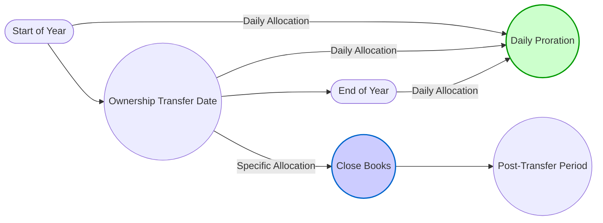

## 10.4 Ownership Changes & Mid-Year Allocations

Ownership changes in S corporations introduce a level of complexity beyond standard annual allocations. When a shareholder sells or transfers stock during the tax year, the question is: How does the corporation allocate income (or loss), deductions, credits, and other tax attributes among the incoming and outgoing owners? Proper handling is crucial to stay compliant with IRS rules and to provide equitable tax treatment among shareholders. In this section, we explore the two main allocation methods—daily proration and specific (a.k.a. “closing of the books”) allocation—and outline best practices to effectively address partial-year ownership and other mid-year transitions.

-------------------------------------------------------------------------------
## Overview of Mid-Year Allocations in S Corporations

S corporations are essentially pass-through entities, meaning that items of income, loss, deduction, and credit “flow through” to shareholders who then report these items on their individual tax returns. When an ownership shift occurs in the middle of a tax year—be it from a sale, gift, inheritance, or other transfer—the corporation must ensure the items flowing through align with each shareholder’s period of ownership.

Two primary methods govern how these mid-year allocations can occur:

1. Daily Allocation (also known as the Pro Rata Method)  
2. Specific Allocation (often called the Closing-of-the-Books Method)

Both approaches are permissible under the Internal Revenue Code and relevant Treasury Regulations, but they differ in how precisely they capture the economic realities of each shareholder’s period of ownership. S corporations must also ensure compliance with election requirements, consent agreements, and good record-keeping practices to avoid potential disputes.

-------------------------------------------------------------------------------
## Key Legal and Regulatory Foundations

• IRC §1377: Outlines the rules for allocating income and loss items in an S corporation setting when there is a change in shareholder ownership during the year.  
• Treasury Regulation §1.1377-1: Provides detailed guidance on how and when to make specific allocations based on a closing-of-the-books approach and the necessary procedures for making elections.  
• Shareholder Consent: Typically, for the specific allocation (closing-of-the-books) approach to be valid, all affected shareholders (both departing and incoming) must agree to the method in writing.  

For further reading on S corporation fundamentals—such as eligibility, elections, and terminations—refer to Section 10.1 “Eligibility Requirements, Elections & Terminations.” In studying mid-year allocations, also keep in mind how changes in ownership may affect built-in gains or accumulated adjustments account (AAA), as discussed in Section 10.3 “Built-In Gains Tax & Historical C Corp E&P Integration.”

-------------------------------------------------------------------------------
## Daily Allocation Method (Pro Rata)

### Definition and Rationale
The daily allocation method, sometimes called the pro rata method, evenly allocates an S corporation’s annual income, deductions, credits, and other tax items across each day of the year. The shareholder who owns the stock on a given day is allocated their pro rata share of the total items for that day, even if the S corporation’s actual activities (e.g., a high-income event) occurred before or after a particular transfer date.

### Mechanics
1. Compute total income or losses for the entire tax year as if there had been no change in ownership.  
2. For each day of the year, assume that the corporation’s daily “slice” of total annual income or loss is the total annual amount divided by 365 days (or 366, if a leap year).  
3. Allocate that daily portion to the shareholder(s) who owned the shares on that day.  

This approach is relatively simple from an administrative standpoint but can sometimes fail to reflect each shareholder’s exact economic interest during the period. For instance, if the departing shareholder owned the corporation during a period of high-income generation, but the final portion of the year had lower or even negative income, the daily method might lead to a less equitable distribution.

### Practical Example
Suppose that ABC S Corporation has $365,000 of net income for a non-leap year. If a shareholder sells her entire 50% interest to another individual effective July 1 (i.e., after 181 days in the year):

- Under the daily method, ABC S Corp divides $365,000 by 365 days = $1,000 of income per day for the entire corporation.  
- For 181 days, the departing shareholder owns 50% of the outstanding shares, so her allocated portion is 50% of $1,000 × 181 = $90,500.  
- The new shareholder then owns 50% for the remaining 184 days, receiving 50% of $1,000 × 184 = $92,000 in allocations.  

Notice that each “slice” of $1,000 per day is allocated consistently, ignoring whether the corporation earned more or less income in specific months.

-------------------------------------------------------------------------------
## Specific Allocation Method (Closing-of-the-Books)

### Definition and Rationale
The specific allocation or closing-of-the-books method attempts to capture each shareholder’s actual economic position by conceptually “closing” the company’s books on the day of ownership transfer. In essence, the S corporation treats the year as if it were split into two short periods for tax reporting: one period ending on the day before the stock transfer, and the second period beginning on the day of the stock transfer.

### Mechanics
1. “Close” the books (either physically or through a well-documented accounting approach) as of the day immediately before the ownership change.  
2. Determine the actual income, deductions, credits, etc., of the S corporation for that pre-transfer period. Attributes for that period are allocated among the shareholders based on their ownership percentages during that period.  
3. For the post-transfer period, compute actual income, deductions, and credits from the date of transfer through the end of the year. Allocate items among the shareholders for that subsequent period based on their ownership percentage during the post-transfer period.  
4. Shareholder consent is typically required for the election, which is often made under IRC §1377(a)(2). All shareholders who owned stock at any time during the tax year in question must generally consent.

### Practical Example
Using the earlier scenario of ABC S Corporation with $365,000 in total net income, let’s assume higher profitability occurred in the first half of the year.

1. **Pre-Transfer Period (Jan 1 – Jun 30):** The S corp’s internal books show net income of $300,000 for the first six months. The departing shareholder held a 50% stake during this period, so she is allocated 50% of $300,000 = $150,000.  
2. **Post-Transfer Period (Jul 1 – Dec 31):** The net income for the remaining six months is only $65,000. The new shareholder owns the 50% stake for this period and is allocated 50% of $65,000 = $32,500.  

Comparing this with the daily method, the departing shareholder may be allocated more income ($150,000 vs. daily method’s $90,500) because the first half of the year was more profitable. This more accurately reflects the economic reality during the departing shareholder’s period of ownership—but it does require thorough record-keeping and an additional shareholder consent process.

-------------------------------------------------------------------------------
## Partial-Year Ownership Scenarios and Approaches

Ownership changes mid-year can take various forms—transfers within a family, buyouts from external investors, redemption by the corporation itself, or reorganizations. Regardless of the form, S corporations generally must choose one of the two methods described above to handle the remainder of the year. Below are a few additional scenarios that commonly arise:

1. **Multiple Transfers in a Single Year:** If there are multiple ownership changes, the corporation must decide how to structure each period. For the specific allocation method, every significant change can necessitate another “closing of the books.”  
2. **Short-Year Election Due to S Termination:** If a transfer inadvertently disqualifies the S election (e.g., a corporate shareholder or certain trust owners who are not eligible), the S corporation may need to allocate items for a short S-corporation tax year and then treat the remainder of the year under C corporation rules.  
3. **Varied Consent Requirements:** A “split-year” approach that uses the closing-of-the-books method for the initial transfer might also need to be re-examined if additional transfers occur, requiring new consents to maintain consistent treatment.  
4. **Authorized Disparate Allocations:** In certain rare scenarios, shareholders might prefer to diverge from the daily method for partial intervals (such as large distributions or distinctive expenses). The specific allocation approach may better capture these preferences, but again, it must be supported by proper elections and meticulous records.

-------------------------------------------------------------------------------
## Diagrams: Visualizing Mid-Year Ownership Changes

Below is a simple Mermaid diagram illustrating a mid-year ownership transfer and the two common allocation methods. This diagram shows how the S corporation’s timeline can be split or treated uniformly across days:

• Under the daily allocation method, the entire year’s income is deemed to accrue evenly from A to C, with no special treatment of the ownership turnover at B.  
• Under the specific allocation approach, the year is effectively “cut” at B, reflecting actual pre- and post-transfer activity.

-------------------------------------------------------------------------------
## Impact on AAA and E&P

Recall that S corporations have an Accumulated Adjustments Account (AAA), which tracks the earnings and profits that have already been taxed at the shareholder level. Mid-year ownership changes can affect how distributions paid out of AAA are attributed to each shareholder:

1. **Pre-Change Distributions:** If a departing shareholder receives a large distribution just before the transfer, that distribution will reduce AAA and must be allocated in proportion to the historical ownership.  
2. **Post-Change Distributions:** The new shareholder may have distributions occur after the date of transfer, which might be taxed differently than for the old shareholder (e.g., tax-free to the extent of basis or AAA balance).  

Moreover, unused C corporation Earnings & Profits (E&P) carried over from prior conversions (see Section 10.3 “Built-In Gains Tax & Historical C Corp E&P Integration”) can complicate how distributions are classified if distributions exceed AAA or trigger built-in gains taxes. Mid-year ownership changes do not reset E&P but can alter which shareholder is effectively taxed on those distributions.

-------------------------------------------------------------------------------
## Best Practices and Common Pitfalls

1. **Obtain Comprehensive Consent:** When using the specific allocation method, ensure all parties sign the required elections in a timely manner. Missing or incomplete documentation is a common reason for IRS challenges.  
2. **Maintain Detailed Records:** Even if using daily allocations, thorough records of daily ownership percentages prevent confusion if the IRS questions large changes in income or deductions. For the closing-of-the-books method, final statements for each sub-period must reconcile with the general ledger.  
3. **Coordinate with State and Local Tax Requirements:** Some states follow federal rules, while others have additional requirements or do not recognize S corporation status. Validate whether partial-year ownership or special allocation triggers separate filings at the state level. See Chapter 23, “Expanded State & Local Tax (SALT) Topics,” for more.  
4. **Monitor Potential S Election Termination Issues:** A transfer to an ineligible shareholder (e.g., foreign entity, partnership, or corporation) mid-year can unexpectedly terminate the election.  
5. **Evaluate Economic Realities vs. Administrative Complexity:** Daily allocation may be simpler, but it might poorly represent actual earned income for each shareholder. The specific method is more precise but involves increased complexity and comprehensive documentation.

-------------------------------------------------------------------------------
## Practical Case Study

### Scenario
XYZ S Corporation has three shareholders: Alice, Bob, and Carol, each owning 1/3 of the stock. In April, Bob sells his entire interest to David. During the first quarter, XYZ has a large contract that yields substantial profit; income flattens during the summer and fall.

### Comparison of Methods

• **Daily Allocation Method:**  
  – Assume the same level of earnings and expenses spread evenly across all days from January 1 to December 31.  
  – Bob is allocated his “daily portion” for the 31% of the year he held stock (roughly 4 months out of 12). David is allocated the daily portion for the remainder of the year.  
  – Administrative effort is minimal once annual figures are calculated.

• **Specific Allocation Method:**  
  – “Close” the books as of April 30 (the day before David’s ownership takes effect) and compute actual income for the first four months. Because the large contract dominates Q1 and Q2, Bob’s allocated income more accurately reflects the higher earlier earnings.  
  – David’s allocations begin May 1, capturing the reduced income but possibly also capturing any unforeseen expenses or windfall gains from the second half of the year.  
  – The election under §1377(a)(2) requires the consent of Alice, Bob, Carol, and David.

With the contract’s significant profitability front-loaded, Bob’s share of net income is higher under the specific allocation method, aligning better with the economic reality of his period of ownership.

-------------------------------------------------------------------------------
## Strategies for Success

• **Plan Conversations Early:** When you anticipate a sale or purchase of S corporation shares, bring up the question of how to handle the year’s allocations. Agreeing in advance can prevent disputes and ensure all consents are obtained at the closing.  
• **Seek Professional Advice for Complex Structures:** Situations involving trusts, estates, or multiple transfers within a single year can get complicated quickly. An experienced CPA or tax attorney can advise on customizing the calculations and ensuring compliance.  
• **Model Both Methods:** If both daily and specific allocation are viable, conduct preliminary calculations under each approach to see how they affect each shareholder’s tax liabilities and obligations.

-------------------------------------------------------------------------------
## References for Further Exploration

• Internal Revenue Code (IRC) §1377(a)(2) – Guidance on allocating S corporation items upon a shareholder’s termination.  
• Treasury Regulation §1.1377-1 – Details on the daily and specific allocation approaches.  
• IRS Publication 589 – Offers additional clarity on S corporation shareholder adjustments (check for annual updates).  
• Chapter 10.1 “Eligibility Requirements, Elections & Terminations” of this text for S corporation fundamentals.  
• Chapter 21 “Practice & Procedure” for broader IRS guidance, including statutes of limitations and potential penalties.

-------------------------------------------------------------------------------

## Mastering Mid-Year Allocations: Ownership Changes Quiz



### An S corporation wants to assign partial-year income to a departing shareholder evenly across the year. Which allocation method should it use by default?

- [x] Daily allocation (pro rata)  
- [ ] Specific allocation (closing-of-the-books)  
- [ ] Hybrid allocation method  
- [ ] Retained earnings allocation method  

> **Explanation:** The default method is daily allocation (pro rata). Without a special election, items are allocated evenly based on the number of days each shareholder held the stock.

### A closing-of-the-books allocation requires:

- [x] Consent of all shareholders who held stock during the year  
- [ ] Consent of the selling shareholder only  
- [ ] Consent of only the majority-interest owners  
- [ ] No additional documentation  

> **Explanation:** Under IRC §1377(a)(2), the specific allocation election generally requires unanimous consent from all shareholders (both incoming and outgoing) who owned stock during the tax year.

### In a year with extremely high income in the first quarter, which method likely benefits the departing shareholder more?

- [x] Specific allocation method  
- [ ] Daily allocation method  
- [ ] The method does not matter  
- [ ] Hybrid method mandated by the IRS  

> **Explanation:** Specific allocation (closing-of-the-books) reflects actual results for the period of ownership, which is advantageous for someone departing after a high-earning quarter.

### Which of the following best describes the primary drawback of the daily allocation method?

- [x] It may not reflect the economic reality if the S corporation’s income fluctuates significantly  
- [ ] It is too time-consuming and requires multiple sets of books  
- [ ] It results in numerous short tax years throughout the year  
- [ ] State laws prohibit its use  

> **Explanation:** The daily allocation method is relatively straightforward but does not capture varying income streams across the year, causing potential disconnects between actual earnings and allocated amounts.

### In order to execute the specific allocation method, the S corporation generally:

- [x] Closes its books at the end of the day before the ownership change  
- [ ] Waits until year-end and then divides income by the number of shareholders  
- [x] Requires a §1377(a)(2) election  
- [ ] Does nothing special, as it is automatic  

> **Explanation:** The specific allocation method involves a conceptual “closing of the books” on the day before the transfer and typically requires a §1377(a)(2) election with unanimous shareholder consent.

### For a mid-year ownership change, which statement is TRUE regarding distributions?

- [x] Distributions before the transfer reduce AAA for the departing shareholder’s period  
- [ ] Distributions after the transfer also reduce the departing shareholder’s tax liability  
- [ ] Distributions do not affect AAA when there is an ownership change  
- [ ] Only distributions to the new shareholder reduce AAA  

> **Explanation:** Distributions prior to ownership change will reduce AAA for the departing shareholder’s period of ownership. Post-transfer distributions primarily affect the new shareholder.

### The daily allocation method divides income by:

- [x] The number of days in the corporation’s tax year  
- [ ] The number of shareholders  
- [x] The portion of the year each shareholder held stock  
- [ ] The corporation’s net income  

> **Explanation:** Daily allocation takes the total annual income and divides it by 365 (or 366 in leap years) to establish a daily portion. Each shareholder receives the daily portion times the number of days they held the shares.

### If an S election terminates mid-year because of an ineligible shareholder, the corporation generally:

- [x] Has a short S corporation year and a short C corporation year  
- [ ] Continues under daily allocation for the entire year  
- [ ] Is permitted to use only specific allocation  
- [ ] Proceeds as a sole proprietorship  

> **Explanation:** An inadvertent termination triggers a short S corporation tax year ending on the day before the terminating event and a separate short C corporation year thereafter.

### For a shareholder who obtains stock mid-year through an estate transfer, the S corporation:

- [x] Must allocate items to reflect the days and methods of ownership consistent with either daily or specific allocations  
- [ ] Generally disallows the new shareholder’s ownership until year-end  
- [ ] Ignores the transfer for federal tax purposes  
- [ ] Mandates the closing-of-the-books method  

> **Explanation:** The S corporation must account for partial-year ownership via one of the two approved allocation methods. There is no general requirement for ignoring the transfer or mandating a closing-of-the-books approach.

### An S corporation’s daily allocation method implies that if the corporation has dramatically fluctuating monthly income:

- [x] It may not assign income in a manner that reflects actual economic activity for each shareholder  
- [ ] It results in more complicated record-keeping  
- [ ] It is required in addition to the closing-of-the-books method  
- [ ] It ensures that the departing shareholder receives more of the short-term gains  

> **Explanation:** The daily method uses a flat daily rate of allocation, which can fail to match actual patterns of income and expenses over the year.



-------------------------------------------------------------------------------

## For Additional Practice and Deeper Preparation

**[TCP CPA Hardest Mock Exams: In-Depth & Clear Explanations](https://www.udemy.com/course/tcp-cpa-mock-exams/?referralCode=675149871D0E79B1699C)**  

**Tax Compliance & Planning (TCP) CPA Mocks:** 6 Full (1,500 Qs), Harder Than Real! In-Depth & Clear. Crush With Confidence!

- Tackle full-length mock exams designed to mirror real TCP questions.  
- Refine your exam-day strategies with detailed, step-by-step solutions for every scenario.  
- Explore in-depth rationales that reinforce higher-level concepts, giving you an edge on test day.  
- Boost confidence and minimize anxiety by mastering every corner of the TCP blueprint.  
- Perfect for those seeking exceptionally hard mocks and real-world readiness.

_Disclaimer: This course is not endorsed by or affiliated with the AICPA, NASBA, or any official CPA Examination authority. All content is for educational and preparatory purposes only._
