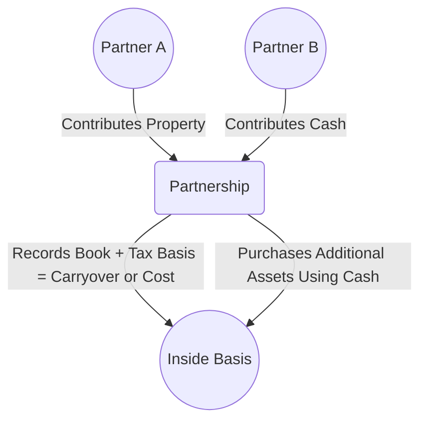
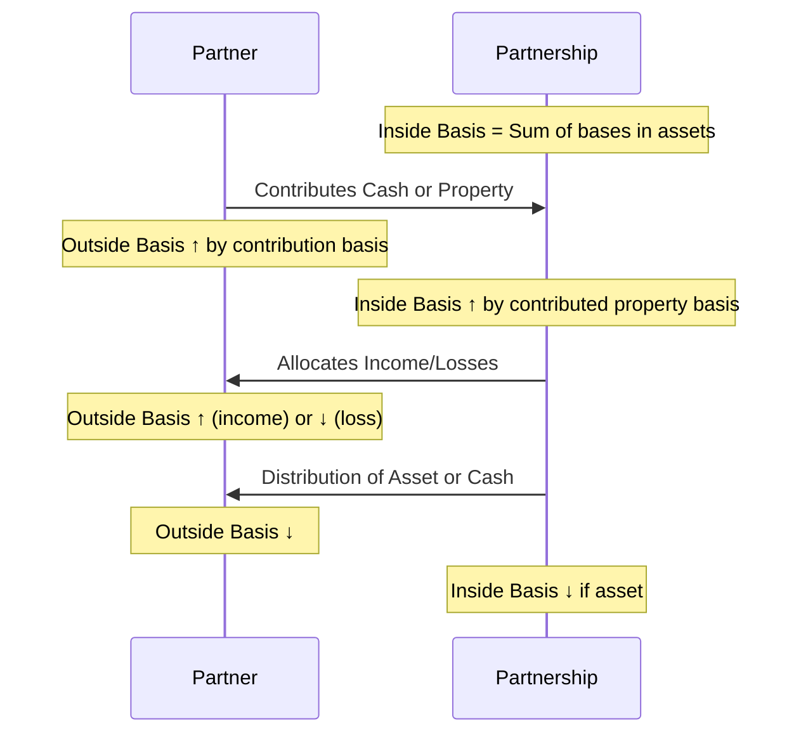

## 11.2 Partner’s Outside Basis vs. Partnership Inside Basis

A cornerstone of U.S. partnership taxation is the distinction between (1) the basis a partner has in the partnership interest itself (often referred to as the “outside basis”), and (2) the basis the partnership has in its own assets (the “inside basis”). This concept is integral to understanding how gains, losses, contributions, and distributions are recognized at both the partner and the partnership levels. It is also a crucial element for the Uniform CPA Examination’s Tax Compliance and Planning (TCP) section, particularly where partnership taxation is tested in depth.

This section explores the intricacies of outside vs. inside basis, including formulaic approaches to tracking these values, special attention to shifting ownership percentages, and practical examples illustrating these issues in real-world settings.

---

### Overview of Outside Basis vs. Inside Basis

• **Outside Basis:** The partner’s basis in the partnership interest. This amount governs the partner’s potential gain or loss upon disposition of the interest, limitations on loss deductions, and the tax effect of distributions.

• **Inside Basis:** The partnership’s basis in each asset it holds. These basis amounts collectively determine the partnership’s depreciation, gain, or loss upon sale of assets, and the resulting flow-through items to partners.

While outside basis is tracked at the individual partner level, inside basis is aggregated at the partnership level. Because of special allocations and contributions of appreciated or depreciated property, it is quite common for each partner’s outside basis to differ substantially from that partner’s share of the partnership’s inside basis.

---

### Key Distinctions and Importance

1. **Point of Reference**  
   • Outside basis is attached to the partner’s “ticket” into the partnership.  
   • Inside basis is the partnership’s historical cost (or adjusted cost) of its assets.

2. **Relevance to Taxation**  
   • Outside basis is crucial in determining the taxability of distributions and allowable losses.  
   • Inside basis is vital for calculating depreciation, amortization, and gain or loss realization when the partnership disposes of assets.

3. **Maintenance**  
   • Each partner individually maintains outside basis records.  
   • The partnership, as a single entity, maintains one collective set of inside basis records for all contributed or purchased assets.

4. **Ownership Percentages & Flexibility**  
   • Outside basis may shift among partners when ownership percentages change (e.g., admission of a new partner, sale of an interest).  
   • Inside basis typically remains with the partnership assets, though special basis adjustments can be performed under elections such as IRC §754, which can realign a partner’s outside basis with that partner’s share of inside basis.  

---

### Formulaic Approach to Outside Basis

A partner’s outside basis is dynamic. It changes due to contributions, distributions, allocations of income/loss, and various other factors. The following formula captures the typical annual computation of a partner’s outside basis:

Let:
• OBᵢ = Outside Basis at the beginning of the year  
• C = Contributions (cash plus the adjusted basis of property contributed)  
• ALᵢ = Increase in partnership liabilities allocated to the partner  
• TI = Partner’s share of partnership taxable income (including separately stated items)  
• TEI = Partner’s share of tax-exempt income  
• D = Distributions (cash plus the adjusted basis of property distributed)  
• ALd = Decrease in partnership liabilities allocated to the partner  
• TL = Partner’s share of partnership losses (including separately stated items)  
• NDE = Partner’s share of nondeductible expenses (e.g., certain fines and penalties)

Then the year-end outside basis (OBᵣ) can be calculated as:


\text{OB}_r = \text{OB}_i + C + AL_i + TI + TEI - (D + AL_d + TL + NDE)


Note that the partnership liabilities allocated to a partner (ALᵢ or ALd) are governed by complex rules, including whether liabilities are recourse vs. nonrecourse, partner guarantees, and other factors. Ownership percentages directly affect each partner’s share of nonrecourse liabilities, while recourse liabilities tend to be allocated based on financial risk of loss.

---

### Formulaic Approach to Inside Basis

The inside basis of the partnership is the sum of the basis that the partnership has in its individual assets. Typically:

• When a partner contributes property, the partnership’s inside basis in that property is generally the same as the partner’s adjusted basis in the property contributed (i.e., a carryover basis).  
• When the partnership purchases an asset from an external party, the inside basis of that asset is its cost.  
• Special elections (e.g., a §754 election) can adjust inside basis when certain triggering events occur, such as transfers of partnership interests or distributions of property.

Because the partnership must track each asset it owns, the total of all inside bases is effectively the sum of the carryover (and newly purchased) bases of each property in the partnership. The chart below highlights this visually.

In this basic illustration, each asset in the partnership receives its own inside basis. Meanwhile, each partner has an outside basis that accounts for what they contributed and any subsequent partnership activity that impacts basis.

---

### Interplay Between Ownership Percentages and Basis Tracking

#### Impact on Outside Basis

1. **Allocations of Income & Loss:**  
   A partner’s share of partnership income or loss is usually tied to ownership percentages, unless the partnership agreement provides for “special allocations” that meet the IRC §704(b) substantial economic effect requirements. As income flows to a partner, it increases their outside basis; as losses flow, it decreases outside basis.

2. **Contributions and Distributions:**  
   Contributions and distributions often depend on ownership percentages if the partnership operates under default rules (i.e., sharing equally or pro rata). If Partner A owns 60% of the partnership and Partner B owns 40%, a distribution of $100,000 might be split $60,000 to A and $40,000 to B, proportionally changing each outside basis.

3. **Debt Allocations:**  
   Outside basis includes the partner’s share of partnership debt. This share is usually determined by ownership percentage for nonrecourse debt, though recourse liabilities must be analyzed under the “economic risk of loss” rules. Changes in ownership can shift these liabilities, thereby increasing or decreasing outside basis.

#### Impact on Inside Basis

Inside basis is generally unaffected by changes in ownership percentages alone. For example, if Partner A sells half of their interest to a new Partner C, the partnership’s inside basis in its assets remains collectively unchanged. However, the new partner may elect a §754 adjustment, in which case the partnership may adjust the inside basis of its assets solely with respect to that new partner. This does not change the total inside basis for the original partners; it simply creates a “special inside basis” for the new partner.

---

### Common Scenarios and Examples

#### Example 1: Simple Start-Up Partnership

• Partner A and Partner B form AB Partnership.  
• A contributes $50,000 in cash, while B contributes equipment with a carryover basis of $30,000 and a fair market value of $50,000.  
• A has a 50% ownership share, and B has 50%.

In this case:  
1. **A’s Outside Basis:** $50,000 (the cash contributed).  
2. **B’s Outside Basis:** $30,000 (the carryover basis of contributed property).  
3. **Inside Basis:** $50,000 (A’s cash) + $30,000 (B’s basis in equipment) = $80,000 in total. The equipment’s inside basis is $30,000, and the partnership also has $50,000 in cash to deploy.

After operations, if the partnership has $20,000 of net income allocated equally ($10,000 each):  
• A’s outside basis becomes $60,000.  
• B’s outside basis becomes $40,000.  
The equipment’s inside basis is still $30,000 on the books of the partnership (unless a cost for improvements or another transaction triggers adjustments).

#### Example 2: Ownership Percentages and Debt Allocation

• Partners X and Y form XY Partnership, each with 50% interest.  
• The partnership takes out a $100,000 nonrecourse loan.  
• Each partner is allocated half of that debt for basis purposes, increasing their outside basis by $50,000.  

Hence, if X and Y each contributed $20,000 in cash initially:  
• X’s outside basis starts at $20,000 + $50,000 = $70,000  
• Y’s outside basis starts at $20,000 + $50,000 = $70,000  
• Inside basis in the contributed cash is $40,000. Any assets subsequently purchased with that $140,000 total capital (cash contributions + loan) will form the partnership’s inside basis in those assets.

If X sells half of his interest to Z, the inside basis remains unchanged for XY Partnership. However, X’s outside basis upon selling to Z could trigger a need for a §754 election, which might create a special basis adjustment for Z.

---

### Delving Deeper: The §754 Election

When a partnership interest is sold or exchanged, or when the partnership makes certain property distributions, the partnership can elect under IRC §754 to adjust its inside basis. This ensures that the new partner’s proportionate share of the inside basis better reflects the amount the new partner paid for the interest.

• **Why Make a §754 Election?**  
   The main rationale is to align the purchasing partner’s outside basis in the partnership interest with their share of the partnership’s inside basis. If no election is made, the new partner may face a mismatch where they either recognize inappropriate gains/losses or lose out on future depreciation deductions.

• **Scope of §754 Adjustment**  
   The adjustment applies only to the transferee partner or to the partners receiving the distribution (in the event of a property distribution). It does not affect the inside basis for the other, non-transferring partners.

---

### Special Allocations and Disproportionate Ownership

IRC §704(b) allows partnership agreements to allocate items of income, gain, loss, or deduction in ways that differ from simple pro-rata ownership shares, provided that the allocations have “substantial economic effect.” This can lead to scenarios where:

• A partner might receive a larger share of taxable income relative to ownership percentage if they contributed more property or took on more risk.  
• Another partner may bear a higher share of certain expenses (e.g., guaranteed payments, certain intangible deductions, etc.).  

These special allocations still factor into each partner’s outside basis. However, the partnership’s inside basis in its assets is not directly changed by these allocations unless a §704(c) or §754 adjustment triggers revaluation of inside basis.

---

### Diagrams for Basis Tracking

To visualize how outside basis and inside basis move in tandem yet remain distinct, consider the following simplified timeline of events:

In all these steps, note that the partner’s outside basis is an attribute of the partner, whereas the partnership’s inside basis belongs to the assets themselves.

---

### Pitfalls and Best Practices

1. **Not Tracking Basis Annually:**  
   A common error is failing to update outside basis each year, especially in large or multi-tiered partnerships. This can lead to incorrect depreciation, gain, or loss recognition at the partner level.

2. **Misallocating Debt:**  
   Failing to identify recourse vs. nonrecourse liabilities properly can lead to incorrect outside basis calculations and potential deduction disallowances.  

3. **Ignoring §754 Opportunities:**  
   Sometimes partnerships forgo the §754 election and miss out on potential tax benefits. Certain times, the cost of maintaining basis adjustments might outweigh the benefit, so partnerships should carefully weigh the pros and cons.  

4. **Complex Ownership Changes:**  
   As new partners enter or old partners exit, shifting ownership percentages can cause confusion in basis tracking. Meticulous recordkeeping ensures that each partner’s outside basis and the partnership’s inside basis are properly updated.

5. **State and Local Nuances:**  
   Some states conform differently to federal basis rules, especially for intangible assets or property in special industries. Partnerships must be aware of multi-state ramifications on both outside and inside basis.

---

### Strategies for CPA Exam Success

• **Memorize the Outside Basis Formula:**  
  Having the formula at your fingertips is essential for exam questions requiring basis computations. Practice with multiple scenarios, especially those with changes in liabilities.

• **Understand §704(b) and §704(c) Rules:**  
  These rules underpin how allocations can differ from ownership percentages and how built-in gains/losses are managed. Know how special allocations flow through to a partner’s outside basis.

• **Practice Journal Entries and Schedules:**  
  Building a schedule each year to track each partner’s beginning basis, contributions, allocations, distributions, and any liability changes is excellent practice.

• **Use Realistic Examples:**  
  Look for example-based questions that combine multiple partnership events—admissions, distributions, special allocations, and debt changes. This approach is common on the TCP exam to test your holistic grasp.

• **Review Past IRS Publications and Court Decisions:**  
  IRS Publication 541 (Partnerships) provides additional clarity. Court cases also illustrate how basis disputes are resolved in practice.

---

### References for Further Exploration

• IRC §§ 704(b), 704(c), 705, 721, 722, 723, and 754 for statutory guidance.  
• IRS Publication 541 for plain-English explanations on partnership taxation.  
• “Federal Taxation of Partnerships and Partners” by McKee, Nelson & Whitmire for a deep-dive treatise.  
• [Understanding Joint Ventures and Partnership Allocations (IRS)](https://www.irs.gov/)  
• State-specific partnership tax guidelines, which may have unique twists on basis adjustments.

---

## SEO-Optimized Quiz on Partner’s Outside vs. Partnership Inside Basis



### Which of the following best defines “outside basis” in a partnership context?

- [ ] The basis the partnership has in the assets it owns.
- [x] The basis an individual partner has in their partnership interest.
- [ ] The difference between book value and fair market value of the partnership.
- [ ] The basis used for allocating recourse liabilities among partners.

> **Explanation:** Outside basis is the partner’s tax basis in the partnership interest itself, which differs from the partnership’s basis in its own assets (inside basis).

### What event typically affects a partner’s outside basis but not the partnership’s inside basis in the absence of a §754 election?

- [x] The sale of a partnership interest from one partner to a new partner.
- [ ] A large capital expenditure by the partnership.
- [ ] A partnership-level asset sale.
- [ ] Depreciation deductions on partnership assets.

> **Explanation:** When a partner sells an interest, their outside basis changes hands, but the inside basis of the partnership assets remains the same unless a §754 election is in effect.

### How are nonrecourse liabilities generally allocated among partners for basis purposes?

- [ ] Equally allocated among the most financially stable partners.
- [ ] Solely allocated to general partners.
- [x] Allocated based on ownership or profit-sharing percentages.
- [ ] Allocated only to partners who contributed property as collateral.

> **Explanation:** Nonrecourse liabilities are usually allocated according to the partners’ profit-sharing or ownership percentages, unless the partnership agreement provides for a different allocation that meets tax law requirements.

### Which of the following increases a partner’s outside basis?

- [x] Share of partnership tax-exempt income.
- [ ] Non-deductible fines and penalties.
- [ ] Cash distributions from the partnership.
- [ ] A reduction in partnership liabilities allocated to the partner.

> **Explanation:** Tax-exempt income increases outside basis, whereas nondeductible expenses and distributions decrease it. A reduction in allocated liabilities also decreases outside basis.

### In which situation is a §754 election most relevant?

- [x] When a partnership interest is sold or exchanged, or certain property distributions occur.
- [ ] When the IRS sends a notice of deficiency to a partner.
- [x] When a partner leaves the partnership due to retirement.
- [ ] When the partnership is formed and initially contributes assets.

> **Explanation:** A §754 election allows the partnership to adjust inside basis upon certain transfers or distributions of interests. It does not automatically apply to partnership formation nor IRS deficiency notices.

### What is the main rationale behind making a §754 election?

- [ ] To reshuffle capital accounts among partners more freely.
- [ ] To avoid allocating partnership liabilities to specific partners.
- [ ] To reduce the complexity of tracking distributions.
- [x] To align a transferee partner’s outside basis with the partnership’s inside basis on their share of assets.

> **Explanation:** A §754 election aligns the buying partner’s outside basis in the partnership interest with their share of the inside basis of partnership assets, mitigating distortions in future depreciation or gain/loss.

### Partner A has an outside basis of $50,000 at the start of the year. During the year, A contributes $10,000, is allocated $5,000 of net income, receives a cash distribution of $3,000, and sees an increase of $2,000 in their share of partnership liabilities. What is A’s ending outside basis?

- [x] $64,000
- [ ] $53,000
- [ ] $60,000
- [ ] $72,000

> **Explanation:** Start with $50,000 + $10,000 (contribution) + $5,000 (income) + $2,000 (additional liabilities) – $3,000 (distribution) = $64,000.

### Which term describes the partnership’s basis in an asset contributed by a new partner?

- [ ] Adjusted purchase price at fair market value.
- [ ] The net book value recorded in the partner’s capital account.
- [x] Carryover basis from the contributing partner’s adjusted basis.
- [ ] The average basis based on the total contributed assets of all partners.

> **Explanation:** Generally, contributed property carries over its adjusted basis from the contributing partner to the partnership, unless specific exceptions apply.

### If a partnership decides not to make a §754 election following a transfer of an interest, which outcome is likely?

- [x] The new partner’s share of inside basis could remain misaligned with the outside basis paid for the interest.
- [ ] All partners’ outside bases must be recalculated.
- [ ] The partnership immediately terminates.
- [ ] The partner’s entire cash contribution is recognized as a capital gain.

> **Explanation:** Without a §754 election, no adjustment is made to the partnership’s inside basis, potentially creating discrepancies between the partner’s purchase price (outside basis) and the share of inside basis.

### True or False: A partner’s outside basis can exceed the partnership’s inside basis in that partner’s proportion of the partnership assets.

- [x] True
- [ ] False

> **Explanation:** Due to debt allocations, prior built-in gains, or other factors, a single partner’s outside basis can indeed exceed (or be less than) their proportional share of the entity’s inside basis.



---

## For Additional Practice and Deeper Preparation

**[TCP CPA Hardest Mock Exams: In-Depth & Clear Explanations](https://www.udemy.com/course/tcp-cpa-mock-exams/?referralCode=675149871D0E79B1699C)**  

**Tax Compliance & Planning (TCP) CPA Mocks:** 6 Full (1,500 Qs), Harder Than Real! In-Depth & Clear. Crush With Confidence!  

- Tackle full-length mock exams designed to mirror real TCP questions.  
- Refine your exam-day strategies with detailed, step-by-step solutions for every scenario.  
- Explore in-depth rationales that reinforce higher-level concepts, giving you an edge on test day.  
- Boost confidence and minimize anxiety by mastering every corner of the TCP blueprint.  
- Perfect for those seeking exceptionally hard mocks and real-world readiness.  

_Disclaimer: This course is not endorsed by or affiliated with the AICPA, NASBA, or any official CPA Examination authority. All content is for educational and preparatory purposes only._
