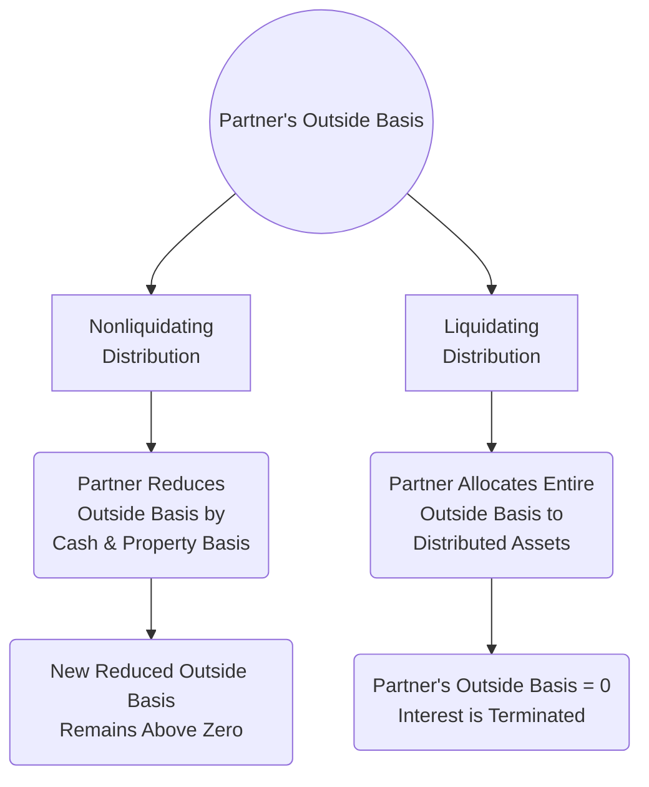

## 11.4 Distributions (Liquidating, Nonliquidating) & Disguised Sales

Partnerships and limited liability companies (LLCs) that elect to be treated as partnerships for tax purposes often distribute cash or property to their partners. Distributions can range from routine withdrawals of profits (“nonliquidating” distributions) to final payouts that terminate a partner’s entire interest (“liquidating” distributions). Additionally, certain arrangements may be deemed “disguised sales” if the IRS determines that property contributions and distributions are effectively sales transactions. This section covers the tax treatment of both liquidating and nonliquidating distributions, explaining basis adjustments, gain or loss recognition, and how disguised sales arise in two-step transactions.

This topic builds on key concepts introduced in Chapter 11.1 (Formation & Contributions) and Chapter 11.3 (Special Allocations, Guaranteed Payments & §704(b)/(c) Rules). Readers are encouraged to review those sections for a broader understanding of partnership formations, partner capital accounts, and entitlement to allocations.

---

## Overview of Partnership Distributions

Partnership distributions are governed by several provisions of the Internal Revenue Code (IRC) and related Treasury Regulations, primarily IRC §§ 731, 732, 733, 735, and 736. In general, no gain or loss is recognized by the partner or the partnership upon a distribution unless the distribution meets certain triggering events (e.g., “hot assets” under IRC §751, distributions of marketable securities exceeding basis, or disguised sales).

These main statutory provisions provide that:

• Nonliquidating distributions typically reduce the partner’s outside basis in the partnership without resulting in an immediate taxable event (unless cash exceeds the partner’s outside basis).  
• Liquidating distributions often consume the partner’s entire outside basis. A partner can recognize gain or loss in a liquidating distribution only in certain scenarios (e.g., if the partnership distributes less property than the partner’s outside basis, or if there is excess cash).  

## Nonliquidating (Current) Distributions

Nonliquidating distributions, sometimes referred to as “current distributions,” are those that do not completely terminate the distributee partner’s economic interest in the partnership. These distributions often occur when partners withdraw cash or receive property while they remain partners.

### Effect on Partner’s Outside Basis

When a partner receives a nonliquidating distribution, the partner generally reduces (but not below zero) their outside basis by the amount of cash and/or the adjusted basis of any property received.

If the distribution involves marketable securities or certain “hot assets” (IRC §751 property such as inventory or unrealized receivables), special rules may apply. However, in a general scenario:

1. Cash reduces the outside basis dollar for dollar.  
2. The basis of distributed property is the lesser of (a) the partnership’s adjusted inside basis in the property, or (b) the partner’s remaining outside basis (after reducing by any cash received).  
3. If the property’s inside basis to the partnership exceeds the partner’s outside basis, the partner’s basis in the property becomes equal to the partner’s remaining outside basis—essentially “capping” the property basis to the amount of outside basis available.

A partner does not recognize gain on a nonliquidating distribution unless cash (or treated-as-cash property, such as certain marketable securities) exceeds the partner’s outside basis.

### Example of Nonliquidating Distribution

Assume Partner A has an outside basis of $50,000 in an LLC taxed as a partnership. The LLC distributes $20,000 cash and a building (adjusted inside basis $40,000, FMV $60,000):

• Step 1: Partner A first reduces outside basis by cash ($20,000), leaving $30,000 of outside basis.  
• Step 2: The partnership’s basis in the building ($40,000) is tested against Partner A’s remaining outside basis ($30,000). The lesser is $30,000, so Partner A takes a $30,000 basis in the building.  
• Step 3: Partner A’s outside basis is reduced to zero because all $30,000 of remaining outside basis was used for the property.

Partner A recognizes no immediate gain or loss unless the distribution included “hot assets” or certain other triggers. Going forward, Partner A’s basis in the building is $30,000, and the building has a carryover holding period from the partnership.

---

## Liquidating Distributions

Liquidating distributions are those in which a partner is completely redeeming or otherwise terminating their ownership interest in the partnership. This typically occurs when a partner retires, the partnership redeems the entire partnership interest, or the partnership itself winds up operations and distributes all assets to the partners.

### Complete Adjustment of Outside Basis

In a liquidating distribution, the partner’s entire outside basis must be allocated to the distributed property. The principle is that a partner’s outside basis is “used up” fully when that partner leaves the partnership. If a partner receives only cash or if the fair market value (FMV) of distributed property is less than the partner’s existing outside basis, it is possible for the partner to recognize a loss. Conversely, if the partner receives cash or property valued at more than the partner’s outside basis, the partner may recognize a gain.

### Basis Role in Liquidating Distributions

Under IRC §732(b), if multiple properties are distributed in a liquidating distribution, the partner’s outside basis is allocated first to assets up to the partnership’s inside basis, then adjusted for residual amounts of basis to ensure the total outside basis is exhausted.

#### Example of Liquidating Distribution with Gain

Partner B has an outside basis of $100,000. The partnership redeems B’s interest for $120,000 in cash. There is no property distribution; the entire distribution is in cash. B recognizes gain of $20,000 ($120,000 cash – $100,000 outside basis). The partner’s outside basis becomes zero, as the partnership interest is fully liquidated.

#### Example of Liquidating Distribution with Loss

Partner C has an outside basis of $80,000. The partnership distributes $50,000 in cash and no other assets. C recognizes a $30,000 capital loss ($80,000 outside basis – $50,000 cash) if no other property is received or deemed received. The outside basis is fully used: $50,000 is allocated to the cash, and $30,000 becomes the recognized loss.

---

## Basis Adjustments & Hot Assets

When a partnership distributes property that includes “hot assets,” such as substantially appreciated inventory or unrealized receivables (IRC §751 assets), the distribution rules can trigger ordinary income recognition to the distributing partner, or require the partner to recognize gain to prevent the shifting of built-in appreciation/built-in ordinary income to other partners. Hot assets are addressed in more detail in Chapter 11.3 and relate to preventing the conversion of ordinary income items into capital gain upon distribution or sale.

---

## Identifying Disguised Sales

Disguised sales arise when the IRS determines that a contribution of property by a partner to a partnership, followed by a related (often near-simultaneous) distribution from the partnership to that same partner, should be treated as a taxable sale rather than a mere distribution.

### Key Indicators of a Disguised Sale

Treas. Reg. §1.707-3 provides the analytical framework for recharacterizing transactions as disguised sales. Key factors include:

• Timing and proximity of transfers: If a partner contributes property, and then soon thereafter receives a distribution of cash (or other property), the IRS may presume a disguised sale.  
• Pre-arranged conditions: If the partner was effectively guaranteed a distribution in exchange for the contributed property, this strongly suggests a disguised sale.  
• Proportional changes in ownership: If the partner’s relative interest in profits and losses remains unchanged (despite a nominal “contribution and distribution”) it could be a sale transaction disguised as a distribution.  

### Two-Step Transaction Example

A typical disguised sale scenario involves a partner (Partner D) who contributes property with a fair market value of $250,000 and an adjusted basis of $100,000 to the partnership. Shortly after, the partnership distributes $250,000 in cash to Partner D. On paper, it may appear that the partner contributed property and later received a “nonliquidating distribution.” If the two transactions are integrated, however, the IRS could classify it as a disguised sale: The partner effectively “sold” the property to the partnership for $250,000, meaning Partner D should recognize gain of $150,000 ($250,000 – $100,000).

Below is a conceptual flowchart illustrating a two-step transaction that may spark a disguised sale analysis:

```mermaid
flowchart LR
    A((Partner D)) --> B[Contributes Property<br>(FMV $250,000;<br>Basis $100,000)]
    B --> C((Partnership))
    C --> D[Distributes $250,000<br>Cash to Partner D]
    D --> E{IRS Analysis:<br>Is this a Disguised Sale?}
```

### Safe Harbors and Exceptions

Certain safe harbor provisions allow a distribution to avoid classification as a disguised sale if it meets specific requirements, such as:

• The distribution is not made within a short period (usually two years) after the property contribution.  
• The partner’s share of partnership liabilities increased proportionately and permanently.  
• The distribution does not exceed the partner’s share of profits or capital over time.  

The regulations also provide exceptions for “guaranteed payments for capital” and reimbursements of pre-formation expenditures.

---

## Illustrating Basis Adjustments in Disguised Sales

When a transaction is recharacterized as a disguised sale, the partner contributing property recognizes gain or loss as if the property was sold to the partnership at its fair market value. Consequently:

• The partner’s outside basis increases by the amount of gain recognized.  
• The partnership takes a fair market value “cost basis” in the property.  
• Future distributions related to this disguised sale are treated as part of the sale proceeds.  

In short, once the transaction is flagged, the normal nonrecognition rules under IRC §§ 731 and 732 do not apply. Instead, it is a taxable exchange, significantly impacting the distribution’s tax consequences.

---

## Practical Examples & Case Studies

### Nonliquidating Distribution with Partial Basis Adjustment

Suppose Partner E has an outside basis of $60,000 in the partnership and receives:

• $10,000 in cash, and  
• A parcel of land with an inside basis of $20,000 (FMV $35,000).  

Partner E first reduces outside basis by $10,000 for the cash, leaving $50,000 of outside basis. However, when taking the property, the basis is the lesser of (a) $20,000 (inside basis) and (b) $50,000 (remaining outside basis). That amount is $20,000. Therefore, the land’s carryover basis is $20,000, and Partner E’s new outside basis in the partnership is $30,000 ($50,000 – $20,000), reflecting a partial reduction for the property distribution.

### Liquidating Distribution with Remaining Basis to Property

Now assume the same Partner E leaves the partnership completely (liquidating distribution). If E’s outside basis is $60,000 and E receives the same $10,000 cash plus land with a $20,000 inside basis (FMV $35,000), E allocates the full $60,000 to the distribution. First $10,000 to cash, leaving $50,000 for property basis allocation. Because this is a liquidating distribution, E must use all of the remaining $50,000 basis. Since the property’s inside basis is $20,000, E can “step up” the land’s basis to $50,000 to exhaust E’s outside basis. That results in immediate built-in gain potential for E if the land is sold, but no gain or loss is recognized at the time of liquidating distribution (provided no hot assets are involved).

### Two-Step Disguised Sale

Partner F contributes appreciated securities (basis $80,000, FMV $200,000) to the partnership. Within two months, the partnership borrows under a line of credit and distributes $200,000 in cash to F. Because of the short time gap and the fact that F effectively receives a distribution equal to the FMV of the contributed property, this scenario likely triggers a disguised sale analysis under Treas. Reg. §1.707-3. If the IRS concludes it is a disguised sale, F would recognize $120,000 in capital gain at the time of the transaction. The partnership would then take a $200,000 basis in the securities.

---

## Best Practices and Common Pitfalls

• Track timing and purpose of distributions closely. If a partner makes a large contribution and receives a significant distribution soon thereafter, consult Treas. Reg. §1.707-3 to avoid inadvertent disguised sales.  
• Maintain capital accounts and outside basis records accurately. As discussed in Chapter 11.2 (Partner’s Outside Basis vs. Partnership Inside Basis), precise records help determine if cash exceeds basis and if gain is triggered.  
• Identify “hot assets.” Failure to recognize the presence of IRC §751 assets can lead to unexpected ordinary income recognition in an otherwise tax-free or capital-gain transaction.  
• Liquidating distributions require particular vigilance. Be certain to allocate the entire outside basis among any distributed property. Misallocation can lead to inaccurate future depreciation, gain, or loss calculations.  
• Watch for multiple owners with differing capital structures. If distributions favor only certain partners, or are structured to shift built-in gains or losses, a disproportionate distribution may require special allocations or disguised sale analysis.  

---

## Diagrams: Comparing Nonliquidating vs. Liquidating Distribution Flow

Below is a simplified diagram illustrating the general steps and basis adjustments for each type of distribution:



In a nonliquidating distribution, the partner typically reduces outside basis by the distribution amount. In a liquidating distribution, the partner will exhaust all outside basis—in other words, the partner’s outside basis ends at zero.

---

## Formulas for Basis Adjustments

Below is a simplified formula illustrating how outside basis is adjusted upon receiving a distribution:

For a nonliquidating distribution:


\text{Outside Basis}_{\text{new}}
= \max\Big(
    \text{Outside Basis}_{\text{old}}
    - \text{Cash Received}
    - \text{Adjusted Basis of Distributed Property},
    0
\Big)


For a liquidating distribution (receiving cash and property):


\text{Basis of Distributed Property}
= \text{Outside Basis}_{\text{old}}
- \text{Cash Received}


Because the partner’s entire interest is being terminated, any remaining outside basis after subtracting cash and other property must be allocated to the distributed assets. If more than one asset is distributed, the partner follows the ordering rules in Treas. Reg. §1.732-1.

---

## Strategies to Avoid Disguised Sales

• Space out property contributions and cash distributions in time, ideally beyond two years, unless there is a strong non-tax business purpose.  
• Ensure that any debt-financed distributions reflect the partner’s share of partnership liabilities, rather than a mechanism to compensate only one partner’s contributed property.  
• Document the partnership’s intent with written agreements and appraisals that clearly reflect economic realities.  

---

## Conclusion and Key Takeaways

Partnership and LLC distributions can be complex affairs, requiring careful tracking of inside and outside basis, awareness of “hot assets,” and knowledge of what triggers disguised sales. Nonliquidating distributions typically do not create immediate gain or loss unless cash exceeds outside basis, while liquidating distributions exhaust a partner’s entire outside basis. Disguised sales underscore the importance of substance over form: if the IRS deems that partners are effectively buying and selling partnership property through artificially styled contributions and distributions, it can reclassify the transaction, triggering unexpected tax consequences.

Remaining vigilant regarding the timing, structure, and documentation of distributions is crucial. Partners, CPAs, and advisors should coordinate closely to ensure that the partnership’s records, capital account statements, and distributions align with the IRC’s formal and substantive requirements. By mastering these rules, candidates for the CPA exam and practitioners alike can properly advise clients and remain compliant, minimizing the risk of costly recharacterization or litigation.

---

## Quiz: Partnership Distributions, Liquidating Interests & Disguised Sales



### Which of the following best describes a nonliquidating distribution for a partner?

- [x] A distribution that does not end the partner’s entire interest in the partnership.
- [ ] A distribution that always terminates the partner’s outside basis.
- [ ] A distribution that triggers immediate gain recognition regardless of basis.
- [ ] A distribution that only occurs if the partnership is dissolved.

> **Explanation:** Nonliquidating distributions are cash or property payouts that reduce (but do not fully exhaust) a partner’s outside basis. They do not terminate the partner’s ownership interest.

### In a liquidating distribution, the partner’s outside basis is:

- [x] Fully allocated to any assets received, reducing the partner’s outside basis to zero.
- [ ] Partially reduced but never can go below $10,000.
- [ ] Increased if the partner receives an asset with a higher FMV than inside basis.
- [ ] Unchanged unless cash is received.

> **Explanation:** Liquidating distributions require the partner to use up all of their outside basis by allocating it to the distributed assets; the partner’s outside basis becomes zero.

### Which IRC section serves as the primary guide to recognizing gain or loss in a partnership distribution?

- [x] IRC §731.
- [ ] IRC §704.
- [ ] IRC §179.
- [ ] IRC §1231.

> **Explanation:** IRC §731 provides guidelines on when gain or loss is recognized in a partnership distribution scenario, along with the interplay of other sections like §732.

### What occurs if a partner’s cash distribution exceeds their outside basis in a nonliquidating distribution?

- [x] The excess is recognized as gain.
- [ ] The transaction is automatically considered a disguised sale.
- [ ] No gain is recognized unless there are hot assets involved.
- [ ] The partner’s outside basis becomes negative.

> **Explanation:** Under IRC §731, if cash distributed exceeds a partner’s outside basis, the partner must recognize gain to the extent of the excess. A partner’s outside basis cannot go below zero.

### In a liquidating distribution, if a partner has an outside basis of $80,000 and receives only $50,000 cash, the partner generally:

- [x] Recognizes a $30,000 loss if no other property is distributed.
- [ ] Recognizes no gain or loss and carries over the $80,000 basis to future distributions.
- [x] May recognize a portion of the distribution as ordinary income if hot assets are present.
- [ ] Must reallocate basis to other partners.

> **Explanation:** With no other property, the partner would recognize a capital loss of $30,000 ($80,000 – $50,000). If hot assets were part of a more complex scenario, ordinary income could be triggered.

### Which of the following is most likely to be recharacterized as a disguised sale?

- [x] Partner contributes appreciated property and receives a significant cash distribution from the partnership shortly thereafter.
- [ ] Partner receives a return of capital distribution after many years based on proportional ownership.
- [ ] Partner receives a routine quarterly distributive share of partnership profits.
- [ ] Partnership redeems a retiring partner’s full interest over a 10-year period.

> **Explanation:** A near-simultaneous contribution of property and distribution of cash can indicate a disguised sale, especially if the distribution effectively compensates the partner for the contribution.

### Which Treasury Regulation primarily governs disguised sales?

- [x] Treas. Reg. §1.707-3.
- [ ] Treas. Reg. §1.752-1.
- [x] Treas. Reg. §1.732-1.
- [ ] Treas. Reg. §301.7701-2.

> **Explanation:** Treas. Reg. §1.707-3 details the rules for identifying and classifying disguised sales between a partnership and its partners, whereas Treas. Reg. §1.732-1 addresses the basis of distributed property.

### Which statement about hot assets under IRC §751 is correct?

- [x] They include substantially appreciated inventory and unrealized receivables that can trigger ordinary income recognition.
- [ ] They are exclusively capital assets that generate long-term capital gains.
- [ ] They are only relevant when distributing cash.
- [ ] They do not affect gain or loss recognition in any distribution scenario.

> **Explanation:** Hot assets include inventory and unrealized receivables that, if sold, would produce ordinary income. Distributions involving these assets can trigger special ordinary income considerations.

### Which of the following facts does NOT indicate a disguised sale?

- [x] The partner’s share of partnership liabilities increases in a lasting manner after the property contribution.
- [ ] Immediate distribution of cash equal to the FMV of contributed property.
- [ ] A pre-arranged plan for the partnership to distribute funds once a loan is secured.
- [ ] Minimal changes in the partner’s capital account after a contribution and subsequent distribution.

> **Explanation:** An increase in partnership liabilities allocated to the contributing partner can be a valid non-tax reason for distributions and may avoid disguised sale treatment under safe harbor rules.

### Is it possible for a partnership to recognize gain in a disguised sale scenario?

- [x] True
- [ ] False

> **Explanation:** If a transaction is recharacterized as a disguised sale, the partnership is treated as purchasing the contributed property at FMV, which can impact partnership basis and may generate gain recognition for the contributing partner. The partnership itself obtains a new basis in the contributed property, effectively “purchasing” it.



---

## For Additional Practice and Deeper Preparation

[TCP CPA Hardest Mock Exams: In-Depth & Clear Explanations](https://www.udemy.com/course/tcp-cpa-mock-exams/?referralCode=675149871D0E79B1699C)

Tax Compliance & Planning (TCP) CPA Mocks: 6 Full (1,500 Qs), Harder Than Real! In-Depth & Clear. Crush With Confidence!

- Tackle full-length mock exams designed to mirror real TCP questions.  
- Refine your exam-day strategies with detailed, step-by-step solutions for every scenario.  
- Explore in-depth rationales that reinforce higher-level concepts, giving you an edge on test day.  
- Boost confidence and minimize anxiety by mastering every corner of the TCP blueprint.  
- Perfect for those seeking exceptionally hard mocks and real-world readiness.

_Disclaimer: This course is not endorsed by or affiliated with the AICPA, NASBA, or any official CPA Examination authority. All content is for educational and preparatory purposes only._
