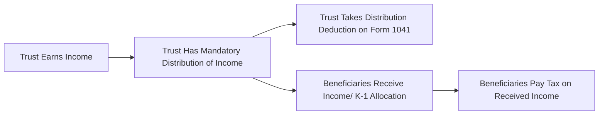

## 12.1 Simple vs. Complex Trusts, Grantor Trust Rules

Trusts play a central role in estate planning and wealth management, and they appear frequently in the context of the Tax Compliance and Planning (TCP) CPA exam. Understanding how income passes through different types of trusts, respecting distribution requirements, and analyzing reversionary powers that trigger grantor trust status is crucial for aspiring CPAs. This section examines the distinctions between simple and complex trusts, outlines tax-related distribution rules, and delves into the standards that classify a trust as a grantor trust under the Internal Revenue Code (IRC). We will also explore practical examples, provide illustrative diagrams, and offer real-world scenarios to solidify these concepts.

-------------------------------------------------------------------------------
### Overview of Trust Classification for Tax Purposes

At the federal tax level, trusts are generally governed by Subchapter J of the IRC. The two primary trust classifications for income tax purposes are:
• Simple Trusts.  
• Complex Trusts.  

Additionally, certain trusts that retain specific powers or benefits for the person creating the trust (the “grantor”) may be treated as grantor trusts under IRC §§ 671–678. Recognizing how each classification affects income taxation, deductions, and reporting obligations helps CPAs provide sound tax compliance and planning advice.

-------------------------------------------------------------------------------
### Simple Trusts

A “simple trust” is generally defined under the IRC and corresponding Treasury Regulations as one that:  
1. Must distribute all of its income (as defined in the trust agreement and local law) currently to the beneficiaries.  
2. Does not distribute any principal or make charitable contributions during the taxable year.  
3. Does not specify any other amount that must be distributed apart from the income.  

In simple trusts, the trust itself typically receives a deduction for the distributable net income (DNI) that it must distribute to the beneficiaries. Conversely, the beneficiaries are taxed on that distributed income, even if they do not physically receive it until after the close of the taxable year. Consequently, the trust typically ends up with little or no taxable income because the deduction for distributed income offsets what would otherwise be taxable at the trust level.

#### Key Attributes of a Simple Trust
• Mandatory Distributions: The trustee must distribute trust accounting income (TAI) in the year it is earned. If the trust omits or defers the distribution, it can lose its classification as a simple trust for that year.  
• No Charitable Gifts: Simple trusts do not make charitable gifts during the year. If a trust instrument includes a clause allowing or requiring charitable contributions, or if the trustee contributes principal or income to charity, the trust may be considered complex.  
• No Principal Distributions: All distributions must come out of income, not principal. Distributing principal to beneficiaries generally makes the trust complex for that year.  

#### Taxation and Reporting
For tax compliance, the trust files Form 1041 (U.S. Income Tax Return for Estates and Trusts). On Form 1041, the trust reports gross income, deductions, and the distribution deduction for the amounts deemed to have been distributed. The beneficiaries receive a Schedule K-1 from the trust, which indicates the portion of trust income they must report on their personal tax returns.

### Diagram: Simple Trust Tax Flow



Explanation:  
1. The trust earns income from various sources (interest, dividends, rental income, etc.).  
2. Because it is a simple trust, all of the trust’s accounting income must be distributed to the beneficiaries currently.  
3. The trust deducts these distributions; therefore, the trust generally pays no or minimal tax.  
4. Beneficiaries receive Schedule K-1 statements reporting the income.  
5. Beneficiaries include these amounts on their personal tax returns and pay taxes accordingly.  

-------------------------------------------------------------------------------
### Complex Trusts

A “complex trust” is any trust that does not meet the criteria for a simple trust. A trust can be treated as complex for a tax year if:  
• It retains some or all of its income (rather than mandating that all income be distributed currently).  
• It makes distributions from principal.  
• It makes distributions to charitable entities.  

Complex trusts may accumulate income, and the trust pays tax on undistributed income at trust tax rates (which can be quite high at relatively low income levels). Additionally, if the trust distributes some (but not all) of the income, only the portion actually or constructively distributed is included in Distributable Net Income (DNI) allocated to beneficiaries.

#### Key Attributes of a Complex Trust
• Discretionary Distributions: The trustee has greater flexibility in deciding whether to distribute or retain income.  
• Principal Distributions: The trustee may distribute principal to beneficiaries under the terms of the trust instrument.  
• Charitable Contributions: Complex trusts can make charitable contributions and claim certain deductions, although the rules differ from those governing individuals.  

#### Example
Consider a testamentary trust designed to pay the living and education expenses of two minor grandchildren. The grantor’s will grants the trustee the discretion to distribute principal if needed for tuition, housing, or other essential expenses. This trust can be complex because it potentially makes distributions from principal (not just income).

-------------------------------------------------------------------------------
### Grantor Trust Rules

Under IRC §§ 671–678 (commonly referred to as the “Grantor Trust Rules”), if a trust’s grantor retains certain powers or has specific interests in the corpus, the trust’s income may be taxed directly to the grantor rather than the trust or its beneficiaries. These rules ensure that taxpayers cannot artificially shift income to lower-bracket taxpayers (including trusts or beneficiaries) when they still effectively control or benefit from the trust assets.

#### Common Powers Triggering Grantor Trust Status
1. **Reversionary Interest**: A grantor retains a reversionary interest in either the corpus or the income of the trust, which exceeds 5% of the trust’s value at the time of creation (IRC §673).  
2. **Power to Control Beneficial Enjoyment**: The trust instrument grants the grantor (or a non-adverse party) the power to control beneficiaries’ enjoyment of the income or principal (IRC §674).  
3. **Administrative Powers**: Certain administrative powers retained by the grantor can cause the trust to be a grantor trust if they allow the grantor (or a non-adverse party) to deal with trust property for less than adequate consideration or otherwise control trust property in ways that may benefit the grantor economically (IRC §675).  
4. **Power to Revoke**: If the grantor can revoke the trust or reclaim assets at any time, the trust is classified as a grantor trust (IRC §676).  
5. **Income for the Benefit of Grantor**: If the income can be used to pay life insurance premiums on the grantor’s life or otherwise benefit the grantor, the trust is a grantor trust (IRC §677).  
6. **Power to Substitute Assets**: Under certain circumstances, the ability for the grantor to substitute assets of equivalent value can also establish grantor trust classification, depending on the terms and the trustee’s role.  

#### Tax Implications of Grantor Trusts
If a trust is classified as a grantor trust, all items of income, deductions, and credits are reported on the grantor’s individual income tax return. The trust files a Form 1041 as a grantor type trust return, usually a simplified filing indicating that the trust’s income is reportable by the grantor. This treatment allows the grantor to remain primarily responsible for taxes on trust income, often aligning with broader estate planning or tax minimization strategies.

-------------------------------------------------------------------------------
### Distribution Requirements and Income Passing

One of the most significant differences in trusts for tax purposes is how trust income passes to the beneficiary and who ultimately bears the tax burden:

1. **Simple Trust**: By definition, must distribute all of its income every year. The beneficiaries include that distribution in their taxable income.  
2. **Complex Trust**: The trust can accumulate and retain some income, distributing only a portion. Any amounts not distributed remain taxed at the trust level.  
3. **Grantor Trust**: All tax items pass through to the grantor, effectively ignoring the existence of the trust for income tax purposes.

### Diagram: Simple vs. Complex vs. Grantor Trust

```mermaid
flowchart TD
    A[Trust Income] --> B{Trust Type?}

    B -->|Simple| C[All DNI Must Be Distributed to Beneficiaries]
    B -->|Complex| D[Trustee May Accumulate or Distribute Income]
    B -->|Grantor| E[Income Taxed Directly to Grantor]

    C --> F[Beneficiaries Report Income on Personal Returns]
    D --> G[Portion Distributed -> Beneficiaries; Undistributed -> Trust Pays Tax]
    E --> H[Trust is "Ignored" for Income Tax Purposes]
```

-------------------------------------------------------------------------------
### Reversionary Powers and Grantor Trust Status

A key concept in the CPA exam coverage relates to reversionary powers (IRC §673). The rules say that if the grantor’s reversionary interest in trust property exceeds 5% of the value of that property at the time of the trust’s creation, the trust is considered a grantor trust as to that property. The logic behind this rule is that the grantor effectively maintains a beneficial stake in the trust’s assets or income, which undermines the claim that the trust is truly separate for income tax purposes.

#### Example of a Reversionary Interest
Maxwell establishes a trust for his granddaughter, to terminate when she turns 25. If the granddaughter dies before age 25, the trust reverts to Maxwell. At the date of trust creation, the reversionary interest is estimated at nearly 7% of the trust value based on actuarial tables and the granddaughter’s life expectancy. Because this reversionary interest exceeds the 5% threshold, the entire trust would be treated as a grantor trust during the granddaughter’s lifetime until the trust terminates or the conditions causing reversion no longer apply.

-------------------------------------------------------------------------------
### Practical Examples & Case Studies

#### Case Study 1: Conversion from Simple to Complex
The “Wickham Family Trust” is set up to pay all income annually to two adult children, meeting the definition of a simple trust for its first several years. In Year 5, the trustee distributes principal to one child to help with a down payment on a home. That principal distribution causes the trust to be treated as a complex trust for Year 5. However, in Year 6, if the trustee reverts to only distributing income, the trust may be classified again as a simple trust for Year 6.

#### Case Study 2: Grantor Retains Power to Substitute Assets
A wealthy individual, Gabriella, establishes a trust naming her child as beneficiary. The trust instrument grants Gabriella the right to substitute assets of equivalent value without requiring the beneficiary’s or a trustee’s approval. Because of this retained power, the trust is considered a grantor trust. All of the trust’s income, deductions, and credits flow through to Gabriella’s personal tax returns. The trustees file a Form 1041 indicating grantor trust status, but no separate trust-level tax is paid.

-------------------------------------------------------------------------------
### Common Pitfalls and Best Practices

1. **Beware of Accumulating Income in Simple Trusts**: Even a single year of failing to distribute all trust income may inadvertently convert a simple trust to a complex trust, impacting compliance and tax rates.  
2. **Monitoring Distribution Timing**: If a trust distribution is made within 65 days following the close of the trust’s tax year, under IRC §663(b) (the “65-day rule”), it may still be treated as distributed in the prior year, offering potential planning opportunities.  
3. **Accurate Valuation for Reversionary Interests**: Determining whether a trust is a grantor trust due to reversionary powers often involves complex actuarial calculations. Always ensure valuations reflect the trust’s actual economic realities.  
4. **Maintaining Proper Documentation**: If a trust is a grantor trust, transparent recordkeeping simplifies consolidation with the grantor’s personal return and clarifies the trust’s tax treatment.  

-------------------------------------------------------------------------------
### Study Tips for the CPA Exam

• **Understand Subchapter J**: Familiarize yourself with IRC §§ 641–692. Pay special attention to the definitions of DNI, personal exemption rules, and distribution deductions.  
• **Work Through Trust Tax Examples**: Practice computing trust-level income, distribution deductions, and beneficiary-level reporting.  
• **Memorize Key Grantor Trust Triggers**: You can expect questions about the presence of reversionary interests, revocation powers, and administrative controls.  
• **Engage with Real-World Scenarios**: Reviewing actual trust documents or practicing with hypothetical trust instruments helps solidify abstract concepts.  

-------------------------------------------------------------------------------
### References for Further Exploration

• Internal Revenue Code Subchapter J, §§ 641–692  
• IRS Publication 559 (Survivors, Executors, and Administrators)  
• IRS Instructions for Form 1041  
• AICPA’s Trust, Estate and Gift Tax Technical Resource Panel Guidance  
• Estate Planning publications by the American Bar Association  
• Advanced estate planning courses on reputable online platforms  

-------------------------------------------------------------------------------
## Quiz: Simple vs. Complex Trusts, Grantor Trust Status



### Which of the following is a defining characteristic of a simple trust?

- [x] All income must be distributed to beneficiaries annually.
- [ ] The trust makes discretionary distributions.
- [ ] Principal distributions are allowed every year.
- [ ] It can accumulate income indefinitely without penalty.

> **Explanation:** A simple trust must distribute all its income each year. The other options describe complex trust features.

### In a simple trust, which party generally pays tax on the trust’s income?

- [x] The beneficiaries who receive the income.
- [ ] The trustee on behalf of the trust.
- [ ] No one, as the income is tax-exempt.
- [ ] The grantor must pay all taxes, regardless of distributions.

> **Explanation:** Because simple trusts distribute all their income to beneficiaries, the beneficiaries typically report and pay tax on that income.

### Which factor most frequently causes a trust to be classified as complex instead of simple?

- [x] The trustee makes a distribution from principal.
- [ ] The trustee withholds state tax on the trust’s interest income.
- [ ] The trust invests exclusively in municipal bonds.
- [ ] The trustee changes the trust’s investment advisor mid-year.

> **Explanation:** Distributing principal is one of the hallmarks of a complex trust, while simple trusts only distribute income.

### Under the grantor trust rules, who is obligated to report all income and deductions on their personal tax return?

- [x] The grantor.
- [ ] Each trust beneficiary pro rata.
- [ ] The trustee on Form 1041.
- [ ] The trust itself, with no further pass-through.

> **Explanation:** Grantor trusts essentially ignore the trust for income tax purposes; the grantor is treated as the owner of the trust’s assets and reports all items on their own return.

### If a trust is identified as having a reversionary interest exceeding 5% of the trust value, which statement is correct?

- [x] The grantor is taxed on the trust income under grantor trust rules.
- [ ] All of the trust’s income is tax-free.
- [x] The trust will be classified as a simple trust.
- [ ] The trust is exempt from filing a Form 1041.

> **Explanation:** A reversionary interest above 5% triggers grantor trust status, leading the grantor to report the trust’s income and deductions on their personal return.

### What happens to the trust’s taxable income when a simple trust distributes all of its Distributable Net Income (DNI)?

- [x] The trust typically has little to no taxable income.
- [ ] The trust’s income is taxed at the highest estate and trust tax rates.
- [ ] The trustee must pay both federal and state taxes.
- [ ] Beneficiaries are taxed only at capital gains rates.

> **Explanation:** By distributing all DNI, a simple trust offsets its income with a corresponding distribution deduction, resulting in minimal or no income tax at the trust level.

### Which power, if retained by the grantor, can automatically result in grantor trust treatment?

- [x] The power to revoke the trust at any time.
- [ ] The power for the trustee to change beneficiaries in limited circumstances.
- [x] A mandatory charitable contribution clause.
- [ ] Strict fiduciary duties imposed on the trustee.

> **Explanation:** If the grantor can revoke or reclaim trust assets, it becomes a grantor trust (IRC §676), causing the grantor to be treated as the owner of the trust for income tax purposes.

### What distinguishes a complex trust in terms of charitable distributions?

- [x] A complex trust can distribute income to charitable organizations.
- [ ] A complex trust is prohibited from making charitable contributions.
- [ ] Charitable entities must be the sole beneficiaries of a complex trust.
- [ ] Only testamentary trusts can donate charitably.

> **Explanation:** One hallmark of a complex trust is that it may make charitable contributions and still distribute or accumulate remaining income or principal.

### Which statement best describes the “65-day rule” under IRC §663(b)?

- [x] It allows a trust to treat distributions made within 65 days after the close of the tax year as if made during that tax year.
- [ ] It enables beneficiaries to file their returns up to 65 days late without penalty.
- [ ] It applies only to grantor trusts and revocable trusts.
- [ ] It requires the trustee to send K-1s to beneficiaries within 65 days of year-end.

> **Explanation:** The 65-day rule permits flexibility in timing distributions for tax purposes, potentially allowing a trust to treat early-year distributions as if made in the previous tax year.

### A trust that retains all income and makes no distributions is most likely treated as which kind of trust for that year?

- [x] Complex trust.
- [ ] Simple trust.
- [ ] Grantor trust.
- [ ] Charitable lead trust.

> **Explanation:** Retaining income indicates a complex trust for that tax year, as a simple trust by definition must distribute all its current income.



-------------------------------------------------------------------------------
## For Additional Practice and Deeper Preparation

**[TCP CPA Hardest Mock Exams: In-Depth & Clear Explanations](https://www.udemy.com/course/tcp-cpa-mock-exams/?referralCode=675149871D0E79B1699C)**  

**Tax Compliance & Planning (TCP) CPA Mocks:** 6 Full (1,500 Qs), Harder Than Real! In-Depth & Clear. Crush With Confidence!

- Tackle full-length mock exams designed to mirror real TCP questions.  
- Refine your exam-day strategies with detailed, step-by-step solutions for every scenario.  
- Explore in-depth rationales that reinforce higher-level concepts, giving you an edge on test day.  
- Boost confidence and minimize anxiety by mastering every corner of the TCP blueprint.  
- Perfect for those seeking exceptionally hard mocks and real-world readiness.  

_Disclaimer: This course is not endorsed by or affiliated with the AICPA, NASBA, or any official CPA Examination authority. All content is for educational and preparatory purposes only._
