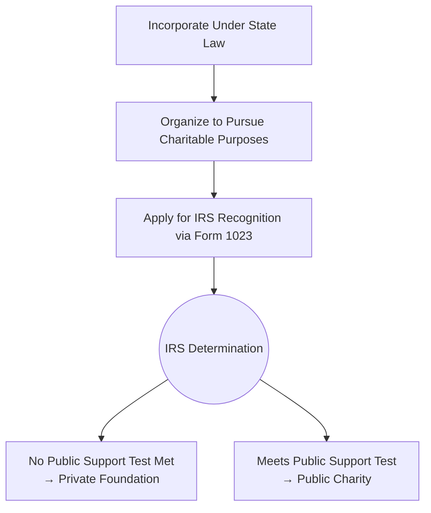

## 12.3 Charitable Entities, §501(c)(3) Requirements & Private Foundations

Charitable organizations play a vital role in the U.S. tax landscape, providing public benefits while enjoying a range of tax advantages. For CPA candidates studying for the Tax Compliance and Planning (TCP) section of the Uniform CPA Examination, it is crucial to develop deep familiarity with Internal Revenue Code (IRC) §501(c)(3), the classification of charitable organizations, annual reporting obligations such as Form 990, and the additional compliance considerations for private foundations.

This section covers:
• The formation requirements and guiding principles for §501(c)(3) entities.  
• The organizational and operational tests.  
• How an IRS determination letter is obtained and maintained.  
• The differences between public charities and private foundations.  
• Annual reporting obligations (Form 990).  
• Complex excise taxes that apply specifically to private foundations.  

Throughout this chapter, we will draw on the broader framework of tax law covered in previous chapters and incorporate best practices and real-world scenarios to provide clarity. Strong proficiency in these topics is essential not only for the CPA exam but also for practical tax compliance work.

---

### Overview of Tax-Exempt Status Under §501(c)(3)

A charitable organization recognized under IRC §501(c)(3) is granted exemption from federal income tax. Qualifying activities typically involve religious, educational, scientific, literary, or other charitable purposes. The “charitable” scope in the tax code also includes activities addressing public safety testing, fostering national or international amateur sports, and preventing cruelty to children or animals.  

The tax exemption can translate into significant financial advantages:  
• Income tax exemption.  
• Eligibility to receive tax-deductible charitable contributions (subject to donor limitations under IRC §170).  
• Possible exemption from certain state and local taxes (sales tax, property tax) where applicable.

To qualify, the organization must satisfy the Organizational Test and the Operational Test. Both tests must be met continuously throughout the entity’s existence. Failure to meet these requirements can lead to revocation of tax-exempt status.

---

### The Organizational Test

Under the Organizational Test, the entity’s founding documents (Articles of Incorporation, Trust Agreement, or other relevant formation document) must limit the organization’s purposes to those described in §501(c)(3). In other words:

1. The organizing document must explicitly state that the entity’s activities are restricted exclusively to charitable, religious, educational, or other §501(c)(3)-aligned purposes.  
2. The document must not empower the organization to engage in significant non-exempt activities or political campaigns.  
3. On dissolution, the organization’s assets must be dedicated to exempt purposes, typically by stating that remaining assets will be distributed to another §501(c)(3) organization.

A typical pitfalls occur when the founding documents are either silent or contain overly broad clauses that allow for unqualified activities. For instance, the phrase “to engage in any lawful activity” in some corporate charters may jeopardize the qualification unless carefully addressed by referencing appropriate limitations for §501(c)(3).

---

### The Operational Test

Once it is properly organized, the entity must operate exclusively for exempt purposes:

• Exclusively Exempt Activities: The organization’s primary operations must further one or more of the stated charitable purposes in §501(c)(3).  
• Private Benefit Prohibition: Any monetary or in-kind benefits must not inure to private shareholders or individuals. Use of funds to excessively compensate insiders or to distribute profits to private individuals can result in violation of the private inurement doctrine.  
• No Substantial Lobbying: While limited lobbying activities for legislation relevant to the mission may be permissible, it cannot amount to a “substantial part” of the organization’s activities.  
• Strict Prohibition on Campaign Intervention: The IRS forbids §501(c)(3) organizations from contributing to political campaigns on behalf of (or in opposition to) candidates for public office.

The Operational Test is sometimes subject to professional judgment. The IRS looks at the organization’s main revenue-generating activities (Is it mostly from charitable grants, membership dues, or admissions to educational programs?), how funds are disbursed, and whether the organization’s resources substantially further its exempt purposes.

---

### Achieving and Maintaining §501(c)(3) Status

To obtain formal recognition, an organization typically files Form 1023 (or the streamlined Form 1023-EZ for eligible smaller organizations) with the IRS. Applicants provide detailed information on their activities, governing documents, past and projected budgets, and written narratives explaining how the organization furthers charitable purposes.

Key steps often include:

• Draft Bylaws & Articles of Incorporation carefully.  
• Ensure the paperwork addresses the dissolution clause and adheres to permissible activities.  
• Pay attention to the IRS sample language for charitable organizations.  
• Submit organizational documents as part of Form 1023, including financial data and a description of activities.

Once approved, the IRS issues a Determination Letter confirming the exempt status. However, the letter’s validity depends on ongoing compliance. To maintain §501(c)(3) status, the organization must:

• Annually file Form 990 or an appropriate variant (Form 990-EZ or 990-N) unless specifically exempt from the filing requirement (e.g., certain religious organizations).  
• Follow the private inurement prohibition.  
• Limit lobbying activities and adhere to the prohibition on political campaign intervention.  
• Ensure it remains primarily engaged in furthering its exempt purposes.

Violations can trigger IRS examinations or revocation of exempt status, along with potential liability for back taxes, fines, and penalties.

---

### Public Charity vs. Private Foundation

Under IRC §509, all §501(c)(3) organizations are, by default, classified as private foundations unless they can demonstrate qualification as a public charity. Public charities typically receive a broad base of support from the general public or government sources, while private foundations are often funded by a single individual, family, or small group.

Common public charity classifications include:

• IRC §509(a)(1): Organizations receiving substantial support from gifts, grants, or contributions from the general public or governmental units.  
• IRC §509(a)(2): Organizations that receive most of their support from a combination of contributions and revenues from exempt activities.  
• IRC §509(a)(3): Supporting organizations that exist to support other public charities.  

Public charities are subject to fewer restrictions and excise taxes than private foundations. Private foundations, on the other hand, are subject to additional rules intended to prevent abuse and ensure that philanthropic dollars are used to benefit society at large.

---

### Private Foundations: Definition, Regulatory Scrutiny, and Excise Taxes

When an entity is unable to demonstrate that it is publicly supported, it is treated as a private foundation. Typically financed by a small circle of donors, private foundations have certain regulatory requirements designed to encourage charitable giving and limit potential abuse:

#### Minimum Distribution Requirement

Private foundations must annually distribute (in the form of grants or certain other qualifying distributions) at least 5% of their non-charitable-use assets. This rule ensures that philanthropic dollars are put to active charitable use rather than stored indefinitely in investment accounts.

#### Self-Dealing Prohibitions

Private foundations are prohibited from engaging in certain transactions with disqualified persons (e.g., officers, directors, substantial contributors, owners of significant interests in corporate donors). Self-dealing can include the sale or lease of property, lending of money, or furnishing services between the foundation and disqualified persons. Violations trigger vigorous excise taxes.

#### Excess Business Holdings

The law limits a private foundation’s ownership share in business enterprises. Generally, a foundation and its disqualified persons combined may not control more than 20% of a for-profit business (with certain limited exceptions).

#### Jeopardizing Investments

Private foundations must manage their investment portfolio prudently to avoid investments that put the foundation’s assets at risk for non-charitable purposes. An example might be speculative or overly risky investments not aligned with recognized fiduciary standards.

#### Taxable Expenditures and Lobbying Restrictions

Private foundations face tight rules regarding expenditures for lobbying, political campaigns, or grants made without due diligence. Transfers to non-501(c)(3) organizations that are not properly monitored can result in taxable expenditures.

---

### Private Foundation Excise Taxes

Unlike public charities, private foundations face several specialized excise taxes under the IRC. Key ones include:

1. **Section 4940—Net Investment Income Tax**: Private foundations typically pay a small excise tax on their net investment income, which includes interest, dividends, rents, royalties, and capital gains (subject to certain deductions). Recent changes have simplified the two-tier system into a single flat rate of 1.39%.  
2. **Section 4941—Taxes on Self-Dealing**: A self-dealing transaction can result in first-tier and second-tier excise taxes imposed on the self-dealer and potentially on the foundation managers who knowingly participated in the transaction.  
3. **Section 4942—Taxes on Failure to Distribute Income**: Failure to meet the 5% minimum distribution requirement triggers excise taxes.  
4. **Section 4943—Taxes on Excess Business Holdings**: Foundations holding more than the permissible amount of business interests are subject to an excise tax.  
5. **Section 4944—Taxes on Jeopardizing Investments**: An excise tax is imposed if the foundation invests assets in a way that jeopardizes its charitable purposes.  
6. **Section 4945—Taxes on Taxable Expenditures**: Taxable expenditures, such as grants to non-charitable entities without adequate oversight or lobbying expenditures, can trigger additional excise taxes.

Given these complexities, private foundations must pay careful attention to annual excise tax filings and compliance requirements, as the penalties can be severe.

---

### Ongoing Compliance and Annual Filings (Form 990)

Most §501(c)(3) organizations, whether public charities or private foundations, must file an annual information return that discloses financial activities, governance structures, and compensation to key staff. The primary forms are:

• **Form 990**: For large charitable organizations with gross receipts ≥ $200,000 or total assets ≥ $500,000.  
• **Form 990-EZ**: For smaller organizations with gross receipts < $200,000 and total assets < $500,000.  
• **Form 990-PF**: Mandatory for all private foundations, regardless of asset size.  
• **Form 990-N** (e-Postcard): For the smallest organizations with annual gross receipts ≤ $50,000.

Timely filing of the appropriate form is critical:

• Due Date: The return is due by the 15th day of the fifth month after the close of the organization’s tax year (e.g., May 15 for calendar-year filers).  
• Extensions: An automatic 6-month extension is available by filing Form 8868.  
• Noncompliance: Failure to file for three consecutive years automatically results in revocation of tax-exempt status.

In addition to filing an annual return, diligent record-keeping of revenues, expenses, and charitable activities is critical. For further details on record-keeping best practices and the compliance environment, see Chapter 21 on IRS Practice & Procedure.

---

### Practical Examples and Case Studies

Below are several scenarios that highlight key compliance issues that may appear in exam questions or real-world practice:

• **Scenario A**: A family foundation invests heavily in a single technology startup in which the founder’s spouse holds a 30% ownership interest. This scenario raises potential self-dealing and excess business holdings concerns. A prudent approach involves actively divesting excess shares to comply with the 20% ownership limit within the grace period.  
• **Scenario B**: A newly formed charitable organization includes broad “any lawful purpose” language in its Articles of Incorporation. The IRS requests amendments clarifying that the organization’s scope is limited to charitable and educational pursuits, demonstrating how critical precise language is for the Organizational Test.  
• **Scenario C**: A local non-profit museum organizes an advocacy campaign urging legislators to pass a funding bill for the arts. The time and resources used for lobbying come under scrutiny. The museum must track how much staff time is devoted to lobbying to ensure it is not a “substantial part” of activities.

---

### Visualizing Organizational Structures

To illustrate the relationship between different exempt classification paths under the IRS rules, consider the following mermaid diagram. The diagram highlights the initial classification under §501(c)(3) and the default categorization as a private foundation unless the organization meets the public support tests.

As the diagram shows, the default classification for a §501(c)(3) organization is “private foundation” unless it can show it meets the public support test. This classification is not permanent: the organization can change classification if its support base changes substantially over time.

---

### Best Practices, Common Pitfalls, and Strategies

• **Robust Bylaws and Formation Documents**: Incorporating the correct purpose and dissolution language from the start simplifies the determination process.  
• **Comprehensive Grantmaking Procedures for Foundations**: Implement a robust process to vet grant recipients and maintain detailed records of how funds are used.  
• **Avoid Political Activity**: Even inadvertent campaign participation could compromise an organization’s exempt status.  
• **Separate Powers**: Avoid conflicts of interest by clearly delineating roles and duties among board members and officers.  
• **Routinely Review Public Support Ratios**: An organization that anticipates drifting into private foundation status should regularly perform the public support test calculations.  
• **Track Lobbying Expenditures**: Although certain public charities may make a 501(h) election to calculate lobbying under expenditure-based limits, they must still remain cautious about crossing the threshold of “substantial lobbying.”  

---

### References for Further Exploration

• Publication 557, “Tax-Exempt Status for Your Organization,” by the IRS.  
• Treasury Regulations §1.501(c)(3)-1 on the Organizational and Operational Tests.  
• IRS Guidance on Private Foundations and Form 990-PF instructions.  
• Chapter 21 of this text: “Practice & Procedure.”  
• Online courses on non-profit formation and management; for instance, certain continuing education offerings from AICPA or other professional associations.

---

## Charitable Entities, Private Foundations & Exempt Organization Fundamentals: Quick Check Quiz



### A non-profit organization seeking §501(c)(3) status must first meet which fundamental requirement?

- [x] The Organizational Test, requiring its governing documents to limit its purposes to charitable or other exempt categories.  
- [ ] The Political Test, ensuring it is involved in political campaigns.  
- [ ] The Advertising Initiative, ensuring proper promotional outreach.  
- [ ] The Non-Commercial Doctrine, clarifying that it never sells any products.  

> **Explanation:** The Organizational Test is central to achieving and maintaining §501(c)(3) status. Governing documents must clearly define and limit the organization’s mission to exempt purposes.

### Under the Operational Test, which activity would generally disqualify a §501(c)(3) organization?

- [x] Substantial lobbying efforts that constitute a primary portion of the organization’s work.  
- [ ] Holding an annual fundraiser open to the public at a local school auditorium.  
- [ ] Paying reasonable compensation to an executive director.  
- [ ] Maintaining a public website and social media presence.  

> **Explanation:** A substantial part of a §501(c)(3) organization’s activities cannot include lobbying, or it risks losing its status. Minor or insubstantial amounts of lobbying may be permissible.

### Which entity must file a Form 990-PF annually, regardless of income level?

- [x] Private foundations.  
- [ ] Public charities with annual gross receipts over $200,000.  
- [ ] Supporting organizations only.  
- [ ] All §501(c)(3) organizations.  

> **Explanation:** Every private foundation files Form 990-PF, regardless of size, to ensure careful monitoring by the IRS.

### Which of the following is a hallmark of a public charity under §509(a)(1)?

- [x] It receives broad financial support from the public or government sources.  
- [ ] It must be established from the personal funds of a single individual.  
- [ ] It cannot accept donations greater than $5,000 from a single donor.  
- [ ] It is not subject to the Organizational and Operational Tests.  

> **Explanation:** Public charities under §509(a)(1) rely on broad public support, creating a more diverse funding base than private foundations.

### What is the minimum annual distribution requirement for a private foundation?

- [x] Generally 5% of its non-charitable-use assets.  
- [ ] 10% of its total grants made in the prior year.  
- [x] 5% of its total investment returns for the year, whichever is higher.  
- [ ] 3% of its public contributions.  

> **Explanation:** Private foundations must generally distribute at least 5% of the fair market value of their non-charitable-use assets annually. This ensures philanthropic dollars are actively deployed for public benefit.

### Which statement best describes a self-dealing transaction under private foundation rules?

- [x] Any transaction between the foundation and a disqualified person that unjustly benefits the latter.  
- [ ] A permissible loan arrangement with a board member conducted at fair market interest.  
- [ ] A volunteer activity benefiting the foundation’s employees with no outside charitable purpose.  
- [ ] Ordinary fundraising activities open to the public.  

> **Explanation:** Self-dealing occurs when a disqualified person benefits from a transaction with the foundation, triggering excise taxes under IRC §4941.

### Which of the following is a valid reason to revoke §501(c)(3) status?

- [x] Engaging in excessive political campaign intervention.  
- [ ] Conducting fundraising events open to families and children.  
- [x] Complying with the Organizational and Operational Tests.  
- [ ] Filing Form 990 every year.  

> **Explanation:** Violation of political campaign intervention rules, including endorsing or opposing candidates, can result in the IRS revoking the organization’s tax-exempt status.

### Which filing status is available to many small organizations with less than $50,000 in annual gross receipts?

- [x] Form 990-N (e-Postcard).  
- [ ] Form 1023-EZ.  
- [ ] Form 1040-NR.  
- [ ] Form 1065.  

> **Explanation:** Very small tax-exempt organizations can submit the electronic post card filing to meet their annual filing requirements.

### Which excise tax is imposed on private foundations for failing to meet the annual distribution requirements?

- [x] Taxes under IRC §4942.  
- [ ] Self-dealing taxes under IRC §4941.  
- [ ] Section 4940 net investment income tax.  
- [ ] Section 4944 jeopardizing investments tax.  

> **Explanation:** IRC §4942 excise taxes apply specifically when a private foundation fails to distribute sufficient amounts to further charitable purposes.

### A true statement regarding the public support test is:

- [x] It ensures an organization is not predominantly funded by a few private donors, helping it qualify as a public charity.  
- [ ] It allows unrestrained lobbying efforts as long as public contributions are higher than 50%.  
- [ ] It provides an absolute safe harbor against all IRS scrutiny.  
- [ ] It only applies to religious institutions, not all public charities.  

> **Explanation:** Public charities typically demonstrate diverse funding sources, preventing undue influence by a few private donors. The public support test is essential to securing (or retaining) public charity classification.



---

## For Additional Practice and Deeper Preparation

**[TCP CPA Hardest Mock Exams: In-Depth & Clear Explanations](https://www.udemy.com/course/tcp-cpa-mock-exams/?referralCode=675149871D0E79B1699C)**  

**Tax Compliance & Planning (TCP) CPA Mocks:** 6 Full (1,500 Qs), Harder Than Real! In-Depth & Clear. Crush With Confidence!

- Tackle full-length mock exams designed to mirror real TCP questions.  
- Refine your exam-day strategies with detailed, step-by-step solutions for every scenario.  
- Explore in-depth rationales that reinforce higher-level concepts, giving you an edge on test day.  
- Boost confidence and minimize anxiety by mastering every corner of the TCP blueprint.  
- Perfect for those seeking exceptionally hard mocks and real-world readiness.

_Disclaimer: This course is not endorsed by or affiliated with the AICPA, NASBA, or any official CPA Examination authority. All content is for educational and preparatory purposes only._
