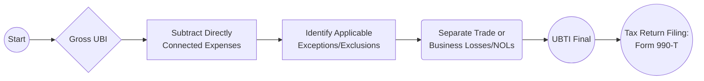

## 12.4 Unrelated Business Income & Exceptions (Volunteer Labor, Research)

Unrelated business income (UBI) is a critical concept for tax-exempt organizations, as it has direct implications on whether these entities maintain their exempt status and how they are taxed on certain lines of business. While many organizations operate primarily in service of their exempt purpose, they often generate income from side activities that may constitute an “unrelated trade or business.” Understanding when certain exceptions apply—particularly regarding volunteer labor and research activities—helps ensure compliance and could significantly reduce tax liability. 

In this section, we expand on:
• Key definitions and the legislative framework surrounding UBI.  
• The volunteer labor and research exceptions, including their statutory basis.  
• The fragmentation rule and its determination of which parts of business activities must be taxed.  
• Calculating UBI, including net operating losses (NOLs) and special rules for separate activities.  
• Illustrative examples drawn from Internal Revenue Service (IRS) guidance.  

This discussion aims to prepare you for potential exam questions on the Uniform CPA Examination’s Tax Compliance and Planning (TCP) section and to equip accountants, CFOs, and nonprofit practitioners with practical insights.

--------------------------------------------------------------------------------
### Definition and Statutory Basis

Tax-exempt organizations typically enjoy an exemption from federal income tax due to their charitable, educational, or other qualifying purposes (IRC §501(c)). However, Congress imposed taxes on revenue from business activities that are not related to the organization’s exempt purpose (IRC §511-514). The relevant statutes break down as follows:

• IRC §511: Imposes the tax on unrelated business income of certain exempt organizations.  
• IRC §512: Defines “unrelated business taxable income” (UBTI) and outlines certain modifications and exclusions.  
• IRC §513: Clarifies what constitutes a trade or business that is “unrelated,” including exceptions.  
• IRC §514: Governs “debt-financed property” and its potential to create unrelated business income.

UBI arises from a trade or business, regularly carried on, that is not substantially related to the organization’s tax-exempt purpose. Where these three criteria are fulfilled, the shelter of tax exemption normally ceases to apply, and the tax-exempt organization must pay tax at corporate or trust rates (depending on organizational structure) on the net UBI.

--------------------------------------------------------------------------------
### Key Components of UBI

1. Trade or Business: In most cases, any activity that generates income through the sale of goods or performance of services is considered a trade or business.  
2. Regularly Carried On: The frequency and continuity of the activity matter. A single bake sale once a year is less likely to be UBI compared to a year-round café open to the public.  
3. Not Substantially Related: The activity must not have a substantial causal connection to the accomplishment of the organization’s exempt purposes.

--------------------------------------------------------------------------------
### The Volunteer Labor Exception

One of the critical exceptions (IRC §513(a)) for tax-exempt organizations pertains to volunteer labor. If substantially all of the work in operating a trade or business is carried out by unpaid volunteers, the income derived from that business is generally not taxed as UBI.

• Substantially All: Though there is no fixed numeric threshold provided by the IRS in the Code, many practitioners interpret “substantially all” as 85% or more of the total labor hours. For example, if only a small fraction of the labor is performed by paid staff or independent contractors, the volunteer labor exception may still apply.  
• Illustrative Example: A public charity organizes an annual food festival to raise funds. If nearly all individuals who staff the booths, serve the food, and handle logistics are unpaid volunteers, the income may be exempt from UBI classification under the volunteer labor exception.  

This exception recognizes that if an organization’s trade or business is being operated by volunteers, it is more likely aligned with the organization's altruistic pursuits and less akin to competitive commercial endeavors.

--------------------------------------------------------------------------------
### The Research Exception

Another significant statutory exception for exempt organizations pertains to research activities (IRC §512(b)(7)-(9)). If the activity is conducted in the public interest, certain research revenues may be excluded from UBI. Common qualifiers include:

• Fundamental Research for Broad Dissemination: If the research results will be published or otherwise widely disseminated for the benefit of the scientific or academic community, that can qualify for exclusion.  
• Research by a University or Hospital: Certain research conducted by colleges, universities, or hospitals often meets the statutory exception when it is performed for the purpose of advancing scientific knowledge, not merely for commercial gain.  
• Commercial Testing vs. Non-Commercial Research: Activities that veer into product testing or routine laboratory services for purely commercial customers may lose the benefit of the tax exception.

A pivotal point is whether the research is primarily oriented toward advancing general scientific knowledge. The IRS has provided clarifications in rulings indicating that research results intended for the public domain are more likely to maintain the organization’s exempt status and not be subject to UBI tax.

--------------------------------------------------------------------------------
### The Fragmentation Rule

A crucial step when evaluating UBI is determining if only part of a larger activity constitutes an unrelated trade or business. This concept is known as the “fragmentation rule” (IRC §513(c)). According to this rule:

• Organizations Must Fragment or Parse Out Business Activities: Even if an organization conducts an event where some parts are related and some are unrelated, each segment must be examined to ascertain whether it is substantially related or not.  
• Example from IRS Guidance: Suppose a college bookstore sells textbooks to students for educational programs. That portion of the bookstore’s revenue is related to the educational mission. However, the same bookstore might also sell unrelated items such as popular clothing brands or electronics that are not directly related to education. Income from such non-education items could be treated as UBI.  
• Purpose: The rule prevents tax-exempt organizations from bundling related and unrelated activities together to mask a revenue stream’s fundamental purpose and avoid tax liability.

--------------------------------------------------------------------------------
### Computation of Unrelated Business Taxable Income

Unrelated business taxable income (UBTI) is calculated as the gross income from any unrelated trade or business, less deductions that are “directly connected” to carrying on that business (IRC §512(a)(1)). If an overhead expense (like rent) partially relates to the exempt function and partially to the unrelated business, the organization must allocate expenses between exempt and non-exempt use.

Below is a high-level flowchart illustrating the basic steps in computing UBTI:

1. Aggregate all revenue items from unrelated activities.  
2. Subtract expenses directly attributable to these activities (e.g., salaries, cost of goods sold, portions of rent).  
3. Apply exceptions where appropriate, such as volunteer labor or research.  
4. Consider losses from other unrelated activities if allowed under the post-2017 silo rules (discussed below).  
5. The resulting figure is UBTI, which is then reported, and taxed, typically using Form 990-T.

--------------------------------------------------------------------------------
### Net Operating Losses (NOLs) in UBI Computations

Many exempt organizations assume that if one unrelated trade or business generates a loss, it can offset income from another unrelated trade or business. This was historically permissible under more generalized rules; however, the Tax Cuts and Jobs Act (TCJA) of 2017 introduced “siloing” rules for NOLs (IRC §512(a)(6)):

1. Separate Silos: Each unrelated trade or business is treated as if it were its own silo. You cannot aggregate all unrelated activities together for the purpose of computing a single overall profit or loss.  
2. NOL Carryforwards: Losses from one unrelated trade or business may be carried forward and used against future income from the same trade or business. However, they cannot be used against income from a different unrelated trade or business.  
3. No Carryback: Current tax law generally disallows the carryback of NOLs (with some special exceptions).  
4. Example: If a hospital’s parking garage (an unrelated trade) generates a $10,000 net loss, and the hospital’s unrelated laboratory testing for commercial clients shows $20,000 of net income, the $10,000 parking garage loss cannot automatically offset the $20,000 from the lab’s income if the two activities are deemed distinct silos.

This separation underscores the importance of segregating each type of unrelated operation and carefully tracking each activity’s expenses, revenues, and net operating losses.

--------------------------------------------------------------------------------
### Real-World Examples from IRS Guidance

The IRS publishes guidance (including Private Letter Rulings, Revenue Rulings, and Publication 598) with examples illustrating when income is UBI and when it is excluded. A few notable ones:

• Revenue Ruling 73-105: Clarifies that an exempt organization operating a travel tour business unrelated to its exempt purpose would generally have UBI unless volunteer labor or other exceptions apply.  
• Gift Shop Scenario (Publication 598): A museum operates a gift shop selling both educational materials and souvenir items. The educational materials (books on the museum’s exhibits) are related to its exempt purpose, but novelty items (e.g., mugs, magnets with no educational content) can be deemed unrelated.  
• Hospital Cafeteria Example: If a hospital cafeteria is open to the general public (not just staff and patients), portions of the café’s income may be unrelated unless volunteer labor is substantially deployed or other exceptions apply.

In each case, the identity of the buyer, the nature of the goods/services, the presence of any statutory exception, and the fragmentation rule all come into play.

--------------------------------------------------------------------------------
### Potential Pitfalls and Common Challenges

1. Failure to Fragment Adequately: Many organizations mistakenly treat an entire revenue stream as related to their exempt function, failing to separate out the unrelated portions.  
2. Underestimating Volunteer Labor Requirements: If “substantially all” volunteer labor is claimed, the organization must document it thoroughly. Even the presence of a small number of paid staff can weaken the exception claim if they represent a significant portion of total labor hours.  
3. NOL Silo Misconceptions: Some organizations continue to aggregate net losses across unrelated trades or businesses. Since the TCJA, such aggregation may violate the silo rules, leading to potential underpayment of tax.  
4. Overlooking Research vs. Commercial Testing Distinctions: Organizations engaged in scientific research must distinguish between fundamental research and commercial product testing services to claim the research exception properly.

--------------------------------------------------------------------------------
### Best Practices for Managing UBI

• Maintain Separate Books and Records: Keep detailed financial records for each line of unrelated business (or potential business) to track income and expenses credibly.  
• Conduct Annual UBI Reviews: Each year, review every revenue stream for potential generation of UBI and identify changes in personnel (volunteer vs. paid) or modifications to research agreements.  
• Use Time Tracking for Volunteer Labor: If claiming the volunteer labor exception, maintain logs of hours worked by volunteers versus paid employees.  
• Leverage Expert Guidance: Because the silo rules and fragmentation tests can be complex, consult CPAs or tax attorneys familiar with exempt organizations and the UBI framework.  
• Stay Current with IRS Rulings: The IRS may publish updates, new regulations, or clarifications on UBI. Subscribe to relevant announcements and updates.

--------------------------------------------------------------------------------
### Practical Case Study

Imagine a charitable foundation that runs a museum (its main exempt function), a café for visitors, and a mail-order catalog operation selling T-shirts and souvenirs.

1. Museum Activities: Income from admission fees and guided tours is related, as it directly achieves the organization’s exempt educational purpose.  
2. Museum Café: Some portion of activity may be related if it is limited primarily to visitors, but if it also promotes itself as a lunch spot to the general public, those external sales could be drawn into UBI. If largely staffed by volunteers, it may qualify for the volunteer labor exception.  
3. Mail-Order Catalog: T-shirts or souvenirs with purely promotional content may be deemed unrelated unless the designs and content are educational. If the revenue from the T-shirts is more commercially driven and the link to the mission is minimal, that revenue likely falls within UBI.  
4. Fragmentation: Within the catalog operation, certain educational videos or books closely tied to the mission are related, while general merchandise is unrelated. Each category must be separately tracked for potential unrelated business income.  
5. NOL Silo: If the café operates at a loss, that loss cannot offset profits from the mail-order catalog unless they are part of the exact same unrelated trade or business.

By diligently applying the fragmentation rule, the volunteer labor exception, and the research exception (if applicable to the museum’s archival or scientific activities), the foundation can minimize its liability while remaining in good standing.

--------------------------------------------------------------------------------
### Conclusion

Unrelated Business Income (UBI) and its associated exceptions play a critical role in maintaining tax compliance for exempt organizations. From volunteer labor exemptions to research exclusions, understanding how each fits into IRC §511-§513 is essential for CPAs who serve nonprofits or plan to sit for the CPA exam. 

The fragmentation rule requires careful parsing of separate activities, while net operating losses must be meticulously tracked under new silo rules. By applying these principles and carefully documenting activities, organizations can preserve their exempt status and optimize their tax liabilities without running afoul of IRS guidelines.

--------------------------------------------------------------------------------
### References for Further Exploration

• IRS Publication 598 – “Tax on Unrelated Business Income of Exempt Organizations”:  
  https://www.irs.gov/publications/p598  
• IRS Form 990-T Instructions:  
  https://www.irs.gov/instructions/i990t  
• AICPA Nonprofit Resources:  
  https://www.aicpa.org/interestareas/nonprofitandgovernment  
• IRS Exempt Organizations (EO) Update:  
  https://www.irs.gov/charities-non-profits/exempt-organizations-update  

These resources offer in-depth coverage of real-world UBI scenarios and provide helpful guidance on compliance, recordkeeping, and the evolving regulatory environment.

--------------------------------------------------------------------------------

## Unrelated Business Income and Volunteer Labor: 10-Question Practice Quiz



### Which of the following best defines “substantially all” when applying the volunteer labor exception for an exempt organization’s activity?

- [ ] Exactly 51% of labor is performed by volunteers.  
- [ ] Roughly 60% of labor is performed by volunteers.  
- [x] At least 85% or more of the labor hours are performed by volunteers.  
- [ ] At least 100% of the labor must be volunteer-based.  

> **Explanation:** While no hard numeric threshold is specified by the Code or regulations, tax professionals commonly interpret “substantially all” as 85% or more of total labor hours performed by volunteers.

### With respect to unrelated business income, how does IRC §513(c) define the “fragmentation rule”?

- [ ] All activities are treated as one single trade or business.  
- [x] Each distinct aspect of an activity must be analyzed to see if it is related or unrelated.  
- [ ] Activities can be freely combined to minimize tax liability.  
- [ ] Only intangible aspects of a business must be separated out for tax.  

> **Explanation:** The fragmentation rule requires organizations to treat related and unrelated activities separately, ensuring that revenue streams not substantially related to the exempt purpose are subject to UBI rules.

### After the Tax Cuts and Jobs Act (TCJA) of 2017, how must nonprofits handle net operating losses (NOLs) from different unrelated trades or businesses?

- [x] They must track each unrelated trade or business separately and apply NOLs only to the same activity.  
- [ ] They can aggregate all unrelated activities and offset losses from one activity against another.  
- [ ] They can only carry back the NOL one year.  
- [ ] They must eliminate NOLs on January 1 of the tax year.  

> **Explanation:** The TCJA introduced separate “silo” rules, disallowing the pooling of NOLs across different unrelated trades or businesses. Losses from one activity may only be used against future income from that same activity.

### Which of the following is most likely to be excluded from UBI under the research exception?

- [ ] Commercial testing of products for private manufacturers.  
- [ ] Routine lab services for corporations primarily for profit.  
- [ ] Development of proprietary formulas for sale to private industry.  
- [x] Fundamental research published for public benefit.  

> **Explanation:** The research exception commonly covers fundamental research activities aimed at advancing scientific knowledge, especially when the results are disseminated in the public domain.

### In determining whether a museum’s gift shop sales constitute UBI, which factor is most crucial?

- [ ] The gift shop’s overall profitability.  
- [x] Whether the items sold directly further the museum’s exempt educational mission.  
- [ ] The presence of volunteer labor.  
- [ ] The size of the gift shop’s inventory.  

> **Explanation:** The key test is whether the items sold substantially relate to furthering the exempt purpose. Selling educational books or exhibit-related materials is less likely to be considered UBI, whereas unrelated souvenir items are more likely to be UBI.

### An exempt organization operates a year-round café. Volunteers run 90% of daily operations, and one part-time chef is hired for minimal oversight. Which statement is correct?

- [x] The café may qualify for the volunteer labor exception because substantially all work is performed by volunteers.  
- [ ] The hired chef disqualifies the entire exception.  
- [ ] The organization must consider all revenue as unrelated business income.  
- [ ] The café’s sales automatically become UBI due to paid employees working any hours.  

> **Explanation:** The presence of one part-time chef may not jeopardize the exception if the chef’s hours are small compared to the total volunteer hours. “Substantially all” volunteer participation means the exception likely still applies.

### According to IRS guidance, which of the following is generally not an unrelated trade or business?

- [ ] Operating a gym open to the public with market-rate membership fees.  
- [ ] Running a travel tour business unconnected to the exempt purpose.  
- [ ] Selling T-shirts without any educational component.  
- [x] A fundraiser primarily staffed by volunteers where goods and services directly relate to the organization’s exempt purpose.  

> **Explanation:** When an event is staffed predominantly by volunteers and furthers the organization’s exempt purpose, it is typically not UBI.

### An exempt hospital runs a parking garage with stable profits. Separately, it operates a gift shop that loses money. Under the silo rules:

- [ ] The hospital can offset the gift shop’s loss against the parking garage’s income.  
- [x] Each activity is siloed, so the parking garage income stands alone, and the gift shop loss stands alone.  
- [ ] Both should be aggregated into a single unrelated trade or business.  
- [ ] The gift shop’s loss is disregarded entirely.  

> **Explanation:** Post-TCJA, each unrelated activity is treated separately. Losses from one silo cannot automatically offset another silo’s income.

### Which of the following best illustrates the fragmentation rule in practice?

- [x] A college bookstore tracks revenue separately for textbooks (related) vs. electronics (unrelated).  
- [ ] A museum conflates all gift shop sales as related to its exhibits.  
- [ ] A hospital’s gift shop lumps employee scrubs and souvenirs together.  
- [ ] A university merges cafeteria sales to staff and students without any distinction.  

> **Explanation:** The college bookstore example vividly demonstrates how an organization must separate related and unrelated portions of the same enterprise.

### The “substantially related” test for determining whether an activity is related to an exempt purpose typically focuses on whether:

- [x] The activity directly furthers the organization’s exempt function.  
- [ ] The organization’s name is attached to all products sold.  
- [ ] The organization generates minimal income from the activity.  
- [ ] The activity is highly profitable.  

> **Explanation:** “Substantially related” activities must have a direct connection to furthering the exempt function of the organization—rather than just the generation of revenue.



--------------------------------------------------------------------------------

## For Additional Practice and Deeper Preparation

**[TCP CPA Hardest Mock Exams: In-Depth & Clear Explanations](https://www.udemy.com/course/tcp-cpa-mock-exams/?referralCode=675149871D0E79B1699C)**  

**Tax Compliance & Planning (TCP) CPA Mocks:** 6 Full (1,500 Qs), Harder Than Real! In-Depth & Clear. Crush With Confidence!

- Tackle full-length mock exams designed to mirror real TCP questions.  
- Refine your exam-day strategies with detailed, step-by-step solutions for every scenario.  
- Explore in-depth rationales that reinforce higher-level concepts, giving you an edge on test day.  
- Boost confidence and minimize anxiety by mastering every corner of the TCP blueprint.  
- Perfect for those seeking exceptionally hard mocks and real-world readiness.

_Disclaimer: This course is not endorsed by or affiliated with the AICPA, NASBA, or any official CPA Examination authority. All content is for educational and preparatory purposes only._
