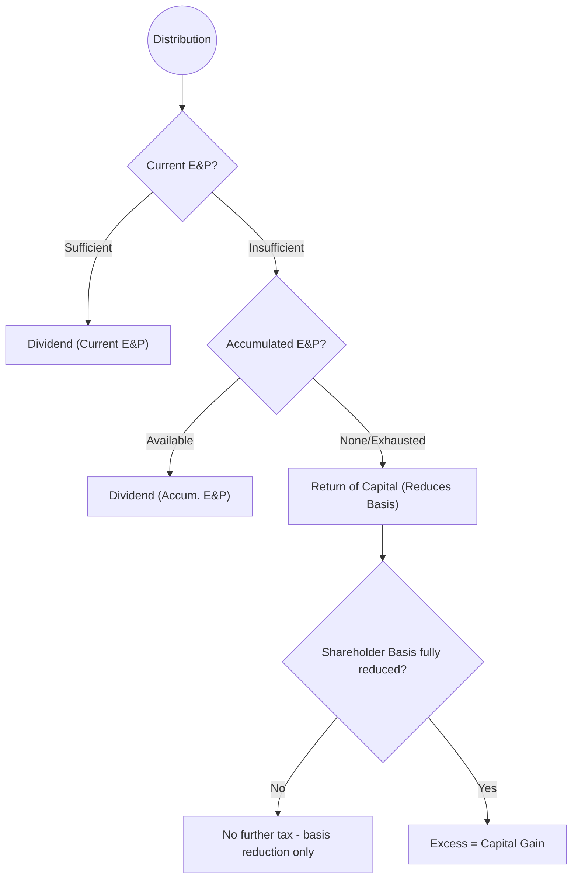

## 8.4 Corporate E&P Calculations & Dividend Treatment

In tax accounting for C corporations, the determination and treatment of Earnings & Profits (E&P) is at the heart of how shareholder distributions are classified. A corporation’s E&P quantifies its economic ability to pay dividends out of its “real” earnings in a manner somewhat parallel to retained earnings in financial accounting—but often with unique and intricate tax adjustments.

Understanding E&P calculations is essential not only for classifying distributions as dividends or non-taxable returns of capital (or even capital gains in some cases) but also for planning future corporate transactions and ensuring proper compliance. This section builds on foundational corporate tax knowledge presented in earlier sections of Chapter 8 (especially 8.1, 8.2, and 8.3) by focusing on the specifics of how E&P is computed and then translated into dividend treatment.  

--------------------------------------------------------------------------------
### Key Concepts and Definitions

1. **Earnings & Profits (E&P):** A measure used by the Internal Revenue Service (IRS) to track a corporation’s financial capability to pay dividends. Unlike financial accounting retained earnings, E&P is calculated under tax rules, which include adjustments to a corporation’s taxable income to reflect its ability to distribute funds to shareholders.

2. **Current E&P vs. Accumulated E&P:**
   - **Current E&P**: The corporation’s E&P for a given taxable year, computed after making specific tax-driven additions and subtractions to its taxable income.  
   - **Accumulated E&P**: The sum of all prior years’ current E&P, reduced by prior distributions and relevant adjustments. Accumulated E&P at the start of the year plus the current year’s E&P (or deficit) equals the total E&P available at the end of that year, before subtracting that year’s distributions.

3. **Dividend Classification and Return of Capital:** Distributions to shareholders are:
   - Treated as **dividends** to the extent of current and accumulated E&P.  
   - Treated as **return of capital (ROC)** after E&P is exhausted, reducing the shareholder’s stock basis.  
   - Treated as **capital gain** once the shareholder’s basis is fully reduced to zero.

4. **Taxable Income vs. E&P:** While taxable income can be a starting point for computing E&P, further adjustments are made for items such as federal income taxes, tax-exempt interest, nondeductible expenses, and certain timing differences.

--------------------------------------------------------------------------------
### Relationship Between Current and Accumulated E&P

E&P is typically tracked in two layers:

1. **Current E&P** (for the current tax year).
2. **Accumulated E&P** (since the corporation’s inception or from the point it became subject to corporate tax).

When a corporation distributes to its shareholders, it must first determine if it has **current E&P** and **accumulated E&P**. The distribution’s classification is affected by the interplay between these two figures.

#### Timing and Ordering Rules
• Distributions made during the year come first out of **current E&P**, to the extent it exists at the time of distribution.  
• If current E&P is insufficient (or negative), the distribution taps into **accumulated E&P**.  
• If both current and accumulated E&P are exhausted, the distribution is then treated as a non-taxable return of capital (reducing the shareholder’s stock basis).  
• If ROC exceeds the shareholder’s basis, the excess is recognized as a capital gain by the shareholder.

--------------------------------------------------------------------------------
### Computing Current E&P: Step-by-Step

Although precise rules can vary based on specialized situations, the general steps to compute current E&P can be represented as:

1. **Begin with Taxable Income** (Line 30 of Form 1120).
2. **Add** non-taxable income excluded from taxable income but included in E&P. Examples:
   - Tax-exempt municipal bond interest.
   - Life insurance proceeds in excess of cash surrender value.
   - Federal income tax refunds (if previously deducted as an expense).
3. **Subtract** expenses not allowed in computing E&P but deducted for tax purposes. Examples:
   - Federal income taxes accrued (if not already accounted for).
   - Certain “excess” charitable contributions carried over to future years.
   - Special depreciation allowances (e.g., bonus depreciation) that accelerate deductions but do not reduce E&P at the same rate.
4. **Add** items that were deducted for tax, but not permitted in E&P (or are lesser amounts for E&P). Examples:
   - Excess Section 179 expense.
   - Nondeductible fines or penalties (these reduce E&P but may not reduce taxable income the same way).
   - Some intangible drilling costs adjustments (if relevant, see specialized industries in Chapter 24.2).
5. **Make Timing Adjustments** for items recognized in different periods for E&P than for taxable income. Examples include:
   - Installment sale gains recognized earlier for E&P, or
   - Differences due to LIFO vs. FIFO inventory approaches.
6. **Adjust for Dividends Paid** & Other Distributions during the year in measuring current E&P at year-end.

In formula terms, one simplified way to express current E&P is:


\begin{align*}
\text{Current E\&P} &= \text{Taxable Income} \\
&+ (\text{Additions}: \text{non-taxable income, timing adjustments}) \\
&- (\text{Subtractions}: \text{nondeductible expenses, adjustments}) \\
&- \text{Federal Income Tax Liability}
\end{align*}


Note: The exact formula includes numerous variations and sub-schedules. The corporation’s tax return software or spreadsheet will typically track these specific adjustments.

--------------------------------------------------------------------------------
### Accumulated E&P Computation

Accumulated E&P is the total of all prior year current E&P amounts, minus distributions and other adjustments made in previous years. Practically, the formula at the end of each year looks like:


\begin{align*}
\text{Ending Accumulated E\&P} &= \text{Beginning Accumulated E\&P} \\
&+ \text{Current E\&P for the Year} \\
&- \text{Distributions Deemed Paid Out of E\&P}
\end{align*}


Corporations that have historically generated positive E&P may carry balances forward for many years. Conversely, if there have been major losses or significant distributions, the accumulated E&P can be depleted or go into a deficit.

--------------------------------------------------------------------------------
### Dividend vs. Return of Capital: Ordering and Classification

When a corporation issues a distribution, it follows a specific hierarchy:

#### 1. Distribution from Current E&P
If the corporation has **positive current E&P** for the year, the distribution is a dividend to the recipient to the extent of that year’s current E&P.

#### 2. Distribution from Accumulated E&P
If the corporation’s current E&P is insufficient or exhausted, the distribution is then sourced from **accumulated E&P**. Any portion of distribution up to the accumulated E&P is treated as a dividend.

#### 3. Return of Capital (ROC)
After both current E&P and accumulated E&P are fully depleted, the distribution is considered a **tax-free return of capital**, reducing the shareholder’s stock basis.

#### 4. Capital Gain
Once the shareholder’s basis is reduced to zero, any additional amounts distributed are recognized as **capital gain**.

Below is a flowchart illustrating the general approach:

--------------------------------------------------------------------------------
### Practical Example

#### Example 1: Year-End Distributions with Positive E&P

• XYZ Corporation has **Beginning Accumulated E&P** of \$50,000.  
• In the current tax year, it computes **Current E&P** of \$20,000.  
• During the year, XYZ distributes \$60,000 to its sole shareholder, Bob.

Step-by-step classification:

1. **Distribute from Current E&P**: \$20,000 of the \$60,000 is a dividend from current E&P.  
2. **Distribute Remaining from Accumulated E&P**: The remainder \$40,000 draws down from the \$50,000 accumulated E&P. That means \$40,000 is still a dividend.  
3. **After Distribution**: Accumulated E&P is now \$50,000 (beginning) + \$20,000 (new current E&P) - \$60,000 (distributions) = \$10,000.  
4. **Results**:  
   - Shareholder Bob has received \$60,000 total, with \$60,000 taxed as dividend income (in Bob’s case).  
   - Remaining Accumulated E&P is \$10,000.

No portion of the distribution is a return of capital because E&P was sufficient to cover the entire \$60,000 distribution.

#### Example 2: Partial E&P Covering Distributions

• ABC Corporation has **Beginning Accumulated E&P** of \$5,000.  
• In the current tax year, it computes **Current E&P** of \$10,000.  
• Distributions to shareholders total \$30,000.  

Step-by-step classification:

1. **Distribute from Current E&P**: \$10,000 is a dividend from current E&P.  
2. **Distribute from Accumulated E&P**: The next \$5,000 is a dividend from accumulated E&P.  
3. **Remaining Distribution**: At this point, E&P is fully used. The total dividend portion is \$15,000.  
4. **Return of Capital**: Of the \$30,000 distribution, \$15,000 remains. This portion is a **return of capital**, reducing the shareholder’s basis to the extent of that basis.  
   - If a shareholder had at least \$15,000 of stock basis, the entire \$15,000 portion is ROC with no immediate tax.  
   - If the shareholder’s basis was less than \$15,000, the difference becomes capital gain.

--------------------------------------------------------------------------------
### Best Practices and Pitfalls

1. **Accurate Tracking of E&P**: Properly compiling additions and subtractions from taxable income is critical. Mistakes in E&P calculations can drastically affect how distributions are taxed.

2. **Entity Structure Considerations**: For S corporations or partnerships, the concept of E&P differs significantly. Always confirm that the corporation is a C corporation (or has E&P carryover from previous C years when it was not an S corp).

3. **Timely Recognition of Items**: Differences in accounting methods—particularly with respect to depreciation, net operating losses (NOLs), and capital losses—impact E&P. Keep robust schedules to track these differences.

4. **Deficit vs. Negative E&P**: A deficit can arise from losses or excessive dividends. Once the corporation’s E&P is negative, distributions can often be partially or wholly treated as ROC. However, verifying the negativity of accumulated E&P requires consistent upkeep.

5. **Documentation and Support**: Document calculations thoroughly, especially for items that differ from financal statement net income. The IRS can request E&P workpapers during an examination.

6. **Shareholder Basis Awareness**: Shareholders should understand their stock basis to determine when a distribution transitions from ROC to capital gain. This also ties in with partnership basis concepts (see Chapter 11), but for corporations, ongoing basis tracking is just as crucial.

--------------------------------------------------------------------------------
### Case Study: Combining Multiple Distributions

Imagine Zeta Corporation begins the year with an **Accumulated E&P** deficit of \$20,000. During this year, it is successful and computes **Current E&P** of \$50,000, with two separate distributions:

• **Distribution #1** of \$10,000 mid-year.  
• **Distribution #2** of \$40,000 year-end.

Because at the time of **Distribution #1**, the corporation hasn’t completed the year to confirm the end-of-year E&P, some tax professionals consider expected or pro rata current E&P. Alternatively, the corporation might use partial-year E&P calculations. For illustration:

1. **Distribution #1**:  
   - Zeta might estimate during the first half of the year that \$25,000 of current E&P has accrued.  
   - The \$10,000 paid is thus covered fully by the projected or partial-year current E&P. That portion is a dividend.

2. **Distribution #2**:  
   - By year-end, total current E&P is \$50,000. Having already allocated \$10,000 to the first distribution, \$40,000 of current E&P remains to fund the second distribution.  
   - Because the accumulated deficit is \$20,000 at the start of the year, the net E&P at distribution #2 is effectively \$30,000 positive so far (if you consider bridging the deficit). However, many corporations finalize the E&P after year-end to confirm the final amounts.

3. **Total**:  
   - The entire \$50,000 distributed could be covered by the current E&P of \$50,000, rendering both distributions to be fully dividend.  
   - The beginning-year deficit effectively gets “offset” by the current-year positive E&P. The final accumulated E&P might still be \$30,000 at the close of the year (i.e., \$50,000 current minus the \$20,000 prior deficit).

**Key Takeaway**: Properly track distributions and the timing of current E&P. Pay close attention to whether E&P is allocated ratably throughout the year or recognized at specific intervals, especially for mid-year distributions.

--------------------------------------------------------------------------------
### Common Adjustments Impacting E&P

Below is a concise table of common adjustments that affect E&P compared to standard taxable income:

| Item                               | Treatment for E&P Calculation                                      |
|------------------------------------|---------------------------------------------------------------------|
| Federal Income Tax                 | Subtracted from taxable income to arrive at E&P.                    |
| Tax-Exempt Interest                | Added to E&P if not included in taxable income.                      |
| Nondeductible Penalties & Fines    | Reduce E&P even though they might not reduce taxable income.         |
| Depreciation                       | E&P often slows down accelerated depreciation (e.g., bonus).         |
| Dividends Received Deduction (DRD) | Often modifies E&P differently than just the deduction.             |
| Net Operating Losses (NOL)         | Tracked carefully; carryovers can differ when computing E&P.         |
| Charitable Contributions           | Limited for tax; but for E&P may have different timing or amounts.   |
| Installment Sales                  | E&P typically requires immediate recognition of gain.               |
| LIFO Reserves                      | May need adjustments if LIFO distortions exist between financial/tax.|
| Section 179 Expenses               | Potentially reduce taxable income more quickly than E&P.            |

--------------------------------------------------------------------------------
### Planning, Strategy & Exam Tips

1. **Year-End Dividends vs. Next-Year Dividends**: Timing of a distribution can change its classification if current E&P is about to be negative or positive. Corporations strategize the timing to optimize tax outcomes for shareholders.

2. **Track Depreciation with Multiple Ledgers**: Because E&P depreciation often differs from tax depreciation, maintaining a separate schedule or ledger is key to avoiding confusion.

3. **Coordinate with Other Areas**: E&P interacts with corporate reorganizations (Ch.9), S corporation conversions (Ch.10), and partnership transitions (Ch.11). When the entity’s status changes, leftover E&P can still affect future distributions.

4. **Estimated Tax Payment Impact**: Because federal income taxes reduce E&P, major fluctuations in the tax liability can unexpectedly reduce E&P mid-year, influencing the classification of distributions.

5. **Exam-Day Confidence**: In the CPA Exam’s Tax Compliance and Planning (TCP) section, E&P and dividend classification often show up as a multi-step question or simulation. Always outline the E&P calculations clearly, and apply the ordering rules for distributions meticulously.

--------------------------------------------------------------------------------
### References & Further Exploration

• Internal Revenue Code (IRC) §§ 301–316 for definitions of dividends and E&P.  
• IRS Publication 542, Corporations, for an overview of corporate distributions.  
• Chapter 3 (Individuals & Adjustments) for parallels in certain timing adjustments.  
• Chapter 14 (Ongoing Planning for C Corporations) for more on distribution timing and shareholder compensation strategies.  

--------------------------------------------------------------------------------
## SEO-Optimized Quiz on Corporate Earnings & Profits and Dividend Classification



### Testing Your Mastery of E&P and Dividend Distribution

- [x] Dividends are generally limited to current and accumulated E&P.
- [ ] Dividends are always taxed as return of capital first.
- [ ] Dividends do not reduce corporate E&P.
- [ ] Return of capital increases shareholder basis.

> **Explanation:** Dividends are taxed to the extent of current plus accumulated E&P. Once both are exhausted, further distributions become return of capital and later capital gain if the shareholder basis is fully reduced.

### Understanding Return of Capital

- [ ] Return of capital occurs only if current E&P is positive.
- [x] Shareholder basis is reduced by any return of capital.
- [ ] Return of capital automatically triggers capital gains.
- [ ] Return of capital never occurs if the company has a prior deficit.

> **Explanation:** Once total E&P (current + accumulated) is used up, the distribution is a return of capital that reduces a shareholder’s basis. Capital gain occurs only after basis is completely exhausted.

### Ordering Rules for E&P Distributions

- [x] Distributions come from current E&P first, then accumulated E&P, then return of capital.
- [x] If the shareholder’s basis reaches zero, any excess is a capital gain.
- [ ] Accumulated E&P is used before current E&P.
- [ ] All distributions are considered dividends until proven otherwise.

> **Explanation:** Current E&P is applied first. If that is insufficient, accumulated E&P is tapped. After both are depleted, the distribution is a return of capital (or capital gain if basis is zero).

### Correlation Between Taxable Income and E&P

- [x] E&P requires specific adjustments to taxable income.
- [ ] Taxable income and E&P are always identical calculations.
- [ ] Federal income taxes do not affect E&P.
- [ ] Bonus depreciation does not affect E&P differently than taxable income.

> **Explanation:** Taxable income is the starting point for computing E&P, but significant adjustments (e.g., federal tax deduction, depreciation differences, etc.) are required to arrive at E&P.

### Negative Accumulated E&P

- [x] Negative accumulated E&P may be partially offset by positive current E&P.
- [x] Negative accumulated E&P can lead to return of capital classifications sooner.
- [ ] A negative accumulated E&P means current E&P must also be negative.
- [ ] Negative accumulated E&P does not affect dividend treatment at all.

> **Explanation:** Negative (deficit) accumulated E&P decreases the pool of E&P available for dividends. Positive current E&P may reduce or eliminate the deficit. Distributions might shift more quickly toward return of capital if deficits persist.

### Dividends for Mid-Year Distributions 

- [x] Pro rata or partial-year E&P calculations can apply to mid-year distributions.
- [ ] Mid-year distributions are never classified as dividends.
- [ ] Mid-year distributions always count 100% against accumulated E&P only.
- [ ] The classification of mid-year distributions never depends on projected E&P.

> **Explanation:** Often, corporations estimate their current E&P at the distribution date. Tax professionals may do a projected or partial-year calculation to classify mid-year distributions appropriately.

### Federal Income Tax and E&P

- [x] Federal income tax accrued is subtracted when computing E&P.
- [ ] Federal income tax does not reduce E&P.
- [x] Federal income tax can cause an unexpected decrease in E&P, affecting distributions.
- [ ] Federal income tax is never considered an E&P adjustment.

> **Explanation:** One key difference between taxable income and E&P is that federal income tax liability typically reduces E&P. This can lead to lower E&P than might be expected from just looking at taxable income.

### Earnings & Profits Carryover

- [x] E&P deficits can carry over from year to year.
- [ ] E&P ends every year at zero and restarts with current E&P only.
- [ ] A negative E&P never carries into subsequent years.
- [ ] E&P is only relevant for large corporations.

> **Explanation:** E&P is a cumulative concept. Beginning accumulated E&P plus or minus the current year’s amount yields an ending E&P figure, which carries into future years.

### Differences in Depreciation for E&P

- [x] Accelerated methods for tax often must be adjusted when computing E&P.
- [ ] Depreciation is always the same for taxable income and E&P purposes.
- [ ] If you use MACRS depreciation for tax, E&P automatically accepts the same figure.
- [ ] Depreciation does not impact E&P computations.

> **Explanation:** E&P often uses a slower depreciation schedule than permitted for taxable income. Thus, a portion of the acceleration may need to be “added back” to taxable income in computing E&P.

### True or False: E&P Tracking Is Irrelevant for Small C Corporations

- [x] True
- [ ] False

> **Explanation:** This statement is tricky. Even small corporations may need to track E&P in order to properly classify distributions. If you see a question about corporate distributions, E&P will almost always be relevant. However, some small or closely held corporations often overlook E&P computations, which can lead to tax compliance problems. The “trick” here is that the exam and best practice approach both require that E&P be tracked in all C corporations, big or small.



--------------------------------------------------------------------------------

## For Additional Practice and Deeper Preparation

**[TCP CPA Hardest Mock Exams: In-Depth & Clear Explanations](https://www.udemy.com/course/tcp-cpa-mock-exams/?referralCode=675149871D0E79B1699C)**  

**Tax Compliance & Planning (TCP) CPA Mocks:** 6 Full (1,500 Qs), Harder Than Real! In-Depth & Clear. Crush With Confidence!  

- Tackle full-length mock exams designed to mirror real TCP questions.  
- Refine your exam-day strategies with detailed, step-by-step solutions for every scenario.  
- Explore in-depth rationales that reinforce higher-level concepts, giving you an edge on test day.  
- Boost confidence and minimize anxiety by mastering every corner of the TCP blueprint.  
- Perfect for those seeking exceptionally hard mocks and real-world readiness.  

_Disclaimer: This course is not endorsed by or affiliated with the AICPA, NASBA, or any official CPA Examination authority. All content is for educational and preparatory purposes only._
