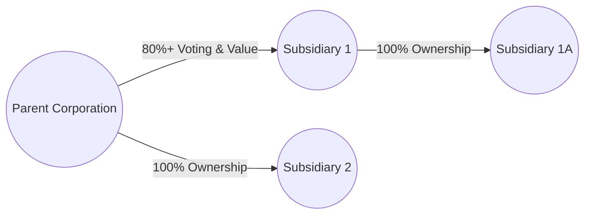

## 9.1 Affiliated Groups, Membership & Filing Requirements

An affiliated group of corporations can elect to file a consolidated tax return, enabling its members to potentially optimize their federal tax obligations through net operating loss offsets, efficient use of credits, and simplification of intercompany transactions. However, the rules governing who can join and remain in the affiliated group are nuanced, especially regarding ownership thresholds, group membership, filing responsibilities, and partial-year acquisitions. This section provides an in-depth exploration of the prerequisites for forming an affiliated group, the intricacies of filing consolidated returns, and the considerations surrounding mid-year acquisitions that lead to short tax years.

This material builds on foundational corporate tax concepts introduced in Chapters 8 and 10. Those chapters delve into C corporation taxation (§8.1 Corporate Income Computation & Special Deductions) and S corporations (§10.1 Eligibility Requirements, Elections & Terminations). In conjunction with the advanced principles in §9.2 (Intercompany Eliminations & Deferred Gains) and §9.3 (SRLY Rules), understanding affiliated groups and filing requirements positions you to apply these consolidated return principles effectively on both the CPA exam and in real-world tax practice.

---

### Understanding the Affiliated Group Concept

An “affiliated group” in U.S. tax law generally refers to a collection of corporations connected through common ownership that are eligible to file a consolidated federal income tax return. The Internal Revenue Code (IRC), specifically §1504, provides the framework for determining whether corporations are sufficiently related to constitute a parent-subsidiary controlled group. Recognizing the criteria that bind these entities together is essential:

• Ownership Threshold: The most fundamental requirement is that the parent corporation owns at least 80% of the total voting power and 80% of the total value of each subsidiary. This requirement aims to ensure that the entities’ financial and operational decisions remain under the control of the parent.

• Inclusion of Brother-Sister Entities: In general, for consolidated returns, you look for parent-subsidiary ties rather than brother-sister arrangements. A “brother-sister group” (where the same small group of shareholders own multiple corporations) often cannot form a single consolidated return unless there is a formal parent entity that meets the ownership test with each subsidiary it includes.

• Indirect Ownership: Ownership may be held directly or indirectly through intermediate subsidiaries. For instance, if Parent (P) owns 100% of Sub1 and Sub1 owns 100% of Sub2, both Sub1 and Sub2 are included in the affiliated group (assuming Sub1 meets the 80% threshold in Sub2).

• Domestic Corporations: Generally, only U.S. domestic corporations (organized under U.S. laws) are eligible members of the group. Foreign corporations, S corporations, REITs, RICs (regulated investment companies), and certain other specialized entities are typically barred from joining an affiliated group in a consolidated return.

The main legal advantage to forming an affiliated group is the ability to make a “consolidated return election,” which can simplify the group’s tax reporting obligations and allow credits and deductions to offset the overall group’s taxable income.

---

### Parent-Subsidiary Control Requirements

The parent-subsidiary control relationship lies at the heart of the affiliated group definition. The ownership test requires the parent to hold at least 80% of both:

1. The total voting power of all classes of stock entitled to vote.  
2. The total value of all outstanding stock (often measured by fair market value).

Often referred to as the “80/80 test,” this requirement ensures that the parent exerts significant financial and governance control over its subsidiaries. The use of value (rather than merely voting stock) aims to prevent structuring that could transfer economic benefits outside of the controlling entity. For instance, if a parent corporation sets up a preferred stock class for outside investors that holds significant value, it could violate the 80% value threshold even when the parent retains 100% of the voting shares.

#### Example of Ownership Threshold

Suppose ParentCo holds 95% of the common voting stock in SubCo, while an unrelated investor group holds a nonvoting preferred class that represents 30% of SubCo’s total fair market value. In this scenario, ParentCo surpasses the 80% threshold for voting control but fails the 80% threshold for total value. As a result, ParentCo and SubCo do not constitute an affiliated group, and SubCo cannot be included in ParentCo’s consolidated return.

---

### Eligibility to File Consolidated Returns

Qualifying to form an affiliated group is the first step, but there are tangible requirements for actually filing the consolidated return:

• Filing Election: The group must formally elect to file a consolidated return by attaching Form 1122 (Authorization and Consent of Subsidiary Corporation To Be Included in a Consolidated Income Tax Return) from each eligible subsidiary to the group’s initial consolidated return.  
• Common Tax Year: Typically, the group must use the parent’s tax year for all members. Any subsidiary that files a separate return or has a different year-end must conform to the parent’s reporting period (with some short-period exceptions in the initial year of consolidation).  
• Consistent Accounting Methods: Each corporation in the group must use consistent accounting methods. If different methods exist, adjustments or method changes may be required to align with the parent’s (or the consolidated group’s) approach.  
• Single Return, Unified Liability: A single Form 1120 (U.S. Corporation Income Tax Return) is filed for the entire group. Each member remains jointly and severally liable for any taxes due, including any deficiencies or interest/penalties that arise.

The election generally remains in effect until it is terminated or there is a significant membership change that prevents the group from meeting the affiliated threshold. If a group elects to discontinue filing a consolidated return, there are rules governing how and when they can re-elect consolidation in the future.

---

### Organizational Diagram of a Simplified Affiliated Group

Below is a Mermaid diagram demonstrating a parent-subsidiary structure that meets the 80/80 requirement. The parent owns more than 80% of both the voting power and total value in each subsidiary, directly or indirectly.

In this structure:  
• Parent directly holds at least 80% of Subsidiary 1, satisfying the affiliated group standard.  
• Parent wholly owns Subsidiary 2 (80% requirement is certainly met at 100%).  
• Subsidiary 1 wholly owns Subsidiary 1A. Through indirect ownership, the parent is considered to own 100% of Subsidiary 1A. Therefore, Subsidiary 1A is also a member of the overall affiliated group.

---

### Filing Requirements and Considerations

Key aspects of filing a consolidated return in practice:

**Single Filing Entity**  
All members of the group collectively file Form 1120 under the parent’s name and Employer Identification Number (EIN). Each subsidiary provides consent via Form 1122 in the first year of consolidation, and subsequent membership changes (acquisitions of new subsidiaries meeting the 80% threshold) require updates to the group’s membership.

**Consolidated Taxable Income**  
The group’s consolidated taxable income is generally determined by aggregating each member’s separate taxable income (or loss) and then making specific adjustments required by the consolidated return regulations (e.g., eliminating intercompany transactions, adjusting for inventory, depreciation, or intangible expenses). A key benefit is that losses from one member can offset income from another, reducing overall tax liability if properly managed.

**Credits and Deductions**  
For credits like the foreign tax credit or general business credits, the consolidated rules apply to blend the credits across the group. Similar blending occurs with net operating losses (NOLs). This synergy is very valuable, but it also comes with complexities relating to separate return limitation year (SRLY) rules, which we explore in Chapter 9.3.

**Joint and Several Liability**  
An important legal consideration for prospective members is that each corporation in the consolidated group is jointly and severally liable for the group’s federal income tax. Should one member default on its share, the IRS can seek payment from any other corporation in the group.

---

### Partial-Year Acquisitions and Short Periods

One of the most intricate aspects of affiliated groups for CPA candidates is how to handle partial-year acquisitions. When a parent acquires control of a subsidiary mid-year, several complexities arise:

**Short-Period Return Requirement**  
If a subsidiary is acquired (and thus joins the consolidated group) on any day other than the first day of its tax year, the subsidiary generally files a separate return (or is included in another consolidated return, if up until that point it was part of a different consolidated group) up to the day before acquisition. From the acquisition date onward, the subsidiary becomes part of the new consolidated group, effectively starting a “short tax year” within the group’s year.

#### Example: Mid-Year Acquisition

• Parent Corporation (calendar-year filer) acquires 85% of TargetCo’s stock on June 30.  
• TargetCo was a standalone calendar-year filer up to June 30. TargetCo will file a separate short-period return for January 1 through June 29.  
• From June 30 through December 31, TargetCo’s results (income, deductions, credits) are included in the consolidated return filed by Parent.

**Allocation of Income and Deductions**  
Typically, income and expenses are allocated proportionately among the short periods, unless a more specific assignment is warranted (for example, if a major capital transaction occurred on an identifiable date). This may require significant bookkeeping work to accurately align the subsidiary’s books with the group’s consolidated reporting periods.

**Consistency of Accounting Method**  
Upon joining the consolidated group, the acquired entity may have to conform to the parent’s accounting methods or elect to change its method if mandated by the consolidated return regulations. This can require the subsidiary to file Form 3115 (Application for Change in Accounting Method) if the shift to a new method is considered a voluntary or mandated change.

---

### Real-World Scenario

Imagine a large manufacturing conglomerate acquiring a smaller specialty parts company in the middle of the year. The specialty parts firm has different inventory costing methods (e.g., LIFO vs. FIFO), depreciation conventions, and even a specialized approach to intangible asset amortization. Once acquired, the smaller company will have to align its accounting approach with the parent’s for consolidated reporting. This short-year transition can create an intricate puzzle where tax professionals must track (1) the final separate short-period return, (2) the new set of consolidated returns from acquisition date onward, and (3) any one-time impacts or timing differences due to changes in accounting methods.

---

### Practical Examples of Tax Reporting Implications

1. **Offsetting Losses:** If the newly acquired subsidiary has significant net operating losses (NOLs) generated in the post-acquisition period, these losses can offset the parent’s income, reducing the consolidated group’s overall tax liability. However, pre-acquisition losses might be subject to SRLY limitations (details in Chapter 9.3).

2. **Timing of Acquisition:** The exact date of acquisition can significantly affect overall tax liability. For instance, if the subsidiary is highly profitable, acquiring it just before a major earnings season might mean higher consolidated taxable income. Conversely, if the subsidiary is experiencing a downturn, acquiring it earlier in the year may allow the parent to leverage losses or capital expenditures quickly.

3. **Reporting Intragroup Transactions:** If, before acquisition, the subsidiary had significant transactions with the parent, some of these transactions may now be considered intercompany for the latter part of the year and require elimination under consolidated return regulations (see Chapter 9.2 on intercompany eliminations). Additionally, advanced consolidated return rules address deferred gains on assets sold among members, further complicating partial-year acquisitions.

---

### Common Pitfalls and Best Practices

**Pitfalls**  
• **Failure to File a Timely Election:** Overlooking the proper Form 1122 filings or missing the window to elect consolidation can lead to missed benefits or potential IRS penalties.  
• **Inaccurate Ownership Threshold Calculation:** Failing to account for indirect ownership or ignoring the value test can result in including a subsidiary that is not truly an eligible member, leading to incorrect returns.  
• **Neglecting State/Local Requirements:** Some states do not follow federal consolidated return regulations, or they have unique combined or consolidated filings. Overlooking these differences can result in errors or underpayments at the state level.  
• **Short-Year Tax Return Oversight:** Acquisitions often require a short-year return prior to the subsidiary’s inclusion in the consolidated group. Missing or incorrectly preparing that short-year filing is a frequent error.

**Best Practices**  
• **Early Coordination Among Tax, Audit, and Legal Teams:** Ensuring that all relevant departments collaborate can identify ownership or compliance red flags early.  
• **Robust Tracking of Intercompany Transactions:** Implement thorough recordkeeping so that any sales, loans, or other interactions between members are readily identifiable and systematically eliminated when preparing the consolidated return.  
• **Periodic Review of Ownership Structure:** Corporations often undergo reorganizations, spin-offs, or expansions. Regularly verify that you still meet the 80/80 requirement and remain in compliance.  
• **Proper Maintenance of Subsidiary Basis Calculations:** The parent’s basis in the subsidiary’s stock is adjusted for dividends, contributions, and various consolidated adjustments. A meticulously maintained basis schedule helps avoid big surprises on dispositions or reorganizations.

---

### Case Study: Multi-Tiered Acquisition

Suppose a diversified holding company, HD Holdings, seeks to expand into the healthcare sector by acquiring a controlling stake in two separate corporations: MediManufacturing, Inc. and PharmaLogistics, Inc.

• **Step 1: HD acquires 85% of MediManufacturing on March 1.** MediManufacturing files a short-period return from January 1 to February 28. From March 1 onward, MediManufacturing’s income and expenses become part of HD’s consolidated return.  
• **Step 2: MediManufacturing itself owns 90% of a newly formed subsidiary, MediResearch, which began operating in April.** Because MediManufacturing meets the 80/80 threshold in MediResearch, MediResearch automatically joins the consolidated group on its formation (or from the time MediManufacturing acquired it if that was a short period scenario).  
• **Step 3: HD acquires 82% of PharmaLogistics on September 1.** PharmaLogistics similarly closes its separate books on August 31 and files a short-year return. From September 1 to December 31, PharmaLogistics is part of the HD Holdings consolidated return.  
• **Result:** HD Holdings must correctly prepare three short-period returns (MediManufacturing’s partial-year, and PharmaLogistics’ partial-year, plus any pre-formation short returns for MediResearch if relevant) and then integrate the subsidiaries into the consolidated group for the remainder of the tax year.

This scenario highlights the challenges involved in partial-year acquisitions across multiple corporate entities, each requiring separate short-period returns. The complexity escalates when each subsidiary employs different methods of accounting, has substantial differences in inventory costing, or carries pre-existing NOLs. Thorough planning and precise recordkeeping are key to compliance and tax optimization.

---

### Diagrams to Visualize Partial-Year Acquisition Timeline

Below is a simplified timeline diagram using Mermaid notation to illustrate the short-year concept for a calendar-year filer (Parent Inc.) acquiring Sub Co. on April 15.

• Sub Co. operates independently from January 1 through April 14 (short separate return).  
• Once Parent acquires Sub Co. on April 15, Sub Co. becomes part of the consolidated tax group.  
• Sub Co. is included in the consolidated return from April 15 through December 31.

---

### Key Exam Tips

• **Master the 80/80 Rule:** The ability to recite and apply the 80% voting and 80% value test in example exam scenarios is crucial.  
• **Watch Out for Non-Qualifying Entities:** S corporations, REITs, RICs, and some foreign corporations cannot join a consolidated group, which can appear in tricky multiple-choice questions.  
• **Short Period Nuances:** Understand the difference between a short-year filing triggered by a mid-year acquisition (separate short-year return followed by consolidation) versus a short-year filing triggered by a change in accounting period or business reorganization.  
• **Ownership Changes in the Exam:** Be prepared to track the subsidiary’s eligibility from the acquisition date or the date at which the 80% threshold was met. Hypothetical exam scenarios often test your comprehension of partial-year computations, NOL usage, and interest expense allocations.  
• **Consolidated NOLs:** Familiarize yourself with the interplay of consolidated NOL rules, particularly if a newly acquired subsidiary has significant NOL carryovers subject to SRLY restrictions (discussed in Chapter 9.3).

---

### References for Further Exploration

• **IRS Publication 542** (Corporations) – Provides fundamental information on corporate entities, including consolidated return insights.  
• **Treasury Regulations under §1.1502** – The narrow details of consolidated return mechanics.  
• **Chapter 9.2** (Intercompany Eliminations & Deferred Gains) and **9.3** (SRLY Rules & NOL Interactions) in this text – For a deeper dive into advanced consolidated return mechanics.  
• **AICPA Online Resources** and **AICPA Code of Professional Conduct** – For ethical considerations and professional guidance in corporate tax engagements.  

---

## Test Your Knowledge: Affiliated Groups & Consolidated Filing Requirements Quiz



### Which of the following thresholds must be met for a parent-subsidiary group to qualify as an affiliated group?

- [x] At least 80% voting power and 80% total value.
- [ ] 51% voting power and 75% total value.
- [ ] 90% voting power and 100% total value.
- [ ] Majority voting power only.

> **Explanation:** IRC §1504 requires that for consolidated filing, the parent must own at least 80% of both the total voting power and the total value of the subsidiary’s outstanding stock.

### Which form is used to secure each subsidiary’s consent to be part of a consolidated tax return?

- [ ] Form 1120
- [x] Form 1122
- [ ] Form 1065
- [ ] Form 2553

> **Explanation:** Each subsidiary must attach Form 1122 (Authorization and Consent of Subsidiary Corporation) to the parent’s consolidated return, formalizing its participation in the consolidated group.

### In a mid-year acquisition, which of the following typically results for the newly acquired subsidiary?

- [x] A short-year return is filed for the pre-acquisition period, then it joins the consolidated group from acquisition date onward.
- [ ] There is no requirement to file a separate short-year return.
- [ ] Annual reporting remains the same, with a single tax return covering the entire year.
- [ ] The new subsidiary must remain a standalone filer until the following year.

> **Explanation:** The newly acquired subsidiary generally files a short-year return for the period prior to the acquisition date and is consolidated with the parent for the remainder of the parent’s tax year.

### Under consolidated return rules, which statement is correct regarding joint and several liability?

- [x] Each member of the group is jointly and severally liable for the group’s overall tax, including interest and penalties.
- [ ] Only the parent corporation is liable for the tax obligations of the entire group.
- [ ] Liability is limited to each subsidiary’s share of taxable income.
- [ ] Subsidiaries in a consolidated group have no direct tax liability.

> **Explanation:** By electing to file a consolidated return, all members accept joint and several liability for the tax, interest, and penalties owed.

### Which of the following entities is typically not eligible to join an affiliated group for a consolidated return?

- [x] Foreign corporations not organized in the U.S.
- [ ] Domestic C corporation
- [x] S corporation
- [ ] Wholly owned domestic subsidiary

> **Explanation:** In general, only domestic C corporations can be included in a consolidated return. S corporations and foreign corporations do not meet the eligibility criteria, subject to certain limited exceptions.

### What is a primary advantage of filing a consolidated return?

- [x] Losses from one member may offset income from another member.
- [ ] It allows deferral of all state and local taxes indefinitely.
- [ ] It removes the requirement to disclose intercompany transactions.
- [ ] It automatically excludes the group from AMT obligations.

> **Explanation:** A key benefit is that the losses of one group member can be used to offset the profitability of another group member, potentially reducing overall federal tax liability.

### When can a new member of a consolidated group adopt a different tax year than the parent?

- [x] Generally never; the consolidated group must share the same tax year as the parent.
- [ ] Whenever it chooses, without restrictions.
- [ ] Only if it was formed after January 1, 2019.
- [ ] Only if it files Form 2553.

> **Explanation:** All members of a consolidated group must conform to the parent’s tax year, subject to transitional/short-period rules for newly acquired or formed subsidiaries.

### In the context of partial-year acquisitions, which is the correct approach to allocate income and expenses?

- [x] Apportion based on the actual results pre- and post-acquisition date.
- [ ] Estimate based on prior year financial statements.
- [ ] Ignore any income or expenses prior to acquisition, as they are deemed immaterial.
- [ ] Combine the subsidiary’s entire year of results with the parent’s consolidated return.

> **Explanation:** The subsidiary generally files a short-year return for the pre-acquisition period and is included in the consolidated results post-acquisition. Allocations must reflect actual operations during each period.

### How do the consolidated return regulations treat intercompany transactions between group members?

- [x] They are eliminated or deferred to accurately reflect the group’s external transactions.
- [ ] They remain fully deductible, even if never recognized by outside parties.
- [ ] They are reported twice: once by the seller and once by the purchaser.
- [ ] They automatically convert into capital contributions.

> **Explanation:** Consolidated return regulations require elimination or deferral of intercompany transactions to avoid double-counting and to reflect only external transactions in the group’s taxable income.

### True or False: Each member of a consolidated group must separately file Form 1120 to report its individual share of taxable income.

- [x] True
- [ ] False

> **Explanation:** While the group files a single consolidated Form 1120, each member typically prepares a pro forma Form 1120 to compute its separate taxable income. These calculations then roll up into the consolidated return.



---

## For Additional Practice and Deeper Preparation

**[TCP CPA Hardest Mock Exams: In-Depth & Clear Explanations](https://www.udemy.com/course/tcp-cpa-mock-exams/?referralCode=675149871D0E79B1699C)**  

**Tax Compliance & Planning (TCP) CPA Mocks:** 6 Full (1,500 Qs), Harder Than Real! In-Depth & Clear. Crush With Confidence!  

- Tackle full-length mock exams designed to mirror real TCP questions.  
- Refine your exam-day strategies with detailed, step-by-step solutions for every scenario.  
- Explore in-depth rationales that reinforce higher-level concepts, giving you an edge on test day.  
- Boost confidence and minimize anxiety by mastering every corner of the TCP blueprint.  
- Perfect for those seeking exceptionally hard mocks and real-world readiness.  

_Disclaimer: This course is not endorsed by or affiliated with the AICPA, NASBA, or any official CPA Examination authority. All content is for educational and preparatory purposes only._
