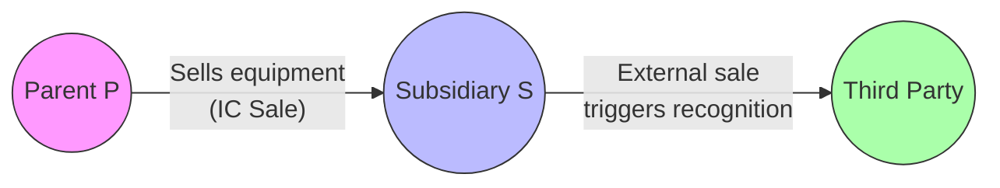

## 9.2 Intercompany Eliminations & Deferred Gains

In a consolidated tax return environment, intercompany transactions can significantly impact how income, expenses, and gains are recognized at the group level. Precisely navigating intercompany eliminations and deferred gains is key for preventing artificial inflation of gross income, avoiding duplicated deductions, and ensuring that profits and losses accurately reflect the economic reality of the group. 

Tax professionals must thoroughly understand and implement the various regulations governing these transactions—commonly found in the U.S. Treasury Regulations under IRC §1502 and subsequent sections. This section explains how to identify, eliminate, and appropriately defer gains resulting from intercompany transactions such as sales, service fees, and dividend distributions. Additionally, we will delve into the final tax effect on consolidated statements, providing practical examples and step-by-step approaches to ensure proper compliance.

-------------------------------------------------------------------------------
### Overview of Intercompany Transactions

Intercompany transactions involve exchanges of goods, services, or capital between members of the same consolidated group. Since the separate entities are commonly controlled, transactions may not reflect the same economic substance as comparable dealings with unrelated parties. Common intercompany transactions include:

• Intercompany sales of inventory or fixed assets.  
• Intercompany dividends paid from one member to another.  
• Management fees or service charges between group members.  
• Interest on intercompany loans.  

Consolidated returns require that certain intercompany transactions be eliminated or modified for tax purposes, so that items of income and expense do not overstate or understate group-level results. Essentially, the consolidated return attempts to simulate how the group would appear if it were a single economic enterprise.

-------------------------------------------------------------------------------
### General Rules Governing Consolidated Returns

The principal objective of consolidated return rules is to ensure that income from transactions internal to the group is not recognized prematurely or artificially. Key regulatory references for intercompany transactions and deferred gains include:

• Treas. Reg. §1.1502-13: Outlines treatment of intercompany transactions.  
• Treas. Reg. §1.1502-14: Addresses intercompany dividends.  
• Treas. Reg. §1.1502-19: Pertains to excess loss accounts.  
• IRC §§1501-1504: Provide definitions and requirements for consolidated group eligibility.  

Under these regulations, transactions between members of the consolidated group must be accounted for differently from transactions with external parties. Gains or losses arising from internal transactions often require deferral until the property leaves the consolidated group, or a triggering event such as liquidation or distribution to an external shareholder occurs.

-------------------------------------------------------------------------------
### Why Eliminate and Defer?  
Consolidated eliminations and deferrals exist primarily to:

• Prevent double counting of income within the group.  
• Avoid duplicating deductions that would artificially reduce taxable income.  
• Postpone (or disallow) recognition of gains on internal transfers until they are realized outside the group.  

Without intercompany elimination and deferral rules, a sale of property from one subsidiary to another could inflate the group’s taxable income or create artificial losses, distorting the true economic outcome. By removing the transaction (or deferring certain portions of it), the consolidated return better aligns with the economic reality.

-------------------------------------------------------------------------------
### Key Concepts and Definitions

Before diving into specific eliminations, it’s vital to understand certain terms in the context of consolidated returns:

• Intercompany Transaction: A transaction directly or indirectly between members of the same consolidated group.  
• Selling Member (S): The member that recognizes income or loss on its separate return upon transferring goods or property to an affiliated party (the “buyer member”).  
• Buyer Member (B): The member receiving property or services from another member within the group.  
• Matching and Acceleration Rules: Mechanisms within Treas. Reg. §1.1502-13 that dictate when intercompany income, deductions, and gains are recognized for consolidated return purposes.  
• Deferred Gain: The portion of the profit from an intercompany sale or other transaction that is not recognized immediately in the consolidated group’s taxable income and is “deferred” until a triggering event.  

-------------------------------------------------------------------------------
### Eliminating Intercompany Sales

#### 1. Conceptual Background
Intercompany sales commonly arise when one subsidiary sells inventory or fixed assets to another subsidiary. For example, if Subsidiary A (S) sells inventory to Subsidiary B (B), the transaction might appear on the financial statements of both entities. However, for consolidation purposes, this internal sale generally must be removed or “eliminated” to prevent overstating consolidated revenue and cost of goods sold.

The typical result is:  
• S defers recognition of the gain until B sells the inventory to an outside party.  
• B’s cost basis may differ from the price paid to S for consolidated return purposes, because that internal markup is typically deferred.  

#### 2. Step-by-Step Elimination Process

Below is a simplified example illustrating the step-by-step elimination of intercompany sales of inventory.

1. Identify the Intercompany Transaction:  
   Subsidiary A (S) transfers inventory to Subsidiary B (B) for $200,000, which includes a $50,000 gross profit.  

2. Record the Transaction Separately:  
   On S’s separate books, revenue of $200,000 is recognized, and cost of goods sold is $150,000, producing $50,000 in gross profit. On B’s books, inventory is initially reflected at $200,000.  

3. Eliminate the Sale in Consolidation:  
   Remove S’s $200,000 sale and B’s $200,000 purchase to avoid inflating group-level revenue.  

4. Defer the Profit:  
   Defer S’s $50,000 profit in consolidated schedules until B sells the inventory to a third party. At that future time, any gain or loss is recognized by the consolidated group (depending on the ultimate sale price to the external customer).  

#### 3. Basis Adjustments and Future Recognition
When B later sells the inventory to an unrelated party for (say) $250,000, B’s recognized gain or profit effectively includes the previously deferred $50,000. The actual timing of the recognized gain for consolidated purposes will depend on the matching rule under Treas. Reg. §1.1502-13. 

A simplified timeline approach to the above example:

• Time 1 (Intercompany Sale): S records $50,000 gain, but for consolidated purposes, that gain is deferred.  
• Time 2 (External Sale): The previously deferred $50,000 gain becomes recognizable by the group.  

-------------------------------------------------------------------------------
### Intercompany Dividends

Dividends paid by one member of a consolidated group to another typically do not create taxable income at the consolidated level. Under Treas. Reg. §1.1502-14, intercompany dividends may be eliminated from consolidated taxable income, except as modified by certain provisions (e.g., previously taxed earnings and profits considerations, or certain timing rules). 

1. **Dividends Between Members**  
   When a subsidiary pays a dividend to its parent corporation (or to a sister subsidiary), such dividend is generally excluded from the consolidated group’s income. To illustrate:

   • Subsidiary pays a $100,000 dividend to the Parent.  
   • Parent’s separate income statement might reflect $100,000 dividend income.  
   • The subsidiary’s separate income statement has a $100,000 distribution.  
   • On consolidation, that $100,000 is eliminated (not recognized as consolidated income).  

2. **Earnings and Profits Adjustments**  
   Although the dividend itself may be eliminated for consolidated income purposes, it still affects the subsidiary’s and the parent’s Earnings and Profits (E&P) calculations. This detail can matter when analyzing the group’s capacity for certain dividend distributions, stock redemptions, or future tax planning.  

3. **Special Cases**  
   If the dividend is from previously untaxed earnings (e.g. in certain reorganizations or acquisitions), partial limitations or timing differences may apply. The general principle, however, is that the economic effect of paying dividends within the group doesn’t create additional consolidated income.

-------------------------------------------------------------------------------
### Intercompany Service Fees and Management Charges

Almost all large corporate structures have centralized services—such as administrative, IT, or legal—that charge out costs to related subsidiaries. For consolidated tax return purposes, these intercompany service fees might appear as income on one subsidiary’s books and expense on another’s. 

1. **Basic Elimination Requirement**  
   Similar to the elimination of intercompany sales, the service fee income and the corresponding expense are eliminated as they do not represent an arm’s-length, third-party transaction.  
2. **Indirect Cost Allocations**  
   Though the top-level elimination is usually straightforward, complexities arise when part of such fees must be capitalized (e.g., costs required to be allocated to inventory under IRC §263A). The timing and treatment of these costs can differ at the separate entity level vs. the consolidated level.  
3. **Transfer Pricing Considerations**  
   In multinational groups, the concept of transfer pricing ensures fees reflect an arm’s-length standard. For purely domestic consolidated groups, these fees still need to reflect a reasonable allocation of actual costs, consistent with indirect cost rules at the tax level.

-------------------------------------------------------------------------------
### Deferred Gains and Triggering Events

When gains on intercompany sales are deferred, they remain “suspended” until a triggering event occurs. Common triggering events include:

• A subsequent sale to an unrelated external party.  
• The buyer member leaving the consolidated group (e.g., subsidiary is sold or spun off).  
• Distribution of the property outside the consolidated group.  
• Liquidation or dissolution of the subsidiary that holds the property.  

At that point, the deferred gain (or portion thereof) is recognized in the group’s consolidated income for the tax year in which the triggering event occurs. 

-------------------------------------------------------------------------------
### Practical Example: Intercompany Sale with Deferred Gain

Consider a scenario in which a parent company (P) sells manufacturing equipment to its subsidiary (S):

• Original Cost (P’s basis): $500,000  
• Depreciated basis at time of sale: $300,000  
• Sale price to S: $400,000  
• Gain recognized on separate return of P: $100,000  

For consolidated tax purposes:  
1. **Eliminate the $400,000 Intercompany Sale**  
   P’s recognized $100,000 gain is deferred.  
2. **Adjust S’s Basis**  
   Pending final regulations on method of basis adjustment, S’s basis in the equipment for consolidated tax purposes is effectively its carryover basis or a partially adjusted basis that removes some or all of the intercompany markup.  
3. **Depreciation Implications**  
   Depreciation must be computed on the $300,000 carryover basis, rather than the $400,000 purchase price, to avoid artificially accelerating depreciation deductions within the group.  
4. **Subsequent External Sale**  
   When S later sells the equipment to an external party for, say, $350,000, it might appear that S has a $50,000 loss. However, for consolidated purposes, a portion of the $100,000 previously deferred gain from P is recognized, offsetting S’s recognized loss.  

This example highlights how the group effectively recaptures the gain or loss at the point of external disposition.

-------------------------------------------------------------------------------
### Illustration Using a Mermaid Diagram

Below is a simple diagram illustrating the flow of an intercompany sale (IC Sale) and subsequent external sale:



• P sells equipment to S at an internal markup.  
• The intercompany profit is deferred.  
• When S sells externally to C, the deferral is lifted, and the group recognizes any remaining gain or loss.

-------------------------------------------------------------------------------
### Tax Effect on Consolidated Statements

After performing all applicable intercompany eliminations:

• **Consolidated Income Statement**  
  - Sales to outside parties only: Internal sales are eliminated.  
  - Deferred gains do not appear as consolidated gains until a trigger event.  
  - Intercompany service fee revenues and expenses are removed.  
  - Intercompany dividends are eliminated (subject to special rules for regulated investment companies or other exceptions).  

• **Consolidated Balance Sheet**  
  - For property transferred internally, basis adjustments reflect deferral of gains. The group’s total assets and liabilities accurately represent external transactions.  

• **Deferred Income Tax Assets and Liabilities**  
  - Intercompany transactions can create or reverse certain timing differences. For instance, if a deferred gain is recognized in a future period, the group’s temporary differences must accurately reflect the re-timing of revenue recognition.

-------------------------------------------------------------------------------
### Best Practices and Common Pitfalls

1. **Identify All Potential Intercompany Transactions**  
   Thorough record-keeping and intercompany invoices are crucial for a complete view. Any transaction that potentially crosses entity lines within the group should be flagged for elimination.  

2. **Maintain Clear Supporting Schedules**  
   Because intercompany transactions can occur frequently, it’s important to maintain routine schedules that track inventory flows, services rendered, and any associated profits or markups.  

3. **Stay Attuned to Triggering Events**  
   A well-documented process helps ensure the group recognizes deferred gains at the correct time (when property is disposed of to an external party or another triggering event occurs).  

4. **Monitor State Tax Implications**  
   Not all states adopt federal consolidated return regulations or may require separate returns. In such cases, intercompany eliminations for federal purposes do not necessarily replicate at the state level, leading to more complex tax positions.  

5. **Consistent Application of Transfer Pricing Policies**  
   Even domestically, the IRS can challenge artificially low or high transfer prices. Intercompany transactions should reflect the true share of costs and profits in an arm’s-length manner.  

6. **Avoid Double Counting**  
   Missing a single intercompany charge can create inaccurate results. Implement review procedures focusing on frequent transaction streams like stock dividends, licensing fees, or management overhead.  

-------------------------------------------------------------------------------
### Strategic Considerations

• **Timing of Gains**: Effectively managing when gains are recognized can help the group optimize taxable income across multiple tax years.  
• **Consolidated Net Operating Losses**: A triggering event might enable the group to offset recognized intercompany gains with existing net operating losses (NOLs). Careful planning can significantly reduce the overall tax burden.  
• **M&A Transactions**: In a merger or acquisition, ensuring that residual intercompany accounts are identified and accounted for can prevent surprising tax liabilities.  

-------------------------------------------------------------------------------
### Case Study: Manufacturer Group with Intercompany Services

**Scenario**  
Midwest Holding Co. (MHC), a parent corporation, has two subsidiaries: MHC Manufacturing (MM) and MHC Distribution (MD). MM produces specialized components and sells them to MD for final assembly and retail sale. MD also receives administrative services from MM’s corporate office (within MHC) and reimburses them via monthly service fees.

**Issue**  
After a year of operations, MHC’s consolidated return must remove the intercompany component sales and service fees. Additionally, MM recognized a gain on the sale of a piece of equipment to MD.

**Process**  
1. MHC’s tax department identifies monthly intercompany sale transactions where MM recognized $10M in revenue with a $2M markup.  
2. MD recorded $10M in cost of goods sold, building up inventory that remains partially unsold at year-end.  
3. The $2M markup is deferred in the consolidated return until MD sells the final product to external customers. The portion of MD’s inventory that remains unsold at year-end has not triggered recognition of the deferred gain.  
4. MHC’s corporate office charged $500,000 to MD under a service agreement. For consolidated purposes, the $500,000 expense (MD) and $500,000 income (MHC) are eliminated.  
5. The equipment sold from MM to MD generated a $200,000 gain for MM, which is deferred until MD disposes of the equipment outside the group.

**Result**  
MHC’s consolidated return reflects only the revenue earned from external customers, properly excludes the intercompany service fee net effect, and defers the $200,000 equipment gain. The correct consolidated level margin is recognized in compliance with Treas. Reg. §1.1502-13 and related provisions.

-------------------------------------------------------------------------------
### Diagrams and Flowcharts for Tracking

Using flowcharts or data flow diagrams can help keep tabs on intercompany transfers, especially when multiple transfers occur each accounting period. Below is a representative structure, extended from our simpler mermaid example, highlighting multiple forms of intercompany transactions:

```mermaid
flowchart TB
    P((Parent Corp)) --- S1[Subsidiary 1\n(Manufacturing)]
    P((Parent Corp)) --- S2[Subsidiary 2\n(Distribution)]
    S1 -- Sells Components \n (Intercompany) --> S2
    S1 -- Provides Admin \n & Mgt Services --> P
    S2 -- Pays Dividends --> P

    style P fill:#f9f,stroke:#333,stroke-width:1px
    style S1 fill:#bbf,stroke:#333,stroke-width:1px
    style S2 fill:#bbf,stroke:#333,stroke-width:1px
```

-------------------------------------------------------------------------------
### References for Further Exploration

• Treas. Reg. §§1.1502-13, 1.1502-14, and 1.1502-19.  
• Internal Revenue Code §§1501-1504.  
• Bittker & Eustice, “Federal Income Taxation of Corporations and Shareholders.”  
• AICPA resources on consolidated returns and advanced corporate taxation.  
• IRS publications and rulings pertaining to consolidated group regulations.

These regulations and professional publications bolster a deep understanding of the intricacies involved in intercompany eliminations and the deferral of gains. Continuous study of new rulings, court cases, and IRS guidance is recommended since consolidated return regulations are complex and subject to amendment.

-------------------------------------------------------------------------------
### Conclusion

Intercompany eliminations and deferred gains are foundational principles for any tax professional working with consolidated returns. By removing internal revenues and expenses—along with deferring gains until a meaningful triggering event—groups can present a more accurate picture to the IRS, correctly measuring taxable income derived from external, arms-length transactions. 

In practice, tracking these transactions and properly applying deferral rules require a methodical approach, robust record-keeping, and consistent application of regulations. Mastery of these skills helps CPAs provide accurate, compliant, and beneficial filings, minimizing the risk of audits or adjustments.  

Whether dealing with everyday transactions such as management services and internal sales or addressing major reorganizations and M&A events, the standard remains the same: to eliminate or defer intercompany profits until they are substantively realized with external parties in accordance with the law.

--------------------------------------------------------------------------------

## Mastering Intercompany Eliminations & Deferred Gains in Consolidated Returns



### Which of the following best describes the primary purpose of eliminating intercompany transactions in a consolidated return?

- [ ] To accelerate tax deductions.
- [ ] To avoid having to file multiple state returns.
- [x] To prevent double-counting revenues and expenses within the group.
- [ ] To allow subsidiaries to recognize income faster.

> **Explanation:** The main purpose of elimination is to ensure that intercompany revenues and expenses do not overstate or understate the group’s true taxable income.

### What happens to the profit in an intercompany sale of inventory at the time of the sale, under consolidated return rules?

- [ ] It is recognized immediately by the selling subsidiary for consolidated return purposes.
- [ ] It is partially excluded and partially recognized.
- [x] It is deferred until the inventory is sold to an outside customer or another triggering event occurs.
- [ ] It is recognized as a capital gain.

> **Explanation:** Intercompany profit on inventory sales is typically deferred; only upon an external sale or another triggering event is the profit recognized in the consolidated group’s income.

### Under Treas. Reg. §1.1502-13, how is an intercompany dividend generally treated on the consolidated return?

- [ ] It is subject to a 70% dividends-received deduction only.
- [ ] It must be fully recognized as taxable income.
- [ ] It is recognized as a capital gain.
- [x] It is eliminated from consolidated taxable income.

> **Explanation:** Most intercompany dividends are eliminated in the consolidated return to prevent artificial duplication of income within the group.

### In a case where a parent corporation sells a piece of machinery to its subsidiary at a gain, how is the subsidiary’s basis in that asset typically determined for consolidated return purposes?

- [ ] It is always stepped up to the intercompany sales price.
- [ ] It is always decreased below the parent’s original basis.
- [x] It is generally based on the parent’s carryover basis, with the intercompany gain deferred until a triggering event.
- [ ] It is determined based solely on fair market value.

> **Explanation:** For consolidated return rules, the asset’s basis is not simply the internal sales price; the intercompany gain is deferred until a triggering event, so the subsidiary often (in concept) carries a cost basis which does not reflect the intercompany markup.

### Which of the following scenarios would typically trigger the recognition of previously deferred intercompany gain?

- [x] The buyer subsidiary sells the property to an unrelated third party.
- [ ] The parent company refinances external debt.
- [x] The subsidiary paying an intercompany service fee.
- [ ] The subsidiary continues using the asset internally for multiple years without external transactions.

> **Explanation:** A key triggering event for deferred gains is an external sale—as soon as the property leaves the consolidated group or is sold to third parties, the previously deferred gain is recognized. Simply continuing to hold and use the asset internally does not trigger recognition.

### How are intercompany service fees treated on a consolidated tax return?

- [ ] They are recognized as ordinary income for the receiving entity and not eliminated.
- [ ] They are recognized as tax-exempt income.
- [x] They are eliminated, so that consolidated income reflects only external transactions.
- [ ] They are considered passive income.

> **Explanation:** Similar to intercompany sales, service fees are eliminated to ensure that internal transactions do not artificially inflate overall group income and expenses.

### Besides deferring gains, what is another major reason for intercompany eliminations?

- [ ] Increasing the effective tax rate for the group.
- [x] Removing duplicate revenue or expense items for the group as a whole.
- [ ] Shifting income to low-tax jurisdictions.
- [ ] Preventing subsidiaries from showing separate profits.

> **Explanation:** A primary motivation is preventing duplication of revenue and expense. Internal transactions should not artificially inflate or reduce the consolidated results.

### When a parent company divests itself of a subsidiary that holds property with previously deferred intercompany gain, how is the deferred gain handled?

- [x] It is recognized at the time the subsidiary leaves the group.
- [ ] It is forgiven entirely.
- [ ] It remains deferred indefinitely.
- [ ] It is converted into a capital loss.

> **Explanation:** Disposal or departure of the subsidiary from the consolidated group is typically a triggering event that causes deferred gains to be recognized.

### What is a common pitfall when preparing a consolidated return that involves numerous intercompany transactions?

- [ ] Recording too many intercompany eliminations.
- [ ] Properly capturing external revenue while leaving out internal transactions.
- [x] Failing to identify all intercompany transactions, resulting in double counting of income or expenses.
- [ ] Maintaining too much documentation on each entity’s activities.

> **Explanation:** One of the most frequent mistakes is overlooking certain intercompany activities (like small service fees or reimbursements), leading to an inaccurate consolidated return.

### True or False: State tax returns always follow federal consolidated return rules in eliminating intercompany transactions.

- [x] True
- [ ] False

> **Explanation:** This statement is false. Many states do not conform to federal consolidated return rules and may require separate entity reporting or provide alternative guidelines. Thus, one must analyze state requirements carefully.



--------------------------------------------------------------------------------

## For Additional Practice and Deeper Preparation

**[TCP CPA Hardest Mock Exams: In-Depth & Clear Explanations](https://www.udemy.com/course/tcp-cpa-mock-exams/?referralCode=675149871D0E79B1699C)**  

**Tax Compliance & Planning (TCP) CPA Mocks:** 6 Full (1,500 Qs), Harder Than Real! In-Depth & Clear. Crush With Confidence!  

- Tackle full-length mock exams designed to mirror real TCP questions.  
- Refine your exam-day strategies with detailed, step-by-step solutions for every scenario.  
- Explore in-depth rationales that reinforce higher-level concepts, giving you an edge on test day.  
- Boost confidence and minimize anxiety by mastering every corner of the TCP blueprint.  
- Perfect for those seeking exceptionally hard mocks and real-world readiness.  

_Disclaimer: This course is not endorsed by or affiliated with the AICPA, NASBA, or any official CPA Examination authority. All content is for educational and preparatory purposes only._
