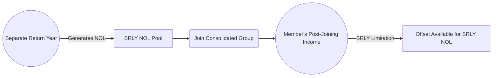

## 9.3 SRLY (Separate Return Limitation Year) Rules & NOL Interactions

The Separate Return Limitation Year (SRLY) rules are a crucial dimension of consolidated return regulations under the Internal Revenue Code (IRC) and Treasury Regulations. They restrict the usage of certain net operating losses (NOLs) within a consolidated group, specifically when those NOLs were generated by a member of the group prior to joining the consolidated filing. Understanding SRLY rules is essential not only to comply with federal tax laws but also to devise effective tax planning strategies for corporations that have undergone acquisitions or reorganizations.  

This section addresses the following key areas:  
• Goals and principles behind SRLY rules  
• Pre-acquisition NOL usage constraints under SRLY regulations  
• Interplay of pre-acquisition losses with consolidated returns  
• Practical illustrations and case studies  
• Potential pitfalls, planning tactics, and best practices  

SRLY rules can be intricate, and each situation may require a deep look into the specifics of §1.1502 of the Treasury Regulations, as well as cross-reference with other chapters in this book, notably those dealing with consolidated return basics (see Section 9.1) and intercompany transactions (see Section 9.2).

--------------------------------------------------------------------------------

### Overview of the SRLY Concept

When a corporation joins a consolidated tax group, the IRS imposes limitations on how that corporation’s existing NOLs—generated in a tax year before it became part of the group—can be used against other group members’ taxable incomes. These rules are designed to prohibit what is often referred to as “trafficking in losses,” meaning a profitable corporation might acquire a company with substantial net operating losses to shelter its own income.  

SRLY rules operate independently from other limitation regimes, such as:  
• Section 382 limits (ownership change rules)  
• Loss disallowance for consolidated-level transactions (see Section 9.2)  
• Certain Built-in Gains (BIG) limitations for S corporations transitioning from C corporation status  

Section 382 limitations can overlap or interact with SRLY restrictions, but the two sets of rules serve distinct purposes. While Section 382 primarily addresses changes in ownership to curb the selling of tax losses, SRLY focuses on the prohibition of using pre-acquisition NOLs to offset income earned by other members in the consolidated group.

--------------------------------------------------------------------------------

### Why SRLY Rules Exist

Before delving into the technical details, it is helpful to restate the core logic behind SRLY rules:

1. Preventing Abuse: SRLY rules aim to prevent the creation of “tax shelters” through simple acquisitions. A profitable corporate group should not be permitted to acquire a dormant or loss-laden entity solely to apply those losses against the group’s positive income in consolidated returns.  

2. Respecting the Separate Return Principle: If a loss was generated while a corporation was outside of the group, the group should only be able to benefit from that loss to the extent that the corporation can show it has contributed to the group’s income.  

3. Aligning Principles between Single-Entity and Consolidated Filings: Corporations that filed separate returns before joining a group must observe certain constraints to ensure that the consolidated return properly reflects the economic reality of individual corporation performance.  

In essence, SRLY rules work by confining losses generated outside the consolidated group’s membership to income generated by that same member for a period after joining. This ensures that NOLs are used only by the corporation that underwent the economic hardship leading to the tax loss.

--------------------------------------------------------------------------------

### Key Points of the SRLY Framework

The SRLY constraints revolve around whether a loss is considered a “SRLY loss.” If it is, then the group’s ability to utilize that loss is restricted until the entity generating the loss has recognized its own income—within the consolidated group context—to absorb the SRLY losses.  

Consider the following major components:  

• SRLY Member: A corporation that generated a loss in a separate return year but is now part of the consolidated group.  
• SRLY Loss: A net operating loss (or other type of tax attribute, such as capital loss or credit) that arises in a year during which the corporation was not part of the consolidated group.  
• SRLY Limitation: The limit that effectively caps the usage of these pre-acquisition losses to the SRLY member’s own post-joining income.  

--------------------------------------------------------------------------------

### Interplay with Consolidated Return Basics

Recall from Section 9.1 that consolidated returns enable affiliated groups to aggregate their incomes and losses into a single tax return. When affiliates file on a consolidated basis, the group’s total tax liability is computed on aggregated items. However, we must respect several rules that ensure equitable outcomes for the IRS and consistency with general tax principles.  

SRLY rules do not prohibit the use of losses entirely; they merely prevent the group from using those losses above the income generated by the specific loss entity. If the acquiring member (or, more precisely, the “loss corporation” that joined the group) continues to operate profitably and generate its own operating income within the group, any unused NOL from its separate return years becomes more valuable over time.

--------------------------------------------------------------------------------

### Types of Losses Affected by SRLY

While the most common reference is to “SRLY NOLs,” the rules also apply to a variety of carryover items that were generated in separate return years and can reduce tax liabilities in subsequent years. The following are examples of attributes potentially subject to SRLY limitations:  

• Net operating losses (NOLs)  
• Capital losses  
• Credits (e.g., general business credits)  
• Excess charitable contribution deductions  

Each of these can be subject to SRLY rules if they were generated in a separate return year (i.e., prior to joining the consolidated group).  

--------------------------------------------------------------------------------

### Pre-Acquisition NOL Usage Constraints

A corporation that is acquired with a substantial NOL carryforward might be restricted in how that NOL is deployed against the future consolidated income of the group. Specifically:  

• The NOLs must first overcome ownership change rules in IRC §382, if applicable.  
• Assuming the losses survive §382, SRLY rules still need to be considered to ensure the group only offsets the portion of consolidated income generated by the acquired entity’s own post-acquisition operations.  

Example:  
ABC Corporation acquires XYZ Corporation. XYZ Corporation has generated a $5 million loss in a year prior to joining ABC’s consolidated group. Under SRLY rules, this $5 million loss now qualifies as an SRLY loss. If XYZ, once part of ABC’s consolidated group, has $3 million of income over several years (from its own operations), it can use up to $3 million of the $5 million NOL to offset that income. The remainder ($2 million) would have to be carried forward until XYZ generates additional income.  

This ensures that ABC Corporation’s other affiliates (that have no part in generating XYZ’s losses) do not “leverage” or exploit those losses in a way that disproportionately shelters the group’s overall income.

--------------------------------------------------------------------------------

### Mechanics of SRLY Limitations

The SRLY limitation is effectively a comparison of two sets of income:  

• SRLY Member’s Current and Future Income: This is the portion of consolidated taxable income attributable to the member that generated the SRLY loss.  
• SRLY Loss Carryforward: The unused NOL from pre-acquisition periods.  

The SRLY limitation is determined year by year within the consolidated group. For each consolidated return year, the member’s available SRLY losses can offset up to the positive consolidated taxable income (calculated on a member-by-member basis) from that member in the post-joining period.  

In formulaic terms (at a conceptual level), assume M is the member; NOL(M) is the SRLY NOL; and Income(M) is the post-joining income from the same member M:

NOL(M) Usable ≤ Sum of Post-Joining Income(M) - Prior Usage of NOL(M)

Where:  
• Sum of Post-Joining Income(M) is the cumulative income the member has realized since joining the group (subject to certain adjustments in the regulations).  
• Prior Usage of NOL(M) accounts for any portion of the SRLY loss already used in prior consolidated return years.

--------------------------------------------------------------------------------

### Visualizing the Relationship: SRLY Limitation

Below is a simplified Mermaid.js diagram illustrating how a pre-acquisition NOL flows within a consolidated group, subject to the SRLY limitation. The diagram shows how the separate return year loss only offsets the member’s own income in subsequent periods within the group.

Explanation:  
• In the separate return year, an entity generates an NOL.  
• Upon joining the consolidated group, this NOL becomes a “SRLY NOL.”  
• The member’s own post-joining income is used to absorb the SRLY NOL.  
• The SRLY limitation ensures that only the entity’s income after joining the group can be offset by that NOL.

--------------------------------------------------------------------------------

### Temporary vs. Permanent Disallowance

One critical point is that SRLY rules do not necessarily result in a permanent disallowance of the NOL. If the entity generating the bring-in loss never earns enough income to absorb the full carryforward, then any unabsorbed portions eventually expire under the normal NOL expiration rules (e.g., 20-year carryforward periods for older losses, indefinite for post-2017 but limited usage under the Tax Cuts and Jobs Act). If, on the other hand, it gradually accumulates sufficient income over time, the entity can eventually use the entire SRLY NOL within the consolidated group.  

--------------------------------------------------------------------------------

### SRLY vs. Section 382

It is essential to distinguish SRLY restrictions from the ownership change rules under IRC §382:  

• Section 382: This rule focuses on limiting the use of NOLs following a significant ownership change (often 50% or more in value) in a loss corporation. It generally limits the NOL usage to a fraction of the company’s value at the time of ownership change multiplied by the long-term tax-exempt interest rate.  

• SRLY: Applies to an entity (the “loss member”) as it enters a consolidated group. The usage of its pre-acquisition NOLs is capped by the income it generates while a member of that group.  

A single set of NOLs might be subject to both sets of rules if the transaction that results in new ownership also brings the corporation into a consolidated group.

--------------------------------------------------------------------------------

### Case Study: Mega Holding Inc. Consolidated Group

Let us examine a simplified scenario to see how SRLY limitations apply in a real-world business context:

Scenario Facts:  
• Mega Holding Inc. is a parent company with two subsidiaries: Alpha Corp. and Beta Corp. Both are included in a consolidated tax return.  
• Mega Holding Inc. acquires Delta Corp., which joins the group in Year 1. Delta generated $8 million in NOLs in the year prior to joining.  
• In Year 1 (the first consolidated return year), Delta has $2 million in positive taxable income (computed separately) and the rest of the group has $6 million in positive taxable income.  

Tax Impact with SRLY:  
• Delta’s $8 million loss becomes an SRLY NOL. It can only offset Delta’s own $2 million in post-joining income in Year 1. The consolidated group uses $2 million of the $8 million, leaving $6 million of SRLY NOL remaining.  
• The entire group’s consolidated taxable income is therefore reduced by $2 million attributable to Delta’s own income. The other $6 million of the group’s consolidated income remains subject to tax unless offset by other losses from Alpha Corp. or Beta Corp.  
• In subsequent years, Delta can continue to use the remaining $6 million of SRLY losses, but only against its own income.  

Outcome:  
• SRLY rules ensure that the $6 million in NOL not used in Year 1 is not applied to Alpha’s or Beta’s incomes unless Delta has sufficient income in future years.  
• If Delta does not generate enough income in subsequent years, some or all of its unused $6 million SRLY NOL might eventually expire.

This example underscores how SRLY rules protect the tax system from large-scale acquisitions made primarily to gain the benefit of another entity’s losses.

--------------------------------------------------------------------------------

### Practical Table: SRLY Limitation Computation

Below is a simplified table to illustrate the computation for the first two years after Delta Corp. joins the group.

| Item                            | Amount         | Explanation                                                                                   |
|--------------------------------|----------------|-----------------------------------------------------------------------------------------------|
| Pre-acquisition NOL            | $8 million     | Generated by Delta Corp. when it was not in the consolidated group.                           |
| Post-Joining Income (Year 1)   | $2 million     | Delta’s separate taxable income for the first consolidated year.                              |
| SRLY NOL Available (Year 1)    | $8 million     | Maximum available to offset Delta’s post-joining income.                                      |
| SRLY Limitation–Year 1 Offset  | $2 million     | Delta can only offset up to $2 million of its own post-joining income.                        |
| Remaining SRLY NOL End of Y1   | $6 million     | $8 million - $2 million = $6 million leftover.                                               |
| Post-Joining Income (Year 2)   | $1 million     | Delta’s separate taxable income for the second consolidated year.                             |
| SRLY NOL Available (Year 2)    | $6 million     | Brought forward from Year 1.                                                                  |
| SRLY Limitation–Year 2 Offset  | $1 million     | Delta offsets $1 million with its own Year 2 income.                                          |
| Remaining SRLY NOL End of Y2   | $5 million     | $6 million - $1 million = $5 million leftover.                                               |

--------------------------------------------------------------------------------

### Consolidated Groups, Subgroups, and SRLY Subgroups

Certain advanced SRLY issues arise when a large consolidated group has subgroups (such as a parent with multiple subsidiaries that own other subsidiaries). The regulations contemplate “SRLY subgroups,” in which a newly acquired corporation with SRLY losses might form or join a subgroup. The key requirement remains: the entity’s losses are still limited to its own income or the income of the subgroup that includes the entity, depending on how the ownership structure is aligned and the nature of the transaction.  

--------------------------------------------------------------------------------

### Common Pitfalls and Best Practices

Given the complexity, mistakes are common. Below are pitfalls to avoid:

• Overlooking SRLY in Mergers or Acquisitions: Tax professionals must promptly analyze whether newly acquired subsidiaries have pre-acquisition attributes. Failing to identify these attributes leads to improper usage of NOL carryforwards.  
• Confusing SRLY with §382: While both rules limit loss usage, ignoring either or mixing them up leads to miscalculations.  
• Not Tracking Tax Attributes Properly: In consolidated environments, attribute tracking is critical. Maintaining clear records of each member’s separate tax attributes is essential for year-by-year computations.  
• Uncertain Income Allocations Among Members: If separate company results are unclear, it becomes challenging to demonstrate or substantiate how much income is available to offset SRLY losses.

Best Practices:  
• Maintain Detailed Schedules: Establish or update entity-level detail that tracks NOL usage, year of origin, and expiration periods separately from group-level calculations.  
• Coordinate with §382 Specialists: If an ownership change has occurred, integrate SRLY and §382 analyses to produce a complete and accurate limit on NOL usage.  
• Consult Treasury Regulations §1.1502-21 and §1.1502-15: These sections and related guidance outline the consolidated return NOL rules and SRLY provisions in detail.  
• Use Projections: Forecasting each member’s future profitability can maximize the benefit or highlight potential pitfalls in using SRLY losses before they expire.

--------------------------------------------------------------------------------

### Additional Real-World Scenarios

• A small biotech firm with large R&D losses is acquired by a multinational pharmaceutical conglomerate: The biotech’s pre-acquisition NOL is limited under both §382 and SRLY. Over time, the biotech’s new product lines generate revenue to absorb some portion of the old NOL, but any NOL usage beyond the biotech’s own income is disallowed due to SRLY constraints.  
• A distressed manufacturing company purchased by a private equity firm’s existing portfolio company: SRLY applies to the manufacturing entity’s old losses, but because the acquired segment is turned around and made profitable, the SRLY NOL can be used steadily as the newly merged manufacturing subsidiary generates post-acquisition income.  
• Spinoffs and subsequent acquisitions: If “spun-off” companies are reacquired under a new consolidated group, managers must check whether these cycles trigger both SRLY and the consolidated return duplication rules. Timely record-keeping ensures accurate compliance.

--------------------------------------------------------------------------------

### Planning Opportunities

While SRLY rules are inherently restrictive, several planning considerations can help a group best utilize its consolidated tax attributes:

• Timing of Acquisitions: Aligning the effective date of the transaction to match the beginning or end of a tax year can influence how quickly post-acquisition income arises in the same year to offset SRLY NOLs.  
• Election Choices: In certain scenarios, the group might choose not to file consolidated returns with a newly acquired subsidiary, delaying consolidation if that yields better tax outcomes under the NOL usage constraints.  
• Maximizing Income in the SRLY Member: Corporations can shift income or restructure operations within the consolidated group (subject to intercompany transaction rules) to ensure the SRLY entity is allocated or recognized with enough income to utilize its own losses. However, care must be taken to avoid violating the step transaction doctrine or transfer pricing rules.  

--------------------------------------------------------------------------------

### References for Further Exploration

• IRC §§1501–1504 and Treasury Regulations §§1.1502-1 to 1.1502-100: Core consolidated return regulatory provisions.  
• IRC §382: Ownership change rules for NOL limitations.  
• IRS Publication 542: Corporations, for general corporate tax filing guidelines.  
• IRS website (irs.gov): Consolidated Returns Audit Guidelines.

--------------------------------------------------------------------------------

### Conclusion

SRLY rules are a fundamental aspect of consolidated tax return compliance, ensuring that pre-acquisition losses are not used to offset income of other group members beyond what is appropriately attributable to the loss-generating subsidiary itself. By applying SRLY correctly, corporate groups fulfill the tax system’s principle of matching losses with the entity that bore the economic detriment.  

For CPA candidates, mastering SRLY rules requires careful study of trafficking restrictions (§382), NOL carryforwards in a consolidated setting (§1.1502-21), and year-by-year calculations of each member’s income contribution. Practical application often involves maintaining detailed subsidiary-level schedules, staying vigilant about possible ownership changes, and strategizing to optimize the NOL usage timeline.  

Understanding and applying SRLY rules is vital not only to avoid IRS adjustments but also as a strategic maneuver in the broader realm of consolidated tax planning.  

--------------------------------------------------------------------------------

## Master the SRLY Rules and NOL Interactions: 10-Question Quiz



### SRLY vs. Section 382 Distinction

- [x] SRLY limits pre-acquisition NOL usage to the income of the loss member after joining a consolidated group, while §382 generally limits NOL usage following an ownership change.  
- [ ] SRLY applies to limiting NOL offsets for entire consolidated groups with no distinction among members.  
- [ ] Section 382 only affects non-consolidated tax filers.  
- [ ] SRLY allows unlimited offset of pre-acquisition NOLs against group income.  

> **Explanation:** SRLY rules constrain the use of pre-acquisition NOLs to the income of the specific loss member after it joins the group. Section 382, on the other hand, is triggered by shifts in ownership percentage.  

### Purpose of SRLY Rules

- [x] They prevent a consolidated group from fully using a new member’s separate return NOLs to offset other members’ income.  
- [ ] They limit a consolidated group’s total depreciation expense.  
- [ ] They apply only to capital losses.  
- [ ] They ensure the use of an acquired member’s positive income for offsetting the entire group’s NOL.  

> **Explanation:** SRLY rules are designed to curb the use of newly acquired NOLs for offsetting income from other members, preventing “loss trafficking.”  

### What Happens If a Member Cannot Generate Enough Income to Absorb Its SRLY Losses?

- [ ] The losses become immediately available to other affiliates after five years.  
- [ ] The SRLY NOLs are automatically transferred to the parent company.  
- [x] The losses may expire if not used within their carryforward period.  
- [ ] The IRS imposes a penalty on the consolidated group.  

> **Explanation:** NOLs that remain unused under SRLY constraints, if the member does not earn sufficient income, ultimately expire according to normal tax carryforward rules.  

### Interaction Between SRLY and Consolidated Returns

- [x] SRLY NOLs can be used only to offset income generated by the same member after joining the group.  
- [ ] SRLY NOLs can freely offset the income of any member in the consolidated group.  
- [ ] SRLY NOLs are permanently disallowed.  
- [ ] SRLY NOLs automatically convert to capital losses upon consolidation.  

> **Explanation:** The key SRLY principle is tying losses to the same entity’s (or SRLY subgroup’s) post-acquisition income within the consolidated group.  

### Example of SRLY Limitation

- [x] If a member enters the group with $10M in separate return NOLs and only earns $4M in post-joining income, only $4M of those NOLs can be used.  
- [ ] If a member enters the group with $10M in separate return NOLs, $10M can be used in the first year, regardless of its income.  
- [x] If a member enters with $10M in separate return NOLs, it can offset up to $4M if it generates $4M of income, and will carry forward $6M.  
- [ ] SRLY does not apply if the losses are above $5M.  

> **Explanation:** SRLY rules cap the usage of $10M in NOL to the portion that corresponds to the member’s own $4M in post-acquisition income, leaving $6M for future years.  

### Common Pitfall in SRLY Compliance

- [x] Mixing up the SRLY rules with Section 382 rules.  
- [ ] Applying SRLY to current year operating expenses.  
- [ ] Automatically allocating NOLs to all members without limitation.  
- [ ] Treating SRLY NOLs as though they never expire.  

> **Explanation:** A common challenge arises when practitioners conflate SRLY rules with Section 382. Each rule has distinct limitations and triggers.  

### Outcome If SRLY Member Generates No Income Post-Acquisition

- [x] The SRLY losses remain unused and may eventually expire.  
- [ ] The SRLY losses are freely available to other members.  
- [x] The member forfeits all NOLs if no income is generated in the next year.  
- [ ] The IRS allows partial offset in the absence of income.  

> **Explanation:** SRLY losses can only be applied against the loss member’s own income. Without income, there is no offset, and the losses are carried forward (potentially expiring).  

### SRLY Subgroup Concept

- [x] A subgroup is a subset within the consolidated group that captures how the SRLY member interacts with affiliated entities.  
- [ ] A subgroup automatically inherits all losses from the parent.  
- [ ] A subgroup negates the need to track SRLY losses separately.  
- [ ] A subgroup is unrelated to SRLY issues.  

> **Explanation:** SRLY subgroups arise when multiple acquisitions or reorganizations within a larger consolidated group lead to layered ownership structures. The SRLY constraints still apply within those subgroups.  

### Planning Opportunity to Maximize SRLY NOL Usage

- [x] Strategically aligning the acquisition date to increase the post-acquisition income within the same year.  
- [ ] Ignoring the SRLY limitations for combined group usage.  
- [ ] Allocating NOLs arbitrarily among members.  
- [ ] Treating the SRLY losses as capital losses to circumvent the rules.  

> **Explanation:** Timing acquisitions or restructuring operations so the newly acquired member has more post-acquisition income can help utilize SRLY NOLs before they expire.  

### True or False: SRLY Prohibits the Complete Use of Pre-Acquisition NOLs

- [x] True  
- [ ] False  

> **Explanation:** SRLY may limit or delay the usage of pre-acquisition losses, though they are not necessarily disallowed long-term. If the entity ultimately generates sufficient income, it can fully utilize its SRLY NOLs.



--------------------------------------------------------------------------------

## For Additional Practice and Deeper Preparation

**[TCP CPA Hardest Mock Exams: In-Depth & Clear Explanations](https://www.udemy.com/course/tcp-cpa-mock-exams/?referralCode=675149871D0E79B1699C)**  

**Tax Compliance & Planning (TCP) CPA Mocks:** 6 Full (1,500 Qs), Harder Than Real! In-Depth & Clear. Crush With Confidence!  

- Tackle full-length mock exams designed to mirror real TCP questions.  
- Refine your exam-day strategies with detailed, step-by-step solutions for every scenario.  
- Explore in-depth rationales that reinforce higher-level concepts, giving you an edge on test day.  
- Boost confidence and minimize anxiety by mastering every corner of the TCP blueprint.  
- Perfect for those seeking exceptionally hard mocks and real-world readiness.  

_Disclaimer: This course is not endorsed by or affiliated with the AICPA, NASBA, or any official CPA Examination authority. All content is for educational and preparatory purposes only._
