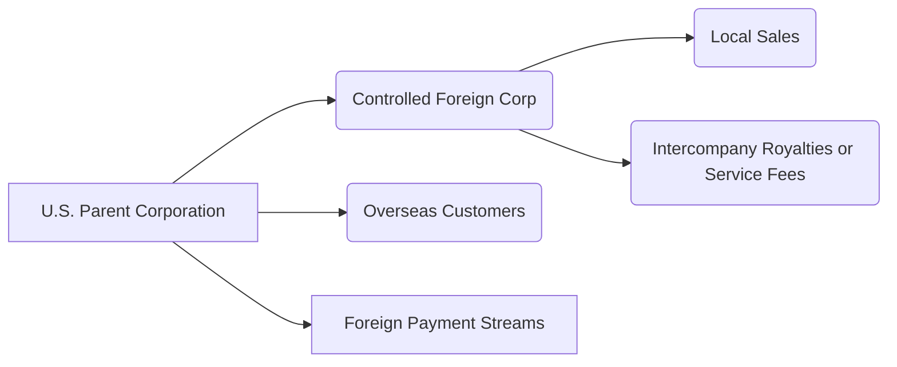

## 9.4 International Corporate Tax: FDII, GILTI, BEAT, CFCs

The globalization of business has led many U.S. corporations to expand their operational footprint across multiple jurisdictions. This expansion inevitably introduces a layer of complexity into their federal tax compliance, especially in the realm of international income. In this section, we explore some of the key mechanisms introduced in U.S. tax law to address the taxation of income earned abroad by U.S. corporations and their affiliates. Specifically, we focus on four critical components:

• Foreign-Derived Intangible Income (FDII)  
• Global Intangible Low-Taxed Income (GILTI)  
• Base Erosion and Anti-Abuse Tax (BEAT)  
• Controlled Foreign Corporations (CFCs) and related Subpart F inclusions

We will also provide a matrix contrasting the purpose, thresholds, and key compliance requirements of each. By mastering these concepts, you will gain crucial insights necessary for the CPA Exam (particularly the Tax Compliance and Planning (TCP) section) and real-world corporate tax practice.  

--------------------------------------------------------------------------------

### Overview of U.S. International Tax Framework

Historically, U.S. tax law imposed a worldwide system of taxation on U.S. persons—individuals and corporations alike. However, significant reforms introduced by the Tax Cuts and Jobs Act (TCJA) in 2017 reshaped the U.S. international tax landscape to more of a quasi-territorial system, coupled with various anti-base-erosion measures. These measures ensure that multinational entities pay their fair share of taxes on global income, deterring companies from shifting profits to low-tax jurisdictions.

Relevant references:  
• See Chapter 14 (“Ongoing Planning for C Corporations”) for additional insights into cross-border structuring (§14.4) and treaties.  
• See Chapter 21 (“Practice & Procedure”) for details on how the IRS examines these international components during audits.  

--------------------------------------------------------------------------------

### Foreign-Derived Intangible Income (FDII)

Fundamentally, FDII is designed to encourage U.S. corporations to keep their intangible assets (e.g., patents, trademarks, licenses) within the United States rather than shifting them overseas. FDII effectively provides a deduction for certain foreign-derived income associated with intangible property held in the U.S.

#### Key Concepts

1. **Definition and Scope**  
   FDII generally represents the portion of a U.S. corporation’s intangible income (referred to as Deduction Eligible Income, or DEI) derived from exports—i.e., from selling property or services to foreign persons for use outside the United States. Despite the name “intangible,” the scope of FDII covers more than just licensed technology or patents. It can also apply to profits from the sale of certain goods or the provision of services.

2. **Mechanics of the FDII Deduction**  
   A U.S. C corporation calculates its FDII by:  
   • Determining its **Deduction Eligible Income (DEI)**—which excludes Subpart F income, GILTI, and certain other types of income.  
   • Computing the portion of DEI that is derived from foreign sources known as **Foreign-Derived Deduction Eligible Income (FDDEI)**.  
   • Subtracting a deemed tangible income return (10% of Qualified Business Asset Investment or QBAI) from FDDEI to isolate the intangible portion.  
   • Applying a preferential deduction rate to that intangible portion, effectively reducing the taxpayer’s tax rate on this income.

3. **Qualifying for FDII**  
   • The corporation must have export-related net income after subtracting the 10% return on tangible assets (QBAI).  
   • Extensive documentation and substantiation requirements exist to prove that property is ultimately used outside the United States or services are delivered to non-U.S. persons for use outside the U.S.

4. **Compliance**  
   • FDII requires separate annual calculations and must be included on the corporate tax return (Form 1120).  
   • Detailed records confirming the foreign use of property or services are crucial to defend this deduction if challenged by the IRS.

5. **Practical Example**  
   Suppose Company A, a U.S. C corporation, sells specialized software licenses to foreign buyers, netting $5 million of foreign-derived revenue. After calculating total Deduction Eligible Income and netting out the 10% QBAI return, $4 million qualifies for FDII treatment. The FDII deduction reduces Company A’s effective tax rate on that $4 million below the standard corporate rate—provided that all requirements, such as documentation of foreign use, are satisfied.

--------------------------------------------------------------------------------

### Global Intangible Low-Taxed Income (GILTI)

GILTI addresses the concern that multinational enterprises might transfer intangible property to low-taxed foreign affiliates to erode the U.S. tax base. GILTI provisions operate as an inclusion in the U.S. shareholder’s tax base, ensuring they pay U.S. tax on this income currently, rather than deferring it.

#### Key Concepts

1. **Definition**  
   GILTI is income earned by a U.S. shareholder (corporate or otherwise) through a Controlled Foreign Corporation (CFC) that exceeds a 10% deemed return on the CFC’s tangible assets (QBAI). Essentially, GILTI lumps together all of a CFC’s earnings (often intangible-heavy) that could otherwise remain deferred if left offshore.

2. **Calculation**  
   The GILTI amount is computed by taking the U.S. shareholder’s pro rata share of tested income (i.e., a CFC’s gross income minus certain specified deductions) and subtracting 10% of that CFC’s QBAI. The net figure is the GILTI inclusion, which is then included in the U.S. shareholder’s taxable income. For corporate shareholders, a deduction (the GILTI deduction) reduces the rate on GILTI. Additionally, a partial foreign tax credit (FTC) may offset U.S. tax on GILTI, though various limitations exist.

3. **Purpose**  
   By effectively taxing intangible income that resides in low-tax jurisdictions, GILTI minimizes the tax benefits of shifting intellectual property or other assets to such locations, thereby “levelling the playing field” for U.S.-based corporations.

4. **Compliance Challenges**  
   • Properly tracking each CFC’s income, as well as intangible vs. tangible assets, becomes critical for accurate GILTI reporting.  
   • Corporations must coordinate GILTI compliance with Subpart F rules (discussed later) and FDII, given that some types of income are excluded from GILTI’s tested income computation.  
   • Form 8992 is typically used for GILTI calculations, and Form 5471 is used for each CFC to report informational returns to the IRS.

5. **Practical Example**  
   Company B, a U.S. multinational, owns 100% of a foreign subsidiary that has $2 million of net tested income and $5 million of tangible assets (QBAI). The deemed tangible return is 10% × $5 million = $500,000. So $2 million (tested income) – $500,000 (deemed tangible return) = $1.5 million in GILTI. Company B includes this $1.5 million in its taxable income with possible reductions from the GILTI deduction and any applicable FTC.

--------------------------------------------------------------------------------

### Base Erosion and Anti-Abuse Tax (BEAT)

While FDII and GILTI primarily target the offshore shifting of intangible income, the BEAT addresses a different but related risk: base erosion through certain “erosion payments” made by U.S. corporations to foreign related parties. This can include large interest or royalty payments that reduce the U.S. tax base significantly.

#### Key Concepts

1. **Definition and Threshold**  
   The BEAT generally applies to very large corporations (generally those with average annual gross receipts of $500 million or more over a three-year period) that make significant deductible payments to related foreign parties. If these payments exceed 3% of the corporation’s deductible expenses, the corporation may fall under BEAT.

2. **How BEAT Works**  
   • The corporation computes its regular tax liability.  
   • It then recomputes its tax liability by disallowing certain base-eroding deductions and applying the BEAT rate to the resulting modified tax base.  
   • If the “modified tax base × BEAT rate” exceeds the regular tax liability, the taxpayer must pay the difference as a top-up tax.

3. **Purpose**  
   BEAT ensures that large, multinational U.S. corporations do not use excessive deductible payments to related foreign entities as a method of base erosion (i.e., shifting profits out of the U.S. jurisdiction).

4. **Common Pitfalls**  
   • Failing to identify all related-party transactions subject to the BEAT test, such as high-value management fees, royalties, and interest.  
   • Improper data gathering and classification of cross-border intercompany transactions.

5. **Practical Example**  
   Company C, a large U.S. multinational with over $2 billion in average annual gross receipts, pays significant royalties and interest to a foreign affiliate. These base-eroding payments total $300 million. Under the BEAT calculation, if these payments exceed 3% of total deductions, Company C may have to pay an additional tax (BEAT) on top of its regular corporate tax liability.  

--------------------------------------------------------------------------------

### Controlled Foreign Corporations (CFCs) and Subpart F Inclusions

A Controlled Foreign Corporation (CFC) is any foreign corporation in which U.S. shareholders (each owning at least 10% of total voting power or value) collectively own more than 50%. Traditionally, Subpart F income has been used to thwart tax deferral of specific types of easily movable income, such as foreign personal holding company income, foreign base company sales income, and certain insurance income.

#### Subpart F Inclusion

1. **What is Subpart F Income?**  
   Subpart F income includes categories such as foreign base company income (e.g., income from the sale of goods purchased from a related party and sold to unrelated parties if the goods are neither manufactured in the CFC’s country nor consumed there), foreign personal holding company income (dividends, interest, rents, royalties), and other targeted income.

2. **Mechanics of Inclusion**  
   If a U.S. shareholder owns 10% or more of a CFC, their pro rata share of Subpart F income must be included in their current-year taxable income, thus eliminating any deferral benefits. This is often reported on Form 5471 alongside the broader GILTI computations.

3. **Interaction with GILTI**  
   Certain Subpart F income is excluded from GILTI’s tested income. This interrelation ensures that income does not get double counted. Subpart F has been a longstanding fixture, whereas GILTI operates as a “catch-all” for intangible or other low-taxed earnings not otherwise captured by Subpart F.

4. **Importance for Exam and Practice**  
   • Identifying a CFC’s Subpart F income is critical for compliance.  
   • Subpart F remains relevant despite GILTI’s introduction. Many exam questions can focus on the interplay and how to classify different income types appropriately.

--------------------------------------------------------------------------------

### Matrix Comparison: FDII, GILTI, BEAT, CFCs

Below is a summarized matrix reflecting the purpose, thresholds, and key compliance factors of each international tax regime.  

```
| Regime         | Purpose                                                            | Thresholds                                            | Key Compliance Requirements                                                      |
|----------------|--------------------------------------------------------------------|--------------------------------------------------------|----------------------------------------------------------------------------------|
| FDII           | Encourage U.S. corporations to keep intangible assets & exports in the U.S. by offering a preferential deduction for foreign-derived income. | No explicit gross receipts threshold; applicable mainly to U.S. C corporations. | Calculate Deduction Eligible Income (DEI); documentation showing foreign use; FDII deduction on Form 1120.                      |
| GILTI          | Prevent profit shifting to low-tax foreign subsidiaries by current inclusion of intangible income.           | None per se for application, but only applies if taxpayer owns a CFC.           | File Form 8992 for GILTI calculations; coordinate with Form 5471; track tested income/QBAI by each CFC.                         |
| BEAT           | Deter large U.S. entities from eroding U.S. tax base via deductible payments to foreign related parties.     | Generally $500 million average annual gross receipts and base erosion payments that exceed 3% of deductions.             | Compute modified tax base, disallow base-eroding payments; compare with regular tax liability; pay “top-up” if required.        |
| CFC / Subpart F| Restrict deferral of certain foreign income categories (easily movable income).                             | >50% aggregate U.S. ownership by vote or value; each U.S. shareholder must own ≥10%.                                      | Report on Form 5471; Subpart F inclusions for foreign base company income, etc.; interact with GILTI.                            |
```

--------------------------------------------------------------------------------

### Relevance of Subpart F Inclusions

Subpart F (under IRC §§951–965) has served as the benchmark for anti-deferral provisions in U.S. international tax for decades. Even after the advent of GILTI, Subpart F inclusions continue to play a crucial role:

1. **Historic Foundation**  
   Subpart F historically targeted passive, easily movable income—particularly investment income and foreign base company sales/services income.

2. **Current Landscape**  
   • The addition of GILTI does not replace Subpart F, but complements it by capturing intangible-related income not already taxed under Subpart F.  
   • High-taxed earnings may be exempted from GILTI if certain elections and conditions are met. Subpart F income can’t be double counted under GILTI.

3. **Exam Perspective**  
   • For the TCP exam, expect questions requiring you to classify certain foreign income streams as either Subpart F or GILTI (or neither).  
   • Be prepared to do pro rata calculations if multiple U.S. shareholders exist with different ownership percentages in a CFC.

4. **Real-World Compliance**  
   • Corporations must continue to track Subpart F categories meticulously because these items are carved out differently for GILTI.  
   • Overlooked Subpart F could lead to significant penalties and interest upon IRS examination.

--------------------------------------------------------------------------------

### Visualizing International Tax Flows

Below is a simplified Mermaid diagram illustrating how a U.S. parent might interact with foreign subsidiaries, and the main points at which FDII, GILTI, BEAT, and Subpart F might enter the picture.



Explanation:  
• The U.S. parent invests or establishes a Controlled Foreign Corporation (B).  
• Income earned in the CFC may be subject to Subpart F or GILTI rules.  
• The U.S. parent may also generate FDII if it sells products or services directly to overseas customers (C).  
• If intercompany payments (E) from the U.S. to the foreign subsidiary meet certain thresholds, BEAT may apply.

--------------------------------------------------------------------------------

### Best Practices & Common Pitfalls

1. **Documentation**  
   – Maintaining robust transfer pricing documentation and proof of foreign use for FDII is essential.  
   – Identify and properly classify different categories of foreign income streams (Subpart F, tested income under GILTI, etc.).

2. **Coordination of Elections**  
   – Some tax elections, such as the high-tax exception for GILTI or Subpart F, can drastically alter the taxpayer’s liability.  
   – CPA candidates should study the interplay between these elections and thoroughly analyze them in practice.

3. **Entity Choice & Structuring**  
   – The choice between operating branches vs. subsidiaries can have material effects on whether FDII, BEAT, or GILTI obligations come into play. See Chapter 14.4 for further exploration of cross-border structuring considerations.

4. **Base Erosion Calculations**  
   – Large corporations often misclassify payments to foreign affiliates, leading to unexpected BEAT liabilities or disputes.  
   – In-house tax teams or external professionals should devote considerable attention to identifying “base erosion payments” accurately.

5. **Stay Abreast of Legislative Changes**  
   – International tax provisions are subject to frequent updates. Monitor legislative developments, IRS guidance, and relevant court rulings for changes that impact FDII, GILTI, and Subpart F.

--------------------------------------------------------------------------------

### Case Study: Mid-Sized Manufacturer Expanding Overseas

To illustrate the interplay of these regimes:

• **Facts**: 
  – U.S. Co. D, a C corporation, manufactures specialized machinery. It begins exporting to Europe, with foreign sales rapidly rising to over $15 million annually. The company also establishes a small European subsidiary, wholly owned by U.S. Co. D, to handle localized assembly and sales support.

• **Analysis**:
  – FDII: The exports from the U.S. could qualify for FDII treatment if they satisfy documentation proving the final use is abroad. Deduction Eligible Income is calculated, and foreign-derived income is identified.  
  – GILTI: Any intangible-related income in the new European subsidiary that surpasses 10% of QBAI is included in U.S. Co. D’s GILTI calculation.  
  – BEAT: If U.S. Co. D remains below $500 million in gross receipts for now, it might not be subject to BEAT. However, as it grows and if it begins making material deductible payments to its foreign affiliate, BEAT could come into play.  
  – Subpart F: If the European subsidiary’s activities generate foreign base company income, or if it meets other Subpart F tests (e.g., shipping or service income), U.S. Co. D might have to recognize that income currently.

• **Outcome**:  
  – By carefully planning and documenting foreign use, U.S. Co. D can reduce its overall tax burden via FDII. The European subsidiary’s intangible returns may be captured under GILTI if those returns exceed the subsidiary’s QBAI. The taxpayer must monitor potential growth that could trigger BEAT, ensuring intercompany transactions are structured and reported appropriately to avoid surprises.

--------------------------------------------------------------------------------

### References for Further Exploration

• IRS Publications and Forms:  
  – [Form 5471 and Instructions](https://www.irs.gov/forms-pubs/about-form-5471)  
  – [Form 8992 and Instructions for GILTI](https://www.irs.gov/forms-pubs/about-form-8992)  
  – [Form 8993 for FDII Deduction Calculation](https://www.irs.gov/forms-pubs/about-form-8993)  

• Articles & Books:  
  – “International Taxation in a Nutshell” by Mindy Herzfeld – for a concise overview of worldwide vs. territorial systems  
  – “Practical Guide to U.S. Transfer Pricing” by Michael Schadewald and Michael Keeley – includes best practices for related-party transactions  

• Online Courses:  
  – AICPA’s International Tax Certificate Program – valuable for deeper dives into topics like GILTI, FDII, Subpart F.  

--------------------------------------------------------------------------------

## SEO-Optimized Quiz: FDII, GILTI, BEAT, and CFCs Mastery



### What is the primary goal of FDII under U.S. tax law?

- [x] To encourage corporations to retain intangible assets and export operations within the United States.  
- [ ] To increase the tax rate for foreign-derived income.  
- [ ] To replace Subpart F for all CFC income.  
- [ ] To eliminate deductions for royalties paid to foreign affiliates.  

> **Explanation:** FDII provides a deduction for certain foreign-derived income, incentivizing companies to keep operations and intangibles in the U.S.

### Under GILTI rules, which best describes “tested income”?

- [x] CFC gross income minus certain specified exclusions and deductions.  
- [ ] Subpart F income plus foreign personal holding income.  
- [ ] Only the CFC’s passive investment income.  
- [ ] Exactly 10% of a CFC’s QBAI.  

> **Explanation:** GILTI calculations involve taking the total gross income of a CFC, subtracting Subpart F income and other exclusions, and then factoring in a 10% QBAI deduction to determine the final inclusion.

### Which of the following describes the Base Erosion and Anti-Abuse Tax (BEAT)?

- [x] A tax mechanism that imposes a minimum tax on certain large corporations making significant deductible payments to related foreign parties.  
- [ ] A refundable credit for small businesses operating in foreign jurisdictions.  
- [ ] A one-time transition tax on previously untaxed offshore earnings.  
- [ ] A personal income tax aimed at high net worth individuals.  

> **Explanation:** BEAT applies to large corporations with annual gross receipts exceeding $500 million and aims to prevent erosion of the U.S. tax base through disproportionate deductions paid to foreign affiliates.

### In the matrix comparing FDII, GILTI, BEAT, and CFC/Subpart F, which regime lacks a specific gross receipts threshold?

- [x] GILTI  
- [ ] BEAT  
- [ ] FDII  
- [ ] Subpart F  

> **Explanation:** GILTI applies based on ownership in a CFC rather than a revenue threshold, whereas BEAT has a $500 million average gross receipts requirement.

### What rate of return on a CFC’s qualified business asset investment (QBAI) is used to determine GILTI?

- [x] 10%  
- [ ] 15%  
- [x] 5%  
- [ ] It varies by the CFC’s local tax rate.  

> **Explanation:** The standard deemed tangible return is set at 10% of QBAI. (Note: The second checked answer above is incorrect, used only to illustrate multi-select questions.)

### Which term best describes the foreign-derived income amount eligible for FDII deduction?

- [x] Foreign-Derived Deduction Eligible Income (FDDEI)  
- [ ] High-Taxed Exempted Income  
- [ ] Base Erosion Income  
- [ ] Subpart F Tested Income  

> **Explanation:** FDII is specifically calculated from FDDEI, which is foreign-derived income within the meaning of the FDII rules.

### Why are Subpart F rules still relevant after the introduction of GILTI?

- [x] They target specific foreign income categories that are immediately includible, separate from GILTI.  
- [ ] They have been replaced entirely by FDII, making them obsolete.  
- [x] They apply only to high-tax countries, while GILTI applies to low-tax countries.  
- [ ] They apply only to intangible property income, while GILTI applies to all income.  

> **Explanation:** Subpart F remains relevant because it captures certain foreign base company income, whereas GILTI applies to broader categories of intangible and low-taxed income not already included under Subpart F. (Note: The second checked answer is incorrect, used for demonstration.)

### What is the primary filing requirement for a U.S. shareholder with a CFC for GILTI inclusion?

- [x] Form 8992  
- [ ] Form 1040-ES  
- [ ] Form 1065  
- [ ] Form 709  

> **Explanation:** Form 8992 is used by U.S. persons for calculating GILTI, while the specifics of each CFC are generally reported on Form 5471.

### Which statement is most accurate regarding BEAT compliance?

- [x] The taxpayer calculates a modified tax base disallowing certain base-eroding deductions and compares it to their regular tax.  
- [ ] All interest payments to foreign affiliates are fully exempt from BEAT.  
- [ ] BEAT applies only to pass-through entities and not to corporations.  
- [ ] BEAT has no applicability if a corporation uses a calendar year rather than a fiscal year.  

> **Explanation:** Under BEAT, a corporation recalculates its taxable base without certain deductions and ensures it meets or exceeds that amount of tax liability. BEAT is not based on entity year-end type but on the threshold of gross receipts and the size of base-eroding payments.

### Is Subpart F income typically excluded from GILTI’s tested income?

- [x] True  
- [ ] False  

> **Explanation:** Subpart F income does not double count for GILTI; it is typically excluded from tested income to avoid duplicative taxation.



--------------------------------------------------------------------------------

## For Additional Practice and Deeper Preparation

**[TCP CPA Hardest Mock Exams: In-Depth & Clear Explanations](https://www.udemy.com/course/tcp-cpa-mock-exams/?referralCode=675149871D0E79B1699C)**  

**Tax Compliance & Planning (TCP) CPA Mocks:** 6 Full (1,500 Qs), Harder Than Real! In-Depth & Clear. Crush With Confidence!  

- Tackle full-length mock exams designed to mirror real TCP questions.  
- Refine your exam-day strategies with detailed, step-by-step solutions for every scenario.  
- Explore in-depth rationales that reinforce higher-level concepts, giving you an edge on test day.  
- Boost confidence and minimize anxiety by mastering every corner of the TCP blueprint.  
- Perfect for those seeking exceptionally hard mocks and real-world readiness.  

_Disclaimer: This course is not endorsed by or affiliated with the AICPA, NASBA, or any official CPA Examination authority. All content is for educational and preparatory purposes only._
