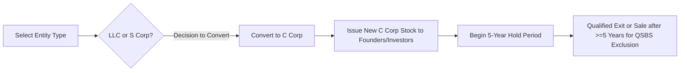

## 13.4 Planning Around Qualified Small Business Stock (QSBS) Exclusions

Planning around Qualified Small Business Stock (QSBS) exclusions under Internal Revenue Code (IRC) §1202 is a powerful strategy for founders, investors, and tax professionals seeking to minimize or eliminate capital gains on the future sale of stock. Since the Taxpayer Relief Act of 1997, and through subsequent legislative updates (including post-2010 enhancements), QSBS has garnered significant attention for its potential to reduce or eliminate capital gains. Proper planning requires close attention to multiple essential factors:

• Ensuring the business qualifies as a small business under IRC guidelines.  
• Securing and maintaining C corporation status.  
• Verifying the business is engaged in a qualified trade or business.  
• Observing holding period requirements and statutory issuance limits.  
• Managing entity conversions (e.g., from S corp or partnership to C corp) without jeopardizing QSBS eligibility.

This section examines how QSBS interacts with entity choice and formation strategies, addresses the varying degrees of tax exclusion (50%, 75%, or 100%), and outlines common pitfalls and best practices.

---

### Introduction to QSBS

Under IRC §1202, certain capital gains from the sale of Qualified Small Business Stock acquired at an original issuance can be excluded from gross income, up to the greater of (1) $10 million in aggregate gain or (2) 10 times the investor’s adjusted basis in the stock. This incentive is intended to stimulate investment in smaller, growth-oriented domestic corporations.

To qualify, shares must be newly issued (commonly by a start-up or an early-stage business) and meet strict requirements:

• The issuing corporation must be a domestic C corporation.  
• The corporation’s gross assets must not exceed $50 million at any time before or immediately after stock issuance.  
• Stock must be acquired at original issuance in exchange for money, property (other than stock), or as compensation for services.  
• The corporation must operate a qualified trade or business (certain exclusions apply, e.g., businesses engaged in professional services, banking, farming, or hospitality in some instances).  
• The taxpayer must hold the QSBS for at least five years to claim the exclusion.  

Because founders and early-stage investors often structure entities (e.g., as LLCs or S corporations) for flexibility, conversions to C corporations can be pivotal in preserving eligibility for QSBS. Additionally, legislative changes (particularly post-September 27, 2010) have expanded the percentage of gains excludable, achieving up to 100% for qualifying dispositions.

---

### Core Requirements for QSBS Eligibility

#### C Corporation Status and the Qualified Trade or Business Test

QSBS must be issued exclusively by a C corporation. This requirement immediately excludes S corporations and partnerships from being direct sources of QSBS, though there remain strategic paths to convert to a C corporation status in time to qualify. Investing in or forming a C corporation also carries additional considerations such as double taxation at the corporate level, but the QSBS exclusion can outweigh these costs for high-growth ventures aiming for equity exits.

Among other conditions, the issuing corporation must be actively conducting a qualified trade or business. Several lines of business—like financial services, hospitality, and certain professional service firms—are disqualified. For a full list, practitioners should consult IRC §1202(e)(3) and the accompanying guidance.

#### $50 Million Gross Assets Limit

At the time of (and immediately after) the issuance of the stock, the issuing corporation’s aggregate gross assets cannot exceed $50 million. Contributed property is counted at fair market value. This limit helps ensure that QSBS benefits are reserved for small or emerging businesses.

#### Original Issuance Requirement

Stock must be acquired directly from the C corporation in exchange for cash, property (not including stock), or services. Purchases on the secondary market do not qualify for QSBS treatment because the shares were not acquired upon original issuance by the corporation itself.

---

### Holding Period Requirements

A critical element of the QSBS exclusion is the five-year holding period. Stock must be held for at least five years from the date of issuance to qualify. If the taxpayer sells before completing the mandatory hold, no QSBS exclusion applies, unless the taxpayer executes a qualified rollover into other QSBS under IRC §1045 by reinvesting in a new issuance of qualified small business stock within 60 days. This kind of “QSBS-to-QSBS rollover” preserves the holding period but comes with its own complex rules.

To facilitate better understanding, here is a simplified timeline illustrating QSBS holding requirements:

```mermaid
flowchart LR
    A[Issue New C Corp Stock (t=0)] --> B[Holding Period Begins]
    B --> C{5 Years Elapse}
    C --> D[Qualify for QSBS Exclusion upon Sale]
```

1. Stock issuance date (t=0): The investor acquires newly issued shares from the corporation.  
2. The five-year holding period (t=0 to t=5) must be satisfied before any exclusion is available.  
3. After five years, a disposition of the stock may qualify for the QSBS exclusion subject to other requirements.

---

### Percentage Exclusions Based on Date of Acquisition

Over time, Congress has revised the percentage of gain eligible for exclusion under IRC §1202:

• 50% Exclusion for QSBS acquired between August 10, 1993, and February 17, 2009.  
• 75% Exclusion for QSBS acquired between February 18, 2009, and September 27, 2010.  
• 100% Exclusion for QSBS acquired on or after September 28, 2010.

Additionally, alternative minimum tax (AMT) adjustments have been relaxed for QSBS acquired after September 27, 2010, making QSBS even more attractive compared to pre-2010 shares. Still, the maximum gain exclusion per issuer is the greater of $10 million (lifetime per investor) or 10 times the aggregate adjusted basis of the QSBS sold during the tax year.

Below is a reference table to help visualize these thresholds:

| Acquisition Date        | Exclusion % | AMT Preference?      | Notes                                                             |
|-------------------------|-------------|-----------------------|-------------------------------------------------------------------|
| 8/10/1993 – 2/17/2009   | 50%         | Yes (partial)         | Original statutory framework.                                     |
| 2/18/2009 – 9/27/2010   | 75%         | Yes (reduced)         | Enacted as part of economic stimulus measures.                    |
| On/After 9/28/2010      | 100%        | Generally No          | Enhanced by the Small Business Jobs Act and subsequent updates.   |

---

### Interplay with Entity Conversions

#### Partnership/LLC to C Corporation

In many scenarios, a start-up begins as a limited liability company (LLC) or partnership, seeking simplicity and pass-through taxation. However, LLC or partnership interests are not eligible for QSBS treatment. If founders expect a high-value exit, converting to a C corporation sooner rather than later can preserve or start the QSBS clock.

• Timing of Conversion: The QSBS clock typically starts only when the stock is issued by the C corporation. If an investor holds a partnership interest that later converts to a C corporation, newly issued C corporation stock commencing at that time may become eligible QSBS—provided other requirements are met (e.g., gross assets under $50 million).  
• Rolling Over Interests: Generally, a technical reorganization or “check-the-box” election that merges or converts the LLC to a C corporation can accomplish the corporate form requirement. Legal counsel should be involved to ensure that original issuance rules are satisfied once the new shares are distributed to owners.

#### S Corporation to C Corporation

S corporations, while providing pass-through taxation, do not issue QSBS. If substantial capital gains potential on a future exit is anticipated, it may be advantageous to revoke the S election early. However, a successful transition requires:

1. Verification that the entity meets the gross assets test.  
2. Restructuring any outstanding shares such that they are “issued” in a manner consistent with the QSBS rules.  
3. Monitoring any built-in gains (BIG) tax exposure on conversions from S to C corporation.  

The complexity of entity conversions underscores the enormous importance of timing, specialized tax legal counsel, and a thorough knowledge of how the QSBS clock starts.

---

### Tax Planning Strategies for QSBS

1. **Early C Corporation Formation:** Founders with a clear path to venture capital or strategic acquisition often choose to form as or convert to a C corporation early, ensuring the future stock issuance is squarely within QSBS guidelines.

2. **Stacking and Splitting:** Investors may attempt “stacking” by distributing shares across family members or spreading holdings across different issuers to maximize the $10 million cap multiple times. However, the IRS has anti-abuse provisions, so caution is advised.

3. **Death and Estate Planning:** QSBS enjoys a step-up in basis to fair market value at the holder’s death. For high-net-worth individuals, gifting QSBS or transferring it into trusts for heirs could align with multi-generational planning, magnifying the potential exclusion.

4. **Rollover Under §1045:** If an investor decides to sell QSBS stock before five years, proceeds may be reinvested in new QSBS within 60 days to preserve the ongoing holding period. This strategy effectively “tacks on” to meet the five-year hold requirement, deferring gain recognition.

---

### Practical Examples and Case Studies

1. **Founders of a Tech Start-Up**  
   Imagine two founders contributing modest cash and property to a newly formed C corporation with a total gross asset value of $2 million. They receive newly issued stock in exchange. After six years, the corporation is sold for $50 million. Because each founder meets the five-year hold, invests in a qualified trade/business, and holds a combined share far below the $50 million gross asset threshold at issuance, each founder may exclude up to the greater of $10 million or 10× their basis from capital gains under the 100% post-September 27, 2010 rule.

2. **Moving from LLC to C Corp**  
   Six partners form a biotech LLC with strong growth prospects. After two years, it’s clear capital raising will require corporate equity. The LLC converts to a C corporation before issuing new shares to a venture capital firm. While the original partnership interests do not become QSBS, any newly issued corporate stock (to new or existing owners) may start the QSBS clock. Within five years from the date of that issuance, a future liquidity event could yield partial or entire tax-free capital gains for those new shares.

3. **S Corp Lapse and Reissuance**  
   An S corporation with modest intangible assets foresees a major expansion. The owners allow the S election to lapse, becoming a C corporation effective in January of the current year. To attract new investors, the corporation issues fresh shares. The newly issued shares qualify as QSBS if total assets are below $50 million. After a five-year hold, if the venture is sold, the new investors may enjoy QSBS benefits, whereas older S corp shares purchased prior to conversion may not.

---

### Common Pitfalls and Best Practices

• **Pitfall – Failing the Active Business Requirement:** The corporation must remain active in a qualified trade or business for substantially all of the holding period. Passive activities or pivoting into disqualified industries can invalidate QSBS.  

• **Pitfall – Surpassing $50 Million in Assets Prematurely:** Rapid infusion of investor capital can boost the company’s assets over $50 million, disqualifying future issued shares from QSBS. Early planning ensures new infusions align with QSBS thresholds.  

• **Pitfall – Not Solidifying Documentation:** Entity formation documents, cap tables, and proof of original issuance must be well-tracked. In a high-stakes IRS audit, incomplete documentation can sink QSBS claims.  

• **Best Practice – Multi-Year Planning:** Because of the five-year holding requirement, advanced planning for a likely exit or sale event is critical. Starting early can maximize the percentage exclusion available.  

• **Best Practice – Use of Trusts and Gifting:** When properly planned, distributing QSBS to beneficiaries or to multiple grantor trusts can multiply the exclusion limits. Ensure that all trust structures and grants comply with QSBS rules and do not violate the original issuance rule.

---

### Supporting Visual: Entity Conversion Timeline

Below is a conceptual flowchart illustrating best-case timing to preserve QSBS eligibility during entity conversion:



---

### References for Further Exploration

• IRC §1202: Primary statutory authority for QSBS.  
• IRC §1045: Rollovers of qualified small business stock.  
• IRS Publication 550 and 551: Informational guidance on capital gains and stock basis.  
• AICPA Tax Section Library: White papers and resources on small business tax incentives.  
• Chapter 16 (Partnership & LLC Tax Planning) of this text for more on entity conversions.  
• Chapter 18 (Character of Gains & Losses) for an expanded view of capital gains classification.  

QSBS planning can be extremely beneficial for tax minimization but requires rigorous compliance with technical rules governing the corporation’s structure, issuance date, and holding period. By carefully navigating entity conversions, tracking gross assets, and maintaining a qualified trade or business, individuals and advisors can unlock substantial gains exclusions when structured properly.

---

## SEO-Optimized Quiz on QSBS Exclusions: Maximize Your Tax Savings



### Which entity type must exclusively issue QSBS under IRC §1202? 
- [x] C corporation 
- [ ] S corporation 
- [ ] Partnership 
- [ ] Limited Liability Company (LLC) without corporate status

> **Explanation:** To qualify for QSBS treatment, the issuer must be a domestic C corporation meeting the IRC §1202 requirements, such as maintaining gross assets under $50 million at issuance.

### What is the minimum holding period for QSBS to be eligible for the gain exclusion?
- [ ] 1 Year 
- [x] 5 Years 
- [ ] 7 Years 
- [ ] 10 Years

> **Explanation:** A taxpayer must hold QSBS for at least five years to qualify for the capital gains exclusion.

### How much of the gain can be excluded for QSBS acquired on or after September 28, 2010?
- [ ] 0% 
- [ ] 50% 
- [ ] 75% 
- [x] 100%

> **Explanation:** Legislation passed in 2010 allows for a 100% exclusion of capital gains on qualifying QSBS stock issued on or after September 28, 2010.

### Which of the following is a requirement for stock to qualify as QSBS?
- [x] It must be acquired at original issuance from the corporation 
- [ ] It can be purchased on the open market 
- [ ] It must be restricted stock issued by a foreign entity 
- [ ] It must be issued by publicly traded companies

> **Explanation:** Stock must be newly issued (i.e., from the issuing corporation itself) for cash, property (not stock), or services in order to qualify under IRC §1202.

### The maximum excludable gain for an individual under QSBS is the greater of $10 million or:
- [ ] 5 times the original basis 
- [ ] 8 times the original basis
- [x] 10 times the original basis 
- [ ] 12 times the original basis

> **Explanation:** Under IRC §1202, the maximum exclusion is the greater of $10 million or 10 times the taxpayer’s adjusted basis in the stock.

### Which of the following business activities generally does NOT qualify as a qualified trade or business for QSBS purposes under IRC §1202?
- [ ] Manufacturing 
- [x] Banking and insurance 
- [ ] Software development 
- [ ] Bioengineering

> **Explanation:** Certain service-based and finance-based industries, including banking, insurance, and professional services, are excluded from the definition of qualified trades or businesses for QSBS purposes.

### When might an LLC or partnership decide to convert into a C corporation to preserve QSBS status?
- [x] When future stock issuances are expected, and the owners want the stock to qualify as QSBS 
- [ ] When the business only wants pass-through taxation 
- [ ] When the business has no intention of raising outside capital 
- [x] When the owners anticipate a profitable exit in 5+ years

> **Explanation:** LLCs or partnerships may convert to a C corporation to enable future issuances of stock that can qualify as QSBS. Pass-through entities themselves cannot issue QSBS.

### Which IRC section allows taxpayers to roll over proceeds from the sale of QSBS into new QSBS and preserve the holding period?
- [ ] §351 
- [ ] §721 
- [x] §1045 
- [ ] §1031

> **Explanation:** IRC §1045 permits taxpayers to defer gain on the sale of QSBS if they reinvest the proceeds in new QSBS within 60 days.

### In the context of QSBS, which of the following statements is TRUE?
- [ ] S corporation stock always qualifies for QSBS if held for 5 years
- [x] Only new stock issued after a C corporation conversion can start the QSBS holding period  
- [ ] QSBS benefits apply to both profit and nonprofit corporations
- [ ] The exclusion amount is unlimited for all stock issuances

> **Explanation:** Only the new stock issued by a C corporation after conversion is eligible for QSBS, subject to satisfying all other requirements.

### The 100% QSBS exclusion typically applies to stock acquired:
- [x] On or after September 28, 2010 
- [ ] Between August 10, 1993, and February 17, 2009 
- [ ] Between February 18, 2009, and September 27, 2010 
- [ ] Prior to August 10, 1993

> **Explanation:** The Small Business Jobs Act of 2010 extended a 100% exclusion to qualifying stock acquired on or after September 28, 2010.



---

## For Additional Practice and Deeper Preparation

**[TCP CPA Hardest Mock Exams: In-Depth & Clear Explanations](https://www.udemy.com/course/tcp-cpa-mock-exams/?referralCode=675149871D0E79B1699C)**  

**Tax Compliance & Planning (TCP) CPA Mocks:** 6 Full (1,500 Qs), Harder Than Real! In-Depth & Clear. Crush With Confidence!  

- Tackle full-length mock exams designed to mirror real TCP questions.  
- Refine your exam-day strategies with detailed, step-by-step solutions for every scenario.  
- Explore in-depth rationales that reinforce higher-level concepts, giving you an edge on test day.  
- Boost confidence and minimize anxiety by mastering every corner of the TCP blueprint.  
- Perfect for those seeking exceptionally hard mocks and real-world readiness.  

_Disclaimer: This course is not endorsed by or affiliated with the AICPA, NASBA, or any official CPA Examination authority. All content is for educational and preparatory purposes only._
