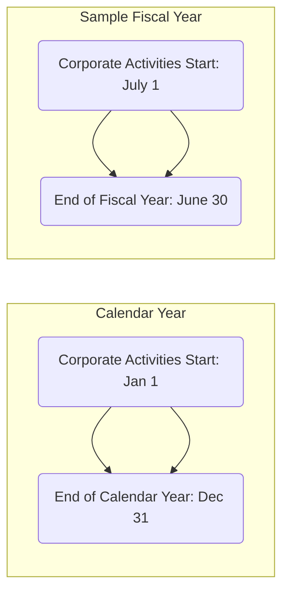

## 14.1 Timing of Income & Deductions; Using Fiscal vs. Calendar Years

Effective tax planning for C corporations often relies on making strategic choices about when to recognize income and claim deductions. One of the most important steps in that process is determining the corporation’s tax year: a calendar year or a fiscal year. This choice, in turn, influences options for deferral, acceleration, and the most beneficial timing of reporting. Coupled with this decision are the rules and regulations surrounding accounting methods and permissible method changes allowed by the IRS. This section will explore how C corporations can use timing to optimize their tax liabilities while remaining compliant, and discuss the mechanics of deferral strategies, form filing requirements, and the interplay with the broader CPA exam content.

Use this guidance in conjunction with broader tax-planning discussions found throughout Part IV (Entity Tax Planning) and consider ways to integrate timing principles into multi-entity structures, as introduced in earlier chapters.

  
Overview of Accounting Periods

Choosing an accounting period is a foundational step for any entity, including a C corporation. Under the Internal Revenue Code (IRC), entities are generally allowed to adopt either:
• A calendar year that matches the standard January–December cycle, or  
• A fiscal year that ends in any month other than December, provided they meet certain conditions (including using a 52–53-week tax year).

The IRS places some constraints on which tax year an entity can adopt, especially for certain flow-through entities (such as S corporations or partnerships). However, traditional C corporations usually have more flexibility when deciding on which tax year to choose, subject to approval when first filing or upon changing in later years.

  
Comparative Drivers in Selecting a Tax Year

The choice between a calendar year and a fiscal year often revolves around industry norms, seasonality of business, and tax deferral opportunities:

• Seasonality: Retail-focused operations might end their fiscal year after the holiday season, often in January. This allows management to close financials at a stable point in the business cycle.  
• Deferral of Taxes: In certain cases, a fiscal year may allow a company to effectively defer recognition of certain transactions into the following year if structured correctly (e.g., deferral of income or acceleration of deductions).  
• Alignment with Financial Reporting: Some C corporations choose a fiscal year to align closely with operational or managerial reporting cycles.  

  
Mermaid Diagram: Calendar Year vs. Fiscal Year Timeline

Below is a simple Mermaid.js diagram illustrating the difference between a calendar year and a representative fiscal year (e.g., a June 30 year-end):



In this diagram, the top bar illustrates the traditional calendar year beginning January 1 and ending December 31. The lower bar illustrates a hypothetical fiscal year beginning July 1 and ending June 30.

  
Income Recognition: Choosing the Right Method

Once the tax year is in place, the next critical decision is determining the method for recognizing income. Two of the most common overall accounting methods are:

• Cash Method: Income is recognized when received (or constructively received), and expenses are recognized when paid. The cash method often gives more immediate clarity on cash flows but may be subject to certain eligibility restrictions for C corporations. Generally, corporations with average annual gross receipts exceeding a set threshold (indexed for inflation) are required to use the accrual method, with some exceptions.  
• Accrual Method: Income is recognized when earned, and expenses are recognized when incurred, regardless of the actual cash flow. The accrual method is more prevalent for large C corporations, particularly those with consolidated financial statements or that have inventory.  

There are also specialized methods, like the percentage-of-completion method for long-term contracts or specific industry-based methods (e.g., for farming), all of which tie into the broader principle of clearly reflecting income under IRC §446.

  
Deferral of Advanced Payments

Many entities receive advance payments for goods and services that will be delivered or performed in future tax years. For example, a software company might sell multi-year license agreements or a publisher might sell annual subscriptions. Under the accrual method, advanced payments can generally be recognized as income in the year of receipt unless the entity has elected a deferral method.

Revenue Procedure 2004-34 provides a safe harbor allowing taxpayers (meeting certain criteria) to defer the recognition of income derived from advance payments for certain goods and services to the subsequent tax year, to the extent they have not yet appeared in the company’s financial statements. This effectively allows a corporation to recognize part of that income in the current year (if it appears in financial statements) and defer the remainder into the following tax year.

Example of Advanced Payment Deferral:
• A software provider receives $120,000 on December 1, Year 1, for a 12-month license ending November 30, Year 2. Under the deferral method, the corporation can include in Year 1 any amounts recognized as revenue on its financial statements (e.g., $10,000 for December usage) and defer the remaining $110,000 (for January–November, Year 2) into Year 2, assuming it properly elects and uses the deferral method in line with Rev. Proc. 2004-34.

  
Deductions and Accrual Method Considerations

Deductions are generally governed by IRC §461, which requires that two tests be met for accrual-basis taxpayers:
• The All-Events Test: All events have occurred that determine the fact of the liability.  
• Economic Performance Test: The underlying services or property giving rise to the liability have been provided.  

For instance, an expense for an advertising campaign that runs in December of the current year can only be deducted in the current year if both:
1. The advertising services have been fully provided, and  
2. The liability is fixed and determinable.

Cash method entities, by contrast, may simply deduct expenses when paid, subject to certain exceptions (e.g., prepaid expenses that provide benefits substantially beyond the current year).

  
Pros & Cons of Fiscal vs. Calendar Year for Deductions

Although many of the fundamental rules remain similar regardless of the chosen tax year, there can be real differences in how quickly an entity can claim and utilize deductions. For example, a corporation that plants major capital projects near the close of its fiscal year might effectively accelerate large deductions that would not have been taken until the following spring had it adhered to a calendar year. Alternatively, a corporation might choose a fiscal year that coincides with seasonally low profits to time certain expenditures to create or absorb net operating losses (NOLs).

  
Method Changes and Form 3115

Changing an accounting method or period often necessitates IRS approval. The most common formal request for approval is made via Form 3115, Application for Change in Accounting Method. Major points to remember:

• Automatic vs. Advance Consent: Some method changes fall under the IRS’s Automatic Consent Procedures, meaning the taxpayer can implement the change without having to secure explicit approval beyond filing required forms. Others require “advance consent” from the IRS National Office.  
• Section 481(a) Adjustment: When a taxpayer changes its accounting method, it must compute a §481(a) adjustment to account for any duplication or omission of income or expenses resulting directly from the method change. This adjustment can be recognized in the year of change or spread over four years, depending on the type of method change and relevant IRS guidance.  
• Impact on Unused NOLs and Credits: A method change can modify the timing of NOL usage, carrybacks, or carryforwards. The impact on NOL computations should be factored into the cost-benefit analysis of adopting a new method.  

Example of Method Change
• Company X, an accrual-basis taxpayer, offers extended warranties to customers and recognizes the entire warranty fee as income upon sale. Suppose the company decides it makes more sense to defer this unearned fee until the warranty services are performed. By filing Form 3115 under an automatic change procedure (assuming it qualifies), the company can better match the income recognition to the performance of services.

  
Mermaid Diagram: Process for Changing an Accounting Method

Below is a flowchart that outlines a typical process for requesting an accounting method change:

```mermaid
flowchart TB
    A[Identify Need for Change] --> B[Determine if Automatic or Advance Consent]
    B --> C[Prepare Form 3115 & Supporting Docs]
    C --> D[Submit Documentation to IRS]
    D --> E[Implement Change & Calculate §481(a) Adjustment]
    E --> F[Adjust Current or Spread Over 4 Years]
```

  
Practical Tips and Best Practices

Given that timing of income and deductions can significantly alter a corporation’s tax liability profile, here are some best practices to keep in mind:

• Plan Around Seasonal Peaks: If your business is cyclical, a fiscal year may allow for more accurate tracking of sales, balances, and reduced compliance hassles.  
• Examine Compliance Costs: While the IRS permits changes to an entity’s tax year or accounting method, each change can trigger compliance costs, administrative burden, and potential IRS scrutiny.  
• Model Out the §481(a) Impact: Before filing Form 3115, estimate the current vs. potential tax liability under both the old and new methods, factoring in whether NOLs or credits might offset any short-term spikes in taxable income.  
• Check for Automatic Consent: Be familiar with the annual IRS revenue procedures that list which accounting method changes qualify for automatic consent. Filing under automatic consent generally reduces complexity, though every taxpayer must still follow the detailed guidelines.  

  
Real-World Case Study

Assume a medium-sized technology firm with annual gross receipts in the $25 million range is running on a calendar year. Historically, it lumps advanced subscriptions into current-year income, but wants to adopt a deferral method for advanced payments under Rev. Proc. 2004-34. While the company seeks to spread out its income to demonstrate more consistent profits (and smooth out tax liabilities), it also wants to leverage certain year-end bonuses as deductions in the same year the employees earned them.

Steps the CFO might take:

• Evaluate whether the company qualifies for the automatic change in accounting method.  
• Prepare Form 3115 detailing the advanced payment type, the scope of deferral, and the new method.  
• Calculate the §481(a) adjustment, representing the advanced payment amounts not yet recognized under the old method but not recognized under the new method. This might create a negative or positive adjustment, depending on prior patterns of reporting.  
• Ensure that year-end bonuses meet the all-events test and economic performance requirements, so the corporation can deduct them in the year they are earned by staff.  

This case study demonstrates how layered these rules can become when both the timing of income recognition and associated deductions are in flux.

  
IRS Forms for Accounting Method and Period Changes

While Form 3115 is the centerpiece for most method changes, be aware of additional forms and lines:

• Form 1128, Application to Adopt, Change, or Retain a Tax Year: Used when changing from a calendar year to a fiscal year (or vice versa), or to adopt a 52–53-week year.  
• Form 3115, Application for Change in Accounting Method: Detailed application for permissible changes, including advanced payment deferrals, depreciation method changes, inventory accounting changes, and more.  
• Annual Statements and Attachments: Even with automatic change procedures, corporations must attach statements to their tax returns confirming the new accounting method and compliance with the relevant revenue procedures.  

  
Common Pitfalls

• Neglecting to “Follow the Books” in the Deferral Method: The partial deferral under Rev. Proc. 2004-34 generally relies on conforming to the company’s financial statements, failing which may invalidate the method.  
• Incorrectly Calculating the §481(a) Adjustment: Missing or double-counting items when adopting the new method can cause large, unexpected tax deficiencies or overpayments.  
• Overlooking State and Local Consequences: States might have different rules regarding method changes or decouple from federal rules, leading to more complexity.  
• Late Filing or Missing Deadlines: Changing a tax year or method is time-sensitive. Failing to act within the statutory window or failing to include the necessary forms can result in IRS rejection or penalty exposure.  

  
Conclusion

Effectively managing the timing of income and deductions involves far more than just picking a convenient tax year. The interplay of methods, advanced payment deferrals, and complex IRS regulations requires meticulous planning and consideration of both short-term and long-term business goals. By carefully examining the potential benefits of adopting a fiscal or calendar year and understanding the dynamic process of accounting method changes, a C corporation can materially influence its taxable income and align its tax strategy with corporate planning needs.

When contemplating whether to adopt, maintain, or switch your existing method or tax year, it is essential to analyze the direct and indirect implications, including compliance burden, effect on financial statements, and the potential for deferral or acceleration of income. The capacity to navigate these issues successfully often hinges on a thorough understanding of IRS procedures, ongoing legislative reforms, and best practices in corporate finance. Integrating these strategies with insights from other chapters (such as Chapter 14.2 on Deferral vs. Dividend Planning and Chapter 16 on Partnerships & LLCs) will allow for a holistic approach to tax planning and compliance.

  
Diagrams & Tables Summary

• Mermaid.js flowcharts clarify the distinction between calendar and fiscal years and outline the steps necessary to secure a method change from the IRS.  
• Tabular reference points (not shown here in detail) can help track the pros and cons of a chosen accounting period, along with the compliance steps for Form 3115.  

  
References for Further Exploration

• IRC §§441–444 (Taxable Years) and §§446–448 (Methods of Accounting).  
• Rev. Proc. 2004-34 for guidance on deferral of advanced payments.  
• IRS Publication 538, Accounting Periods and Methods, for a user-friendly guide.  
• AICPA’s “Audit and Accounting Guide” for industry-specific best practices.  
• Internal Revenue Manual, Part 4, for detailed examination guidance on accounting method issues.  

Use these resources as stepping stones to deepen mastery of timing issues and to reinforce the concepts that appear on the CPA exam.

  

## Test Your Knowledge of Timing of Income & Deductions



### A company's taxable year is determined by:

- [x] The accounting period used for financial reporting, unless otherwise mandated by the IRS.
- [ ] The preferences of its individual shareholders.
- [ ] Whichever method results in the least tax liability no matter the circumstances.
- [ ] Its foreign subsidiary's tax year.

> **Explanation:** Generally, a company must adopt either a calendar year or a fiscal year based on valid business or regulatory reasons, subject to IRS rules. While management has some flexibility, it cannot arbitrarily choose a taxable year solely to minimize taxes without adherence to permissible rules.

### Which IRS form is typically filed to change a corporation's method of accounting?

- [ ] Form 1128
- [ ] Form 940
- [x] Form 3115
- [ ] Form 2553

> **Explanation:** Form 3115 (Application for Change in Accounting Method) is used to request a change in accounting method, such as recognizing advanced payments under a deferral method.

### When switching from a calendar year to a fiscal year, which form should a C corporation file?

- [x] Form 1128
- [ ] Form 3115
- [ ] Form 9465
- [ ] Form 1040-ES

> **Explanation:** Form 1128 (Application to Adopt, Change, or Retain a Tax Year) is required for corporations wanting to change their tax year from the standard calendar year to a different fiscal year.

### Under Rev. Proc. 2004-34, a corporation deferring advanced payments into the subsequent tax year must:

- [ ] Recognize the entire amount in the year received, regardless of delivery of goods or services.
- [x] Recognize revenue consistent with how it appears in its applicable financial statements and defer the remaining portion to the following tax year.
- [ ] Spread the entire revenue subscription equally across three years.
- [ ] Only recognize the payment upon final delivery of the product or service.

> **Explanation:** Rev. Proc. 2004-34 generally permits taxpayers to include in income only the portion of advanced payments recognized in their financial statements in the current year and defer the rest to the next year.

### Which of the following is a potential advantage of using a fiscal year instead of a calendar year?

- [x] The possibility to better align revenue and expense recognition with seasonal business cycles.
- [ ] The ability to ignore estimated tax requirements.
- [x] The capacity to choose any arbitrary 12-month period repeatedly.
- [ ] Guaranteed lower tax rates due to timing shifts.

> **Explanation:** Using a fiscal year can help a business align its reporting and tax obligations with seasonal fluctuations, but there are limitations to adopting a fiscal year. It does not automatically guarantee lower tax rates or eliminate estimated tax requirements.

### A §481(a) adjustment is:

- [x] An adjustment required when a taxpayer changes its accounting method to account for amounts that would otherwise be duplicated or omitted.
- [ ] A penalty imposed for failing to file taxes on time.
- [ ] A depreciation adjustment for listed property.
- [ ] An adjustment only for partnerships when a new partner joins.

> **Explanation:** The §481(a) adjustment reconciles any income or deductions that have not been properly recognized under the previous method when changing to a new method of accounting.

### A corporation using the accrual method can deduct a liability in the current year if:

- [x] The all-events test and economic performance test are both met.
- [ ] The corporation has sufficient cash to pay for the expense.
- [x] It has placed an order for goods or services, even without receiving them.
- [ ] It is approved by a majority vote of the board of directors.

> **Explanation:** Under the accrual method and IRC §461, both the all-events test and the economic performance test must be satisfied before an expense can be deducted.

### One common pitfall when adopting a new method of accounting is:

- [ ] Properly filing all forms with the IRS.
- [ ] Accurately calculating revenue under existing rules.
- [ ] Following all relevant revenue procedures.
- [x] Failing to calculate the appropriate §481(a) adjustment and apply it correctly.

> **Explanation:** The §481(a) adjustment is often misunderstood or overlooked when changing accounting methods, leading to errors in taxable income calculation.

### Which statement best describes an automatic consent procedure?

- [ ] It requires no filing or notification to the IRS.
- [ ] It is available only to small businesses with less than $1 million in revenue.
- [x] It allows certain changes to be made without applying for advance consent, provided the taxpayer follows the IRS guidelines and files the required form.
- [ ] It waives all taxes for the corporation.

> **Explanation:** An automatic consent procedure means the IRS has pre-approved certain method changes if the taxpayer follows published guidance and files the relevant forms, typically including Form 3115 with specific attachments.

### Under a 52–53-week tax year, the year-end:

- [x] Always ends on a set day of the week closest to the last day of a given month.
- [ ] Renews in a random pattern determined by the IRS based on economic variances.
- [ ] Is only allowed for S corporations.
- [ ] Must coincide exactly with December 31 each year.

> **Explanation:** Under a 52–53-week year, the tax year ends on the same day of the week each month-end, resulting in a “floating” close date that might differ slightly year to year, yet still fit within IRS provisions for a fiscal year.




## For Additional Practice and Deeper Preparation

**[TCP CPA Hardest Mock Exams: In-Depth & Clear Explanations](https://www.udemy.com/course/tcp-cpa-mock-exams/?referralCode=675149871D0E79B1699C)**  

**Tax Compliance & Planning (TCP) CPA Mocks:** 6 Full (1,500 Qs), Harder Than Real! In-Depth & Clear. Crush With Confidence! 

- Tackle full-length mock exams designed to mirror real TCP questions.  
- Refine your exam-day strategies with detailed, step-by-step solutions for every scenario.  
- Explore in-depth rationales that reinforce higher-level concepts, giving you an edge on test day.  
- Boost confidence and minimize anxiety by mastering every corner of the TCP blueprint.  
- Perfect for those seeking exceptionally hard mocks and real-world readiness.  

_Disclaimer: This course is not endorsed by or affiliated with the AICPA, NASBA, or any official CPA Examination authority. All content is for educational and preparatory purposes only._
