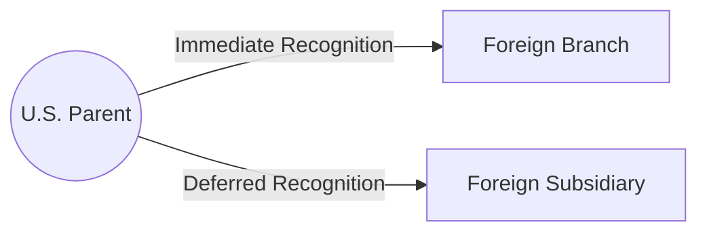

## 14.4 Cross-Border Structuring, Branch vs. Subsidiary, Treaty Positions

Cross-border tax issues have become central to corporate planning in an increasingly globalized commercial environment. Organizations looking to expand overseas, or foreign companies seeking to enter the U.S. market, frequently grapple with a core decision: whether to conduct activities through a foreign branch or through a foreign subsidiary. Each approach carries distinct tax implications, both in the immediate recognition of income for U.S. tax purposes and under relevant tax treaties that define the contours of “permanent establishment” (PE). From a U.S. CPA perspective, these considerations are not only crucial for compliance but also for effective tax planning. This section explores the advantages and disadvantages of each structure, with special emphasis on immediate vs. deferred profit recognition, permanent establishment rules, and related treaty positions.

---

### Cross-Border Overview and Key Terminology

A “branch” is an extension of a U.S. entity into a foreign jurisdiction; it is not a separate legal entity for U.S. tax purposes but may be treated as such under foreign local law. Conversely, a “foreign subsidiary” is typically a separate legal entity formed under local foreign law and—by default—taxed as a corporation in the United States unless a check-the-box election is made to treat it differently. These structural differences can have profound impacts on how and when income is recognized, the availability of foreign tax credits (FTCs), and overall compliance and reporting burdens.

#### Key Concepts

• Immediate Tax Inclusion: Branch income is generally included currently in the U.S. entity’s tax return.  
• Deferred Taxation: Subsidiary earnings may be deferred until repatriated or triggered under certain anti-deferral rules (e.g., Subpart F, Global Intangible Low-Taxed Income—GILTI).  
• Permanent Establishment (PE): A concept within tax treaties that typically refers to a fixed place of business through which a nonresident enterprise carries out business. If a PE is deemed to exist, the host country generally has the right to tax the profits attributable to that PE.  

---

### Distinguishing a Foreign Branch from a Foreign Subsidiary

While the distinction may sound straightforward, recognizing the differences carries significant implications for both immediate U.S. tax liability and cross-border planning.

#### Foreign Branch

1. Tax Treatment in the U.S.:  
   • A foreign branch’s income is included in the U.S. entity’s return in the year it is earned.  
   • The foreign tax credit (FTC) may be available to mitigate double taxation on branch earnings, subject to limitations.  
   • Losses from a foreign branch also flow through directly, potentially offsetting the U.S. parent’s domestic income (with certain limitations).  

2. Tax Treatment in the Foreign Jurisdiction:  
   • The foreign country typically taxes the profits generated by the branch. These taxes can often be claimed as credits in the U.S. return if the relevant conditions are met.  

3. Reporting Requirements:  
   • Income from the branch must be separately tracked and reported on forms such as Form 8858 (Information Return of U.S. Persons With Respect to Foreign Disregarded Entities and Foreign Branches).  
   • There may also be local GAAP or IFRS reporting obligations in the foreign country.  

4. Benefits and Drawbacks:
   • Benefit: Automatic use of branch losses in the U.S. return (subject to limitations) can reduce overall U.S. tax.  
   • Drawback: Branch-level income is recognized immediately in the U.S., resulting in fewer deferral opportunities.  
   • Drawback: The foreign jurisdiction may have additional branch-level taxes, sometimes called “branch profit taxes,” that replicate dividend withholding taxes that would apply to a subsidiary.  

#### Foreign Subsidiary

1. Tax Treatment in the U.S.:  
   • A foreign subsidiary’s earnings often remain outside the U.S. tax base until repatriated in the form of dividends, subject to anti-deferral regimes such as Subpart F, GILTI, and possibly passive foreign investment company (PFIC) rules.  
   • Dividends paid to a U.S. corporation might be eligible for a 100% participation exemption (under IRC §245A) if certain ownership thresholds and holding requirements are met and if the subsidiary meets certain “qualified foreign corporation” criteria.  

2. Tax Treatment in the Foreign Jurisdiction:
   • The subsidiary is usually taxed as a local corporation in the foreign country.  
   • Depending on local law, the foreign subsidiary may be subject to lower rates or unique incentives (e.g., special economic zones, tax holidays).  

3. Reporting Requirements:
   • U.S. owners generally file information returns such as Form 5471 (Information Return of U.S. Persons With Respect to Certain Foreign Corporations).  
   • Complex calculations under the GILTI and Subpart F frameworks require ongoing attention to ensure accurate and timely filings.  

4. Benefits and Drawbacks:
   • Benefit: Potential deferral of U.S. taxation until repatriation, absent anti-deferral provisions.  
   • Benefit: Local legal separation, potentially shielding the U.S. parent from certain foreign liabilities.  
   • Drawback: Complexity of Subpart F, GILTI, and other anti-deferral regimes may reduce or eliminate the deferral benefit.  
   • Drawback: Repatriation planning becomes more complicated, including analyzing withholding taxes on dividends.  

---

### Immediate Inclusion vs. Deferred Recognition

A critical factor in the branch vs. subsidiary decision is the timing of income inclusion for U.S. tax purposes. A foreign branch yields immediate inclusion, meaning that as soon as there is net income, it flows through to the U.S. entity’s tax return. This can be particularly beneficial if the foreign branch is initially operating at a loss, as those losses can reduce current U.S. taxable income. However, once the branch becomes profitable, there is no deferral mechanism; income is recognized right away.

In contrast, a subsidiary can enjoy tax deferral—at least on paper—by retaining profits offshore. However, in the post–Tax Cuts and Jobs Act (TCJA) environment, GILTI limits the extent of that deferral by subjecting a significant portion of the subsidiary’s low-taxed foreign earnings to immediate U.S. taxation. Nonetheless, strategic tax jurisdictions and careful entity classification can provide advantages if properly structured within legal constraints.

---

### Permanent Establishment (PE) and Treaty Considerations

Cross-border transactions often hinge on tax treaties and their definitions of permanent establishment. The OECD Model Tax Convention broadly defines a PE as a “fixed place of business through which the business of an enterprise is wholly or partly carried on.” Typically, once a PE is established in a foreign jurisdiction:

1. The host country obtains taxing rights over the profits attributable to that PE.  
2. Certain treaty benefits may be adjusted or lost, particularly if specific requirements are not met.  
3. Local administrative obligations (e.g., local corporate filings, VAT registrations) multiply.

#### PE Triggers and Structuring for Minimization

• Fixed Place of Business: A physical office, factory, or location can trigger PE.  
• Dependent Agents: If a local agent habitually finalizes contracts in the name of the foreign enterprise, this can create a PE.  
• Construction or Project PEs: Certain treaties specify time thresholds—often 6 to 12 months—for construction sites or projects.  

In some cases, operating through a foreign subsidiary, rather than a branch, can minimize the reach of the permanent establishment rules by situating business operations in a separate entity. The subsidiary is a “resident” of the foreign country, and the PE determination typically does not pass through to the U.S. parent unless treaty or domestic anti-avoidance rules specify otherwise.

---

### Practical Scenarios and Case Illustrations

Below is a simplified flowchart contrasting a foreign branch structure with a foreign subsidiary structure:

• In a branch scenario, the U.S. parent’s global tax return picks up the branch’s net income or loss, and the parent might benefit from foreign tax credits against foreign income tax paid.  
• In a subsidiary scenario, the U.S. parent might defer U.S. tax on income until either repatriated as a dividend or deemed distributed under Subpart F/GILTI.  

#### Example 1: Small Tech Startup

A small U.S.-based tech startup sets up a branch in Country X to explore market opportunities. Initially, the branch is unprofitable due to heavy research and development expense overseas. Because it is a branch, losses flow through to the U.S. parent, offsetting the U.S. income in the early phase. By the time the branch becomes profitable, the startup has already used the significant upfront losses to reduce U.S. taxes.

#### Example 2: Mature Manufacturing Company

A large manufacturing firm decides to set up a foreign subsidiary in Country Y, known for favorable corporate tax rates. The subsidiary is profitable from its first year, but under GILTI, a portion of those earnings may still be included in the U.S. parent’s return. However, by leveraging local research and development tax credits and transferring intangible property with careful adherence to transfer pricing rules, the company reduces its effective rate in Country Y. Once the subsidiary accumulates significant retained earnings, the U.S. parent repatriates earnings in a tax-efficient manner, potentially benefiting from a participation exemption if requirements under IRC §245A are met.

---

### Best Practices in Cross-Border Structuring

• Conduct a Thorough Legal Entity Analysis: Revisit the formation approach (C corporation vs. pass-through, check-the-box elections, etc.) to ensure alignment with both U.S. and foreign jurisdiction goals.  
• Evaluate the PE Threshold Risk: Physical offices, agents, and contract-signing authority can unexpectedly trigger PEs. Carefully craft operating procedures that minimize inadvertent PE exposure.  
• Examine Local Tax Incentives: Some jurisdictions provide specialized tax holidays, reduced rates for technology firms, or other incentives that may favor a subsidiary model.  
• Understand Anti-Deferral Rules: Subpart F and GILTI regulations can erode the traditional benefits of foreign deferral. Model out how statutory tax rates, foreign tax credits, tested income, qualified business asset investment (QBAI), and more interplay in your organizational structure.  
• Mitigate Double Taxation Through Treaties: Carefully utilize relevant income tax treaties to reduce withholding rates, claim tax credits, and avoid double taxation on cross-border flows of dividends, interest, or royalties.  
• Plan Withholding Taxes and Repatriation: Even if you achieve deferral at the U.S. level, pay attention to local withholding taxes on dividends and other distributions. Treaty rates or comprehensive planning can substantially impact the ultimate global effective tax rate.  
• Manage Compliance Obligations: Monitor forms like 5471, 8858, 8865, 8992 (for GILTI), and 8993 (for FDII) to avoid steep penalties.  

---

### Common Pitfalls and Challenges

1. Overlooking Local Law Requirements: Even if the U.S. treats an entity as a “branch,” local jurisdictions may demand corporate registrations, local directorships, or separate accounting.  
2. Inadvertent PE Creation: Sales or support staff authorized to negotiate contracts can trigger a PE, leading to unexpected foreign tax obligations and potential treaty violations.  
3. Mismanagement of Transfer Pricing: Improper intercompany pricing can result in double taxation disputes or adjustments by tax authorities.  
4. NAFTA/USMCA and Other Regional Agreements: Certain regional trade agreements may impose additional layers of complexity for cross-border transactions.  
5. Over-Reliance on Deferral: With post-TCJA mechanisms like GILTI, the benefits of offshore deferral may be significantly reduced—and complicated.  

---

### Diagrams and Tables

Below is a simplified comparison table to highlight the pros and cons of each approach:

| Attribute                        | Foreign Branch                              | Foreign Subsidiary                            |
|---------------------------------|---------------------------------------------|------------------------------------------------|
| U.S. Tax Recognition            | Immediate                                   | Generally deferred, subject to GILTI/Subpart F |
| Loss Utilization                | Flow-through to offset U.S. income          | Remains abroad unless specific planning used   |
| Administrative Complexity       | Moderate (branch-level filings)             | Higher (subsidiary-level filings, forms 5471)  |
| Liability Protection            | None (branch is extension of parent)        | Yes (legal separation from U.S. parent)        |
| Potential for Permanent Establishment | Almost certain branch-level PE risk         | Typically recognized as local resident entity  |
| Withholding on Repatriations    | Not applicable; no dividend distribution    | Potential local withholding on dividends       |

---

### Strategic Insights on Permanent Establishment

A decisive element for cross-border operations is whether and how you trigger permanent establishment status in a foreign jurisdiction. While branches almost always confer PE status if they regularly conduct business, subsidiaries are often recognized as distinct from the U.S. parent for income-tax purposes. Nonetheless, if the parent exerts significant managerial control or if employees in the foreign country act as dependent agents of the U.S. parent, local authorities may still argue a PE exists separate from the subsidiary. This underscores the importance of carefully structuring intercompany agreements (e.g., service contracts, distribution agreements) to avoid inadvertently creating a PE.

---

### Case Study: U.S. Parent Expanding into Europe

Suppose a U.S. parent corporation (a large manufacturer) is exploring an expansion into the European market. It can either:

• Establish a branch in Germany.  
• Incorporate a German subsidiary (often a GmbH) subject to local corporate taxation.

In both cases, Germany will impose corporate or branch tax on German-sourced profits. However, under the U.S.-Germany tax treaty, the subsidiary may provide certain relief from double taxation, and the withholding tax on dividends from Germany to the U.S. might be reduced from the statutory domestic rate to the treaty rate (often 5% or zero if certain ownership thresholds are met). Under a branch structure, Germany may impose an additional “branch profits tax” akin to the dividend withholding that would have applied to a subsidiary.

For the U.S. perspective, if a branch operates at a profit, the U.S. parent recognizes that income in the current year. Should Germany’s effective tax rate be high enough, the parent may credit those taxes against its U.S. liability. A subsidiary scenario would likely push the question of U.S. taxation out until repatriation (unless GILTI triggers earlier inclusion). In choosing between branch vs. subsidiary, the manufacturer would weigh:

• The local effective rate in Germany.  
• The possibility and complexity of GILTI inclusions.  
• The administrative burden of forming and maintaining a separate entity.  
• The degree of liability protection desired.  

---

### Practical Takeaways and Summary

Cross-border structuring demands a holistic view, intertwining local legal requirements, U.S. tax laws, and bilateral or multilateral treaty positions. In deciding between a branch and a subsidiary:

• Examine short-term vs. long-term profit/loss projections.  
• Factor in local corporate tax rates vs. the U.S. foreign tax credit regime.  
• Evaluate liability exposure, compliance demands, and operational control needs.  
• Assess the risk of permanent establishment under both a domestic law perspective and relevant tax treaties.  
• Model potential GILTI or Subpart F inclusions against the benefit of deferral or local incentives.  

Armed with a thorough understanding of these principles, CPAs can guide their clients or employers in choosing structures best suited for the entity’s strategic goals while maintaining compliance and reducing the global effective tax rate.

---

### References and Further Reading

• IRS Publication 597: Information on the United States–Canada Income Tax Treaty  
• OECD Model Tax Convention on Income and on Capital  
• IRC §§ 851–860, 901–909 (Foreign Tax Credit)  
• IRC §§ 951–965 (Subpart F and GILTI provisions)  
• AICPA’s Tax Section Library for Cross-Border Transactions  
• Official Tax Authority Websites in Foreign Jurisdictions (for local law guidance)

---

## Test Your Knowledge: Cross-Border Branch vs. Subsidiary Quiz for CPAs



### A U.S. corporation operating through a foreign branch generally:
- [x] Recognizes the foreign branch’s income on its U.S. tax return as it is earned.  
- [ ] Defers taxation until dividends are repatriated.  
- [ ] Faces no permanent establishment risk if it has local employees.  
- [ ] Does not need to file any foreign information returns.  

> **Explanation:** With a branch, the U.S. parent is taxed on worldwide income, including the branch’s current year profit or loss. The deferral of income is typically unavailable unless structured otherwise, and having local employees who conduct business typically triggers a permanent establishment in the host country.  

### Which of the following is an advantage of operating through a foreign subsidiary, rather than a branch?
- [x] Potential deferral of U.S. taxation until dividends are paid, subject to anti-deferral rules.  
- [ ] Automatic application of foreign tax credits to eliminate all double taxation.  
- [x] Enhanced legal liability protection for the U.S. parent.  
- [ ] Elimination of the need to file information returns such as Form 5471.  

> **Explanation:** A subsidiary can offer deferral of some U.S. tax liabilities (though limited by GILTI and Subpart F) and provides a legal shield. However, foreign information returns—particularly Form 5471—are required, and foreign tax credits can only be used under certain limitations, so they do not automatically eliminate all double taxation.  

### “Permanent establishment” is generally defined as:
- [x] A fixed place of business through which the business of an enterprise is carried on.  
- [ ] Any ownership interest above 50% in a foreign entity.  
- [ ] An action by a U.S. parent to open a non-operational branch.  
- [ ] A status that exempts a taxpayer from local tax in the host country.  

> **Explanation:** Under most international tax treaties, permanent establishment hinges on a fixed place of business or a dependent agent habitually concluding contracts, which grants the host country taxing rights on attributable profits.  

### In a foreign subsidiary context, GILTI rules:
- [x] Subject a portion of the subsidiary’s earnings to current U.S. taxation if the foreign effective tax rate is below a certain threshold.  
- [ ] Completely protect foreign subsidiary income from U.S. taxation until repatriation.  
- [ ] Replace all Subpart F rules.  
- [ ] Allow a 0% effective tax rate on all foreign income.  

> **Explanation:** The GILTI regime effectively limits the benefits of indefinite deferral by taxing certain low-taxed foreign earnings on a current basis, coexisting with Subpart F and not replacing it entirely.  

### Which of the following best describes a benefit of structuring as a foreign branch during initial years of operation?
- [x] Losses from the branch can offset the U.S. parent’s domestic income.  
- [ ] The branch’s income does not need to be aggregated with the parent’s.  
- [x] None of the branch’s net operating losses expire.  
- [ ] The foreign tax authority cannot levy taxes against the branch.  

> **Explanation:** A foreign branch’s losses can offset the U.S. parent’s income (subject to certain limitations), thereby reducing the overall U.S. tax bill in early years. However, branches must typically abide by local tax regulations and pay local taxes where applicable.  

### If a foreign branch becomes profitable, a downside for the U.S. parent is:
- [x] Immediate inclusion of that branch profit in U.S. taxable income.  
- [ ] No foreign tax credit availability.  
- [ ] No indirect expenses can be allocated to the branch.  
- [ ] Automatic GILTI inclusion only upon dividend distribution.  

> **Explanation:** Once a branch is profitable, it does not enjoy any deferral. The U.S. parent must recognize that income in the current tax year. Foreign tax credits may still apply, subject to limitations.  

### A principal difference between opening a branch and a subsidiary is:
- [x] The local liability protection offered by a subsidiary.  
- [ ] That a branch is always formed under local law as a corporation.  
- [x] That a U.S. parent can offset branch losses immediately.  
- [ ] Neither structure triggers any form of permanent establishment.  

> **Explanation:** A subsidiary is a separate legal entity under local law, offering liability protection, whereas a branch is an extension of the parent. A branch’s losses can offset the parent’s income immediately, but both structures can lead to permanent establishment status under different circumstances.  

### Under a typical U.S. tax treaty, a dependent agent:
- [x] May trigger a permanent establishment if empowered to conclude contracts on behalf of the enterprise.  
- [ ] Eliminates permanent establishment risk altogether.  
- [ ] Always qualifies the business for a zero withholding rate.  
- [ ] Exempts the U.S. parent from filing any foreign returns.  

> **Explanation:** Even if a business does not have a physical office in the foreign country, a dependent agent who routinely concludes contracts in that country on the company’s behalf can create a permanent establishment, leading to local tax obligations.  

### Which statement about branch profit taxes is correct?
- [x] Some jurisdictions impose a branch profits tax to mimic withholding taxes on dividends in a subsidiary scenario.  
- [ ] They only apply to branches with net losses.  
- [ ] A branch profits tax is always refunded by the U.S. via foreign tax credits.  
- [ ] They are entirely avoided if a foreign subsidiary structure is chosen.  

> **Explanation:** Many jurisdictions levy an additional branch profits tax on branch earnings to mirror the tax that would otherwise be charged on dividends if the business were organized as a local subsidiary. Foreign tax credits may or may not be available to offset this, depending on treaty provisions and U.S. regulations.  

### Cross-border expansions may still benefit from deferral via subsidiaries, but CPAs must remain aware of:
- [x] Anti-deferral provisions such as GILTI, Subpart F, and local withholding taxes on repatriations.  
- [ ] The complete absence of local taxes in any foreign jurisdiction.  
- [ ] Permanent establishment status never applying to a corporation.  
- [ ] The foreign jurisdiction’s guaranteed zero rate on all business profits.  

> **Explanation:** Although deferral is possible through a subsidiary, complexities from GILTI, Subpart F, local withholding, and other anti-deferral rules often limit or eliminate traditional deferral benefits.  



---

## For Additional Practice and Deeper Preparation

**[TCP CPA Hardest Mock Exams: In-Depth & Clear Explanations](https://www.udemy.com/course/tcp-cpa-mock-exams/?referralCode=675149871D0E79B1699C)**  

**Tax Compliance & Planning (TCP) CPA Mocks:** 6 Full (1,500 Qs), Harder Than Real! In-Depth & Clear. Crush With Confidence!

- Tackle full-length mock exams designed to mirror real TCP questions.  
- Refine your exam-day strategies with detailed, step-by-step solutions for every scenario.  
- Explore in-depth rationales that reinforce higher-level concepts, giving you an edge on test day.  
- Boost confidence and minimize anxiety by mastering every corner of the TCP blueprint.  
- Perfect for those seeking exceptionally hard mocks and real-world readiness.

_Disclaimer: This course is not endorsed by or affiliated with the AICPA, NASBA, or any official CPA Examination authority. All content is for educational and preparatory purposes only._
