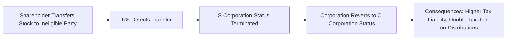
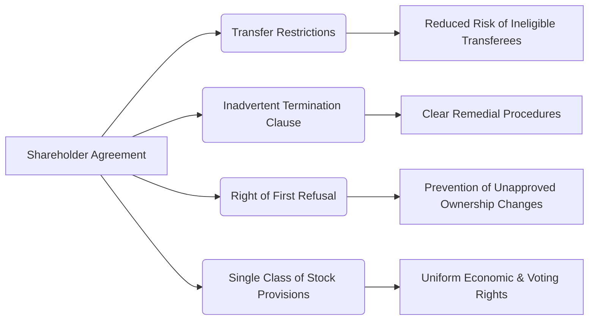

## 15.1 Avoiding Inadvertent Terminations, Updating Shareholder Agreements

S corporations enjoy a variety of tax advantages and operational flexibilities, making them a popular choice for small-to-mid-sized businesses. However, these perks come with strict eligibility requirements under the Internal Revenue Code (IRC). Even minor oversights—such as admitting an impermissible shareholder, unintentionally creating a second class of stock, or failing to properly document shareholder agreements—can lead to an inadvertent termination of S corporation status. In this section, we explore how to avoid such pitfalls and maintain compliance with relevant regulations. We also discuss practical steps to update shareholder agreements to protect your S corporation election.

This chapter builds upon concepts introduced in Chapter 10: S Corporations and integrates advanced planning strategies and real-world examples to solidify your understanding. Whether you are a practicing CPA, a business owner, or a student preparing for the Uniform CPA Examination (Tax Compliance and Planning [TCP] section), familiarity with these rules will help you prevent inadvertent terminations and keep your S corporation clients or companies fully compliant.

---

### The Importance of Maintaining S Corporation Status

S corporations benefit from pass-through taxation, which means corporate income, deductions, and credits flow directly to shareholders, avoiding the double taxation imposed on C corporations. The price for these advantages is strict compliance with certain IRS guidelines:

• Limitation on the number and types of shareholders  
• Restriction to only one class of stock  
• Proper administrative filings, elections, and documentation  

When these rules are violated—intentionally or not—the IRS terminates S corporation status, essentially defaulting the entity back to a C corporation. Such terminations can trigger significant tax ramifications, including higher corporate tax rates and possible double taxation on distributions.

Common causes of inadvertent terminations include:  
• Transfer of shares to an impermissible shareholder (e.g., non-resident aliens, partnerships, certain types of trusts)  
• Exceeding the maximum of 100 shareholders  
• Creating a second class of stock through voting or economic rights that differ among shareholders  
• Failure to maintain compliance with ongoing administrative requirements  

---

### Defining Impermissible Shareholders

Because only eligible shareholders are permitted in an S corporation, owners need to ensure that shares do not fall into the hands of ineligible parties. Permissible shareholders include:

• U.S. citizens or resident individuals  
• Certain types of trusts (e.g., Qualified Subchapter S Trusts [QSST], Electing Small Business Trusts [ESBT])  
• Estates  
• Single-member LLCs treated as disregarded entities owned by a U.S. citizen or resident  

Ineligible shareholders include:

• Non-resident aliens  
• Partnerships  
• Corporations (except in very limited circumstances, such as certain qualified Subchapter S subsidiaries [QSubs])  
• Most LLCs with multiple members (unless each member is otherwise eligible and proper elections are made)  

---

### How Ownership Changes Can Break S Corporation Eligibility

Below are some typical—but often overlooked—scenarios that can inadvertently terminate an S corporation election:

1. **Transfer of Stock in a Will or Trust**  
   When a shareholder passes away, their shares may transfer to a trust or heir. If the trust receiving the shares is not structured as a QSST, ESBT, or grantor trust, or if the heir is a non-resident alien, the company risks losing its S status.

2. **Gifting Shares to Foreign Persons**  
   A well-intentioned gift of stock to a non-resident alien, or conversion of the stock into a joint ownership arrangement with a non-resident spouse, can terminate S status immediately.

3. **Ownership by an Ineligible Entity**  
   If a shareholder invests through a partnership or multi-member LLC—thereby creating a secondary layer of ownership—this can cause a disallowed entity to hold S corporation stock.

4. **Changes in Control that Exceed 100 Shareholders**  
   Rapid growth or multiple rounds of financing may result in additional shareholders. Surpassing the 100-shareholder limit triggers an automatic termination.

5. **Unintentional Creation of a Second Class of Stock**  
   If certain shareholders receive different distribution or liquidation preferences, or if debt instruments are issued with equity-like characteristics, the IRS may view these differences as a second class of stock.

---

### Sample Diagram: Inadvertent Termination Through Transfer to an Ineligible Shareholder

In this diagram, a seemingly simple share transfer can quickly lead to termination if the new owner is ineligible under S corporation rules.

---

### Updating Shareholder Agreements to Prevent Inadvertent Termination

A robust shareholder agreement is a powerful tool to preserve S corporation eligibility. By incorporating specific provisions, the agreement can help ensure that the corporation remains compliant, even as ownership structures evolve.

Key clauses to consider including or updating:

1. **Transfer Restrictions**  
   Set forth limitations on the types of transferees (e.g., U.S. persons, permissible trusts). Provide that any unauthorized transfer is null and void or requires prior board and/or shareholder approval.

2. **Right of First Refusal (ROFR)**  
   Give the corporation or remaining shareholders the right to purchase shares before an external transfer is finalized, preventing distributions to ineligible owners.

3. **Trust Provisions**  
   Require that any trust receiving shares must elect to be a QSST or ESBT (where possible), and clarify administrative procedures for continuing S status.

4. **Inadvertent Termination Remedies**  
   Include a clause calling for immediate correction measures if the S corporation faces termination due to an ineligible shareholder or other disqualifying events.  
   Under §1362(f) of the IRC, the IRS may grant relief if the termination was inadvertent and corrective actions are taken swiftly.

5. **Single Class of Stock Assurance**  
   Language should confirm that all shares bear identical economic and voting rights, ensuring no second-class-of-stock issues emerge.

6. **Provisions for Entity Documentation**  
   Stipulate how the corporation’s board and officers will maintain compliance with state law, IRS regulations, and corporate record-keeping—particularly concerning updated ownership records and timely S corporation elections.

---

### Sample Amendments for Shareholder Agreements

Below is an illustrative snippet of how amendments to a shareholder agreement might read to guard against unintended S corporation terminations. Note that these are general examples and should be reviewed and customized by legal counsel.

• **Prohibition on Transfers to Impermissible Holders**  
  “No shareholder shall transfer, assign, convey, sell, pledge, or otherwise dispose of any shares of Common Stock of the Company to a person or entity that is not an eligible shareholder under Subchapter S of the Internal Revenue Code. Any attempt to so transfer such shares shall be void ab initio and have no force or effect.”

• **Right of First Refusal**  
  “Before transferring any shares, a shareholder (the ‘Transferring Shareholder’) shall first offer such shares to the Company and/or its remaining shareholders on substantially the same terms and conditions, providing written notice inclusive of the proposed price, form of consideration, and intended transferee.”

• **Inadvertent Termination Clause**  
  “If the Company’s status as an S corporation is threatened or rendered void by virtue of a transfer or action by any shareholder or other party, the parties agree to take all necessary actions to remedy the situation, including seeking a private letter ruling, issuing corrective filings, or any other action the Board deems appropriate to maintain or restore the Company’s S corporation status.”

• **Single Class of Stock Provision**  
  “Each share of Common Stock of the Company shall have identical rights with respect to distribution, liquidation, and voting. The Company shall not issue equity instruments or debt obligations that carry separate economic or voting characteristics which could be deemed a second class of stock under applicable Treasury Regulations.”

---

### Case Study: ABC Tech LLC’s Risky Transition to an S Corporation

Consider a fictional technology startup, ABC Tech LLC, converting to an S corporation to attract new investors. Shortly after obtaining S corporation status, a new shareholder (a foreign venture capital firm) acquires a stake in the company. Unbeknownst to ABC Tech, this foreign entity’s structure is deemed ineligible for S corporation ownership.

• **Immediate Problem**: This move triggers an inadvertent termination of the S corporation election.  

• **Compounding Issues**: ABC Tech fails to realize the termination until tax preparation season, six months after the transfer. During this period, distributions to the foreign venture capital firm continued.  

• **Remediation**: Under §1362(f), the company requests relief by demonstrating that the termination was inadvertent and promptly corrects the ownership by redeeming the ineligible shares. The company amends its shareholder agreement to contain stricter transfer provisions, requiring prior written approval from the board to admit any new shareholder.  

• **Outcome**: The IRS grants relief upon being satisfied that ABC Tech took immediate corrective action and that no deduction of tax was circumvented. However, the process was time-consuming and costly, illustrating why preventive measures in the shareholder agreement are essential from the beginning.

---

### Understanding Remedial Measures for Inadvertent Terminations

The IRS permits limited relief for “inadvertent terminations,” provided:

1. The corporation corrects the event that caused termination promptly.  
2. The corporation or shareholders take remedial measures to restore eligibility (e.g., redeeming shares from ineligible holders).  
3. No significant tax benefits were intentionally exploited during the ineligible period.  

Common remedial measures include:  
• **Redeeming the Impermissible Owner’s Shares**. Involves returning capital contributions or transferring ownership to an eligible shareholder.  
• **Filing Amended Returns**. In some instances, the corporation and shareholders may need to file corrected returns for any affected years.  
• **Securing a Private Letter Ruling (PLR)**. A PLR can provide official confirmation that the corrective actions are sufficient to preserve the S election.  

### Best Practices for Continuous Compliance

1. **Periodic Shareholder Eligibility Audits**  
   At least once a year, verify shareholder status to ensure no non-resident aliens, corporations, or prohibited trusts appear in your register.

2. **Update Company Bylaws & Shareholder Agreements Regularly**  
   Reflect changes in tax law and new IRS guidance. Timely updates can prevent structural issues from developing into major legal disputes.

3. **Maintain Ongoing Communication**  
   Educate shareholders on eligibility requirements and the importance of immediate notification if they anticipate any ownership changes.

4. **Implement Structured Buy-Sell Agreements**  
   Minimize risk by controlling the redemption or purchase of shares if one shareholder must exit or if an estate or trust inherits shares.

5. **Consult CPA or Tax Attorney for Complex Transactions**  
   Particularly when dealing with mergers, acquisitions, conversions, securities issuances, or larger funding rounds that could inadvertently violate S corp guidelines.

---

### Visualizing How Shareholder Agreement Provisions Work Together

This diagram captures the crucial elements of a well-drafted shareholder agreement that collectively help secure and maintain S corporation status.

---

### Integrating S Corporation Preservation Measures with Broader Tax Planning

In advanced tax planning, preserving S corporation status ties into the broader objective of optimizing tax outcomes for business owners. Strategies might also include:

• **Reasonable Shareholder Compensation**  
  Ensure that salaries paid to shareholder-employees are neither unreasonably low nor excessively high. Inadvertent terminations sometimes arise when excessive distributions appear as second-class equity preferences.

• **Coordination with Estate Planning**  
  When high-net-worth individuals hold shares, consider estate planning vehicles that align with S corp restrictions to avoid forced redemption or termination.

• **Multi-State Nexus Assessments**  
  If your S corporation operates in multiple states, each jurisdiction’s rules on ownership or tax requirements could prompt additional compliance considerations.

• **Leveraging Qualified Subchapter S Subsidiaries (QSubs)**  
  Certain 100%-owned subsidiaries can maintain separate legal structures but be treated as disregarded for tax purposes, enabling a consolidated approach to tax planning while preserving the single-class-of-stock requirement.

---

### References for Further Exploration

• IRC §1361–§1379 (Subchapter S): Official statutes governing S corporations  
• IRS Publication 589, “Tax Information on S Corporations”  
• Revenue Procedure 2013-30: Guidance on relief for late S corporation elections, ESBT elections, QSST elections, etc.  
• Chapter 10: S Corporations in this book for foundational concepts  
• Chapter 15: Advanced S Corporation Planning (the broader scope of which this section is a part)  

---

## Secure Your S Corporation Status: A Comprehensive Quiz on Avoiding Inadvertent Terminations



### What is a primary cause of S corporation terminations related to share transfers?
- [x] Transferring shares to non-resident aliens or corporations.
- [ ] Failing to pay corporate-level taxes on time.
- [ ] Issuing W-2 forms late for shareholder-employees.
- [ ] Having a shareholder purchase life insurance policies.

> **Explanation:** One of the most frequent causes of inadvertent termination is transferring shares to ineligible persons, such as non-resident aliens or disqualified entities.

### Which of the following trusts can hold S corporation stock without terminating the election?
- [x] QSST (Qualified Subchapter S Trust).
- [ ] A foreign discretionary trust.
- [ ] A trust benefiting multiple non-resident aliens.
- [ ] A general needs trust administered by a foreign trustee.

> **Explanation:** Only specific trusts, such as QSSTs and ESBTs, may hold S corporation shares. General and foreign trusts typically do not qualify.

### Inadvertent terminations can often be remedied by:
- [x] Promptly correcting the disqualifying event and seeking IRS relief under §1362(f).
- [ ] Waiting until the corporation’s next tax filing date to address the issue.
- [ ] Merging into another entity and creating a new operating agreement.
- [ ] Allowing the disqualified status to remain if it reduces overall taxes.

> **Explanation:** The IRC allows for relief if the corporation acts quickly to correct the issue, demonstrates the termination was inadvertent, and did not gain undue tax benefits from the ineligibility period.

### How does a “Right of First Refusal” clause help maintain S corporation status?
- [x] It requires existing shareholders or the corporation to have the first chance to buy shares before an outside party, preventing transfers to ineligible owners.
- [ ] It automatically revokes S corporation status when any share transfer occurs.
- [ ] It ensures shares never change value on the open market.
- [ ] It converts the corporation to an LLC upon each share transfer.

> **Explanation:** A Right of First Refusal helps control who becomes a shareholder, reducing the chance that ineligible parties gain an ownership stake.

### What is the maximum number of shareholders permitted in an S corporation?
- [x] 100
- [ ] 75
- [x] 200
- [ ] No limit, as long as they are U.S. persons

> **Explanation:** The statutory limit for an S corporation is 100 shareholders, though certain family members can be treated as a single shareholder under family attribution rules.

### How can a second class of stock be inadvertently created?
- [x] By offering different economic or voting rights to different groups of shareholders.
- [ ] By filing articles of incorporation in the wrong state.
- [ ] By granting salary bonuses to shareholder-employees.
- [ ] By holding monthly shareholder meetings online.

> **Explanation:** Substantial differences in distribution or liquidation rights may cause the IRS to view a corporation as having more than one class of stock, violating S corporation requirements.

### Which relief option might a corporation pursue if its S status is threatened by a trust beneficiary’s non-resident alien status?
- [x] Redeeming the shares from the trust or adjusting the trust to meet eligibility rules.
- [ ] Dissolving the corporation within the next 90 days.
- [x] Reincorporating as a nonprofit entity.
- [ ] Seeking no remedy and continuing business as usual.

> **Explanation:** The simplest remedy often involves redeeming the impermissible shares or restructuring the trust to qualify (e.g., electing QSST or ESBT status).

### Which strategy can help a company proactively identify S corporation compliance issues?
- [x] Periodic shareholder eligibility audits.
- [ ] Only reviewing corporate tax returns every five years.
- [ ] Eliminating all references to S corporation status in governance documents.
- [ ] Transferring shares internationally whenever possible.

> **Explanation:** Conducting regular shareholder eligibility checks ensures that no impermissible holders sneak in, thus preventing inadvertent terminations.

### What is the purpose of an Inadvertent Termination Clause in a shareholder agreement?
- [x] To outline immediate corrective measures and maintain or restore the S election if a terminating event occurs.
- [ ] To automatically convert the corporate form to an LLC upon a transfer.
- [ ] To suspend shareholder voting rights indefinitely.
- [ ] To waive the corporation’s obligation to file annual tax returns.

> **Explanation:** An Inadvertent Termination Clause spells out how the corporation and shareholders must respond if any action jeopardizes S status, reducing confusion and potential tax liability.

### If a shareholder passes away and leaves stock to a non-resident alien heir, the S corporation:
- [x] Risks immediate involuntary termination unless corrective actions are taken.
- [ ] Automatically continues its S election due to the estate’s involvement.
- [ ] Increases its shareholder limit by one under family rules.
- [ ] Must rely on the courts to invalidate the stock transfer.

> **Explanation:** Non-resident aliens are ineligible shareholders, causing termination if immediate corrective steps (e.g., share redemption or reallocation) are not taken.



---

## For Additional Practice and Deeper Preparation

**[TCP CPA Hardest Mock Exams: In-Depth & Clear Explanations](https://www.udemy.com/course/tcp-cpa-mock-exams/?referralCode=675149871D0E79B1699C)**  

**Tax Compliance & Planning (TCP) CPA Mocks:** 6 Full (1,500 Qs), Harder Than Real! In-Depth & Clear. Crush With Confidence!

- Tackle full-length mock exams designed to mirror real TCP questions.  
- Refine your exam-day strategies with detailed, step-by-step solutions for every scenario.  
- Explore in-depth rationales that reinforce higher-level concepts, giving you an edge on test day.  
- Boost confidence and minimize anxiety by mastering every corner of the TCP blueprint.  
- Perfect for those seeking exceptionally hard mocks and real-world readiness.

_Disclaimer: This course is not endorsed by or affiliated with the AICPA, NASBA, or any official CPA Examination authority. All content is for educational and preparatory purposes only._
