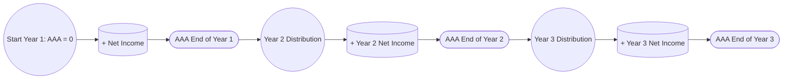

## 15.2 Built-In Gain Timing & Monitoring AAA vs. E&P for Distributions

This section provides an in-depth look at the built-in gain (BIG) rules applicable to S corporations, with a particular focus on the timing of recognition and the technicalities of maintaining and monitoring the Accumulated Adjustments Account (AAA). We will also compare and contrast how AAA interacts with Earnings & Profits (E&P) inherited from a corporation’s predecessor C corporation days, important distribution sequencing rules, and crucial practical scenarios.

S corporations that have converted from C corporation status (or otherwise hold assets with built-in gains at the time of an S election) face unique complexities regarding the taxation of those gains. The recognition of built-in gains within the applicable recognition period triggers additional taxes often perceived as a “corporate-level” tax. From a distribution standpoint, when an S corporation has both AAA (accumulated adjustments from after the S election) and E&P (earnings that originated under C corporation rules), the order in which distributions are deemed to come out is significant. This order determines whether such distributions are tax-free, taxed at capital gain rates, or treated as dividends. Mastery of these concepts is essential for effective tax planning.

--------------------------------------------------------------------------------

### Overview of the Built-In Gain (BIG) Concept

Under Internal Revenue Code (IRC) §1374, S corporations that were formerly C corporations, or that acquired assets with built-in gain, may be subject to tax at the corporate level if they dispose of those assets during a statutorily defined recognition period—often referred to as the BIG recognition period. Key highlights:

• BIG recognition period: Generally five years (subject to changes by various legislative acts).  
• The built-in gain: Calculated as the excess of fair market value (FMV) over the adjusted basis of assets on the date of the S election (or the date the assets were acquired if transferred from a C corporation).

Whenever the S corporation recognizes a BIG (e.g., by selling an appreciated asset), it may trigger corporate-level tax, typically at the highest corporate rate for that year on the recognized gain up to the amount of net unrealized built-in gain that existed on the conversion date. This concept ensures that any appreciation that arose during C corporation years does not fully escape corporate taxation merely by making an S corporation election.

---

### Timing of Recognition and Planning Considerations

The timing aspect is crucial because:

1. If a disposition of assets with built-in gains occurs within the five-year recognition period, the S corporation could be subjected to built-in gain tax.  
2. If the assets are held beyond the recognition period, any sales or dispositions thereafter typically avoid that extra corporate-level tax.

A well-advised approach often involves deferring certain asset sales until the recognition period has expired. However, business exigencies (e.g., urgent capital needs, offers too good to refuse, or asset obsolescence) sometimes override deferral strategies. Seasoned tax planning requires balancing potential corporate-level tax with the broader strategic goals of the business and its shareholders.

---

### Monitoring Built-In Gains Over Multiple Years

Since the BIG tax does not necessarily apply to all recognized gains in a single year, corporations with large amounts of built-in gains may see partial realizations of those gains over multiple tax years. Being mindful of:

• Ongoing netting: Gains and losses recognized throughout a single tax year can offset each other in determining net recognized built-in gain.  
• NOL carryforwards and business credits: Some corporations can use pre-S NOLs or tax credits to partially reduce the BIG tax, though rules vary on how these attributes may be used.

This multi-year monitoring demands thorough recordkeeping for each asset’s basis, fair market value at election date, subsequent capital improvements, depreciation recapture potential, and partial dispositions (e.g., condemnation or casualty event proceeds).

---

### The Accumulated Adjustments Account (AAA) Fundamentals

The Accumulated Adjustments Account (AAA) is a critical component in understanding how shareholder-level taxes on S corporation distributions are applied. Key points:

• AAA reflects the accumulated (post S election) undistributed income or loss of the S corporation.  
• Additions to AAA include the corporation’s taxable income, tax-exempt income, and other taxable events passing through to shareholders.  
• Subtractions to AAA include distributions, separately stated deduction items, and nondeductible expenses that do not affect a shareholder’s stock basis (e.g., certain fines or penalties).  

AAA is generally adjusted at the end of each taxable year. However, for distribution ordering purposes, current-year items are often taken into account to determine the AAA balance immediately prior to the distribution.

---

### Comparing AAA vs. E&P

An S corporation may carry over E&P from its previous life as a C corporation, or it may inherit E&P via certain corporate reorganizations. E&P is governed largely by C corporation rules and measures the earnings deemed available for dividends. While AAA is an S corporation-specific concept, E&P is a broader notion affecting how distributions are classified:

1. Distributions from AAA (assuming the shareholder has sufficient stock basis) are generally tax-free to the shareholder up to the shareholder’s stock basis.  
2. Distributions in excess of AAA but out of E&P are taxed as dividends to shareholders.  
3. Any excess distributions beyond both AAA and E&P reduce the shareholder’s stock basis, and once that basis is exhausted, any further amounts become capital gain.

This layering approach is particularly significant when an S corporation with a positive AAA also has E&P from prior C corporation years.

---

### Ordering of Distributions When Both AAA and E&P Exist

Under IRC §1368 and associated regulations, the ordering rules for S corporation distributions when both AAA and E&P balances exist, in simplified form, are:

1. Distributions first come out of AAA (to the extent of AAA).  
2. Next, if the corporation has E&P, distributions from E&P are taxed as ordinary dividends unless a special election is made to “skip” AAA under certain rules.  
3. Finally, once AAA and E&P are fully distributed, any further distributions reduce the shareholder’s basis, and amounts exceeding basis are reflected as capital gain.

These default rules can be modified by certain elections (e.g., Treas. Reg. §1.1368-1(f)(2) “Ordering Election”), which allow the corporation to distribute from E&P first. Such an election may be employed tactically in scenarios where distributing from E&P first provides some advantage—often to preserve AAA for strategic reasons.

---

### Multi-Year AAA Tracking with E&P: Illustrative Example

A fundamental challenge is keeping track of AAA and E&P over multiple years. Below is a simplified numeric scenario illustrating various distribution events:

• Year 0 (S Election Effective):   
  – S Corp. has $200,000 of undistributed E&P from prior C years.  
  – AAA = $0 at start of S election.  

• Year 1:  
  – S Corp. earns $150,000 of taxable income (passes through to shareholders).  
  – No distributions yet.  
  – End of Year 1: AAA = $150,000; E&P (unchanged) = $200,000.

• Year 2:  
  – S Corp. has $50,000 net taxable income.  
  – S Corp. makes a $100,000 distribution to shareholders.  

  Step-by-step distribution analysis:  
  1. AAA at the beginning of Year 2 is $150,000. Add the current-year income ($50,000) for distribution ordering, giving a total AAA of $200,000 as of distribution date.  
  2. The $100,000 distribution is deemed to come out of AAA first (up to $200,000). Therefore, no portion is drawn from E&P in this distribution.  
  3. Post-distribution, AAA = $100,000 (i.e., $200,000 – $100,000), and E&P remains $200,000.  

• Year 3:  
  – S Corp. has $40,000 net taxable income.  
  – S Corp. makes an $250,000 distribution.  

  Step-by-step distribution analysis:  
  1. AAA at the beginning of Year 3 is $100,000. Add the current-year income ($40,000) for distribution ordering, giving $140,000.  
  2. Distributions first reduce AAA ($140,000), leaving $110,000 of the distribution to come out of remaining accounts.  
  3. Next, because the corporation still has $200,000 of E&P, the next $110,000 comes out of E&P and is generally taxed as a dividend.  
  4. End of Year 3: AAA is zero and E&P is $90,000 ($200,000 – $110,000 distribution from E&P).  

In this multi-year example, the corporation had a dynamic AAA that was replenished annually by S corporation income and depleted by distributions. The presence of E&P from C corporation years only became relevant to the extent the distributions exceeded AAA at the time of distribution.

---

### Built-In Gains Impact Within the AAA and E&P Framework

When an S corporation recognizes a built-in gain during the recognition period, that gain:

1. Increases AAA (since corporate-level taxes on the BIG reduce AAA, but the net recognized gain flows through).  
2. May trigger a corporate-level tax that effectively reduces the AAA, because corporate-level taxes paid by an S corporation reduce the corporation’s AAA to the extent they are attributable to S income.  

Understanding how the built-in gain and the associated corporate-level tax interplay with AAA is crucial since both the recognized gain (increasing pass-through income) and the tax paid at the corporate level (reducing AAA) offset. This interplay can get intricate, especially if multiple BIG dispositions occur in a single year, or if the corporation realized a net built-in loss from other transactions that offset part of its recognized built-in gains.

---

### Diagram: Distribution Ordering with AAA and E&P

Below is a simplified Mermaid diagram that visually represents the distribution ordering hierarchy when AAA and E&P coexist. The topmost node represents the distribution, which flows first to AAA, then to E&P, and if both are depleted, to a return of basis and capital gains.

Explanation:  
• The S corporation distribution is allocated to AAA first.  
• If there is sufficient AAA, the distribution ends there (assuming the shareholder also has sufficient basis).  
• If not, it proceeds and is deemed distributed out of E&P, generally treated as dividend income.  
• Only after both AAA and E&P are exhausted do we reduce the shareholder’s stock basis.  
• Any amount beyond remaining stock basis is treated as capital gain.

---

### Common Pitfalls and Best Practices

1. **Neglecting the Recognition Period**: An S corp can inadvertently trigger a BIG tax if it disposes of appreciated property within the five-year window. Always track the timeline from the date of S election or asset acquisition.  

2. **Insufficient AAA Recordkeeping**: Failure to maintain proper AAA records can lead to disputes or misclassifications of distributions, resulting in potential double taxation. Use consistent schedules or tax software to reconcile AAA each year.  

3. **Distribution Timing**: Excessive distributions in a year with minimal AAA can lead to inadvertently tapping into E&P or the shareholder’s stock basis, increasing or accelerating shareholders’ taxable income.  

4. **Forgetting the Interplay of Corporate Taxes**: If the S corporation pays corporate-level built-in gain tax, it reduces AAA. Corporations must accurately calculate the net pass-through effect.  

5. **Not Considering Special Elections**: In certain cases, electing to treat a distribution as coming from E&P first might present strategic benefits (e.g., to preserve AAA for a subsequent distribution or to leverage certain shareholder-level tax preferences).  

6. **Mismatching Income and Distribution**: For distribution ordering, the S corporation can consider (and must properly reflect) the current-year income in AAA before making a distribution. This synchronization helps avoid prematurely depleting AAA.  

---

### Distribution Scenarios When Both AAA and E&P Exist

Below are a few distribution scenarios that illustrate the interplay among AAA, E&P, and stock basis:

#### Scenario 1: AAA is Sufficient

• AAA: $300,000, E&P: $200,000, Stock Basis per Shareholder: $200,000.  
• Distribution of $100,000 is made.  
• All $100,000 is deemed to come from AAA, producing no dividend. Each shareholder’s basis is reduced by their pro rata share, but remains above zero. E&P remains untouched at $200,000.

#### Scenario 2: AAA is Partially Sufficient

• AAA before distribution: $50,000, E&P: $200,000, Stock Basis per Shareholder: $80,000.  
• Distribution of $120,000 is made.  
• First $50,000 is deemed from AAA (tax-free up to basis).  
• Next $70,000 is deemed from E&P and taxed as a dividend to shareholders.  
• Stock basis is reduced by $50,000 to $30,000 remaining. The portion characterized as a dividend does not reduce stock basis.  

#### Scenario 3: AAA is insufficient, E&P is Exhausted

• AAA before distribution: $20,000, E&P: $10,000, Stock Basis: $40,000.  
• Distribution of $60,000 is made.  
• First $20,000 from AAA (tax-free up to $20,000).  
• Next $10,000 from E&P (dividend).  
• Remaining $30,000 distribution: reduce basis further by $20,000 until basis is $0, and the last $10,000 is capital gain.  

Shareholders should always verify each layer’s tax treatment, mindful of basis limitations and potential capital gain triggers.

---

### Multi-Year AAA Tracking in Practice

S corporations often face multiple distribution events within a single year or across multiple years with differing profit levels. In practice, each year might involve repeated steps:

1. Start with prior year-end AAA.  
2. Increase AAA by current-year net income (or decrease if there is a loss).  
3. Decrease AAA by distributions, nondeductible expenses, built-in gain taxes, and other adjustments.  
4. Keep track of E&P from prior C years—only adjusted if specific American Jobs Creation Act or subsequent legislative changes recharacterize or push E&P adjustments, or if dividends are paid out.  

Comprehensive, consistent schedules that track year-by-year changes to AAA and E&P will help avoid confusion and ensure distributions are accounted for correctly.

---

### Case Study: Preserving AAA Through Tax Planning

Imagine an S corporation with a large built-in gain asset approaching the end of its five-year recognition period. Management is weighing selling the asset now or waiting for the recognition period to expire. Key considerations:

• If sold within the recognition period, the corporation faces a built-in gain tax. This reduces AAA in the year of sale. The net pass-through might be smaller than expected, limiting tax-free distributions.  
• If the corporation can delay the sale just beyond the recognition period, the transaction will bypass corporate-level built-in gain tax, leading to a larger increase in AAA when the gain is recognized in an S year without a corporate-level tax. This bigger AAA increment can support larger tax-free distributions.  

Therefore, by aligning the sale of appreciated property with the expiration of the recognition period, the shareholders could see significantly more net benefit. The AAA at year-end would be higher, preserving additional capacity for distributions without tapping into E&P or capital gains. Of course, this presumes that the corporation can responsibly delay the sale without harming its broader business strategy.

---

### Visualizing Multi-Year AAA Changes

Below is another Mermaid diagram illustrating the incremental changes to AAA over three years with distributions and net income each year:

In each step, net income (positive or negative) and distributions incrementally push AAA up or down. Remember to incorporate built-in gain considerations wherever relevant.

---

### References for Further Exploration

• IRC §1371–1375 for S corporation distribution rules and accumulated adjustments.  
• IRC §1374 and related Treasury Regulations for built-in gain recognition.  
• IRS Publication 589 (if available) or various Private Letter Rulings on S corporation tax.  
• Chapter 10 (S Corporations) and Chapter 15 (Advanced S Corporation Planning) in this text for additional background on eligibility, AAA, and distributions.  

---

## SEO-Optimized Quiz: Built-In Gain & S Corporation Distribution Essentials



### When does the built-in gain tax generally apply to an S corporation?  
- [ ] Whenever the S corporation liquidates.  
- [x] Within five years of the S election if assets with built-in gain are sold.  
- [ ] Only if the S corporation has negative AAA.  
- [ ] It no longer applies after the first year as an S corporation.

> **Explanation:** Under IRC §1374, the built-in gain tax typically applies if the S corporation disposes of appreciated assets recognized while the entity was a C corporation (or acquired from a C corporation) during the five-year recognition period.

### Which account tracks post-S election income and distributions on an ongoing basis?  
- [ ] Accumulated E&P  
- [x] Accumulated Adjustments Account (AAA)  
- [ ] Additional Paid-In Capital (APIC)  
- [ ] Distribution Reserve Account (DRA)

> **Explanation:** The Accumulated Adjustments Account (AAA) is specific to S corporations, reflecting post-election income and losses, as well as distributions made to shareholders.

### Distributions from an S corporation with both AAA and E&P are:  
- [x] First charged against AAA, then E&P, then stock basis, and finally treated as capital gain.  
- [ ] Always just dividends if the S corporation was ever a C corporation.  
- [ ] Elections are never allowed; it’s automatically allocated to E&P first.  
- [ ] Based on shareholder choice each year with no formal election or ordering rules.

> **Explanation:** IRC §1368 sets the ordering rules: distributions come from AAA first, E&P second, and finally reduce stock basis until exhausted, after which any excess is capital gain.

### What happens to AAA when the S corporation pays corporate-level taxes on built-in gains?  
- [ ] It increases by the full amount of the built-in gain.  
- [ ] It remains unchanged because built-in gains operate outside AAA.  
- [x] It is reduced by the corporate-level tax, while including the net gain in AAA.  
- [ ] It is reduced to zero automatically.

> **Explanation:** Although the net built-in gain increases S income and AAA, the corporate-level tax paid by the S corporation reduces AAA. The result is a net addition smaller than the gross BIG amount.

### If a shareholder’s stock basis is completely reduced by a distribution, any additional distribution is:  
- [ ] Always a non-taxable return of capital.  
- [x] Treated as capital gain.  
- [ ] Treated as a dividend.  
- [ ] Carried forward to offset basis in future years.

> **Explanation:** Once the shareholder’s stock basis is reduced to zero, any further distributions are taxed as capital gains at the shareholder level.

### Which scenario would likely trigger dividend treatment at the shareholder level?  
- [ ] Distributions covered by AAA.  
- [x] Distributions that exhaust AAA and then come out of E&P.  
- [ ] Distributions in excess of stock basis after AAA is exhausted.  
- [ ] No scenario, as S corp distributions are never dividend income.

> **Explanation:** After AAA is depleted, if the corporation still has E&P, that portion of the distribution is considered a dividend. Only amounts exceeding both AAA and E&P then reduce stock basis and eventually trigger capital gain.

### In a multi-year AAA tracking schedule, AAA is typically increased by:  
- [x] Taxable income passing through to shareholders.  
- [ ] Declared dividends.  
- [x] Tax-exempt interest income.  
- [ ] Federal payroll taxes.

> **Explanation:** AAA is increased by the corporation’s taxable and certain tax-exempt items that pass through to shareholders, whereas dividends and federal payroll taxes do not directly affect AAA.

### What is a key potential pitfall if a corporation fails to monitor its built-in gains during the recognition period?  
- [x] Accidental triggering of a corporate-level tax on gain.  
- [ ] The recognition period automatically extends to ten years.  
- [ ] The shareholders lose their basis in the stock.  
- [ ] The corporation must re-elect S status.

> **Explanation:** If an S corporation sells assets with built-in gain within the five-year window without proper planning, it risks incurring an avoidable corporate-level tax calculation.

### Which election can modify the default ordering of distributions between AAA and E&P?  
- [x] Treas. Reg. §1.1368-1(f)(2) election.  
- [ ] Internal Revenue Code §1040 election.  
- [ ] Section 179 immediate deduction election.  
- [ ] No special election is permitted.

> **Explanation:** Under Treasury Regulations §1.1368-1(f)(2), an S corporation can elect to distribute from E&P first, rather than from AAA, to optimize certain tax outcomes.

### The built-in gain recognition period for most conversions occurring under current rules is typically:  
- [x] 5 years  
- [ ] 7 years  
- [ ] 0 years—BIG tax was permanently repealed  
- [ ] 10 years

> **Explanation:** While this has varied over the decades, the legislated recognition period for built-in gains is generally five years for most current S corporations that have transitioned from C corporation status.



---

## For Additional Practice and Deeper Preparation

**[TCP CPA Hardest Mock Exams: In-Depth & Clear Explanations](https://www.udemy.com/course/tcp-cpa-mock-exams/?referralCode=675149871D0E79B1699C)**  

**Tax Compliance & Planning (TCP) CPA Mocks:** 6 Full (1,500 Qs), Harder Than Real! In-Depth & Clear. Crush With Confidence! 

- Tackle full-length mock exams designed to mirror real TCP questions.  
- Refine your exam-day strategies with detailed, step-by-step solutions for every scenario.  
- Explore in-depth rationales that reinforce higher-level concepts, giving you an edge on test day.  
- Boost confidence and minimize anxiety by mastering every corner of the TCP blueprint.  
- Perfect for those seeking exceptionally hard mocks and real-world readiness.  

_Disclaimer: This course is not endorsed by or affiliated with the AICPA, NASBA, or any official CPA Examination authority. All content is for educational and preparatory purposes only._

---
