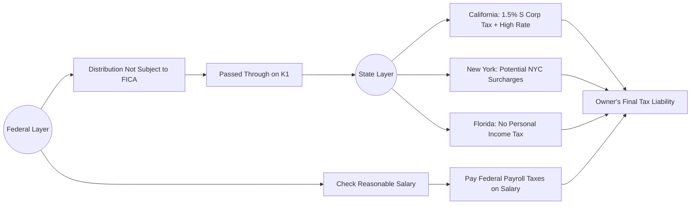

## 15.3 Owner Compensation, Reasonable Salary & Employment Tax Minimization

Balancing the dual goals of fair compensation and strategic tax minimization is a fundamental challenge for S corporation owners. By design, an S corporation (S corp) allows pass-through taxation, meaning corporate income, losses, deductions, and credits flow through to its shareholders’ individual tax returns. However, owners must carefully distinguish between what is paid out as salary or wages (subject to FICA and other payroll taxes) and what is distributed as income (generally not subject to payroll taxes). This chapter explores the concept of reasonable compensation, outlines the pitfalls of artificially low salaries, and offers real-world examples of salary-versus-distribution strategies in multiple states. The risk of the IRS reclassifying distributions as wages is a focal point, with special attention to best practices that safeguard against unwanted scrutiny.

---

### Understanding S Corporation Owner Compensation

Owner compensation in an S corp setting involves two primary forms of payment:

• Wages (or salary): Treasurer figure reported on Form W-2 and subject to federal income tax withholding, Social Security tax, Medicare tax, and any applicable state or local employment taxes.  
• Shareholder distributions: Paid out to owners on a pro-rata basis, generally reported on Schedule K-1. These distributions typically are not subject to payroll taxes but remain subject to federal and state income taxation at the individual level.

A primary appeal of S corps is that distributions can help reduce overall employment tax liability. However, IRS rules require that shareholder-employees receive “reasonable compensation” for services provided before they can pay themselves additional distributions. In other words, one cannot completely avoid employment taxes by labeling all payments as “distributions.”

---

### What Is “Reasonable Compensation”?

The IRS demands that compensation for S corp owner-employees be set at a “reasonable” level, proportionate to the type of services performed, hours worked, skill level, responsibilities, and the local market rate for comparable positions. Although the Internal Revenue Code (IRC) does not specify an exact formula for determining a “reasonable salary,” the following factors typically guide the analysis:

• Training, education, and experience of the owner.  
• Duties and responsibilities within the corporation.  
• Time and effort devoted to the business.  
• Comparable compensation for similar positions in the same industry.  
• Economic conditions and geographic market considerations.

If the IRS deems the owner’s salary too low—particularly if there is a large gap between salary and distributions—it may argue that some portion of distributions should be reclassified as wages. This reclassification leads to additional payroll taxes, interest, and potentially penalties. Notably, historical cases like Spicer Accounting, Inc. v. United States and David E. Watson, P.C. v. United States highlight the IRS’s willingness to challenge unreasonably low salaries.

---

### How the IRS Typically Evaluates “Reasonable”

The IRS may evaluate an S corp’s compensation strategy by looking at:

• Ratio of W-2 wages to distributions.  
• Industry averages for employee salaries in comparable roles.  
• Amount of time the shareholder-employee dedicates to the business.  
• Corporate financial statements, net profit levels, and distribution patterns.  

A consistent approach to setting salaries—based on objective data such as local labor statistics, competitor pay scales, or independent compensation surveys—can help demonstrate that wages are in line with marketplace norms.

---

### Employment Tax Minimization Strategies

Although the main focus is ensuring salaries are neither inflated nor artificially low, S corp owners can endeavor to manage and minimize employment taxes by:

• Splitting their income into a fair wage and a remaining distribution.  
• Using fringe benefits (e.g., health insurance, retirement contributions) where appropriate.  
• Paying bonuses in addition to regular wages, ensuring total compensation stays reasonable.  
• Periodically reviewing and adjusting salary levels in response to business profitability, inflation, and changing market conditions.

Keeping robust documentation of how salaries are determined is crucial: meeting minutes, compensation studies, or references to comparable salaries in a similar geographic region all factor into establishing reasonableness.

---

### Diagram: Salary vs. Distribution Flows

Below is a simplified Mermaid diagram illustrating how an S corp channels income to owner-employees, highlighting the difference between wages subject to payroll tax and distributions generally exempt from the 15.3% combined Social Security and Medicare tax (up to certain limits).

```mermaid
flowchart LR
    A((S Corporation)) --> B[Owner-Employee Wages (W-2)]
    A --> C[Shareholder Distribution (K-1)]

    B --> D{FICA & Income Tax Withholding}
    C --> E{No FICA on Distributions}

    D --> F[owner's net income]
    E --> F
```

As shown, wages flow through standard payroll channels (with FICA and income tax withholding) to the owner-employee. Distributions bypass FICA but remain subject to federal and state income taxes. The key is to balance these flows so that the portion allocated to wages remains “reasonable” and defensible if challenged by authorities.

---

### Comparative Examples: Salary vs. Distribution in Various States

While federal guidelines regarding reasonable compensation and payroll taxes are uniform across all states, state-level income taxes and entity-level taxes—where applicable—vary significantly. Below is an illustrative (and simplified) table comparing the impact of paying $100,000 in total compensation as purely wages versus a split between $60,000 in wages and $40,000 in shareholder distributions for an S corp owner in three different states.

|                                  | California                     | New York                         | Florida                        |
|----------------------------------|--------------------------------|----------------------------------|--------------------------------|
| State Income Tax Rate (Approx.)  | Up to 13.3%                    | Up to 10.9% (plus NYC local)     | 0% (no state individual income tax) |
| State S Corp Tax or Fee          | 1.5% CA Franchise Tax (on net income) | Minimum fixed fee if applicable | N/A                            |
| Scenario A: $100,000 Wages Only  | • Subject to federal income tax and CA’s up to 13.3% <br> • Full FICA on $100k <br> • 1.5% S corp tax on net income | • Subject to federal income tax + up to 10.9% + possible NYC local tax <br> • Full FICA on $100k <br> • S corp filing fees or franchise taxes vary | • Subject to federal income tax <br> • Full FICA on $100k <br> • No state individual income tax, but federal payroll taxes still apply |
| Scenario B: $60k Wages + $40k Distribution | • $60k wages: subject to FICA <br> • $40k distribution: no FICA <br> • CA income tax on wages + distribution <br> • 1.5% S corp tax on corporate net income | • $60k wages: subject to FICA <br> • $40k distribution: no FICA <br> • NY state income tax on both wage & distribution <br> • Potential NYC local tax on wages <br> • S corp fees or franchise taxes apply | • $60k wages: subject to FICA <br> • $40k distribution: no FICA <br> • Florida has no personal income tax on either, but federal taxes still apply |

In Scenario B, owners reduce their FICA base by $40,000, effectively lowering their Social Security and Medicare taxes. However, the risk surfaces if the IRS claims the $60,000 salary is not adequate compensation for the owner’s role and reclassifies some (or all) of the $40,000 distribution as wages.

Remember that in states like California and New York, the distributions remain subject to state income tax rates. The difference primarily arises because the distribution portion is free from payroll tax at the federal level (i.e., Social Security and Medicare). States with no individual income tax, such as Florida, may have an apparent advantage on the distribution side, but that advantage does not apply to federal payroll taxes or to potential state-specific S corp fees.

---

### Risk of IRS Reclassification

One of the most notable risks of aggressive employment tax minimization is an IRS audit leading to reclassification. In such a scenario, the IRS contends that the S corp owner-employee’s salary was “unreasonable” and that distributions should be converted into wages that are retroactively subject to payroll taxes. This can leave the taxpayer on the hook for:

• Employer’s share of FICA taxes that were underpaid.  
• Employee’s share of uncollected FICA taxes.  
• Possible federal and state unemployment taxes.  
• Interest on the underpaid amounts.  
• Penalties for failure to pay employment taxes, which can be substantial.

Some of the most common IRS red flags include:

– Extremely low or zero salary relative to large distributions.  
– Patterns where the S corp primarily covers shareholder personal expenses, but the wages remain minimal.  
– Owner roles that include significant managerial and day-to-day operational duties, yet the wages do not reflect these responsibilities.  
– Industries where typical compensation is significantly higher than what the shareholder-employee is being paid.

If the IRS reclassifies distributions to wages, the financial and reputational ramifications are often severe. It is wise for owners to be proactive, consult compensation benchmarks, and adopt thorough payroll policies.

---

### Determining Reasonable Salary: Practical Approaches

Below are some best practices and approaches for ensuring that an owner’s salary remains defensible:

• Use External Compensation Data: Obtain industry salary surveys from reputable sources (e.g., the Bureau of Labor Statistics, trade associations).  
• Document Roles and Responsibilities: Keep a list of each owner-employee’s specific tasks, hours worked, and approximate compensation that similar roles command in the local market.  
• Maintain Written Policies: Draft internal policies that outline how compensation is set and updated. Make sure to cover changes in company profitability or expansions of duties.  
• Review Annual Trends: Adjust salaries upwards or downwards if the business’s profitability changes significantly.  
• Consider Non-Salary Compensation: Factor in other forms of compensation, such as insurance benefits, retirement plan contributions, or fringe benefits. For instance, an S corp might pay health insurance premiums for the shareholder-employee, which can be included in W-2 wages but offset through certain deductions on the shareholder’s individual return.

---

### Case Study: A Tale of Two Owners

Imagine a scenario where two S corp owner-employees operate a consulting firm in California. Each has a similar role, devoting 40 hours weekly to the business, which nets $250,000 in profit after all expenses except compensation. Owner A pays themself a salary of $40,000 and takes $90,000 as a shareholder distribution. Owner B, by contrast, sets a salary of $80,000 and a distribution of $50,000.

• Owner A’s potential issues:
  – The $40,000 salary may be too low for a full-time consultant in California.  
  – The high distribution to salary ratio can prompt closer IRS scrutiny.  

• Owner B’s approach:
  – The $80,000 salary might be closer to market norms for a full-time professional consultant.  
  – The split between salary and distribution helps minimize payroll taxes while appearing more reasonable to the IRS.

If the IRS compares the two owners, it may view Owner A’s strategy as potentially abusive. Owner B, on the other hand, might survive an IRS challenge by showing that $80,000 aligns with local compensation data. By adjusting the salary portion upward, Owner B has reduced the chance of reclassification.

---

### Additional Planning Considerations

• Multi-State Factors: Some S corp owners live in one state but operate in another, or manage multiple offices across different states. Each state may have distinct rules regarding S corp taxation, nexus, and withholding requirements.  
• State-Level Employment Taxes: Some states have mandated unemployment insurance taxes and employer-specific levies that apply to the wage portion. Owners should factor these into their total cost.  
• Section 199A Deduction (QBI): Pass-through entities may qualify for a Qualified Business Income deduction, subject to W-2 wage limitations. Setting a proper wage level can maximize or restrict the potential QBI deduction.  

---

### Visualizing the State-by-State Impact

The following Mermaid diagram highlights how state-specific tax regimes can alter salary-versus-distribution decisions. Notice that while the federal portion remains constant, certain states overlay additional layers of tax or fees.



At the state layer, each jurisdiction imposes different tax treatments of S corps. Meanwhile, the biggest difference at the federal level is the FICA saving potential on distribution portions—driving many owners to try and minimize wages. 

---

### Common Pitfalls

1. Setting Salary to Zero (or Nominal Amount): This is one of the easiest ways to invite audits and reclassification.  
2. Inconsistent Payment Patterns: Repeated large distributions with irregular wages can appear suspicious.  
3. Failing to Update Salary Over Time: As an S corp grows, so does the need to increase owner compensation proportionally.  
4. Inadequate Documentation: Vague justifications or reliance on “guesswork” when establishing a salary hamper the defense against IRS scrutiny.

---

### Key Takeaways

• Owner-employees of S corps must earn a salary that reflects market-value compensation for their services.  
• Distributions beyond that “reasonable compensation” can minimize payroll taxes.  
• State-by-state variations—ranging from franchise taxes to individual income tax rates—can influence the optimal balance between salary and distributions.  
• Strong documentation and consistent payroll policies help guard against the expensive consequences of IRS reclassification.

---

### References and Further Exploration

• IRS Publication 535, Business Expenses (for guidance on fringe benefits).  
• IRS Fact Sheet FS-2008-25, addressing S corp compensation reminders.  
• [Bureau of Labor Statistics](https://www.bls.gov/) for compensation benchmarking.  
• State government websites for corporate franchise tax rates and guidelines.  

For deeper knowledge, you may refer back to Chapter 14: Ongoing Planning for C Corporations to compare how C corp and S corp compensation structures differ, or see Chapter 16: Partnership & LLC Tax Planning to learn the unique rules around compensating LLC members and partners.

---

## Quiz: S Corp Owner Compensation and Tax Strategy



### Which of the following is NOT a factor the IRS typically evaluates when determining whether an S corp owner’s salary is “reasonable”?

- [ ] Duties and responsibilities.
- [ ] Time and effort devoted to the business.
- [x] Whether the S corp files a consolidated return.
- [ ] Comparable compensation for similar roles.

> **Explanation:** The IRS will consider an owner’s duties, relevant experience, time spent, and comparable market wages. Whether the entity files a consolidated return is irrelevant for an S corp, which is typically an independent pass-through entity.

### What happens if the IRS deems a shareholder’s salary unreasonably low?

- [ ] They only add a laundering penalty.
- [ ] The taxes can be deferred to the following year.
- [x] The IRS may reclassify distributions as wages and impose back taxes, interest, and penalties.
- [ ] The IRS immediately revokes the S corp election.

> **Explanation:** If the IRS decides the salary is unreasonably low, it can reclassify a portion of distributions as wages, leading to additional employment taxes, interest, and possibly penalties.

### Why might an S corp owner adopt a strategy of combining a reasonable salary with a distribution?

- [ ] To increase corporate-level taxation.
- [ ] To make the salary portion less transparent.
- [x] To minimize employment taxes while satisfying IRS requirements.
- [ ] To avoid paying state income taxes entirely.

> **Explanation:** Paying a reasonable salary ensures compliance with IRS guidelines, while taking distributions on top helps minimize total employment taxes owed.

### In evaluating an S corp owner’s pay, which resource is best for determining a competitive market salary?

- [ ] Personal bank statements.
- [x] Industry compensation surveys or Bureau of Labor Statistics data.
- [ ] The number of sales contracts secured.
- [ ] The company’s gross revenue alone.

> **Explanation:** Industry or BLS compensation surveys provide objective benchmarks to justify that an owner’s salary aligns with what others in similar roles earn.

### In a multi-state S corp situation, which is a key tax planning complexity?

- [x] Varying state franchise tax rules on S corps.
- [ ] Federal payroll tax monitoring by each state.
- [x] Divergent income tax rates influencing distribution strategies.
- [ ] Uniform local tax regulations across the U.S.

> **Explanation:** S corps often face different state-level franchise fees, nexus rules, and varied income tax rates that can influence the optimal wage-versus-distribution ratio.

### Which of the following is a common pitfall for owner-employees of S corps?

- [ ] Paying a wage that aligns with industry norms.
- [ ] Maintaining regular payroll records.
- [x] Failing to document how the salary was determined.
- [ ] Reviewing annual salary for adjustments.

> **Explanation:** When an owner does not properly document how they arrived at their salary figure, the IRS can easily argue that the figure is arbitrary and possibly unreasonably low.

### Why is paying a zero salary generally considered high-risk for S corp owners?

- [x] It strongly suggests an attempt to avoid employment taxes.
- [ ] It is an indication that the business is non-operational.
- [x] It automatically triggers dissolution of the S corp.
- [ ] The shareholder is never liable for personal taxes.

> **Explanation:** Paying no salary while taking large distributions is a major red flag for IRS, implying the owner is evading Social Security, Medicare, and other payroll taxes.

### Which of the following best defines the main advantage of allocating part of S corp income as distributions instead of wages?

- [ ] To avoid paying any taxes whatsoever.
- [x] To save on the employer and employee portions of FICA taxes.
- [ ] To automatically increase state tax refunds.
- [ ] To remove the need for corporate record-keeping.

> **Explanation:** By taking some portion of compensation as distributions, an owner can reduce the total amount subject to Social Security and Medicare payroll taxes, thereby reducing overall tax liability (if the salary remains within IRS guidelines).

### If an S corp forgives a shareholder loan rather than paying a salary, what is a potential IRS concern?

- [x] The forgiveness may be recast as disguised compensation.
- [ ] The IRS will treat it as negative basis with no consequences.
- [ ] The forgiven loan is a qualified charitable contribution.
- [ ] There is no risk because loan forgiveness is tax-free.

> **Explanation:** Forgiveness of a shareholder loan used as a form of compensation can prompt the IRS to treat the forgiven debt as compensation or distributions if the arrangement lacks a business purpose.

### The biggest driver of an IRS audit regarding S corp owner compensation is:

- [x] A wage level that appears unreasonably low relative to distributions.
- [ ] High net profit in the business.
- [ ] A state-level prompt from Louisiana.
- [ ] Proper wage documentation and accurate W-2 filings.

> **Explanation:** The most common red flag is a dramatic imbalance between wages and distributions. When the salary is too low for the services provided, the IRS may suspect payroll tax avoidance.



---

## For Additional Practice and Deeper Preparation

**[TCP CPA Hardest Mock Exams: In-Depth & Clear Explanations](https://www.udemy.com/course/tcp-cpa-mock-exams/?referralCode=675149871D0E79B1699C)**  

**Tax Compliance & Planning (TCP) CPA Mocks:** 6 Full (1,500 Qs), Harder Than Real! In-Depth & Clear. Crush With Confidence!

- Tackle full-length mock exams designed to mirror real TCP questions.  
- Refine your exam-day strategies with detailed, step-by-step solutions for every scenario.  
- Explore in-depth rationales that reinforce higher-level concepts, giving you an edge on test day.  
- Boost confidence and minimize anxiety by mastering every corner of the TCP blueprint.  
- Perfect for those seeking exceptionally hard mocks and real-world readiness.

_Disclaimer: This course is not endorsed by or affiliated with the AICPA, NASBA, or any official CPA Examination authority. All content is for educational and preparatory purposes only._
