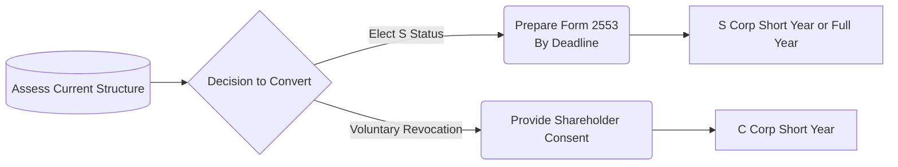
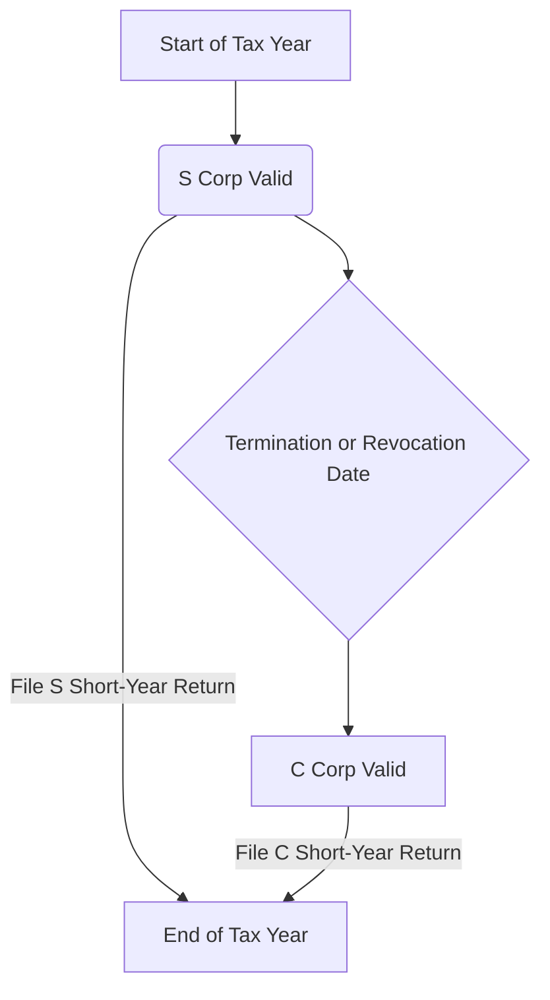

## 15.4 Conversions to/from C Corp & Planning for Mergers or Acquisitions

This section explores the key considerations, tax implications, and planning strategies involved in converting entity status between C corporations and S corporations, with a special focus on short-year returns and the broader context of mergers and acquisitions. By understanding the regulatory framework and practical steps, CPAs can guide clients or their own organizations through successful transitions that minimize tax liabilities, ensure compliance with federal requirements, and support strategic business objectives.

Key areas covered in this section include:
• The conversion process from C corp to S corp and common pitfalls.  
• Reverting from S corp to C corp and the relevant timing and procedural steps.  
• Short-year returns for the transition period.  
• Planning for mergers, acquisitions, and reorganizations that intersect with entity status changes.  

By integrating these concepts with guidance from other chapters—such as those addressing corporate taxation (Chapters 8 and 9) or S corporation fundamentals (Chapter 10)—readers will gain a holistic understanding of optimal strategies to maximize tax efficiency and compliance.

  
Key Concepts in Changing Entity Status

Converting between C corporation and S corporation statuses affects multiple areas of tax compliance and planning. Major considerations include:

• Eligibility Requirements. To be taxed as an S corporation, an entity must meet strict qualification rules (domestic corporation, allowed shareholders, single class of stock, etc.). Failing these requirements or unintentionally violating them can disqualify the corporation.  
• Impact on Earnings and Profits (E&P). C corporations track E&P, which can cause certain distributions to be taxed as dividends even after an S election. The accumulated adjustments account (AAA) for S corporations and the handling of built-in gains (BIG) tax are critical for planning distribution strategies.  
• Timing of the Election. Filing the S corporation election (Form 2553) on time is essential. Conversions partway through the year can trigger “short-year” returns.  
• Built-In Gains and Other Transition Taxes. A corporation converting from C to S may have embedded appreciation in its assets, triggering built-in gains tax if sold during a recognition period.  

  
Converting from C Corp to S Corp

The process to convert from C corporation to S corporation involves both administrative and strategic tax planning steps. 

Filing Requirements and Timing  
1. Verify Eligibility. Before making an S election, ensure the organization meets all criteria under IRC §1361 (e.g., no more than 100 shareholders, only allowable owners, one class of stock).  
2. Prepare Form 2553. This must be filed with the IRS typically by the 15th day of the third month of the tax year the election is to be valid. If the election is filed late, shareholders may need relief under the late S election provisions.  
3. Effective Date of Election. If the S election is made during the tax year with no special request for a different effective date, the S status begins on the first day of that tax year, resulting in the corporation filing one tax return for the full year under S status.  
4. Short-Year Returns. If the entity does not make the election in time for the start of its taxable year, the period prior to the effective date remains taxed as a C corporation, and a separate, short-year return is filed for that period. The remainder of the year is taxed under S corp rules.  

  
Accumulated Earnings and Profits  
When a C corporation elects S status, any E&P accumulated during the entity’s time as a C corp does not vanish. This E&P can impact the classification of distributions and trigger taxes for shareholders. Distributions exceeding the corporation’s AAA may be treated as dividends to the extent of E&P. Advisors should monitor and plan for distributions carefully to avoid unintended dividend income.  

  
Built-In Gains (BIG) Tax  
Under IRC §1374, a newly converted S corporation may be subject to built-in gains tax if it disposes of assets that had appreciated during the C corp years (i.e., the fair market value of assets exceeds their tax basis on the conversion date). The recognition period for BIG tax is generally five years after the conversion. Taxpayers should strategize around the timing of asset sales to mitigate or defer BIG tax.

  
Practical Example – C to S Conversion  
Imagine XYZ Corporation, a C corp with 3 shareholders, each owning 33.33%. The corporation wants to become an S corporation effective January 1. XYZ must:  
• Confirm that each shareholder is an eligible person under S corp rules (e.g., individuals who are U.S. citizens or residents, trusts that meet requirements, etc.).  
• File Form 2553 by March 15 to be effective January 1 (assuming a calendar year).  
• Evaluate the E&P from prior C years; consider declaring a dividend prior to conversion or paying out carefully under S corp status to minimize double taxation.  
• Record the fair market value of assets as of January 1 to ensure built-in gains can be tracked accurately.  

  
Converting from S Corp to C Corp

While less common, a corporation may revert from S corp to C corp status for various operational, ownership, or strategic reasons, including the desire to attract new investors or certain institutional funding not compatible with S corp restrictions.  

Administrative Steps  
1. Voluntary Termination. The corporation can revoke the S election by filing a statement with the IRS. Revocation often requires the consent of shareholders holding more than 50% of the shares.  
2. Inadvertent Termination. S status may also be lost if the corporation no longer meets eligibility requirements (e.g., an ineligible shareholder acquires stock) or if a second class of stock is created inadvertently.  
3. Effective Date of Termination. The date specified in the revocation or, in some cases, the first day of the corporation’s tax year if no date is specified.  

  
Short-Year Returns – S to C  
If the corporation terminates S status mid-year, two short-year returns are typically filed:

• The “S short year” covers the period from the start of the tax year to the day before termination.  
• The “C short year” covers the period from the termination date until the end of the tax year.  

Each return follows the respective tax rules for S or C corporations, including pass-through treatment for the S short year and corporate-level taxation for the C short year.

  
Transition of Tax Attributes and AAA  
When the corporation terminates S status, the accumulated adjustments account (AAA) is “frozen” as of the last day of the S short year. The AAA does not carry over to the C corporation but can be relevant if the corporation re-elects S status at a later time. Some attributes, like operating loss carryforwards, may become subject to corporate-level rules once again.

  
Practical Example – S to C Conversion  
ABC Enterprises has 6 shareholders, all individuals. After operating as an S corporation for five years, the owners decide to bring in venture capital funding. The new investor, an LLC with corporate partners, is not an eligible S corp owner. Consequently, ABC must revert to C corp status effective July 1 (mid-year). Steps include:

• Filing a revocation statement with the IRS, with majority shareholder consent.  
• Closing the books as of June 30 under S corp tax rules and filing an S short-year return.  
• For July 1–December 31, ABC is taxed as a C corporation, filing a C short-year return.  
• The AAA account is determined as of June 30 and remains frozen until ABC might re-elect S status in the future (subject to waiting periods under IRC rules).

  
Short-Year Returns: A Key Transition Concept

Short-year returns are essential when changing tax status mid-year. Each portion of the tax year is treated independently:

• “S short year” uses Form 1120-S. Income and expenses flow through to shareholders for that period.  
• “C short year” uses Form 1120. Income in this period is taxed at the corporate level.  

Short-year returns create administrative complexity. Corporations must maintain accurate records of operations up to the conversion date to correctly allocate income, deductions, and credits. In some cases, consistent accounting methods must be applied or changed, which may require IRS approval.

  
Planning for Mergers & Acquisitions

Conversions involving S and C corporations often intersect with mergers and acquisitions. In combining entities or acquiring new shareholders, the tax classification of the corporation can significantly affect the transaction’s structure, the tax impact on the parties, and the ongoing compliance burden. Key considerations include:

• Tax-Free Reorganizations. Certain mergers and consolidations may qualify for tax-free treatment under IRC §368. The corporation’s status as S or C can influence the feasibility and structure of the transaction.  
• Built-In Gains Exposure. If a merged or acquired entity was previously a C corporation (or part of a consolidated group), those assets may carry built-in gains that can trigger tax if not properly planned.  
• Shareholder-Level vs. Corporate-Level Taxes. In an S corp structure, gains pass through to individual shareholders, which might provide more flexible planning for acquisitions—especially when the transaction involves stepping up the basis of underlying assets.  

  
Mermaid Diagram – Conversion Sequence Overview

Below is a simplified flowchart illustrating the broad steps in deciding on a conversion:

Explanation:  
• The process initiates with an evaluation of current and desired structures.  
• If moving from C to S, the entity files Form 2553 by the required date. Any short-year return is handled if elected mid-year.  
• If moving from S to C, ensure majority shareholder consent and handle short-year returns accordingly.

  
Diagram – Short-Year Division (S to C)

The timeline for a mid-year conversion often looks like this:

This visual highlights that the tax year is split at the termination or revocation date, resulting in separate short-year returns.

  
Real-World Example: Mid-Year Acquisition

Consider a scenario where a private equity firm wishes to acquire controlling interest in an S corporation on June 30. This S corporation has E&P from its prior life as a C corp. If the new structure causes ineligibility (e.g., introducing a non-individual shareholder), the S corp must terminate its status immediately. The portion of the year before June 30 remains taxed under S rules, while the remainder of the year becomes a C corporation short-year. Proper planning ensures the new owners understand the corporate-level taxes for the remainder of the year and any distribution or transaction that needs to be undertaken before or after the termination date.

  
Common Pitfalls & Best Practices

• Failing to Monitor Eligibility Requisites. After converting to S corp status, corporations must diligently track the number and type of shareholders. Accidental introduction of an ineligible shareholder nullifies the status unless corrected promptly.  
• Overlooking Built-In Gains. Selling highly appreciated assets soon after converting from C to S can trigger a significant tax (up to the highest corporate rate in effect during the recognition period).  
• Not Planning Distributions Before Conversion. When converting from C to S, consider distributing prior E&P to minimize complexities after the election. Shareholders might face dividend tax, but strategic timing can reduce future confusion around distributions.  
• Short-Year Complexity. Filing two returns adds compliance burdens and potential accounting method mismatches. Thorough recordkeeping is essential.  
• Bypassing Professional Guidance. Given the intricate interplay of corporate law, federal and state tax laws, and M&A regulations, consultation with tax professionals and legal counsel is crucial.  

  
Practical Examples and Scenarios

• Pre-Funding Conversion: A startup planning to seek venture capital might revert from S to C status once it grows beyond the S corp ownership constraints. Transition timing (early in the tax year vs. mid-year) can drastically change the resulting tax obligations.  
• Closely Held Family Corporation: A family business with minimal owners might wish to convert from C to S to utilize pass-through distributions. If the business holds assets that have substantially appreciated, they must plan around the 5-year built-in gains window.  
• Spin-Off with Future Merger: An S corporation might spin off a line of business and then convert to a C corporation if an eventual merger with a publicly traded company is anticipated. The short-year considerations and built-in gains assessment are critical in planning the timeline.

  
References & Further Reading

Below are selected references for deeper exploration:  
• IRC §1361-1379 (S Corporations) – The core statutes for S corp rules.  
• IRC §1374 (Built-In Gains Tax).  
• IRS Publication 542, “Corporations” – Comprehensive guide on forming, operating, and dissolving corporations.  
• IRS Instructions for Form 2553, “Election by a Small Business Corporation.”  
• Chapter 10 of this book (“S Corporations”) for fundamentals of S corp taxation, including shareholder basis and distributions.  
• Chapter 15.1 (“Avoiding Inadvertent Terminations”) for deeper guidance on S corp eligibility and proactive strategies.  

  
Conclusion

Converting between C corporation and S corporation status offers both pivot opportunities and complexities in tax compliance, strategic planning, and aligning with operational goals. Short-year returns require keen attention to detail, and the interplay with built-in gains, accumulated earnings, and AAA accounts can shape corporate decisions for years to come. By understanding the distinct rules governing each entity form, as well as the proper procedures for transitions, CPAs can guide businesses toward optimal tax outcomes and strategic positioning—especially when mergers and acquisitions are part of the growth trajectory.

Whether you are advising a small closely held corporation or a fast-growing entity preparing for venture capital funding, the key is to maintain diligent tax planning, stay current with legislative changes, and build robust compliance protocols. Armed with these insights, CPA candidates and practitioners alike will be able to navigate the intricacies of entity status changes confidently and effectively.

  
## Test Your Knowledge: Conversions to/from C Corp & M&A Strategies Quiz



### Which IRS form must be filed to elect S corporation status for an eligible entity?
- [ ] Form 1120
- [x] Form 2553
- [ ] Form 1065
- [ ] Form 1041

> **Explanation:** Form 2553 is required to make a valid election to be an S corporation and must be filed within specific time limits.

### When does a new S election typically become effective if Form 2553 is submitted by the 15th day of the third month of the tax year?
- [ ] Immediately on the date the form is filed
- [ ] The end of the current tax year
- [x] The first day of that tax year
- [ ] The start of the following tax year

> **Explanation:** If filed on time, an S election generally applies retroactively to the first day of that tax year, avoiding a short-year return for the election date.

### What happens to the accumulated adjustments account (AAA) when an S corporation reverts to C corporation status?
- [ ] It is transferred into E&P on the new C corp’s balance sheet
- [ ] It is restated to zero on the date of conversion
- [ ] It continues to track distributions under C corp rules
- [x] It is “frozen” at the date of conversion and no longer adjusts under C corp rules

> **Explanation:** Once S status is terminated, the AAA is frozen as of the last day of the S short year and does not carry over to the C corp.

### Which of the following taxes may be triggered when a C corporation elects to be taxed as an S corporation and subsequently sells appreciated assets within five years?
- [ ] Personal holding company tax
- [ ] Excess profits tax
- [x] Built-in gains tax
- [ ] Excess distributions tax

> **Explanation:** Under IRC §1374, built-in gains tax can apply to the disposition of assets that appreciated while the corporation was a C corp if sold during the recognition period (generally five years).

### How are mid-year conversions generally handled for tax filing purposes in a year in which an S election is revoked or terminated?
- [x] The corporation files two short-year returns, one under S status and one under C status
- [ ] The corporation merges the returns into a single 12-month 1120
- [ ] The IRS automatically designates the tax classification retroactive to the start of the year
- [x] The IRS defers corporate tax adjustments until the following year

> **Explanation:** A mid-year termination splits the tax year into an S short year and a C short year, each requiring its own return.

### Which of the following is a common reason to revert from S corp status back to C corp status?
- [ ] Intention to reduce corporate-level taxes
- [ ] Desire to avoid paying dividends to shareholders
- [ ] Attempting to increase the number of classes of stock beyond one
- [x] Access to a wider pool of investors, such as venture capital or institutional funding

> **Explanation:** S corp restrictions on ownership and the single class of stock requirement can limit capital-raising options, leading some corporations to revert to C status to accept venture capital or institutional investors.

### Which factor does NOT directly affect S corp eligibility?
- [x] The corporation’s state incorporation statute
- [ ] The number of shareholders
- [ ] The types of shareholders (e.g., individuals, certain trusts)
- [ ] Presence of only one class of stock

> **Explanation:** S corp eligibility is determined by the Internal Revenue Code requirements, such as the number and type of shareholders, domestic incorporation, and single class of stock. State incorporation, while relevant to business formation, is not itself a limiting factor under federal S corp requirements, provided the entity is recognized as a domestic corporation for federal tax purposes.

### Which of the following statements about short-year returns is correct?
- [x] They require the corporation to report income, deductions, and credits for each portion of the year separately
- [ ] They can be ignored if the entity has an E&P surplus
- [ ] They are only required when the corporation has substantial taxable income
- [ ] They do not require tax to be paid for the partial period

> **Explanation:** Short-year returns split the year into distinct segments requiring separate reporting and can arise from changes in tax entity classification mid-year.

### Which document is essential to revoke an S election voluntarily?
- [ ] A new set of bylaws certified by shareholders
- [x] A statement of revocation, signed by shareholders owning more than 50% of the shares
- [ ] Form 1065 with a special election
- [ ] A letter from all shareholders to the state Secretary of State

> **Explanation:** Voluntary termination of an S election typically requires written consent from shareholders holding more than 50% of the issued and outstanding stock, filed with the IRS in a separate statement of revocation.

### A corporation was an S corp for multiple years but converts to a C corp in April of Year 1. True or False: The AAA tracked under S corp status continues to accumulate after the April conversion.
- [x] True
- [ ] False

> **Explanation:** This is a trick question. The AAA is “frozen” at termination and does not continue to accumulate for the C corporation. Some reactivations of AAA may happen if the corporation re-elects S status at a later date, but it does not accumulate under C corp status.



---

## For Additional Practice and Deeper Preparation

[TCP CPA Hardest Mock Exams: In-Depth & Clear Explanations](https://www.udemy.com/course/tcp-cpa-mock-exams/?referralCode=675149871D0E79B1699C)

Tax Compliance & Planning (TCP) CPA Mocks: 6 Full (1,500 Qs), Harder Than Real! In-Depth & Clear. Crush With Confidence!

• Tackle full-length mock exams designed to mirror real TCP questions.  
• Refine your exam-day strategies with detailed, step-by-step solutions for every scenario.  
• Explore in-depth rationales that reinforce higher-level concepts, giving you an edge on test day.  
• Boost confidence and minimize anxiety by mastering every corner of the TCP blueprint.  
• Perfect for those seeking exceptionally hard mocks and real-world readiness.  

_Disclaimer: This course is not endorsed by or affiliated with the AICPA, NASBA, or any official CPA Examination authority. All content is for educational and preparatory purposes only._
