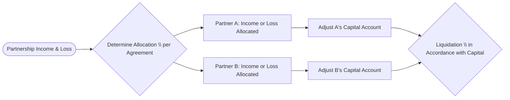

## 16.1 Special Allocations to Shift Income/Loss Gains to Advantageous Partners

Special allocations in partnerships (and limited liability companies taxed as partnerships) allow partners to share items of income, gain, loss, and deduction in a manner that is not strictly proportional to their percentage interests in the partnership. By strategically shifting these items among partners, partnerships can optimize tax benefits and effectively manage each partner’s economic and tax objectives. However, the Internal Revenue Service (IRS) imposes rules—most notably under Internal Revenue Code (IRC) §704(b)—to ensure allocations have “substantial economic effect.” This section provides an in-depth look at valid and invalid purposes for special allocations, safe harbor rules for achieving economic effect, practical structures, and related pitfalls.

--------------------------------------------------------------------------------
### Introduction to Special Allocations

In a typical partnership or LLC agreement, each partner’s share of income, losses, and other tax attributes is allocated in proportion to their ownership or “profits” interest. However, partners often desire different allocations for various strategic reasons, such as:

• A partner with passive losses from other investments needing additional losses to offset income.  
• A partner who has a higher marginal tax rate wanting more deductions.  
• A partner contributing appreciated property who faces unique gain exposure.  

While §704(b) allows such allocations, not every reallocation is permissible. The “substantial economic effect” requirement ensures that allocations reflect partners’ genuine economic arrangements rather than serving merely as vehicles for tax manipulation.

--------------------------------------------------------------------------------
### Overview of the §704(b) Substantial Economic Effect Test

To determine whether allocations are valid for tax purposes, regulations under Treas. Reg. §1.704-1(b) articulate two central considerations:

1. **Economic Effect:** The allocation must have a real economic impact on the partners’ capital accounts and the corresponding distribution of assets if the partnership were to liquidate.  
2. **Substantiality:** The allocation cannot be purely tax-motivated; it must also produce a meaningful change in the economic positions of the partners, taking into account the present values of the consequences to each partner.  

Allocations failing to meet these criteria may be reallocated by the IRS according to the partners’ “interests in the partnership.”

--------------------------------------------------------------------------------
### Valid vs. Invalid Reasons for Special Allocations

#### Valid Reasons

1. **Differential Risk or Capital Contributions**  
   • Partners may have contributed drastically different assets, such as real estate with a large built-in gain vs. cash.  
   • Allocations can reasonably reflect the economic risk or the built-in gain/loss associated with contributed property.  

2. **Managing Varying Capital Needs**  
   • Some partners might commit to substantial future capital infusions or guarantee partnership debt.  
   • Special allocations of losses to the partner who bears the greatest economic risk may be appropriate.  

3. **Aligning with Actual Economic Agreements**  
   • If the economic deal truly grants one partner a priority return or a special distribution, the tax allocation should follow that deal.  
   • For instance, a partner who is contractually entitled to a preferred return on capital may receive allocations of net income up to that preferred return.

4. **Recognizing Partner Efforts or Services**  
   • A partner who contributes services may be allocated guaranteed payments, but in some structures, the parties may prefer an allocation of income as part of a complex waterfall distribution.  
   • As long as the underlying economics support this arrangement, the allocation can be valid.

#### Invalid (or Potentially Invalid) Reasons

1. **Pure Tax Arbitrage without Economic Substance**  
   • Merely shifting losses to a partner in a high tax bracket when that partner does not bear an equivalent economic risk (or capital account reduction) typically fails the economic effect requirement.  
   • The IRS disallows “paper” allocations that lack real economic consequences.

2. **Allocations That Inconsistently Track Capital Accounts**  
   • If a partnership tracks capital accounts on a consistent basis but the special allocation diverges from the economic arrangement in liquidation, the allocation likely fails.  
   • An example would be awarding large tax losses to a partner without adjusting that partner’s capital account to reflect the losses.

3. **Shifting or Transitory Allocations**  
   • Arrangements that move certain tax benefits to one partner in an early year, with an offsetting reallocation back to another partner in a subsequent year, may be treated as invalid if they lack a substantial economic effect.  
   • These “shifting allocations” or “transitory allocations” are often designed solely to extract a temporary benefit for one partner.

--------------------------------------------------------------------------------
### The Economic Effect Safe Harbor Rules

Under Treas. Reg. §1.704-1(b)(2), an allocation has “economic effect” if it meets all three of the following safe harbor conditions:

1. **Capital Account Maintenance**  
   Each partner’s capital account must be maintained in a manner that reflects the partner’s contributions, distributions, allocations of income, gain, loss, and deductions. Specifically:  
   • Increases to a partner’s capital account must include contributions and allocations of income or gain.  
   • Decreases must include distributions or allocations of losses/deductions.  

2. **Liquidation According to Capital Accounts**  
   Upon liquidation, partners must receive assets in accordance with their final, positive capital account balances. If any partner holds a negative capital account, they are not entitled to receive a distribution until their capital account becomes positive (through offsetting allocations or additional contributions).

3. **Deficit Restoration Obligation (DRO) or Qualified Income Offset (QIO)**  
   If a partner’s capital account falls below zero (i.e., a deficit), they must either restore that deficit, or the agreement must contain a “qualified income offset.”  
   • **Deficit Restoration Obligation (DRO):** The partner agrees to reimburse the partnership for any negative balance in their capital account upon liquidation.  
   • **Qualified Income Offset (QIO):** The partnership must allocate income to the partner as promptly as possible to eliminate any deficit balance that arises for certain specified reasons.  

If the partnership agreement meets these three criteria, allocations generally have “economic effect.” However, these allocations must also be **substantial**—that is, they must not be structured purely to reduce or shift taxes in a manner that provides no real economic change among partners.

--------------------------------------------------------------------------------
### Substantiality: Ensuring the Allocation Matters

Even if an allocation passes the economic effect test, it will not be respected unless it is also “substantial.” A special allocation is substantial if:

1. The allocation significantly affects at least one partner’s capital account and distribution rights in the partnership, in present value terms.  
2. There is a non-tax-related reason for the allocation or a genuine expectation that it reflects the partners’ economic arrangement.  

If the IRS finds that an allocation’s primary goal is to engineer a tax benefit for some or all of the partners—without any real economic shift in their respective entitlements—such an allocation will fail. When tested, an allocation is often reclassified to match what the IRS believes is each partner’s actual interest in the partnership.

--------------------------------------------------------------------------------
### Practical Examples and Case Studies

Below, we illustrate how special allocations can be structured, along with potential pitfalls.

#### Example 1: Shifting Depreciation to a Real Estate Professional

• **Scenario:**  
  - Sanders LLC has two partners: Partner A (a real estate professional with other passive income) and Partner B (a passive investor).  
  - The partnership agreement allocates a larger share of depreciation deductions to Partner A, who can utilize passive losses immediately.  
  - Partner B is content with receiving fewer depreciation deductions because they lack other passive income to offset.

• **Analysis:**  
  - If Partner A genuinely bears the economic burden of these deductions—meaning Partner A’s capital account is decreased accordingly—this arrangement might be valid.  
  - The partnership must ensure it satisfies the safe harbor rules for capital account maintenance, and that the allocation is substantial.  
  - If the only motivation is to exploit Partner A’s ability to offset other passive income without incurring any real economic burden, the IRS may scrutinize and potentially disallow the allocation.

#### Example 2: Allocation of Built-In Gains on Contributed Property

• **Scenario:**  
  - Partner X contributes property with a $200,000 built-in gain, while Partner Y contributes only cash.  
  - The partnership wants to allocate any future appreciation or depreciation of that specific property to Partner X, recognizing that Partner X brought the “built-in” element to the partnership.

• **Analysis:**  
  - Under §704(c), the partnership must ensure that allocations of gains, losses, or depreciation arising from the contributed property reflect the built-in gain.  
  - This is typically handled by “traditional” §704(c) methods, “remedial” allocations, or other permissible methods.  
  - This special allocation can be valid if it aligns with the real economic deal that Partner X bears the gain or loss tied to their property contribution.

#### Example 3: Invalid Shifting Allocation

• **Scenario:**  
  - The Rosetta Partnership has two equal partners: Partner R and Partner S.  
  - In Year 1, the partnership allocates a large amount of depreciation to Partner R (in a high tax bracket), artificially creating a large net loss for them.  
  - In Year 2, the partnership “shifts” that depreciation effectively back to Partner S by reversing capital accounts so that R’s prior-year loss doesn’t affect actual distributions (no capital account deficit for R).

• **Analysis:**  
  - This arrangement appears to be purely tax-driven.  
  - Because Partner R did not truly bear the economic burden of those losses (nor did R’s capital account remain negative for distributions), the allocation likely fails the “economic effect” prong.  
  - Additionally, the shifting from one year to the next violates the substantiality requirement, as no real economic burdens or benefits changed hands.

--------------------------------------------------------------------------------
### Flow Diagram: Capital Accounts & Special Allocations

Below is a simplified Mermaid diagram depicting how certain items of income or loss might flow from the partnership to specific partners under special allocations. The partnership must maintain clear capital account records for each partner to pass the economic effect test.

Explanation:  
• The partnership aggregates its income and losses (A).  
• Based on the special allocation provisions (B), these items are allocated among partners (C and D).  
• Each partner’s capital account is updated (E and F).  
• Upon liquidation, any distributions must conform with the final capital account balances (G).  

--------------------------------------------------------------------------------
### Structuring Special Allocations: Best Practices

1. **Align Allocations with True Economics**  
   • Make sure that the allocation matches the partner’s actual economic risk/reward.  
   • Include provisions for capital account adjustments and confirm that liquidation follows those accounts.

2. **Adopt a Deficit Restoration Obligation or Qualified Income Offset**  
   • This ensures that if a partner’s capital account goes negative, either the partner is committed to restoring it, or the partnership must reallocate income promptly.  
   • Providing a DRO or QIO is often critical to satisfying the safe harbor.

3. **Use Clear Partnership Agreement Language**  
   • Vague or contradictory provisions can undermine the special allocation’s validity.  
   • Ensure your agreement references the relevant §704(b) regulations and explains how capital accounts will be maintained.

4. **Document Business Purpose**  
   • Whether it is aligning built-in gains with their contributing partner or reflecting a special economic deal, have a documented non-tax purpose.  
   • Memorialize how the partner is economically bearing the benefits or burdens.

5. **Avoid Transitory or Shifting Allocations**  
   • If an allocation artificially moves tax benefits in early years only to revert them in later years, you risk invalidation.  
   • Keep capital accounts consistent and reflective of the actual economic arrangement.

--------------------------------------------------------------------------------
### Common Pitfalls and Challenges

1. **Failing to Maintain Proper Capital Accounts**  
   Inaccurate or incomplete recordkeeping makes it difficult to demonstrate economic effect. Subdivision of capital accounts by item category (book vs. tax) is also essential.

2. **Underestimating the Substantiality Test**  
   Even if an allocation meets economic effect, the IRS may reallocate if the arrangement appears driven purely by tax benefits. Partnerships often overlook the present-value analysis of each partner’s after-tax return.

3. **Omitting Deficit Restoration Obligations or QIO**  
   Partners may be reluctant to commit to a DRO, but lacking it (or a QIO) undermines the safe harbor approach. Ensure at least one mechanism is in place for negative capital accounts.

4. **Misapplying §704(c) for Contributed Property**  
   Contributed assets with built-in gains or losses require proper allocations. Failure to follow applicable rules (e.g., the remedial method vs. traditional method) can trigger IRS adjustments.

5. **Not Updating Agreements for Changing Circumstances**  
   If the partnership’s economic realities change significantly—e.g., new partners, new capital contributions—failing to amend the allocation provisions can cause inadvertent noncompliance.

--------------------------------------------------------------------------------
### Real-World Scenario: Service Partner Allocations

**Facts:**  
• The City Innovators Partnership includes two founding partners (Partner M and Partner N) who contributed initial capital, and one service partner (Partner S) who receives a profit interest for sweat equity.  
• The partnership agreement stipulates that certain “start-up” expenditures and deduction items will be allocated to Partner S to compensate them for ongoing efforts, while the positive net income (once the business is profitable) flows mostly to Partner M and Partner N.  
• The arrangement is documented in detail, with unambiguously defined capital accounting rules.

**Analysis:**  
• As long as Partner S’s capital account is debited for any losses or deductions allocated and credited when that partner’s share of taxable income is recognized—and the liquidation follows these capital accounts—this arrangement can have substantial economic effect.  
• A big question is whether Partner S truly bears the economic risk for these allocated deductions. If Partner S is effectively shielded from losses in a manner not reflected in their partnership agreement, the special allocation risks reallocation by the IRS.  

--------------------------------------------------------------------------------
### Collaboration with Other Areas of Tax Planning

Special allocations do not exist in a vacuum. They interact with:  
• **At-Risk & Passive Activity Rules (Ch. 5)** that may limit a partner’s ability to use allocated losses.  
• **Nontaxable Transactions & §1031 Exchanges (Ch. 17)** if appreciated property is contributed.  
• **Entity Choice & Formation Strategies (Ch. 13)** since C corporations or S corporations have more rigid allocation rules that do not permit the same flexibility as partnerships.  

Partners and CPAs must consider these interactions to shape allocations that are both tax-efficient and legally robust.

--------------------------------------------------------------------------------
### References & Further Reading

• **Internal Revenue Code §704(b):** Governs special allocations and substantial economic effect.  
• **Treas. Reg. §1.704-1(b):** Detailed regulations and examples on how to satisfy the economic effect and substantiality requirements.  
• **IRS Publication 541, Partnerships:** High-level overview of partnership taxation concepts.  
• **Bittker & Eustice, Federal Income Taxation of Corporations & Shareholders:** Although focused on corporate taxation, includes comparative analyses of partnership structures in advanced footnotes.  
• **Practitioner’s Publishing Company (PPC) Guides:** Offer practical checklists and sample language for partnership agreements.

--------------------------------------------------------------------------------
### Conclusion

Special allocations are a powerful tool for tailoring partnership and LLC income, deductions, and gain or loss to match each partner’s economic deal. Nonetheless, these allocations are subject to stringent requirements—both the safe harbor for economic effect and the substantiality test must be satisfied. Partnerships that properly document their arrangements, maintain strict capital account accounting, and demonstrate real economic consequences can successfully implement advantageous allocations. Conversely, those that attempt to use special allocations purely to conjure tax benefits, without supporting economics, risk challenge or reallocation by the IRS.

By combining a thorough grasp of the regulations, precise drafting of partnership agreements, and robust recordkeeping, partners can leverage special allocations to align tax results with their intended economic arrangements, all while minimizing the risk of unwelcome surprises during IRS examinations.

--------------------------------------------------------------------------------

## Special Allocations & Substantial Economic Effect Knowledge Check



### A partner must restore a deficit in their capital account upon liquidation in order to meet the IRC §704(b) safe harbor under the economic effect test. What is this concept commonly called?

- [x] Deficit Restoration Obligation (DRO)
- [ ] Capital Gains Adjustment Clause
- [ ] At-Risk Limitation Provision
- [ ] Qualified Nonrecourse Financing

> **Explanation:** A DRO requires a partner who has a negative capital account balance to repay that deficit upon liquidation, ensuring that the partner bears the economic burdens of allocated losses.

### Which of the following is a key indicator that a special allocation may lack “economic effect”?

- [ ] It involves built-in gain allocations for a partner who contributes appreciated property.
- [ ] It reduces the capital account of any partner by a corresponding amount of the loss allocated.
- [ ] It is consistent with the partner’s economic burden or benefit.
- [x] It awards losses to a partner without reducing that partner’s capital account.

> **Explanation:** Failing to reduce a partner’s capital account for allocated losses violates the key principle of capital account maintenance, indicating the allocation may lack economic effect.

### Under the substantial test, an allocation is evaluated by looking at the present value of the partners’ economic positions. Which of the following scenarios signals a possible concern for the IRS?

- [ ] A partner receives a higher proportion of depreciation due to bearing the associated economic risk.
- [x] An allocation that shifts losses to one partner in the current year, only to reverse that allocation in subsequent years.
- [ ] An allocation that aligns with the partner’s actual intangible contributions.
- [ ] An allocation that uses a common ratio for all income and loss items in proportion to ownership.

> **Explanation:** An abrupt reversal of a current-year allocation in future years may reveal a transitory or shifting allocation, which is a red flag for federal tax authorities.

### Which of the following is a valid reason to allocate additional depreciation expenses to a specific partner?

- [x] The partner has economically assumed the risk and is reflected as such in their capital account.
- [ ] The partner simply wants to reduce their personal tax liability despite not bearing the economic burden.
- [ ] The partner has no ownership interest or capital at stake in the partnership.
- [ ] The partner is in a higher tax bracket, but the partnership agreement does not require capital account adjustments for these allocations.

> **Explanation:** The allocation must follow economic ownership and risk. If the partner legally and economically bears the additional depreciation deduction, the allocation is valid.

### What is a common outcome if the IRS determines that a special allocation fails the §704(b) substantial economic effect rules?

- [ ] The partnership is automatically terminated and must reform.
- [ ] The partnership loses its eligibility to make further allocations.
- [x] The IRS re-allocates items according to the partners’ interests in the partnership.
- [ ] The partners must convert the entity into a C corporation.

> **Explanation:** If an allocation fails these tests, the IRS will typically reallocate the income or loss to align with the actual economic arrangement of the partners rather than voiding the partnership.

### Which of the following is NOT one of the three conditions for satisfying the “economic effect” safe harbor?

- [x] Partner capital accounts are never adjusted for profits or losses.
- [ ] Partnership capital accounts are properly maintained.
- [ ] Liquidations must be in accordance with capital accounts.
- [ ] Partners must agree to restore deficits or have a qualified income offset.

> **Explanation:** Proper maintenance of capital accounts is required, not ignoring them. Hence, never adjusting capital accounts is the opposite of what is needed for the safe harbor.

### In which situation is a guaranteed payment typically more suitable than a special allocation?

- [x] When compensating a service partner for ongoing labor unrelated to the partnership’s overall profit or loss generation.
- [ ] When attributing all capital gains to the partner contributing appreciated property.
- [ ] When granting preferential liquidation rights to a specific partner.
- [ ] When avoiding the substantial economic effect rules entirely.

> **Explanation:** Guaranteed payments are generally used for services rendered, akin to a salary or fee, rather than to shift partnership-level profits or losses.

### If a partnership has two partners, one with a negative capital account who does not have a DRO, and the agreement fails to provide a Qualified Income Offset (QIO), what is the likely outcome?

- [ ] The allocation is automatically considered substantial.
- [ ] Distributions will still occur ignoring the deficit capital account.
- [x] The special allocation fails the economic effect test safe harbor.
- [ ] The partner remains unaffected upon liquidation.

> **Explanation:** Absent a DRO or QIO, the partnership generally fails the economic effect test if an allocation yields a negative capital account for the partner.

### Which of the following best describes a “transitory allocation”?

- [ ] Allocations that remain consistent throughout the partnership’s life.
- [x] Allocations that provide a partner with a particular tax advantage in the short term, but the allocation is reversed in a subsequent period.
- [ ] Allocations that apply only to intangible income sources.
- [ ] Allocations that are permissible under all circumstances.

> **Explanation:** Transitory allocations are short-lived arrangements designed to temporarily shift tax benefits to a partner, often reversed later, raising concerns about substantiality.

### Special allocations of gain or loss to a partner who contributes property with a built-in gain are governed by:

- [x] IRC §704(c)
- [ ] IRC §1031
- [ ] IRC §721(c)
- [ ] IRC §1245

> **Explanation:** §704(c) requires that built-in gains or losses on contributed property be allocated to the contributing partner, matching the economic burdens or benefits properly.



--------------------------------------------------------------------------------

## For Additional Practice and Deeper Preparation

**[TCP CPA Hardest Mock Exams: In-Depth & Clear Explanations](https://www.udemy.com/course/tcp-cpa-mock-exams/?referralCode=675149871D0E79B1699C)**

**Tax Compliance & Planning (TCP) CPA Mocks:** 6 Full (1,500 Qs), Harder Than Real! In-Depth & Clear. Crush With Confidence!  

- Tackle full-length mock exams designed to mirror real TCP questions.  
- Refine your exam-day strategies with detailed, step-by-step solutions for every scenario.  
- Explore in-depth rationales that reinforce higher-level concepts, giving you an edge on test day.  
- Boost confidence and minimize anxiety by mastering every corner of the TCP blueprint.  
- Perfect for those seeking exceptionally hard mocks and real-world readiness.

_Disclaimer: This course is not endorsed by or affiliated with the AICPA, NASBA, or any official CPA Examination authority. All content is for educational and preparatory purposes only._
