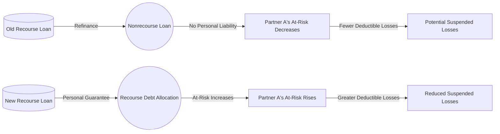

## 16.3 Debt Reallocation & Impact on At-Risk & Passive Losses

When partners or members of limited liability companies (LLCs) think about optimizing their tax positions, they often focus on how the debt of the entity is allocated. Debt allocation affects each partner’s at-risk amount and, consequently, the extent to which they can deduct losses annually. Additionally, these allocations play a critical role under the passive activity loss (PAL) rules, which can limit or suspend each partner’s ability to claim losses. In this section, we will explore critical concepts behind debt reallocation, share planning considerations, and use practical examples to illustrate how recourse vs. nonrecourse debt can mitigate or create at-risk shortfalls.

Throughout this discussion, keep in mind the interplay with other areas of partnership and LLC taxation, such as special allocations (see Chapter 11: “Partnerships & LLCs”), overall entity tax planning (see Chapter 13: “Entity Choice & Formation Strategies”), and passive activity considerations (see Chapter 5: “Passive Activity & At-Risk Rules”). Mastering these areas will help you navigate the Uniform CPA Examination Tax Compliance and Planning (TCP) section with confidence.

--------------------------------------------------------------------------------

## Overview and Relationship to Partnership & LLC Tax Planning

A partnership or LLC that needs external financing often secures loans in different forms—some may be recourse, meaning one or more partners can be held personally liable for repayment, while others may be nonrecourse, meaning the lender can only look to the collateral (the partnership’s or LLC’s property) for repayment. The classification of these debts affects each partner’s:

• At-risk calculation under IRC §465.  
• Ability to utilize current-year and suspended losses under the passive activity loss rules of IRC §469.  
• Basis in their partnership interest, influencing future distributions, liquidation events, and dispositions.  

Understanding how these debts are allocated among the partners is crucial, as improper or unplanned allocations may create at-risk shortfalls, triggering potential disallowances of deductions, or conversely, enhanced capacity for deducting losses if structured carefully.

--------------------------------------------------------------------------------

## Recourse vs. Nonrecourse Debt

### Recourse Debt

Recourse debt exists where at least one partner (or member) has personal liability for the obligation. In a general partnership, all partners typically share recourse liability for partnership debts unless there is a specific agreement stating otherwise. In an LLC, recourse debt is less common unless a member or manager provides a personal guarantee for the loan.

Under the Treasury Regulations, recourse debt is allocated to partners who bear the economic risk of loss. In practice, this often means that if a partner personally guarantees a loan (or if that partner is obligated to make a capital call to cover the entity’s repayment obligations), that portion of the debt is allocated to that partner’s at-risk amount.

### Nonrecourse Debt

Nonrecourse debt is characterized by the lender’s reliance solely on the partnership or LLC assets for repayment. No partner or member is personally on the hook—absent a specific agreement or personal guarantee. Consequently, nonrecourse debt is typically allocated among partners based on their profit-sharing ratios or through more intricate rules of §704(b) and §752.  

A large portion of commercial real estate financing is often structured as nonrecourse loans, limiting personal liability while leveraging property as collateral. However, that means no single partner bears the risk of loss for that debt in the traditional sense—unless special carve-outs or “bad boy” guarantees apply.

--------------------------------------------------------------------------------

## The At-Risk Rules

### Basic Mechanics Under IRC §465

The at-risk rules limit the amount of losses that individuals, S corporation shareholders, and certain partners in partnerships can deduct to the amount of money and property they have “at risk” in the activity. Essentially, losses cannot exceed a taxpayer’s economic stake. At-risk amounts can increase with additional cash contributions, the assumption of recourse debt, or net income allocations. They can decrease with distributions, allocations of losses, or reductions in partnership-level debt for which the partner is personally at risk.

In a partnership context, the main question is: “To what extent does each partner stand to lose if the project fails and the partnership defaults on its debts?” If a partner makes a personal guarantee on a partnership’s recourse debt, that guarantee typically increases that partner’s at-risk amount. Conversely, if the debt is nonrecourse, the partner generally will not be deemed at-risk for that portion because the creditor cannot pursue the partner personally (subject to specific exceptions like qualified nonrecourse financing in real estate).

### Interaction with Passive Activity Limitations

Even if a partner has enough at-risk basis to claim losses, passive activity loss (PAL) rules—described in detail in Chapter 5—may still suspend those losses if the partner fails to meet material participation thresholds and the activity is classified as passive. In other words, satisfying at-risk rules is necessary but not sufficient on its own for deductibility; the partner must also navigate the passive activity framework.

--------------------------------------------------------------------------------

## Debt Reallocation Mechanisms

As partnerships evolve, they may refinance existing debt, modify loan agreements, add new partners, or shift liability among partners. The changes will inevitably alter both each partner’s at-risk amount and the partner’s exposure to passive losses. Typical scenarios include:

1. Converting Recourse to Nonrecourse:  
   • The partnership refinances a loan previously guaranteed by a specific partner, releasing that individual guarantee and turning the debt into nonrecourse.  
   • This conversion causes the partner’s individual at-risk exposure to drop, potentially limiting loss deductions.

2. Converting Nonrecourse to Recourse (or Partial Recourse):  
   • A new partner stepping in or an existing partner personally guaranteeing the debt.  
   • This transformation increases that partner’s at-risk amount, enabling higher loss deductions (subject to other limitations, including the passive activity rules).

3. Allocation Among New Partners or Ownership Changes:  
   • Adding new partners or changing ownership percentages can alter how recourse or nonrecourse liabilities are allocated.  
   • If a new partner assumes recourse liability, that partner’s at-risk balance may jump, whereas other partners might see no impact if they are not liable.

--------------------------------------------------------------------------------

## Impact on At-Risk Amount

### Increasing the At-Risk Amount

Partners can increase their at-risk amounts by:

1. Contributing additional cash or property to the partnership.  
2. Assuming a greater share of recourse debt through personal guarantees.  
3. Electoral or contractual arrangements that shift economic risk of loss.  
4. Generating net taxable income within the activity that is allocated to them.

A deliberate shift of debt from nonrecourse to recourse can boost a partner’s at-risk basis—an appealing strategy when large operating or depreciation losses (common in real estate deals) are expected, and the partner wishes to claim them currently rather than carry them forward.

### Decreasing the At-Risk Amount

However, modifications or re-financings that reduce a partner’s economic risk may cause the partner’s at-risk balance to drop, endangering the deductibility of partnership losses. These decreases occur whenever:

1. The partnership repays a recourse loan, thus removing the partner’s personal exposure.  
2. A partner is released from a personal guarantee.  
3. Recourse debt is converted to nonrecourse financing, shifting risk away from the partner.

When a partner’s at-risk amount is reduced below zero, losses must generally be suspended until at-risk capacity is restored, or the partner disposes of the activity entirely (subject to passive loss recapture rules and other provisions).

--------------------------------------------------------------------------------

## Impact on Passive Losses

Debt allocations also matter under the passive loss rules. Here are some key considerations:

• Even if a partner increases at-risk basis (e.g., by personal guarantee of a loan), the partner might still be subject to passive loss constraints if the partner does not materially participate in the business.  
• Passive activity losses can be offset only by passive activity income unless there is a complete disposition or other exceptions.  
• Strategic planning might involve pairing recourse debt allocations with partial shifts in responsibilities or roles to bolster material participation.  

The interplay of at-risk and passive activity rules is particularly relevant for real estate partnerships. Although many real estate activities are inherently passive, some investors may meet the real estate professional rules (see Chapter 5) or otherwise qualify for exceptions—making the distinction between recourse and nonrecourse financing even more significant.

--------------------------------------------------------------------------------

## Practical Diagram: How Debt Reallocation Flows Affect At-Risk Amount

The following diagram illustrates the flow of debt reallocation and its effect on at-risk amounts for a hypothetical partner, Partner A, in a partnership:

Explanation of this flowchart:  
• When an old recourse loan is refinanced into a nonrecourse loan, Partner A’s personal exposure is eliminated or reduced. Consequently, Partner A’s at-risk balance can decrease, restricting deductible losses going forward.  
• Conversely, when a new recourse loan is put in place, or Partner A personally guarantees the debt, the at-risk tendency for that partner increases, which typically expands their capacity to deduct partnership losses in the current year.

--------------------------------------------------------------------------------

## Best Practices and Common Pitfalls

### Best Practices

• Keep Thorough Documentation: Always maintain legal and tax documentation, including guarantee agreements and evidence of personal liability.  
• Plan Debt Arrangements Before Large Losses: Consider the timing of conversions or new guarantees around years with large anticipated losses.  
• Coordinate with Passive Loss Planning: Ensure that recourse debt decisions are consistent with meeting or maximizing allowable loss deductions under both at-risk and passive activity frameworks.  
• Evaluate Economic Substance: The IRS pays close attention to arrangements that attempt to artificially inflate at-risk amounts without true economic exposure.

### Common Pitfalls

• Excessive Reliance on Nonrecourse Loans: While less risky to partners personally, exclusive reliance on nonrecourse financing can severely limit the deductibility of partnership losses.  
• Inadvertent Terminations: Overlooking personal guarantees may unintentionally shift the recourse status of a loan, causing unexplored tax consequences and potential membership changes that could trigger partnership termination rules.  
• Failing to Recognize Guarantor Limitations: Merely signing a guarantee does not always create full recourse status. For example, “bad boy” guarantees that only trigger liability under certain events (e.g., fraud, criminal misconduct) may not materially affect at-risk calculations if the risk of those events is deemed remote.

--------------------------------------------------------------------------------

## Case Study: Recourse vs. Nonrecourse Shift and At-Risk Shortfalls

### Background

• ABC LLC has three members: Anna, Ben, and Carla. Each holds an equal one-third interest.  
• The LLC invests in commercial real estate financed by a $900,000 loan. Initially, Carla personally guarantees the entire loan, making it recourse for Carla only. Anna and Ben have no personal liability.  
• Over the first few years, the LLC generates $200,000 in ordinary losses and $100,000 of net rental income. Carla claims large losses because her personal guarantee increases her at-risk amount. Anna and Ben, lacking recourse exposure, can only claim limited losses based on their original cash investments.

### Debt Reallocation

After three years, Carla wants to reduce personal risk.  
1. The LLC refinances the loan to a $900,000 nonrecourse loan with the real estate as the only collateral.  
2. Carla is released from her personal guarantee, so the new loan is entirely nonrecourse.  

### Impact on At-Risk

• Carla’s at-risk amount:  
  – Before the refinance, Carla’s at-risk amount was $300,000 (plus her share of any partnership basis from capital contributions and prior net income allocations).  
  – After the refinance, Carla’s guarantee is released. She is no longer personally on the hook, so her at-risk amount from debt is drastically reduced.  
  – If Carla’s prior losses had been deducted in full, any future losses might now be limited. Furthermore, if the reduction in Carla’s at-risk amount creates a shortfall relative to previously claimed deductions, Carla may face suspended losses.

• Anna and Ben’s at-risk amounts:  
  – Before the refinance, Anna and Ben had no additional at-risk basis from the debt. They relied on initial investments for their at-risk amounts.  
  – After the refinance, Anna and Ben’s situation regarding debt does not substantially change, as the loan is still not personally guaranteed. Their at-risk amounts remain limited to their equity contributions and share of net income.  

### Consequences

• Carla will likely have less capacity to offset current-year or future losses. If the refinanced, nonrecourse loan prevents her from meeting the at-risk requirement for subsequent losses, those losses become suspended.  
• Anna and Ben see no major change in their at-risk amounts because they did not assume personal liability either before or after the refinance.  
• Passive Loss Consideration: All three members still have to consider the passive activity rules. If they are not materially participating, any net losses may be limited to passive income.  

In this scenario, the shift from recourse to nonrecourse financing effectively reduces Carla’s at-risk capacity and could create a shortfall if the LLC continues to generate losses. This shortfall will either suspend the losses or require a further strategy (e.g., material participation or additional capital contributions).

--------------------------------------------------------------------------------

## Additional Real-World Considerations

• Qualified Nonrecourse Financing: Real estate investors often rely on “qualified nonrecourse financing” to count certain nonrecourse debt toward their at-risk basis if statutory and regulatory requirements are met.  
• Multi-Tiered Partnerships: With complex partnership structures, it is crucial to track liability allocations through multiple layers of entities, especially if top-tier partners or LLC members hold partial guarantees.  
• Changes in Tax Law: Revisit debt allocations periodically to ensure compliance with evolving regulations or clarifications by the IRS regarding personal guarantees and economic risk of loss.  
• Multi-State Context: In situations where partners are located in different states, local laws may affect the enforceability of personal guarantees and how debt is treated for tax or asset protection purposes.

--------------------------------------------------------------------------------

## References for Further Exploration

• Internal Revenue Code §§465 and 469.  
• Treasury Regulations §1.465-1 through §1.465-27 (At-Risk Rules) and §1.752-1 through §1.752-7 (Liabilities of a Partnership).  
• IRS Publication 925: Passive Activity and At-Risk Rules.  
• “Partnerships & LLCs” (Chapter 11 of this volume) for a broader discussion of partnerships and LLC operations.  
• “Passive Activity & At-Risk Rules” (Chapter 5 of this volume) for an in-depth look at how these rules interplay with broader tax planning considerations.  

--------------------------------------------------------------------------------

## SEO-Optimized Quiz on Debt Reallocation & At-Risk/Passive Losses



### Which type of liability generally increases a partner’s at-risk amount the most?

- [ ] Nonrecourse liabilities shared by all partners.  
- [ ] Seller-financed nonrecourse debt secured by partnership property.  
- [x] Personally guaranteed recourse liabilities.  
- [ ] Liabilities backed by a partnership’s capital contributions only.  

> **Explanation:** Recourse debt that is personally guaranteed by a partner increases that partner’s at-risk amount because the partner bears the true economic risk of loss if the partnership defaults.

---

### Under the at-risk rules, a partner’s potential loss deductions are limited to:

- [ ] The total capital contributed alone.  
- [ ] The fair market value of the partnership’s assets.  
- [ ] The partner’s share of recourse debt only.  
- [x] The partner’s economic stake in the activity, including cash contributions, property contributions, and qualified debt exposure.  

> **Explanation:** The at-risk rules limit deductions to the amount of actual economic risk borne by the taxpayer, which can include cash contributions, property contributions, and recourse debt for which the partner is personally liable.

---

### Converting recourse financing to nonrecourse typically has what effect on a partner’s at-risk amount?

- [ ] Significantly increases their personal exposure.  
- [x] Decreases their personal exposure and may limit future losses.  
- [ ] Leaves all at-risk amounts unchanged since the total debt remains the same.  
- [ ] Automatically triggers phantom income.  

> **Explanation:** When recourse debt is replaced with nonrecourse debt, the partner no longer faces personal exposure, reducing their at-risk amount and potentially limiting their ability to deduct losses.

---

### What is a common pitfall when using too much nonrecourse financing in a partnership or LLC?

- [ ] It creates double-taxation at the entity level.  
- [x] It can severely limit the partners’ ability to deduct losses under the at-risk rules.  
- [ ] It invalidates the partnership agreement for tax purposes.  
- [ ] It complicates the material participation analysis.  

> **Explanation:** Nonrecourse debt does not increase a partner’s personal exposure, thereby reducing the at-risk amount that supports current loss deductions.

---

### In the context of passive activity loss (PAL) rules, which factor is crucial beyond having sufficient at-risk basis?

- [x] Material participation in the underlying business activity.  
- [ ] The amount of guaranteed payments to partners.  
- [ ] Whether the partnership rents equipment to a related party.  
- [x] The type of property contributed, such as intangible or physical.  

> **Explanation:** Even if the partner has enough at-risk basis, passive losses are generally limited unless the partner meets the material participation tests or the activity qualifies for certain exceptions.

---

### When a partner personally guarantees a partnership liability, that debt is generally considered:

- [x] Recourse debt allocated to the guaranteeing partner for at-risk purposes.  
- [ ] Nonrecourse debt allocated proportionally among the partners.  
- [ ] Contingent debt not considered for at-risk calculations.  
- [ ] Convertible debt that is automatically reclassified under IRC §704.  

> **Explanation:** A personal guarantee typically makes the debt recourse to the guaranteeing partner, who thus bears the true economic risk of loss.

---

### In a multi-partner scenario, which statement best describes a recourse liability?

- [x] It is allocated to whichever partner or partners ultimately bear the economic risk of loss.  
- [ ] It is always split equally among partners sharing profit and loss 50-50.  
- [x] It must be fully allocated to the managing partner only.  
- [ ] It is always shared according to capital account balances.  

> **Explanation:** Per Treasury Regulations, recourse liabilities are allocated specifically to those who bear the risk of having to repay the debt if the entity defaults, rather than automatically split by ownership percentage or capital accounts.

---

### Which of the following would not typically increase a partner’s at-risk amount?

- [ ] Additional cash contributions to the partnership.  
- [x] Distributions of money from the partnership to the partner.  
- [ ] Recognition of partnership income allocated to the partner.  
- [ ] The partner’s personal assumption of guaranteed debt.  

> **Explanation:** A cash distribution generally lowers a partner’s capital account and often reduces the at-risk amount, whereas contributions, income allocations, or assuming recourse debt generally increase it.

---

### What key characteristic differentiates “qualified nonrecourse financing” from standard nonrecourse debt for at-risk purposes?

- [x] It is often used in real estate, and specific rules allow such debt to be counted toward at-risk amounts if it meets IRS requirements.  
- [ ] It is not allowable under the Internal Revenue Code.  
- [ ] It must be guaranteed by each partner in writing.  
- [ ] It always requires joint and several liability among partners.  

> **Explanation:** Qualified nonrecourse financing relates mostly to real estate, where specific IRS guidelines permit certain nonrecourse loans to be treated as at-risk for the borrower, thus increasing or maintaining at-risk amounts.

---

### True or False: Merely signing a “bad boy” guarantee for a partnership loan will always transform that debt into recourse for at-risk purposes.

- [x] True  
- [ ] False  

> **Explanation:** Sometimes “bad boy” guarantees do create a recourse element because the guarantor becomes personally liable if specific “bad acts” occur. However, the IRS may scrutinize the likelihood of these triggering events in determining if the partner truly bears an economic risk of loss.



--------------------------------------------------------------------------------

## For Additional Practice and Deeper Preparation

**[TCP CPA Hardest Mock Exams: In-Depth & Clear Explanations](https://www.udemy.com/course/tcp-cpa-mock-exams/?referralCode=675149871D0E79B1699C)**  

**Tax Compliance & Planning (TCP) CPA Mocks:** 6 Full (1,500 Qs), Harder Than Real! In-Depth & Clear. Crush With Confidence! 

- Tackle full-length mock exams designed to mirror real TCP questions.  
- Refine your exam-day strategies with detailed, step-by-step solutions for every scenario.  
- Explore in-depth rationales that reinforce higher-level concepts, giving you an edge on test day.  
- Boost confidence and minimize anxiety by mastering every corner of the TCP blueprint.  
- Perfect for those seeking exceptionally hard mocks and real-world readiness.  

_Disclaimer: This course is not endorsed by or affiliated with the AICPA, NASBA, or any official CPA Examination authority. All content is for educational and preparatory purposes only._
