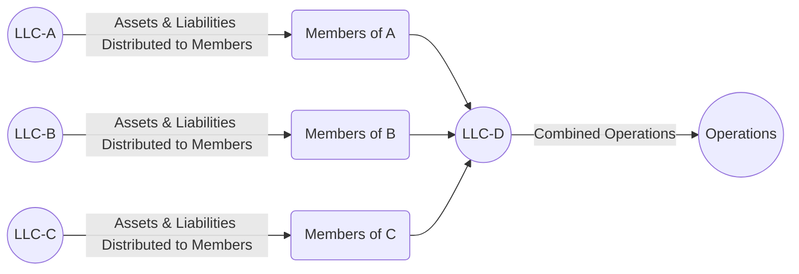

## 16.4 Roll-Up Strategies, Partnership Mergers & Divisions

Roll-up strategies, partnership mergers, and divisions represent advanced planning techniques used by businesses and advisors to consolidate or separate partnership activities. These strategies can address changes in ownership, operational restructuring, liability management, and tax optimization. Mergers may help achieve economies of scale, while divisions can isolate risks or spin off non-core operations. In each scenario, compliance with the Internal Revenue Code (IRC) and Treasury Regulations is critical—particularly in avoiding disguised sales and properly reallocating liabilities among partners.

In this section, we will explore key considerations, potential pitfalls, practical examples, and best practices related to roll-up strategies (combining multiple partnerships), merging existing partnership entities, and dividing a single partnership into multiple entities. We will also examine IRC §§ 704(b)/(c), 707, 721, 752, and other pertinent regulations that govern partnership transactions.

---
### Overview of Roll-Up Strategies in Partnerships

A “roll-up” strategy consolidates multiple smaller partnerships (or LLCs treated as partnerships for tax purposes) into a single partnership entity. Businesses often pursue roll-ups to:
• Streamline operations and reduce overhead.  
• Increase negotiating power in the marketplace.  
• Centralize management functions, finance, and reporting.  
• Improve capital-raising capabilities and growth opportunities.  

From a tax standpoint, roll-ups often attempt to minimize immediate gain recognition, manage liability transfers, and maintain original basis in contributed assets. The primary guiding provisions for nonrecognition of gain or loss generally arise under IRC §§ 721 (contributions of property to a partnership) and 731 (partnership distributions), subject to potential limitations.

---
### Common Methods of Roll-Ups and Mergers

When combining existing partnerships into a single surviving entity, there are several structures recognized under the regulations. The **asset-over**, **asset-up**, and **interest-over** forms prevail, although the “asset-over” approach is the most common for partnership mergers under the [Treasury Regulations §1.708-1(c)](https://www.law.cornell.edu/cfr/text/26/1.708-1).

1. **Asset-Over Form:**
   - Each terminating partnership distributes its assets and liabilities to its partners, who then contribute them to the surviving partnership in exchange for a partnership interest.  
   - The resulting entity is treated as if the terminating partnership’s assets were contributed directly to the surviving partnership.  
   - This method often aligns with nonrecognition transactions under IRC §721, provided that no disguised sale or gain-triggering event is present.

2. **Asset-Up Form:**
   - The terminating partnership contributes its assets and liabilities to the surviving partnership in exchange for an interest in the surviving partnership, followed by a liquidating distribution of that new interest to the partners of the terminating partnership.  
   - The terminating partnership then dissolves.  

3. **Interest-Over Form:**
   - Partners in the terminating partnership exchange their partnership interests for interests in the surviving partnership.  
   - For federal tax purposes, the terminating partnership’s assets are deemed transferred to the new owners (the surviving partnership), typically resulting in more complex basis adjustments.

Under **Treas. Reg. §1.708-1(c)(3)**, the asset-over form is typically considered the default form of partnership merger for tax purposes, but facts and circumstances may cause the transaction to be recast under an alternative model.

---
### Disguised Sale Concerns

A significant issue in any partnership restructuring, including roll-ups and mergers, is the potential application of the **disguised sale rules** under IRC §707(a)(2)(B) and Treas. Reg. §§1.707-3 to 1.707-9. A disguised sale can occur when:
- A partner contributes property to the partnership.
- In connection with the contribution, the partner receives a distribution of cash or other property that is, in substance, a sale of the contributed property.

In a roll-up, if one partnership is wealthy in assets and the other in cash, careful attention must be given to how assets and liabilities are reallocated or how distributions are structured. If the partner who contributed property receives a related distribution, the IRS may classify that distribution as a disguised sale. For instance, if transferring Partnership A merges with Partnership B that has significant cash, and soon after the merger certain distributions flow back to former A-partners in proportion to the newly contributed property, the IRS may scrutinize whether this arrangement was effectively a sale of A’s assets to B.

**Key steps to mitigate disguised sale classification:**
• Properly document business reasons (beyond mere tax benefits) for the transaction.  
• Avoid prearranged distributions that match contributed property in a way that suggests sale consideration.  
• Adhere to relevant two-year presumption periods: if distributions to contributing partners occur within two years of the contribution, the transaction is presumed a disguised sale unless sufficient evidence counters that presumption.  
• Draft operating agreements and plan carefully to ensure that capital accounts, allocations, and distributions align with legitimate business needs.

---
### Liability Reallocation Under IRC §752

Liability reallocation is a crucial area in partnership mergers and roll-ups. Under **IRC §752**, an increase in a partner’s share of partnership liabilities is treated as a contribution of money by that partner, while a decrease is treated as a distribution of money from the partnership to the partner. This can trigger gain recognition if the deemed distribution exceeds the partner’s outside basis.

In a roll-up scenario, if the total debt of the newly combined partnership is not distributed among the original partners in proportion to their original shares, certain partners may realize a deemed distribution. Partners whose share of liabilities decreases substantially may need to recognize gain if their outside basis is not sufficient to absorb the deemed distribution. Conversely, an increase in share of liabilities may allow a partner to avoid gain recognition or increase basis, but it must be structured carefully to avoid unintended consequences.

---
### Partnership Divisions

While roll-ups focus on consolidation, **partnership divisions** address the scenario where a single partnership splits into two or more distinct partnerships. Reasons for divisions include:
• Spinning off a line of business or a property portfolio.  
• Simplifying complex structures to limit liability.  
• Resolving partner disputes by separating assets and operations.  

Under **Treas. Reg. §1.708-1(d)**, a partnership division is generally regarded as either:  
1. A **divide-up** where the original partnership terminates, distributing assets to multiple resulting partnerships.  
2. A **spin-off** where the original partnership continues, but certain assets are transferred to a new partnership to be owned by some or all of the former partners.

As in a merger, partnership divisions can be accomplished via **asset-over** or other forms. The default is usually the asset-over form, where:  
1. The original partnership contributes a portion of its assets and liabilities to one or more new partnerships.  
2. The original partnership distributes the interests in the new partnerships to some or all of the partners in a liquidating or nonliquidating transaction (depending on the facts).

**Potential Pitfalls in Divisions**  
- **Basis Adjustments**: If a partner’s interest in the divided partnership changes, outside and inside bases may shift, requiring strategic planning under §§704(c) and 732.  
- **Disguised Sale Risk**: Especially if one group of partners receives assets that were contributed recently by another partner, accompanied by cash distributions that resemble purchase proceeds.  
- **Retaining Liabilities**: How liabilities are allocated post-division can create deemed contributions or distributions under §752.  

---
### Practical Example of a Partnership Roll-Up

Suppose three real estate development LLCs (treated as partnerships for tax purposes) wish to combine into a single partnership (LLC-D). Each of the three LLCs (LLC-A, LLC-B, LLC-C) has distinct assets, membership interests, and liabilities. The steps might be:

1. **Asset-Over Approach**:
   a. Each of LLC-A, LLC-B, and LLC-C liquidates by distributing its assets to its members in proportion to their capital accounts.  
   b. The members of these LLCs immediately contribute those assets (and associated liabilities) into LLC-D in exchange for membership interests reflecting their pro rata property contributions.  
   c. LLC-D now holds all the real estate assets, subject to the assumed liabilities. Each former member of the three LLCs is a member of LLC-D with a capital account that reflects the fair market value (and built-in gain/loss) of their contributed assets.  

2. **Liability Allocation**:  
   - LLC-D’s operating agreement stipulates each member’s share of liabilities.  
   - If a member’s share decreases relative to their prior share, they could be deemed to receive a distribution, potentially triggering gain if outside basis is exceeded.  

3. **Disguised Sale Review**:  
   - If any immediate or near-term distributions are planned for certain members, the structuring team must ensure that no transaction element resembles the sale of property.  
   - Document non-tax business motives (consolidating property management, leveraging combined assets for financing, etc.).  

4. **Post-Roll-Up Management**:  
   - Overhead and property management are centralized, allowing potential cost savings.  
   - If structured properly, no immediate taxable events occur except for potential disguised sale or reallocation of liability implications.

---

**Figure 1**: An example of an asset-over roll-up strategy for three LLCs (A, B, C) into LLC-D.

---
### Practical Example of a Partnership Division

Consider a large partnership (XYZ Partners) that owns multiple lines of business. Half the partners want to focus on a high-growth technology venture, while the other half want to continue with a stable real estate portfolio. A spin-off might proceed as follows:

1. **Creation of a New Partnership**:  
   - XYZ forms a new partnership, TechCo Partners, to receive all technology assets.  

2. **Asset Contribution**:  
   - XYZ transfers the technology assets and their associated liabilities to TechCo.  
   - TechCo issues partnership interests to XYZ.  

3. **Distribution of TechCo Interests**:  
   - XYZ then distributes the TechCo interests pro rata to the group of partners wishing to run the tech venture.  
   - Those partners exit XYZ entirely or remain in XYZ with reduced interests, depending on the negotiated arrangement.  

4. **Continuity of XYZ**:  
   - XYZ continues with the real estate assets.  
   - The distributed partners now own TechCo and operate independently.  

5. **Tax Considerations**:  
   - Confirm that the transaction qualifies as a nonrecognition event under §721.  
   - Monitor disguised sale rules—if the distribution of TechCo interests is seen as disguised consideration for the real estate assets left behind, there could be unintentional gain recognition.  
   - Reallocation of liabilities between the new and old partnerships might trigger deemed distributions.  

---
### Basis and Capital Account Issues

Both mergers and divisions can entail complex basis adjustments. Under **IRC §§ 704(b)** and **704(c)**, a partnership must track each partner’s capital account accurately, reflecting fair market value (FMV) on contributions, distributions, or revaluations. When property is contributed with built-in gains or losses, the partnership must allocate those gains or losses to the contributing partner upon a taxable disposition of that property, ensuring equity among partners who did not contribute the property.

A thorough capital account revaluation (often done under so-called “book-ups” in the capital accounts) may be necessary when a merger or division significantly alters the partners’ relative ownership percentages. Similarly, **§734** and **§743** adjustments may apply if the partnership has elected a *§754 election* to adjust the basis of partnership property when distributions or transfers of interests occur.

---
### Best Practices for Roll-Ups and Divisions

1. **Early Planning**:  
   - Engage tax advisors, attorneys, and appraisers early to evaluate the structure of the roll-up or division.  
   - Conduct due diligence on existing partnership agreements, liabilities, and partner basis information.  

2. **Robust Documentation**:  
   - Clearly articulate the business purpose for merging or splitting, especially if significant cash distributions occur around the same time.  
   - Maintain contemporaneous records that support the nontax motives of the transaction.  

3. **Careful Liability Allocation**:  
   - Identify each partner’s share of liabilities before and after the transaction.  
   - If a partnership interest reallocation shifts liabilities significantly, ensure that partners have sufficient outside basis to avoid gain.  

4. **Monitor Two-Year Presumption Period**:  
   - If property is contributed and partners receive distributions within a two-year window, carefully document that the distribution is not part of a disguised sale arrangement.  

5. **Check Local and State Tax Implications**:  
   - State and local jurisdictions may impose transfer taxes, real estate taxes, or require retitling procedures when property is moved between entities.  
   - Some states treat partnership mergers or divisions differently for property tax reassessment.  

6. **§754 Election**:  
   - Where beneficial, a timely §754 election can help align inside basis with outside basis in transfers and distributions, potentially reducing future gain recognition.  

7. **Long-Term Planning**:  
   - Post-reorganization integration or separation strategies should consider future capital needs, partner retirements, or expansions.  
   - A well-structured roll-up or division can streamline exit events (e.g., an eventual sale or IPO).  

---
### Common Pitfalls and Challenges

1. **Disguised Sale Misclassification**:  
   - Failing to recognize that near-simultaneous cash distributions can trigger disguised sale rules even if unintended.  
   - Not applying the correct exceptions or safe harbors under Treas. Reg. §1.707-4 for certain reimbursements (e.g., for preformation expenditures of capital improvements).  

2. **Unanticipated Gain Recognition**:  
   - Under §752, a partner’s basis may be insufficient to cover a deemed distribution from decreased liability allocation.  
   - Large shifts in liability shares can unexpectedly generate partnership-level revaluations or trigger capital account restatements.  

3. **Complexity in Multi-Layered Ownership**:  
   - Larger partnerships sometimes own multiple tiers of subsidiaries. Combining or dividing these layered structures can be convoluted.  
   - Partnerships with foreign partners have additional considerations for withholding and effectively connected income.  

4. **Missed Deadlines**:  
   - Not filing appropriate state and federal forms in a timely manner could expose the partnership to penalties.  

5. **Partner Disputes**:  
   - Mergers or divisions without clear partner consensus can lead to litigation, undermining the entire transaction.  

---
### Additional Real-World Considerations

• **Step Transaction Doctrine**: Courts or the IRS may “collapse” a series of steps into one transaction if they see a prearranged plan aimed at achieving a specific tax outcome. This can reclassify the nature of the deal and possibly generate unexpected tax liability.  
• **Due Diligence**: Thoroughly investigate the tax attributes, liabilities, and prior year distribution patterns of each combining partnership.  
• **State Law Formalities**: Most states have statutory procedures for merging or dividing LLCs. Failing to observe corporate formalities (including valid consents or membership votes) can invalidate the transaction.  

---
### References for Further Exploration

• IRS Publication 541 – Partnerships  
• [Treasury Regulation §1.708-1](https://www.law.cornell.edu/cfr/text/26/1.708-1): Guidance on partnership mergers and divisions  
• [IRC §707](https://www.law.cornell.edu/uscode/text/26/707): Disguised sale rules and transactions between partner and partnership  
• [IRC §752](https://www.law.cornell.edu/uscode/text/26/752): Treatment of certain liabilities in partnerships  
• “Federal Income Taxation of Partnerships & S Corporations,” by Paul R. McDaniel, Martin J. McMahon Jr., and Daniel L. Simmons  
• Online courses focusing on advanced partnership taxation on platforms like Coursera or LinkedIn Learning  

Utilizing these resources will help you expand your knowledge of the intricacies surrounding roll-ups, partner interest shifts, partnership mergers, and divisions.

---
### Conclusion

Roll-up strategies, partnership mergers, and divisions require careful, detail-oriented planning to avoid unintended tax consequences and liability traps. Understanding the asset-over, asset-up, and interest-over forms of restructuring—along with the disguised sale and liability allocation rules—ensures that transactions align with business objectives without triggering unnecessary tax burdens. Always maintain robust documentation demonstrating legitimate business purposes for merging or splitting partnership operations.  

When properly executed, these transactions can position an enterprise for growth, increased funding potential, or more efficient operations, while preserving the tax attributes of assets and balancing partner-level considerations. Solid tax planning and thorough compliance remain vital to making these reorganizations a success.

---

## Test Your Knowledge: Partnership Roll-Up Strategies & Divisions Quiz



### In a roll-up transaction, which method is most commonly treated as the default under Treasury Regulations for partnership mergers?

- [ ] Interest-over form
- [ ] Asset-up form
- [x] Asset-over form
- [ ] Hybrid form

> **Explanation:** Under Treas. Reg. §1.708-1(c)(3), the asset-over form is typically considered the default method for federal tax purposes when merging partnerships.

### What is a primary driver behind a roll-up transaction?

- [ ] To hold excess idle cash outside of any business structure
- [x] To streamline operations by consolidating multiple partnerships
- [ ] To generate immediate taxable income for all partners
- [ ] To force partners to surrender their capital accounts

> **Explanation:** A common reason for a roll-up is to consolidate multiple smaller partnerships into one larger entity, thereby reducing administrative overhead and simplifying operations.

### Under IRC §707, which scenario below most likely triggers a disguised sale concern?

- [x] A partner contributes property to a partnership and a distribution of cash occurs shortly thereafter in proportion to that property
- [ ] A partner contributes services to a partnership and receives a K-1 showing ordinary income
- [ ] A partnership revalues its assets for book purposes
- [ ] A partnership makes a distribution of all net profits at year-end

> **Explanation:** Disguised sale rules often apply when a partner contributes property and receives a related cash distribution that essentially mimics a sale. The close timing and proportionality of the distribution are key red flags to the IRS.

### If a partner's share of partnership liabilities decreases significantly after a merger, how is it generally treated for tax purposes?

- [x] As a deemed distribution of money to that partner
- [ ] As a non-event, having no tax consequences
- [ ] As a recharacterization of ordinary income
- [ ] As a disguised sale under all circumstances

> **Explanation:** Under IRC §752, a decrease in a partner’s share of liabilities is treated as a deemed distribution of money, which may trigger taxable gain if it exceeds the partner’s outside basis.

### Which action can reduce the likelihood of disguised sale treatment when merging partnerships?

- [x] Documenting non-tax business motives and avoiding prearranged distributions tied to contributed property
- [ ] Distributing excessive cash immediately post-merger
- [x] Waiting more than two years before making non-routine distributions
- [ ] Reducing each partner’s outside basis to zero prior to merging

> **Explanation:** Strong documentation of non-tax reasons and adherence to safe harbors, including avoiding distributions within two years of contribution, help mitigate disguised sale risks.

### In a partnership division, which structure typically involves the original partnership transferring certain assets into a new partnership and distributing interests in that new partnership to selected partners?

- [x] Spin-off
- [ ] Captive reorganization
- [ ] Technical termination
- [ ] Asset termination

> **Explanation:** A spin-off involves the original partnership transferring assets to a new partnership and distributing the new partnership interests to some or all partners, often to isolate a separate line of business or investment.

### An effective measure to align inside and outside bases during reorganizations is:

- [ ] Liquidating the partnership immediately after the transaction
- [ ] Ignoring partner capital accounts
- [x] Making or reviewing a §754 election
- [x] Performing a capital account “book-up” when ownership interests change significantly

> **Explanation:** A §754 election allows adjustment of the inside basis to match a partner’s outside basis upon certain distributions or transfers, while a capital account “book-up” realigns capital accounts to reflect current FMV capital balances among partners.

### Which regulatory framework primarily governs the classification of partnership mergers vs. terminations?

- [ ] IRC §401(k)
- [ ] IRC §1031
- [x] IRC §708 and related Treasury Regulations
- [ ] IRC §265

> **Explanation:** IRC §708 and its accompanying Treasury Regulations set forth the rules for determining whether a partnership has continued or terminated, including definitions and tax treatments for mergers and divisions.

### What is one function of IRC §704(c) in the context of partnership reorganizations?

- [x] It ensures that built-in gains or losses on contributed property are allocated to the contributing partner upon disposition
- [ ] It eliminates capital accounts for all partners
- [ ] It invalidates any roll-up transaction that leads to basis changes
- [ ] It converts capital gains into ordinary income for all partners

> **Explanation:** Under §704(c), if a partner contributes property with a built-in gain or loss, the partnership must track and allocate that built-in amount to the contributing partner when the property is sold, to prevent shifts of tax consequences among partners.

### In structuring a partnership roll-up or division, is it generally advisable to map out potential disguised sale exposures before completing the transaction?

- [x] True
- [ ] False

> **Explanation:** Evaluating potential disguised sale exposures is crucial to avoid unplanned tax liabilities, especially if distributions are in close proximity to property contributions.



---

## For Additional Practice and Deeper Preparation

**[TCP CPA Hardest Mock Exams: In-Depth & Clear Explanations](https://www.udemy.com/course/tcp-cpa-mock-exams/?referralCode=675149871D0E79B1699C)**  

**Tax Compliance & Planning (TCP) CPA Mocks:** 6 Full (1,500 Qs), Harder Than Real! In-Depth & Clear. Crush With Confidence!

- Tackle full-length mock exams designed to mirror real TCP questions.  
- Refine your exam-day strategies with detailed, step-by-step solutions for every scenario.  
- Explore in-depth rationales that reinforce higher-level concepts, giving you an edge on test day.  
- Boost confidence and minimize anxiety by mastering every corner of the TCP blueprint.  
- Perfect for those seeking exceptionally hard mocks and real-world readiness.  

_Disclaimer: This course is not endorsed by or affiliated with the AICPA, NASBA, or any official CPA Examination authority. All content is for educational and preparatory purposes only._
