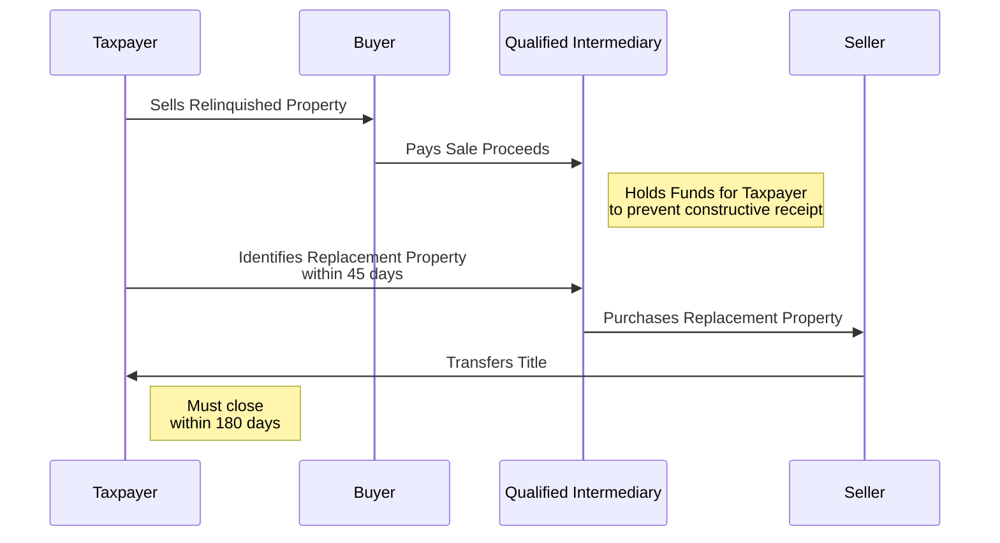

## 17.1 §1031 Like-Kind Exchanges (Real Estate, Timelines, Intermediaries)

Like-kind exchanges under §1031 of the Internal Revenue Code remain a pivotal strategy for taxpayers wanting to defer recognition of gains when swapping real estate assets. For CPA candidates, mastery of §1031 exchanges is essential, as these transactions frequently appear on the Uniform CPA Examination. This section provides a deep dive into the requirements, timelines, and mechanics of §1031 exchanges, with an emphasis on real estate transactions.

Tax professionals must have a thorough understanding of the nuances surrounding reporting, timelines (particularly the 45-day identification period and the 180-day exchange period), and the critical role of Qualified Intermediaries (QIs). By strategically leveraging §1031, businesses and individuals can optimize their tax liabilities and continually grow their real estate portfolios.

---

### Understanding the Concept of Like-Kind Exchanges

A §1031 exchange (often referred to simply as a “1031 exchange”) allows taxpayers to defer capital gains taxes by exchanging one real property held for business or investment purposes for another property of “like kind.” While the term “like kind” is broad, in practice it applies to real property held for productive use in a trade or business or for investment. Such real properties can be swapped, provided both the relinquished property and the replacement property meet §1031 requirements.

Key advantages of engaging in a 1031 exchange include:  
• Deferral of current capital gains taxes.  
• Potential for wealth accumulation by rolling gains into new investments.  
• Improved and diversified investment portfolios without immediate tax consequences.  

---

### Eligibility of Real Estate and Limitations

Real estate that typically qualifies for a 1031 exchange includes land, commercial buildings, multifamily properties, rental houses, and certain leasehold interests with a remaining lease term of at least 30 years. Properties that do not qualify for a 1031 exchange generally include:  
• Personal residences (unless converted to rental and meeting investment criteria).  
• Properties held primarily for resale (e.g., fix-and-flip homes).  
• Inventory real estate or dealer property.  

Additionally, vacation properties present unique considerations. If a taxpayer uses a vacation home strictly for personal use, it will not generally qualify as a like-kind property. However, if the taxpayer also rents the property out for a substantial portion of the year, the property may arguably be viewed as an investment (subject to certain usage tests).  

---

### Role of Qualified Intermediaries (QIs)

A Qualified Intermediary (QI) — sometimes known as an accommodator or facilitator — is a neutral third party that helps execute the multiple steps of a 1031 exchange. Under IRS regulations, the taxpayer may not directly receive proceeds from the sale of the relinquished property. Instead, the QI holds these funds and then applies them to acquire the replacement property on behalf of the taxpayer.

Without a QI, the Internal Revenue Service deems the taxpayer to have “constructive receipt” of the proceeds, invalidating the tax-deferred exchange. Thus, selecting a reputable and experienced QI can help ensure the transaction’s compliance and mitigate the risk of inadvertent rule violations.  

---

### Essential Timelines

Two critical timeframes govern the 1031 exchange process:

1. The 45-Day Identification Period:  
   • The taxpayer has exactly 45 days from the date the relinquished property is transferred (the closing date) to identify potential replacement properties.  
   • The identification must be in writing, signed, and delivered to the QI or another party involved in the transaction, but not to a “disqualified party.”  
   • The taxpayer can identify up to three properties regardless of their value (commonly called the Three-Property Rule), or use the 200% rule or 95% rule for cases involving multiple properties (see “Advanced Examples with Multiple Properties” below).

2. The 180-Day Exchange Period:  
   • The taxpayer must close on the replacement property or properties no later than 180 days from the date of the sale of the relinquished property or the due date (including extensions) of the taxpayer’s tax return for the year of the transfer, whichever comes first.  

Failure to meet the 45-day or 180-day deadlines typically disqualifies the transaction from being treated as a valid §1031 exchange, resulting in immediate recognition of capital gain.

---

### Step-by-Step Process of a Standard §1031 Exchange

While all 1031 exchanges follow certain universal rules, details can vary depending on the type and complexity (e.g., simultaneous exchange, reverse exchange, construction exchange). Below is a general sequence for a standard deferred 1031 exchange:

1. Relinquished Property Sale Agreement:  
   • The taxpayer markets the property to potential buyers and executes a sales contract.  
   • Ensure the contract includes appropriate 1031 exchange cooperation language.

2. Engage a Qualified Intermediary:  
   • Prior to closing, the taxpayer retains a QI.  
   • The QI prepares an exchange agreement and assignment documents that assign the taxpayer’s rights in the sale contract to the QI.

3. Closing on the Relinquished Property:  
   • At closing, the proceeds flow directly to the QI; the taxpayer should not receive or control the funds.  
   • The date of closing starts the 45-day and 180-day clocks.

4. Identify Replacement Property:  
   • Within 45 days of the closing, the taxpayer submits a written list of potential replacement properties to the QI or another permitted party.  
   • Use either the Three-Property Rule, the 200% rule, or the 95% rule for multiple properties, as needed.

5. Acquire the Replacement Property:  
   • The taxpayer, together with the QI, finalizes the purchase of the identified replacement property or properties.  
   • Settlement must occur before the end of the 180-day window or the extended due date of the taxpayer’s income tax return, whichever is earlier.  
   • The QI facilitates the purchase, using the proceeds from the relinquished property sale.

6. Documentation and Reporting:  
   • The taxpayer files Form 8824 (Like-Kind Exchanges) with the relevant tax return, reporting the exchange details.  
   • Maintain comprehensive records, including closing statements, identification notices, and QI agreements, to substantiate the nonrecognition of gain.

---

### Example of a Simple Single-Property Exchange

Assume a taxpayer owns an apartment building (with an adjusted basis of $500,000) worth $900,000. The taxpayer wishes to sell and replace it with a commercial office unit of roughly equivalent value. By engaging a QI and properly identifying the office property within 45 days and closing within 180 days, the taxpayer defers the taxable gain of $400,000.

---

### Advanced Examples with Multiple Properties

Multiple-property exchanges often surface when a taxpayer aims to diversify property holdings or consolidate small properties into a single larger one. Let’s look at two scenarios illustrating more complex exchanges and the associated identification rules.

#### Example 1: Diversification of a Single Large Property into Multiple Smaller Properties

• Scenario:  
  – A taxpayer owns a commercial warehouse worth $2 million (adjusted basis $1.2 million).  
  – The taxpayer desires to exchange into two retail storefronts, each costing $1 million, to diversify the investment portfolio.  

• Steps:  
  – The taxpayer locates a buyer for the warehouse and arranges the sale.  
  – A QI is engaged before closing to hold proceeds of $2 million from the relinquished warehouse.  
  – Within 45 days of the warehouse sale, the taxpayer identifies both storefronts as the replacement properties.  
  – Both acquisitions close within the 180-day window for a total of $2 million.  
  – The taxpayer defers the $800,000 gain (calculated as $2 million sale price minus $1.2 million basis).  

• Important Notes:  
  – This example fits conveniently within the Three-Property Rule (the taxpayer identified only two properties).  
  – Each replacement property must be properly identified in writing, with adequate property descriptions.  
  – Any leftover funds from the exchange proceeds not reinvested in the replacement properties are “boot” and will be taxable.  

#### Example 2: Partial Exchange With Multiple Replacement Properties (200% Rule)

• Scenario:  
  – A taxpayer sells two adjacent industrial lots for a combined $3 million (adjusted basis $1.5 million).  
  – The taxpayer wants to identify five replacement properties to facilitate potential negotiations, unsure which ones might fall through. The total fair market value of the identified properties is $7 million, which exceeds 200% of the sale price.  

• The 200% Rule:  
  – Normally, a taxpayer can only identify up to three properties. However, if they want to identify more, they can use the 200% rule, which states that the aggregate fair market value of identified properties cannot exceed 200% of the relinquished property’s sale price.  
  – Here, 200% of $3 million equals $6 million. Because the total of the identified properties ($7 million) exceeds that $6 million threshold, the taxpayer cannot rely solely on the 200% rule.  

• The 95% Exception:  
  – The third identification method is the “95% rule,” stating that if the taxpayer acquires 95% of the total fair market value of all properties identified, the exchange retains its validity.  
  – If the taxpayer ends up purchasing nearly all of the identified properties, meeting at least 95% of the total value, the exchange is preserved despite exceeding the 200% rule.  

• Outcome:  
  – The taxpayer must either reduce the number of identified properties (so the total does not exceed $6 million) or plan to purchase at least $6.65 million worth of real estate (95% of $7 million) to satisfy the 95% rule.  
  – If the taxpayer acquires replacement properties worth only $5.5 million, they would fail both the 200% rule and the 95% rule, rendering part of the exchange ineligible, or forcing any shortfall to be taxable.  

---

### Diagram: 1031 Exchange Flow

Below is a simplified sequence diagram showing a deferred 1031 exchange:

In this process, the taxpayer never directly controls the proceeds. The QI orchestrates the transition from the relinquished property to the purchase of the replacement property.

---

### Best Practices and Common Pitfalls

• Engage a QI Early:  
  – Find an experienced QI to handle the proceeds and the exchanges. Delaying this step can cause you to miss crucial paperwork deadlines.

• Clear Documentation:  
  – Keep comprehensive records and maintain careful notes of identification communications (memos, emails, letters, etc.).

• Monitor Timelines Strictly:  
  – Missing the 45-day or 180-day deadlines will void the exchange.  
  – Consult your CPA and attorney to set reminders in place.

• Plan Ahead for Financing:  
  – Pre-arrange financing for the replacement property to avoid delays and ensure that the purchase closes within the 180-day period.

• Watch Out for Boot:  
  – Any net cash received or any mortgage payoff not replaced by new debt on the replacement property will likely create taxable “boot,” partially defeating the goal of complete deferral.

• Multi-Party Coordination:  
  – Communicate with title companies, lenders, real estate agents, and attorneys to ensure that everyone understands the plan and meets the deadlines associated with a 1031 exchange.

---

### Potential Challenges and Strategies for Overcoming Them

• Reverse Exchange Complexity:  
  – When a taxpayer needs to acquire the replacement property before the relinquished property sells, they may consider a reverse exchange. However, these transactions must follow stricter guidelines set forth in Revenue Procedure 2000-37. A special-purpose entity often holds title until the relinquished property is sold. Ensure your QI or exchange facilitator has reverse exchange experience.

• Construction Exchanges:  
  – If improvements or construction on the replacement property are needed before the taxpayer takes title, a construction (or improvement) exchange structure can be used. The QI typically takes title to the property while the construction occurs.

• State and Local Considerations:  
  – Different states may have varying rules on real estate transfers, documentary stamps, and reporting. Cross-reference with local regulations for compliance.

• Financing and Mortgage-Related Delays:  
  – The 180-day clock does not pause due to loan contingencies or underwriting issues. Understand your lender’s requirements early in the process.

---

### Exam and CPA Practice Considerations

From a CPA exam perspective, expect questions that test:  
• Your knowledge of the 45-day and 180-day timelines.  
• Proper identification of replacement properties and the use of the Three-Property, 200% rule, and 95% rule.  
• The importance of QIs and the consequences if proceeds are received by the taxpayer.  
• Calculation of recognized gain when boot is involved or if a partial exchange occurs.

For real-life practice:  
• CPAs should recommend 1031 exchanges where appropriate to minimize clients’ capital gains exposure.  
• Thoroughly evaluate the client’s circumstances, including whether the asset qualifies for a §1031 exchange.  
• Keep abreast of legislative updates, especially because §1031 has undergone changes restricting personal property exchanges.

---

### Additional References for Deeper Exploration

• IRS Publication 544, Sales and Other Dispositions of Assets.  
• Treasury Regulations §1.1031 and related guidance.  
• Internal Revenue Code §1031.  
• Real estate continuing education courses focusing on 1031 exchanges.  
• “Tax-Free Exchanges under §1031,” by Michael D. Hirschfeld et al., to explore technical intricacies.

---

## SEO-Optimized Quiz on §1031 Like-Kind Exchanges



### Which individual or entity holds the proceeds from the sale of the relinquished property in a 1031 exchange?  
- [ ] The taxpayer  
- [x] A Qualified Intermediary  
- [ ] The buyer  
- [ ] The taxpayer’s attorney  

> **Explanation:** Under §1031 rules, to avoid constructive receipt, the funds must remain with an independent Qualified Intermediary.

### Which of the following best describes the 45-day rule in a 1031 exchange?  
- [x] The taxpayer must identify the replacement property within 45 days of selling the relinquished property.  
- [ ] The taxpayer must close on the new property within 45 days of signing the sale contract.  
- [ ] The 45-day period can be extended by the taxpayer’s mortgage lender.  
- [ ] The timeframe begins only after the replacement property is identified.  

> **Explanation:** In a 1031 exchange, the 45-day identification period starts on the day after the closing of the relinquished property and is strictly enforced.

### To qualify as like-kind for a §1031 exchange, the properties involved must both be:  
- [ ] Personal-use residences.  
- [x] Real estate held for investment or business purposes.  
- [ ] Properties with the same approximate value.  
- [ ] Located in the same state.  

> **Explanation:** Like-kind real property for §1031 means both properties must be held for investment or business. They do not have to be of the same value, type, or location.

### If a taxpayer receives net cash or debt relief from the exchange, that portion is generally considered:  
- [ ] Compressed basis.  
- [ ] Exempt from tax.  
- [ ] A stepped-up basis.  
- [x] Boot, which may be taxable.  

> **Explanation:** Boot typically arises if the taxpayer receives excess cash or debt relief from the exchange, resulting in partial gain recognition.

### Which rule is used when identifying more than three replacement properties, as long as the total fair market value of all identified properties does not exceed 200% of the relinquished property’s selling price?  
- [x] The 200% rule  
- [ ] The Three-Property rule  
- [x] The 95% rule  
- [ ] The equal-value rule  

> **Explanation:** When identifying more than three properties, taxpayers typically use the 200% rule or the 95% rule. Under the 200% rule, the sum of all identified properties’ FMV cannot exceed 200% of the sold property’s value.

### Which form must taxpayers file to report a 1031 exchange to the IRS?  
- [ ] Form 1120  
- [ ] Form 709  
- [x] Form 8824  
- [ ] Form 1065  

> **Explanation:** Taxpayers report 1031 exchanges on Form 8824, reporting the relinquished property, replacement property, dates, and amount of gain deferred.

### In an advanced scenario where the taxpayer needs to buy the replacement property before selling the relinquished property, which type of exchange is typically used?  
- [x] Reverse exchange  
- [ ] Deferred exchange  
- [ ] Simultaneous exchange  
- [ ] Construction exchange  

> **Explanation:** In a reverse exchange, the taxpayer acquires the replacement property first using an accommodation entity, then sells the relinquished property.

### If a taxpayer cannot use the three-property rule because they want to identify more than three properties with a combined value exceeding 200% of the relinquished property’s price, the successful alternative method is:  
- [x] 95% rule  
- [ ] Allocation rule  
- [ ] Boot offset rule  
- [ ] Step-down rule  

> **Explanation:** The 95% rule allows identifying multiple properties as long as the taxpayer acquires at least 95% of their total fair market value.

### A taxpayer who fails to acquire the replacement property by the end of the 180-day period generally:  
- [x] Must recognize the entire gain on the relinquished property.  
- [ ] May extend the exchange another 180 days.  
- [ ] Must only pay a penalty.  
- [ ] Can acquire partial interests in real property to avoid recognition.  

> **Explanation:** If the taxpayer doesn’t close on the replacement property within 180 days (or the extended due date of their return, if earlier), the entire exchange fails and the gain is recognized.

### The main purpose of using a Qualified Intermediary in a 1031 exchange is to:  
- [x] Prevent constructive receipt of funds by the taxpayer  
- [ ] Provide legal title to both properties  
- [ ] Lower the interest rate for any financing  
- [ ] Provide an appraisal of the property  

> **Explanation:** The QI is crucial to prevent the taxpayer from receiving or having control over proceeds, preserving nonrecognition status for the exchange.



---

## For Additional Practice and Deeper Preparation

**[TCP CPA Hardest Mock Exams: In-Depth & Clear Explanations](https://www.udemy.com/course/tcp-cpa-mock-exams/?referralCode=675149871D0E79B1699C)**  

**Tax Compliance & Planning (TCP) CPA Mocks:** 6 Full (1,500 Qs), Harder Than Real! In-Depth & Clear. Crush With Confidence!  

- Tackle full-length mock exams designed to mirror real TCP questions.  
- Refine your exam-day strategies with detailed, step-by-step solutions for every scenario.  
- Explore in-depth rationales that reinforce higher-level concepts, giving you an edge on test day.  
- Boost confidence and minimize anxiety by mastering every corner of the TCP blueprint.  
- Perfect for those seeking exceptionally hard mocks and real-world readiness.  

_Disclaimer: This course is not endorsed by or affiliated with the AICPA, NASBA, or any official CPA Examination authority. All content is for educational and preparatory purposes only._
