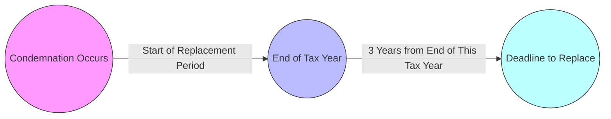
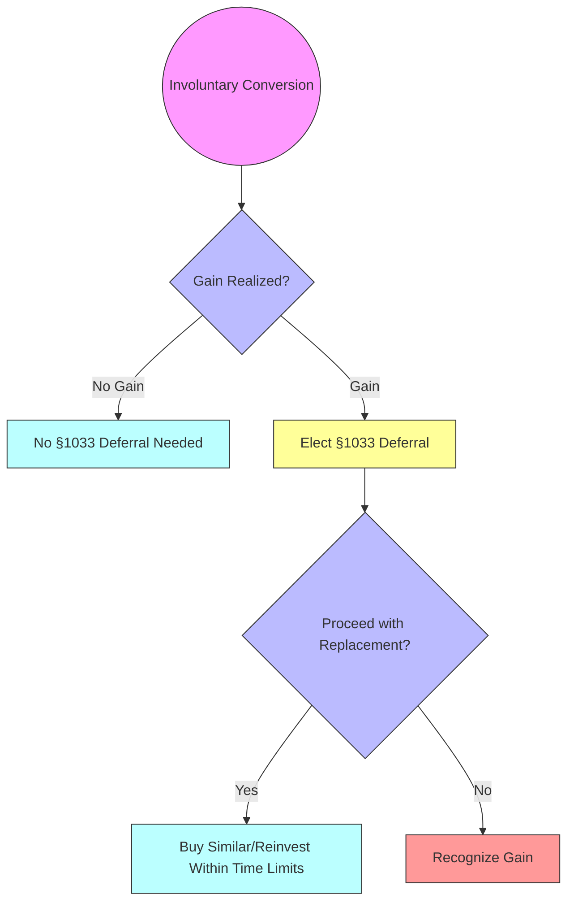

## 17.2 §1033 Involuntary Conversions: Condemnations, Disasters & Replacements

Section 1033 of the Internal Revenue Code (IRC) provides important tax rules governing involuntary conversions. These occur when property is destroyed, stolen, condemned, or otherwise disposed of against a taxpayer’s will—generally through an eminent domain action or catastrophic event (e.g., fire, hurricane, or earthquake). Unlike voluntary sales or exchanges, these situations often force owners to adapt quickly, dealing with sudden changes in property ownership or usage. To mitigate potentially large, immediate tax liabilities, §1033 allows taxpayers to defer recognition of a gain if they reinvest (or replace) the property within certain time periods and under specific guidelines.

This section delves deeply into the mechanics of §1033, with a particular focus on how the IRS defines involuntary conversion, eminent domain procedures, condemnation awards, and the deadlines for qualified replacement property. We will also examine real-world outcomes using examples from notable court cases such as Kelo v. City of New London. Comparisons to other property disposition rules (see Chapter 17: Nontaxable Dispositions §17.1 and Chapter 18: Character of Gains & Losses) help illustrate how §1033 differs from other forms of tax deferral or nonrecognition treatment.

--------------------------------------------------------------------------------

### Overview of Involuntary Conversions Under §1033

Involuntary conversions involve property lost or disposed of in a manner beyond the taxpayer’s control. The most common triggers are:
- Condemnation (or the threat thereof) by a government entity.
- Eminent domain actions, where property is acquired for public use (e.g., highway expansions).
- Casualty or disaster (e.g., hurricanes, floods, fires) that render property destroyed or severely damaged.
- Theft instances (though these tend to be less frequent in §1033 discussions compared to casualty losses or condemnation actions).

From a tax perspective, the primary benefit of §1033 is deferral of gain on the involuntary conversion if the taxpayer invests the award or insurance proceeds in replacement property within the applicable time frame. If the conditions are met, the gain is not immediately recognized, and the basis of the replacement property can be adjusted.

--------------------------------------------------------------------------------

### Foundations of Eminent Domain and Condemnation

Eminent domain refers to a government’s authority to seize private land for public use, subject to the constitutional requirement of “just compensation.” Condemnation is the legal process through which this power is exercised, typically when a municipality, county, or state needs private land for public infrastructure projects such as roads, schools, government buildings, or utilities.

#### Real Case Example: Kelo v. City of New London (2005)

In Kelo v. City of New London, the U.S. Supreme Court held that a local government could use eminent domain to seize private property and transfer it to another private entity for the purpose of economic development. While the case raised significant debate about the scope of “public use,” the principle of just compensation remains. Under current tax law, when owners receive condemnation proceeds (often in the form of a lump-sum payment), the forced nature of the disposition forms the basis of a potential §1033 deferral if like-kind (or functionally similar) replacement property is acquired within the specified period.

--------------------------------------------------------------------------------

### Mechanics of §1033 Gain Deferral

When property is involuntarily converted, the owner might realize a gain if the condemnation award, insurance proceeds, or settlement exceeds the property’s adjusted basis. Section 1033 allows those gains to be deferred, provided certain requirements are met:

1. The conversion must be involuntary.
2. The taxpayer must purchase or construct a replacement property within the prescribed replacement period.
3. The replacement property must be “similar or related in service or use” (or meet special like-kind requirements in the context of condemned real property).
4. The taxpayer must elect deferral under §1033 and maintain proper records to document the reinvestment process.

If the conversion proceeds are not fully reinvested, partial gain recognition may apply.

--------------------------------------------------------------------------------

### Replacement Period Requirements

One critical aspect of §1033 is the replacement period: the window of time the taxpayer has to invest in replacement property to qualify for deferral.

- **General Rule**: Typically, the replacement period begins on the date the involuntary conversion occurs (e.g., property destruction or condemnation) and ends two years from the close of the tax year in which the gain is first realized.
- **Extended Replacement Period**: For certain real property involuntarily converted because of condemnation (or threat thereof), the period extends to three years from the close of the tax year in which the gain is realized.
- **Presidentially Declared Disasters**: If the property is in a federally declared disaster area, the IRS may grant additional extensions on a case-by-case basis.

The key principle is that the taxpayer must make the replacement within the statutory period to defer the gain. Failure to meet the deadline generally results in current-year recognition of any unspent portion of proceeds above the property’s adjusted basis.

#### Diagram: Illustration of a Three-Year Replacement Timeline

Below is a Mermaid diagram showing a simplified timeline for a real estate condemnation situation, illustrating a three-year replacement window.

In this diagram:
- The condemnation event triggers the start of the window.
- The end of the tax year in which condemnation proceeds are realized becomes the critical date from which the taxpayer counts three years forward.
- The taxpayer must identify and acquire (or construct) replacement property before the final deadline.

--------------------------------------------------------------------------------

### Determining “Similar or Related in Service or Use”

For taxpayers to qualify for §1033 deferral, the replacement property must match the functional use of the original property. Regulations and case law interpret “similar or related in service or use” somewhat strictly, focusing on how the taxpayer actually uses the property rather than its classification alone. 

- **Example**: A warehouse used for storing goods might usually be replaced with another warehouse or similar storage structure in a different location. 
- **Different Standard for Real Property**: Under §1033(g), if real property is converted due to condemnation, the “like-kind standard” applies, similar to the broader definition under §1031 (see Chapter 17.1). This means the replacement real estate must be of the same general character, but not necessarily the exact same use.

--------------------------------------------------------------------------------

### Basis Adjustments in Replacement Property

When a taxpayer completes a valid §1033 transaction, the basis in the replacement property is typically the cost of the new property minus any unrecognized gain. If all proceeds are reinvested, the gain is deferred entirely, and the taxpayer “carries over” the old property’s basis into the new property, often with some adjustments. 

- **Full Reinvestment**: If all proceeds are spent on replacement property that meets the requirements, the entire gain is deferred. The basis of the replacement property is the same as that of the original property plus any additional amounts invested out-of-pocket.
- **Partial Reinvestment**: If the taxpayer invests only a portion of the proceeds, the taxpayer recognizes gain equal to the difference between the proceeds and the amount reinvested. The rest of the gain is deferred. The basis adjustment reflects only the portion reinvested.

--------------------------------------------------------------------------------

### Real-World Eminent Domain Cases

While Kelo v. City of New London is one of the most famous eminent domain cases in recent history, countless other takings cases occur each year. Condemnations for widening highways, expanding airports, or creating public cemeteries are common examples:

- **County of Los Angeles v. Ortiz** (Hypothetical Scenario): Suppose the county runs a road extension project requiring partial acquisition of a privately owned commercial strip. The owners receive payment primarily for the portion taken but must adapt their business to a smaller footprint or relocate. If they choose to relocate entirely and purchase a new commercial strip, they can potentially defer the gain using §1033, provided they reinvest in a “similar or related in service or use” commercial property and do so within the deadlines.
- **Partial condemnation** can arise if a government seizes only a piece of your property (e.g., the front 10 feet of land for a sidewalk). §1033 could still apply to the proceeds from that partial taking if it results in a forced disposition of the portion acquired.

--------------------------------------------------------------------------------

### Handling Partial Conversions

Partial conversions complicate the computation of gain and the basis adjustment. Only the portion of the property taken through condemnation is subject to the provisions of §1033. The IRS generally allows taxpayers to allocate basis proportionally to the portion condemned. 

- **Allocation of Basis**: If 20% of the acreage of a parcel is condemned, the allocated basis for that portion is typically 20% of the original total basis, plus any improvements directly linked to that portion.
- **Potential Gains**: The proceeds attributable to the partial condemnation might exceed the allocated basis, triggering a gain. Taxpayers who reinvest in expanding or improving the remaining parcel (or an entirely new parcel) may qualify for §1033 deferral on the portion of the gain reinvested.

#### Example: Partial Condemnation Scenario

Mark owns 100 acres of farmland with an original basis of $100,000 (i.e., $1,000 per acre). The state condemns 10 acres for a new highway and pays Mark $30,000. The allocated basis for those 10 acres is $10,000, leaving Mark with a $20,000 gain ($30,000 proceeds – $10,000 basis = $20,000 gain).

If Mark then uses the full $30,000 to purchase 10 acres of similar farmland elsewhere within the two-year replacement period, he can defer the $20,000 gain under §1033, subject to the usual requirements. His basis in the new 10 acres would be $10,000 (the cost of $30,000 less the unrecognized gain of $20,000).

--------------------------------------------------------------------------------

### Disasters, Insurance Proceeds, and §1033

In addition to condemnation, §1033 also applies to proceeds from insurance related to destruction of property due to casualties or disasters:
- **Timing**: The replacement period ordinarily is two years from the close of the tax year in which the gain is realized for casualty losses. If there is a federally declared disaster, the IRS often extends the deadline by an additional year (or more) depending on legislation or specific administrative relief announcements (see also Chapter 21: Practice & Procedure, which touches on IRS administrative releases).
- **Partial Losses**: If insurance proceeds exceed the cost to restore the property, any net gain can be deferred if it is used to replace (i.e., buy new property) instead of returning the property to its original condition.

--------------------------------------------------------------------------------

### Common Pitfalls and Planning Strategies

Taxpayers must be careful about the election process and maintain records of the specific replacement property. Common issues include:

- **Failure to Elect**: Simply purchasing a new property is not enough. The taxpayer must affirmatively elect to defer the gain under §1033. An example of how to do this can be found on IRS Form 4797 (Sales of Business Property), or by attaching a statement to your return.
- **Missed Deadlines**: Overlooking the replacement window or incorrectly calculating its start date is a frequent problem, resulting in unexpected recognition of the gain.
- **Unclear Documentation**: Under an audit, the IRS may request proof that the new property is similar or related in service or use. Meticulous documentation of the property’s function can strengthen a case.
- **Partial Reinvestment**: If not all proceeds are used, a portion of the gain must be recognized. Planning replacement property purchases carefully to maximize deferral opportunities is crucial.

#### Diagram: Potential Decision Tree for Involuntary Conversions

--------------------------------------------------------------------------------

### Strategic Considerations for CPA Candidates

- **Compare §1033 to §1031**: Although both involve deferred gain, §1031 is typically for voluntary like-kind exchanges, whereas §1033 deals with forced dispositions. Understanding the nuanced difference is essential.
- **Coordination with State and Local Laws**: Condemnation procedures vary among jurisdictions, so be aware of local property laws when dealing with eminent domain compensation.
- **Integration with Business & Entity Planning**: The entity owning the property (e.g., sole proprietorship, partnership, corporation) can affect the approach to deferral. Partnerships and S corporations (see Chapters 11 and 10, respectively) will need to ensure that the distributions or basis adjustments from condemnation proceeds comply with the at-risk and passive loss rules. 
- **Special Rules for Principal Residences**: If a personal residence is involuntarily converted, §1033 may interact with §121 (Exclusion of Gain on Sale of Principal Residence). This interplay can yield unique planning dilemmas and opportunities.

--------------------------------------------------------------------------------

### Illustrative Case Study

Let’s consider a hypothetical scenario that combines partial condemnation and stringent deadlines:

1. **Background**: Sheryl owns a light industrial property on the outskirts of a city. The local government decides to expand the city’s wastewater treatment facility, requiring condemnation of a 25% portion of Sheryl’s land, including outbuildings important for her operations.
2. **Compensation**: Sheryl receives $400,000 in condemnation proceeds, realizing a $100,000 gain after allocating the portion of her original basis to the condemned section. 
3. **Replacement Property**: She needs to acquire or build new facilities to keep her operations running. She researches industrial properties with similar usage characteristics (warehouses, shipping/receiving capabilities) in the region.
4. **Timeline**: Because the property was condemned, Sheryl has three years from the close of the tax year of condemnation to reinvest. If the condemnation was settled and proceeds were realized by June 30 of Year 1, the official start date for the replacement clock is June 30 of Year 1; the replacement period extends until December 31 of Year 1 plus three additional years (i.e., December 31 of Year 4).
5. **Outcome**: If Sheryl invests all $400,000 in a qualifying light industrial property, she can elect to defer the full $100,000 gain. Her basis in the replacement property will be adjusted accordingly. If she only uses $300,000 and pockets $100,000 for other purposes, she will recognize $100,000 of gain immediately.

This scenario underscores the importance of carefully tracking partial condemnations and meeting replacement deadlines.

--------------------------------------------------------------------------------

### Conclusion and Key Takeaways

Section 1033 provides a vital mechanism for taxpayers to mitigate the immediate tax burden resulting from forced dispositions. By carefully navigating the replacement rules and deadlines, property owners can preserve capital and continue business or personal endeavors without suffering punitive taxation. CPA candidates should master the key elements of §1033—knowing how to determine the start of the replacement period, how to allocate basis for partial conversions, and how to document similarity of use or like-kind replacement property. Real-world examples of eminent domain and condemnation highlight the necessity for meticulous timing and planning. 

Keeping up to date with legislative changes, IRS pronouncements, and relevant court decisions ensures that practitioners can advise clients effectively, especially in volatile environments prone to disasters, land acquisitions, or other forced changes in property ownership.

--------------------------------------------------------------------------------

## §1033 Involuntary Conversions Knowledge Check

Below is a quiz that tests and reinforces the key concepts around involuntary conversions and §1033 replacements, including condemnation, eminent domain, replacement property requirements, and partial conversions.

## Involuntary Conversions Exam-Readiness Quiz



### Which of the following scenarios typically qualifies as an involuntary conversion under IRC §1033?

- [x] Property condemned by a government agency for road expansion.
- [ ] Property sold to a friend because of financial difficulties.
- [ ] Property traded voluntarily for other business property.
- [ ] Property donated to a charitable organization.

> **Explanation:** Condemnation by a government agency (eminent domain) is a classic example of an involuntary conversion. Sales, voluntary exchanges, and donations do not fall under the scope of involuntary conversions for §1033 purposes.

### Which of the following is the usual replacement period for real property involuntarily converted due to condemnation?

- [ ] 1 year from the date of condemnation.
- [x] 3 years from the end of the tax year in which gain is realized. 
- [ ] 3 years from the date of condemnation.
- [ ] 6 months from the end of the tax year in which gain is realized.

> **Explanation:** The general rule for real property condemned is that the replacement must be completed within 3 years from the end of the tax year in which gain is realized.

### How is basis typically allocated when only part of a property is condemned?

- [x] Proportionally, based on the percentage of the property taken.
- [ ] Entirely to the condemned portion.
- [ ] Equally split between the condemned portion and the remainder.
- [ ] No basis adjustment is required for partial condemnation.

> **Explanation:** Under partial condemnation, the taxpayer allocates the original basis proportionally to the portion of property taken. This percentage basis allocation is essential for computing any gain or eventual deferred gain under §1033.

### If a taxpayer receives $50,000 in insurance proceeds from a casualty event and reinvests only $30,000 of it in replacement property, how much gain is recognized if the original basis in the destroyed property was $15,000?

- [x] $20,000
- [ ] $15,000
- [ ] $35,000
- [ ] $0

> **Explanation:** The total proceeds exceed basis by $35,000 ($50,000 – $15,000). Since only $30,000 was reinvested, $20,000 is not reinvested and triggers immediate gain recognition under §1033.

### Which of the following statements best describes “similar or related in service or use” for §1033 replacements?

- [x] The new property must maintain the same general business or functional use as the original.
- [ ] The new property must have the exact same physical specifications.
- [x] Real estate condemned under §1033(g) can be replaced under a broader like-kind standard. 
- [ ] Replacement only qualifies if located in the same county or state as the condemned property.

> **Explanation:** “Similar or related in service or use” requires that the replacement property serve the same function. For condemned real property under §1033(g), the requirement can be satisfied using a like-kind standard. Geographical location is not typically mandated.

### True or False: Under §1033, to defer a gain from condemnation, the taxpayer must purchase replacement property within the same tax year the property was condemned.

- [x] False
- [ ] True

> **Explanation:** The taxpayer generally has up to three years from the end of the tax year in which gain is realized to replace the property if it involves condemnation. It is not limited to only the same tax year.

### If a property is involuntarily converted and the taxpayer fully reinvests the proceeds into qualifying replacement property, what happens to the gain?

- [x] The gain is deferred, and basis in the replacement property is adjusted downward by the unrecognized gain.
- [ ] The gain must be recognized in the year of the conversion, no exceptions.
- [ ] The gain can be recognized over a 5-year period.
- [ ] There is no requirement to adjust the basis of the new property.

> **Explanation:** When all proceeds are reinvested, the gain is deferred under §1033, and the basis of the replacement property is generally reduced by the unrecognized gain, carrying over any remaining original basis.

### Which of the following is often a crucial element in proving the property is “similar or related in service or use”?

- [x] Actual operational use of both old and new properties.
- [ ] The shape and color of the buildings.
- [ ] The exact square footage match.
- [ ] Whether they are located in the same zip code.

> **Explanation:** The IRS and courts focus on how the taxpayer actually uses the property. Physical attributes alone, such as shape, color, or precise square footage, are generally secondary to functional use.

### Under §1033, which factor can most easily lead to lost deferral benefits?

- [x] Missing the replacement deadline.
- [ ] Filing an extension for the annual tax return.
- [ ] Using personal funds rather than loan proceeds to buy the replacement.
- [ ] Documenting the purchase via a formal election statement.

> **Explanation:** Missing the replacement deadline is one of the most common pitfalls. Regardless of the purchase method or correct paperwork, if the purchase is outside the statutory timeframe, the taxpayer cannot obtain deferral benefits.

### A taxpayer’s property is involuntarily converted by condemnation. If the taxpayer elects §1033 deferral but does not reinvest the condemnation proceeds by the end of the applicable replacement period, the taxpayer’s deferral:

- [x] Terminates, and the gain is recognized at the end of the period.
- [ ] Can be extended automatically for another two years.
- [ ] Converts into an ordinary loss.
- [ ] Renders the property as tax-exempt.

> **Explanation:** If replacement does not occur within the prescribed period, the gain is recognized at the expiration of the replacement window, negating the deferral election.



--------------------------------------------------------------------------------

## For Additional Practice and Deeper Preparation

**[TCP CPA Hardest Mock Exams: In-Depth & Clear Explanations](https://www.udemy.com/course/tcp-cpa-mock-exams/?referralCode=675149871D0E79B1699C)**  

**Tax Compliance & Planning (TCP) CPA Mocks:** 6 Full (1,500 Qs), Harder Than Real! In-Depth & Clear. Crush With Confidence!

- Tackle full-length mock exams designed to mirror real TCP questions.  
- Refine your exam-day strategies with detailed, step-by-step solutions for every scenario.  
- Explore in-depth rationales that reinforce higher-level concepts, giving you an edge on test day.  
- Boost confidence and minimize anxiety by mastering every corner of the TCP blueprint.  
- Perfect for those seeking exceptionally hard mocks and real-world readiness.  

_Disclaimer: This course is not endorsed by or affiliated with the AICPA, NASBA, or any official CPA Examination authority. All content is for educational and preparatory purposes only._
