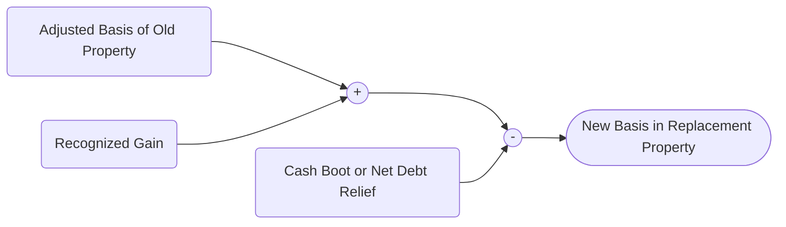

## 17.3 Boot & Basis Adjustments in Partial Exchanges

A like-kind exchange under IRC §1031 generally allows taxpayers to defer recognition of gain (and, in some cases, loss) on the exchange of business or investment property for property of a similar nature or character. However, real-world transactions often include “boot,” typically cash or other non-like-kind property received along with the replacement property. Boot triggers potential gain recognition. In a partial exchange, not only must you determine the recognized gain (often constrained by the amount of boot), but you must also carefully adjust the basis of the replacement property received to track both deferred gain and any recognized gain. 

This section focuses on understanding how boot affects the otherwise tax-free nature of these exchanges, computing the recognized gain in partial exchanges, and adjusting the basis of the property received. Topics addressed include:  
• Definition and types of boot  
• Determining recognized gain when boot is involved  
• Adjusted basis calculations for the relinquished and replacement properties  
• Practical scenarios, including cash boot, mortgage relief, and receipt of other non-like-kind property  
• Common pitfalls in deferrals, advanced planning strategies, and exam-focused pointers  

This discussion builds on concepts introduced in §1031 Like-Kind Exchanges (see “17.1 §1031 Like-Kind Exchanges”) and will be reinforced in subsequent chapters that detail character of gains and losses (see Chapter 18) and other property transaction complexities.

---

### Understanding Boot in Partial Exchanges

When the taxpayer receives any form of consideration in addition to the like-kind property—most commonly cash, but also debt reduction or other non-like-kind assets—that amount is generally referred to as boot. By its nature, boot can disqualify a portion of the transaction from complete gain deferral. From a CPA exam perspective, it is vital to recognize that boot includes (but is not limited to):  
• Cash or cash equivalents.  
• Notes or other forms of monetary instruments.  
• Assumption of any liabilities by the transferee in excess of the taxpayer’s liabilities on the replacement property.  
• Non-like-kind property (e.g., personal property within a real estate exchange if the real estate is the focus of the like-kind transaction).  

In practice, some of the most frequently tested scenarios on the CPA exam involve a taxpayer who sells a property, receives partial payment in cash (boot), and then invests the balance of the proceeds into a qualifying real estate exchange. Alternatively, a taxpayer might trade properties of unequal values where one party “makes up” the difference in value with cash.

---

### Recognized Gain: Limitation by Boot

While IRC §1031 generally allows taxpayers to defer gains on like-kind exchanges, the presence of boot usually triggers immediate taxation up to the lesser of:  
1. The net amount of boot received, or  
2. The realized gain in the transaction.  

“Realized gain” refers to the difference between the amount realized (the fair market value (FMV) of the new property plus any boot) and the adjusted basis of the old property. If the boot is less than the total realized gain, only the portion up to the boot amount becomes recognized gain. If the realized gain is less than the boot, the recognized gain is capped by the lower amount of the realized gain.

---

### Step-by-Step Calculation Framework

When navigating boot and basis adjustments, the following process can help streamline calculations:

1. Calculate Realized Gain (or Loss)  
   Realized Gain (or Loss) = (FMV of Like-Kind Property Received + Boot Received) – Adjusted Basis of Relinquished Property  

2. Determine Recognized Gain  
   Recognized Gain = The lesser of the net boot received or the realized gain.  
   If realized loss occurs, recognition is typically not allowed in a like-kind exchange scenario, barring certain exceptions.

3. Calculate Deferred Gain  
   Deferred Gain = Realized Gain – Recognized Gain  

4. Determine Basis of Replacement Property  
   The basis of replacement property is adjusted to account for deferred gain, gains recognized, and boot.  
   Generally:  
   Adjusted Basis of Replacement Property  
   = Adjusted Basis of Relinquished Property + Recognized Gain + Additional Amount Paid – Boot Received  

   Another popular formula is:  
   Basis of Replacement Property  
   = FMV of Replacement Property Received – Deferred Gain  

   Ultimately, both approaches lead to the same result.

---

### Numerical Example: Cash Boot

Consider the following classic scenario often encountered on the CPA exam:

• Taxpayer owns an office building (Property A), with an adjusted basis of $200,000.  
• FMV of Property A is $300,000.  
• Taxpayer arranges a like-kind exchange for Property B (another building) worth $280,000, plus receives $20,000 in cash.  

Step 1: Calculate Realized Gain  
• Amount Realized = FMV of Property B ($280,000) + Cash Boot ($20,000) = $300,000  
• Adjusted Basis of Relinquished Property A = $200,000  
• Realized Gain = $300,000 – $200,000 = $100,000  

Step 2: Determine Recognized Gain  
• The lesser of boot received ($20,000) or realized gain ($100,000) is $20,000. Thus, Recognized Gain = $20,000.  

Step 3: Compute Deferred Gain  
• Deferred Gain = $100,000 – $20,000 = $80,000  

Step 4: Determine Basis of Replacement Property  
Option A (Incremental Approach):  
• Old basis = $200,000  
• Add Recognized Gain = + $20,000  
• Subtotal = $220,000  
• Subtract Boot Received (because that portion of your original investment was returned to you) = – $20,000  
• New Basis = $200,000  

Alternatively, using the FMV minus deferred gain approach:  
• FMV of Replacement Property Received = $280,000  
• Subtract Deferred Gain = – $80,000  
• New Basis = $200,000  

Either method yields the same results. The $20,000 recognized gain is reportable in the current tax year because the taxpayer received that amount in cash. The remaining $80,000 of unrealized gain is rolled over (deferred) into the tax basis of the new asset.

---

### Numerical Example: Non-Like-Kind Property as Boot

Boot can also take the form of other non-like-kind property. Suppose a taxpayer exchanges real property with an FMV of $400,000 and a basis of $250,000 for new real property worth $350,000 and equipment (non-like-kind property) with an FMV of $50,000.

1. Calculate Realized Gain:  
   • Amount Realized = $350,000 (like-kind property) + $50,000 (equipment, considered boot) = $400,000  
   • Adjusted Basis (Relinquished Property) = $250,000  
   • Realized Gain = $400,000 – $250,000 = $150,000  

2. Recognized Gain:  
   • Boot Received = $50,000 (equipment)  
   • The lesser of boot ($50,000) or realized gain ($150,000) is $50,000.  
   • Recognized Gain = $50,000  

3. Deferred Gain:  
   • Deferred Gain = $150,000 – $50,000 = $100,000  

4. Basis of Replacement Property:  
   • FMV of Replacement Property = $350,000  
   • Subtract Deferred Gain of $100,000  
   • Basis in New Real Estate = $350,000 – $100,000 = $250,000  

5. Basis of the Non-Like-Kind Boot Property (Equipment):  
   • Generally, the basis in boot property is its FMV at the time of exchange: $50,000  

In this instance, the taxpayer recognizes an immediate $50,000 gain in connection with the receipt of the equipment. The $100,000 of remaining gain is carried forward (“deferred”) and will be reflected through a lower basis in the acquired real property.

---

### Mortgage Relief as Boot

In certain exchanges, debt relief can act as boot. If the taxpayer is relieved of a liability or transfers a property subject to a mortgage, and the mortgage on the relinquished property is larger than the mortgage on the received property, the net reduction in liability may be treated as boot. Conversely, if the taxpayer assumes more debt in connection with the new property than the amount of debt on the old property, that may offset boot or even shift the “boot” to the other party.

For instance, imagine a taxpayer who:  
• Exchanges a property subject to a $100,000 mortgage.  
• Receives a property subject to a $70,000 mortgage.  

All else being equal, the taxpayer has effectively been relieved of $30,000 in debt. If there are no offsetting amounts, this $30,000 of net relief typically constitutes boot. The recognized gain is limited to that $30,000 or the overall realized gain, whichever is lower. This adds another dimension to the recognized gain calculation—ensuring that net mortgage relief (or assumption) is properly accounted for in determining the total amount of boot.

---

### Diagrams: Flow of a Partial Exchange

Below is a simple Mermaid diagram showing the flow of a partial exchange:

```mermaid
flowchart LR
    A[(Relinquished Property)] --> B(Exchange Transaction)
    B -->|Like-Kind Property| C[(Replacement Property)]
    B -->|Cash Boot or Non-Like-Kind Property| D[(Taxpayer)]
    D -->|Recognized Gain (limited to Boot)| E[(Current Taxable Event)]
    B -->|Report & Adjust|| F[(IRS Form 8824)]
```

Explanation of the diagram:  
• The taxpayer gives up the relinquished property.  
• In exchange, they receive replacement property plus cash or another form of boot.  
• The boot triggers recognized gain in the current tax year.  
• The final step involves reporting the exchange (and gain) on Form 8824 and adjusting basis for the replacement property accordingly.

---

### Exchange Mechanics and the CPA Exam

In exam scenarios, you may see a variety of twists: partial payments, mortgages that differ by large amounts, or intangible differences between FMVs. The consistent principle is to identify the boot amount and compare it to realized gain. The areas that frequently trip up candidates on the CPA exam include:  
• Confusing realized gain with recognized gain.  
• Forgetting to account for mortgages assumed or relieved in the transaction.  
• Miscalculating the new property’s basis by forgetting to factor in recognized gain.  
• Overlooking the classification of non-like-kind property or intangible assets.  
• Mixing up at-risk limitations or passive activity rules (discussed in Chapter 5) with exchange deferral mechanics.  

Always verify each “leg” of the transaction when performing your computations. Keep track of each property’s basis and involved liabilities. From a planning perspective, any exchange that yields a net debt relief or partial return of capital in cash can create immediate gain, diminishing the advantage of full deferral.

---

### Special Considerations and Pitfalls

• Loss Recognition: Even if boot is received, a loss is typically not recognized on a §1031 transaction. Losses remain deferred.  
• Boot Paid vs. Boot Received: If you pay boot (e.g., you add cash to the transaction on top of your relinquished property to acquire a more expensive replacement property), you have no immediate income recognition. Instead, your basis in the replacement property typically increases by the cash outlay.  
• Multiple Properties Exchanged: In complex real estate arrangements involving multiple properties, separate the like-kind property from the non-like-kind assets to determine if there’s net boot.  
• Unadjusted Basis or Adjusted Basis Confusion: Always confirm you are using the correct adjusted basis for the relinquished property, factoring in depreciation, improvements, or other adjustments.  

---

### Advanced Example: Mortgage Relief, Cash Boot, and Calculation

Consider a more complex scenario:

• Property A has an adjusted basis of $400,000 and is subject to a $200,000 mortgage. FMV is $700,000.  
• Taxpayer receives Property B with an FMV of $650,000, subject to a $150,000 mortgage. In addition, the taxpayer receives $25,000 in cash.  

Steps to analyze:

1. Determine the Net Boot  
   • Step 1: Net Mortgage Relief = Old Mortgage ($200,000) – New Mortgage ($150,000) = $50,000  
   • Step 2: Total Boot = Cash Received ($25,000) + Net Mortgage Relief ($50,000) = $75,000  

2. Calculate Realized Gain  
   • Amount Realized = FMV of Property B ($650,000) + Cash Boot ($25,000) + Mortgage Relief ($50,000)  
   • Amount Realized = $650,000 + $25,000 + $50,000 = $725,000  
   • Adjusted Basis of Property A = $400,000  
   • Realized Gain = $725,000 – $400,000 = $325,000  

3. Recognized Gain  
   • The lesser of boot received ($75,000) or realized gain ($325,000) is $75,000.  

4. Deferred Gain  
   • Deferred Gain = $325,000 – $75,000 = $250,000  

5. Basis in Replacement Property B  
   Using the incremental basis approach:  
   • Old Basis = $400,000  
   • Add Recognized Gain = + $75,000  
   • Subtotal = $475,000  
   • Subtract Boot Received (Cash of $25,000 + Net Mortgage Relief of $50,000) = – $75,000  
   • Basis of Replacement Property B = $400,000  

   Alternatively, FMV minus deferred gain:  
   • FMV of Property B = $650,000  
   • Deferred Gain = $250,000  
   • $650,000 – $250,000 = $400,000  

The recognized gain of $75,000 is subject to taxation in the current year (the exact character of which—capital vs. ordinary—depends on asset classification and depreciation recapture rules, covered in Chapter 18).

---

### Strategic Planning and Best Practices

• Taxpayers often structure exchanges carefully to minimize or eliminate boot, thereby deferring more gain. For instance, “equalizing” mortgage balances or adjusting the cash portion helps reduce recognized gain.  
• If boot is unavoidable, consider strategies to offset recognized gain with capital losses or other tax attributes.  
• Keep thorough documentation of mortgage assumptions, property FMVs, and basis calculations to withstand IRS scrutiny.  
• In multi-party (or “Starker”) exchanges, timing issues can affect the classification of partial payments. Consult the 45-day identification and 180-day closing rules (IRC §1031 regulations) to ensure compliance.  
• Explore advanced trust structures or tenant-in-common (TIC) arrangements for property replacement, while ensuring compliance with the IRS’s guidelines to avoid inadvertently creating a partnership interest.  

---

### Real-World Case Study: Commercial Real Estate Swap

XYZ Corporation owns a commercial warehouse with an adjusted basis of $1,200,000 and a fair market value of $1,800,000. The company needs a more modern facility. Another party, ABC Co., is willing to trade its recently built warehouse (FMV $1,600,000) and pay cash of $200,000 to XYZ in a mutually beneficial exchange.

1. Realized Gain  
   • Amount Realized = $1,600,000 (like-kind warehouse) + $200,000 (cash) = $1,800,000  
   • Adjusted Basis of Old Warehouse = $1,200,000  
   • Realized Gain = $1,800,000 – $1,200,000 = $600,000  

2. Recognized Gain  
   • Boot (cash) = $200,000  
   • Recognized Gain = lesser of boot ($200,000) or realized gain ($600,000) = $200,000  

3. Deferred Gain  
   • $600,000 – $200,000 = $400,000  

4. Basis in New Warehouse  
   • Old Basis = $1,200,000  
   • Add Recognized Gain = + $200,000  
   • Subtotal = $1,400,000  
   • Subtract Cash Boot Received = – $200,000  
   • Basis in New Warehouse = $1,200,000  

Alternatively: FMV of $1,600,000 minus deferred gain of $400,000 = $1,200,000. Either method arrives at the same basis conclusion.

The $200,000 recognized gain is generally subject to capital gains treatment (though potential depreciation recapture or unrecaptured §1250 gain might come into play). Such a transaction often appears on the CPA exam as an illustration of partial exchange mechanics where the simplicity of one adjusted basis figure plus a single lump-sum boot is tested.

---

### Diagram: Adjusted Basis Calculation in a Partial Exchange



Explanation of the diagram:  
• Start with the adjusted basis of the relinquished property (M).  
• Add the amount of recognized gain (R).  
• Subtract the total cash boot or net debt relief received (B1).  
• Arrive at the final adjusted basis (B) of the newly acquired property.  

---

### References and Further Reading

• IRC §1031  
• Treasury Regulations §1.1031(a)-1 through §1.1031(k)-1  
• IRS Form 8824 “Like-Kind Exchanges” and its instructions  
• IRS Publication 544 “Sales and Other Dispositions of Assets”  
• IRS Publication 551 “Basis of Assets”  

Many states also have parallel or conforming laws for state income tax purposes, though variations exist. Always check your state-specific regulations for alignment with federal rules on partial exchanges.

---

### Exam Tips and Common Errors

• Always confirm which party is assuming debt or receiving cash in the exchange.  
• Watch out for “net boot.” You might pay some cash and also receive some liability relief. The exam often tests your ability to net these amounts properly.  
• Remember that recognized gain can never exceed total realized gain.  
• If the transaction includes intangible property or certain personal items, you might need separate computations for each property class.  

---

### Concluding Thoughts

Partial exchanges involving boot are fundamentally about balancing gain deferral with the receipt of other valuables. The presence of cash boot or other non-like-kind property typically triggers immediate gain recognition in the amount of boot, but only up to the total realized gain. Meanwhile, the deferred portion of the gain is preserved in the adjusted basis of the new property, ensuring that the eventual disposition of that property will capture any remaining untaxed gains.

For CPA exam success, master the mechanical steps of the computation—identify realized gain, recognized gain, deferred gain, and final basis. Practice detailed numeric examples (including liability assumptions) to develop speed and accuracy. This approach ensures you understand not only the technical intricacies but also the strategic implications, enabling you to field questions on partial exchanges with both tactical and advisory insight.

---

## Test Your Knowledge: Boot & Basis Adjustments in Partial Exchanges



### In a partial like-kind exchange, which factor determines the maximum amount of recognized gain?

- [x] The lesser of the realized gain or the boot received.
- [ ] The total fair market value of both properties involved.
- [ ] The entire realized gain on the exchanged property.
- [ ] The taxpayer’s initial cost basis in the relinquished property.

> **Explanation:** Under a partial exchange, recognized gain is limited to the lesser of the realized gain or the total amount of boot received (cash or other non-like-kind property).

### Which of the following is generally considered boot in an IRC §1031 exchange?

- [x] Receiving cash.
- [ ] An increase in the taxpayer’s mortgage liability.
- [ ] Depreciation recapture from the relinquished asset.
- [ ] Capital improvements made to the property after the exchange is complete.

> **Explanation:** Cash or other non-like-kind property received is boot; an increase in mortgage liability taken on by the taxpayer may actually offset or reduce potential boot. Depreciation recapture is a separate consideration for characterizing recognized gain, and capital improvements after the exchange do not affect the exchange’s boot calculation.

### In a transaction where the taxpayer is relieved of $40,000 in debt and also pays $10,000 in newly assumed debt on a replacement property, what is the net boot from liabilities?

- [x] $30,000.
- [ ] $10,000.
- [ ] $50,000.
- [ ] $0.

> **Explanation:** Net boot is computed by offsetting debt relief against any new debt assumed. Here, the taxpayer is relieved of $40,000 but assumes $10,000, leaving net boot of $30,000.

### Which of the following best describes the basis of a replacement property in a partial exchange?

- [x] The fair market value of the property minus the amount of deferred gain.
- [ ] The lesser of the taxpayer’s adjusted basis in the old property or the new property’s FMV.
- [ ] The replacement property’s fair market value plus recognized gain.
- [ ] The replacement property’s fair market value minus any recognized gain.

> **Explanation:** The basis is typically the fair market value of the replacement property minus the deferred gain. This ensures that any unrecognized gain continues to be embedded in the new property’s basis.

### If the taxpayer’s realized gain is $60,000, and the total boot received is $40,000 consisting solely of cash, how much gain is recognized?

- [x] $40,000.
- [ ] $20,000.
- [x] $60,000.
- [ ] $100,000.

> **Explanation:** Recognized gain is capped at the lesser of realized gain ($60,000) or boot ($40,000). Hence recognized gain is $40,000.

### In computing the basis of replacement property using the incremental basis approach, which is the correct formula?

- [x] Adjusted Basis of Relinquished Property + Recognized Gain – Boot Received.
- [ ] Adjusted Basis of Relinquished Property + Boot Received – Recognized Gain.
- [ ] FMV of Replacement Property + Deferred Gain – Recognized Gain.
- [ ] Deferred Gain – Realized Gain + Boot Received.

> **Explanation:** You generally start with the old property’s basis, add any recognized gain, and subtract the boot received. This formula ensures that the new basis reflects the deferred gain.

### A taxpayer has a realized gain of $150,000 on the exchange of property and receives $80,000 in boot. What is the deferred gain?

- [x] $70,000.
- [ ] $80,000.
- [x] $150,000.
- [ ] $0.

> **Explanation:** Recognized gain is the lesser of $80,000 (boot) or $150,000 (realized gain), so $80,000 is recognized, and $70,000 is deferred.

### Which reference is most relevant for step-by-step computations and official record-keeping of a like-kind exchange?

- [x] IRS Form 8824 (Like-Kind Exchanges).
- [ ] IRS Form 709 (Gift Tax Return).
- [ ] IRS Form 706 (Estate Tax Return).
- [ ] IRS Form 4797 (Sales of Business Property).

> **Explanation:** IRS Form 8824 is specifically designed to report like-kind exchanges, including calculating boot, recognized gain, and basis adjustments.

### In a §1031 exchange, which of the following statements is true?

- [x] Losses are typically deferred and cannot be recognized immediately, even if boot is received.
- [ ] Receiving boot always allows full recognition of the total realized gain.
- [ ] Boot offsets any deferred gain and eliminates future gain recognition.
- [ ] Mortgage relief is never treated as boot.

> **Explanation:** Like-kind exchanges generally do not allow you to recognize a loss if you also receive boot; losses remain deferred. Mortgage relief can be treated as boot. Boot triggers immediate gain, but only to the extent of the lesser of boot or the realized gain.

### A taxpayer transfers a fully depreciated piece of property in a §1031 exchange and recognizes a portion of the gain due to boot received. Is some or all of this gain subject to depreciation recapture?

- [x] True
- [ ] False

> **Explanation:** If the relinquished property would have had depreciation recapture (e.g., personal property §1245 recapture or real property §1250 unrecaptured gain) had it been sold outright, then to the extent of recognized gain, it may be subject to the recapture rules. Details on depreciation recapture appear in Chapter 18.



---

## For Additional Practice and Deeper Preparation

**[TCP CPA Hardest Mock Exams: In-Depth & Clear Explanations](https://www.udemy.com/course/tcp-cpa-mock-exams/?referralCode=675149871D0E79B1699C)**  

**Tax Compliance & Planning (TCP) CPA Mocks:** 6 Full (1,500 Qs), Harder Than Real! In-Depth & Clear. Crush With Confidence!  

- Tackle full-length mock exams designed to mirror real TCP questions.  
- Refine your exam-day strategies with detailed, step-by-step solutions for every scenario.  
- Explore in-depth rationales that reinforce higher-level concepts, giving you an edge on test day.  
- Boost confidence and minimize anxiety by mastering every corner of the TCP blueprint.  
- Perfect for those seeking exceptionally hard mocks and real-world readiness.  

_Disclaimer: This course is not endorsed by or affiliated with the AICPA, NASBA, or any official CPA Examination authority. All content is for educational and preparatory purposes only._
