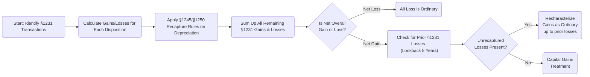
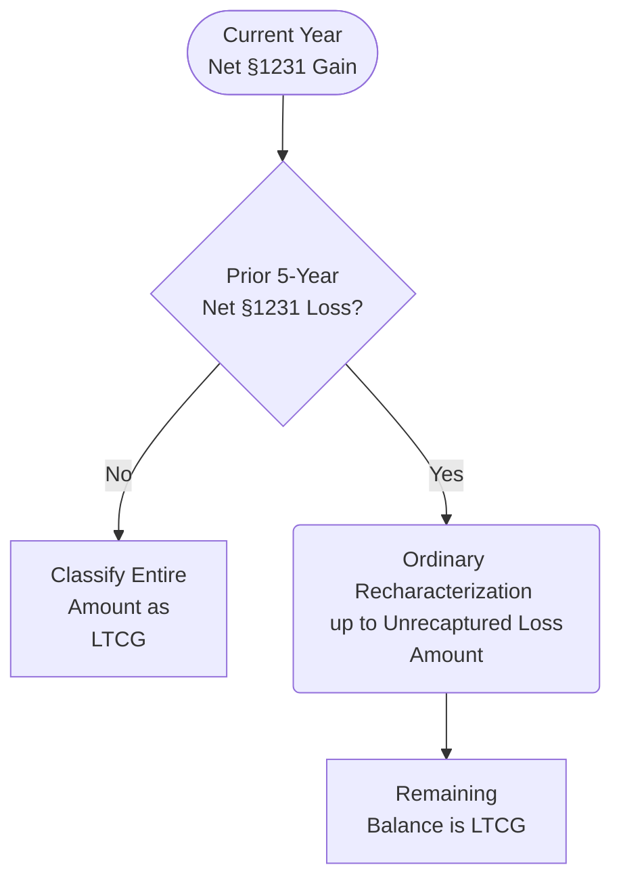

## 18.1 §1231, Capital vs. Ordinary & Netting High-Level Overview

Section 1231 represents a pivotal concept in determining whether a particular disposition of business-use property (depreciable property or real property held for more than one year) results in capital gain or ordinary loss treatment. The classification hinges on several factors: the holding period, the type of property, any recapture rules (e.g., §1245, §1250), and—importantly—the netting process of all §1231 gains and losses.

For many taxpayers and CPA candidates, the most critical aspect to master is the distinction between capital and ordinary outcomes, and how current net §1231 gains may be recast as ordinary if net §1231 losses were recognized in the last five years (the “five-year lookback rule”). This section provides an in-depth look at how these rules apply, the netting process, practical examples, and best practices to ensure accurate computation and compliance.

-------------------------------------------------------------------------------
  
## Overview of §1231 Property and Conceptual Framework

Section 1231 typically encompasses:

• Depreciable assets or real property used in a trade or business.  
• Property held for over one year (i.e., long-term property).  
• Gains and losses that are subject to specialized netting rules.

Fundamentally, the benefit of §1231 is that net gains may be treated as capital gains—thereby often taxed at preferential rates—while net losses may be treated as ordinary. This dual treatment can significantly impact tax planning and compliance. However, favorable capital gain treatment can be partially or wholly lost if the taxpayer has “unrecaptured” §1231 losses from the prior five years.

### Key Points to Remember

• If the sum of all §1231 gains and losses in a tax year is negative, the net loss is fully deductible as an ordinary loss.  
• If net §1231 activity in a tax year produces a gain overall, that net gain is capital—unless prior net §1231 losses over the last five years remain unrecaptured.  
• The five-year lookback rule recaptures current-year net §1231 gains as ordinary, up to the amount of unrecaptured §1231 losses.  

-------------------------------------------------------------------------------

## Capital vs. Ordinary Treatment

Before delving into the netting rules, it is essential to distinguish between capital and ordinary characterization:

• Capital gains are often taxed at lower, preferential rates (e.g., for individuals, the 0%, 15%, or 20% brackets, depending on taxable income).  
• Ordinary income is taxed at regular marginal tax rates, which can be higher for individuals.  
• For corporations, ordinary and capital gains face different treatment regarding offsetting and carryforward rules.  

Specifically for §1231 purposes, ordinary losses can provide an immediate tax benefit by offsetting other types of ordinary income (e.g., wages, interest, business income), often generating greater immediate benefit than capital losses, which are more limited in their use (e.g., individuals can generally only offset $3,000 of net capital losses against other income per year).

-------------------------------------------------------------------------------

## The Netting Process

A hallmark of §1231 is that you pool all gains and losses from §1231 dispositions and then apply specific netting steps. The typical sequence is:

1. Identify all §1231 transactions. These generally include dispositions of:  
   • Depreciable assets used in a trade or business.  
   • Real estate used in a trade or business.  
   • Timber, certain livestock, and other specialized assets under some circumstances.  

2. Determine which of these dispositions are subject to other recapture provisions (e.g., §1245 for personal property or §1250 for real property) to calculate the portion potentially recaptured as ordinary income. Only the excess is included in the §1231 net.  

3. Aggregate the net recognized gains and losses across all §1231 dispositions.  

   • If the result is a net loss, the entire loss is treated as ordinary.  
   • If the result is a net gain, the net gain could be taxed as a long-term capital gain or partially as ordinary income under the five-year lookback rule.

### Five-Year Lookback Rule and Recharacterization

One of the most frequently tested nuances of §1231 is the five-year lookback rule. This rule states that if a taxpayer has realized net §1231 losses in any of the five prior tax years, any current net §1231 gains are recharacterized as ordinary income to the extent of those unrecaptured losses. The logic behind this provision is to prevent taxpayers from claiming large ordinary losses in one year (which offset income at potentially high rates) and then immediately reaping the benefits of capital gain rates when the property is sold at a gain in a subsequent year.

#### How It Works

1. Compute the net §1231 gain or loss for the current year.  
2. If it’s a net loss, no further recharacterization is involved; the net loss is simply ordinary.  
3. If it’s a net gain, look back at the net §1231 results of the previous five years.  
4. To the extent those prior years included net §1231 losses, partially or fully recharacterize the current net §1231 gain as ordinary income, dollar-for-dollar, until all prior net losses have been “used up.”  
5. Any balance of the current year net §1231 gain beyond that recharacterization remains a capital gain.

-------------------------------------------------------------------------------

## Illustrative Diagrams

Below are two diagrams using Mermaid.js to help visualize the flow of the netting process and recharacterization due to the five-year lookback rule.

In the above diagram, once you determine a net §1231 gain, you then check prior five-year net §1231 losses. If any exist, recharacterize current gains as ordinary.

### Net §1231 Gains & Five-Year Lookback

The above netting flow simply shows that if the taxpayer has prior unrecaptured §1231 losses, those losses effectively turn a portion (or all) of the current §1231 gain into ordinary income.

-------------------------------------------------------------------------------

## Practical Examples

### Example 1: Straightforward Net Loss

• Facts: A taxpayer sells a business machine used in their trade for $50,000. Its adjusted basis is $70,000, resulting in a $20,000 loss. No other §1231 assets are sold this year.  
• Analysis: Because there is only one §1231 asset sold, the net is a $20,000 §1231 loss. This automatically becomes an ordinary loss.  
• Conclusion: The $20,000 loss offsets ordinary income, such as wages or business earnings.

### Example 2: Net Gain with No Prior §1231 Losses

• Facts: A taxpayer sells equipment (with minimal depreciation recapture) at a gain of $30,000. They have not had any net §1231 losses in the past five years.  
• Analysis: The net §1231 gain of $30,000 qualifies for capital gain treatment because there are no unrecaptured §1231 losses.  
• Conclusion: The $30,000 is recognized as a long-term capital gain, potentially subject to lower tax rates.

### Example 3: Imposing the Five-Year Lookback Rule

• Facts:
  1. In 2023, a taxpayer sells multiple assets for a net §1231 gain of $40,000.  
  2. In 2020, 2021, and 2022 combined, the taxpayer had a net §1231 loss of $25,000. The entire $25,000 was deducted as an ordinary loss in those years.  
• Analysis:
  1. The current net §1231 gain is $40,000.  
  2. The taxpayer must look back up to five years – including 2020, 2021, and 2022 – and sees $25,000 in net §1231 losses.  
  3. As a result, the taxpayer must recharacterize $25,000 of the $40,000 gain as ordinary.  
• Conclusion:
  1. $25,000 of the $40,000 net §1231 gain is treated as ordinary income.  
  2. The remaining $15,000 receives long-term capital gain treatment.  

-------------------------------------------------------------------------------

## Special Considerations and Common Pitfalls

1. ♦ Overlooking Depreciation Recapture: Always ensure §1245 or §1250 recapture has been accounted for before netting 1231 gains and losses.  
2. ♦ Forgetting the Five-Year Period: Many new practitioners or exam candidates fail to check prior years’ returns for unrecaptured losses. The recapture extends to exactly five years—not necessarily calendar but the prior five taxable years.  
3. ♦ Mixing Up Capital and Ordinary: Some taxpayers assume net gains on long-held business property are automatically capital, forgetting the lookback rule.  
4. ♦ Complexity in Consolidated Returns: The interplay of §1231 gains/losses in consolidated groups (see Chapter 9 on Consolidated Returns) can be more involved due to intercompany transactions and deferred gains.

-------------------------------------------------------------------------------

## Best Practices and Strategies

• Maintain Detailed Schedules: Keep a detailed list of prior five-year §1231 results to quickly track unrecaptured losses.  
• Plan Transactions Around Gains/Losses: If you anticipate a large §1231 gain, consider whether you can offset unrecaptured losses, or alternatively delay dispositions until the five-year window has passed.  
• Double Check Recapture Amounts: Ensure that all relevant provisions—§1245, §1250, and unrecaptured §1250 gain—are correctly accounted for.  
• Use Projections: Forecasting multiple dispositions in one year versus spreading them out can impact tax liability if you can “use up” unrecaptured losses in one year to free up capital gain treatment in the next.  

-------------------------------------------------------------------------------

## References and Further Reading

• Internal Revenue Code §1231  
• IRS Publication 544 (Sales and Other Dispositions of Assets)  
• IRS Publication 225 (Farmer’s Tax Guide) for specialized rules on livestock and timber  
• Chapter 19 of this text for related-party issues and potential complexities  
• Research additional consolidated return issues in Chapter 9  

-------------------------------------------------------------------------------

## Quiz on §1231 Gains, Characterization, and Lookback



### Which of the following best describes the benefit of §1231 rules?  
- [x] Gains can qualify for capital treatment, while losses are classified as ordinary.  
- [ ] All gains are ordinary, and all losses are capital.  
- [ ] Gains are taxed at a premium rate, while losses must be carried over.  
- [ ] There is no difference between §1231 property and capital property.  

> **Explanation:** §1231 provides the "best of both worlds" approach, giving capital gain treatment for net gains and ordinary loss treatment for net losses, making it a critical concept for CPA candidates.

### The five-year lookback rule applies to which of the following?  
- [x] Unrecaptured net §1231 losses in prior five tax years.  
- [ ] Any capital losses from personal activity.  
- [ ] Losses on the sale of personal-use property only.  
- [ ] The last five dispositions of any kind.  

> **Explanation:** The five-year lookback rule specifically addresses unrecaptured net §1231 losses, requiring current net §1231 gains to be treated as ordinary to the extent of these prior losses.

### If a taxpayer’s business sells one piece of equipment at a $10,000 gain and another piece at a $4,000 loss (both are §1231 property), and no depreciation recapture is triggered, how should the net gain/loss be treated?  
- [x] Net gain of $6,000 is potentially a capital gain.  
- [ ] Net loss of $4,000 is treated as an ordinary loss.  
- [ ] Only the $10,000 is recognized; the loss is disregarded.  
- [ ] Net gain of $6,000 is automatically an ordinary gain.  

> **Explanation:** After netting the $10,000 gain and $4,000 loss, there is a $6,000 net §1231 gain, which is generally treated as a capital gain (provided there are no unrecaptured §1231 losses from the prior five years).

### In the presence of unrecaptured §1231 losses over the past four years totaling $15,000, a taxpayer has a net §1231 gain of $20,000 in the current year. How much of the gain is recharacterized as ordinary?  
- [x] $15,000  
- [ ] $20,000  
- [ ] $5,000  
- [ ] $0  

> **Explanation:** The five-year lookback rule requires recharacterization of up to $15,000 of the current and future net §1231 gains as ordinary to the extent of the prior unrecaptured losses.

### When a taxpayer experiences a net §1231 loss for the current year, what is its general classification?  
- [x] It is treated as an ordinary loss.  
- [ ] It is treated as a capital loss.  
- [x] It must be carried forward only.  
- [ ] It must be partially ordinary and partially capital.  

> **Explanation:** A net §1231 loss is always classified as an ordinary loss, which provides more flexible offsetting than capital losses.

### Suppose in 2021 the taxpayer incurred a $10,000 net §1231 loss, and in 2022 they recognized a $12,000 net §1231 gain. Without further adjustments, how is the 2022 gain characterized?  
- [x] $10,000 is ordinary; $2,000 is capital.  
- [ ] $12,000 is entirely capital gain.  
- [ ] $12,000 is entirely ordinary income.  
- [ ] All of the gain is deferred.  

> **Explanation:** The net §1231 gain in 2022 is recharacterized as ordinary up to the $10,000 loss from 2021. The remaining $2,000 is capital gain.

### In which situation does the five-year lookback trigger recapture of §1231 gains?  
- [x] Whenever there are unrecaptured net §1231 losses from any of the previous five years.  
- [ ] Only when there are net losses from personal property.  
- [x] Only when the taxpayer is under audit.  
- [ ] It never triggers recapture; that’s a myth.  

> **Explanation:** The lookback rule is mandatory if there are net §1231 losses in previous five tax years. This ensures the taxpayer cannot secure double benefits: large ordinary losses and later capital gains on similar property transactions.

### A local manufacturing company sells factory equipment for a net §1231 gain of $50,000 in 2025. They have unrecaptured net §1231 losses of $20,000 from 2023. How is the gain reported?  
- [x] $20,000 is ordinary, and $30,000 is capital.  
- [ ] $50,000 is entirely capital.  
- [ ] $50,000 is entirely ordinary.  
- [ ] $20,000 is capital, and $30,000 is ordinary.  

> **Explanation:** The five-year lookback rule requires the first $20,000 of the current gain to be classified as ordinary to the extent of unrecaptured losses from two years prior.

### If a taxpayer’s net §1231 computation results in a $5,000 net loss, all else being equal, which statement is correct?  
- [x] The $5,000 is a fully deductible ordinary loss.  
- [ ] The $5,000 must be offset against net capital gains.  
- [ ] The $5,000 must be carried forward as a net operating loss (NOL).  
- [ ] The $5,000 is subject to capital loss limitations.  

> **Explanation:** A net §1231 loss is fully characterized as an ordinary loss, making it more advantageous for immediate tax reduction than a capital loss.

### Under the five-year lookback rule, net §1231 gains in the current year are recast as ordinary income to the extent of net §1231 losses that were treated as ordinary within the past five years.  
- [x] True  
- [ ] False  

> **Explanation:** This statement best summarizes the core principle of the five-year lookback rule.



-------------------------------------------------------------------------------

## For Additional Practice and Deeper Preparation

**[TCP CPA Hardest Mock Exams: In-Depth & Clear Explanations](https://www.udemy.com/course/tcp-cpa-mock-exams/?referralCode=675149871D0E79B1699C)**  

**Tax Compliance & Planning (TCP) CPA Mocks:** 6 Full (1,500 Qs), Harder Than Real! In-Depth & Clear. Crush With Confidence!

- Tackle full-length mock exams designed to mirror real TCP questions.  
- Refine your exam-day strategies with detailed, step-by-step solutions for every scenario.  
- Explore in-depth rationales that reinforce higher-level concepts, giving you an edge on test day.  
- Boost confidence and minimize anxiety by mastering every corner of the TCP blueprint.  
- Perfect for those seeking exceptionally hard mocks and real-world readiness.  

_Disclaimer: This course is not endorsed by or affiliated with the AICPA, NASBA, or any official CPA Examination authority. All content is for educational and preparatory purposes only._
