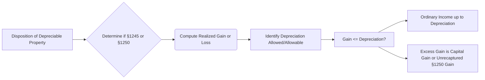

## 18.2 Depreciation Recapture under §1245 & §1250

Depreciation recapture stands at the intersection of ordinary income, capital gains, and the special rates applicable to real estate transactions. As you progress toward CPA exam readiness, it is crucial to grasp both the theoretical underpinnings and the practical applications of recapture rules. Section 1245 typically addresses most personal property and certain intangible property, while Section 1250 governs real property. This chapter illuminates these distinctions, detailing how each section recaptures previously taken depreciation and converts some or all of the realized gain into ordinary income or special capital gain categories.

Understanding recapture becomes especially important for tax professionals working with business clients that buy and sell equipment, real estate, or other depreciable assets. Partial dispositions and improvements can further complicate the calculation. By mastering these principles, you will be better prepared for exam questions and for real-world consulting where depreciation recapture issues often arise.

---

### Overview of Depreciation Recapture

Depreciation (or amortization) allows recovery of a portion of an asset’s cost over its useful life, thus reducing taxable income during the holding period. Upon disposing of the asset, however, the previously claimed depreciation may be subject to “recapture” at a higher, ordinary income tax rate for personal property or at special rates for certain real property. In essence, the government requires that if an asset’s book value (adjusted basis) was reduced via depreciation deductions, and the asset is then sold at a gain, part or all of that gain is characterized as ordinary income—reflecting that originally deducted depreciation.

To clarify:

- Section 1245 property typically includes tangible personal property (machinery, equipment, furniture) and certain intangible property (like patents or leasehold improvements) subject to depreciation.  
- Section 1250 property generally covers depreciable real property, such as commercial buildings, warehouses, and rental residential buildings.

When these assets are sold or otherwise disposed of at a gain, the computed gain is split into:
1. Recaptured depreciation taxed at ordinary rates (fully or partially, depending on the classification).  
2. Remaining gain (if any) taxed at capital gains rates or other applicable rates (e.g., unrecaptured §1250 gain capped at 25% for individuals).

---

### Section 1245 Property and Recapture

Section 1245 primarily focuses on personal property or certain intangible assets for which depreciation or amortization deductions have been claimed. The recapture rule is straightforward:

1. If a taxpayer sells a §1245 asset at a gain, any portion of that gain up to the aggregate depreciation or amortization taken is recaptured as ordinary income.  
2. Any remaining gain above the cumulative depreciation taken is treated as §1231 gain (potential capital gain treatment if holding-period and other requirements are met, provided the net result of all §1231 transactions is a net gain).

The rationale is that because the taxpayer reduced ordinary income during the depreciation period, the IRS wants to ensure that this portion is now “recaptured.”  

#### Example: Equipment Sale with Full Depreciation

1. A taxpayer purchases manufacturing equipment (treated as 5-year property under MACRS) for $100,000.  
2. Over a few years, the taxpayer claims $70,000 of total depreciation.  
3. The adjusted basis is thus $30,000 ($100,000 original cost – $70,000 depreciation).  
4. The taxpayer sells the equipment for $90,000.

Compute the gain:
• Amount realized: $90,000  
• Adjusted basis: $30,000  
• Gain: $60,000  

Because $70,000 was previously taken as depreciation (which exceeds the $60,000 gain), the entire $60,000 of gain is recaptured as ordinary income under §1245. Hence, the taxpayer’s capital gain portion is $0 because the total gain is less than total depreciation claimed.

---

### Scenarios Involving Partial Depreciation & Partial Dispositions for §1245

Real-world transactions are rarely as clear-cut as complete dispositions at once. A company might replace a critical piece of a larger manufacturing system or dispose of part of an asset’s components. Partial dispositions occur when only a portion of the asset is retired or disposed of, requiring a proportional recapture of depreciation.

Suppose a taxpayer allocates the cost of a single piece of equipment among various component parts. One of these components is replaced and disposed of before the entire asset is fully depreciated. To properly account for the disposal:

1. Identify the allocated cost basis and accumulated depreciation for the disposed component.  
2. Substantiate how much of the original purchase price and subsequent depreciation relates to the disposed portion.  
3. Recapture gain up to the lesser of (a) allocated depreciation or (b) the realized gain on disposal for that component.

While partial dispositions are more frequently discussed in the context of real property (especially building components such as roofs or HVAC systems), analogous principles can apply to complex machinery.

---

### Section 1250 Property and Recapture

Unlike §1245, which generally recaptures depreciation as ordinary income, §1250 property (real property) has historically been eligible for more favorable methods of depreciation, such as (in older systems) accelerated depreciation that exceeded straight-line. Under §1250, only the portion of depreciation in excess of what would have been allowed using the straight-line method is subject to ordinary-income recapture. For property placed in service after 1986 under the Modified Accelerated Cost Recovery System (MACRS), most commercial real estate is depreciated on a straight-line basis—meaning minimal or no “excess” depreciation beyond straight-line. Consequently, the “pure” §1250 recapture at ordinary rates for post-1986 property often no longer arises.

Nevertheless, there is still a special category called unrecaptured §1250 gain, which for individuals is taxed at a maximum rate of 25% (corporations have different rules under §291). Therefore, even without accelerated depreciation, there is a segment of gain attributable to depreciation that is subject to higher-than-typical-capital-gains tax rates.

#### Example: Real Property with Straight-Line Depreciation

1. A taxpayer purchases a warehouse in 2015 for $500,000 (excluding land value) and places it into service for rental use.  
2. Under current MACRS rules, nonresidential real property is usually depreciated over 39 years, straight line. Assume the taxpayer has claimed $100,000 of cumulative depreciation by 2025.  
3. The warehouse is sold for $650,000, with $150,000 allocated to the building portion.

• Original building basis: $500,000  
• Depreciation claimed: $100,000  
• Adjusted basis: $400,000 ($500,000 – $100,000)  
• Amount realized (allocated to building): $650,000  
• Gain: $250,000 ($650,000 – $400,000)

Under §1250 rules, there is no actual “excess” depreciation (since only straight-line has been used). However, the entire $100,000 of depreciation is categorized as unrecaptured §1250 gain, taxable at up to 25% if the disposition is recognized as a capital gain for an individual taxpayer. The remaining $150,000 ($250,000 total gain – $100,000 unrecaptured §1250 portion) is generally taxed at capital gains rates (e.g., 15% or 20%, depending on the individual’s bracket).  

For corporate taxpayers, an additional portion of the gain might be taxed as ordinary income under §291, effectively recapturing 20% of what would have been recaptured if the asset were considered §1245 property.  

---

### Partial Dispositions for Real Property

A partial disposition often arises when a portion of real property is replaced, such as a roof, flooring, or HVAC system. Under Treasury regulations, taxpayers may elect to treat the replaced component as disposed of. The benefits of doing so may include claiming a loss on the remaining basis of that replaced component, rather than continuing to depreciate both the old and the new component simultaneously.

However, a partial disposition can trigger depreciation recapture if the taxpayer realizes any gain on the replaced component. Typically, if the replaced component is scrapped or has no salvage value, there would be little or no sale proceeds, resulting in a small or zero gain. In the event that the component is sold (e.g., a specialized piece of building equipment was removed and sold secondhand), the taxpayer would need to:

1. Identify the cost basis and accumulated depreciation of the disposed component.  
2. Measure the sale proceeds (or fair market value, if an exchange).  
3. Recognize gain or loss and recapture depreciation according to whether it is §1250 property (excess depreciation recapture or unrecaptured §1250 gain) or qualifies as §1245 property (less common for building components, unless it’s personal property attached to the real property).

#### Case Study: Roof Replacement

- A taxpayer originally placed a building in service at a cost of $500,000 (excluding land). Over time, $80,000 of depreciation was claimed.  
- Management estimates that of that $500,000, $50,000 was attributable to the roof. At the time of replacement, $10,000 of depreciation had accumulated on the roof.  
- The taxpayer disposes of the old roof material for $5,000 scrap value.  
- The adjusted roof basis is $40,000 ($50,000 – $10,000).  
- The realized proceeds are $5,000.  
- Hence, the taxpayer has realized a $35,000 loss ($5,000 – $40,000). Typically, no recapture is triggered because there is no gain.  

If the replaced property was sold at a gain or for higher salvage value, recapture rules would step in.

---

### Detailed Calculation Steps

Below is a generalized schematic of the recapture process. While it may be an oversimplification, it helps visualize the logic:

1. Determine property type: §1245 property (personal property, certain intangibles) vs. §1250 property (real property).  
2. Calculate the amount realized minus adjusted basis (cost minus accumulated depreciation).  
3. Compare total depreciation to the realized gain.  
4. For §1245 property, recapture is the lower of gain or depreciation taken, taxed at ordinary income rates.  
5. For §1250 property, recapture under the older rules is only the portion in excess of straight-line depreciation; for more modern real estate, the previously deducted depreciation is taxed at a maximum 25% rate for individuals (unrecaptured §1250 gain). Corporations also face potential §291 adjustments.  
6. Any remaining gain may be taxed at preferential long-term capital gains rates.

---

### Interplay with §1231 Capital Gain Treatment

A key advantage of §1231 property is that if the net of all §1231 gains and losses is a net gain, the gain is treated as a long-term capital gain. However, once a portion is recaptured under §1245 or the excess depreciation portion under §1250 is recaptured as ordinary income (or taxed at special rates), it no longer qualifies for the lower capital gains tax rates, at least up to that recaptured portion. The remainder may qualify for capital gain treatment if the overall transaction still yields net §1231 gains.

---

### Comparing MACRS, ACRS, and Straight-Line for §1250

Recapture rules for §1250 can be influenced by the depreciation method used over the life of the property:

1. Pre-1981 properties may have used accelerated methods, raising potential ordinary recapture.  
2. ACRS (1981–1986) also used accelerated methods for real estate, possibly creating “excess depreciation.”  
3. MACRS (post-1986) for real estate typically uses straight-line depreciation (27.5 years for residential rental, 39 years for nonresidential). Under these rules, minimal or no “excess depreciation” is recognized, so “pure” §1250 recapture as ordinary income is rare, whereas unrecaptured §1250 gain still applies.  

---

### Additional Special Rules and Considerations

While §1245 and §1250 are the main recapture sections, the following rules may also arise:

- **Section 1252**: For farming property, relating to soil and water conservation expenditures.  
- **Section 1253**: Franchise, trademark, and trade name property.  
- **Section 1254**: Oil, gas, geothermal, or other mineral property for intangible drilling and development costs.  
- **Section 291**: Special rule for corporations, requiring them to recapture as ordinary income 20% of the difference between what would have been recaptured if the property were §1245 property versus its treatment as §1250.  

---

### Multiple Recapture Scenarios

Below are some common scenarios that integrate the complexities of both §1245 and §1250 recapture.

#### Scenario 1: Manufacturing Equipment Disposal
• Purchase Price: $200,000  
• Depreciation Taken: $120,000  
• Adjusted Basis: $80,000  
• Sale Price: $220,000  
• Gain: $220,000 – $80,000 = $140,000  

Recapture: Since $120,000 in depreciation was taken, and the $140,000 gain exceeds $120,000, the ordinary income portion is $120,000. The remaining $20,000 is treated as a §1231 gain.  

#### Scenario 2: Mixed-Use Real Estate under Different Depreciation Approaches  
• A taxpayer acquired a commercial-use structure for $400,000 pre-1986, using an accelerated method that exceeded straight-line by $30,000 over the holding period.  
• Cumulative Depreciation: $180,000 (of which $30,000 is “excess” over straight-line).  
• Adjusted Basis: $220,000  
• Sale Price: $360,000  
• Gain: $140,000 ($360,000 – $220,000)

Recapture: 
1. The $30,000 of excess depreciation would be recaptured at ordinary income rates under §1250.  
2. The remaining $110,000 portion of the gain ($140,000 total – $30,000 “excess” portion) is unrecaptured §1250 gain (taxed at up to 25% for individuals) or possibly partly recaptured under §291 if we are dealing with a corporation.  

#### Scenario 3: Partial Disposition of a Building Component  
• A taxpayer purchased a building for $1,000,000 (excluding land).  
• After several years, $150,000 of cumulative depreciation was taken, and the roof was determined to represent 5% of the total cost basis ($50,000).  
• Suppose the roof has $20,000 of accumulated depreciation. Adjusted basis allocated to the roof is $30,000 ($50,000 – $20,000).  
• The taxpayer replaces the roof. The old roof is sold to a salvage company for $8,000.  
• Gain/Loss on the disposed roof: $8,000 – $30,000 = –$22,000 (a loss).  

No recapture arises because there is no gain. The taxpayer may now capitalize and depreciate the new roof.  

---

### Tax Planning and Best Practices

1. **Cost Segregation Studies**: A cost segregation study can shift certain building components from §1250 property to shorter-lived §1245 property, accelerating depreciation. However, keep in mind this could result in more §1245 recapture down the road.  
2. **Timing of Dispositions**: Taxpayers may postpone sales to align with offsetting losses on other assets, potentially minimizing the net ordinary income effect of recapture.  
3. **1031 Exchanges**: Like-kind exchanges (discussed in Chapter 17: Nontaxable Dispositions) can defer recapture until final disposition. However, for personal property, the Tax Cuts and Jobs Act of 2017 strictly limited §1031 to real property, increasing the recapture risk for personal property dispositions.  
4. **Election for Partial Dispositions**: Properly electing partial disposition treatment for replaced components can create current deductions (losses on disposed components) and avoid double depreciation (but watch out for potential recapture if there is a gain on the replaced component).  
5. **Entity Choice**: C corporations may face additional recapture under §291 for real property. S corporations and partnerships flow through the unrecaptured §1250 gain, potentially taxed differently at the individual level.  

---

### Common Pitfalls

1. **Misclassification of Property**: Confusing §1245 and §1250 properties can lead to erroneous calculations of ordinary income vs. capital gains.  
2. **Inadequate Recordkeeping**: Failing to track depreciation separately for each component (particularly for partial dispositions) often causes difficulty in computing recapture accurately.  
3. **Ignoring “Excess Depreciation”**: For properties placed in service prior to the adoption of purely straight-line methods, overlooking the difference between accelerated and straight-line can lead to underreporting ordinary income.  
4. **Not Recognizing Special Treatment of Unrecaptured §1250 Gain**: Individuals often mistakenly assume all real property gain is taxed at standard long-term capital gains rates, missing the 25% maximum rate on the depreciation portion.  

---

### Summary of Key Takeaways

• **Section 1245** recaptures depreciation on personal property, intangible amortizations, and improvements, generally converting all gain up to the depreciation amount into ordinary income.  
• **Section 1250** applies to real property. Historically, it recaptured any accelerated depreciation above straight-line as ordinary income. Modern MACRS property typically has straight-line depreciation, leading to unrecaptured §1250 gain at a 25% maximum rate for individuals. Corporations must also consider the additional rules under §291.  
• **Partial dispositions** of both personal and real property can trigger partial recapture. Properly allocating basis and accumulated depreciation is vital.  
• **Unrecaptured 1250 gain** remains a critical concept for individual taxpayers, as it carries a distinct tax rate that can be higher than the standard long-term capital gains rate.  
• **Documentation & Planning**: Thoughtful cost allocation, accurate depreciation schedules, and strategic timing of dispositions are essential for compliance and tax efficiency.  

---

### References & Additional Resources

• IRS Publication 544, “Sales and Other Dispositions of Assets,” for more on depreciation recapture rules.  
• IRS Publication 946, “How to Depreciate Property,” clarifies depreciation schedules and methods.  
• 26 U.S. Code §§ 1245, 1250, 1254, 291 for the statutory language on recapture.  
• “Federal Taxation of Real Estate” by Andrea Whiteway (Thomson Reuters) for advanced insights.  
• Chapter 17 in this text on Nontaxable Dispositions for guidance on deferring recapture through §1031 exchanges.  
• Chapters 21 and 25 for Practice & Procedure guidance if disputes arise over recapture calculations during an IRS audit.

---

## SEO-Optimized Quiz on Depreciation Recapture Rules



### Which category of property is typically subject to depreciation recapture under Section 1245?

- [x] Tangible personal property and certain intangible property with claimed depreciation.
- [ ] All residential real properties placed in service before 2017.
- [ ] Farmland used for crop production.
- [ ] Raw land with no improvements.

> **Explanation:** Section 1245 property generally includes depreciable personal property (e.g., equipment, machinery) and certain intangibles, and any gain on its sale is recaptured as ordinary income up to the total amount of depreciation claimed.

### What is the maximum tax rate individuals generally face on unrecaptured §1250 gain?

- [x] 25%
- [ ] 20%
- [ ] 15%
- [ ] Ordinary income rates

> **Explanation:** Unrecaptured §1250 gain is taxed at a maximum rate of 25% for individual taxpayers, representing previously deducted depreciation on real property that was depreciated using the straight-line method.

### Under Section 1245, how is the amount of recapture generally determined?

- [x] The lesser of the total gain on sale or the total depreciation allowed or allowable.
- [ ] The greater of fair market value or property’s adjusted basis.
- [ ] Exactly 20% of the sale price.
- [ ] The amount of selling costs subtracted from net proceeds.

> **Explanation:** Section 1245 recapture is capped at the total depreciation claimed or the total gain on the sale of the asset, whichever is lower.

### For a building sold at a gain, having been depreciated entirely using straight-line MACRS, which portion of the gain might still be taxed at a rate exceeding regular long-term capital gain rates?

- [x] All depreciation previously taken, classified as unrecaptured §1250 gain up to 25%.
- [ ] None, because straight-line depreciation avoids recapture altogether.
- [ ] Only the portion related to improvements made in the last year.
- [ ] All of the gain is taxed at ordinary rates.

> **Explanation:** Even with straight-line depreciation, any portion of the gain representing depreciation taken is considered unrecaptured §1250 gain and subject to a 25% maximum rate for individual taxpayers.

### A taxpayer replaces a component of a commercial building, electing a partial disposition. Under which circumstance might depreciation recapture arise?

- [x] If the taxpayer realizes a gain on the disposed component.
- [ ] Only if the building is fully depreciated.
- [x] If salvage proceeds exceed the adjusted basis of the component.
- [ ] Never, partial dispositions do not trigger recapture.

> **Explanation:** In a partial disposition, if there is an actual gain (salvage or sales proceeds exceed the adjusted basis of the replaced component), the depreciation on that component is subject to recapture.

### Which section imposes additional recapture for corporate taxpayers disposing of §1250 property?

- [x] Section 291
- [ ] Section 179
- [ ] Section 1031
- [ ] Section 121

> **Explanation:** Section 291 requires corporations to recapture additional amounts as ordinary income (20% of the difference between what would have been recaptured under §1245 rules and what is recaptured under §1250).

### When a taxpayer sells a piece of equipment for less than its adjusted basis, how does depreciation recapture apply?

- [x] No recapture arises because there is no gain.
- [ ] The entire accumulated depreciation must be recaptured as ordinary income.
- [x] The loss is partially offset by recapture.
- [ ] Unrecaptured §1250 gain applies.

> **Explanation:** Depreciation recapture only applies up to the amount of recognized gain. If the asset is sold at a loss, there is no gain to recapture, so no ordinary income recapture applies.

### Which depreciation method used for real property often minimizes the need for conventional §1250 ordinary-income recapture but still results in unrecaptured §1250 gain?

- [x] Straight-line MACRS
- [ ] Accelerated cost recovery
- [ ] Double-declining balance
- [ ] Sum-of-the-years’ digits

> **Explanation:** Straight-line depreciation, mandated for most real property under MACRS, means there is typically little to no “excess” depreciation that is recaptured at ordinary rates, but the gain representing all previously taken depreciation is unrecaptured §1250 gain for individuals.

### Which statement correctly describes partial dispositions under the final tangible property regulations?

- [x] A taxpayer may elect to treat replaced building components as disposed of, potentially resulting in a current-year loss or gain if salvage proceeds exist.
- [ ] A partial disposition cannot be recognized; the entire asset must be sold before recapture is determined.
- [ ] Partial dispositions only apply to intangible assets.
- [ ] Depreciation recapture is automatic for partial dispositions, regardless of gain or loss.

> **Explanation:** Taxpayers can elect to treat replaced building components (e.g., roof, HVAC) as disposed of. If there is salvage or sale proceeds that exceed the adjusted basis of the replaced component, a gain (and thus recapture) may arise.

### Depreciation recapture under Section 1245 typically classifies the recaptured portion of the gain under which tax rate category?

- [x] Ordinary income tax rates
- [ ] 0% capital gains treatment
- [ ] 15% capital gains rate
- [ ] 25% maximum unrecaptured §1250 rate

> **Explanation:** Section 1245 recaptures depreciation at ordinary income tax rates, reflecting the benefit the taxpayer received from deducting depreciation against ordinary income.



---

## For Additional Practice and Deeper Preparation

**[TCP CPA Hardest Mock Exams: In-Depth & Clear Explanations](https://www.udemy.com/course/tcp-cpa-mock-exams/?referralCode=675149871D0E79B1699C)**  

**Tax Compliance & Planning (TCP) CPA Mocks:** 6 Full (1,500 Qs), Harder Than Real! In-Depth & Clear. Crush With Confidence!

- Tackle full-length mock exams designed to mirror real TCP questions.  
- Refine your exam-day strategies with detailed, step-by-step solutions for every scenario.  
- Explore in-depth rationales that reinforce higher-level concepts, giving you an edge on test day.  
- Boost confidence and minimize anxiety by mastering every corner of the TCP blueprint.  
- Perfect for those seeking exceptionally hard mocks and real-world readiness.  

_Disclaimer: This course is not endorsed by or affiliated with the AICPA, NASBA, or any official CPA Examination authority. All content is for educational and preparatory purposes only._
