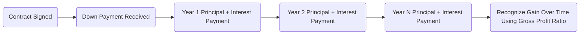

## 18.3 Installment Sales: Imputed Interest, Dealer Dispositions & Exceptions

The installment sales method is a powerful tool in tax planning and compliance, allowing taxpayers to defer recognition of gain over multiple tax periods. Instead of realizing and paying tax on the entire gain in the year of sale, sellers can spread out both the gain and tax liability as they receive payments. This approach can produce significant cash flow benefits, but it also carries multiple complexities, such as imputed interest requirements, dealer disposition restrictions, and exceptions that disallow installment sale deferral in certain transactions.

Throughout this section, we explore how to determine which transactions qualify for the installment method under Internal Revenue Code (IRC) §453, the rules for calculating gain each year, how to handle imputed interest, and the specific limitations that dealers in property typically face. By understanding these principles, you will be well-prepared not only for the CPA Exam but also for practical scenarios when advising clients.

---

### Core Concepts and Definitions

Before delving deeper, it is essential to define key terms:

• Installment Sale: A sale of property where at least one payment is received after the close of the taxable year in which the sale occurs.  
• Eligible Property: Generally includes real property and certain personal property not held for sale to customers in the ordinary course of business (i.e., not inventory property).  
• Dealer Property: Property held primarily for sale to customers in the ordinary course of trade or business. Installment sales treatment is typically disallowed for dealers.  
• Imputed Interest: Under certain circumstances (e.g., low-interest or no-interest notes), the IRS requires that part of the payments be treated as interest income, ensuring that an appropriate portion of each payment is taxed as ordinary income instead of capital gain.

---

### Overview of the Installment Method

The installment method permits the seller to recognize a portion of the total gain each time a payment of principal is received. This deferral can be advantageous for both income tax management and cash flow planning. However, the seller must separately account for interest (stated or imputed) and principal portions under the rules outlined in IRC §453 and related regulations.

From a policy perspective, Congress created the installment sale rules to more accurately match the recognition of gain with the actual receipt of proceeds. Without these rules, sellers might face hefty tax bills in a single year, even if they have not yet received the full sale proceeds.

---

### Gross Profit Ratio Formula

A key element of the installment sale calculation is the gross profit ratio. Each time the taxpayer receives a principal payment, they multiply that payment by the gross profit ratio to determine the gain recognized.

The formula for the gross profit ratio is:


\text{Gross Profit Ratio (GPR)} \;=\; \frac{\text{Gross Profit}}{\text{Contract Price}}


Where:

• Gross Profit = Selling Price − Adjusted Basis − Selling Expenses  
• Contract Price = Selling Price − Seller Liabilities Assumed by the Buyer (if the loan is assumed)

1. Selling Price: The total amount the buyer agrees to pay for the property, including cash, the face amount of any notes, assumed liabilities, or any other form of payment.  
2. Adjusted Basis: The seller’s cost basis in the property, adjusted for items such as depreciation or improvements.  
3. Selling Expenses: Commissions, legal fees, and other direct costs of the sale.  
4. Contract Price: Generally, the total amount the seller will actually receive in principal payments (including the down payment and subsequent installments).  

Each time a principal payment is received, the recognized gain is:


\text{Recognized Gain per Payment} = (\text{Principal Payment} \times \text{GPR})


Interest received (whether stated or imputed) is reported separately as ordinary income, not part of the gross profit ratio calculation.

---

### Step-by-Step Example

Assume Alice sells a warehouse with a $100,000 adjusted basis for $250,000. She receives a $50,000 down payment and a note for $200,000, payable in equal annual installments of $20,000 principal, plus interest, over 10 years.

• Gross Profit: $250,000 (Selling Price) − $100,000 (Adjusted Basis) = $150,000  
• Contract Price: $250,000 (No liabilities are assumed by the buyer in this example)  
• Gross Profit Ratio: $150,000 ÷ $250,000 = 0.60 (or 60%)

In Year 1, Alice receives her $50,000 down payment plus some interest. The principal portion of $50,000 is multiplied by 60% to determine gain recognized:


50{,}000 \times 0.60 = 30{,}000 \text{ of recognized capital gain.}


In subsequent years, Alice receives $20,000 of principal each year. Each principal payment of $20,000 generates:


20{,}000 \times 0.60 = 12{,}000 \text{ of recognized gain each year.}


The stated interest portion (if any) is recognized separately as ordinary interest income.

---

### Imputed Interest: Rationale and Application

When the stated interest rate on an installment sale note is below the Applicable Federal Rate (AFR) or, in some cases, if no interest is stated, the IRS “imputes” interest to prevent tax avoidance. The imputed interest rules attempt to ensure:

• A fair interest charge: Sellers should recognize ordinary income based on a minimum required rate rather than artificially inflating the purchase price to shift income into capital gain.  
• Adequate tax collection: Interest income is taxed at ordinary rates (potentially at higher rates than capital gains).

Typically, IRC §§483, 1274, and related regulations contain provisions governing how imputed interest is calculated. The seller (and buyer) must treat part of each installment as interest, thus reducing the portion of the payment treated as principal. This effectively impacts both the buyer’s interest deduction (if otherwise allowable) and the seller’s interest income.

#### Situations Triggering Imputed Interest

• No stated interest or a rate below the AFR on seller-financed notes.  
• Deferred-payment sales with long-term repayment schedules.  
• Structured transactions that appear to shift income away from ordinary rates to capital gains rates.

Sellers must track both stated interest and any imputed interest, reporting the amounts annually on Form 6252 (Installment Sale Income) and their tax returns. Failure to correctly account for imputed interest can lead to penalties and adjustments upon IRS examination.

---

### Dealer Dispositions: Exclusion from Installment Method

One of the most significant exclusions to installment sales treatment applies to dealers. A taxpayer is generally considered a dealer if they regularly buy and sell property of the same type, holding it primarily for sale to customers in the ordinary course of trade or business. For example, a real estate developer who subdivides and sells new lots to customers is viewed as a dealer with respect to those lots.

Because the seller is effectively making sales as routine business transactions, the IRS requires the recognition of the full gain in the year of sale, disallowing installment treatment. Dealer dispositions are often subject to ordinary income treatment rather than preferential capital gains rates. The rationale is that the property is akin to inventory for the business, and normal business income is not subject to a deferral method like the installment sale approach.

Common triggers for dealer status:

• Frequency and continuity of sales (e.g., flipping multiple houses every year).  
• Extent of property improvements, marketing, and advertising efforts.  
• Seller’s background and occupation (e.g., real estate developer vs. an investor).  

To minimize the risk of being classified as a dealer, some taxpayers structure their activities to demonstrate investment intent rather than resale. For the CPA Exam, remember that if the sale is recognized as a “dealer disposition,” the entire gain or loss is typically recognized immediately, and installment deferral is disallowed.

---

### Exceptions and Other Disallowed Uses

Apart from dealer dispositions, other exceptions can disqualify a sale from the installment method or limit certain portions of the gain. Key examples include:

• Recapture of Depreciation: IRC §§1245 and 1250 recapture must be recognized in the year of sale, regardless of whether installment treatment is applied to the non-recaptured portion. This means that any depreciation recapture is taxed up front at the applicable ordinary or capital gain rates, before the remaining gain can be spread over the term of the installment note.  
• Sale of Inventory: Property that is held for sale in the ordinary course of business (i.e., “inventory” property) does not qualify for installment sales treatment.  
• Marketable Securities: Under most circumstances, the installment method does not apply to the sale of publicly traded stock or securities.  
• Other Specific Exceptions: Certain dispositions require full recognition of gain in the year of sale if they fail to meet statutory requirements for installment reporting. For example, sales with very large debt instruments or transactions structured primarily to avoid interest recognition may face special rules.

---

### Structuring an Installment Sale: Practical Example

Suppose Bob, who is not a dealer, sells a small commercial property to a buyer for $400,000. Bob’s adjusted basis is $200,000, and he wants to maximize tax deferral. They agree on a 20% down payment ($80,000) and finance the remaining $320,000 over 10 years with 5% interest (assume this is at or above the current AFR so that no additional imputed interest applies).

Bob’s calculations:

• Gross Profit = $400,000 − $200,000 = $200,000  
• Contract Price = $400,000  
• Gross Profit Ratio = $200,000 ÷ $400,000 = 50%  

Bob will recognize 50% of each principal payment as capital gain. Any recaptured depreciation under §1250 must be recognized initially in the year of sale, so Bob must calculate the portion of gain attributable to depreciation recapture immediately. After recapture, he can apply the 50% ratio to the remainder of the gain on subsequent payments.

If Bob were a real estate “dealer,” however, the installment method would not apply. He would be forced to recognize the entire gain in the year of sale (or perhaps on a partial/percentage completion approach, but generally not under installment treatment). This difference highlights the importance of classifying the seller’s status accurately.

---

### Charting the Flow of an Installment Sale

Below is a simple mermaid.js diagram illustrating the sequence of events in an installment sale. The arrow labels in parentheses describe activities the seller must track and record.

Explanation:  
• The seller signs a contract to sell property, receiving a down payment in the year of sale.  
• In subsequent years, the seller receives periodic payments that typically include both principal and interest.  
• Each principal payment triggers the recognition of gain calculated by multiplying the payment by the gross profit ratio.  
• Any interest (stated or imputed) is recognized as ordinary income in the respective year.

---

### Best Practices and Common Pitfalls

• Ensure Proper Interest Rate: Prevent imputed interest complications by charging at least the AFR in your installment sale note.  
• Handle Depreciation Recapture First: Any IRC §§1245 or 1250 depreciation recapture is taxed in the year of sale, at ordinary rates (for §1245) or at special rates up to 25% (for certain §1250 gain).  
• Check Dealer Status: If the IRS deems the seller a dealer, installment method deferral is not available—leading to unexpected tax consequences.  
• Monitor Related Party Transactions: Special rules and potential conflicts of interest exist when selling property to related parties (see Chapter 19 for more on related party issues).  
• Keep Detailed Records: Maintain thorough documentation for down payments, interest charges, principal amounts received, and how each payment is allocated to recapture, basis, or gain.

---

### Conclusion and CPA Exam Insights

Understanding installment sales, imputed interest, and the limitations imposed on dealer dispositions is crucial for aspiring CPAs. The key aspects include recognizing the different possible classifications of a taxpayer, accurately calculating the gross profit ratio, and applying the rules for depreciation recapture and imputed interest. By mastering these rules, you enhance your qualification as a tax advisor and streamline efforts to address clients’ or employers’ needs in real-world transactions. Focus on memorizing the formula for the gross profit ratio and confidently apply concepts such as recapture and AFR rates. Exercise caution with any transaction that may trigger dealer treatment or involve property that does not qualify for installment reporting.

---

## Test Your Knowledge: Installment Sales & Dealer Exclusions Quiz



### For which type of property is the installment method generally disallowed?

- [x] Property held primarily for sale to customers in the ordinary course of business (dealer property).  
- [ ] Residential rental property held for investment.  
- [ ] Personal-use vacation home sold to a relative.  
- [ ] Farmland sold by a non-dealer farmer.  

> **Explanation:** Dealer property, akin to inventory, is excluded from using the installment method under IRC §453.  

### Which statement best describes imputed interest?

- [x] Interest that the IRS requires a seller to report if the stated interest rate is below the Applicable Federal Rate (AFR).  
- [ ] An additional form of interest charged by the lender.  
- [ ] Interest voluntarily charged by the seller above market rates.  
- [ ] A monthly penalty applied on all installment obligations.  

> **Explanation:** Imputed interest ensures that transactions featuring artificially low or zero interest are taxed appropriately.  

### Which portion of gain must be recognized immediately under the installment method for depreciable property?

- [x] Depreciation recapture.  
- [ ] Capital gain.  
- [ ] Section 1202 exclusion.  
- [ ] Passive loss carryover.  

> **Explanation:** Any §§1245 or 1250 recapture is recognized in the year of sale, disallowing deferral of that portion of the gain.  

### What happens if the seller fails to charge at least the Applicable Federal Rate in an installment sale?

- [x] The IRS imputes interest, treating part of each payment as ordinary interest income.  
- [ ] The IRS disallows the installment sale entirely.  
- [ ] The entire gain is converted to ordinary income.  
- [ ] The gain is deferred until the note matures.  

> **Explanation:** The IRS will recharacterize part of each payment as interest to ensure the seller pays tax at ordinary rates on that portion.  

### Which factor most strongly indicates that a taxpayer is a “dealer” for purposes of property transactions?

- [x] Conducting regular and frequent property sales to customers in the ordinary course of business.  
- [ ] Holding property for over five years before selling.  
- [x] Selling property at a loss.  
- [ ] Using the property for personal use.  

> **Explanation:** A “dealer” is someone who buys/sells property regularly as part of a business, often with significant marketing and development activities.  

### Under the formula for the gross profit ratio, what is the denominator generally called?

- [x] Contract Price.  
- [ ] Face Amount.  
- [ ] Cash Received.  
- [ ] Adjusted Basis.  

> **Explanation:** The contract price represents the total principal portion the seller expects to receive.  

### Which of the following is a key step in correctly reporting installment sale income annually?

- [x] Multiplying the gross profit ratio by the principal payment received.  
- [ ] Deducting depreciation recapture from the gross profit ratio calculation.  
- [x] Deferring all gain until the buyer fully pays the loan.  
- [ ] Combining principal and interest into one capital gain figure.  

> **Explanation:** Under an installment sale, the gain recognized each year is the gross profit ratio multiplied by the principal portion of payments received that year.  

### If the seller is not allowed to use the installment method, which aspect most likely caused the restriction?

- [x] The property was dealer property held for sale to customers.  
- [ ] The taxpayer had a high overall income.  
- [ ] The sale involved only a short-term financing arrangement.  
- [ ] The average maturity of the loan was less than 12 months.  

> **Explanation:** Dealer property is excluded from installment sale treatment, forcing immediate gain recognition.  

### In an installment sale transaction, which of the following is recognized as separate ordinary income?

- [x] Interest (stated or imputed).  
- [ ] The portion of the payment representing capital gain.  
- [ ] Depreciation recapture.  
- [ ] The entire principal portion of the payment.  

> **Explanation:** Interest income is typically separated from the gross profit calculation and taxed at ordinary rates.  

### Under the installment sale rules, which statement is TRUE regarding sales of inventory?

- [x] Generally, installment sale reporting does not apply to sales of inventory.  
- [ ] Inventory sales frequently benefit from the installment method.  
- [ ] Inventory sales are always taxed at long-term capital gain rates.  
- [ ] The IRS always imputes interest on inventory sales.  

> **Explanation:** By definition, the installment method is generally excluded for sales of property held for sale in the ordinary course of business—i.e., inventory.



---

## For Additional Practice and Deeper Preparation

**[TCP CPA Hardest Mock Exams: In-Depth & Clear Explanations](https://www.udemy.com/course/tcp-cpa-mock-exams/?referralCode=675149871D0E79B1699C)**  

**Tax Compliance & Planning (TCP) CPA Mocks:** 6 Full (1,500 Qs), Harder Than Real! In-Depth & Clear. Crush With Confidence!

- Tackle full-length mock exams designed to mirror real TCP questions.  
- Refine your exam-day strategies with detailed, step-by-step solutions for every scenario.  
- Explore in-depth rationales that reinforce higher-level concepts, giving you an edge on test day.  
- Boost confidence and minimize anxiety by mastering every corner of the TCP blueprint.  
- Perfect for those seeking exceptionally hard mocks and real-world readiness.

_Disclaimer: This course is not endorsed by or affiliated with the AICPA, NASBA, or any official CPA Examination authority. All content is for educational and preparatory purposes only._
