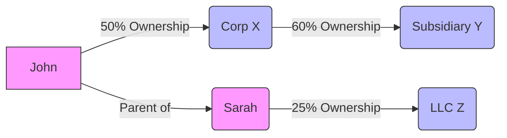

## 19.1 Disallowed Losses, Constructive Ownership & Deferred Gains

Disallowed losses, constructive ownership, and deferred gains are core components of understanding how the Internal Revenue Code (IRC) approaches tax reporting for transactions between related parties. Under specific IRC provisions—most notably §267 and §318—gains or losses recognized in dealings within family and affiliate structures can be disallowed or deferred. For CPA candidates, mastering these rules is vital, as you will often encounter them not only on the exam but also in real-world tax practice. This section clarifies how direct or indirect family relationships can trigger disallowance of immediate losses (and sometimes gains), and outlines where deferred gains can arise. We also provide a practical "cheat sheet" on ownership attribution to help you navigate the complexities of constructive ownership.

-------------------------------------------------------------------------------
### Overview of Related-Party Transactions

Related-party transactions involve individuals or entities with close ties—whether familial or economic. When such transactions occur, the IRS imposes restrictions on recognizing losses (or adjustments to gains) to close loopholes and prevent artificial loss harvesting. For instance, a parent might attempt to sell depreciated property to a child at a loss to claim a tax deduction while keeping the property within the family. Section 267 ensures that such losses are disallowed for tax purposes.

#### Key Aspects to Remember
• Disallowed Losses: Often occur in transactions between related parties.  
• Constructive Ownership: A legal fiction that attributes individual ownership to other family members or entities to curb possible abuse.  
• Deferred Gains: Certain gains may not be recognized immediately but carried over and recognized in the future under specific circumstances.  

-------------------------------------------------------------------------------
### Major Code Sections Impacting Disallowed Losses & Constructive Ownership

1. **IRC §267** – Identifies related parties and disallows losses on sales or exchanges between them. It also can affect the timing and recognition of gains.  
2. **IRC §318** – Defines constructive ownership rules, especially relevant for stock ownership in corporations, S corporations, or partnerships.  
3. **Other Sections** – Various supplementary provisions—such as §707 in partnership contexts—can also influence whether a transaction is considered to be occurring at arm’s length.

CPA candidates and tax practitioners must be fluent in these rules to address exam questions accurately and advise clients on structuring transactions. 

-------------------------------------------------------------------------------
### Defining “Related Parties” Under Section 267

Section 267 comprehensively outlines who is considered a related party. Family relationships are the most common scenario, encompassing:

• Spouses.  
• Siblings.  
• Ancestors (parents, grandparents).  
• Lineal descendants (children, grandchildren).  

Additionally, related parties include certain corporate, partnership, estate, and trust relationships if a controlling interest is present. The goal is to ensure that a taxpayer cannot generate artificial losses by moving assets within their close circle.

#### Practical Example: Parent-to-Child Sale
A parent sells stock to a child, generating a $5,000 loss. Since this transaction is between related parties, the parent’s loss is disallowed under §267. Further, the disallowed loss is not merely “gone” in all circumstances—some or all of it might affect the child’s basis if that child later sells the asset. The complicated interplay of basis adjustments is important to watch out for on the exam and in professional practice.

-------------------------------------------------------------------------------
### Constructive Ownership Rules (IRC §318)

Constructive ownership refers to ownership that is deemed to exist for tax purposes, even if not directly titled in the taxpayer’s name. This concept prevents taxpayers from bypassing related-party rules by transferring ownership to a relative or another controlled entity. Section 318 ownership rules often apply to:

• Stock owned directly or indirectly by a spouse, child, or parent.  
• Stock owned by an entity such as a corporation, partnership, or trust, if the individual has a sufficient ownership interest in that entity.  
• Certain options to purchase stock that may be treated as if the individual already owns the stock.  

Constructive ownership can be particularly tricky. For example, if you own 50% of a corporation, and that corporation owns 50% of a second subsidiary, you may be attributed ownership of the shares owned by that subsidiary to evaluate whether a transaction is occurring between related parties.  

#### Attribution Rules Cheat Sheet
Use the following cheat sheet for a quick reference on how constructive ownership might apply to your client or exam question:

| Relationship          | Constructive Ownership?                                                                                          |
|-----------------------|--------------------------------------------------------------------------------------------------------------------|
| Spouse                | Yes, full attribution of directly owned shares between spouses, subject to certain exceptions.                     |
| Parent ↔ Child        | Yes, parent’s shares constructively attributed to child, and child’s shares attributed to the parent.             |
| Siblings              | Indirect. Attribution between siblings does not automatically occur, but can occur through a parent or entity.    |
| Corporations          | If an individual owns ≥ 50% in value of a corporation, they are attributed the corporation’s shares in another entity. |
| Partnerships & LLCs   | If an individual owns ≥ 50% interest in the partnership or LLC, they are attributed the partnership’s ownership.     |
| Trusts & Estates      | Beneficiaries of trusts or estates may receive constructive ownership of the trust’s shares if certain thresholds are met. |

-------------------------------------------------------------------------------
### Illustrative Ownership Attribution Diagram

Below is a sample Mermaid diagram showing how constructive ownership might flow among individuals and entities in a hypothetical scenario.

In this example:  
• John directly owns 50% of Corp X, which in turn owns 60% of Subsidiary Y. Constructive ownership rules may attribute John ownership of some or all of Subsidiary Y’s holdings.  
• Sarah (John’s child) owns a 25% stake in LLC Z. John may be considered indirectly tied to LLC Z under certain rules, though direct parent-child attribution generally applies to stock ownership rather than membership interests—but analogous principles can apply in certain pass-through contexts.  

-------------------------------------------------------------------------------
### Disallowed Losses in More Detail

When a taxpayer sells property to a related party at a loss, §267 generally disallows that loss. This means the loss cannot be recognized on the taxpayer’s return. However, there may be implications for the basis in the hands of the transferee. 

#### Key Mechanics
1. **Loss Disallowance**: The seller cannot claim the loss on their tax return.  
2. **Transferee’s Basis**: If the asset appreciates and the buyer sells it at a gain later, part or all of the previously disallowed loss may reduce the gain recognized at that time, depending on certain conditions.  

#### Example: Disallowed Loss & Future Basis Adjustment
• Jane sells stock to her adult son, Mike, for $10,000, creating a $3,000 realized loss for Jane. Because this is a §267 transaction, the $3,000 loss is disallowed.  
• If Mike sells the stock in a future year for $15,000, any potential gain might be adjusted downward by the $3,000 disallowed loss, so that Mike might only recognize $2,000 of gain ($15,000 – $10,000 – $3,000). However, this depends on satisfying the rules regarding the transaction’s timing and the basis carryover.

-------------------------------------------------------------------------------
### Constructive Ownership & Gain Shifting

Sometimes, instead of disallowed losses, the transaction might produce artificially low or high gains if the parties were unrelated. Constructive ownership may force a taxpayer to realize gain earlier than expected or at a higher level if the IRS deems that the transaction did not occur at arm’s length.  

#### Joint Ownership Example
• Suppose a parent and child jointly own a piece of rental property. If the arrangement is structured in a manner designed to shift income or deductions artificially, the IRS can use constructive ownership rules to reallocate income or deny certain deductions.

-------------------------------------------------------------------------------
### Deferred Gains: When Recognition Is Delayed

While disallowed losses are the spotlight of §267, there are also instances under other Code sections where gains might be deferred when related parties exchange property. For example:  

• **Like-Kind Exchanges (§1031)**: Gains can be deferred if the property exchanged is real property held for business or investment. However, related-party transactions under a §1031 exchange have special rules that require the exchanged property to be held for a minimum of two years to avoid gain recognition.  
• **Partnership Distributions**: Under §707(b), if a partnership distributes property to a related partner (including a controlling partner or related entity), the transaction may be recharacterized, potentially triggering or deferring gain recognition.

The CPA exam might test your ability to identify when a transaction involving related parties defers or disallows gains, and how that deferral might end if certain holding periods are not satisfied.

-------------------------------------------------------------------------------
### Tax Planning Considerations

1. **Avoid Synthetically Shifting Losses**: Since disallowed losses under §267 cannot be deducted, families and closely held businesses should seek strategies to avoid inadvertently creating transactions that risk disallowance.  
2. **Basis Planning**: Understanding how disallowed losses might later reduce a transferee’s potential gain allows for strategic asset management over time.  
3. **Entity Choice**: Work with partnerships, S corporations, or C corporations in ways that minimize the adverse effects of constructive ownership rules and disallowed losses.  
4. **Exit Strategies**: If a sale is planned within a family, consider waiting until an unrelated third-party transaction is possible to realize legitimate losses while preserving family wealth.  

-------------------------------------------------------------------------------
### Real-World Scenario: Family-Owned Business

Imagine a multi-generational family business (e.g., a local manufacturing shop). The parents hold 70% ownership, with the children owning 30%. The family decides to transfer a piece of equipment between the parents’ partnership and the children’s wholly owned corporation, claiming a loss in the process. Upon closer examination:

1. **Attribution**: The parents are constructive owners of the children’s corporation because of their controlling interest in the partnership and the close familial relationship.  
2. **Loss Disallowance**: Because both sets of owners are considered “related parties,” any resulting loss on the sale is disallowed.  
3. **Future Adjustments**: If the children’s corporation sells the equipment at a future gain, some or all of the disallowed loss might be used to reduce that gain, if it meets all relevant statutory requirements.  

-------------------------------------------------------------------------------
### Potential Pitfalls & Best Practices

Below are some key pitfalls to avoid and best practices to adopt:

#### Pitfalls
• **Unintentionally Triggering §267 Disallowance**: Selling property to a related party below market value without realizing that the transaction might disallow an otherwise deductible loss.  
• **Overlooking Constructive Ownership**: Failing to consider how family members or controlled entities might automatically attribute ownership, resulting in negative tax consequences.  
• **Misclassifying Gains**: Assuming a partial or total gain is tax-free or deferred when in reality the related-party rules require immediate recognition.  

#### Best Practices
• **Document Transactions Thoroughly**: Even among family members, maintain evidence that the sale price is fair market value.  
• **Plan Holistically**: If you want to preserve losses, consider timing strategies or structuring the transaction with an unrelated intermediary (provided it meets all legal parameters and does not constitute a stepped transaction).  
• **Keep Up with Legislative Changes**: Rates, thresholds, or definitions of related parties can shift over time, so stay informed of new statutory updates or rulings.  

-------------------------------------------------------------------------------
### Practical Ownership Attribution “Cheat Sheet”

To help you remember key constructive ownership scenarios, reference the chart below:

1. **Family Attribution**  
   - From an individual to spouse, children, grandchildren, and parents.  
   - Siblings do not directly attribute ownership to each other unless an intermediate party triggers it (like a parent or an entity).  
2. **Entity-to-Owner Attribution**  
   - Ownership from an entity (corporation, partnership, LLC, trust) to an owner if the owner’s stake ≥ 50%.  
   - Careful with multiple tiers: “Grandchild” ownership of multiple tiers of entities can attribute back to the original individual.  
3. **Option Attribution**  
   - If an individual holds an option to acquire stock, the IRS may treat that person as already owning the stock for certain tests (e.g., ownership thresholds in redemption or distribution situations).  

-------------------------------------------------------------------------------
### Diagrams & Tables to Reinforce Learning

For those who learn visually, the following table reflects different transactions and their potential tax treatment outcomes:

| Transaction Type                                   | Related Party?        | Potential Outcome                 |
|----------------------------------------------------|-----------------------|-----------------------------------|
| Sale of appreciated stock from parent to child     | Yes (direct)         | Gain generally recognized by seller; no increased basis for child.   |
| Sale of depreciated property from father to son    | Yes (direct)         | Loss disallowed under §267. May reduce future gain if child sells.    |
| Sale from Uncle’s partnership (Uncle owns 60%) to nephew’s S corp (nephew owns 80%) | Yes, via constructive ownership | Loss or gain adjustments apply; partial or complete disallowance possible. |
| Like-kind exchange of business realty between siblings | Indirect (siblings) | If transaction is still “related party” under the Code, must comply with special holding requirements. |
| Distribution of property from partnership to controlling partner | Yes, via §707   | May trigger recognition or deferral of gain, depending on structure.  |

-------------------------------------------------------------------------------
### Exam-Taking Strategies

1. **Focus on Definitions**: Precisely identify related parties as defined under §267 and constructive ownership under §318.  
2. **Apply the Disallowance**: If a transaction is indeed between related parties, check if a loss is disallowed or a gain is deferred.  
3. **Carryover & Impact**: Pay close attention to how basis is adjusted for the transferee if a future sale occurs.  
4. **Look for Exceptions**: Some Code sections or specific exceptions (like certain stock redemptions or multi-layered transactions) might override or modify the general rule.  

-------------------------------------------------------------------------------
### References for Further Exploration

• IRC §267, §318, and related Treasury Regulations — for detailed definitions and attributions.  
• IRS Publication 544 (Sales and Other Dispositions of Assets) — provides plain-language guidance.  
• AICPA Tax Section Library — offers case studies and professional guidance on related-party transactions.  
• [Internal Revenue Manual (IRM)](https://www.irs.gov/irm) — advanced-level guidance, especially for exam controversies.  

-------------------------------------------------------------------------------
### Conclusion

Disallowed losses, constructive ownership, and deferred gains can appear daunting at first glance, but they become much more approachable once you break them down into their core elements. Be sure to understand who qualifies as a “related party,” how constructive ownership is determined to prevent circumvention, and when losses or gains must be disallowed or deferred. By mastering these principles, you not only ease your path through the Uniform CPA Examination’s Tax Compliance and Planning section but also build a robust foundation for your tax advisory career.

In the next sections of this Part V on Property Transactions, you will see how these related-party concepts integrate with more complex transactions such as installment sales, §1031 exchanges with family members, and multilayered LLCs or corporate structures.

Remember: vigilance is key. The IRS designed these rules to thwart any attempt to generate artificial deductions or manipulations. A well-prepared CPA can navigate these codes to serve clients effectively and ethically.

-------------------------------------------------------------------------------

## Disallowed Losses, Constructive Ownership & Deferred Gains Mastery Quiz



### Which of the following best describes the outcome when a taxpayer sells property at a loss to a related party?

- [ ] The loss is recognized fully in the current year.  
- [x] The loss is disallowed and cannot be claimed in the current year.  
- [ ] The loss is recognized, but only 50% of the usual deduction is allowed.  
- [ ] The sale triggers an additional excise tax on the disallowed loss.

> **Explanation:** Under IRC §267, losses on sales or exchanges between related parties are disallowed to prevent taxpayers from artificially creating deductions without losing control of the property.

### Which family relationships typically fall under §267’s definition of related parties?

- [x] Ancestors, lineal descendants, and spouses  
- [ ] Strictly siblings only  
- [ ] Nieces and nephews only  
- [ ] Siblings, but not half-siblings

> **Explanation:** Related parties for §267 include direct ancestors (parents, grandparents), lineal descendants (children, grandchildren), siblings in certain contexts, and spouses. The Code is broad in capturing these close familial ties.

### Under constructive ownership rules in §318, if an individual owns 60% of a corporation which in turn owns 40% of another subsidiary, how is that individual’s indirect ownership in the subsidiary generally treated?

- [ ] The individual is deemed to own 10%.  
- [x] The individual may be treated as owning the 40% indirectly through the corporation.  
- [ ] No constructive ownership applies because the corporation is a separate entity.  
- [ ] The individual is deemed to own 100% of the subsidiary.

> **Explanation:** Constructive ownership rules often attribute ownership from an entity to its shareholders (if ownership is above a certain threshold). A 60% owner can be treated as having indirect ownership of the entity’s holdings.

### When a loss is disallowed on a sale between related parties, which of the following may occur upon a later sale by the transferee?

- [ ] The transferee is required to recognize any gain at 50% tax rate.  
- [ ] The transferee must forfeit all capital gain treatment.  
- [x] Some or all of the previously disallowed loss may reduce the transferee’s eventual gain.  
- [ ] The transferee’s basis is always reduced to zero.

> **Explanation:** If the asset is sold at a gain by the transferee, the disallowed loss may be used to reduce the recognized gain, subject to certain statutory limitations.

### Which one of the following is a best practice for a family-owned entity seeking to avoid disallowed losses?

- [x] Conduct transactions at fair market value and maintain robust documentation.  
- [ ] Transfer property at a substantial discount to reduce immediate gains.  
- [ ] Employ multiple trusts to hide ownership.  
- [ ] Intentionally trigger a loss to offset future gains.

> **Explanation:** Ensuring any transaction among family members occurs at a fair market value and is well documented is essential to minimizing potential disallowances under IRS scrutiny.

### Which of the following is an example of constructive ownership between spouses?

- [x] If a wife owns 80% of an S corporation, her husband may be considered a constructive owner of that same stock.  
- [ ] A spouse never has constructive ownership if the couple files separately.  
- [ ] A spouse only has constructive ownership under a joint trust.  
- [ ] Constructive ownership between spouses is limited to 50%, regardless of actual holding.

> **Explanation:** Under §318, stock owned directly or indirectly by one’s spouse is generally considered owned by the other spouse unless certain exceptions apply.

### In a multi-tier entity structure, which of the following can trigger unexpected related-party concerns under §267?

- [ ] A partner with less than 10% interest in one tier.  
- [x] One partner (or shareholder) holding more than 50% in multiple tiers, creating attribution across the tiers.  
- [ ] Only direct ownership in publicly traded companies.  
- [ ] Transactions conducted at exactly book value. 

> **Explanation:** When one individual or family group holds controlling interests in multiple tiers, the constructive ownership rules can cascade, making many transactions subject to related-party rules.

### If a parent sells land to a child, realizing a loss of $10,000, how should the parent treat this loss for income tax purposes?

- [ ] The parent can deduct the loss if the child holds the property for more than one year.  
- [ ] The parent can amortize the loss over five years.  
- [x] The parent must disallow the $10,000 loss under §267.  
- [ ] The parent offsets the loss solely with capital gains from the child’s income.

> **Explanation:** A loss on sales or exchanges between a parent and child is disallowed. There is no provision for amortizing or gradually recognizing the disallowed loss.

### Which of the following is true regarding like-kind exchanges and related parties under §1031?

- [ ] Related parties cannot perform a like-kind exchange under any circumstances.  
- [ ] Gains must always be recognized immediately.  
- [x] The property generally must be held for at least two years to avoid immediate recognition.  
- [ ] The exchange never affects future basis adjustments.

> **Explanation:** Related parties participating in a §1031 exchange must hold both properties for a minimum of two years to avoid triggering immediate gain recognition.

### True or False: A constructive ownership rule can attribute a corporation’s ownership in a separate entity to the corporation’s minority (20%) shareholder.

- [ ] True  
- [x] False

> **Explanation:** Typically, constructive ownership applies if the individual holds a 50% or greater ownership stake in the entity. A 20% minority shareholder would generally need additional relationships or special circumstances before ownership in another entity is attributed to them.



-------------------------------------------------------------------------------

## For Additional Practice and Deeper Preparation

**[TCP CPA Hardest Mock Exams: In-Depth & Clear Explanations](https://www.udemy.com/course/tcp-cpa-mock-exams/?referralCode=675149871D0E79B1699C)**  

**Tax Compliance & Planning (TCP) CPA Mocks:** 6 Full (1,500 Qs), Harder Than Real! In-Depth & Clear. Crush With Confidence!

- Tackle full-length mock exams designed to mirror real TCP questions.  
- Refine your exam-day strategies with detailed, step-by-step solutions for every scenario.  
- Explore in-depth rationales that reinforce higher-level concepts, giving you an edge on test day.  
- Boost confidence and minimize anxiety by mastering every corner of the TCP blueprint.  
- Perfect for those seeking exceptionally hard mocks and real-world readiness.  

_Disclaimer: This course is not endorsed by or affiliated with the AICPA, NASBA, or any official CPA Examination authority. All content is for educational and preparatory purposes only._
