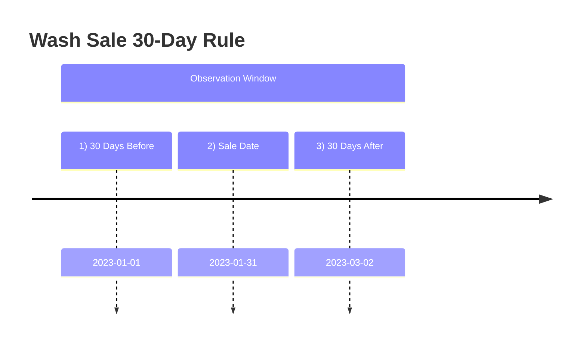

## 19.2 Wash Sales & Worthless Securities Treatment

Understanding the interplay between wash sale rules and worthless securities treatment is crucial for those preparing for the Tax Compliance and Planning (TCP) section of the Uniform CPA Examination. This topic combines important timing considerations, intricate definitions, and record-keeping best practices that CPAs must master to advise clients effectively and to ensure compliance with U.S. tax laws. This chapter explores key areas, including the 30-day rule around re-purchasing, definition of “substantially identical” securities, disallowed and postponed losses, and the distinctions between partial and complete worthlessness in corporate stock or debt. By mastering these concepts, you will be well-prepared to handle even the most intricate cases of wash sales and worthless assets on the exam and in practice.

--------------------------------------------------------------------------------
### Wash Sale: Definition and Core Concepts

A “wash sale” occurs when an investor sells or trades stock or securities at a loss and then repurchases or acquires “substantially identical” stock or securities within a specified window. Under Internal Revenue Code (IRC) §1091 and related regulations:

• The wash sale rule disallows a taxpayer from claiming a tax loss if they repurchase (or otherwise acquire) the same or substantially identical stock within 30 days before or after the sale.  
• “Substantially identical” generally refers to the same securities, but certain derivative instruments or convertible assets may also be deemed substantially identical.  
• The disallowed loss is not gone forever; rather, the loss is deferred and added (or “tacked on”) to the basis of the repurchased securities, potentially reducing future capital gains.

Because wash sales can be triggered by actions such as repurchasing shares in an individual investment account, an IRA, or even in certain spousal accounts, the complexity is more than a mere “buy-sell” interplay. Let’s break down the 30-day window and timing in detail.

--------------------------------------------------------------------------------
### The 30-Day Window: Timing Rules for Wash Sales

Under IRC §1091, the period in which the disallowance applies is 61 total days—30 days before the sale, the day of the sale, and 30 days after the sale:

• If you sell a security on Day 0, any purchase of substantially identical securities from Day -30 to Day +30 can cause the sale to be considered a wash sale.  
• If it is a wash sale, the realized loss is disallowed immediately and instead is added to (i.e., capitalized into) the basis of the newly acquired securities.  

Below is a simplified timeline using a Mermaid.js diagram to illustrate:



In the scenario shown above:  
• Any purchase of substantially identical stock during the period from January 1 (30 days before sale) to March 2 (30 days after sale) disallows the loss realized from the January 31 sale.  

#### Example

Suppose Hillary sells 100 shares of Company X at a $1,000 loss on January 31. If she repurchases those 100 shares, or an option to buy those shares, on February 15 (within 30 days after the sale), the $1,000 loss is disallowed under wash sale rules. Hillary must add the $1,000 to the basis of the newly acquired stock, postponing the deduction until she sells those replacement shares in a transaction that does not trigger wash sale treatment.

--------------------------------------------------------------------------------
### Substantially Identical Securities

One major complexity is determining when new securities are “substantially identical.” Although the IRC does not always define this term explicitly for every case, courts and IRS rulings typically consider the following:

• Common Stock vs. Preferred Stock: In many situations, common stock and preferred stock of the same corporation are not considered substantially identical if they carry different rights and risk profiles.  
• Bonds, Options, & Convertible Securities: A convertible bond may be deemed substantially identical to the underlying stock if the strike prices, conversion rules, or other conditions make them essentially replicate the position in the underlying.  
• Mutual Funds & ETFs: Two different funds tracking the same index might be considered substantially identical if they invest in nearly the same basket of securities and are highly correlated.  

Taxpayers should perform careful due diligence when selling securities at a loss and intending to re-enter positions. Even small differences in composition, terms, or rights can potentially remove the “substantially identical” label, but one must proceed with caution.

--------------------------------------------------------------------------------
### Disallowed Loss and Basis Adjustment

Under wash sale rules, if a loss is disallowed, the loss amount is deferred by adding it to the basis of the replacement security. Therefore:

• A taxpayer does not permanently lose the benefit of the disallowed loss.  
• The realized loss effectively transfers to the newly purchased (replacement) stock’s basis.  
• Holding period: The holding period for the new position “tacks on” to the holding period of the old position that was sold, preserving long-term or short-term classification.  

In effect, wash sale rules often convert short-term capital losses into potential future losses (or reduce future capital gains). For tax planning, individuals sometimes inadvertently trigger wash sales if they are rebalancing a portfolio but fail to consider overlapping holdings or time intervals.

--------------------------------------------------------------------------------
### Real-World Pitfalls and Planning Tips

• Automated Dividend Reinvestment: If you sell a security at a loss but are also enrolled in a Dividend Reinvestment Plan (DRIP) that reinvests dividends into the same or substantially identical stock, you could trigger a wash sale inadvertently.  
• Brokerage Transfers: Changing brokerages does not suspend the wash sale rules. You must track cost basis and purchases across all accounts.  
• Spousal Accounts & IRAs: A purchase by a spouse or within an IRA can still trigger a wash sale with respect to your sales. The IRS has determined that family or retirement account acquisitions can cause disallowed losses.  
• Tactical Pairs: To maintain market exposure but avoid a wash sale, some investors choose to sell one ETF tracking an index and buy a slightly different ETF with similar but not identical holdings for 31 days.  

These complexities highlight the importance of precise record-keeping. As you approach the CPA exam and real-world practice, you will need to be attuned to these details.

--------------------------------------------------------------------------------
### Worthless Securities: Overview

Worthless securities are those that have no current or future value. Under IRC §165(g), if a security (such as stock in a corporation or a bond) becomes completely worthless, the taxpayer is treated as if they sold or exchanged the security on the last day of the tax year for $0, thereby typically generating a capital loss. Key points:

• Timing: The security must be completely worthless during the tax year. Mere decline in price is not enough; the security typically must have no liquidation value and no potential to recover.  
• Documentation: Taxpayers generally must demonstrate that there is no reasonable chance of the security regaining any value or that the issuer is fully liquidated/defunct.  
• Capital vs. Ordinary: Generally, worthless stock is considered a capital loss unless it’s considered “Section 1244 stock” (small business stock) or certain debt instruments that might generate an ordinary loss in special circumstances.

--------------------------------------------------------------------------------
### Partial vs. Complete Worthlessness

Although IRC §165 discusses the treatment of worthless securities, a distinction arises between partially worthless versus wholly worthless securities—especially relevant for corporate debt or stock in financial distress.

#### Partial Worthlessness

• Applies most commonly to debt instruments. Sometimes a creditor receives partial repayment, with the remainder having little or no chance of collection.  
• A partial write-off might be allowed when the taxpayer can demonstrate some portion of the receivable (or bond) is “uncollectible.” However, the IRS often scrutinizes partial worthlessness claims. In general, for non-business bad debts, a deduction is allowed only when the debt becomes totally worthless, offering no partial worthless deduction.  

#### Complete Worthlessness

• For corporate stock, the entire basis can be deducted as a capital loss (or ordinary loss for qualifying small business stock under Section 1244) once the security is conclusively worthless.  
• Typically arises when the corporation enters liquidation or bankruptcy with no distribution prospects for common shareholders.  
• The taxpayer must prove the event of worthlessness occurred within the tax year (or by the last day of the year for capital stock).  

Below is a visual table summarizing the difference between partial vs. complete worthlessness:

| Aspect                   | Partial Worthlessness                                          | Complete Worthlessness                                             |
|--------------------------|----------------------------------------------------------------|---------------------------------------------------------------------|
| Common Context           | Often arises in business debts where partial recovery occurs   | Security (or debt) has zero value, no chance of recovery            |
| Deduction Availability   | Strictly limited, generally for business bad debts (IRC §166)  | Capital loss treatment under IRC §165(g) for stock & certain debts  |
| Timing                   | Deduction can be claimed (in limited scenarios) when partial   | Deduction claimed once the asset is conclusively worthless          |
| Tax Treatment            | Usually carryover basis remains for portion not recovered      | Full basis recognized as capital (or ordinary if applicable) loss   |
| Documentation            | Requires evidence of uncollectibility for portion claimed      | Requires proof that security has no prospective or liquidation value|

--------------------------------------------------------------------------------
### Case Study: Corporate Debt Gone Bad

Natalie holds a $50,000 bond in StellarTech Corp, which has defaulted on its interest payments and is in serious financial distress. In the current tax year, an independent trustee for the company notifies bondholders that only 20% of principal is recoverable. The corporation eventually goes bankrupt, paying out 10% of bond value in full settlement. Because Natalie received partial repayment (10%) but no further distribution is expected, she claims a $45,000 loss. The partial worthlessness route depends on the type of debt:  
• If it’s a nonbusiness (personal) bad debt, the IRS generally requires complete worthlessness before any deduction is allowed, turning it into a short-term capital loss.  
• If it’s a business bad debt (i.e., Natalie’s trade or business holds the debt), partial deductibility might be permitted.  

This scenario underscores how the classification of debt, the method of partial or total repayment, and the business-vs.-nonbusiness context significantly affect whether the deduction is granted in part or must wait until complete worthlessness.

--------------------------------------------------------------------------------
### Practical Challenges and Best Practices

1. **Determination of Year of Worthlessness**  
   Condemning a security as “worthless” can be subjective. It typically requires evidence such as a bankruptcy filing, liquidation plan showing no distributions, or delisting from major exchanges and official statements from corporate officers.

2. **Misclassification of Partial vs. Complete Loss**  
   Taxpayers sometimes prematurely claim a partial worthless deduction without firm evidence that no future recovery is possible. This heightens audit risk.

3. **Record-Keeping for Wash Sales and Worthless Securities**  
   • Maintain trade confirmations, reinvestment notices, and brokerage statements.  
   • Document the timing of each transaction thoroughly.  
   • Track attempts to collect or realize any value from worthless securities.

4. **Cross-Border or Multi-State Considerations**  
   Certain states or foreign jurisdictions may have different guidelines for worthless securities or might respect partial worthlessness in additional circumstances. In multi-jurisdiction scenarios, ensure compliance efforts are carefully tailored to each location’s laws.

5. **Interaction with State & Local Tax (SALT) Deductions**  
   As covered more extensively in Part VII on State & Local Tax Topics (Chapter 23), worthless security losses might vary in treatment among state tax codes, especially with carryover rules or special incentives.  

6. **Strategic Deferral and Planning**  
   • In certain cases, it may be advantageous to strategically realize or disallow a loss, especially if the future tax bracket or capital gains situation is expected to change.  
   • Advisors may recommend timing the sale or exploring an alternate security that is “similar but not substantially identical” to maintain market exposure and still realize a tax benefit.

--------------------------------------------------------------------------------
### Diagrams and Illustrations

To further simplify the concept of partial vs. total worthlessness, here is a Mermaid.js diagram showing a flow of events for securities approaching worthlessness:

```mermaid
flowchart TB
    A[Security Experiences Severe Financial Distress] --> B{Partial Recovery Possible?}
    B -- Yes --> C[Determine Business vs. Nonbusiness Debt]
    C -- Business Debt? --> C2[Possible Partial Deduction Under IRC §166]
    C -- Nonbusiness Debt? --> C3[No Partial Deduction <br/>Wait for Complete Worthlessness]
    B -- No --> D[Claim Full Deduction for Complete Worthlessness Under IRC §165(g)]
```

This high-level flowchart helps visualize the sequence of decisions that a taxpayer and a tax professional must go through when evaluating whether an asset is partially or completely worthless.

--------------------------------------------------------------------------------
### Exam-Relevant Strategies and Reminders

• **Be Vigilant with Dates**: Key to the wash sale rule is the 30-day window. Missing a single date can cost a taxpayer a valid loss deduction.  
• **Check for Substantially Identical Instruments**: Thoroughly verify the nature of replacement securities. Students and practitioners frequently overlook subtle distinctions in convertible or derivative contracts.  
• **Proving Worthlessness**: Strengthen your analytical skills to identify and properly document the year in which complete worthlessness arises.  
• **Section 1244 Stock**: Be familiar with the rules that allow ordinary loss treatment for certain small business stocks. This can be a powerful aspect in the exam and real-world scenario.  
• **K-1 Allocations**: In partnerships that invest in multiple assets, watch out for pass-through worthless security deductions. Keep an eye on how passive activity limitations (see Chapter 5) interrelate with worthless security losses.  

Use these insights, along with examples from your practice sessions, to better navigate the complexities of wash sales and worthless security transactions.

--------------------------------------------------------------------------------
### References and Further Exploration

• Internal Revenue Code (IRC) §165(g), §166, and §1091  
• U.S. Treasury Regulations for Capital Gains, Wash Sales, and Worthless Securities  
• IRS Publications:  
  – Publication 550 (Investment Income and Expenses)  
  – Publication 544 (Sales and Other Dispositions of Assets)  
• Related sections of this book:  
  – Chapter 17: Nontaxable Dispositions (contrast with disallowed losses in wash sales)  
  – Chapter 18: Character of Gains & Losses (overview of capital vs. ordinary)  
  – Chapter 19.1: Related Party Issues & Deferred Gains (complements the wash sale concept)  
  – Chapter 25: Advanced IRS Procedures & Controversies (strategies for audits and dispute resolution)  

Online Courses & Articles for Additional Learning:  
• AICPA® Resource Library on Capital Transactions  
• Estate & Financial Planning Journals for advanced worthless security cases  
• [IRS Tax Tips](https://www.irs.gov/newsroom) on investment losses and worthless securities  

--------------------------------------------------------------------------------
## Mastering Wash Sales & Worthless Securities Quiz



### Which of the following describes the 30-day wash sale rule timing?

- [x] It applies to purchases of substantially identical securities made 30 days before or after the sale.  
- [ ] It only applies to purchases made the same day as the sale.  
- [ ] It applies to any securities sale that results in a gain.  
- [ ] It only applies if you repurchase the identical shares on the same exchange.  

> **Explanation:** Under IRC §1091, the disallowed loss applies if a taxpayer buys substantially identical securities within 30 days before or after the loss sale, creating a 61-day observation window.

### In a wash sale, how is the disallowed loss ultimately treated?

- [x] It is added to the basis of the replacement stock.  
- [ ] It vanishes permanently.  
- [ ] It is recognized as an ordinary loss in the same tax year.  
- [ ] It is recognized only when the taxpayer files an amended return.  

> **Explanation:** The disallowed loss is capitalized into the basis of the new, substantially identical security, deferring the loss until a future sale when no wash sale rule applies.

### For a corporate stock to be considered 100% worthless, the taxpayer generally must show:

- [x] There is no potential for recovery and the stock lacks any liquidation value.  
- [x] The corporation is insolvent, typically in bankruptcy or liquidation with no distribution to shareholders.  
- [ ] The stock price merely dropped by 50%.  
- [ ] The debt rating is downgraded.  

> **Explanation:** A stock must have zero or no realistic expectation of value (e.g., bankruptcy, court documents, official liquidations). A drop in price or credit downgrade alone is insufficient.

### If a taxpayer inadvertently triggers a wash sale, what happens to the holding period of the new shares?

- [x] It tacks on from the holding period of the formerly held stock.  
- [ ] It restarts from zero.  
- [ ] It becomes strictly short-term.  
- [ ] It becomes strictly long-term.  

> **Explanation:** In a wash sale, the holding period for the new shares includes the holding period of the forfeited shares, allowing for potential long-term classification sooner.

### Which statement is TRUE about partial worthlessness?

- [x] Partial worthlessness is generally available for business bad debts, subject to IRC §166.  
- [ ] Partial worthlessness is available for personal (nonbusiness) debts.  
- [x] IRS scrutiny is high, and sufficient documentation is required.  
- [ ] Securities that are partially diminished in value are always deductible.  

> **Explanation:** Nonbusiness debts often require a complete worthlessness event, whereas certain business debts might allow a partial worthlessness deduction if properly documented.

### In a wash sale scenario, the disallowed loss:

- [x] Will reduce a future gain if the replacement security is eventually sold at a profit.  
- [ ] Is added to the taxpayer’s income in the current year.  
- [ ] Must be claimed as an ordinary loss in the next tax year.  
- [ ] Has no impact on the holding period of the replacement security.  

> **Explanation:** Because the loss is capitalized into the replacement security’s basis, a future profit is effectively reduced by the previously disallowed loss, which may lower the capital gain recognized.

### Which of the following is a key risk for incorrectly reporting worthless securities?

- [x] Overstating capital losses that trigger an IRS audit.  
- [ ] Increasing the holding period of the security.  
- [x] Taking the deduction in the wrong year without proper documentation.  
- [ ] Avoiding any mention of the security on the return.  

> **Explanation:** The IRS requires careful documentation of both the year of worthlessness and an absence of recovery prospects. Overstating capital losses or claiming them prematurely can lead to audits and penalty exposure.

### Under IRC §165(g), worthless stock results in:

- [x] A capital loss unless it qualifies for Section 1244 treatment.  
- [ ] An immediate ordinary loss no matter what.  
- [ ] A capital gain if the stock was purchased at par value.  
- [ ] A capital gain only if the stock was held short-term.  

> **Explanation:** By default, worthless stock triggers a capital loss under §165(g), except for qualifying small business stock under §1244, which can generate an ordinary loss.

### If an investor sells a security at a loss and within 30 days prior to or after sale their spouse acquires substantially identical securities, what is that called?

- [x] A wash sale is triggered.  
- [ ] A partial disposition.  
- [ ] A disguised sale.  
- [ ] A constructive receipt transaction.  

> **Explanation:** The IRS extends the wash sale rules to cover acquisitions by a spouse or certain other related parties, thereby disallowing the loss on the investor's return.

### A debt instrument is not considered partially worthless for personal (nonbusiness) debt unless:

- [x] It is entirely worthless (i.e., no realistic chance of recovery remains).  
- [ ] It has been guaranteed by a family member.  
- [ ] A portion of principal was voluntarily forgiven.  
- [ ] The debtor skipped one interest payment.  

> **Explanation:** Under IRC §166, partial worthlessness deductions are generally not allowed for nonbusiness/personal bad debts. The debt must become fully worthless before a loss deduction is permissible.



--------------------------------------------------------------------------------

## For Additional Practice and Deeper Preparation

**[TCP CPA Hardest Mock Exams: In-Depth & Clear Explanations](https://www.udemy.com/course/tcp-cpa-mock-exams/?referralCode=675149871D0E79B1699C)**  

**Tax Compliance & Planning (TCP) CPA Mocks:** 6 Full (1,500 Qs), Harder Than Real! In-Depth & Clear. Crush With Confidence!  

- Tackle full-length mock exams designed to mirror real TCP questions.  
- Refine your exam-day strategies with detailed, step-by-step solutions for every scenario.  
- Explore in-depth rationales that reinforce higher-level concepts, giving you an edge on test day.  
- Boost confidence and minimize anxiety by mastering every corner of the TCP blueprint.  
- Perfect for those seeking exceptionally hard mocks and real-world readiness.  

_Disclaimer: This course is not endorsed by or affiliated with the AICPA, NASBA, or any official CPA Examination authority. All content is for educational and preparatory purposes only._
