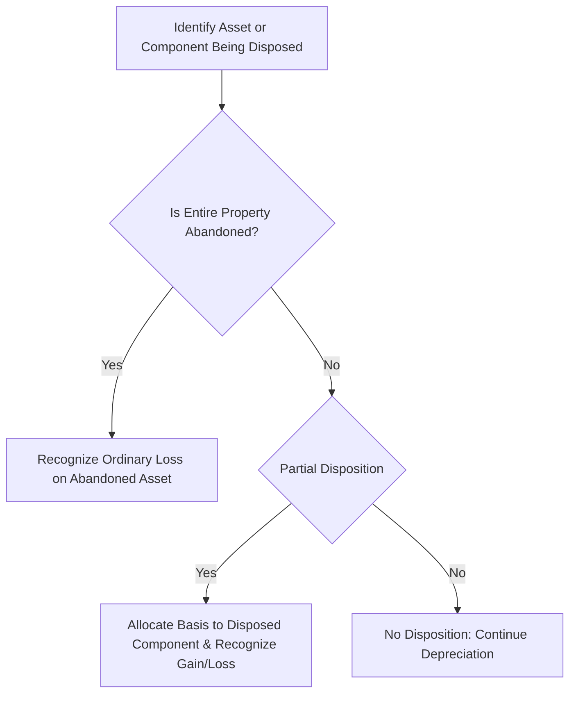

## 19.3 Abandonments & Partial Dispositions of Real Property

Real property can be complex to handle for tax purposes—especially when dealing with abandonments and partial dispositions. Practitioners must be aware of the relevant Internal Revenue Code (IRC) sections, Treasury Regulations, and IRS guidance to handle these events correctly. Improper treatment can lead to misstatements of gain or loss, missed deductions, or other tax inaccuracies. In this section, we explore the mechanics of abandonments and partial dispositions of real property, provide examples of each, and discuss the key issues frequently tested in the Uniform CPA Examination for Tax Compliance and Planning (TCP).

---
### Overview of Abandonments and Partial Dispositions

Broadly speaking, dispositions of real property include sales, exchanges, involuntary conversions, and retirements from service. Two specific types of retirements are relevant here:

1. **Abandonments**  
2. **Partial Dispositions**

Although both typically involve ceasing the use of a given asset or component, they differ in critical ways that affect the tax treatment and resulting computations of loss or gain.

---
### Abandonments
An abandonment occurs when the taxpayer permanently discards an asset from use in a trade or business or from a transaction entered into for profit, without receiving anything in return. Typically, an abandonment loss is recognized under IRC §165 if the asset or property has no remaining value. This loss is generally reported as an ordinary loss, provided that the asset is used in a trade or business (or in a transaction for profit) and has not been fully depreciated.

#### Tax Treatment of an Abandoned Asset
- **Loss Recognition**: If a taxpayer permanently stops using the property (or a component of property), and there is no salvage or recovery value, the adjusted basis of that property (or component) can often be written off as a loss.  
- **Ordinary vs. Capital**: Abandonment of business or investment property typically yields an ordinary loss unless the abandoned asset is a capital asset (e.g., investment property not used in a trade or business).  
- **No Sales Proceeds**: By definition, an abandonment involves no compensation. Once the owner surrenders the property or discontinues using it, it is removed from service without sale proceeds or trade-in value received.

#### Example: Abandonment of a Building
Imagine a taxpayer owns a small commercial building used in their trade or business. The original cost (basis) of the building is $400,000, and it has accumulated depreciation of $150,000. Thus, its adjusted basis is $250,000 ($400,000 – $150,000). Suppose the building is found to be structurally unsound, and the taxpayer decides to abandon it (board it up, leave the premises, and never plans to sell the building or receive anything in return).

• **Adjusted Basis** = $250,000  
• **Recovery/Sale Proceeds** = $0  

Under these facts, the taxpayer may recognize an abandonment loss of $250,000, which is generally deductible as an ordinary loss. If the building was not used in a trade or business, the taxpayer would need to assess the nature of the asset to determine the character of the loss (e.g., capital or ordinary).

---
### Partial Dispositions
A partial disposition differs from an abandonment in one critical aspect: you do not retire the entire asset but only a portion or component of it. Under the tangible property regulations, taxpayers can elect a partial disposition of a tangible asset—such as a building or a structural component of the building—when it has been replaced or retired.

#### When Does a Partial Disposition Occur?
A partial disposition often arises when a taxpayer replaces or retires a portion of a building. For instance, if a taxpayer replaces the roof of a building, tax law sometimes allows the taxpayer to remove the basis of the old roof as a partial disposition, enabling a potential loss deduction (if the old roof’s basis is greater than zero). The transaction effectively reduces the overall basis in the real property to reflect that a portion is no longer in service.

#### Regulatory Framework
According to Treasury Regulation §1.168(i)-8, a taxpayer may make an election to treat the retirement of a structural component of a building as a partial disposition. This rule is aimed at simplifying compliance by avoiding the requirement to continue depreciating components that are physically replaced and no longer in use.

---
### Distinguishing Abandonments from Partial Dispositions
Although there can be some overlap, typically:

• **Abandonment**: The entire building (or a separate and distinct asset) is no longer used, and the taxpayer does not receive any proceeds.  
• **Partial Disposition**: Only a portion (like a roof, HVAC system, or a structural component) is retired, replaced, or disposed of, while the rest of the asset continues in use.

Both scenarios permit the deduction of the remaining adjusted basis in the retired component or asset, subject to specific requirements for substantiation and documentation.

---
### Basis Allocation for Partial Dispositions
When part of a building (rather than the entire building) is disposed of, the taxpayer must identify the adjusted basis of the disposed component. This allocates a portion of the overall basis to the retired portion, reflecting how much of the building’s total cost is attributable to that specific component.

#### Methods to Determine the Allocable Basis
1. **Specific Identification**: Use records that delineate how much the old component cost at the time of construction or purchase, and how much depreciation has been claimed on that component.  
2. **Replacement Cost Approach**: Estimate cost of the new component and compare it to the total cost of the property to infer the cost of the replaced portion.  
3. **Pro Rata Approach**: Use a ratio of the replacement cost to the total original cost to assign an approximate basis to the retired component. Detailed regulatory guidance governs this process.

### Numeric Example of a Partial Disposition
Assume:  
• A taxpayer constructed a commercial building 10 years ago at a total cost (basis) of $800,000.  
• The roof portion was documented as costing $80,000 of the total.  
• The building has a 39-year MACRS recovery period for nonresidential real property.  
• Over the 10 years, $205,128 of depreciation has been claimed on the entire building.  
• Depreciation is not segregated by component in the taxpayer’s records.  

Now, the taxpayer replaces the roof. Under the partial disposition rules, the taxpayer can “dispose” of the old roof for tax purposes. The question is: how much of the building’s accumulated depreciation and remaining basis is allocated to the old roof?

1. **Determine the original allocated cost of the roof:** $80,000 (10% of the total $800,000).  
2. **Determine the fraction of accumulated depreciation allocated to the roof:** Since the roof’s original cost is 10% of the total, it might be appropriate to approximate 10% of the total accumulated depreciation for the building. For the entire building, total accumulated depreciation is $205,128, so 10% is $20,512.8.  

   - Roof’s adjusted basis before replacement = $80,000 (cost) – $20,513 (approx. allocated depreciation) = $59,487.  

3. **Claim a Loss or Deduction for the Partial Disposition**: If the taxpayer elects the partial disposition approach, they can remove $59,487 from the building’s basis and recognize a disposal of that amount. If the roof is truly worthless and replaced with a new one, this may result in a deductible loss of $59,487 (subject to normal rules for ordinary vs. capital loss for nonresidential real property used in a trade or business, generally an IRC §1231 loss).  

4. **Adjust the Building’s Overall Basis**: The building’s overall adjusted basis then decreases by $59,487. Also, future depreciation will be taken on the remaining portion of the building and the newly installed roof (with a new cost basis for the roof).

---
### Comparing an Abandonment vs. Partial Disposition

Below is a simple conceptual flowchart illustrating the decision-making for either abandoning a full building or disposing of only a portion:

1. **Identify the property**: Determine if you are abandoning the entire property or merely removing and replacing a component.  
2. **Check proceeds**: If there are no proceeds or reclamation value, it aligns with abandonment principles. If it is a partial replacement, see if it qualifies for partial disposition treatment under Reg. §1.168(i)-8.  
3. **Allocate basis**: If a partial disposition is warranted, find the accurate portion of the adjusted basis that belongs to the disposed component.  
4. **Recognize loss or adjust basis**: Recognize the resulting gain or (most often) a loss, and adjust the remaining basis of the property accordingly.

---
### Case Study: Abandonment vs. Partial Disposition of an Office Building
Consider an office building whose foundation has begun to crumble. An extensive engineer’s report reveals that the entire building is unsafe. The owner can either:  
1. Spend a fortune to rehabilitate the core structure, or  
2. Board up the building, declare it unsafe, and walk away—an outright abandonment.

#### Scenario A: Outright Abandonment
• **Original Cost**: $600,000  
• **Accumulated Depreciation**: $250,000 (so adjusted basis of $350,000)  
• Decision: The owner decides it is not financially viable to save the structure. The building is boarded up, and local authorities declare it condemned.  
• **Result**: The owner claims a $350,000 ordinary loss (trade or business property). No proceeds are received.

#### Scenario B: Partial Disposition of a Component
Now assume the building is structurally sound everywhere except for the entire HVAC system, which is beyond repair. The HVAC system is allocated 5% of the building’s cost based on its original records. The HVAC system is replaced entirely.  
• **Original Building Cost**: $600,000  
• **Allocated HVAC Cost**: $30,000 (i.e., 5% of total)  
• **Total Accumulated Depreciation**: $250,000, of which $12,500 is allocated to the HVAC system using the same 5% approach.  
• **HVAC Adjusted Basis**: $17,500 ($30,000 – $12,500).  
• **Action**: The HVAC system is removed and replaced.  
• **Partial Disposition Election**: The owner may recognize a $17,500 partial loss on the old HVAC removal. The remaining building basis is reduced accordingly, and the new HVAC system is capitalized as a separate asset.

---
### Practical Considerations and Best Practices
1. **Maintaining Detailed Asset Records**: Assign costs clearly to major components of real property at the time of acquisition or improvement. This makes subsequent partial dispositions simpler to document and substantiate.  
2. **Documentation**: Keep evidence of the reason for abandonment or partial disposition (e.g., pictures of the structural damage, engineering reports, or condemnation notices).  
3. **Elections and Timeliness**: A partial disposition election is typically made on a timely-filed tax return. Missing this election could forfeit the opportunity to write off the adjusted basis of a replaced component.  
4. **Recapture Concerns**: Although real property (nonresidential or residential) is not subject to the same depreciation recapture rules as Section 1245 property, the partial disposition or abandonment of certain building components might still trigger gain recapture under Section 1250 if not properly analyzed.  
5. **State and Local Considerations**: Different jurisdictions have varying rules about property taxes, condemnation, and building safety, which can inform or even complicate your tax approach.

---
### Common Pitfalls
1. **Overlooking the Partial Disposition Election**: Failing to elect a partial disposition could result in continuing to depreciate a replaced component and missing a legitimate current deduction.  
2. **Insufficient Records**: Not tracking asset components from the outset can make it difficult to accurately allocate basis on disposal.  
3. **Misclassification as Capital Loss**: If the property is a business asset, ensure you do not mistakenly treat the abandonment as a personal or capital asset loss, potentially missing out on an ordinary loss deduction.  
4. **Improper Timing**: If the building or component is not actually retired from service in the relevant tax year, the IRS may disallow the claimed loss.

---
### Strategies to Mitigate Risks
1. **Component-Based Cost Segregation**: Use cost segregation studies to break down building costs into individual components. This aids in partial disposition allocations and can create tax planning opportunities.  
2. **Periodic Asset Reviews**: Review major improvements and replacements annually and document them properly for partial disposition elections.  
3. **Consultation**: Complex partial dispositions or large abandonment losses may warrant professional advice or Private Letter Rulings if facts are ambiguous. Consulting with specialized tax professionals and verifying local building ordinances can prevent audit issues.

---
### References for Further Exploration
• Internal Revenue Code §165 (Losses)  
• Treasury Regulation §1.168(i)-8 (Rules for Partial Dispositions of MACRS Property)  
• IRS Publication 544, Sales and Other Dispositions of Assets  
• AICPA Tax Section resource library on Tangible Property Regulations

---

## Test Your Knowledge: Abandonments & Partial Dispositions Quiz



### When a taxpayer permanently ceases using a building in a trade or business with no proceeds received, what is this transaction generally called under tax rules?

- [x] An abandonment
- [ ] A partial disposition
- [ ] A Section 1031 exchange
- [ ] A constructive sale

> **Explanation:** When the owner discards a property in a trade or business, receiving no proceeds and removing it from service permanently, the loss is generally treated as an abandonment.

### Which of the following statements is TRUE regarding partial dispositions of real property?

- [x] A taxpayer may write off the adjusted basis of a replaced building component if properly documented.
- [ ] No loss deductions are allowed unless the entire building is abandoned.
- [ ] Partial dispositions are typically prohibited by the IRC.
- [ ] A partial disposition must always result in a capital loss.

> **Explanation:** Under Treasury Regulation §1.168(i)-8, taxpayers can generally elect to dispose of a portion of an asset, remove its allocated basis from the property, and recognize any resulting gain or loss.

### Suppose a taxpayer replaces the roof on a warehouse. They originally allocated $50,000 to the roof at acquisition. They have taken $15,000 in depreciation related to the roof portion. Which of the following is the correct treatment if the roof is disposed of in a partial disposition and has no salvage value?

- [x] The taxpayer can recognize a $35,000 loss.
- [ ] No loss can be recognized because the main building is still in use.
- [ ] The entire building’s basis must be recovered at once.
- [ ] The taxpayer cannot make a partial disposition election on a structural component.

> **Explanation:** The adjusted basis of the roof is $35,000 ($50,000 – $15,000). If the roof is scrapped and replaced under a partial disposition election, the taxpayer can write off that remaining $35,000 as a loss.

### In which scenario would an abandonment of real property most likely result in an ordinary loss?

- [x] The taxpayer used the building in a trade or business.
- [ ] The taxpayer occasionally visited the building for personal vacations.
- [ ] The property was a collectibles item used solely for personal enjoyment.
- [ ] The property was given to a family member in an arms-length sale.

> **Explanation:** Business or investment property usually generates ordinary or Section 1231 loss, whereas purely personal-use property might yield a capital or nondeductible personal loss.

### A taxpayer fails to elect a partial disposition for a replaced HVAC system in a rental building. Which outcome is most likely?

- [x] The old HVAC’s cost remains in the building’s depreciable basis, and the taxpayer continues to depreciate it.
- [ ] The old HVAC’s adjusted basis is automatically written off.
- [x] A separate election is assumed to have been made by default.
- [ ] No future depreciation is allowed on the entire building.

> **Explanation:** Without a timely partial disposition election, the taxpayer must continue to depreciate both the retired HVAC and the new replacement system. The old system’s basis remains in the building’s overall cost, while the new system starts a new depreciation schedule.

### Which of the following is a correct statement about allocating basis in a partial disposition?

- [x] A taxpayer can use the replacement cost of the new component to estimate the disposed component’s basis.
- [ ] The law strictly requires a professional cost segregation study in all circumstances.
- [ ] Basis allocation is only permissible if the taxpayer sells the disposed component to an unrelated party.
- [ ] All partial dispositions must allocate basis proportionally to the building’s fair market value.

> **Explanation:** The regulations permit using the replacement cost of the new component and comparing it to total cost as one reasonable method of allocating basis to the retired portion.

### Why do cost segregation studies assist in partial dispositions?

- [x] They itemize and assign costs to building components, making basis allocation straightforward.
- [ ] They decrease the probability of audit automatically.
- [x] They retroactively allow partial dispositions even if the taxpayer misses the filing deadline.
- [ ] They eliminate the need to track accumulated depreciation.

> **Explanation:** A cost segregation study breaks down the costs of building components, reducing guesswork and simplifying basis allocation when a specific component is replaced or abandoned.

### Which code section primarily addresses the deduction for abandonment losses?

- [x] IRC §165
- [ ] IRC §351
- [ ] IRC §180
- [ ] IRC §1033

> **Explanation:** IRC §165 provides general rules for deductions of losses, including those arising from abandonment or worthlessness.

### What is the main risk if a taxpayer cannot support the allocated basis of a replaced building component?

- [x] The IRS may deny or reduce the claimed loss on partial disposition.
- [ ] The property must then be sold to validate any basis.
- [ ] The partial disposition automatically qualifies as a nontaxable exchange.
- [ ] The abandoned portion is treated as a personal use asset.

> **Explanation:** Without sufficient documentation supporting how much of the basis belongs to the disposed component, the IRS can disallow or reduce the loss.

### A building has an original basis of $900,000. Accumulated depreciation to date is $300,000. The building is fully abandoned and has zero salvage value. Is the resulting loss deductible for business use?

- [x] True
- [ ] False

> **Explanation:** The adjusted basis is $600,000 ($900,000 – $300,000). For business property, an abandonment typically allows the taxpayer to claim an ordinary or §1231 loss if no salvage or proceeds are received.



---

## For Additional Practice and Deeper Preparation

**[TCP CPA Hardest Mock Exams: In-Depth & Clear Explanations](https://www.udemy.com/course/tcp-cpa-mock-exams/?referralCode=675149871D0E79B1699C)**  

**Tax Compliance & Planning (TCP) CPA Mocks:** 6 Full (1,500 Qs), Harder Than Real! In-Depth & Clear. Crush With Confidence! 

- Tackle full-length mock exams designed to mirror real TCP questions.  
- Refine your exam-day strategies with detailed, step-by-step solutions for every scenario.  
- Explore in-depth rationales that reinforce higher-level concepts, giving you an edge on test day.  
- Boost confidence and minimize anxiety by mastering every corner of the TCP blueprint.  
- Perfect for those seeking exceptionally hard mocks and real-world readiness.  

_Disclaimer: This course is not endorsed by or affiliated with the AICPA, NASBA, or any official CPA Examination authority. All content is for educational and preparatory purposes only._
