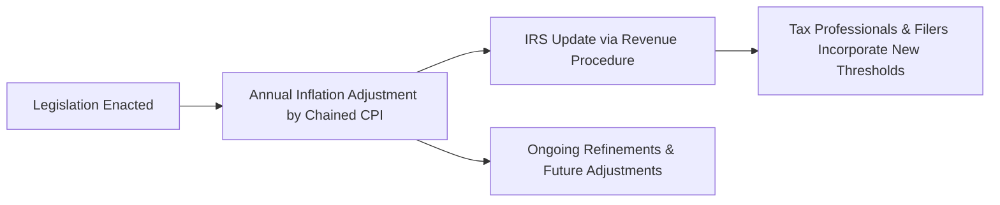

## 20.1 Temporary Rate Changes, Inflation Adjustments & Phaseouts

Temporary rate changes, inflation adjustments, and phaseouts are frequent legislative tools used by Congress to manage tax revenue, incentivize (or discourage) certain behaviors, and address budgetary constraints. For aspiring CPAs preparing for the Tax Compliance and Planning (TCP) portion of the Uniform CPA Examination, understanding the nuances of these provisions is essential. Not only do they impact individual taxpayers, but they also influence the planning strategies of businesses, trusts, and estates. Additionally, many of these changes come with sunset provisions—expiration or reversion to previous law—that significantly affect how CPAs advise clients as major deadlines approach.

This section addresses:
• Why temporary rate changes are enacted and how they are structured  
• The mechanics behind inflation adjustments and the role of indices such as the Chained CPI  
• Phaseout thresholds and their impact on deductions, exemptions, and credits  
• Practical examples, including side-by-side comparisons of thresholds before and after legislative changes  
• Anticipated sunset points and how they could shape future planning  

By the end of this chapter, you should have a comprehensive understanding of how temporary rate changes, inflation adjustments, and phaseouts work in tandem, and how best to plan for their potential expiration.

---

### The Rationale Behind Temporary Tax Rate Changes

Congress often enacts temporary tax rate changes to meet specific fiscal or economic policy goals—stimulating the economy, supporting families, encouraging business investments, or addressing budget shortfalls. These changes may lower rates, remove certain deductions or credits, or provide targeted benefits for specific groups.

Temporary rate changes also allow legislators to:
• Experiment with policy outcomes in a set timeframe  
• Reflect short-term emergency conditions (as seen with disaster deductions or short-term stimulus)  
• Manage budget-score windows to comply with legislative rules, such as pay-as-you-go (PAYGO) or other constraints  

When you see a temporary rate modification, it often includes language specifying an expiration date or “sunset” date, after which the tax law reverts to its prior rules unless Congress extends or modifies the provision. As a CPA candidate, it is crucial to track these “sunset” events because they can dramatically alter tax planning strategies.

---

### Inflation Adjustments: How They Work

To prevent bracket creep—where taxpayers are pushed into higher tax brackets solely because of inflation—Congress has mandated annual inflation adjustments for many tax provisions. These adjustments apply to a wide array of items, including (but not limited to):
• Income tax bracket thresholds  
• Standard deduction amounts  
• Annual gift tax exclusion  
• Estate tax unified credit  
• Contribution limits for qualified retirement plans (discussed in Chapter 7: Personal Financial Planning)  
• Phaseout thresholds for credits and deductions  

Most of these adjustments are determined via the Chained Consumer Price Index (Chained CPI), which typically grows more slowly than the traditional CPI measure. Once inflation adjustments are calculated, the IRS publishes them in an annual Revenue Procedure. CPAs, taxpayers, and software providers then integrate these new inflation-adjusted amounts to ensure accurate filing and reliable tax estimates.



**Key Takeaway:** Remember to use the most up-to-date Revenue Procedure and IRS Publications, as these updates are released each year, typically in the fall, for the upcoming tax season.

---

### Understanding Phaseouts

Phaseouts gradually reduce or eliminate certain deductions, credits, or other tax benefits once a taxpayer’s income surpasses a specified threshold. These thresholds are often adjusted for inflation. Some common phaseouts include:

• IRA deduction phaseouts based on modified AGI and pension coverage  
• Education credits (American Opportunity Credit and Lifetime Learning Credit)  
• Child Tax Credit (and additional child credit, which underwent changes enacted by various legislative acts including the 2017 Tax Cuts and Jobs Act and subsequent legislation)  
• Exemptions or deductions for high-income taxpayers (though suspended by recent legislation in certain cases)  

Phaseouts are designed to target tax benefits to taxpayers at certain income levels. For exam preparation, know the conceptual framework:
• Phaseout Range: The income band within which the credit, deduction, or benefit gradually diminishes.  
• Complete Disallowance: Beyond the upper limit of the phaseout range, no benefit remains.  

Understanding phaseouts is crucial for advising clients accurately on whether the next dollar of income might eliminate or reduce an otherwise available tax benefit. In practice, you must look at a taxpayer’s Adjusted Gross Income (AGI) or Modified AGI to determine where they stand in the phaseout range.

---

### Notable “Sunset” Provisions

Sunset provisions set a hard termination or reversion date for specific tax laws—often triggered by budget rules. A prominent example is the individual rates from the 2017 Tax Cuts and Jobs Act (TCJA) scheduled to revert at the end of 2025, unless extended or changed by Congress.

Some key items with impending sunset provisions (as of many legislative acts) include:
• Lowered individual tax brackets introduced in 2018, scheduled to expire and revert to pre-2018 levels.  
• Increased standard deduction replaced the personal exemption. If allowed to sunset, older deductions and personal exemption structures may resurface.  
• Increased and expanded Child Tax Credit set to return to earlier amounts.  
• Almost all of the individual taxpayer provisions from TCJA face a sunset at the end of 2025 unless Congress intervenes.  

CPAs must be adept at monitoring these timelines, preparing alternative scenarios, and counseling clients on strategies if rates and thresholds revert or if new legislation extends the provisions.

---

### Side-by-Side Comparisons of Prior vs. Updated Thresholds

Often, seeing the differences in thresholds before and after specific legislative changes clarifies their impact. Below is a conceptualized example illustrating how thresholds may change due to inflation adjustments or temporary legislative policies. The exact amounts require verification annually via the latest IRS guidance.

| Provision                      | Prior Threshold                  | Updated/Current Threshold              | Scheduled Sunset/Expiry           |
|--------------------------------|---------------------------------|----------------------------------------|-----------------------------------|
| Standard Deduction (Single)    | $6,500 (pre-2018)               | $13,850 (e.g., 2023 figure, inflation) | Reverts to pre-2018 structure after 2025 |
| Estate Tax Unified Credit      | $5.49M (pre-2018)               | $12.92M (approx. 2023 figure)          | Reverts to ~ $5 million (indexed) post-2025 |
| Gift Tax Annual Exclusion      | $14,000 (pre-2018)              | $17,000 (2023)                         | Adjusted annually for inflation   |
| Child Tax Credit Phaseout      | Begins at $110,000 MFJ          | Begins at $400,000 MFJ (TCJA)          | Reverts to old thresholds if not extended after 2025 |

_These figures are illustrative. Always consult current IRS publications and official legislative updates._

**Practical Implication:** A single filer claiming the standard deduction stands to lose a few thousand dollars in deductions if the temporary standard deduction expansion expires. Similarly, large estates might face significantly higher estate taxes once the unified credit reverts to pre-2018 levels. This drastically changes planning considerations from 2026 onward.

---

### Planning Implications and Best Practices

1. **Stay Current with Legislation:** Because multiple tax acts (e.g., the TCJA, CARES Act, Secure Act, and others) altered thresholds differently, CPAs need to consult the most recent legislative updates and IRS guidance. A prior threshold might have changed for the new year.

2. **Monitor Prospective Sunsets:** As the expiration date nears, tax strategies must be regularly updated. For example, clients may prefer to accelerate income or deductions before rates change. In the context of estate tax, high-net-worth individuals might execute substantial gifting before the unified credit reverts to a lower level. For more on this strategy, see Chapter 6: Transfers During Life–Gift Taxation & Strategy.

3. **Illustrate Multiple Scenarios:** When providing advice, show the best and worst-case scenarios if the tax law changes or remains the same. This helps clients make informed decisions and addresses some of the uncertainty inherent in temporary or phase-out-based provisions.

4. **Utilize Safe Harbors and Credits While Available:** Credits and deductions with phased-out thresholds and sunset dates are prime opportunities to optimize. For instance, if the Alternative Minimum Tax (AMT) exemption levels revert to lower thresholds, certain clients might face higher AMT liability after a sunset date. 

5. **Beware of Hidden Phaseouts:** Some phaseouts might not be widely publicized in media coverage, yet they can majorly impact a tax return or business decision. Systematic cross-referencing across official IRS publications remains vital.

---

### Common Pitfalls

- **Misapplying Expired Provisions:** A frequent error is using old thresholds or believing the law remains in effect after expiration. Always verify an act’s “effective date” and “sunset date.”  
- **Failing to Adjust Withholding/Estimates:** Phaseouts and inflation adjustments change the effective marginal tax rate. If withheld amounts or estimated payments are based on outdated thresholds, clients might face unexpected underpayment penalties.  
- **Overlooking Combined Effects:** One threshold may phase out an itemized deduction, while a separate threshold may reduce a credit. Combined, they can produce a larger-than-expected tax liability.  
- **Assuming Phaseouts Are Always Inflation-Indexed:** While many are indexed, not all phaseouts or rate bracket shifts are. Some remain fixed in nominal terms until further legislative action.

---

### Real-World Example

Consider Aaron and Lisa, married filing jointly with two children. In 2022, their Modified AGI is $395,000, which keeps their entire Child Tax Credit intact under the “updated law.” By 2026 (assuming no extensions), if the Child Tax Credit thresholds revert to $110,000 for phaseouts, Aaron and Lisa would lose nearly all Child Tax Credit unless their income drops drastically or Congress enacts a new law. If they anticipate that reversion, they might consider adjusting their cash flow to take advantage of the Child Tax Credit while it is still fully available, or at least plan for a different post-2025 approach to personal finance and investment.

This kind of forward-thinking approach is critical for a CPA, who must incorporate these considerations into comprehensive tax planning and budgeting.

---

### Visual Overview of Key Relationships

Below is a simplified diagram illustrating how temporary rate changes and phaseouts connect with inflation indexing and potential sunsets:

```mermaid
flowchart TB
    X((Year 1 \n Legislation)) --> A1[Temporary Rate Change \n (Tax Rates, Credits)]
    A1 --> A2[Higher Standard Deduction \n or Credit]
    A2 --> A3[Phaseout Applies? \n Based on AGI/Income]
    A3 --> B{Annual \n Inflation Indexing}
    B --> C((Year 2 Legislation \n or Automatic Expiry))
    C --> D[Sunset: Reversion \n or Extension?]
```

1. A new legislation triggers temporary rate changes or expansions to credits.  
2. Taxpayers use new rules but must check for income-based phaseouts.  
3. Annual inflation indexing modifies thresholds.  
4. Eventually, the provision may sunset or be extended in subsequent legislative sessions.

---

### Strategies for the CPA Exam

In this TCP exam area, you can expect multiple-choice questions that test your ability to read and apply current thresholds (properly inflation-adjusted), identify phaseout ranges, and address hypothetical scenarios involving soon-to-expire provisions. Some tips:

- **Memorize Broad Ranges:** You do not need to memorize every exact threshold, but you must clearly demonstrate you know how to look them up and apply the correct version for the given tax year.  
- **Apply Phaseout Formulas:** The exam may include a scenario walking you through partial phaseouts. Practice rapid but accurate calculations.  
- **Stay Updated on Key Sunset Dates:** Expect hypothetical questions: “What if a law reverts next year?” or “Which scenario yields the lowest overall tax under sunset conditions?”  

Chapters 4, 5, and 7 of this text, among others, provide deeper dives into how thresholds and phaseouts affect deductions, credits, and retirement planning. The synergy of these topics is often tested integratively on the exam.

---

### Additional References

- **IRS Publication 17**: Provides comprehensive annual updates for individual taxpayers, including inflation-adjusted amounts and references to relevant credits.  
- **Annual Revenue Procedures**: Each fall, the IRS typically releases a detailed listing of updated thresholds for the upcoming tax year.  
- **Legislative Summaries**: For specifics on TCJA, CARES Act, and any subsequent legislation, consult official Congressional Research Service (CRS) summaries or the “General Explanation” documents.  
- **Private CPA Review Courses**: Many courses focus on the ephemeral nature of these rules, offering practice questions and guidance on how to handle unknown future legislative outcomes.

---

Temporary rate changes, inflation adjustments, and phaseouts underlie much of the complexity in U.S. tax law. Staying abreast of the details—especially the scheduled “sunset” points—enables CPAs to optimize tax outcomes for clients and ensures compliance with both the letter and spirit of the law. As temporary provisions shift and revert, strategic planning and consistent monitoring of legislative updates become indispensable for success in both the CPA exam and professional practice.

---

## Test Your Knowledge: Temporary Rate Changes & Phaseouts Mastery Quiz



### Which of the following best describes the term “sunset provision” in the context of tax legislation?

- [ ] A legislative change that automatically expands after a given date.  
- [x] A provision within a tax law that expires or reverts to previous rules on a specified date.  
- [ ] A requirement that all relevant IRS forms be filed online.  
- [ ] A condition that triggers the immediate repeal of the law once a specified revenue target is reached.  

> **Explanation:** Sunset provisions are clauses setting a predetermined expiry date for certain tax law changes. After this date, the law reverts to its pre-change state unless new legislation extends or modifies it.

### Which index is commonly used to determine annual inflation adjustments for various tax brackets and thresholds?

- [ ] Producer Price Index (PPI)  
- [ ] Gross Domestic Product Deflator (GDP Deflator)  
- [x] Chained Consumer Price Index (Chained CPI)  
- [ ] Employment Cost Index (ECI)  

> **Explanation:** Since 2018, the Chained CPI has been the standard measure for determining most annual inflation adjustments in tax provisions.

### Phaseout thresholds typically apply to which of the following?

- [x] Specific credits and deductions once a taxpayer’s income exceeds a certain level.  
- [ ] All corporate tax rates regardless of income.  
- [ ] Unlimited charitable contribution deductions for taxpayers of any income.  
- [ ] The standard deduction only.  

> **Explanation:** Phaseouts gradually reduce certain tax benefits (credits, deductions, and exemptions) as income rises, ensuring these benefits target specified income brackets.

### If a provision in the tax code is set to sunset in five years, which of the following is a recommended best practice?

- [x] Plan for multiple scenarios, one assuming reversion to previous law and one assuming an extension.  
- [ ] Ignore the provision until one year before expiry.  
- [ ] Assume Congress will always extend the provision.  
- [ ] Instruct clients to handle taxes the same way indefinitely.  

> **Explanation:** Because Congress may or may not extend the provision, planning should include both scenarios to avoid surprises.

### Which of the following statements about “temporary tax rate changes” is correct?

- [x] They are often enacted to achieve a specific policy goal within a limited timeframe.  
- [ ] They apply worldwide and have no expiration date.  
- [ ] They always provide uniform benefits to all taxpayers.  
- [ ] They never contain phaseout thresholds.  

> **Explanation:** Temporary tax rate changes frequently serve specific policy or economic goals for a defined period and commonly contain sunset clauses or phaseouts.

### What is a frequent pitfall related to phaseout thresholds?

- [x] Taxpayers and preparers using outdated thresholds, leading to calculation errors.  
- [ ] Utilizing an automatic two-year lookback period.  
- [ ] Treating phaseouts as fully refundable in all circumstances.  
- [ ] Believing phaseouts are optional.  

> **Explanation:** Since thresholds can change yearly due to inflation or legislative amendments, using last year’s figures can cause miscalculations and missed planning opportunities.

### Which of the following best summarizes the impact of inflation adjustments on high-income taxpayers?

- [x] They may help prevent artificially pushing taxpayers into higher brackets solely due to inflation.  
- [ ] They only apply to taxpayers below the federal poverty level.  
- [ ] They permanently eliminate AMT liability.  
- [ ] They negate the need for estimated payments entirely.  

> **Explanation:** Annual inflation adjustments protect taxpayers from bracket creep, especially relevant for higher earners, although they do not eliminate liability or planning requirements.

### How does a phaseout typically work, if a taxpayer’s income is in the phaseout range?

- [x] The benefit is gradually reduced or eliminated as income increases within that range.  
- [ ] The benefit is wholly disallowed regardless of the exact income.  
- [ ] The benefit doubles if the taxpayer is at the midpoint.  
- [ ] The phaseout is independent of current tax rates.  

> **Explanation:** Phaseouts systematically reduce the tax benefit as the taxpayer’s income rises, eventually phasing it out entirely once the upper threshold is crossed.

### What is the practical effect of a “scheduled reversion” for a temporarily increased standard deduction?

- [x] Taxpayers will lose the higher deduction amount once the provision expires if no extension is passed.  
- [ ] The deduction automatically increases further after the original end date.  
- [ ] There is no practical effect until the next election year.  
- [ ] Only business entities are impacted by the reversion.  

> **Explanation:** Upon reversion, the law defaults to its previous state—here, the standard deduction decreases to its prior baseline if not extended by new legislation.

### Temporary rate changes, inflation adjustments, and phaseouts are least likely to impact taxpayers who:

- [x] Have zero taxable income in all relevant years.  
- [ ] Are subject to the AMT in every tax year.  
- [ ] Own multiple businesses across state lines.  
- [ ] Have significant pass-through income approaching a phaseout threshold.  

> **Explanation:** Taxpayers with no taxable income virtually face no direct impact from rate changes or phaseouts, as there is no tax liability to reduce or rules to phase out.



---

## For Additional Practice and Deeper Preparation

**[TCP CPA Hardest Mock Exams: In-Depth & Clear Explanations](https://www.udemy.com/course/tcp-cpa-mock-exams/?referralCode=675149871D0E79B1699C)**  

**Tax Compliance & Planning (TCP) CPA Mocks:** 6 Full (1,500 Qs), Harder Than Real! In-Depth & Clear. Crush With Confidence!  

- Tackle full-length mock exams designed to mirror real TCP questions.  
- Refine your exam-day strategies with detailed, step-by-step solutions for every scenario.  
- Explore in-depth rationales that reinforce higher-level concepts, giving you an edge on test day.  
- Boost confidence and minimize anxiety by mastering every corner of the TCP blueprint.  
- Perfect for those seeking exceptionally hard mocks and real-world readiness.  

_Disclaimer: This course is not endorsed by or affiliated with the AICPA, NASBA, or any official CPA Examination authority. All content is for educational and preparatory purposes only._
