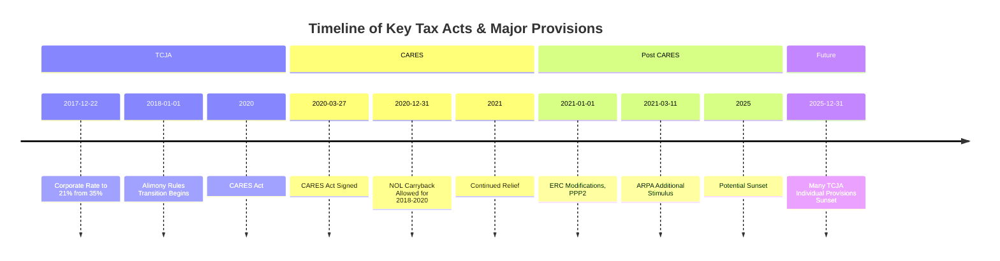

## 20.2 Major Acts (e.g., CARES Act, TCJA) & Rolling Modifications

Legislation is the foundation of the U.S. tax system. Large-scale tax acts not only alter immediate taxpayer obligations but also set norms for years to come. For CPA candidates, understanding the evolution of recent major acts is crucial. This section focuses on two of the most influential broad-scope tax bills in recent history—the Tax Cuts and Jobs Act (TCJA) and the Coronavirus Aid, Relief, and Economic Security (CARES) Act—along with an overview of how legislative “rolling modifications” and other interim legislative changes shape modern tax compliance.

This discussion dovetails with earlier chapters on how federal tax laws are enacted (see Chapter 2 on Legislative Changes) and the effect those changes have on various taxpayer groups (Part II on Individual Taxation and Part III on Entities). We also touch upon transitional rules that allow taxpayers to move from older frameworks to new structures, highlighting key amendments that may arise in CPA exam scenarios.

## Importance of Legislative Updates in Tax Compliance

Major legislative changes can significantly affect almost all forms of taxes—federal income taxes, state and local taxes, estate and gift taxes, and corporate taxes. For instance, a single act could set new marginal rates for individuals, while simultaneously revising Corporate Alternative Minimum Tax (AMT) rules. These actions ripple through taxation of individuals (e.g., adjusting itemized deductions or personal exemptions) and business entities (e.g., corporate tax rate changes, pass-through deductions) alike. 

Rolling modifications—periodic or one-time legislative adjustments in response to economic and societal factors—further complicate this picture by continuously redefining scheduling, thresholds, and sometimes even the underlying eligibility for credits and deductions. CPA candidates must be able to map new laws onto existing structures rapidly and accurately while being aware of transitional measures.

## The Tax Cuts and Jobs Act (TCJA)

Enacted in late 2017, the TCJA brought the most sweeping changes to the U.S. tax code in decades. While it retained the overall structure of the Internal Revenue Code, the Act introduced several transformative provisions:

• Reduced Corporate Tax Rate: The corporate income tax rate was lowered from a progressive scale topping at 35% to a flat 21% rate.  
• Pass-Through Deduction (§199A): Qualified business income (QBI) deductions became available to certain pass-through entities, subject to wage and capital limitations.  
• Bonus Depreciation & Expensing: Temporary 100% bonus depreciation for qualified property placed in service after September 27, 2017, phasing out over time.  
• Repeal of Personal Exemptions: Personal exemptions were set to $0, shifting more weight onto standard and itemized deductions.  
• Expanded Standard Deduction: Nearly doubled for individuals and married filers.  
• SALT Deduction Cap: Limited state and local tax (SALT) deductions to $10,000 per year for single and married filing jointly filers (with $5,000 for separate filers).  
• Estate and Gift Tax Exemption Increase: Roughly doubled the unified credit amounts for federal estate and gift taxes, subject to inflationary adjustments.

Many TCJA provisions carry “sunset” dates that revert the law to pre-Act provisions if Congress takes no action by the end of 2025 (for many individual provisions). From the CPA exam standpoint, it is critical to remember how these provisions have transitional rules and phasing sequences, requiring a thorough understanding of which provisions are permanent vs. which may revert or require congressional renewal.

### Transitional Rules under TCJA

TCJA provided transitional rules for net operating losses (NOLs), alimony treatment, and other items that changed from pre-2018 law:

• Alimony: As detailed in Chapter 3, for divorces finalized after December 31, 2018, the payor can no longer deduct alimony, and the payee no longer includes it in gross income. Divorces prior to that date fall under pre-TCJA rules unless expressly modified.  
• NOL Carryforwards: For NOLs generated after December 31, 2017, the carryback was largely eliminated (though subject to subsequent changes from the CARES Act), and the deduction was limited to 80% of taxable income.  
• §179 Expensing: Limits and thresholds were raised, but defined property classes changed, requiring businesses to comply with new asset definitions.

These transitional rules underscore how legislative updates often do not apply uniformly to every taxpayer at once. That said, they remain fair game for exam questions designed to test a candidate’s ability to apply both old and new rules correctly.

## The CARES Act: Pandemic Relief and Ongoing Effects

Signed into law in March 2020, the CARES Act was a swift legislative response to the sudden economic downturn triggered by the COVID-19 pandemic. Although primarily focused on economic relief, it contained a host of tax provisions.

### Key Provisions for Individuals

• Recovery Rebates (“Stimulus Checks”): Provided direct payments to individuals subject to AGI thresholds, factoring in 2018 or 2019 tax returns.  
• Expanded Unemployment Benefits: Added federal benefits on top of state-provided unemployment, altering the tax treatment for those benefits and occasionally triggering underwithholding issues.  
• COVID-Related Retirement Distributions: Individuals under 59½ could withdraw up to $100,000 without early distribution penalty, provided it was related to COVID-19. Income from the withdrawal could be spread over three years and recontributed without penalty.  

### Key Provisions for Businesses

• Paycheck Protection Program (PPP): Low-interest loans for small businesses, potentially forgivable if the funds were used for payroll and certain qualified costs. Subsequent legislation and IRS rulings clarified the tax treatments of PPP loan forgiveness (generally not taxable income) and the deductibility of underlying expenses (ultimately deductible).  
• Relaxation of NOL Rules: Temporarily suspended the 80% limitation for NOLs arising in 2018–2020, allowing a five-year carryback. Exam questions often explore how NOLs created in one tax year can now be carried back to offset previous years’ income, generating immediate refunds.  
• Employee Retention Credit (ERC): Encouraged businesses to keep workers on the payroll by creating a refundable tax credit against employment taxes. Over time, subsequent Acts modified ERC eligibility and amounts.

### Rolling Modifications Post-CARES

Subsequent legislation—such as the Consolidated Appropriations Act (CAA) of 2021 and the American Rescue Plan Act (ARPA)—build upon or modify the CARES Act. Because these provisions have changed fast, candidates should track how new laws affect:

• Extended relief or expansions to the ERC.  
• Refinements in the forgiven PPP loan expense deductions.  
• Additional stimulus payments or changes in AGI thresholds for assorted refundable credits.  
• The partial revert of NOL provisions from the CARES Act window.

Although the CARES Act was considered emergency legislation, its effects linger. CPA exam takers should be alert to transitions back to post-TCJA norms, especially regarding NOL limitations and small business credits.

## Other Notable Legislation and Rolling Modifications

While TCJA and the CARES Act stand out for their magnitude, other acts—like the Families First Coronavirus Response Act (FFCRA), the American Rescue Plan Act (ARPA), and the Inflation Reduction Act—deliver pivotal modifications for specific tax credits, filing deadlines, or rate changes. In certain years, “extender acts” are passed to prolong or revive tax provisions that have technically expired. Staying abreast of these rolling changes is vital for CPA exam success.

### Example of Rolling Modification

A prime example is “bonus depreciation.” TCJA initially set 100% bonus depreciation for new property placed in service after September 27, 2017, and before 2023, with a phase-down period. However, subsequent acts can revise these phaseouts. CPA exam candidates should be comfortable with looking at property placed in service in transitional years.

## Diagram: Timeline of Major Acts and Key Dates

Below is a Mermaid diagram illustrating the major legislative acts and how some provisions phase in or out:

In exam scenarios, you might be asked to determine the correct application of rules and rates based on which year or date a transaction occurred. The timeline organizes major events that candidates should keep in mind.

## Transitional Rules from Older Legislation 

Certain tax code sections have been carried over from earlier acts with modifications layered on top. For example:

• Section 179 Over Time: Over the past 10–15 years, Section 179 expensing limits and qualifying property definitions have expanded. TCJA raised the immediate expensing threshold to $1 million, indexed for inflation.  
• Estate Tax Exemption “Sunset”: If Congress does not extend the current elevated exemption levels (roughly $12 million+) beyond the end of 2025, the exemption reverts to pre-TCJA levels (around $5 million). Practitioners must consider estate planning strategies to optimize usage before a potential reversion.  
• Alternative Minimum Tax (AMT): Corporate AMT was repealed under TCJA. Individuals still have AMT, but its exemption amounts were adjusted. If no further changes occur, the prior law might come back in modified form.

## Case Studies to Illustrate Transition

Consider a manufacturing company that has historically used accelerated depreciation but has never had a net operating loss. In 2020, the pandemic caused losses, triggering the possibility of a CARES Act carryback. Additionally, the company placed a large new machine in service in late 2019, benefitting from 100% bonus depreciation under TCJA. The 2019 tax savings through bonus depreciation plus the newly generated 2020 NOL that can now be carried back five years can yield immediate cash refunds. A potential exam question could ask the candidate to calculate the NOL carryback to a high-income year, applying the CARES Act modifications accurately.

Another example: An individual divorcing in 2022 must remember that any alimony payments are not deductible by the payor or includible by the payee if the divorce instrument is executed in 2022 (post-TCJA). However, if that same individual had a prior divorce finalized in 2017, but modifies their decree in 2022, they could elect into the new rules—making it a transitional scenario requiring specific awareness of compliance elections and disclaimers.

## Best Practices and Common Pitfalls

• Always Check Effective Dates: Laws typically specify start dates (e.g., after a certain date) and sunset dates or partial effective dates.  
• Watch for Phase-Ins and Phase-Outs: The QBI deduction (TCJA) and certain CARES Act credits have complicated thresholds that ramp up or down each year.  
• Mind the Sunset: Many individual provisions from the TCJA expire after 2025 unless renewed. Given congressional unpredictability, continuous monitoring is essential.  
• Confirm Guidance: The IRS often issues clarifying regulations or procedures that can supersede preliminary interpretations of new laws (e.g., PPP expense deductibility).  

## Practical Tips for CPA Exam Preparation

1. Memorize Key Rates and Thresholds: For instance, the corporate rate is set at 21% after TCJA. Know the standard deduction amounts, SALT caps, estate tax exemptions, etc.  
2. Link Past to Present: Be ready for exam scenarios that reference 2016–2017 transactions (pre-TCJA) or 2018–2020 transactions for CARES Act rules.  
3. Simulate Real-World Calculation: Don’t be surprised by multi-year calculations involving different rules.  
4. Pay Attention to Circular 230 and Ethics: Legislative changes often carry specific instructions for tax professionals. For instance, the CARES Act included guidance on claiming credits like ERC, so professional due diligence is essential (see Chapter 21 on Practice & Procedure).  

## Tables of Provisions

A quick summary of some major changes is shown below:

| Provision             | TCJA (Effective 2018)              | CARES Act (Effective 2020)              | Rolling Updates                           |
|-----------------------|-------------------------------------|------------------------------------------|-------------------------------------------|
| Corporate Tax Rate    | 21% flat rate                       | No change                                | Potential future changes                  |
| NOL Rules             | No carryback, 80% of taxable income | Allowed 5-year carryback for 2018–2020   | Potential reversion to 80% limit          |
| Pass-Through Deduction| Up to 20% of QBI (§199A)            | No direct change                         | Clarifications in subsequent guidance     |
| Individual Tax Rates  | Lower brackets, but sunset post-2025| No broad rate changes                    | Potential rate adjustments or extensions  |
| Alimony (new divorces)| Not deductible / not includible     | No change                                | Pre-2019 divorces follow old rules        |
| Bonus Depreciation    | 100% phased out after 2022–2026     | No direct change                         | Continuing phaseout modifications debated |

Staying current on each line item can help you avoid missing key transitional facets in the exam scenario.

## Additional Real-World Considerations

• State Conformity: States often adopt federal tax code changes automatically or selectively. Some states refused to conform to certain TCJA or CARES Act changes, leading to separate state tracking of NOLs, depreciation, or interest deduction limitations.  
• Potential for Retroactive Legislation: Sometimes, year-end legislation extends or modifies provisions retroactively, forcing recomputation of prior returns or the filing of amended returns.  
• Cross-Border Adjustments: For multinational entities, changes under GILTI, FDII, or BEAT introduced by TCJA have also undergone modifications in subsequent legislation and IRS regulations.  

## Looking Ahead

With certain TCJA provisions set to expire on December 31, 2025, there is already speculation about whether Congress will make them permanent, amend them, or allow them to sunset. The CARES Act created a labyrinth of short-term grants and credits, some of which have already lapsed or been overhauled by subsequent bills. Rolling modifications remain the norm rather than the exception, and this fluid landscape underscores how critical it is for card-carrying CPAs to stay nimble.

In your CPA exam preparation, focus on the interplay between these acts, especially transitional periods, phase-ins, and phase-outs. Mastering these technicalities—alongside their real-world applications—equips you to excel not only on the exam but also in professional tax advisory roles.

---

## SEO-Optimized Quiz on Major Acts and Rolling Modifications



### Which of the following statements correctly characterizes a key impact of the TCJA on corporate taxation?

- [ ] It introduced a graduated tax rate system for corporations, starting at 25%.
- [x] It reduced the corporate tax rate from a maximum of 35% to a flat 21%.
- [ ] It allowed all corporate income to be exempt from federal tax for the first $1 million of revenue.
- [ ] It transitioned corporations from federal to state-level tax compliance only.

> **Explanation:** The TCJA reduced the top corporate rate of 35% to a flat 21% rate starting in 2018, one of its most significant changes.

### Under the TCJA, how are personal exemptions and standard deductions treated for individual taxpayers?

- [x] Personal exemptions were reduced to $0, while the standard deduction was nearly doubled.
- [ ] Personal exemptions were increased by 50%, while the standard deduction was eliminated.
- [ ] Personal exemptions remained unchanged, and the standard deduction decreased by 10%.
- [ ] The TCJA does not address personal exemptions or standard deductions.

> **Explanation:** One hallmark of the TCJA is the elimination of personal exemptions (set to $0) and the near doubling of the standard deduction.

### Which of the following was a central tax change introduced by the CARES Act to assist businesses?

- [ ] Permanent removal of the corporate income tax rate.
- [ ] Elimination of all payroll tax obligations for 2020.
- [ ] Introduction of a new individual tax bracket at 39.6%.
- [x] Temporary reintroduction of the NOL carryback for tax years 2018–2020.

> **Explanation:** The CARES Act allowed businesses to carry back net operating losses from 2018 to 2020 for up to five years, reversing the prior 80% limitation from the TCJA.

### Which statement represents a transitional rule relevant to alimony under the TCJA?

- [x] Alimony for divorces finalized after December 31, 2018, is no longer deductible by payors or includible by recipients.
- [ ] Alimony for any divorce is always deductible by the payor and includible by the recipient.
- [ ] Alimony ceased to exist as a legal mechanism post-TCJA.
- [ ] Alimony payments are deductible for five years only.

> **Explanation:** The TCJA eliminated the deductibility of alimony and inclusion in income for divorces finalized after December 31, 2018, but earlier divorces remain under the old rules unless specifically modified.

### Which of the following best describes the effect of “rolling modifications” in the U.S. tax code?

- [x] Periodic updates or amendments that change particular tax provisions without overhauling the entire code.
- [ ] Complete repeal of all prior tax laws every two years to start from scratch.
- [x] Temporary extension of expiring provisions, often with minor changes or new limitations.
- [ ] A permanent freeze on new legislation until older laws fully sunset.

> **Explanation:** Rolling modifications consist of incremental or ad hoc tax changes (or extensions) rather than passing a comprehensive tax reform. Often, Congress enacts “extender bills” or minor amendments to address near-expiring or outdated provisions.

### How did the CARES Act address early withdrawals from qualified retirement accounts for individuals affected by COVID-19?

- [x] Allowed up to $100,000 withdrawal without the 10% penalty for those under age 59½, with the option to spread the income over three years.
- [ ] Completely eliminated income tax obligations on all retirement withdrawals before age 59½.
- [ ] Required immediate full repayment of the distribution plus interest.
- [ ] Disallowed any withdrawals from retirement accounts during 2020.

> **Explanation:** The CARES Act created an exception for financially impacted individuals, allowing them to withdraw up to $100,000 without a penalty and spread that recognized income over three years. They could also recontribute the amount within that period.

### Which provision expanded by TCJA might sunset after 2025 if not renewed?

- [ ] The new 100% charitable contributions deduction limit for individuals.
- [x] The increased estate and gift tax exemption.
- [ ] The Employer Retention Credit (ERC).
- [x] The doubled standard deduction for individuals.

> **Explanation:** Under the TCJA, many individual-focused provisions—such as the higher estate and gift tax exemption and the larger standard deduction—are set to expire after 2025 unless extended by Congress.

### Why might a taxpayer need to consider state “decoupling” from federal law when applying NOL rules?

- [x] Because certain states do not adopt the federal NOL provisions or phase-in schedules, leading to different calculations.
- [ ] Because the federal Department of Labor oversees all state tax returns.
- [ ] Because no U.S. states follow the Internal Revenue Code at all.
- [ ] Because states apply corporate tax rates uniformly across the nation.

> **Explanation:** Some states choose not to conform to various federal tax changes, resulting in diverging NOL rules at the state level. This can require taxpayers to track separate NOL amounts under federal and state modifications.

### Which scenario correctly illustrates a situation where transitional rules must be applied?

- [x] An alimony agreement finalized prior to 2019 but modified after 2019, electing into the post-TCJA rules.
- [ ] A 2021 estate sale that follows the rules of the Internal Revenue Code in 1970.
- [ ] A business ignoring all changes since 2018 and relying solely on pre-TCJA law.
- [ ] Taxpayers who have never filed a return since 2010.

> **Explanation:** Transitional rules typically involve the interplay of pre-Act and post-Act provisions. If a divorce from 2017 is modified in 2022, parties may choose which set of alimony rules to follow, making transitional guidance relevant.

### The Paycheck Protection Program (PPP) under the CARES Act:

- [x] Provided forgivable loans to small businesses to help maintain payroll during the pandemic.
- [ ] Prevented large multinational corporations from employing U.S. workers.
- [ ] Required business owners to pay 50% tax on any PPP funds used for payroll.
- [ ] Eliminated all tax deductions for small businesses.

> **Explanation:** The PPP gave forgivable loans to businesses that maintained payroll and met other requirements. Congress later clarified that PPP forgiveness is non-taxable income and eligible expenses remain deductible.



---

## For Additional Practice and Deeper Preparation

**[TCP CPA Hardest Mock Exams: In-Depth & Clear Explanations](https://www.udemy.com/course/tcp-cpa-mock-exams/?referralCode=675149871D0E79B1699C)**  

**Tax Compliance & Planning (TCP) CPA Mocks:** 6 Full (1,500 Qs), Harder Than Real! In-Depth & Clear. Crush With Confidence! 

- Tackle full-length mock exams designed to mirror real TCP questions.  
- Refine your exam-day strategies with detailed, step-by-step solutions for every scenario.  
- Explore in-depth rationales that reinforce higher-level concepts, giving you an edge on test day.  
- Boost confidence and minimize anxiety by mastering every corner of the TCP blueprint.  
- Perfect for those seeking exceptionally hard mocks and real-world readiness.

_Disclaimer: This course is not endorsed by or affiliated with the AICPA, NASBA, or any official CPA Examination authority. All content is for educational and preparatory purposes only._
