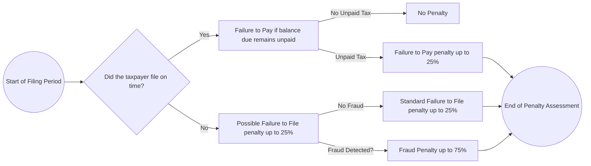

## 21.2 Penalties & Compliance Triggers for Entities & Individuals

Understanding the Internal Revenue Service (IRS) penalties and the triggers that lead to compliance scrutiny is crucial for any tax practitioner, especially for CPA candidates preparing for the Uniform CPA Examination (Tax Compliance and Planning [TCP] section). In this subchapter, we focus on the most common penalties, including accuracy-related penalties, underpayment penalties, the fraudulent failure-to-file penalty, and other important considerations for both individuals and entities. We also illustrate penalty calculations with real-life examples, provide references to relevant sections of the Internal Revenue Code (IRC), and outline strategies to minimize risks.

This subchapter complements the broader Practice & Procedure insights in Chapter 21. While Chapter 21.1 discusses the IRS examination process and Chapter 21.3 focuses on ethical considerations for CPAs, here (21.2) we concentrate on the penalty regimes and common compliance triggers. These details also sync with other chapters in this book that deal with individual and entity return preparation (Parts I‒V).

-------------------------------------------------------------------------------
## Overview of Penalties & Compliance Enforcement

The IRS penalty system aims to encourage voluntary compliance, deter noncompliance, and fairly penalize wrongdoing. Penalties can be triggered by different levels of negligence or willful wrongdoing. The key categories covered in this section include:

• Accuracy-Related Penalties.  
• Fraudulent Failure to File or Pay.  
• Underpayment Penalties (e.g., Failure to Pay estimated taxes).  
• Information Reporting Penalties (e.g., failing to file correct information returns).  

Beyond monetary costs, repeated or egregious noncompliance may result in additional scrutiny, potential criminal sanctions, and harm to a taxpayer’s professional or personal reputation. CPA candidates should fully grasp these penalties and their interplay, as exam questions may test not only memorization of penalty rates but also the application of penalty mitigation strategies.

-------------------------------------------------------------------------------
## Common Penalties with Real-World Examples

### 1. Accuracy-Related Penalties (IRC §6662)

Accuracy-related penalties apply when a taxpayer underpays tax due to negligence, disregard of rules or regulations, or substantial understatement of tax. The primary penalty rate is typically 20% of the underpayment attributable to the error. Let’s break down the major subcategories:

#### a. Negligence or Disregard of Rules and Regulations  
• If a taxpayer fails to make a reasonable attempt to comply with the Internal Revenue Code, acts carelessly, or does not keep adequate records, the IRS may levy a 20% accuracy-related penalty.  
• Example: Suppose a self-employed individual claims personal travel expenses as business deductions without proper documentation. If the underpayment of tax resulting from these deductions is $10,000, the penalty could be $2,000 (20% of $10,000).

#### b. Substantial Understatement  
• A “substantial understatement” exists if the understatement exceeds the greater of 10% of the correct tax or $5,000 (for individuals), or for C corporations, the threshold is the lesser of 10% of the correct tax or $10,000,000, with a $10,000 minimum.  
• Example: An S corporation takes an aggressive position on classifying certain fringe benefits, reducing taxable income significantly. After an IRS audit, the correct tax increases by $50,000. If that difference qualifies as a substantial understatement, the accuracy-related penalty is 20% of $50,000, which is $10,000.

#### c. Substantial Valuation Misstatement  
• Taxpayers who overvalue property or claim inflated deductions may trigger a 20% penalty if the misstatement meets certain criteria. This penalty may escalate to 40% if the valuation misstatement is gross or if the property is valued at 200% or more of the correct value.  

In many scenarios, the taxpayer can mitigate or avoid these penalties by using a qualified tax professional, obtaining a written tax opinion, or demonstrating “reasonable cause and good faith.” This reliance on professional advice or demonstration of substantial authority can be a powerful strategy when used properly.

### 2. Fraud Penalties (IRC §§6663, 6651(f))

Fraud-related penalties are among the most severe. When a taxpayer willfully and intentionally attempts to evade taxes, the IRS can impose a 75% penalty on the portion of the underpayment resulting from fraud. Specific categories include:

#### a. Civil Fraud Penalty  
• The civil fraud penalty is calculated at 75% of the portion of underpaid tax that is deemed fraudulent.  
• Example: A small-business owner who deliberately omits 30% of gross receipts from the tax return, resulting in a $40,000 underpayment, may incur an extra $30,000 penalty (75% of $40,000).

#### b. Fraudulent Failure to File  
• If a taxpayer willfully avoids filing a return by the due date (including extensions) with intent to evade taxes, he or she can be subject to a penalty of 15% per month (capped at 75% overall) of the net tax due. This effectively replaces the standard Failure to File penalty when fraud is involved.  
• Criminal charges can also accompany civil fraud penalties if the IRS can prove beyond reasonable doubt that the taxpayer acted with criminal intent.

### 3. Failure to File and Failure to Pay Penalties (IRC §6651)

#### a. Failure to File  
• A taxpayer who does not file by the due date (including extensions) typically incurs a 5% monthly penalty (up to 25% total).  
• Example: An individual with $4,000 of unpaid tax fails to submit the return for three months past the deadline. The penalty is $600 (5% of $4,000 = $200 per month multiplied by three months), capped at a total of $1,000 (25% of $4,000) if they continue to be late beyond five months.

#### b. Failure to Pay  
• If a taxpayer files a return but does not pay the tax due by the deadline, the monthly penalty is 0.5% (generally up to 25%).  
• Note that if both Failure to File and Failure to Pay penalties apply, the 5% monthly penalty for Failure to File is typically reduced by the 0.5% Failure to Pay penalty for the same month (net 4.5%).

### 4. Estimated Tax Underpayment Penalties

For both individuals and entities that must pay tax throughout the year, failing to remit adequate estimated tax by required deadlines can result in an underpayment penalty. This penalty is generally calculated based on the federal short-term interest rate plus 3%, compounded daily, from the date the payment was due until it is finally paid.

#### a. Individuals  
• If an individual’s tax liability is expected to exceed $1,000 after credits and withholdings, they must pay quarterly estimated taxes.  
• Safe-harbor rules allow payments equal to either 90% of the current year’s tax or 100% (110% for higher earners) of the prior year liability to avoid penalties.

#### b. Corporations  
• Corporations generally make estimated tax payments if they expect to owe $500 or more for the year. Failure to meet required quarterly installments triggers similar underpayment penalties.

### 5. Information Reporting and Late Filing Penalties

Apart from income tax returns, there are numerous information reporting requirements. Forms such as Form 1099, Schedules K-1, or payroll returns (Forms 941 and W-2) must be filed accurately and on time. Penalties can accumulate quickly for each incorrectly filed or late information return. For example, late Forms 1099 can trigger penalties ranging from $50 to $290 per return, depending on how late they are filed, with caps on maximum annual liability based on the size of the business.

| Penalty Type                 | Rate or Penalty Percentage                          | Maximum Cumulative Penalty            |
|------------------------------|-----------------------------------------------------|---------------------------------------|
| Accuracy-Related (Negligence/Substantial Understatement) | 20% of underpayment                                   | N/A                                   |
| Civil Fraud                  | 75% of fraudulent underpayment                      | No stated dollar limit                |
| Fraudulent Failure to File   | 15% per month, up to 75% total of unpaid tax        | 75% of unpaid tax due                 |
| Failure to File              | 5% per month, up to 25%                             | 25% of unpaid tax                     |
| Failure to Pay               | 0.5% per month, up to 25%                           | 25% of unpaid tax                     |
| Information Return Penalties | $50 to $290 per form filed late or incorrectly      | Capped annually (varies by entity)     |

-------------------------------------------------------------------------------
## Major Compliance Triggers and Audit Red Flags

### 1. Underreporting Income

Material discrepancies between the income reported by third parties (e.g., Form W-2, Form 1099) and the income on a taxpayer’s return raise immediate red flags. Entities and individuals should ensure all third-party reported documentation matches their returns.  

### 2. Large or Unusual Deductions

Excessive itemized deductions or business expenses relative to reported income can attract IRS attention. For example, a Schedule C filer claiming unusually large travel and entertainment expenses compared to other businesses in the same industry is more likely to be scrutinized.

### 3. Repeated or Patterned Late Filings

Chronic lateness or repeated patterns of noncompliance increase the chance of closer IRS scrutiny. A taxpayer regularly filing or paying late may trigger an automatic compliance review.  

### 4. Claims of Significant Tax Credits or Refundable Credits

Large refundable credits, such as the Earned Income Tax Credit (EITC) or certain energy credits, can be compliance triggers. Entities claiming the Research & Development (R&D) Credit or employee retention credits must adhere to strict eligibility rules.

### 5. International Transactions and Foreign Reporting

Failures to file required forms such as FBAR (Foreign Bank Account Report) or Forms 5471/5472 for foreign corporations can result in large penalties and potential criminal prosecution. Any significant foreign transactions or cross-border ownership can trigger an independent compliance review.

-------------------------------------------------------------------------------
## Strategies for Minimizing Penalties

### 1. Timely Filing and Payment

At the most basic level, file the return on time and pay taxes due. Where immediate full payment is impossible, consider an installment agreement to avoid or reduce further penalty accrual.

### 2. Maintain Quality Documentation and Records

Well-maintained records are essential. This includes documentation of business mileage, receipts for big-ticket deductions, bank statements for all income, and organized accounting software logs.

### 3. Disclose Uncertain or Ambiguous Tax Positions

When tax law is unclear, consider filing Form 8275 (Disclosure Statement), which can help avoid accuracy-related penalties for failing to disclose a questionable position. A thorough explanation and reference to relevant legal authority can reinforce the argument.

### 4. Rely on Substantial Authority or Professional Advice

Demonstrating that you reasonably relied on professional advice or relevant authority can potentially avert penalties. This requires that the advice be genuine, thorough, and timely.

### 5. Monitor Quarterly Estimates and Safe Harbors

For individuals and entities with variable income, confirming quarterly installments are made on time and in the correct amounts is essential. Use prior-year safe-harbor rules if you expect increased income. Timely adjustments to estimated payments or withholdings can prevent underpayment penalties.

-------------------------------------------------------------------------------
## Penalty Abatement and Reasonable Cause Relief

A taxpayer may seek relief from penalties if certain conditions are met. One common pathway is establishing “reasonable cause,” meaning the taxpayer exercised ordinary business care and prudence. Examples include reliance on incorrect professional advice or serious illness that prevented timely filing. Other forms of statutory relief, such as the “First Time Abatement” policy, provide administrative relief for one tax period if the taxpayer has a generally compliant history.

-------------------------------------------------------------------------------
## Common Pitfalls & Practical Examples

Below are a few scenarios illustrating how penalties might arise and the role of penalty abatement:

1. **Incorrect Filing Status**  
   • An individual inadvertently files as Head of Household when ineligible, leading to an understatement of $1,500. If the taxpayer lacks substantial authority, the IRS could impose a 20% accuracy-related penalty of $300.

2. **Late S Corporation Return**  
   • An S corporation fails to file its Form 1120-S by the due date (March 15 for calendar-year filers) and obtains no extension. The penalty is $220 per month (2023 figure, indexed periodically) multiplied by the number of shareholders, for up to 12 months. Although not an accuracy-related penalty, these failures can be triggered quite easily—especially if there are multiple shareholders.

3. **Unsubstantiated Deductions**  
   • A landscaping business claims $8,000 in home office deductions without proper substantiation. An accuracy-related penalty of 20% can be imposed on any underpayment.

4. **International Reporting Overlook**  
   • A corporation with a foreign subsidiary misses Form 5471. Each missing or late Form 5471 typically carries a $10,000 penalty per occurrence, per year. This can be quickly compounded by additional monthly penalties if the failure continues after IRS notification.

-------------------------------------------------------------------------------
## Visualizing Penalty Escalation

To help visualize how certain penalties might layer or escalate over time (e.g., when failing to file and failing to pay simultaneously), consider the diagram below using Mermaid.js:

Explanation:  
• If a taxpayer fails to file on time, they start to accrue Failure to File penalties.  
• If a balance remains unpaid, the Failure to Pay penalty starts to accrue, albeit at a lower monthly rate (0.5%).  
• If fraud is established, penalties jump significantly (75% of the underpayment).

-------------------------------------------------------------------------------
## Integrating Penalties Knowledge into CPA Exam Preparation

On the TCP section of the CPA Exam, you may encounter multiple-choice questions, task-based simulations, or scenario-based analyses pertaining to IRS penalties. To excel:

• Master the penalty percentage rates and their respective thresholds.  
• Understand the conditions that trigger penalty assessments.  
• Be prepared to identify exceptions or defenses to penalties (e.g., reasonable cause).  
• Recognize the interplay among various penalties: for instance, how Failure to File penalties may be reduced by concurrent Failure to Pay penalties.

-------------------------------------------------------------------------------
## Further Resources & References

1. **Internal Revenue Code (IRC)**:
   • IRC §6662 (Accuracy-Related Penalties)  
   • IRC §6663 (Fraud Penalty)  
   • IRC §6651 (Failure to File/Failure to Pay)  
2. **IRS Publications**:
   • Publication 17 (Your Federal Income Tax)  
   • Publication 505 (Tax Withholding and Estimated Tax)  
   • Publication 541 (Partnerships)  
3. **Treasury Regulations** and **Revenue Procedures** for in-depth rules on penalty abatement and administration.  
4. **Online Tools & Resources**: The official IRS website (IRS.gov) provides directories and calculators (e.g., estimated tax worksheets).

-------------------------------------------------------------------------------
## Quiz: “Mastering IRS Penalties & Compliance Triggers”



### Which penalty typically applies to a taxpayer who underpays their tax due to negligence?  
- [x] Accuracy-related penalty of 20%  
- [ ] Fraud penalty of 75%  
- [ ] Failure-to-file penalty of 5% per month  
- [ ] Failure-to-pay penalty of 0.5% per month  

> **Explanation:** When an underpayment results from negligence or disregard of rules, it generally triggers the 20% accuracy-related penalty under IRC §6662.

### If fraud is involved in failing to file, the monthly penalty can be what amount?  
- [x] 15% per month, up to 75% of the unpaid tax  
- [ ] 5% per month, up to 25%  
- [ ] 0.5% per month, up to 25%  
- [ ] A flat $210 per month  

> **Explanation:** When fraudulent failure to file is established, the penalty is 15% per month, up to a maximum of 75% of the unpaid tax (IRC §6651(f)).

### A taxpayer understates their tax by $10,000 due to a substantial understatement. What is the most likely penalty percentage for this portion?  
- [x] 20%  
- [ ] 75%  
- [ ] 10%  
- [ ] 5%  

> **Explanation:** A substantial understatement triggers an accuracy-related penalty at the 20% rate.

### Under the Failure to File penalty, what is the maximum cumulative percentage if a return is not fraudulently missing?  
- [x] 25%  
- [ ] 75%  
- [ ] 50%  
- [ ] 10%  

> **Explanation:** The standard Failure to File penalty accrues at 5% per month and caps at 25%. Fraudulent failure to file is higher, up to 75%.

### When both the Failure to File and Failure to Pay penalties apply simultaneously for the same month (in a non-fraud scenario), how does the monthly penalty usually break down?  
- [x] 4.5% for Failure to File and 0.5% for Failure to Pay  
- [ ] 5% for each, totaling 10%  
- [x] 10% for Failure to File and 2% for Failure to Pay  
- [ ] 2.5% for each, totaling 5%  

> **Explanation:** When both apply, the total penalty for that month is generally 5%, broken down as 4.5% for Failure to File plus 0.5% for Failure to Pay.

### Which safe harbor rule helps individuals avoid estimated tax penalties?  
- [x] Paying 90% of current year’s tax or 100% (110% for higher earners) of the prior year  
- [ ] Paying 50% of current year’s tax  
- [ ] Paying 80% of net income  
- [ ] Paying 95% of prior year’s tax  

> **Explanation:** The generally accepted safe harbor is to pay at least 90% of the current year’s tax or 100% (110% if prior-year AGI exceeded certain thresholds) of the prior year’s tax to avoid penalties.

### For a civil fraud penalty, how is the penalty generally calculated?  
- [x] 75% of the underpayment attributable to fraud  
- [ ] 20% of the understated tax  
- [x] 10% on total gross receipts  
- [ ] $290 per day until filing  

> **Explanation:** Civil fraud penalties are imposed at 75% of the portion of the underpayment attributable to fraudulent activity.

### A business that files Form 1120-S late without an extension will most likely face which type of penalty?  
- [x] A late-filing penalty based on the number of shareholders and months the return is late  
- [ ] A 20% accuracy-related penalty  
- [ ] A 75% fraud penalty  
- [ ] 15% monthly penalty capped at 75%  

> **Explanation:** S corporations that file Form 1120-S late face a per-shareholder, per-month penalty. Accuracy-related and fraud penalties are distinct from this filing penalty.

### If an individual fails to include income from a Form 1099 they never received, resulting in a significant underpayment, which factor would help them obtain reasonable cause relief?  
- [x] Prompt action to correct the error upon discovery and reliance on official authority  
- [ ] Ignoring all notices from the IRS  
- [ ] Making partial payments but never filing a return  
- [ ] Providing no documentation  

> **Explanation:** Reasonable cause relief often requires demonstrating ordinary business care and prudence, such as promptly correcting the error and showing reliance on official authority or evidence that the taxpayer acted in good faith.

### A taxpayer who reported zero income to conceal wage earnings could be subject to which penalty rate if determined to be fraudulent?  
- [x] 75%  
- [ ] 20%  
- [ ] 5%  
- [ ] 50%  

> **Explanation:** Fraud in underreporting or concealing income can lead to the 75% civil fraud penalty on the underpayment due to the fraudulent action.



-------------------------------------------------------------------------------
## For Additional Practice and Deeper Preparation

**[TCP CPA Hardest Mock Exams: In-Depth & Clear Explanations](https://www.udemy.com/course/tcp-cpa-mock-exams/?referralCode=675149871D0E79B1699C)**  

**Tax Compliance & Planning (TCP) CPA Mocks:** 6 Full (1,500 Qs), Harder Than Real! In-Depth & Clear. Crush With Confidence!  

- Tackle full-length mock exams designed to mirror real TCP questions.  
- Refine your exam-day strategies with detailed, step-by-step solutions for every scenario.  
- Explore in-depth rationales that reinforce higher-level concepts, giving you an edge on test day.  
- Boost confidence and minimize anxiety by mastering every corner of the TCP blueprint.  
- Perfect for those seeking exceptionally hard mocks and real-world readiness.  

_Disclaimer: This course is not endorsed by or affiliated with the AICPA, NASBA, or any official CPA Examination authority. All content is for educational and preparatory purposes only._
