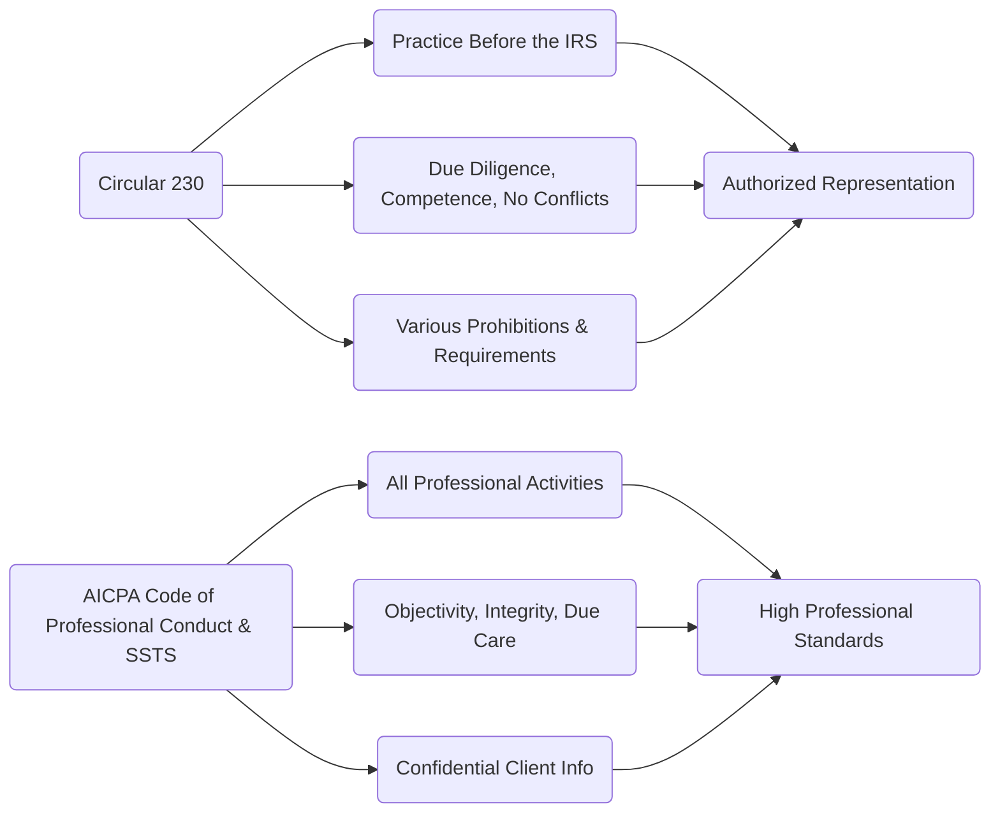
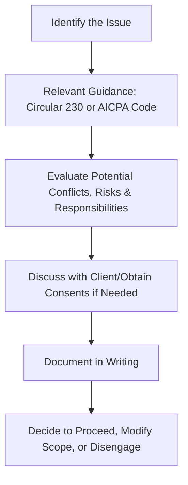

## 21.3 Ethical Considerations for CPAs (Circular 230 & AICPA Standards)

When it comes to representing clients in matters before the Internal Revenue Service (IRS) and delivering high-quality professional services, Certified Public Accountants (CPAs) must adhere to a robust set of ethical guidelines. These guidelines come primarily from two sources:

1. The U.S. Department of the Treasury’s Circular 230, which governs practices before the IRS.  
2. The American Institute of Certified Public Accountants (AICPA) Code of Professional Conduct and associated standards (including the Statements on Standards for Tax Services [SSTS]).

In this section, we will dive deeper into the ethical challenges CPAs commonly face—particularly around conflicts of interest, professional diligence, and client confidentiality. We also present “what-if” exam scenarios that help you understand how to navigate real test questions or real-world conundrums. An unwavering commitment to ethical behavior will not only help you pass the CPA exam but is essential for sustaining a reputable, long-term practice in public accounting.

---

### Understanding Circular 230: A Brief Overview

Circular 230, administered by the Office of Professional Responsibility (OPR) under the U.S. Treasury, outlines standards for tax professionals authorized to practice before the IRS (including CPAs, attorneys, and enrolled agents). Key provisions and principles in Circular 230 address:

• Competence to practice.  
• Due diligence requirements.  
• Avoidance of conflicts of interest.  
• Proper use of official tax forms and representations to the IRS.  
• Disreputable conduct (penalties for misconduct).  
• Fee restrictions and requirements (e.g., contingent fees in certain engagements).  

Violations of Circular 230 can lead to censures, suspensions, or permanent disbarment from practice before the IRS. Compliance is, therefore, not optional—familiarity with its requirements is crucial for any CPA engaged in tax compliance and planning.

---

### Overview of AICPA Standards

While Circular 230 is specific to representing taxpayers before the IRS, the AICPA Code of Professional Conduct has a broader scope that covers all facets of a CPA’s professional activities. Within the Code of Professional Conduct and the Statements on Standards for Tax Services (SSTS), key elements include:

• Integrity and Objectivity  
• Independence (where applicable, such as attest services)  
• Due Care and Competence  
• Confidential Client Information  
• Responsibilities to Colleagues, Employers, and the Public  

When a CPA is serving in a tax capacity rather than an audit or attest role, particular attention is given to SSTS, which addresses quality and ethical standards for tax practice. Nevertheless, the fundamental principles of the AICPA Code of Professional Conduct still apply, ensuring that CPAs safeguard the public interest.

---

### Ethical Principles Relevant to CPAs Practicing Tax

Below is a quick comparison of major topics covered by both Circular 230 and AICPA standards:

In this diagram:

• Circular 230 (A, B, C, D) focuses on authorized representation, due diligence, conflicts of interest, and additional prohibitions (e.g., improper use of contingent fees).  
• AICPA Code of Professional Conduct & SSTS (E, F, G, H) encompasses all professional activities, emphasizing objectivity, integrity, due care, and confidentiality.

---

### Conflicts of Interest

One of the most pervasive challenges in tax practice is managing conflicts of interest, which occur when a CPA’s obligations to one party conflict with those owed to another. For instance, a CPA might prepare the tax returns of two business partners going through a dissolution, or might represent both a corporation and certain shareholders. Under Circular 230 and the AICPA Code of Professional Conduct:

• CPAs must disclose any potential conflict of interest and obtain informed consent from all affected parties before proceeding with an engagement.  
• Even with disclosure, certain conflicts are so profound they cannot be “cured” by obtaining consent.  
• Proper documentation is critical. If a client consents to waive a conflict, maintain a written record of the waiver.

#### Practical Example

Suppose you are engaged to provide tax compliance services for a small family business, but you also do the personal tax returns for each family member. As the family business expands, disputes might emerge among siblings working in the company. A conflict arises if both the entity and the sibling personal returns have contradictory tax positions, or if certain family members want you to strategize in ways that adversely affect others. You must ensure that you can continue representing all parties without compromising any client’s interest. If such adversity is unavoidable, you may need to disengage from one (or more) parties.

#### Potential Exam “What-If?”

• What if the exam question indicates that you discover a conflict in mid-engagement, such as discovering that your client’s business partner is also your audit client?  
• What steps should a CPA take if the business partner’s interests materially diverge from your main client’s objectives?  

The correct approach would generally involve immediate disclosure to both clients, obtaining asked-for consents, or potentially disengaging if the conflict is irreconcilable. This is central to maintaining objectivity and independence.

---

### Diligence and Due Care

Both Circular 230 (§10.22) and AICPA Standards (principles of Due Care) require CPAs to exercise diligence when handling tax affairs. This includes verifying factual information, performing thorough research into tax positions, and documenting your rationale for specific recommendations.

#### Key Points

1. **Completeness and Accuracy:** You must ensure all information provided to the IRS or to clients is correct based on reasonably known data at the time.  
2. **Reasonable Inquiries:** A CPA should make reasonable inquiries into any potential misstatement or omission if the information provided by the client is suspicious or incomplete.  
3. **Substantiation of Tax Positions:** Always maintain written support for significant or unusual tax positions. This can include official IRS guidance, court cases, or administrative rulings.  

#### Practical Example

A client invests in a complex partnership arrangement that offers large deductions. Before claiming these deductions on the client’s return, you must:

1. Review the partnership agreement.  
2. Determine the nature of the business operations.  
3. Research relevant sections of the Internal Revenue Code and Treasury Regulations for partnership deductions.  
4. Document all steps in your workpapers, including potential risk areas (e.g., if the arrangement resembles an abusive tax shelter).

Failure to exercise due diligence exposes both you and your client to potential penalties, not to mention possible disciplinary actions under Circular 230.

---

### Confidential Client Information

Both AICPA professional standards and Circular 230 address the protection of confidential client information. According to the AICPA Code of Professional Conduct (ET §700 series):

• You cannot disclose client information without the client’s explicit consent, except in limited circumstances (e.g., in response to a valid court subpoena, a request by an authorized government agency, or an official peer review panel).  
• You must also safeguard client data against unauthorized access, which now includes cybersecurity considerations (e.g., ensuring proper encryption for electronic records).  

Circular 230 §10.20–§10.25 also imposes duties on the practitioner to provide certain information to the IRS upon lawful request, but that does not override the duty to maintain confidentiality in other scenarios. Failure to maintain confidentiality can lead to disciplinary measures by the Treasury and possibly lawsuits by the affected client.

#### Potential Exam “What-If?”

• What if your close friend, who is not associated with your client, casually asks you about the details of a high-profile merger your client is undertaking? Are you allowed to confirm any details that are arguably “public knowledge”?  
• Under the AICPA Code of Professional Conduct, the safe stance is to not disclose any information, even if you believe some aspects are public. You risk inadvertently releasing nonpublic insights that might harm your client.  

The exam might test whether you understand your obligations to maintain confidentiality despite social or other professional pressures.

---

### Exam Scenario “What-Ifs?” in Ethical Practice

Below are some additional “what-if” scenarios that could appear on the exam, along with guidance on how to reason through them:

• **Scenario A**: You find out that a long-time client is misrepresenting major deductions to reduce taxable income. They have not provided receipts or proof of expenses. You learn from an informal conversation that some expenses might even be illegal payments.  
  - **Guidance**: You must exercise due diligence and remind the client of documentation requirements. If the client refuses to correct the records, you must consider withdrawing from the engagement. Reporting this to the IRS is not typically mandatory unless required by law (e.g., knowledge of money laundering). However, continuing to file returns you know to be false could subject you to disciplinary action.

• **Scenario B**: A corporate client requests you to file an extension that includes inaccurate estimated tax data. They plan to “fix it later.”  
  - **Guidance**: You have to ensure that the estimated amounts are genuinely reasonable. Filing blatantly incorrect data contravenes the AICPA’s SSTS and Circular 230. At minimum, require the client to revise to a good-faith estimate or decline the engagement.

• **Scenario C**: Your firm wants to roll out a new marketing campaign that highlights “Expert IRS Representation, 100% Success Guaranteed!”  
  - **Guidance**: Under Circular 230 §10.30, CPAs may not use any form of false or misleading advertising. Guaranteeing success or using superlatives that imply an unrealistic result could lead to allegations of misleading marketing.

---

### Flowchart of Ethical Decision-Making

Below is a simple flowchart illustrating a recommended process for resolving ethical dilemmas under Circular 230 and AICPA standards:

Explanation of steps:

• Identify the issue. Is there a conflict of interest? An independence concern? A question about confidentiality or due diligence?  
• Consult relevant professional standards (Circular 230, SSTS, AICPA Code of Professional Conduct, local laws).  
• Evaluate all possible risks and responsibilities, including your duty to the client, public interest, and enforcement authorities.  
• Talk with the client if needed. Obtain waivers or consents in writing—but only if permissible.  
• Document your findings and decisions thoroughly.  
• Either proceed ethically, adjust the engagement scope, or withdraw if you cannot reconcile the issues.

---

### Common Pitfalls and Best Practices

1. **Pitfall**: Overlooking small details in documentation or ignoring red flags.  
   - **Best Practice**: Have a checklist or procedure to systematically verify data and request additional support for unusual or large deductions.  

2. **Pitfall**: Advising clients on uncertain tax positions without properly disclosing the level of uncertainty or potential consequences.  
   - **Best Practice**: Communicate openly about the likelihood of challenge by tax authorities, relevant authority levels (e.g., “substantial authority” vs. “reasonable basis”), and possible penalties.  

3. **Pitfall**: Accepting an engagement despite an unresolved conflict of interest.  
   - **Best Practice**: Conduct a robust conflict check. Where conflicts are identified, secure written consents or, if the conflict is not waivable, politely decline or withdraw.

4. **Pitfall**: Failing to keep up with emerging legislative updates and new ethical interpretations.  
   - **Best Practice**: Engage in continuous professional education (CPE), read official AICPA guidance updates, and track recent IRS pronouncements.

---

### Case Study: Multi-Party Tax Representation

#### Background

A CPA firm represents two business partners, Alice and Bob, who formed a partnership in real estate development. The firm also files the partnership return and personal returns for both partners. Over time, the partners have diverging opinions on how to manage the partnership, leading to a heated dispute about certain property losses.

#### Issues

• Bob suspects Alice wants to allocate more losses to herself to offset taxable gains on another personal venture.  
• Alice claims this approach is justified by the actual financial contributions she made, so she requests the CPA to file returns that reflect a disproportionate share of the losses.  
• Bob strongly believes this is incorrect and demands that you “fix” the K-1 allocations.  

#### Ethical Considerations

1. **Conflicts of Interest**: Your loyalty to each individual may be compromised now that both are at odds regarding the tax positions.  
2. **Diligence**: You must review the partnership agreement, examine all capital contributions, and confirm correct allocation methods under §704(b) or partnership tax rules.  
3. **Confidentiality**: You cannot reveal one client’s proprietary information to the other without explicit consent if the returns or personal finances are separate.  

#### Potential Resolutions

• Attempt to gain mutual consent for the resolution of the dispute.  
• If Alice and Bob cannot see eye to eye, you may have to withdraw from preparing returns for one (or both) while ensuring each remains informed of the reasons and potential consequences.  

This scenario underscores the typical complexities encountered in practice and on the CPA exam. Ethics is not always black and white; it calls for professional judgment guided by established standards.

---

### Real-World References and Resources

• U.S. Treasury Circular 230: “Regulations Governing Practice before the Internal Revenue Service”  
• AICPA Code of Professional Conduct (latest edition, accessible on the AICPA website)  
• AICPA Statements on Standards for Tax Services (SSTS)  
• IRS Publication 947: “Practice Before the IRS and Power of Attorney”  

Expanding your knowledge of the above resources is invaluable for both exam preparation and a successful career in tax compliance and planning.

---

### Conclusion

Ethical decision-making is the cornerstone of responsible CPA practice. Whether you are navigating a potential conflict of interest, exercising due diligence on a complex return, or protecting confidential client data, understanding the mandates of Circular 230 and AICPA Standards is essential. By applying consistent ethical reasoning, CPAs not only comply with regulations but also guard their reputation and protect the public trust.

In your exam preparation—and even more importantly, in real-life practice—always remember to:

1. Check for potential conflicts early and, if necessary, obtain client waivers or disengage if conflict is irreconcilable.  
2. Uphold due diligence: investigate suspicious or uncertain items thoroughly and maintain robust documentation.  
3. Safeguard client confidentiality; do not disclose any client details unless legally compelled.  

By embracing these ethical principles, you sustain the integrity of the accounting profession and set an example of professional excellence.

---

## Mastering Ethical Standards for CPAs: Circular 230 & AICPA Quiz



### A client’s close relative asks you about the details of the client’s upcoming merger, stating they already know “most” of the details. What is your best course of action under AICPA ethical guidelines?

- [ ] Provide only the details that are already in the public domain.  
- [ ] Verify if they really know everything, then confirm details.  
- [x] Maintain strict confidentiality and refuse to discuss any client information.  
- [ ] Offer partial information but make it clear you cannot divulge confidential facts.  

> **Explanation:** The CPA’s duty to maintain confidentiality under the AICPA Code of Professional Conduct prevents disclosure of information, even if some or all of it may already be “public knowledge.” The correct approach is to refrain from discussing the client’s situation.

### A firm’s marketing team decides to roll out an advertisement stating “100% IRS Audit Success Guaranteed!” What does Circular 230 say about such promotional claims?

- [x] They are not allowed, as they can be misleading.  
- [ ] They are fine as long as true success rates back them up.  
- [ ] They are a permissible statement under free speech provisions.  
- [ ] They are allowed if the firm discloses any disclaimers.  

> **Explanation:** Circular 230 §10.30 prohibits false or misleading advertising. Guarantees of success are generally considered misleading and can lead to disciplinary action.

### Which of the following best describes a CPA’s due diligence obligations under Circular 230?

- [x] A CPA must make reasonable inquiries to ensure the accuracy of information and cannot ignore red flags.  
- [ ] A CPA is not responsible for verifying client-supplied data.  
- [ ] A CPA may rely solely on third parties for verification.  
- [ ] A CPA must only perform due diligence on publicly traded clients.  

> **Explanation:** Circular 230 §10.22 mandates that all tax practitioners exercise due diligence in preparing returns, making claims, and providing statements to the IRS. CPAs cannot rely blindly on client data without reasonable verification.

### When handling a potential conflict of interest, a CPA should generally:

- [ ] Keep the conflict secret and proceed to represent both parties to the best of their ability.  
- [ ] Disclose the conflict only if one client specifically inquires.  
- [x] Disclose the conflict to all affected parties, obtain written consent, or disengage if the conflict is unresolvable.  
- [ ] Immediately cease representing both parties without explanation.  

> **Explanation:** Under both AICPA standards and Circular 230, CPAs must inform all relevant clients of the nature of the conflict, obtain informed consent (if possible), or disengage if it cannot be resolved.

### Which two principles in the AICPA Code of Professional Conduct are especially critical when assessing ethical dilemmas in tax practice?

- [x] Integrity and Objectivity  
- [ ] Conflicts and Marketing  
- [x] Due Care and Confidentiality  
- [ ] Skepticism and Advertising  

> **Explanation:** The Code highlights Integrity and Objectivity as central ethical requirements, as well as Due Care and the safeguarding of Confidential Client Information. CPAs must consistently apply these principles to ethical dilemmas.

### Scenario: You suspect your client failed to report income from a foreign bank account. What steps should you take to comply with your due diligence obligations?

- [x] Ask your client for clarification and documentation regarding the omitted income.  
- [ ] Ignore it, as it is the client’s responsibility to certify completeness of their return.  
- [ ] Report your client directly to the IRS without discussion.  
- [ ] Immediately end the engagement.  

> **Explanation:** You should make reasonable inquiries and seek documentation or clarification from the client. If the client refuses to comply or provides false information, you should consider whether you can ethically continue the engagement.

### Under the AICPA Code of Professional Conduct, can a CPA disclose confidential client information without consent to comply with a peer review?

- [x] Yes, disclosure is permitted under authorized peer review.  
- [ ] No, professional reviews do not override confidentiality.  
- [x] Yes, as long as the client is informed after the fact.  
- [ ] Only if the peer review is conducted by an external agency.  

> **Explanation:** Authorized peer reviews are one of the exceptions to the confidentiality rule. CPAs can share necessary information with an authorized peer reviewer, although best practice is to inform the client proactively.

### A CPA discovers that two clients involved in the same transaction hold contradictory positions on a crucial item. What is the CPA’s best approach under conflict-of-interest guidelines?

- [x] Immediately inform both clients of the conflict and seek a resolution or withdrawal.  
- [ ] Represent whichever client is more profitable.  
- [ ] File the returns according to each client’s wishes.  
- [ ] Choose the tax position that benefits the CPA’s public image the most.  

> **Explanation:** The CPA must disclose the potential conflict to both clients, attempt to obtain informed written consent if feasible, or withdraw from one or both engagements if no resolution is possible.

### When must a CPA disclose information to the IRS under Circular 230 if requested?

- [x] When the request is legally authorized, such as a proper subpoena or IRS summons.  
- [ ] Whenever an IRS representative casually asks via email or phone.  
- [ ] Only if the client explicitly authorizes the CPA to share the information.  
- [ ] CPAs never have to disclose confidential information, even under subpoena.  

> **Explanation:** Circular 230 obligates the practitioner to comply with valid IRS summonses and legal requests. Nonetheless, the CPA should first verify the legitimacy of the request.

### Practitioners are expected to exercise “due diligence” in preparing and filing tax returns. True or False?

- [x] True  
- [ ] False  

> **Explanation:** Due diligence is a cornerstone requirement under both Circular 230 and the AICPA’s standards. Practitioners must ensure accuracy, completeness, and thoroughness in all professional engagements.



---

## For Additional Practice and Deeper Preparation

**[TCP CPA Hardest Mock Exams: In-Depth & Clear Explanations](https://www.udemy.com/course/tcp-cpa-mock-exams/?referralCode=675149871D0E79B1699C)**  

**Tax Compliance & Planning (TCP) CPA Mocks:** 6 Full (1,500 Qs), Harder Than Real! In-Depth & Clear. Crush With Confidence!  

- Tackle full-length mock exams designed to mirror real TCP questions.  
- Refine your exam-day strategies with detailed, step-by-step solutions for every scenario.  
- Explore in-depth rationales that reinforce higher-level concepts, giving you an edge on test day.  
- Boost confidence and minimize anxiety by mastering every corner of the TCP blueprint.  
- Perfect for those seeking exceptionally hard mocks and real-world readiness.  

_Disclaimer: This course is not endorsed by or affiliated with the AICPA, NASBA, or any official CPA Examination authority. All content is for educational and preparatory purposes only._
