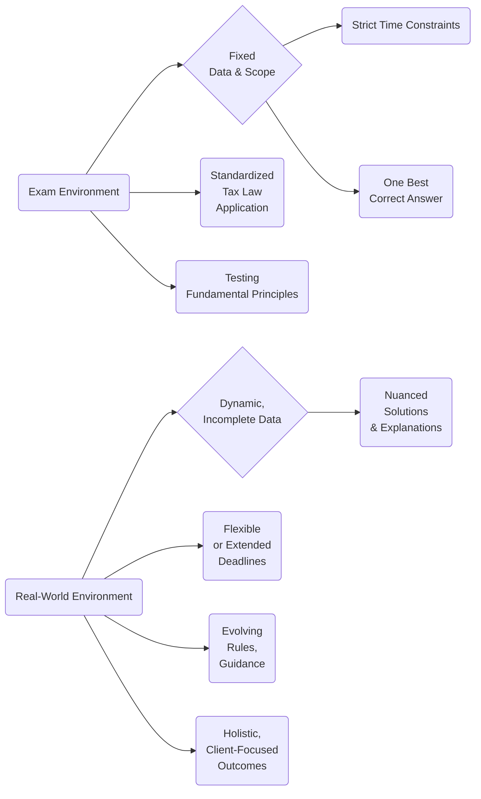

## 21.4 Preparing for Real-World Tax Season vs. Exam Day

Successfully mastering the Tax Compliance and Planning (TCP) section of the CPA Exam requires balancing theoretical knowledge with practical, real-world application. Students often discover that the environment on exam day appears more controlled, with precisely curated facts and figures, while actual client situations can be messy, filled with uncertainties, and complicated by unique client circumstances. This section explores the critical variances between exam-day problem-solving and real-world tax engagements, addresses the importance of client deliverables, and offers guidance on how to adapt CPA exam strategies to high-stakes, real-world complexities.

---

### The Diverging Landscapes of Theory and Practice

While the CPA exam focuses on testing foundational skills and ensuring a standardized baseline of professional competence, real life poses an unending array of novel challenges. On exam day, you will receive question prompts with carefully selected data points on items such as income, deductions, and credits. In the real world, you may encounter:

• Incomplete or inconsistent client records  
• Need for multiple-year cross referencing  
• State and local tax complexities that are specific to jurisdictions  
• Evolving legislative provisions and interim guidance changes  

In contrast, the exam generally presents rules in their clearest, most standardized form, encouraging test-takers to demonstrate mastery of the Code, Treasury Regulations, and IRS guidance. By understanding these differences, you can more gracefully transition from “exam mode” problem-solving to “tax season” scenario analysis.

---

### Key Differences at a Glance

Below is a visual summary comparing important facets of exam-based scenarios versus actual client deliverables.

**Diagram Explanation:**  
• Exam Environment (Boxes A, B, C, D, E, F) – Tightly controlled scenario with specific data and one best possible answer. Time constraints are strict, and you must adhere to known tax law frameworks.  
• Real-World Environment (Boxes G, H, I, J, K, L) – You’re often dealing with incomplete client data, evolving laws, and extended deadlines. Solutions require nuance, considering client-specific goals and relationships between multiple tax rules.

---

### Managing Complexity: Practice vs. Exam

#### 1. Scope of Research & Interpretation

• **Exam Day**: The test focuses on standard questions such as identifying allowable deductions or computing tax liability for a specific fact pattern. The solutions often follow direct code references, treasury regulations, or well-known IRS publications.  
• **Real-World**: The scope of research can balloon rapidly. Taxes interplay with business formation issues, estate planning considerations, local tax statutes, and industry-specific regulations. Furthermore, real-world practitioners often consult with specialized tax attorneys or other experts to interpret gray areas.

**Tip:** Exam knowledge is your toolkit. Real-world scenarios require you to mix these foundational competencies with proactive research. Tools like the Internal Revenue Manual, private letter rulings, and practice units may be critical, even though they are rarely tested at length in an exam setting.

---

#### 2. Accuracy vs. Completeness

• **Exam Day**: The data presented is complete and accurate. You address all items in the prompt in the limited window provided and aim for a solution that matches official guidance.  
• **Real-World**: Clients may not volunteer all relevant details. Bank statements might be missing, or company records could be disorganized. Part of your job is to locate, validate, and reconcile conflicting information.

**Practical Strategy:** Develop routines for data gathering and document organization. Real situations often demand detective work—tracing data across multiple sources—and CPAs must highlight potential exposure points to clients or superiors. Thoroughness can exceed the scope of the exam.

---

#### 3. Deadline Pressures and Project Management

• **Exam Day**: You have a finite number of hours, but you control the workflow—there’s no waiting for third parties.  
• **Real-World**: A typical tax season encompasses multiple deadlines: quarterly estimated payments, corporate filings, partnership returns, extended personal tax returns, and more. Meanwhile, you rely on client responsiveness or third-party data (e.g., K-1s, 1099s).

**Practical Strategy:** Utilize project management software or workflow scheduling tools that can handle multiple overlapping tasks. Effective time management is a necessity both in the exam and in tax season, but real-world engagements require advanced tracking and contingency planning when data arrives late.

---

#### 4. Communication and Client Relations

• **Exam Day**: You solve the question in isolation, rarely dealing with misunderstandings or negotiation.  
• **Real-World**: Communication skills are paramount. You might need to educate your clients on complex tax issues, gather missing documents, or gracefully handle sensitive topics such as undisclosed overseas income or prior-year errors.

**Communication Best Practice:** Offer detailed, yet digestible, explanations and guidance. Use visual aids like charts or bullet-point summaries when discussing with non-technical parties. Emphasize your role as an advisor, not just a number-cruncher.

---

#### 5. Ethical and Legal Considerations

• **Exam Day**: You apply the AICPA’s Code of Professional Conduct and ethical guidelines to straightforward fact patterns.  
• **Real-World**: You could face ethical dilemmas such as discovering unreported income, outdated valuations, or questionable deductions. Real-world tax practitioners must decide whether to continue representation, correct prior returns, or report potential wrongdoing.

**Link to 21.3 Ethical Considerations:** A thorough understanding of Circular 230 and AICPA standards is vital for both the exam and daily practice. However, the real-world dimension demands professional judgment under sometimes ambiguous client circumstances.

---

### Bridging the Gap: Adapting Exam Skills for Real Clients

#### 1. Mastering Fundamentals

Despite differences, the cornerstone of success in both the exam setting and practice is a solid understanding of tax fundamentals. Master all the basics—such as Section 1231 rules, capital gains computations, basis calculations, and AMT or QBI computations—because they apply directly to real transactions.

---

#### 2. Building Analytical and Investigative Skills

Exam-savvy CPAs are used to scanning for “triggers” that might alter tax treatment. In real life, you must learn to probe for hidden triggers, such as:

• **Ownership changes** in a corporation that might limit NOL usages under Section 382  
• **Passive activity rules** for real estate professionals  
• **Multi-state nexus** for remote or traveling employees  

By fine-tuning these investigative skills, you can uncover potential hazards and opportunities that an exam scenario might present in a straightforward manner but a client might inadvertently overlook.

---

#### 3. Consulting Beyond the Numbers

When you succeed on exam day, you show that you can handle computational challenges of a standardized knowledge base. Real-world engagement extends that skill by expecting you to pair the numbers with strategic advice. For example, you might:

• Model potential outcomes of changing an S Corporation to a C Corporation.  
• Outline SALT strategies under shifting regulatory landscapes.  
• Suggest estate-planning vehicles that minimize tax burdens while retaining control (reference Chapter 27 on “Advanced Estate & Gift Integration”).  

This aspect of the job goes beyond passing the exam. In real life, you often become a trusted advisor providing integrated solutions.

---

#### 4. Meticulous Record-Keeping and Audit Trails

Although the exam environment rarely tests your ability to maintain comprehensive records over multiple periods, real-world tax compliance demands impeccable documentation. You must create or maintain audit trails ensuring data accuracy, especially if the client faces an IRS audit.

**Record-Keeping Essentials**:  
• **Differentiating** between personal and business expenses  
• **Maintaining** contemporaneous documentation for charitable contributions or business miles  
• **Documenting** basis adjustments after distributions or contributions (critical for Partnerships/S Corporations)  

---

#### 5. Navigating Technology and Software

**Exam Day**: You rely on mental math or scratch paper with standardized software inputs (if any are provided at all).  
**Practice**: Tax professionals leverage advanced options for analytics, from specialized tax software to robust ERP systems. Moreover, advanced data analytics or AI-driven solutions can identify deductions or highlight anomalies. This rapid technological shift can create new advantages—but also potential pitfalls if software inputs are misunderstood.

---

### Case Studies: Applying Exam Strategies to Real Clients

#### Case Study 1: Late K-1 & Filing Extensions

**Scenario**: A single member of a partnership claims they have not received their K-1 on time. You suspect uncertain basis adjustments because the client also contributed equipment mid-year.

• **Exam Approach**: A typical exam question might specify the relevant basis calculations with all items neatly summarized.  
• **Real-World**: You discover partial information, call the partnership’s CPA, request a corrected K-1, and possibly advise the client to file an extension to avoid late-filing penalties.  
• **Key Takeaway**: The fundamentals do not change. However, you must coordinate with third parties, manage deadlines, and ensure accurate data from multiple sources.

---

#### Case Study 2: Overlooked Multi-State Obligations

**Scenario**: A freelance graphic designer living in State A, but with digital products sold nationwide, wonders if they have triggered nexus or other obligations in State B or State C.

• **Exam Approach**: The question might revolve around a single scenario of nexus, referencing state apportionment rules.  
• **Real-World**: You must investigate different states’ thresholds for economic nexus. The client might have intangible sales and distribution networks across multiple states, each requiring separate returns or pass-through entity taxes.  
• **Key Takeaway**: The conceptual knowledge from exam-based SALT scenarios remains valuable, but each state has unique rules, rates, and forms. The complexity can escalate, requiring ongoing research and strategic planning (reference Chapter 23 “Expanded State & Local Tax (SALT) Topics”).

---

### Overcoming Common Challenges in Real-Life Practice

1. **Constant Legislative Changes**: Tax laws shift with new regulations or legislative acts. While exam content may be updated periodically, real-world changes can occur mid-year.  
2. **Client Expectations**: Communicating that certain deductions or tax treatments are no longer valid can create friction. The exam rarely tests conflict resolution skills, whereas real life demands them.  
3. **Ethical Quandaries**: Real life can present situations that are absent from exam questions, such as a client pushing for an aggressive tax position or concealing certain data.  
4. **Time Consumption**: The exam is timed, but real practice can also feel like a race—only with significantly more variables to juggle.

---

### Best Practices for Smooth Transitions

• **Develop a Tax Calendar**: Track filing due dates, keep watch for new forms or enacted legislation, and budget in lead time for client data collection.  
• **Stay Current on Guidance**: Subscribe to official IRS bulletins, and follow major tax news sources.  
• **Invest in Continuing Education**: Attend conferences, join professional networks, and consider specialized courses beyond CPA licensure.  
• **Engage with Mentors**: Senior colleagues or local CPA society members can provide crucial insights into handling ambiguous or unique fact patterns.  

By combining the rigorous discipline of exam-day knowledge with ongoing professional development, you ensure that you’re ready to tackle the unstructured, sometimes chaotic realities of real-world tax season.

---

### Additional Resources

1. **IRS Publication 17**: Provides a thorough overview of individual tax rules that often arise both on the exam and in personal client settings.  
2. **AICPA Tax Section**: Offers guidance on practice management and updates relevant to everyday tax engagements.  
3. **State Taxation Websites**: Each state’s Department of Revenue website is crucial for updated guidance on nexus standards, forms, and deadlines.  
4. **Professional Literature**: Texts like “Federal Tax Research” by Roby B. Sawyers and “Practical Guide to Partnerships and LLCs” by Robert R. Wootton can simultaneously bolster your exam knowledge and real-world competence.

---

## SEO-Optimized Quiz: Bridging Exam Mastery and Real-World Tax Challenges



### In the real world, data provided by clients is often:
- [ ] Perfectly organized and accurate.
- [x] Potentially incomplete and messy, requiring further investigation.
- [ ] Thoroughly audited and guaranteed correct.
- [ ] Irrelevant, as CPAs can estimate any missing numbers.

> **Explanation:** Real-world practice typically involves incomplete or non-standard data from clients, unlike the curated data sets in exam questions. Tax professionals must reconcile or gather missing information.

### Which of the following is a key difference between exam scenarios and client engagements?
- [ ] Exam scenarios cover far more complex real-world intricacies.
- [x] Real-world engagements often require dealing with shifting deadlines and unanticipated data delays.
- [ ] Exam scenarios require extensive client communication skills.
- [ ] There is no difference; both are equally straightforward.

> **Explanation:** Practice engagements demand strong project management to handle varied deadlines and missing data. Exams have a fixed timeline and well-defined data sets.

### How can technology usage differ between exam conditions and professional practice?
- [ ] Professionals rarely use tax software due to higher costs.
- [x] Software and analytics tools are more extensively used in real engagements, while the exam necessitates manual calculations.
- [ ] Exam test-takers are required to demonstrate software proficiency.
- [ ] The exam environment offers unlimited access to the most advanced software solutions.

> **Explanation:** Real tax practices leverage numerous research and automation tools. Exams, by contrast, are designed to test conceptual understanding with limited software or technology usage.

### When facing incomplete records from a new client, which skill becomes especially crucial?
- [ ] Memorizing the Internal Revenue Code verbatim.
- [ ] Limiting research to previous-year exam solutions.
- [ ] Strictly working only with provided data.
- [x] Investigative and analytical skills to uncover missing information.

> **Explanation:** Beyond exam mastery, tax professionals often need detective-like skills to gather missing data, verify consistency, and ensure compliance.

### Which statement best describes ethical challenges in real-world tax practice?
- [x] They can be more ambiguous, requiring professional judgment and often communication with superiors or attorneys.
- [ ] They are identical to exam scenarios and straightforward to resolve.
- [x] They sometimes involve decisions about continuing representation when discovering unethical client behavior.
- [ ] Ethics rarely come into play outside exam contexts.

> **Explanation:** Ethics in real life may involve gray areas, self-reporting, or confronting a client about incorrect data. This goes beyond the straightforward questions on the exam.

### Which approach is particularly beneficial for managing multiple deadlines in a busy tax season?
- [ ] Depending solely on memory to keep track of each deadline.
- [x] Using project management software or scheduling tools to handle overlapping deadlines.
- [ ] Filing all returns at the earliest date possible without verifying data.
- [ ] Preparing all returns manually to avoid confusion.

> **Explanation:** A robust task management or workflow system helps professionals navigate overlapping due dates and manage the complexities of different returns.

### What is one reason real-world engagements might require more extensive research than exam sessions?
- [ ] There is no reason; both require the same amount of research.
- [x] Real-world clients often have unique facts or encounter new legislative changes, necessitating deeper dives into IRS rulings and external resources.
- [ ] Exams commonly demand research across multiple years and states.
- [ ] Exams never reference the IRC or Treasury Regulations.

> **Explanation:** In practice, new or unusual client circumstances can require specialized guidance and up-to-date legislation research, making the process more involved than exam queries.

### Why might client communication be more critical in practice than during the exam?
- [ ] Because you need to negotiate your exam grade with the interviewer.
- [ ] The exam requires daily interaction with a test proctor.
- [x] Clients often need detailed explanations of tax positions and reasoned advice on compliance requirements.
- [ ] Client communication is forbidden due to confidentiality rules.

> **Explanation:** Real practice involves explaining complex topics to clients, ensuring they understand their obligations and potential tax outcomes, while exam contexts only test personal knowledge application.

### Which statement about multi-state taxation is true in real engagements?
- [ ] It rarely affects clients since states share uniform rules.
- [x] Different states may have distinct nexus thresholds and filing requirements, complicating compliance.
- [ ] It is straightforward since each state adheres to the same apportionment formulas.
- [ ] The exam covers every specific state’s tax laws in detail.

> **Explanation:** Multi-state taxation can become a web of differing laws, thresholds, and apportionment formulas, requiring specialized knowledge that goes beyond exam scenarios.

### True or False: Real-world tax engagements sometimes require adjusting filings from prior years based on newly discovered information.
- [x] True
- [ ] False

> **Explanation:** In practice, if a tax professional or client discovers an error or omission, amending past returns might be necessary—an issue that arises less frequently in exam contexts.



---

## For Additional Practice and Deeper Preparation

**[TCP CPA Hardest Mock Exams: In-Depth & Clear Explanations](https://www.udemy.com/course/tcp-cpa-mock-exams/?referralCode=675149871D0E79B1699C)**  

**Tax Compliance & Planning (TCP) CPA Mocks:** 6 Full (1,500 Qs), Harder Than Real! In-Depth & Clear. Crush With Confidence!  

- Tackle full-length mock exams designed to mirror real TCP questions.  
- Refine your exam-day strategies with detailed, step-by-step solutions for every scenario.  
- Explore in-depth rationales that reinforce higher-level concepts, giving you an edge on test day.  
- Boost confidence and minimize anxiety by mastering every corner of the TCP blueprint.  
- Perfect for those seeking exceptionally hard mocks and real-world readiness.  

_Disclaimer: This course is not endorsed by or affiliated with the AICPA, NASBA, or any official CPA Examination authority. All content is for educational and preparatory purposes only._
