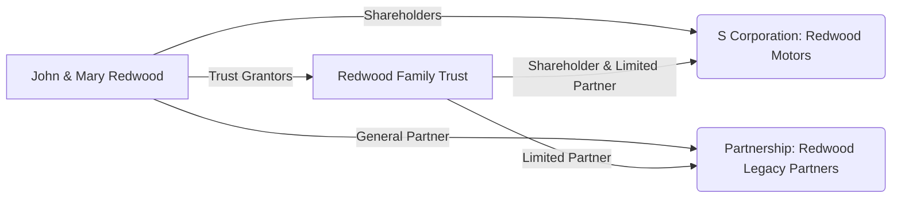

## 22.1 Multi-Entity Family Business Transitions

Transferring ownership of a family business across multiple generations can be daunting, particularly when multiple entities (e.g., S corporations, partnerships, and various trusts) are involved. This section provides a comprehensive walkthrough of the tax, legal, and operational considerations for multi-entity family business transitions. We dive into an illustrative hypothetical scenario that showcases the interplay between entities and generations, incorporating strategies for mitigating tax exposure, retaining control, and meeting family objectives. Along the way, we reference related chapters—such as those on Partnerships & LLCs (Chapter 11), S Corporations (Chapter 10), and Advanced Estate & Gift Integration (Chapter 27)—to guide deeper study.

  
### Scenario Overview

To illustrate the complexities of multi-entity family business transitions, consider the Redwood family, led by founders John and Mary Redwood, both in their late 60s. They have built a diversified family enterprise over 40 years. Their holdings include:

• Redwood Motors Inc. – An S corporation (Chapter 10) specializing in automobile parts manufacturing.  
• Redwood Legacy Partners – A family partnership (Chapter 11) that invests in commercial real estate.  
• Redwood Family Trust – An irrevocable trust established primarily to hold certain assets for the benefit of their adult children and grandchildren (Chapters 12 and 27).  

John and Mary want to ensure a smooth transition of control to their children—Alice and Mark—and eventually to their grandchildren. They also aim to minimize transfer taxes, effectively manage liability exposure, and preserve family harmony.

  
### Key Structural Details

Redwood Motors Inc. qualified for S corporation status early in its inception, given the family’s desire to achieve pass-through taxation and avoid double taxation on dividends. Their S corp has grown significantly and distributes a modest share of profits to John, Mary, and Redwood Family Trust. Redwood Legacy Partners, structured as a limited partnership, invests in multiple real estate properties, some of which house Redwood Motors’ warehouses and operations. The Redwood Family Trust, meanwhile, was initially funded with real estate holdings and invests in Redwood Legacy Partners as a limited partner.

  
#### Entity Map Illustration

Below is a Mermaid diagram outlining the Redwood family’s multi-entity structure. Arrows indicate ownership or beneficial interest.

Explanation of the diagram:

• John & Mary Redwood are the founders and principal drivers of the family business.  
• Redwood Motors is an S corporation with shares owned by John, Mary, and Redwood Family Trust.  
• Redwood Legacy Partners is a family partnership where John & Mary serve as General Partners (GP) and Redwood Family Trust (and potentially other family members) participate as Limited Partners (LP).  
• The Redwood Family Trust receives distributions from both the S corp and the partnership for the benefit of Alice, Mark, and future generations.

  
### Steps in Transition Planning

Family business transitions typically require an integrated plan. The Redwood family must address the following points:

• Corporate governance changes in Redwood Motors (S corp).  
• Partnership interest transfers in Redwood Legacy Partners.  
• Ongoing or expanded trust involvement—potentially establishing a Qualified Subchapter S Trust (QSST) or Electing Small Business Trust (ESBT) if trust ownership evolves further.  
• Coordination of gift and estate tax strategies, especially if John and Mary anticipate large wealth transfers.  
• Control mechanisms ensuring continuity of leadership and avoidance of conflict among family members.

  
### Gifting or Selling Shares of the S Corporation

One significant decision involves how John and Mary will reduce their holdings in Redwood Motors. With S corporations, shares must be held by individuals, certain trusts, or estates; corporate or partnership ownership of S corp stock is generally prohibited. Since Redwood Family Trust already owns a percentage of S corp shares, it may be possible for John and Mary to incrementally transfer additional shares into that trust.

  
#### Gifting S Corp Shares to the Trust

• John and Mary can leverage their annual gift tax exclusions and lifetime exemption (Chapter 6 and Chapter 27) to gradually transfer ownership.  
• If Redwood Family Trust is not already a QSST or ESBT, an election may be needed to preserve valid S corp status.  
• Valuation discounts (lack of marketability and minority interest) can potentially reduce the value of gifts, leveraging the lifetime exemption more effectively. (See Chapter 6.2 for discount valuation techniques.)

  
#### Selling S Corp Shares to Next Generation Members

• John and Mary could also sell S corp shares at fair market value (FMV) to their children, Alice and Mark, possibly financed by a promissory note.  
• This approach generates liquidity for the founders, though it may introduce tax implications on any gain from the sale.  
• A properly structured installment sale may defer recognition of some or all of the capital gains (Chapter 18.3), but should be carefully evaluated against potential interest requirements and compliance complexities.  
• If planned effectively, partial sales can remove equity from the estate while shifting future appreciation to the next generation.

  
### Transition of Partnership Interests

Redwood Legacy Partners currently holds real estate used by Redwood Motors, in addition to other commercial properties. Transferring partnership interests is often a strategic choice in multi-generation planning, because partnerships allow flexible allocations of profits, losses, and capital under §704(b) and §704(c) rules.

  
#### Shifting General and Limited Partnership Interests

• As general partners, John and Mary maintain control over partnership management decisions. They can gradually transfer limited partnership (LP) units to Redwood Family Trust and/or directly to Alice and Mark.  
• LP interest transfers can often benefit from valuation discounts when used for gift or estate tax planning, as the recipients typically lack control over management decisions.  
• Redwood Family Trust will likely remain a limited partner, receiving passive income distributions that can be allocated to beneficiaries under fiduciary income tax rules (Chapter 12).

  
#### At-Risk and Passive Activity Considerations

• Transfers of partnership interests must be assessed regarding at-risk rules (Chapter 5). The recipients must consider whether they are materially participating or simply passive owners.  
• To track losses, new owners must calculate their outside bases, factoring in any changes in unit percentages, contributed or distributed property, and debt reallocation within the partnership (Chapter 16.3).  
• Redwood Legacy Partners invests primarily in real estate, which may qualify for special real estate professional exceptions if Alice or Mark are deemed real estate professionals—further complicating planning (Chapter 5.2).

  
### Utilizing Specialized Trust Structures

Trusts can be powerful vehicles for generational transfers, especially in conjunction with business entities. Redwood Family Trust may need to pivot to or incorporate additional trust structures for more refined control and tax efficiency:

  
#### Electing Small Business Trust (ESBT)

• If Redwood Family Trust is broad-based with multiple potential beneficiaries, an ESBT election can allow continued ownership of S corp shares while meeting the strict eligibility criteria for S corp shareholders (Chapter 10).  
• ESBTs pay tax on their S corp income at the trust level, potentially at higher rates, but can preserve pass-through treatment for the business.  

  
#### Qualified Subchapter S Trust (QSST)

• A QSST is another common vehicle for trust ownership of S corporation stock if there is only one income beneficiary.  
• Requires an election filed with the IRS. The trust beneficiary is treated as the direct owner of the S corp stock for income tax purposes, simplifying the distribution structure.  

  
#### Grantor Trust vs. Complex Trust Considerations

• If Redwood Family Trust is a grantor trust (Chapter 12.1), John and Mary remain responsible for the income taxes on the trust’s share of S corp or partnership income, effectively allowing the assets to appreciate in the trust while removing tax liabilities from the trust’s beneficiaries.  
• If it is a complex trust, Redwood Family Trust will pay tax on undistributed income. Distributable Net Income (DNI) calculations come into play for distributions to beneficiaries, which can shift tax liability to the beneficiaries at potentially lower brackets.

  
### Broader Estate & Gift Tax Planning Components

In transferring large business interests, John and Mary should look beyond immediate income reporting and consider the long-term implications for their estate. A few key considerations:

  
#### Estate Freeze Techniques

• An estate freeze strategy, such as an intentionally defective grantor trust (IDGT), can transfer future appreciation out of the senior generation’s estate.  
• A preferred partnership freeze might also apply where the senior generation holds a preferred interest, while the junior generation holds common interests that capture future growth.

  
#### GST Tax Considerations

• The Generation-Skipping Transfer (GST) tax may be triggered when assets pass from grandparents to grandchildren (Chapter 27.4).  
• Proper use of GST exemptions can ensure Redwood grandchildren directly benefit from the trust assets without incurring excessive transfer taxes.

  
#### Valuation of Multi-Entity Interests

• Business valuation is a critical step, often requiring professional appraisals.  
• Real estate investments in Redwood Legacy Partners are appraised individually and collectively for partnership interest valuation. Redwood Motors requires a separate valuation as an operating business, factoring in intangible goodwill, brand reputation, and ongoing contracts.

  
### Common Pitfalls and Potential Challenges

Multi-entity business transitions bring technical traps and practical issues that can derail well-intentioned plans. Some of the most common pitfalls include:

  
• Failing to maintain a valid S corp structure: If Redwood Family Trust fails to comply with QSST or ESBT requirements, Redwood Motors risks terminating its S election, causing automatic reversion to C corp status and unexpected double taxation.  
• Overcomplicating entity structures: Maintaining too many entities can lead to administrative burden and confusion, especially for the next generation. Seek a balanced approach that protects assets but remains manageable.  
• Inadequate documentation: Partnerships require updated partnership agreements, especially if new partners are brought in or major capital events occur. S corp bylaws, shareholder agreements, trust instruments, and operating agreements must reflect new ownership structures.  
• Lack of communication: Family conflict often arises from unequal distributions of control or perceived unfairness. Regular communication, family meetings, and a transparent governance framework can help manage expectations.  
• Ignoring state and local tax (SALT) implications: Real estate holdings across multiple jurisdictions complicate apportionment and reporting. Overlooked intangible and property transfer taxes may trigger higher liabilities. (Chapter 23 addresses expanded SALT topics.)

  
### Best Practices for a Smooth Transition

An effective multi-entity transition often involves blending various strategies. Consider the following best practices:

  
• Engage in Early Planning: Begin the transition long before retirement. A phased approach can manage gift and estate tax exposure while training heirs.  
• Integrate Entity Agreements: Consistency is key. Ensure your partnership agreements, shareholders’ agreements, and trust documents align with the family’s overarching vision.  
• Include Next Generation in Decision-Making: Encourage heirs to participate in strategic planning. This helps them develop leadership acumen and fosters buy-in.  
• Periodic Revaluations: Keep updated appraisals for Redwood Motors and Redwood Legacy Partners, especially if large gifts or sales are planned.  
• Document and Maintain Corporate Formalities: Proper documentation helps demonstrate unequivocal transitions for IRS and legal purposes. Track meeting minutes, sign updated agreements, and follow standard corporate governance procedures.  
• Diversify Ownership Succession: If multiple children or grandchildren are involved, carefully design voting and non-voting shares, or limited partnership units, to avoid conflicts while ensuring fairness.

  
### Practical Example: Partial Interest Transfer

Let’s deepen our hypothetical with an example. Suppose John and Mary decide to transfer 15% of Redwood Motors’ stock to Redwood Family Trust and directly gift 10% to Alice and Mark over five years, using an annual gifting strategy. At the same time, Redwood Family Trust acquires an additional 20% limited partnership interest in Redwood Legacy Partners over the same period. Here’s how it might play out:

1. Appraisal: Redwood Motors is valued at $10 million (equity basis), Redwood Legacy Partners is valued at $20 million.  
2. Transfer Mechanism:  
   • Each year for five years, John and Mary gift 3% Redwood Motors stock to Redwood Family Trust (annual gift tax exclusions + a portion of lifetime unified credit).  
   • Similarly, each year for five years, John and Mary gift 2% Redwood Motors stock to Alice and Mark.  
   • Redwood Family Trust invests an additional $500,000 cash each year in Redwood Legacy Partners in exchange for incremental LP interests, transferring ownership from John and Mary’s LP stake.  
3. Tax Considerations:  
   • S corp stock gifted to Redwood Family Trust remains valid for S corp purposes if it is (or becomes) a QSST or ESBT.  
   • Partnership distributions to Redwood Family Trust remain consistent with the trust’s LP ratio. The trust interest is subject to fiduciary income tax rules.  
4. Estate Freeze Impact:  
   • Redwood Motors and Redwood Legacy Partners are expected to rise in value. Most future appreciation accrues to the trust and next generation.  
   • John and Mary gradually lower their estates’ taxable value, managing estate tax exposure over time.

  
### Strategic Use of Installment Sales

In a second example scenario, Redwood Family Trust might purchase Redwood Motors stock from John and Mary using an installment note. The trust might pay interest-only for a set term, with a balloon payment at maturity. If the note is appropriately structured:

• Most Redwood Motors’ future appreciation shifts outside John and Mary’s estate.  
• The trust’s S corp income can make payments on the note, effectively “prepaying” estate taxes by removing wealth from the senior generation’s estates.  
• If Redwood Family Trust is a grantor trust, John and Mary (as grantors) might not recognize gain on the sale for income tax purposes, in line with certain rulings on grantor trust sales. Careful drafting is required to ensure the arrangement holds up under IRS scrutiny.

  
### Regulatory and Compliance Concerns

It is vital to stay abreast of frequently changing tax laws and regulations. For example:

• Tax Cuts and Jobs Act (TCJA) changes regarding gift and estate tax exemptions are set to expire (or “sunset”) in future years (Chapter 20).  
• Ongoing legislative updates and expansions, such as changes to SALT deduction regimes or new business tax credits, can affect planning strategies (Chapter 23 and Chapter 26).  
• Potential future law changes may alter the effectiveness of valuation discounts or estate tax thresholds, requiring periodic review.  

  
### Exam Day Considerations

From a CPA Exam perspective (Tax Compliance and Planning), be prepared to:

• Distinguish between permissible S corporation shareholders (including trust types) and impermissible ones.  
• Evaluate basis adjustments and ownership changes in partnerships (outside vs. inside basis, §754 elections).  
• Understand how trust income taxation (grantor vs. non-grantor) impacts individual or entity-level taxation.  
• Identify relevant gift tax implications (annual exclusion, lifetime unified credit) and how valuations, discounts, and estate freeze strategies apply.  
• Interpret the interplay of federal, state, and local tax laws, especially for real estate or multi-jurisdictional operations.  
• Advise on best practices in corporate governance, partner/shareholder agreements, and trust administration.

  
### In Closing

Multi-entity family business transitions require careful coordination of legal structures, tax implications, and human dynamics. By proactively planning ownership transfers, employing specialized trust vehicles, and regularly communicating with all stakeholders, the Redwood family—and families with similar multi-entity footprints—can achieve long-term continuity and tax efficiency. For further reading on the complexities of S corporations, partnerships, trusts, and estate planning, see:

• Chapter 10, “S Corporations” for details on shareholder eligibility and AAA calculations.  
• Chapter 11, “Partnerships & LLCs” for partnership basis, distribution rules, and §704(b)/(c) allocations.  
• Chapter 27, “Advanced Estate & Gift Integration” for strategic use of trusts, estate freezes, and discount valuation.  
• Chapter 21, “Practice & Procedure,” for insights into how IRS examinations handle entity structuring and gift/estate issues.

Keeping these fundamental principles in mind will help CPAs advise multi-generational families on optimizing tax outcomes while preserving family harmony and business integrity.

  
--------------------------------------------------------------------------------

## Quiz on Multi-Entity Family Business Strategies



### In a family S corporation context, what trust structure commonly requires only one income beneficiary to maintain S corp shareholder eligibility?

- [ ] Electing Small Business Trust (ESBT)
- [x] Qualified Subchapter S Trust (QSST)
- [ ] Grantor Retained Annuity Trust (GRAT)
- [ ] Complex Trust

> **Explanation:** A QSST mandates only one income beneficiary and is a popular vehicle for maintaining valid S corp status. ESBTs can have multiple beneficiaries, but they function differently for tax reporting.

### What is one advantage of gifting limited partnership interests to younger family members or a trust?

- [x] Potential valuation discounts for lack of control and marketability
- [ ] Guaranteed reduction in tax basis
- [ ] Automatic deferral of all income tax liabilities
- [ ] Unlimited ability to use carried interest

> **Explanation:** Limited partnership interests often qualify for valuation discounts due to their illiquidity and non-controlling nature, which can help reduce the gift's taxable value.

### Which ownership change would most likely violate the S corporation eligibility rules?

- [x] Transferring S corp shares to another C corporation
- [ ] Gifting S corp shares to a QSST
- [ ] Converting an individual shareholder to an LLC disregarded entity
- [ ] Distributing profits through a separate partnership agreement

> **Explanation:** An S corp generally cannot have another corporation (C corporation) as a shareholder. Trusts aligned with S corp rules, individuals, and certain disregarded entities are permissible shareholders.

### In the Redwood scenario, which technique might John and Mary consider to freeze the current value of their estate while shifting future appreciation to the trust?

- [x] Installment sale to a grantor trust
- [ ] Gifting all S corp shares at once
- [ ] Electing corporate liquidation
- [ ] Disguised distribution through the partnership

> **Explanation:** A properly structured installment sale to a grantor trust moves future appreciation out of the senior generation's estate. Liquidation strategies and disguised distributions are not commonly used for estate freezing.

### What happens if a trust fails to meet the necessary requirements for S corporation ownership?

- [x] The S election could terminate, converting the entity into a C corporation.
- [x] The trust beneficiaries must personally file amended returns for prior years.
- [ ] The corporation automatically dissolves.
- [ ] The IRS imposes a transferee liability penalty on the general partners.

> **Explanation:** If eligibility criteria are violated, S corp status terminates retroactively, leading to C corp treatment. Additionally, the trust beneficiaries may need to address amended returns if the trust’s ownership was invalid.

### Which aspect often requires specialized valuation in multi-entity planning?

- [x] Assigning fair market value to S corp stock or partnership interests
- [ ] Determining a universal tax basis for all trust assets
- [ ] Categorizing all distributions as ordinary dividends
- [ ] Automatically converting partnership income into capital gains

> **Explanation:** Determining fair market value for entity interests is critical when gifting or selling shares in an S corp or partnership. Appraisals measure intangible factors like brand equity and market conditions.

### When reallocating partnership interests, what concept governs the limits on losses that can be deducted by partners?

- [x] At-risk rules
- [ ] Material participation thresholds
- [x] Passive activity loss guidelines
- [ ] AMT preference rules

> **Explanation:** The interplay of at-risk and passive activity rules can limit losses deducted by partners. Partners must track outside basis, at-risk amounts, and participation to determine whether losses are deductible.

### Which of the following best characterizes an ESBT holding S corporation shares?

- [x] The trust pays tax on its share of S corp income at trust rates.
- [ ] The trust cannot distribute income to beneficiaries.
- [ ] The trust shifts all income taxes to the S corporation level.
- [ ] The trust qualifies automatically as a QSST.

> **Explanation:** An ESBT reports S corp income at the trust level and pays taxes accordingly. This can, however, result in higher tax rates compared to individual rates. ESBTs also differ from QSSTs, which require a single income beneficiary.

### Which scenario could trigger generation-skipping transfer tax?

- [x] Gifting partnership units directly from grandparents to grandchildren
- [ ] Selling S corp shares at fair market value to adult children
- [ ] Filing an amended corporate tax return
- [ ] Releasing a beneficiary from personal guarantees

> **Explanation:** The GST tax arises when a transfer skips a generation—for instance, from grandparents to grandchildren. Transactions confined to adult children do not trigger GST.

### Irrevocable trusts that remain grantor trusts for income tax purposes generally:

- [x] Place the income tax burden on the grantor of the trust.
- [ ] Eliminate the need for separate trust tax returns.
- [ ] Prevent further estate planning strategies.
- [ ] Require the trust to pay tax on unrelated business income.

> **Explanation:** In a grantor trust, the grantor remains responsible for income tax on trust earnings, yet assets in the trust may be outside the grantor’s taxable estate if structured correctly.



--------------------------------------------------------------------------------

## For Additional Practice and Deeper Preparation

**[TCP CPA Hardest Mock Exams: In-Depth & Clear Explanations](https://www.udemy.com/course/tcp-cpa-mock-exams/?referralCode=675149871D0E79B1699C)**

Tax Compliance & Planning (TCP) CPA Mocks: 6 Full (1,500 Qs), Harder Than Real! In-Depth & Clear. Crush With Confidence!

- Tackle full-length mock exams designed to mirror real TCP questions.  
- Refine your exam-day strategies with detailed, step-by-step solutions for every scenario.  
- Explore in-depth rationales that reinforce higher-level concepts, giving you an edge on test day.  
- Boost confidence and minimize anxiety by mastering every corner of the TCP blueprint.  
- Perfect for those seeking exceptionally hard mocks and real-world readiness.

_Disclaimer: This course is not endorsed by or affiliated with the AICPA, NASBA, or any official CPA Examination authority. All content is for educational and preparatory purposes only._
