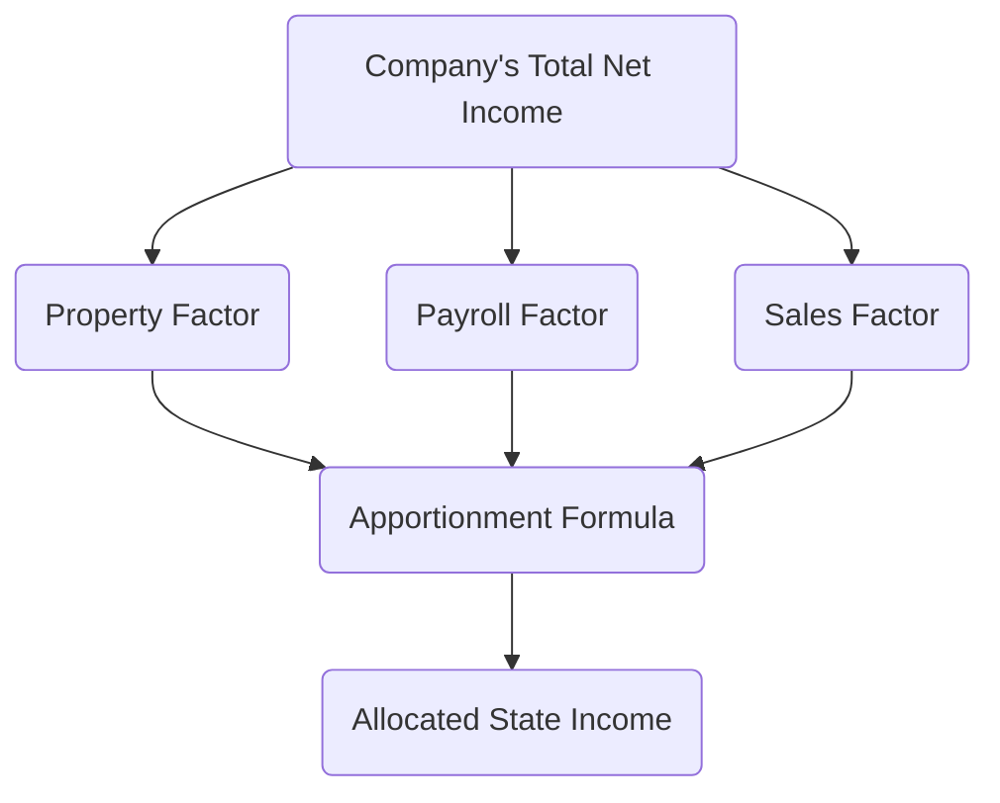

## 23.2 Nexus & Apportionment Formula Variations

State and local taxation (SALT) poses unique challenges for businesses operating across multiple jurisdictions. One of the most critical components of SALT involves determining when a business has “nexus” in a state and, if so, how much of its income should be taxed by that state. In this section, we examine the fundamental concepts of nexus and the various formulas used by states to apportion income. We also discuss single-sales factor, cost-of-performance sourcing, and market-based sourcing. This discussion aims to equip CPA candidates with the knowledge they need for their Tax Compliance and Planning (TCP) exam—while providing real-world examples to help reinforce these principles.

Introduction to Nexus  
Nexus refers to the minimum connection or presence that a taxpayer must have in a state before the state can impose its tax laws. Once nexus is established, the taxpayer may be subject to that state’s income tax, sales and use tax, and other related taxes. Traditionally, physical presence (e.g., having employees, offices, or inventory in a state) was required to create nexus. Over time, however, economic nexus rules have evolved significantly, especially for sales tax, where states may impose nexus based on sales thresholds or transaction thresholds (commonly known as “Wayfair laws” for sales tax). In the context of income tax, states also have adopted various forms of economic nexus, focusing on the degree of a business’s economic activity rather than merely physical presence.

Key Concepts in Nexus  
• Physical Presence. Traditionally, having property or employees in a state triggered nexus. This could include hosting trade shows, owning or leasing office space, or stationing staff in the state.  
• Economic Presence. A growing number of states apply an economic presence test that measures the volume or dollar amount of sales into the state. If thresholds are exceeded, nexus is established regardless of whether the company has any physical presence there.  
• Attributional Nexus. States may attribute the activities of subsidiaries, affiliates, or agents to a company to determine if nexus is present. If a third party acts on behalf of the company in a way that benefits the company within a state, that may trigger nexus.  

Once a business determines it has nexus, it must figure out how to apportion its taxable income among the states in which it operates. Apportionment is crucial because it ensures that income is fairly divided among these taxing jurisdictions.

Understanding Apportionment  
Apportionment is the process of determining what percentage of a multi-state entity’s income is attributable to a particular state. Different states use different formulas to arrive at the apportionment factor, but generally, these formulas consider a combination of the following factors:  
• Sales or Receipts. A measure of statewide vs. total sales.  
• Payroll. A measure of in-state payroll vs. total payroll.  
• Property. A measure of in-state property vs. total property.  

Historically, many states used a three-factor formula that gave equal weight to the property, payroll, and sales factors. However, there has been a shift toward formulas that place more weight—or sole emphasis—on the sales factor. This move reflects state desires to encourage businesses to locate payroll and property within their borders without penalizing them with higher tax apportionment.

Single-Sales Factor: A Growing Trend  
Single-sales factor apportionment focuses exclusively on the sales factor. In such states, the apportionment percentage is calculated by dividing in-state sales by total sales. The formula may be expressed as:


\text{Apportionment Factor} = \frac{\text{In-State Sales}}{\text{Total Sales}}


This method can significantly reduce a business’s taxable income in states where it has large amounts of property or payroll but a relatively small proportion of its overall sales. Conversely, if a business’s sales are heavily concentrated in a single state, the single-sales factor can significantly increase its tax liability in that state. States like California and Georgia have adopted (or allowed the option of) single-sales factor to incentivize corporations to invest in property and payroll in-state while not being penalized for having high in-state property or payroll relative to overall operations.

Market-Based Sourcing vs. Cost-of-Performance  
Beyond determining the weighting of apportionment factors, states also differ in how they determine where sales revenue is “sourced.” Two common methods are market-based sourcing and cost-of-performance sourcing.

Market-Based Sourcing:  
Market-based sourcing assigns the sale of services (and certain intangibles) to the location where the customer receives the benefit of the service. For example, if a consulting firm headquartered in State X provides services to a client located in State Y, under market-based sourcing rules, the receipts would be allocated to State Y if that is where the benefit of the service is received.  
• Often easier to understand for businesses whose customers are clearly located in specific states.  
• May require detailed recordkeeping to determine where services are actually delivered or used.  
• States adopt different definitions of “market,” adding complexity. In some states, the “market” is where the service is delivered; in others, it might be where the customer’s billing address is located, or where the intangible property is used.

Cost-of-Performance Sourcing:  
The cost-of-performance (COP) method assigns revenue to the state where the majority of the “income-producing activities” occur, often measured in direct cost terms. Under traditional COP rules, if the preponderance (commonly more than 50%) of the direct costs to produce a service or intangible benefit occur in one state, all of the revenue is typically sourced to that state.  
• Can be advantageous for companies that centralize operations in a low-tax state because 100% of the revenue might be allocated there.  
• Can be disadvantageous for states where the final product or service is delivered if most of the “production costs” or effort come from a different state.  
• Requires thorough documentation of costs associated with producing that revenue.  

Because different states have diversely interpreted cost-of-performance rules, some states apply a “pro rata” approach (i.e., proportionately sourcing revenue based on where costs are incurred), while others use an “all-or-none” approach (i.e., assigning all revenue to the state where the majority of costs occurred).

Diagram of Apportionment Factors  
Below is a simplified Mermaid diagram illustrating how a multi-state company might handle apportionment factors. The purpose is to visualize how each aspect—property, payroll, and sales—can feed into an apportionment factor formula. Although single-sales factor apportionment has gained popularity, many states still use variations that include property and payroll.

In a single-sales factor state, the property factor (B) and payroll factor (C) might be reduced to zero or given no weight, placing all emphasis on the sales factor (D).

Hypothetical Multi-State Corporation Examples  

Example 1: Single-Sales Factor in Action  
ABC Tech Inc. operates in two states—State A uses a single-sales factor, and State B uses a traditional three-factor formula (equally weighted). Suppose ABC Tech’s sales, property, and payroll are distributed as follows:  

• Total Sales: $5 million, with $2 million in State A and $3 million in State B.  
• Total Property: $4 million, with $1 million in State A and $3 million in State B.  
• Total Payroll: $2 million, with $0.5 million in State A and $1.5 million in State B.  
• Total Net Income: $1 million.  

In State A (single-sales factor):  
Apportionment Factor = In-State Sales / Total Sales = $2 million / $5 million = 0.40 (40%)  
Thus, ABC Tech Inc. owes tax on $400,000 of its income in State A.  

In State B (traditional three-factor formula):  
Property Factor = $3 million / $4 million = 75% = 0.75  
Payroll Factor = $1.5 million / $2 million = 75% = 0.75  
Sales Factor = $3 million / $5 million = 60% = 0.60  

Overall Apportionment Factor = (0.75 + 0.75 + 0.60) / 3 = 2.10 / 3 = 0.70 (70%)  
Therefore, $700,000 of ABC Tech’s income is apportioned to State B.  

By adding the apportionment results of State A ($400,000) and State B ($700,000), ABC Tech has effectively apportioned $1.1 million across both states. Notice that this exceeds total net income of $1 million, implying “nowhere sales,” potential credits, or a possible need for transitional adjustments. Many times, states will have rules to address this, and combined/unitary filing might reduce over-apportionment, but this example shows how diverse apportionment formulas can create complexities.

Example 2: Cost-of-Performance vs. Market Sourcing  
Assume XYZ Consulting Inc. provides high-level consulting services from its single office in State C, but its clients are located across multiple states, including State D (which uses market-based sourcing) and State E (which uses cost-of-performance sourcing).  

Scenario 1: Revenue from a Client in State D (Market-Based)  
• XYZ performs all work in State C (low-tax state).  
• Client is located in State D and receives full benefit of the service there.  
Under market-based sourcing, the revenue is entirely sourced to State D because that is where the service is delivered and the benefit is received.  

Scenario 2: Revenue from a Client in State E (Cost-of-Performance)  
• XYZ again performs all work in State C.  
• Client is in State E, but E applies cost-of-performance with an “all-or-none” approach.  
Since all the direct costs to produce the consulting services occur within State C, State E might not attribute any portion of the revenue to itself. Instead, XYZ Consulting would source 100% of that revenue back to State C.  

These scenarios demonstrate how different states can apply drastically different sourcing methods, leading to potential double taxation or, in certain circumstances, no taxation if the nexus is not triggered or if sourcing rules do not attribute the income to the client’s state.

Practical Considerations and Best Practices  
• Tax Planning: Businesses should carefully evaluate where they place property, employees, and intangible assets. Understanding each state’s apportionment and nexus rules can significantly affect the overall tax picture.  
• Compliance Monitoring: Once you file in multiple states, tracking changing thresholds and evolving rules is essential. States routinely update their sourcing regulations, and new legislation or court rulings can alter ongoing filing obligations.  
• Documentation: Maintaining robust documentation around where sales occur, how services are delivered, and where costs are incurred is vital to defend positions during audits.  
• Voluntary Disclosure Agreements (VDAs): If a business discovers that they have unfiled returns or unrecognized nexus in a particular state, a VDA might offer a path toward remediation with reduced penalties.  
• State-Level Credits: Some states offer credits for taxes paid to other states, potentially reducing the risk of double taxation. Understanding and documenting these credits is crucial.  

Common Pitfalls  
• Overlooking Economic Nexus: Businesses often assume if they do not have a physical presence, they do not owe tax. This assumption is increasingly inaccurate as states adopt economic nexus standards.  
• Failing to Track In-State Usage of Software or Digital Services: Many states regard the location of where software or digital services are “used” as being critical to revenue sourcing. Businesses that fail to track IP usage may misallocate income.  
• Misappling Combined vs. Separate Filings: Certain states require (or allow) unitary combined filing, which can drastically change apportionment results. Failing to file on the correct basis can lead to significant penalties.  
• Inadequate Cost Allocation Documentation: For cost-of-performance states, incomplete records of direct vs. indirect costs can result in negative audit findings.  
• “Throwback” and “Throwout” Rules: Some states impose “throwback” or “throwout” rules for sales that are not otherwise taxed by any state, which can lead to increased apportionment in the state imposing these rules.  

Conclusion  
Nexus and apportionment represent two of the most challenging areas in multi-state taxation. As more states adopt single or heavily weighted sales factor formulas and shift toward market-based sourcing for services and intangibles, it is vital for businesses (and future CPAs) to understand how these rules work—and how to manage them effectively. By thoroughly reviewing each state’s specific apportionment guidance, carefully documenting where sales occur, and staying attuned to legislative updates, taxpayers can strike a balance that minimizes the risk of double taxation while maintaining compliance.

References and Further Exploration  
• Multistate Tax Commission (MTC): Offers model rules on apportionment and uniform definitions of factors.  
• State Department of Revenue Websites: Each state publishes its own rules, regulations, bulletins, and guidance.  
• CCH IntelliConnect and Thomson Reuters Checkpoint: Excellent tools for comprehensive SALT research.  
• Online Courses: Look for specialized SALT or multi-state taxation courses to deepen your expertise.  

Use this foundational knowledge to guide you through state-specific complexities. Once you have mastered the basics, continue researching the nuances and exceptions that can arise in each jurisdiction, especially regarding combined reporting, pass-through entities, and partnership nexus. By understanding nexus requirements and apportionment variations, you’re better positioned to successfully navigate compliance requirements and support strategic tax planning initiatives for multi-state corporations.

## Mastering Nexus & Apportionment: Top 10 Questions to Test Your Knowledge



### Which of the following best describes “nexus” in the context of state taxation?
- [x] The minimum connection or presence required for a state to impose its tax laws on a business
- [ ] A federal requirement linking company formation documents with tax filing obligations
- [ ] A relationship between a company and a state that only applies to sales tax
- [ ] The term used to define location sourcing for intangible profits

> **Explanation:** Nexus is a term describing a threshold level of connection with a state, allowing that jurisdiction to tax the company.

### Under the single-sales factor apportionment method, which factor is used to determine income allocation?
- [x] Sales or receipts
- [ ] Payroll
- [ ] Property
- [ ] A combination of property, payroll, and sales

> **Explanation:** The single-sales factor bases apportionment solely on the ratio of in-state sales to total sales.

### When a state applies a market-based sourcing rule, the service revenue is generally attributed to:
- [x] The location where the customer receives the benefit of the service
- [ ] The state where the majority of payroll occurs
- [ ] The location where the service provider resides
- [ ] The state with the lowest corporate tax rate

> **Explanation:** Market-based sourcing focuses on where the benefit of the service is delivered or received, placing tax obligations in the customer’s location.

### Under cost-of-performance sourcing, the revenue from a sale of services is most often attributed to:
- [x] The state where the majority of income-producing activities or direct costs occur
- [ ] The location of the customer
- [ ] The state where the contract is signed
- [ ] The state with the highest effective tax rate

> **Explanation:** Under cost-of-performance sourcing, you allocate revenue to the state in which the service was primarily performed or where direct costs were mostly incurred.

### Which statement is most accurate about states that have shifted to single-sales factor formulas?
- [x] They aim to encourage businesses to invest in property and labor in their state without penalizing them in apportionment.
- [ ] They intend to prioritize property and payroll factors more than the sales factor.
- [x] They apply a weight of at least 50% to the property factor at all times.
- [ ] They legally prohibit any cost-of-performance sourcing rules.

> **Explanation:** Single-sales factor states generally seek to incentivize businesses to locate property and payroll in the state by using sales as the main driver of apportionment.

### Which of the following is a main advantage of the cost-of-performance approach for companies locating their operations in a single low-tax state?
- [x] Potentially all of the revenue is sourced to that low-tax state
- [ ] Revenue is distributed across multiple states for a lower overall tax burden
- [ ] All property and payroll factors are eliminated from the formula
- [ ] It increases property taxes in that state

> **Explanation:** If a significant portion of direct costs occurs in a low-tax state, most or all of the revenue may be sourced there, potentially reducing overall tax liability.

### A multi-state company calculating its apportionment factor in a three-factor formula would typically include:
- [x] Property, Payroll, and Sales
- [ ] Only Sales
- [x] Only Payroll
- [ ] Payroll, Sales, and Inventory

> **Explanation:** The classic three-factor formula uses property, payroll, and sales. Note that some states have varied weighting or have moved away from this system, but that is the traditional baseline.

### If a state uses market-sourcing for service revenue, which factor is most critical to determine correct revenue attribution?
- [x] Where the customer receives or uses the service
- [ ] The provider’s headquarters location
- [ ] The provider’s physical presence or office location
- [ ] The average cost of producing the service

> **Explanation:** Market-sourcing revolves around the customer’s location and where the benefit is received, not where the provider is based or the costs incurred.

### In the context of single-sales factor apportionment, how might a business reduce its apportionment factor in a particular state?
- [x] Reduce the volume of sales directed to that state
- [ ] Increase the headcount of employees in that state
- [ ] Move corporate headquarters to that state
- [ ] Shift to a partnership structure

> **Explanation:** Because single-sales factor apportionment depends only on the ratio of in-state sales to total sales, lowering the volume of in-state sales can reduce the apportionment factor.

### True or False: Throwback rules generally require that sales not taxed by any state be “thrown back” and included in the originating state’s tax base.
- [x] True
- [ ] False

> **Explanation:** Throwback rules direct sales that are not subject to a specific state tax to be “thrown back” to the original state, increasing that state’s sales factor.



---

## For Additional Practice and Deeper Preparation

**[TCP CPA Hardest Mock Exams: In-Depth & Clear Explanations](https://www.udemy.com/course/tcp-cpa-mock-exams/?referralCode=675149871D0E79B1699C)**  

**Tax Compliance & Planning (TCP) CPA Mocks:** 6 Full (1,500 Qs), Harder Than Real! In-Depth & Clear. Crush With Confidence!

- Tackle full-length mock exams designed to mirror real TCP questions.  
- Refine your exam-day strategies with detailed, step-by-step solutions for every scenario.  
- Explore in-depth rationales that reinforce higher-level concepts, giving you an edge on test day.  
- Boost confidence and minimize anxiety by mastering every corner of the TCP blueprint.  
- Perfect for those seeking exceptionally hard mocks and real-world readiness.  

_Disclaimer: This course is not endorsed by or affiliated with the AICPA, NASBA, or any official CPA Examination authority. All content is for educational and preparatory purposes only._
