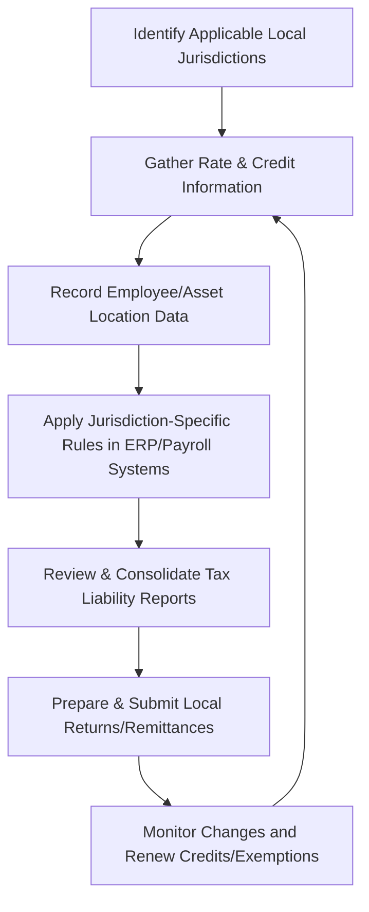

## 23.3 Local Jurisdiction Compliance & Credits

Local tax obligations often introduce additional layers of complexity beyond state and federal requirements. Many city governments, counties, and other municipalities impose unique tax regimes, rates, and credits that can vary widely—even within neighboring areas. This chapter provides a comprehensive exploration of local tax systems, specialized credits, and mechanisms to effectively manage overlapping compliance burdens. By integrating these insights, CPA candidates and practitioners can navigate the intricacies of local-level taxation and help their clients (or organizations) optimize tax positions while remaining compliant.

---

### Understanding Local Tax Regimes

Local jurisdictions—whether city, county, or regional—often levy a variety of taxes. These can include local income taxes, payroll taxes, sales and use taxes, and other specialized levies (e.g., hotel occupancy taxes, tourism taxes). Some notable points:

• Local Income Taxes: Certain cities (e.g., New York City, Philadelphia, and certain large metropolitan areas) impose an individual income tax or wage tax. These differ from state-level taxes in rates, credits, and filing requirements.  
• Payroll/Occupational Taxes: Some jurisdictions tax employers directly, requiring them to remit taxes based on the wages they pay. These obligations might apply even if the employer is not physically located in the city but has employees who work there.  
• Property Taxes: While typically administered by counties, large metropolitan areas may impose supplemental property or real estate transfer taxes. Changes in assessed values can create complexities in planning for multi-state real estate owners or partnerships.  
• Sales & Use Taxes: Certain localities tack on additional sales taxes beyond the state rate. In turn, businesses must track tax rates by specific regions to accurately compute total tax due to the appropriate local government.  

#### Layered Compliance and Overlapping Jurisdictions

Local compliance can be tricky because multiple overlapping jurisdictions (city, county, special districts) may impose parallel or sometimes compounding obligations. For instance, a business located in a particular city may need to register for:

• The city’s business license and associated taxes.  
• A county property tax account for real or personal property.  
• A transit district’s payroll tax if operating within certain boundaries.  

Recordkeeping and coordination become especially important if the business is expanding to new locations or if employees live in one local jurisdiction but work in another. This cross-jurisdiction dynamic can trigger dual local tax liabilities, with the potential for reciprocal agreements or credit provisions to mitigate double taxation.

---

### Key Local Jurisdiction Credits

Many local jurisdictions offer incentives to promote specific activities or economic development within their region. These local-level credits can be surprisingly valuable but are often overlooked. Examples include:

• Job Creation Credits: Some cities reward employers who create new local jobs or expand their workforce within city limits. These credits can apply to wage taxes, business license fees, or other local levies.  
• Infrastructure & Redevelopment Credits: In areas aiming to revitalize certain districts, businesses investing in infrastructure upgrades or renovating older buildings may qualify for targeted property tax abatements or credits.  
• Green Initiatives & Sustainability Credits: Local governments increasingly use tax incentives for environmentally friendly initiatives, such as solar panel installations, EV charging stations, or green-roof projects.  
• Historically Underutilized Business (HUB) Zone Credits: Although often orchestrated at the federal level, some localities mirror or supplement these credits with their own versions, providing property or income tax relief for businesses located in designated “revitalization” zones.

Below is a simplified example of how a local city might structure tax credits for a small business making energy-efficient building improvements:

| Improvement Type              | Credit Type    | Credit Rate            | Maximum Benefit        |
|-------------------------------|----------------|-------------------------|------------------------|
| Solar energy installations    | Property Tax   | 50% reduction in added assessment for new solar improvements  | $200,000 of property tax value |
| Energy-efficient HVAC systems | Sustainable Grants or Rebates | Up to 20% refund on installation costs | $50,000 total costs eligible |
| EV charging station           | Business License Fee Credit | $500 credit/charging station | Max $10,000 per location |

Practitioners must keep abreast of new or expiring local ordinances to time investments appropriately and ensure eligibility documentation is compiled for credit claims.

---

### Navigating Local Filing Requirements

Local compliance typically requires separate filing and payment processes, in addition to state and federal returns. Whether you are dealing with a local wage tax or claiming a local credit, the steps may be distinct from the standard tax processes. Consider:

• Timing: Some localities align due dates with state-level returns, while others have distinct deadlines and quarterly or monthly payment schedules.  
• Forms & Documentation: Each local jurisdiction may use specialized forms beyond state forms. For instance, businesses might need to submit local estimates on a separate schedule or provide project-specific documentation for local credits.  
• Electronic vs. Paper Filings: Many smaller municipalities have limited e-filing capabilities, necessitating manual or paper submissions. However, large metropolitan areas often have advanced electronic portals for remittances and credit applications.

---

### Best Practices for Consolidated Reporting

When an entity does business across multiple local jurisdictions, confusion can arise. Implementing robust tracking and consolidation is crucial:

• Consistent Accounting Codes: Use unique expense and liability codes to track each jurisdiction’s obligations, enabling more accurate reporting and easier retrieval of data.  
• Automated Software & Geo-Positioning: Many payroll and enterprise resource planning systems now integrate geo-positioning to automatically compute local rates based on employees’ work site or activity location.  
• Decentralized vs. Centralized Reporting: Larger organizations often maintain decentralized teams who handle local compliance. A best practice is to unify the reporting under a central tax department that can cross-verify the local compliance data, ensuring consistency.  

The following Mermaid diagram illustrates a high-level workflow for handling multiple local tax regimes within a single organization:

In this diagram:  
• Step A ensures the organization pinpoints each relevant jurisdiction.  
• Step D emphasizes the importance of enterprise systems that can automatically apply local tax rules.  
• Step G ensures continuous updating for changes in local tax laws.

---

### Case Study: Multi-City Business Expansion

Imagine a small manufacturing company headquartered in “City A” that seeks to expand and open a satellite facility in “City B.” Initially, the business is accustomed to a state-level corporate tax plus simple local property tax obligations in City A. Upon deciding to operate in City B, the entity must now consider:

• Wage Taxes: Unlike City A, City B imposes a wage tax on employees working more than 50% of their time within city limits. The company must register with City B’s tax authority and withhold wage tax from paychecks.  
• Inventory & Inventory-Based Taxes: City B has a local business privilege tax based on inventory levels and gross receipts. Even a temporary inventory in a warehouse can trigger this local obligation.  
• Local Credits: On the upside, City B offers a “new hire credit” of $1,000 for each local resident the company employs. By recruiting 10 local residents, the business can offset a portion of the new warehouse’s property tax.  

After analyzing both financial and workforce data, the business determines its total local tax burden in City B is still manageable, especially given the valuable local credits available. The expansion moves forward, and the business invests in specialized software to track wage taxes by work location.

---

### Addressing Local Credits in Tax Planning

Local credits often require proactive planning. They may entail unique qualification criteria, such as maintaining a minimum number of full-time employees for a specified period, or requiring infrastructure improvements that align with city goals. Key strategies include:

• Early Engagement: Reach out to economic development offices or city agencies before initiating a project to identify any available credits or abatements.  
• Future-Proofing: Some local incentives reduce over time or phase out if legislative priorities shift. Understand the “sunset” clauses for local credits and factor them into long-term plans.  
• Combine with State and Federal Incentives: In many cases, you can “stack” local credits on top of state enterprise zone credits or federal empowerment zone incentives, leading to a greater overall tax reduction.  

---

### Common Pitfalls and Challenges

Despite their benefits, local credits and taxes can present pitfalls:

• Compliance Overload: Managing multiple local returns and credit forms can strain small finance teams. A misallocation of resources or overlooked filing can trigger penalties.  
• Under-Documentation: Local credits often demand proof of compliance (e.g., building permits, new hire rosters). Failing to maintain these records can result in a credit denial—or require payback if the city audits.  
• Changing Regulations: Local ordinances can shift quickly, especially with new political leadership. Credits can be created, modified, or repealed with little warning.  
• Nexus Surprises: Businesses might unknowingly create nexus in a locality by sending remote employees to coworking spaces, storing goods in a third-party warehouse, or even attending trade shows.  

---

### Strategies for Streamlining the Compliance Burden

To address these hurdles, organizations should incorporate effective strategies:

• Centralized Compliance Calendar: Maintain a master schedule of filing deadlines, renewal dates for credits, and local registration requirements.  
• Periodic Jurisdictional Review: Reassess where the business’s employees, assets, and revenue streams are located or generated. Identify new local liabilities early.  
• Bulk Data Sharing Among Tax Authorities: Some local governments may share data with the state, or vice versa. Coordinating with the state-level filings can reduce duplication if certain data points overlap.  
• Third-Party Specialist Consultations: If local taxes are highly specialized (e.g., tourism districts, port authority taxes), consider working with consultants familiar with that locale’s nuances.

---

### Diagram: Local Tax Compliance Planning Cycle

Below is a more strategic planning cycle diagram, showing how a CPA or tax manager may evaluate local taxes and credits regularly:

1. Develop an overarching strategy aligned with the entity’s business goals.  
2. Gather detailed local tax and credit data.  
3. Apply that information to determine eligibility for local incentives and refine the company’s cost/benefit analysis.  
4. Implement necessary system changes and file for any relevant local credits.  
5. Track legislative and administrative updates.  
6. Periodically review internal compliance systems for improvement, feeding lessons learned back into strategy.

---

### Technology and Data Management for Local Taxes

With technological advances, many solutions now automate local tax calculations in real-time, especially for payroll and sales tax compliance. Key features of modern compliance software:

• Location-Based Tax Assignment: Systems automatically apply the correct tax rate based on an address or geolocation.  
• Real-Time Updates: Providers push timely updates to reflect newly passed ordinances or rate changes.  
• Integrated Audit Trails: Detailed transaction-level data is cataloged, simplifying potential audits by local authorities.  
• Multi-Jurisdiction Forecasting: Some platforms project upcoming local tax liabilities and potential credits if expansions or larger-scale relocations occur.

Even with robust tech solutions, human oversight remains essential to confirm data accuracy, especially when policy changes are introduced by city councils or local referenda.

---

### Looking Ahead: Local-Level Tax Trends

• Increased Collaboration with States: Some states strive for uniform platforms that streamline local tax filing, hoping to encourage business growth and limit confusion.  
• Rise of Specialized “Microzone” Taxes: Certain areas experiment with “microzones” for economic revitalization, layering additional or alternative taxes. Understanding these ephemeral zones is critical.  
• Technology-Driven Audits: As localities adopt digital auditing tools, scrutiny on business operations expands. Companies must be prepared to reconcile local data with state and federal figures.  
• Sustainability & Equity Credits: Expect an expansion of credits focusing on green initiatives, urban renewal, and equitable hiring. CPAs need to track these dynamic policy areas to guide clients toward beneficial tax structures.

---

### References and Further Exploration

• Internal Revenue Code (IRC) Sections with Local Implications: While most local taxes do not fall directly under the IRC, cross-references to state and federal tax provisions can reduce redundancy in compliance.  
• City Ordinance Databases: Platforms like Municode (municode.com) or direct city websites provide up-to-date legal references.  
• National League of Cities Publications: Offers research and best practices on municipal governance and finance.  
• Government Finance Officers Association (GFOA): gfoa.org—provides recommended practices on local government financial management and reporting.

---

## Mastering Local Jurisdiction Compliance & Credits: A CPA’s Guide – Quiz



### In many large metropolitan areas, which tax is often levied in addition to state taxes?
- [x] Local income or wage tax
- [ ] Mandatory excise tax on groceries
- [ ] Federal partnership tax
- [ ] Surplus distribution tax from local credit unions

> **Explanation:** Cities like New York and Philadelphia may impose a local income or wage tax on top of state and federal tax obligations.

### What is one potential benefit of local tax credits for businesses?
- [x] They can reduce property tax liability if specific criteria are met.
- [ ] They eliminate the need to file federal returns.
- [ ] They automatically exempt the business from all state-level tax audits.
- [ ] They increase the company’s minimum wage requirement.

> **Explanation:** Local credits—like property tax abatements or job creation incentives—can significantly reduce a company’s tax burden when eligibility criteria are satisfied.

### Which term describes the overlap of multiple cities or counties each charging tax on the same activities?
- [x] Overlapping jurisdictions
- [ ] Conservation easements
- [ ] Environmental surcharges
- [ ] Federal nexus shifting

> **Explanation:** Overlapping jurisdictions occur when more than one local authority has taxing power over the same taxpayer or economic activity, necessitating careful compliance to avoid double taxation.

### Which of the following is a common local tax credit category linked to ecological improvement?
- [x] Green initiatives and sustainability credits
- [ ] Bundled charitable contributions
- [ ] Cross-border supply chain reductions
- [ ] Federal intangible property amortization

> **Explanation:** Many cities incentivize eco-friendly improvements or installations (e.g., solar roofs, EV charging stations) through local sustainability credits.

### Which approach can help manage multi-jurisdiction filings efficiently?  
- [x] Maintaining a centralized compliance calendar
- [ ] Only using paper filings for all local returns
- [x] Implementing automated geo-positioning in payroll systems
- [ ] Eliminating all local credit applications to reduce complexity

> **Explanation:** A centralized compliance calendar ensures all filing deadlines are tracked; automated geo-positioning reduces the chance of assigning incorrect local rates.

### Which scenario might inadvertently trigger local nexus?
- [x] Sending a single employee to a coworking space in another city
- [ ] Filing state annual reports without disclosing local activity
- [ ] Paying only federal taxes
- [ ] Incorporating in Delaware but being headquartered elsewhere

> **Explanation:** Having employees working in a different city can create a local tax presence (nexus), which could require registration and tax filings in that locality.

### What is one challenge companies face with local credits?
- [x] The need to maintain thorough documentation
- [ ] Automatic qualification for all new businesses
- [x] Potential for rapid legislative changes to credit programs
- [ ] Elimination of federal tax obligations once local credits are claimed

> **Explanation:** Local credits can be subject to frequent changes by city councils, and they often require substantial documentation to prove eligibility.

### How do local jurisdictions often encourage hiring within city limits?
- [x] Offering job creation credits or incentives
- [ ] Mandating volunteer work
- [ ] Eliminating all business licensing fees
- [ ] Replacing all state-level taxes with local taxes

> **Explanation:** Many municipalities offer financial motivations for creating jobs locally, such as wage tax credits per employee hired from within the community.

### Why might a local government share taxpayer information with state authorities?
- [x] To improve compliance and reduce redundant audits
- [ ] To enforce the closure of businesses across shortfalls
- [ ] To eliminate sales tax altogether
- [ ] It is legally prohibited in all circumstances

> **Explanation:** Data-sharing between local and state offices helps streamline compliance, reduce duplicative audits, and identify missing filings or unreported income.

### Which statement is true regarding next-generation local tax enforcement?
- [x] Technology-driven audits can cross-reference local data with broader tax filings.
- [ ] All local tax audits must be performed in-person.
- [ ] Localities cannot audit businesses that are registered with the state.
- [ ] Municipalities only audit non-profit organizations.

> **Explanation:** As localities adopt digital tools and data analytics, audits can be cross-referenced with state or federal returns to identify possible discrepancies.



---

## For Additional Practice and Deeper Preparation

**[TCP CPA Hardest Mock Exams: In-Depth & Clear Explanations](https://www.udemy.com/course/tcp-cpa-mock-exams/?referralCode=675149871D0E79B1699C)**  

**Tax Compliance & Planning (TCP) CPA Mocks:** 6 Full (1,500 Qs), Harder Than Real! In-Depth & Clear. Crush With Confidence!

- Tackle full-length mock exams designed to mirror real TCP questions.  
- Refine your exam-day strategies with detailed, step-by-step solutions for every scenario.  
- Explore in-depth rationales that reinforce higher-level concepts, giving you an edge on test day.  
- Boost confidence and minimize anxiety by mastering every corner of the TCP blueprint.  
- Perfect for those seeking exceptionally hard mocks and real-world readiness.

_Disclaimer: This course is not endorsed by or affiliated with the AICPA, NASBA, or any official CPA Examination authority. All content is for educational and preparatory purposes only._
